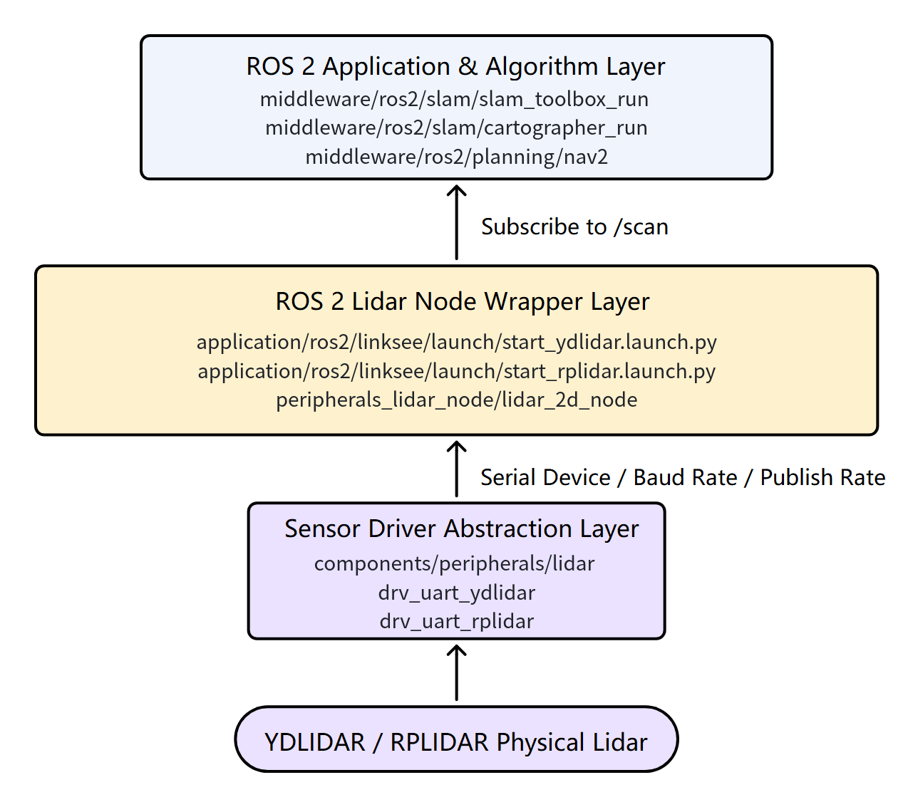
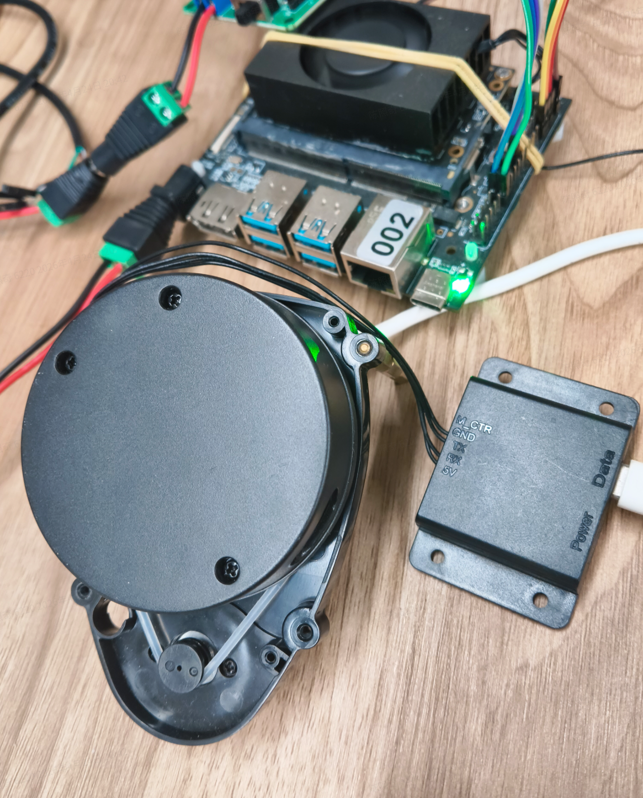
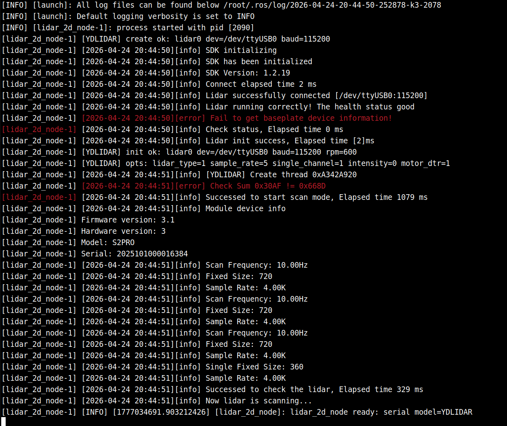
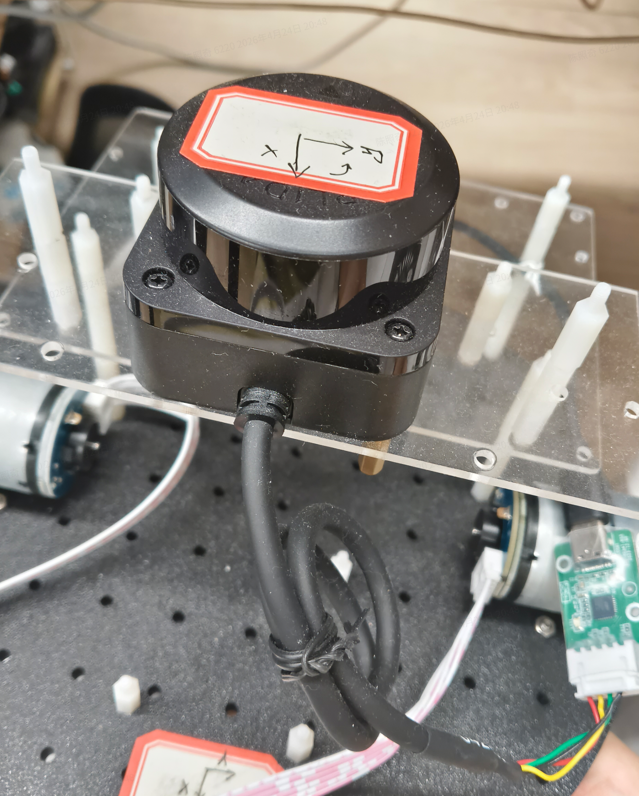
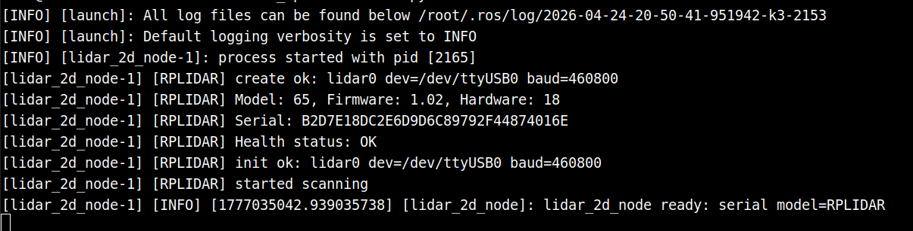

# Basic Sensors · Lidar

## 1. Overview

- **Key Features**: This module provides unified 2D lidar access within the project, hiding driver differences across vendor lidars and stably publishing `LaserScan` data to ROS 2 upper-level applications. In the current project, the lidar is typically used as a basic sensor in the `linksee` mobile robot solution, providing `/scan` input to modules such as `slam_toolbox`, `cartographer`, and `nav2`.
- **Specifications and Features**:
	- Supported drivers: `YDLIDAR`, `RPLIDAR`;
	- Interface: serial 2D lidar, default device node `/dev/ttyUSB0`;
	- ROS 2 node: `lidar_2d_node` in the `peripherals_lidar_node` package;
	- Default output topic: `/scan`;
	- Default coordinate frame: `laser_link`;
	- Typical parameters: 10 Hz scan frequency, range `0.1m ~ 30m`;
	- `YDLIDAR X3 Pro` defaults to a serial baud rate of `115200`, and `RPLIDAR C1` defaults to `460800`.
- **Software Block Diagram**: In the current project, the lidar module's position in the ROS 2 usage chain is as follows:



- **Directory Structure**:

| Path | Responsibility |
| --- | --- |
| `components/peripherals/lidar/` | Lidar component abstraction layer, uniformly manages drivers for different models |
| `components/peripherals/lidar/src/drivers/drv_uart_ydlidar/` | `YDLIDAR` serial driver implementation |
| `components/peripherals/lidar/src/drivers/drv_uart_rplidar/` | `RPLIDAR` serial driver implementation |
| `application/ros2/linksee/launch/start_ydlidar.launch.py` | ROS 2 launch entry for `YDLIDAR` under the `linksee` solution |
| `application/ros2/linksee/launch/start_rplidar.launch.py` | ROS 2 launch entry for `RPLIDAR` under the `linksee` solution |
| `application/ros2/linksee/config/ydlidar_x3_pro.yaml` | Default ROS 2 parameter configuration for `YDLIDAR X3 Pro` |
| `application/ros2/linksee/config/rplidar_c1.yaml` | Default ROS 2 parameter configuration for `RPLIDAR C1` |
| `application/ros2/linksee/README.md` | Chinese description of the `linksee` package, including the basic startup sequence |

## 2. Environment Setup

### Prerequisites

For SDK source acquisition and basic build environment configuration, refer to [Linksee Reference Solution](../../03-参考方案/3.2-轮式机器人Linksee.md). After completing SDK initialization, return here to continue.

- **Runtime Environment**:
	- Recommended system: K3 board-side Bianbu / Ubuntu-compatible runtime environment;
	- ROS version: ROS 2 Humble;
	- Build method: top-level project `envsetup.sh + lunch + m/mm`, or standard ROS 2 `colcon build`;
	- Runtime dependencies: `rclcpp`, Launch, Lifecycle Node runtime environment.
- **Dependencies and External Resources**:
	- ROS 2 base environment installed;
	- It is recommended to install the full-system dependencies as described in the `linksee` documentation;
	- The third-party SDKs corresponding to the lidar drivers have integrated fetch logic at the component layer;
	- For joint debugging with navigation or mapping, you also need to install related ROS 2 components such as `slam_toolbox`, `cartographer`, and `nav2`.
- **Environment Variables and Initialization**:

   ```bash
   source ~/spacemit_robot/output/staging/setup.bash
   ```

	If building in a standalone workspace, use:

    ```bash
    source /opt/ros/humble/setup.bash
    source install/setup.bash
    ```

- **Hardware and Connections**:
	- Board type: `k3-com260` or an equivalent board supported by the current project;
	- Peripheral: serial 2D lidar, such as `YDLIDAR X3 Pro` or `RPLIDAR C1`;
	- Connection: USB-to-serial or onboard serial port mapped to `/dev/ttyUSB*`;
	- Before use, confirm the lidar has stable power, rotates normally, and its mounting orientation is consistent with the `laser_link` frame convention.
- **Tools and Permissions**:
	- Serial device access permission is required;
	- If permission is insufficient, add the current user to the `dialout` group;
	- It is recommended to use tools such as `rviz2`, `ros2 topic list`, `ros2 topic echo`, and `ros2 lifecycle` for joint debugging.

### Build

- **Getting the Code**: This module is fetched together with the whole repository; no separate checkout is needed. Refer to [2.3 Build and Compile](../../02-快速入门/2.3-构建编译.md) or the [Linksee Reference Solution](../../03-参考方案/3.2-轮式机器人Linksee.md) to obtain the complete project via `repo init` / `repo sync`.
- **Module Compilation**:
    1. Load the environment at the top level of the project:

       ```bash
       cd /path/to/spacemit_robot
       source build/envsetup.sh
       lunch # select the linksee solution
       ```

	2. Full build:

       ```bash
       m
       ```

	3. If you only modified ROS 2-side packages, enter the corresponding directory and run:

       ```bash
       cd application/ros2/linksee
       mm
       ```

- **Artifacts**:
	- The ROS 2 runtime environment after the SDK build is located in `output/staging/`;
	- The Launch and parameter files required for lidar startup are installed into the `linksee` package shared directory;
	- The actual running node is `lidar_2d_node` in `peripherals_lidar_node`.
- **Common Differences**:
	- `YDLIDAR` and `RPLIDAR` have different default baud rates; when switching models you must also swap the launch file or parameter file;
	- Upper-level mapping/navigation modules uniformly subscribe to `/scan`, so switching lidar models usually requires no changes to the algorithm nodes as long as the topic and coordinate frame stay consistent.

## 3. Example Usage

This section focuses on the ROS 2-side usage in the current project. The example commands follow the actual startup sequence used in the `linksee` solution.

### 3.1  `YDLIDAR X3 Pro`

**Prerequisites**: See Section 2. By default, the lidar is correctly connected to the board, the device node exists, and the project has been built.

**Hardware Appearance:**



**Step 1: Load the runtime environment**

```bash
source ~/spacemit_robot/output/staging/setup.bash
```

**Expected result**: no errors in the terminal; the `linksee` package and related Launch files are recognized.

**Step 2: Start the lidar**

```bash
ros2 launch linksee start_ydlidar.launch.py
```

**Expected result**: `lidar_2d_node` starts normally in the terminal, with no serial-open-failure or driver-initialization-failure logs.



**Step 3: Check the topic output**

Open a new terminal and run:

```bash
source ~/spacemit_robot/output/staging/setup.bash
ros2 topic echo /scan
```

**Expected result**: `/scan` continuously outputs `sensor_msgs/msg/LaserScan` data, with `frame_id` set to `laser_link`.


**Step 4: Use for mapping or navigation joint debugging**

In the `linksee` solution, the lidar is typically debugged together with the chassis and navigation modules. You can continue in the following order:

```bash
source ~/spacemit_robot/output/staging/setup.bash
ros2 launch linksee base_control_esos.launch.py
```

New terminal:

```bash
source ~/spacemit_robot/output/staging/setup.bash
ros2 launch linksee start_odom.launch.py
```

New terminal:

```bash
source ~/spacemit_robot/output/staging/setup.bash
ros2 launch nav2 nav2.launch.py
```

**Expected result**: `nav2` can subscribe to `/scan`, and the laser observation source in the costmap updates normally.

### 3.2  `RPLIDAR` C1 Verification

**Hardware Appearance**



**Step 1: Load the runtime environment**

```bash
source ~/spacemit_robot/output/staging/setup.bash
```

**Step 2: Start `RPLIDAR`**

```bash
ros2 launch linksee start_rplidar.launch.py
```

**Expected result**: the terminal shows `lidar_2d_node` has started, and the lidar begins publishing scan data stably.



**Step 3: Confirm the basic parameters match the hardware**

To check the default configuration, view:

```bash
grep -n "serial_baudrate\|model\|topic_name\|frame_id" ~/spacemit_robot/application/ros2/linksee/config/rplidar_c1.yaml
```

**Expected result**: you can see configurations such as `model: "RPLIDAR"`, `serial_baudrate: 460800`, `topic_name: "scan"`, and `frame_id: "rplidar_link"`.

**Step 4: Check the topic list**

```bash
source ~/spacemit_robot/output/staging/setup.bash
ros2 topic list | grep scan
```

**Expected result**: the output includes `/scan`.

## 4. Application Development

- **API / Interface**:
	- ROS 2 launch entries: `ros2 launch linksee start_ydlidar.launch.py`, `ros2 launch linksee start_rplidar.launch.py`;
	- Running node: `peripherals_lidar_node/lidar_2d_node`;
	- Main output topic: `/scan`;
	- Key parameter files: `ydlidar_x3_pro.yaml`, `rplidar_c1.yaml`.
- **Usage and Notes**:
	- It is recommended to keep the topic name fixed as `/scan` for easy integration with `slam_toolbox`, `cartographer`, and `nav2`;
	- When changing the lidar model, also check parameters such as `model`, `serial_port`, `serial_baudrate`, `inverted`, and `angle_compensate`;
	- The recommended startup order is "chassis/TF → lidar → mapping/navigation"; avoid jumping straight into high-level algorithm debugging before the basic chain is established;
	- For navigation integration, ensure the TF configuration from `laser_link` to the robot chassis frame is correct.
- **Reference demos and example paths**:
	- `application/ros2/linksee/launch/start_ydlidar.launch.py`
	- `application/ros2/linksee/launch/start_rplidar.launch.py`
	- `application/ros2/linksee/config/ydlidar_x3_pro.yaml`
	- `application/ros2/linksee/config/rplidar_c1.yaml`
	- `components/peripherals/lidar/README.md`

## 5. Debugging Guide

- **Check the serial link first**: confirm whether `/dev/ttyUSB0` exists and the current user has access. If the startup log reports a serial-open failure, prioritize checking permissions, cabling, power supply, and baud rate.
- **Check the node and topic first**: after startup, first confirm whether `lidar_2d_node` has started, then check whether `/scan` is continuously published, rather than jumping directly into mapping or navigation joint debugging.
- **Key parameter tuning points**:
	- For `YDLIDAR`, focus on: `serial_baudrate`, `inverted`, `angle_compensate`;
	- For `RPLIDAR`, focus on: `serial_baudrate`, `scan_bins`, `angle_compensate`;
	- If the laser direction is reversed, or the map is mirrored or rotated abnormally, check `inverted`, `flip_x_axis`, and the extrinsic coordinate frame first.
- **Recommendations for joint debugging with upper-level modules**:
	- If `slam_toolbox` or `cartographer` cannot build a map, first confirm `/scan` is normal;
	- If the `nav2` costmap has no obstacle updates, first confirm whether the observation source topic in its configuration is `/scan`;
	- When using RViz, it is recommended to view `LaserScan`, `TF`, and the robot model together.
- **What to collect when debugging with hardware/kernel colleagues**:
	- Lidar model, serial device node, actual baud rate;
	- Whether it rotates stably, whether it occasionally disconnects;
	- The parameter file currently in use and whether it has been modified;
	- Whether the startup log has key errors such as initialization failure or scan-start failure.

## 6. FAQ

| Symptom | Possible Cause | Resolution |
| --- | --- | --- |
| No data output after running `ros2 launch linksee start_ydlidar.launch.py` | Insufficient serial permissions, lidar not recognized, baud rate mismatch | First check whether `/dev/ttyUSB0` exists, then check `serial_port` and `serial_baudrate` in the parameter file, and grant the current user serial access if necessary |
| `/scan` exists, but the laser direction is abnormal or the map is mirrored in RViz | `inverted`, `flip_x_axis`, or the lidar mounting orientation is misconfigured | Check the orientation-related parameters in `ydlidar_x3_pro.yaml` or `rplidar_c1.yaml`, and verify the `laser_link` extrinsics |
| Startup fails after switching to `RPLIDAR` | Still using the `YDLIDAR` configuration or the default baud rate is inconsistent | Switch to `ros2 launch linksee start_rplidar.launch.py` and confirm the configuration is `model: "RPLIDAR"` with a baud rate of `460800` |
| No laser obstacles visible during navigation | `nav2` is not subscribed to `/scan`, or the lidar data is not being published normally | First verify the data with `ros2 topic echo /scan`, then check whether the observation source in the navigation configuration points to `/scan` |
| Poor mapping quality, distorted map | Inaccurate lidar direction, large chassis odometry error, incomplete TF | Verify item by item in the order "lidar → TF → odometry → mapping"; do not tune algorithm parameters directly while the basic chain is abnormal |
