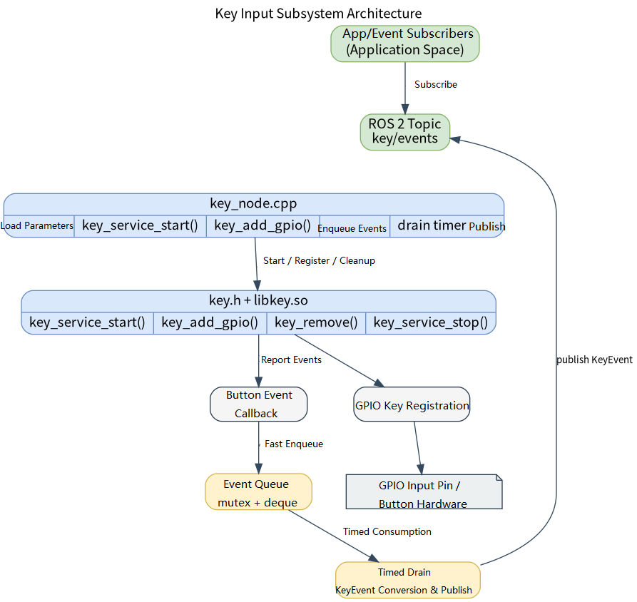
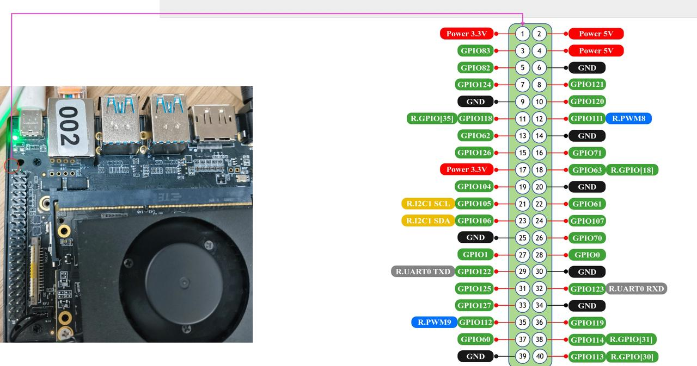

# Basic Sensors · Button / Key

## 1. Overview

- **Key Features**: The button module sits in the basic sensor capability layer of the robot development stack. It wraps the `components/peripherals/key` userspace GPIO button component at the lower level and exposes a ROS 2 node `key_node` and a button-event topic at the upper level. The module converts physical GPIO level changes into discrete events — press, release, single click, double click, long press, and long-press repeat — for subscription by upper-level applications, interaction logic, or state machines.
- **Specifications and Features**: The external interface is the ROS 2 topic `peripherals_key_node/msg/KeyEvent`, with a default topic name of `/key/events`; the node name is fixed as `key_node`; the publish queue depth is `32`; the default event-queue flush period is `10 ms`; multiple GPIO buttons can be registered at once; each button can be configured with a logical `key_id`, Linux GPIO number, active level, long-press threshold, double-click window, and log name. The underlying layer depends on `libkey.so`, `key.h`, `libgpiod`, and `/dev/gpiochip*`.
- **Software Block Diagram**:



- **Directory Structure**:

| Path | Responsibility |
| --- | --- |
| `middleware/ros2/peripherals/key/src/key_node.cpp` | ROS 2 button node implementation — loads parameters, registers underlying GPIO buttons, buffers callback events, and publishes `KeyEvent` |
| `middleware/ros2/peripherals/key/params/key_node.yaml` | Default node parameter file — contains default topic, `frame_id`, publish period, and button array configuration |
| `middleware/ros2/peripherals/key/CMakeLists.txt` | `peripherals_key_node` package build file — finds `key.h` and `libkey.so` and generates executable `key_node` |
| `middleware/ros2/peripherals/key/package.xml` | ROS 2 package metadata and dependency declarations |
| `middleware/ros2/peripherals/key/msg/KeyEvent.msg` | Button event message definition |
| `components/peripherals/key/include/key.h` | Low-level button component C API, event enums, and `key_config_t` configuration struct |
| `components/peripherals/key/src/key.c` | Low-level GPIO reading, debounce, and event recognition implementation |
| `components/peripherals/key/test/test_key.c` | Low-level button component self-test program — useful for first ruling out hardware and GPIO configuration issues |

## 2. Environment Setup

### Prerequisites

- **Runtime Environment**: Recommended board environment is `k3-com260` with matching system image.
- **Hardware and Connections**: The target board must expose a GPIO controller accessible from Linux, and physical buttons or a button board must be connected. Confirm the Linux logical GPIO number, active level, and pull-up/pull-down configuration for each button. The current demo program defaults to using `GPIO113` and `GPIO114`, both configured as active-high.
- **Tools and Permissions**: The running user needs access to `/dev/gpiochip*`; if device node permissions are not open, use `sudo` to run the demo program.

### Build

- **Getting the Code**: See the [2.3 Building and Compilation](../../02-快速入门/2.3-构建编译.md) section for cloning the complete SDK using the `repo` tool. The following build and test commands are all run inside the SDK.
- **Module Compilation**: Build in dependency order — compile the low-level button component first, then the ROS 2 node package (which includes its own `KeyEvent.msg`):

  ```bash
  source build/envsetup.sh

  ./build/build.sh package components/peripherals/key
  ./build/build.sh package middleware/ros2/peripherals/key
  ```

  Expected artifacts: `output/staging/lib/peripherals_key_node/key_node`, `output/staging/share/peripherals_key_node/params/key_node.yaml`, `output/staging/lib/libkey.so`, and the ROS 2 interface install files for `peripherals_key_node/msg/KeyEvent`. If the current target is not `riscv64`, refer to the actual `output/<target>/staging` or `output/staging` as appropriate.

- **Common Differences**: The `CMakeLists.txt` of `peripherals_key_node` searches for `key.h` and `libkey.so`; if `components/peripherals/key` has not been built first, it reports `key.h or libkey not found`. The top-level key in the ROS 2 parameter file must be the actual node name `key_node`, not the package name `peripherals_key_node`.

## 3. Example Usage (From Scratch)

This section walks through the primary workflow **step by step**.

### 3.1 Example 1: Start the ROS 2 Button Node and Observe Events

**Prerequisites**: Physical buttons are connected to the target board; the `gpio_nums` and `active_lows` in the current parameter file match the actual hardware; the current user has access to `/dev/gpiochip*`.

This example uses GPIO83 on the K3-CoM260 development board. You can short it to GND with a jumper wire to simulate a physical button press.




**Step 1**: Navigate to the SDK source directory and load the runtime environment.

```bash
source output/staging/setup.bash
```

Expected result: `ros2 pkg executables peripherals_key_node` shows `peripherals_key_node key_node`.

**Step 2**: Confirm or modify the button parameter file. The default path after installation is:

```bash
output/staging/share/peripherals_key_node/params/key_node.yaml
```

The default contents are equivalent to:

```yaml
key_node:
  ros__parameters:
    event_topic: "key/events"
    frame_id: "key"
    publish_period_ms: 10
    key_ids: [0]
    gpio_nums: [83]
    active_lows: [1]
    long_press_mss: [1500]
    double_click_mss: [300]
    key_names: ["power_key"]
```

Expected result: if the actual button is not on `GPIO83` or is not active-low, modify `gpio_nums` and `active_lows` first; otherwise the node may fail to start or produce no event output.

**Step 3**: Start the button node.

```bash
ros2 run peripherals_key_node key_node \
  --ros-args \
  --params-file output/staging/share/peripherals_key_node/params/key_node.yaml
```

Expected result: the terminal prints a log similar to the following, indicating the node has started and button registration is complete.

```text
registered key: key_id=0 gpio=83 active_low=true long_press_ms=1500 double_click_ms=300 name=power_key
key_node ready: topic=/key/events, keys=1
```

**Step 4**: Open a second terminal, load the same ROS 2 environment, and subscribe to the event topic.

```bash
source output/staging/setup.bash
ros2 topic echo /key/events
```

Expected result: after pressing the physical button you should see `peripherals_key_node/msg/KeyEvent` output such as:

```yaml
header:
  stamp:
    sec: 0
    nanosec: 0
  frame_id: key
key_id: 0
event_type: 1
---
```

**Step 5**: Verify event types with different gestures.

| Action | Expected Event |
| --- | --- |
| Single short press | First `event_type=1` (pressed), then `event_type=2` (released), then `event_type=3` (single click) after the double-click window times out |
| Two quick presses | `event_type=4` (double click) after the second release |
| Long press beyond `long_press_mss` | `event_type=5` (long press triggered) |
| Continue holding after long press | Periodic `event_type=8` (long-press repeat) |

### 3.2 Example 2: Configure Multiple Buttons and Verify Broadcast Subscription

**Prerequisites**: The target board has multiple usable GPIO buttons, and the Linux GPIO number and active level for each have been confirmed.

**Step 1**: Prepare a multi-button parameter file, for example `/tmp/key_node_multi.yaml`. Note that `key_ids`, `gpio_nums`, `active_lows`, `long_press_mss`, and `double_click_mss` must be arrays of equal length; `key_names`, if provided, must also be the same length.

```yaml
key_node:
  ros__parameters:
    event_topic: "key/events"
    frame_id: "key"
    publish_period_ms: 10

    key_ids:          [0,        1,         2]
    gpio_nums:        [83,       84,        85]
    active_lows:      [1,        1,         0]
    long_press_mss:   [1500,     2000,      1000]
    double_click_mss: [300,      300,       250]
    key_names:        ["power",  "reset",   "mode"]
```

Expected result: the i-th element of each array forms the i-th button configuration. For example, the first button is `key_id=0`, `gpio=83`, active-low, long-press threshold `1500 ms`, double-click window `300 ms`.

**Step 2**: Start the node with the multi-button parameter file.

```bash
source output/staging/setup.bash

ros2 run peripherals_key_node key_node \
  --ros-args \
  --params-file /tmp/key_node_multi.yaml
```

Expected result: the terminal prints a `registered key` log for each button and finally prints `keys=3`.

**Step 3**: Open two terminals and subscribe to the same topic simultaneously.

```bash
ros2 topic echo /key/events
```

```bash
ros2 topic hz /key/events
```

Expected result: `ros2 topic echo` shows the `key_id` for each physical button; multiple subscribers both receive the same batch of button events, demonstrating that the button interface uses a broadcast topic model.

## 4. Application Development

- **API / Interface**: Upper-level applications primarily subscribe to the ROS 2 topic `/key/events`, with message type `peripherals_key_node/msg/KeyEvent`. Message fields include `std_msgs/Header header`, `uint32 key_id`, and `uint8 event_type`.
- **Usage and Notes** (threading, permissions, resource cleanup, etc.):
  - Subscribers distinguish physical buttons by `key_id` and event types by `event_type`. The current node publishes `1=PRESSED`, `2=RELEASED`, `3=CLICK`, `4=DOUBLE_CLICK`, `5=LONG_PRESS_START`, and `8=REPEAT`; `6=LONG_PRESS_HOLD` and `7=LONG_PRESS_UP` defined in `KeyEvent.msg` are not currently produced by this node.
  - `header.frame_id` comes from the `frame_id` parameter, defaulting to `key`; during one queue flush cycle the node uses the same `now()` timestamp for all events in that batch.
  - `publish_period_ms` controls the event-queue flush period, defaulting to `10`; keep it a positive integer, not `0` or an excessively small value, to avoid unnecessary timer pressure and scheduling overhead.
  - Parameter arrays must satisfy length constraints: `key_ids` must be non-empty with each value `>= 0`, each value in `gpio_nums` must be `> 0`, and each value in `long_press_mss` and `double_click_mss` must be `>= 0`. For `active_lows`, write only `0` or `1`; in the implementation any non-`0` value is treated as active-low.
  - `key_names` is only used for log printing and may be omitted; if omitted, the node generates a default name of the form `key_<key_id>_gpio_<gpio_num>`.
  - The underlying component starts a background scan thread and releases resources when the node destructs; the application only needs to exit `key_node` normally — no need to call the low-level `key_service_stop()` directly.
  - A single-click event must wait for the double-click window to time out before it can be confirmed, so it is delayed by approximately `double_click_mss` relative to the physical release. The low-level `key_config_t` interprets `double_click_ms=0` as using the default value of `300 ms`; the current version should not rely on setting `double_click_mss` to `0` to disable double-click detection.
- **Reference demos and example paths**: `middleware/ros2/peripherals/key/README.md`, `middleware/ros2/peripherals/key/params/key_node.yaml`, `middleware/ros2/peripherals/key/src/key_node.cpp`, `components/peripherals/key/test/test_key.c`.

Event type mapping:

| Low-level Event | ROS 2 `event_type` | Description |
| --- | --- | --- |
| `KEY_EV_PRESSED` | `1` | Physical press |
| `KEY_EV_RELEASED` | `2` | Physical release |
| `KEY_EV_CLICK` | `3` | Single click |
| `KEY_EV_DOUBLE_CLICK` | `4` | Double click |
| `KEY_EV_LONG_PRESS` | `5` | Long press triggered |
| `KEY_EV_HOLD_REPEAT` | `8` | Long-press repeat |

## 5. Debugging Guide

- **Rule out hardware issues with the low-level component first**: run `./build/build.sh package components/peripherals/key` from the `robotics_sdk` root directory, then run `sudo output/staging/bin/test_key` on the target board. If the low-level `test_key` produces no event output, prioritize checking the GPIO number, active level, device node permissions, and hardware wiring.
- **When coordinating with hardware or kernel engineers**, provide: board model and image version, kernel version, button schematic or wiring description, and Linux GPIO number and active level.

## 6. FAQ

None at this time.
