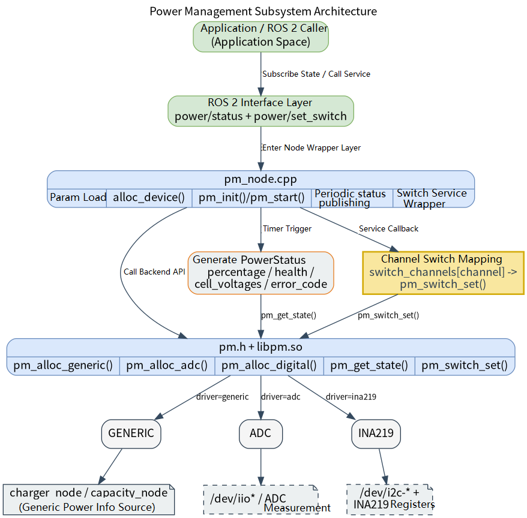

# Basic Sensors · Power

## 1. Overview

- **Key Features**: The power module sits in the basic sensor capability layer of the robot development stack. It wraps the `components/peripherals/pm` power management component at the lower level and exposes a ROS 2 node `pm_node` at the upper level. The module continuously reads battery/power-supply status and publishes it as a status topic; it also exposes a power switch control service to upper-level applications, allowing business nodes to make switch requests and confirm the results.
- **Specifications and Features** (interface form, rate, resolution, algorithm version, etc.): The module uses a hybrid "status topic + control service" interface. The status output message is `peripherals_pm_node/msg/PowerStatus`, with a default topic of `/power/status`; the control input is `peripherals_pm_node/srv/SetPowerSwitch`, with a default service name of `/power/set_switch`. The node name is fixed as `pm_node`; the default polling and publish frequency is `1.0 Hz`; three underlying driver entries are supported — `generic`, `adc`, and `ina219` — but the most complete and recommended code path at present is `generic`.
- **Software Block Diagram**:



- **Directory Structure**:

| Path | Responsibility |
| --- | --- |
| `middleware/ros2/peripherals/pm/src/pm_node.cpp` | ROS 2 power node implementation — loads parameters, constructs the underlying device, polls status, and provides the switch service |
| `middleware/ros2/peripherals/pm/params/pm_node.yaml` | Default node parameter file — contains driver selection, topic name, service name, polling frequency, and low-level configuration |
| `middleware/ros2/peripherals/pm/CMakeLists.txt` | `peripherals_pm_node` package build file — finds `pm.h` and `libpm.so` and generates `pm_node` |
| `middleware/ros2/peripherals/pm/package.xml` | ROS 2 package metadata and dependency declarations |
| `middleware/ros2/peripherals/pm/msg/PowerStatus.msg` | Power status message definition |
| `middleware/ros2/peripherals/pm/srv/SetPowerSwitch.srv` | Power switch service definition |
| `components/peripherals/pm/include/pm.h` | Low-level power component C API, status struct, and configuration struct |
| `components/peripherals/pm/src/pm_core.c` | Low-level lifecycle, driver allocation, status reading, and switch control common logic |
| `components/peripherals/pm/src/drivers/drv_generic.c` | Generic driver that reads charging state and battery percentage through Linux `power_supply` nodes |
| `components/peripherals/pm/test/test_pm_generic.c` | `generic` driver test program — used to first verify the low-level read path |
| `components/peripherals/pm/test/test_pm_adc.c` | ADC driver test program — used to verify the other low-level access method |

## 2. Environment Setup

### Prerequisites

- **Runtime Environment**: Recommended board environment is `k1-deb1` with matching system image; the build side requires a C++17 compiler, CMake, `ament_cmake`, `rclcpp`, and the unified SDK build scripts. If using the `generic` driver, the system must expose `/sys/class/power_supply/<charger>/online` and `/sys/class/power_supply/<battery>/capacity`.
- **Hardware and Connections**: The board must integrate the CW2015 fuel gauge chip and the IP2317 charging chip, and the kernel must enable the corresponding drivers and DTS configuration.

### Build

- **Getting the Code**: See the [2.3 Building and Compilation](../../02-快速入门/2.3-构建编译.md) section for cloning the complete SDK using the `repo` tool. The following build and test commands are all run inside the SDK.
- **Module Compilation**: Build in dependency order — compile the low-level power component first, then the ROS 2 node package (which includes its own `PowerStatus.msg` and `SetPowerSwitch.srv`):

  ```bash
  source build/envsetup.sh
  ./build/build.sh package components/peripherals/pm
  ./build/build.sh package middleware/ros2/peripherals/pm
  ```

  Expected artifacts: `output/staging/lib/peripherals_pm_node/pm_node`, `output/staging/share/peripherals_pm_node/params/pm_node.yaml`, `output/staging/lib/libpm.so`, and the ROS 2 interface install files for `peripherals_pm_node/msg/PowerStatus` and `peripherals_pm_node/srv/SetPowerSwitch`. If the current target is not `riscv64`, refer to the actual `output/<target>/staging` or `output/staging` as appropriate.

- **Common Differences**: The `CMakeLists.txt` of `peripherals_pm_node` searches for `pm.h` and `libpm.so`; if `components/peripherals/pm` has not been built first, it reports `pm.h or libpm not found`. The top-level key in the parameter file must be the actual node name `pm_node`, not the package name `peripherals_pm_node`.

## 3. Example Usage (From Scratch)

This section walks through the primary workflow **step by step**.

### 3.1 Example 1: Start the Power Node and Observe the Status Topic

**Prerequisites**: First confirm that the target board exposes readable `power_supply` nodes; if your node names are not the defaults `ip2317-charger` and `cw-bat`, pass the actual names in the run parameters.

**Step 1**: Navigate to the SDK source directory and load the runtime environment.

```bash
source output/staging/setup.bash
```

Expected result: `ros2 pkg executables peripherals_pm_node` shows `peripherals_pm_node pm_node`.

**Step 2**: Confirm or modify the default parameter file. The default path after installation is:

```bash
output/staging/share/peripherals_pm_node/params/pm_node.yaml
```

The default contents are equivalent to:

```yaml
pm_node:
  ros__parameters:
    driver: "generic"
    name: "main_batt"

    frame_id: "power"
    status_topic: "power/status"
    switch_service: "power/set_switch"
    poll_hz: 1.0
    publish_on_startup: true

    charger_node: "ip2317-charger"
    capacity_node: "cw-bat"
```

Expected result: if the `power_supply` node names on the target system are not `ip2317-charger` and `cw-bat`, you must modify the parameters first; otherwise the node will continuously fail to read after startup.

**Step 3**: Start the power node.

```bash
ros2 run peripherals_pm_node pm_node \
  --ros-args \
  --params-file output/staging/share/peripherals_pm_node/params/pm_node.yaml
```

Expected result: the terminal prints a log similar to the following, indicating the node has started with the `generic` driver.

```text
pm_node ready: driver=generic name=main_batt topic=/power/status switch_service=power/set_switch poll_hz=1.000
```

**Step 4**: Open a second terminal, load the same ROS 2 environment, and subscribe to the status topic.

```bash
source output/staging/setup.bash
ros2 topic echo /power/status
```

Expected result: if the low-level read succeeds, you will periodically see `peripherals_pm_node/msg/PowerStatus` output such as:

```yaml
header:
  stamp:
    sec: 0
    nanosec: 0
  frame_id: power
status: 1
percentage: 98.0
health: 0.0
cycle_count: 0
error_code: 0
cell_count: 0
cell_voltages: []
---
```

**Step 5**: Perform a charger plug/unplug test.

| Action | Expected Result |
| --- | --- |
| Not charging | `status=1`, meaning `DISCHARGING` |
| Plug in charger | `status=2`, meaning `CHARGING` |
| Capacity node readable | `percentage` changes with the `capacity` node |
| Node name misconfigured or node unreadable | The terminal periodically prints a `pm_get_state failed` warning |

## 4. Application Development

- **API / Interface** (header files, library names, services/topics): Upper-level applications primarily subscribe to the ROS 2 topic `/power/status` for power status, with message type `peripherals_pm_node/msg/PowerStatus`; and use the ROS 2 service `/power/set_switch` to initiate power switch control, with service type `peripherals_pm_node/srv/SetPowerSwitch`. `PowerStatus` currently contains `status`, `percentage`, `health`, `cycle_count`, `error_code`, `cell_count`, and `cell_voltages`; the service request contains `channel` and `enable`, and the response contains `success` and `message`.
- **Usage and Notes** (threading, permissions, resource cleanup, etc.):
  - The `status` mapping in the status message is: `0=UNKNOWN`, `1=DISCHARGING`, `2=CHARGING`, `3=FULL`, `4=FAULT`, `5=SLEEP`.
  - The node periodically calls `pm_get_state()` via a timer rather than relying on low-level callback push for the full status; this is because the current low-level callback mainly covers charge/discharge state changes and is not suitable as a full-snapshot channel.
  - When `publish_on_startup=true`, the node publishes the status once immediately after startup, then continues publishing at the frequency set by `poll_hz`.
  - Parameter validation is strict: `poll_hz`, `capacity_mah`, `max_voltage`, `min_voltage`, and `max_temp` must be greater than `0`; `max_voltage > min_voltage`; `warn_voltage` and `crit_voltage` must fall within `[min_voltage, max_voltage]` with `warn_voltage >= crit_voltage`; the `ina219` `i2c_addr` must be in `[0, 127]`; `switch_channels` can have at most `256` entries.
  - `switch_channels` is a mapping array from service channel number to low-level channel name. The `channel` in `SetPowerSwitch.srv` is a `uint8`, and the node internally uses `switch_channels[channel]` to find the low-level name; if that index does not exist or is an empty string, the service returns failure directly.
  - The current ROS 2 `PowerStatus.msg` cannot fully carry fields such as `voltage`, `current`, `power`, and `temperature` from the low-level `pm_state`; if your application depends on this data, you need to extend the message definition or add a dedicated battery status message.
  - The `pm_switch_set()` of the current low-level `generic`, `adc`, and `ina219` drivers do not yet form a complete usable capability; `generic` explicitly returns `-ENOSYS`, and `adc`/`ina219` are still placeholder implementations. Therefore, at this stage, treat the service as "interface reserved — availability depends on the low-level backend".
- **Reference demos and example paths**: `middleware/ros2/peripherals/pm/README.md`, `middleware/ros2/peripherals/pm/params/pm_node.yaml`, `middleware/ros2/peripherals/pm/src/pm_node.cpp`, `components/peripherals/pm/test/test_pm_generic.c`, `components/peripherals/pm/test/test_pm_adc.c`.

`PowerStatus` field descriptions:

| Field | Description |
| --- | --- |
| `header` | ROS standard timestamp and frame fields; `frame_id` comes from the `frame_id` parameter |
| `status` | Charge/discharge state enum |
| `percentage` | Battery percentage, range `0.0-100.0` |
| `health` | Health level; currently depends on whether the low-level driver provides it |
| `cycle_count` | Charge/discharge cycle count |
| `error_code` | Hardware error code; `0` means no error |
| `cell_count` | Number of individual cells |
| `cell_voltages` | Array of individual cell voltages, up to `16` entries |

## 5. Debugging Guide

- **Verify the `generic` driver path with the low-level component first**: if the current build enables the component test programs, you can compile `test_pm_generic` under `components/peripherals/pm` with `-DBUILD_TESTS=ON` following the component README, then run `./build/test_pm_generic ip2317-charger cw-bat`. If even this program cannot stably output `SOC` and `status`, prioritize checking the Linux `power_supply` node names and read permissions.
- **Check the Linux nodes directly**: confirm that `/sys/class/power_supply/<charger_node>/online` and `/sys/class/power_supply/<capacity_node>/capacity` exist and can be read normally with `cat`; `online` is generally used to determine whether charging is in progress, and `capacity` is used to obtain the percentage.
- **Observe the ROS 2 node logs**: a normal startup prints `pm_node ready`; if the low-level read fails, it throttles printing of `pm_get_state failed`. If parameter validation fails, the node fails to start with an error such as `poll_hz must be > 0` or `charger_node must not be empty for generic driver`.
- **Observe the ROS 2 graph and interfaces**: use `ros2 node list` to confirm `/pm_node` exists, `ros2 topic echo /power/status` to view the status output, and `ros2 service call /power/set_switch ...` to verify the service response.
- **If the service always fails**, first distinguish the source of failure: when `switch_channels` is not configured, it returns `channel N is not configured` directly; when the low-level layer does not support it, it returns `pm_switch_set failed ...` with an error code, such as the current `generic` driver's `-ENOSYS`.
- **When debugging with hardware or BSP colleagues**, provide: board model and image version, kernel version, the `/sys/class/power_supply` directory structure, the actual paths and sample values of the `online` and `capacity` nodes, the `pm_node.yaml` in use, the node startup log, the service call command, and its return result. For the `adc` or `ina219` path, also provide the corresponding device node path, I2C address, and sampling hardware wiring.

## 6. FAQ

None at this time.
