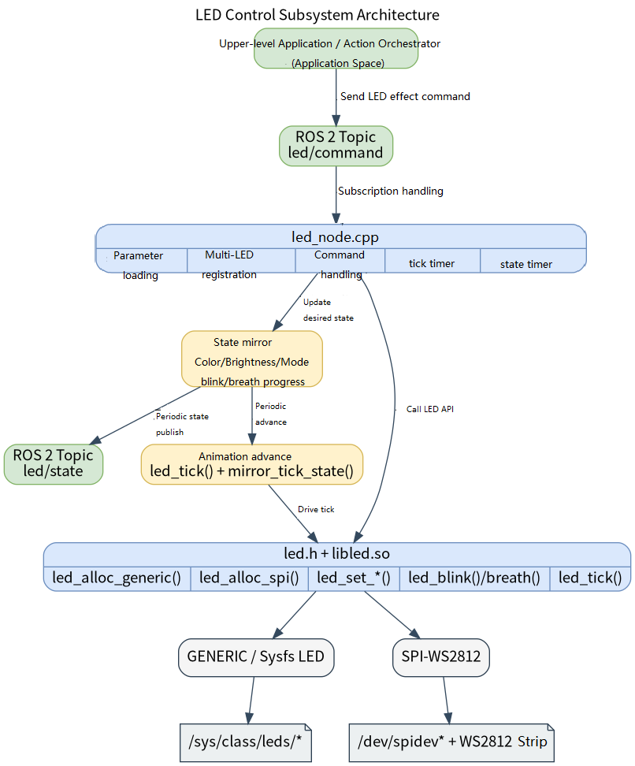

# Basic Sensors · LED

## 1. Overview

- **Key Features**: The LED module sits in the basic-sensor layer of the robot development stack. It wraps the `components/peripherals/led` userspace LED component downward and exposes a ROS 2 node `led_node` upward. The module provides unified control of onboard sysfs indicator LEDs and SPI WS2812 LED strips, and offers three control capabilities to upper layers: color, brightness, steady-on, blink, and breathing effects.
- **Specifications and Features** (interface type, rate, resolution, algorithm version, etc.): Command input uses `peripherals_led_node/msg/LedCommand` on the default topic `/led/command`; status output uses `peripherals_led_node/msg/LedState` on the default topic `/led/state`. Currently supports `mode=0/1/2` representing `STATIC / BLINK / BREATH`. The node calls the underlying `led_tick()` on a `50 ms` timer and publishes state on a `100 ms` timer by default. A single node can manage multiple LED channels simultaneously and supports both `generic` and `spi` transport types. The state topic uses `reliable + transient_local` QoS so a new subscriber receives the latest state immediately on startup.
- **Software Block Diagram**:



- **Directory Structure**:

| Path | Responsibility |
| --- | --- |
| `middleware/ros2/peripherals/led/src/led_node.cpp` | ROS 2 LED node implementation — parameter validation, LED registration, command handling, tick state machine, and state publishing |
| `middleware/ros2/peripherals/led/params/led_node.yaml` | Default parameter file, contains one example generic LED |
| `middleware/ros2/peripherals/led/CMakeLists.txt` | `peripherals_led_node` package build file — finds `led.h` and `libled.so`, produces `led_node` |
| `middleware/ros2/peripherals/led/msg/LedCommand.msg` | LED command message definition |
| `middleware/ros2/peripherals/led/msg/LedState.msg` | LED state message definition |
| `components/peripherals/led/include/led.h` | Underlying LED component C API |
| `components/peripherals/led/test/test_led_generic.c` | sysfs LED low-level test program |
| `components/peripherals/led/test/test_led_ws2812.c` | SPI WS2812 low-level test program |

## 2. Environment Setup

### Prerequisites

- Runtime environment: The recommended board-side environment is the `k1-deb1` system image. The build side requires CMake, a C++ compiler, `ament_cmake`, `rclcpp`, and the SDK unified build script.
- Hardware and connections: The `generic` type applies to onboard GPIO LEDs or Linux LED class devices; the `spi` type applies to WS2812/SK6812 strips connected to an SPI controller. Confirm the LED name, active level, SPI device node, number of LEDs, power supply, and common ground before starting.

### Build

- **Getting the Code**: See Section [2.3 Building and Compilation](../../02-快速入门/2.3-构建编译.md) for cloning the full SDK with the `repo` tool. All build and test commands below are run from inside the SDK.
- Build this module: build the underlying LED component and message interfaces first (in dependency order), then build the ROS 2 node.

  ```bash
  source build/envsetup.sh
  cd components/peripherals/led
  mm -DBUILD_TESTS=ON -DSROBOTIS_PERIPHERALS_LED_ENABLED_DRIVERS="drv_generic;drv_spi_ws2812"

  cd ../../../
  ./build/build.sh package middleware/ros2/peripherals/led
  ```

  Expected artifacts: `output/staging/lib/peripherals_led_node/led_node`, `output/staging/share/peripherals_led_node/params/led_node.yaml`, `output/staging/lib/libled.so`, and the ROS 2 interface install files for `LedCommand` / `LedState`. If the current target is not `riscv64`, use the actual `output/<target>/staging` or `output/staging` path accordingly.
- Common Differences: The `CMakeLists.txt` of `peripherals_led_node` searches for `led.h` and `libled.so`; if `components/peripherals/led` has not been built first, the error `led.h or libled not found` will appear. To use `transport=spi` in ROS 2, also confirm that `drv_spi_ws2812` was enabled when building `components/peripherals/led`. The top-level key in the parameter file must be the actual node name `led_node`, not the package name `peripherals_led_node`.

## 3. Example Usage (From Scratch)

This section provides a step-by-step path for readers to reproduce the examples from scratch.

### 3.1 Example 1: Start the LED Node and Control an SPI Strip

**Prerequisites**: Update the parameter file for the `spi` scenario first — for example set `transports=["spi"]`, `names=["strip0"]`, `spi_dev_paths=["/dev/spidev0.0"]`, `spi_num_leds=[23]` — and confirm that `drv_spi_ws2812` was enabled when building `components/peripherals/led`. The `spi_speed_hz` and `spi_reset_bytes` defaults of `6400000` and `80` can be used as-is to start.

Fill in `spi_dev_paths` based on the actual `/dev/spidev0.0` on your board, as shown below:

```
cat output/staging/share/peripherals_led_node/params/led_node.yaml
led_node:
  ros__parameters:
    frame_id: "led"
    command_topic: "led/command"
    state_topic: "led/state"
    tick_period_ms: 50
    publish_period_ms: 100
    publish_on_command: true
    publish_on_startup: true

    led_ids: [0]
    transports: ["spi"]
    names: ["spi_ws2812"]

    generic_sysfs_names: [""]
    generic_active_levels: [0]

    spi_dev_paths: ["/dev/spidev0.0"]
    spi_num_leds: [1]
    spi_speed_hz: [6400000]
    spi_reset_bytes: [80]
```

Ensure a WS2812 device is connected.

**Step 1**: Open a new terminal, navigate to the SDK source directory, and load the runtime environment.

```bash
source output/staging/setup.bash
```

Expected result: `ros2 pkg executables peripherals_led_node` lists `peripherals_led_node led_node`.

**Step 2**: Confirm or edit the parameter file. The default installed parameter file path is:

```bash
output/staging/share/peripherals_led_node/params/led_node.yaml
```

The default configuration maps to a single `generic` LED; update it to an `spi` configuration before running the SPI driver example.

**Step 3**: Start the LED node.

```bash
ros2 run peripherals_led_node led_node \
  --ros-args \
  --params-file output/staging/share/peripherals_led_node/params/led_node.yaml
```

Expected result: The terminal prints `led_node ready` along with the command topic, state topic, LED count, tick period, and state publish period.

**Step 4**: Open another terminal and subscribe to the state topic.

```bash
source output/staging/setup.bash
ros2 topic echo /led/state
```

Expected result: The current LED state is printed.

**Step 5**: Publish a steady red command:

```bash
ros2 topic pub --once /led/command peripherals_led_node/msg/LedCommand  \
   "{header: {frame_id: 'led'}, led_id: 0, r: 255, g: 0, b: 0, brightness: 128, mode: 0, period_ms: 0, on_ms: 0, count: 0}"
```

Publish a steady green command:

```bash
ros2 topic pub --once /led/command peripherals_led_node/msg/LedCommand \
 "{header: {frame_id: 'led'}, led_id: 0, r: 0, g: 255, b: 0, brightness: 128, mode: 0, period_ms: 0, on_ms: 0, count: 0}"
```

Expected result: The WS2812 strip enters steady red or green; the `r/g/b`, `brightness`, `mode`, and `is_on` fields for `led_id=0` in `/led/state` update accordingly. The current SPI implementation sets the entire strip to the same color and brightness — per-LED control is not supported.

### 3.2 Example 2: Blink and Breathing Effects

**Prerequisites**: See Section 2. The LED node must already be running.

**Step 1**: Send a blink command.

```bash
ros2 topic pub --once /led/command peripherals_led_node/msg/LedCommand \
  "{header: {frame_id: 'led'}, led_id: 0, r: 255, g: 255, b: 255, brightness: 255, mode: 1, period_ms: 1000, on_ms: 200, count: 5}"
```

Expected result: The WS2812 strip blinks white 5 times. The node drives `led_tick()` in the `tick_period_ms` timer and mirrors the state machine, so `brightness` and `is_on` in `/led/state` change with each blink. In the current implementation, the state brightness toggles between `255/0` during blink — the `brightness` field in the command does not participate in the blink brightness calculation.

**Step 2**: Send a breathing command.

```bash
ros2 topic pub --once /led/command peripherals_led_node/msg/LedCommand \
  "{header: {frame_id: 'led'}, led_id: 0, r: 0, g: 0, b: 255, brightness: 128, mode: 2, period_ms: 2000, on_ms: 0, count: 0}"
```

Expected result: The WS2812 strip enters a blue breathing effect. `/led/state` shows `mode=2` and `brightness` varies periodically. The current implementation does not use the `brightness` field from the command as the breathing brightness.

**Step 3**: Send a turn-off command.

```bash
ros2 topic pub --once /led/command peripherals_led_node/msg/LedCommand \
  "{header: {frame_id: 'led'}, led_id: 0, r: 0, g: 0, b: 0, brightness: 0, mode: 0, period_ms: 0, on_ms: 0, count: 0}"
```

Expected result: The LED turns off; `/led/state` shows `is_on=false` and `brightness=0`. If the `led_id` in the command does not exist, the node prints an `unknown led_id` warning and ignores the command.

## 4. Application Development

- **API / Interface**: Upper-layer applications publish `peripherals_led_node/msg/LedCommand` to `/led/command` to control a target LED, and subscribe to `peripherals_led_node/msg/LedState` on `/led/state` to read the current state of each LED channel. The node does not expose a service interface.
- **Usage and Notes** (threading, permissions, resource cleanup, etc.): `LedCommand.led_id` selects the target LED. `mode` values are `0=STATIC`, `1=BLINK`, `2=BREATH`. For blink and breathing modes `period_ms` must be greater than `0`. In blink mode `count=0` means infinite repeat. The parameter arrays `led_ids`, `transports`, `names`, `generic_sysfs_names`, `generic_active_levels`, `spi_dev_paths`, `spi_num_leds`, `spi_speed_hz`, and `spi_reset_bytes` must all be the same length as `led_ids`, and entries in `led_ids` must be unique. If an SPI device name has no driver prefix, the node automatically prepends `spi-ws2812:<name>`.
- **Reference demos and example paths**: `middleware/ros2/peripherals/led/README.md`, `middleware/ros2/peripherals/led/params/led_node.yaml`, `middleware/ros2/peripherals/led/src/led_node.cpp`, `components/peripherals/led/test/test_led_generic.c`, `components/peripherals/led/test/test_led_ws2812.c`.

Key message fields:

| Interface | Field | Description |
| --- | --- | --- |
| `LedCommand` | `led_id` | Target LED logical ID |
| `LedCommand` | `r/g/b` | Target color components, range `0..255` |
| `LedCommand` | `brightness` | Target brightness, range `0..255`; in the current implementation only `STATIC` mode uses this directly — `BLINK/BREATH` have it overridden by the node state machine |
| `LedCommand` | `mode` | `0=STATIC`, `1=BLINK`, `2=BREATH` |
| `LedCommand` | `period_ms` | Blink or breathing period |
| `LedCommand` | `on_ms` | On-duration per cycle in blink mode |
| `LedCommand` | `count` | Blink repeat count; `0` = infinite |
| `LedState` | `is_on` | Whether the LED is currently lit |

## 5. Debugging Guide

- Validate the hardware path with the low-level component first: if the test programs were built, run `test_led_generic` or `test_led_ws2812` to confirm that `led.h + libled.so` can drive the hardware directly, then move to the ROS 2 node for further diagnosis.
- Observe the node startup log: a healthy start prints `led_node ready`; mismatched parameter array lengths raise `size mismatch with led_ids`; a failed LED allocation raises `failed to allocate LED device`.
- If a `generic` LED is unresponsive, check that `/sys/class/leds/<name>/brightness` exists and the current user has write permission.
- If an `spi` LED is unresponsive, verify that `/dev/spidevX.Y` exists, the current user can access it, `drv_spi_ws2812` was enabled in the underlying component build, and that `spi_num_leds`, `spi_speed_hz`, and `spi_reset_bytes` are correct.
- If blink or breathing effects are not changing, confirm `tick_period_ms > 0` and that the node main loop is not blocked — effects advance entirely through the periodic `led_tick()` timer.

## 6. FAQ

None at this time.
