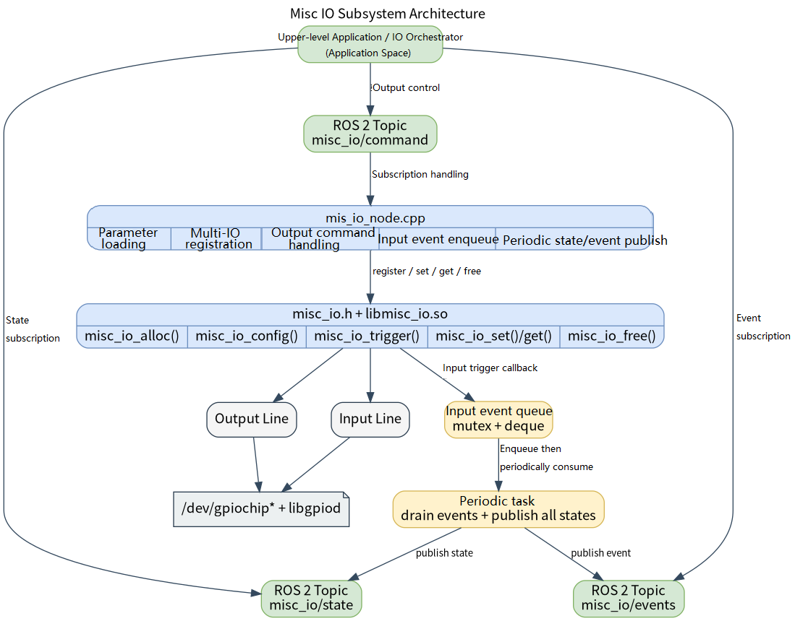

# Basic Sensors · IO

## 1. Overview
 
- **Key Features**: The IO module sits in the basic-sensor layer of the robot development stack. It wraps the `components/peripherals/misc_io` Linux GPIO component downward and exposes a ROS 2 node `misc_io_node` upward. The module provides unified access to miscellaneous IO peripherals such as switches, optocouplers, limit sensors, generic digital sensors, buzzers, relays, and general-purpose GPIO outputs, and offers three types of ROS 2 interfaces to upper layers: command, state, and event.
- **Specifications and Features** (interface type, rate, resolution, algorithm version, etc.): Command input uses `peripherals_misc_io_node/msg/MiscIoCommand` on the default topic `/misc_io/command`; status output uses `peripherals_misc_io_node/msg/MiscIoState` on the default topic `/misc_io/state`; input event output uses `peripherals_misc_io_node/msg/MiscIoEvent` on the default topic `/misc_io/events`. Default state publish period is `100 ms`. Supports registering multiple IOs at once. Each IO can be configured with logical ID, type, direction, active level, debounce time, `gpiochip` name, line offset, consumer name, and log name. The state topic uses `reliable + transient_local` QoS so a new subscriber receives the latest state snapshot immediately on startup.
- **Software Block Diagram**:



- **Directory Structure**:

| Path | Responsibility |
| --- | --- |
| `middleware/ros2/peripherals/misc_io/src/misc_io_node.cpp` | ROS 2 IO node implementation — registers IOs, subscribes to commands, publishes state and input events |
| `middleware/ros2/peripherals/misc_io/params/misc_io_node.yaml` | Default node parameter file, contains three example IO configurations |
| `middleware/ros2/peripherals/misc_io/CMakeLists.txt` | `peripherals_misc_io_node` package build file — finds `misc_io.h`, `libmisc_io.so` and produces `misc_io_node` |
| `middleware/ros2/peripherals/misc_io/msg/MiscIoCommand.msg` | IO output command message definition |
| `middleware/ros2/peripherals/misc_io/msg/MiscIoState.msg` | IO state message definition |
| `middleware/ros2/peripherals/misc_io/msg/MiscIoEvent.msg` | IO input event message definition |
| `components/peripherals/misc_io/include/misc_io.h` | Underlying misc_io C API |
| `components/peripherals/misc_io/test/test_misc_io.c` | Underlying component test program |

## 2. Environment Setup

### Prerequisites

- Runtime environment: The recommended board-side environment is the `k3-com260` system image. The build side requires CMake, a C++ compiler, `ament_cmake`, `rclcpp`, and the SDK unified build script.
- Hardware and connections: The target board needs GPIO controllers accessible from Linux, with mechanical buttons or a button board connected. Confirm the Linux logical GPIO number, active level, and pull-up/pull-down configuration for the buttons. The current demo program defaults to `GPIO113` and `GPIO114`, both configured as active-high.
- Tools and permissions: The running user needs access permission to `/dev/gpiochip*`; if the device node permissions are not open, use `sudo` to run the demo program.

### Build

- **Getting the Code**: See Section [2.3 Building and Compilation](../../02-快速入门/2.3-构建编译.md) for cloning the full SDK with the `repo` tool. All build and test commands below are run from inside the SDK.
- Build this module: build the underlying IO component first (in dependency order), then build the ROS 2 node package that includes `MiscIoCommand.msg`, `MiscIoState.msg`, and `MiscIoEvent.msg`.  

  ```bash
  source build/envsetup.sh

  ./build/build.sh package components/peripherals/misc_io
  ./build/build.sh package middleware/ros2/peripherals/misc_io
  ```

  Expected artifacts: `output/staging/lib/peripherals_misc_io_node/misc_io_node`, `output/staging/share/peripherals_misc_io_node/params/misc_io_node.yaml`, `output/staging/lib/libmisc_io.so`, and the ROS 2 interface install files for `MiscIoCommand` / `MiscIoState` / `MiscIoEvent` under `peripherals_misc_io_node`. If the current target is not `riscv64`, use the actual `output/<target>/staging` or `output/staging` path accordingly.
- Common Differences: The `CMakeLists.txt` of `peripherals_misc_io_node` searches for `misc_io.h` and `libmisc_io.so`; if `components/peripherals/misc_io` has not been built first, the error `misc_io.h or libmisc_io not found` will appear. The top-level key in the parameter file must be the actual node name `misc_io_node`, not the package name `peripherals_misc_io_node`.

## 3. Example Usage (From Scratch)

This section provides a step-by-step path for readers to reproduce the examples from scratch:

### 3.1 Example 1: Start the IO Node and Observe State and Events

**Prerequisites**: Build is complete; the `chip_names`, `line_offsets`, `dirs`, and `active_logics` in the default parameter file match the actual hardware; the current user has access permission to `/dev/gpiochip*`.

**Step 1**: Navigate to the SDK source directory and load the runtime environment.

```bash
source output/staging/setup.bash
```

Expected result: `ros2 pkg executables peripherals_misc_io_node` lists `peripherals_misc_io_node misc_io_node`.

**Step 2**: Confirm or edit the parameter file. The default installed parameter file path is:

```bash
output/staging/share/peripherals_misc_io_node/params/misc_io_node.yaml
```

The default configuration is equivalent to two input IOs plus one output IO. If the actual GPIO differs from the example, edit the parameters first.

**Step 3**: Start the IO node.

```bash
ros2 run peripherals_misc_io_node misc_io_node \
  --ros-args \
  --params-file output/staging/share/peripherals_misc_io_node/params/misc_io_node.yaml
```

Expected result: The terminal prints `registered io` log for each IO and finally prints `misc_io_node ready`.

**Step 4**: Open another terminal and subscribe to the state topic.

```bash
source output/staging/setup.bash
ros2 topic echo /misc_io/state
```

Expected result: The state of every registered IO is continuously published at `publish_period_ms` intervals. Both input and output IOs publish `MiscIoState`.

**Step 5**: Subscribe to the input event topic and trigger input level changes.

```bash
ros2 topic echo /misc_io/events
```

Expected result: When an input IO enters active state, `event=0` is published; when leaving active state, `event=1` is published. Output IOs do not publish input events.

### 3.2 Example 2: Control Output IO via Command Topic

**Prerequisites**: At least one output IO with `dir=1` is configured in the parameters, such as `io_id=2` in the default example.

**Step 1**: Publish an activate command.

```bash
ros2 topic pub --once /misc_io/command peripherals_misc_io_node/msg/MiscIoCommand "{io_id: 2, active: true}"
```

Expected result: The underlying code calls `misc_io_set()`, switching the corresponding output line to active; `active` for `io_id=2` in `/misc_io/state` becomes `true`.

**Step 2**: Publish a deactivate command.

```bash
ros2 topic pub --once /misc_io/command peripherals_misc_io_node/msg/MiscIoCommand "{io_id: 2, active: false}"
```

Expected result: The corresponding output line switches to inactive; `active` for `io_id=2` in `/misc_io/state` becomes `false`.

**Step 3**: Attempt to send a command to an input IO.

```bash
ros2 topic pub --once /misc_io/command peripherals_misc_io_node/msg/MiscIoCommand "{io_id: 0, active: true}"
```

Expected result: The node ignores this command and throttled-prints `received command for input io_id=0`; the physical state of the input IO is not modified.

## 4. Application Development

- **API / Interface**: Upper-layer applications publish `peripherals_misc_io_node/msg/MiscIoCommand` to `/misc_io/command` to control output IOs; subscribe to `peripherals_misc_io_node/msg/MiscIoState` on `/misc_io/state` to get the current state of all IOs; subscribe to `peripherals_misc_io_node/msg/MiscIoEvent` on `/misc_io/events` to receive input IO edge events. The node does not currently provide a service interface.
- **Usage and Notes** (threading, permissions, resource cleanup, etc.): `MiscIoCommand.io_id` specifies the target IO; `active=true` means active/enabled in business semantics. Commands only take effect on output IOs with `dir=1`. `MiscIoState.active` is the logical state after interpreting `active_logic`, not the raw GPIO level. `MiscIoEvent.event=0` means entering active state, `event=1` means leaving active state. Parameter arrays correspond by index one-to-one; `io_ids` must be unique; `publish_period_ms` must be greater than `0`.
- **Reference demos and example paths**: `middleware/ros2/peripherals/misc_io/README.md`, `middleware/ros2/peripherals/misc_io/params/misc_io_node.yaml`, `middleware/ros2/peripherals/misc_io/src/misc_io_node.cpp`, `components/peripherals/misc_io/test/test_misc_io.c`.

Key message fields:

| Interface | Field | Description |
| --- | --- | --- |
| `MiscIoCommand` | `io_id` | Target IO ID |
| `MiscIoCommand` | `active` | Desired output state, `true=active/on` |
| `MiscIoState` | `type` | `0=GENERIC`, `1=BUZZER`, `2=RELAY`, `3=SWITCH`, `4=SENSOR` |
| `MiscIoState` | `dir` | `0=INPUT`, `1=OUTPUT` |
| `MiscIoEvent` | `event` | `0=ACTIVE`, `1=INACTIVE` |

## 5. Debugging Guide
- Each IO in the configuration file can only be configured as either input or output, depending on the actual application scenario.

## 6. FAQ
None at this time.
