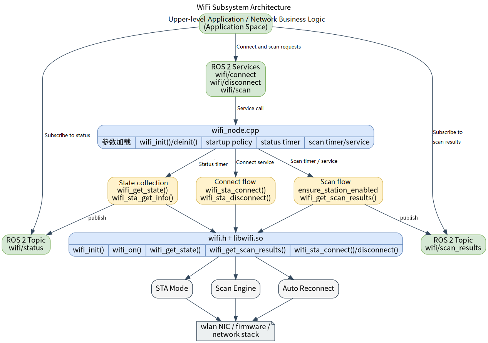

# Basic Sensors · WiFi

## 1. Overview

- **Key Features**: The WiFi module sits in the basic-sensor layer of the robot development stack. It wraps the `components/peripherals/wifi` NetworkManager-based WiFi component downward and exposes a ROS 2 node `wifi_node` upward. The module provides unified management of scan, connect, disconnect, and status broadcast in STA mode, and supplies the current WiFi connection state and scan results to upper-level applications.
- **Specifications and Features** (interface type, rate, resolution, algorithm version, etc.): The node uses a hybrid "status topic + command service" interface. Status output uses `peripherals_wifi_node/msg/WifiStatus` on the default topic `/wifi/status`; scan results use `peripherals_wifi_node/msg/WifiScanResults` on the default topic `/wifi/scan_results`; the connect service uses `peripherals_wifi_node/srv/WifiConnect` on the default service `/wifi/connect`; the disconnect service uses `std_srvs/srv/Trigger` on the default service `/wifi/disconnect`; the scan service uses `peripherals_wifi_node/srv/WifiScan` on the default service `/wifi/scan`. Default status publish period is `2000 ms`; periodic scanning is disabled by default.
- **Software Block Diagram**:



- **Directory Structure**:

| Path | Responsibility |
| --- | --- |
| `middleware/ros2/peripherals/wifi/src/wifi_node.cpp` | ROS 2 WiFi node implementation — status publishing, scan publishing, and connect/disconnect services |
| `middleware/ros2/peripherals/wifi/params/wifi_node.yaml` | Default node parameter file |
| `middleware/ros2/peripherals/wifi/CMakeLists.txt` | `peripherals_wifi_node` package build file — finds `wifi.h`, `libwifi.so` and produces `wifi_node` |
| `middleware/ros2/peripherals/wifi/msg/WifiStatus.msg` | WiFi current state message definition |
| `middleware/ros2/peripherals/wifi/msg/WifiScanResult.msg` | Single scan result definition |
| `middleware/ros2/peripherals/wifi/msg/WifiScanResults.msg` | Scan results array message definition |
| `middleware/ros2/peripherals/wifi/srv/WifiConnect.srv` | WiFi connect service definition |
| `middleware/ros2/peripherals/wifi/srv/WifiScan.srv` | WiFi scan service definition |
| `components/peripherals/wifi/include/wifi.h` | Underlying WiFi component C API |
| `components/peripherals/wifi/test/test_wifi_demo.c` | Underlying WiFi component test program |

## 2. Environment Setup

### Prerequisites

- **Runtime Environment**: Recommended board-side environment is the `k3-com260` system image. The build side requires CMake, a C++ compiler, `ament_cmake`, `rclcpp`, `std_srvs`, and the SDK unified build script.
- **Hardware and Connections**: The target board needs a WiFi network card manageable by NetworkManager. STA mode requires a reachable router or hotspot; AP mode requires a wireless card and driver that support hotspot/AP mode; setting a cloned MAC requires that a current connection exists and that the hardware/driver permits MAC modification.
- **Tools and Permissions**: Many `nmcli` operations require administrator or polkit privileges. Use an account with network management permissions on the board, and run the test program with `sudo` if needed. For troubleshooting, check `nmcli device status`, `nmcli radio wifi`, `nmcli device wifi list`, and `nmcli connection show`.

### Build

- **Getting the Code**: See Section [2.3 Building and Compilation](../../02-快速入门/2.3-构建编译.md) for cloning the full SDK with the `repo` tool. All build and test commands below are run from inside the SDK.
- **Module Compilation**: Build in dependency order — compile the underlying WiFi component first, then the ROS 2 node package that includes the `msg/srv` definitions.

  ```bash
  source build/envsetup.sh

  ./build/build.sh package components/peripherals/wifi
  ./build/build.sh package middleware/ros2/peripherals/wifi
  ```

  Expected artifacts: `output/staging/lib/peripherals_wifi_node/wifi_node`, `output/staging/share/peripherals_wifi_node/params/wifi_node.yaml`, `output/staging/lib/libwifi.so`, and the ROS 2 interface install files for the WiFi `msg/srv` under `peripherals_wifi_node`. If the current target is not `riscv64`, use the actual `output/<target>/staging` or `output/staging` path accordingly.

- **Common Differences**: If the local install prefix still contains old shared `peripherals` interface artifacts, the CLI may still resolve the old `peripherals/srv/WifiConnect` type. In that case, clean the old install output, then rebuild `middleware/ros2/peripherals/wifi` to ensure the current `peripherals_wifi_node/msg|srv` interfaces are reinstalled.

## 3. Example Usage (From Scratch)

This section provides a step-by-step path for readers to reproduce the examples from scratch:

### 3.1 Example 1: Start the WiFi Node and Observe State and Scan Results

**Prerequisites**: NetworkManager is installed and running on the target system, and `nmcli` executes normally.

**Step 1**: Navigate to the SDK source directory and load the runtime environment.

```bash
source output/staging/setup.bash
```

Expected result: `ros2 pkg executables peripherals_wifi_node` lists `peripherals_wifi_node wifi_node`.

**Step 2**: Start the WiFi node.

```bash
ros2 run peripherals_wifi_node wifi_node \
  --ros-args \
  --params-file output/staging/share/peripherals_wifi_node/params/wifi_node.yaml
```

Expected result: The terminal prints `wifi_node ready` along with the status topic, scan topic, and service names.

**Step 3**: Open another terminal and subscribe to the status topic.

> Note: To verify via the command line, use a separate terminal method such as a serial connection, `adb shell`, or an SSH connection over the network interface. If the board has ADB enabled, opening a terminal via `adb shell` is recommended, as shown below:

```
$ adb shell
# bash

root@k1:/# export HOME=/root/
root@k1:/# source /root/robotic_sdk/output/staging/setup.bash
root@k1:/# ros2 topic list
/parameter_events
/rosout
root@k1:/# ros2 topic list
/parameter_events
/rosout
/wifi/scan_results
/wifi/status

root@k1:/# ros2 topic echo /wifi/status
```

```bash
source output/staging/setup.bash
ros2 topic echo /wifi/status
```

Expected result: If connected, you should see `connected=true`, `ssid` set to the current network, and `ip_addr` set to a valid IPv4 address. If not connected, you should see `connected=false`, `ssid` empty, and `ip_addr` all zeros.

**Step 4**: Trigger a scan.

```bash
ros2 topic echo /wifi/scan_results
```

```bash
ros2 service call /wifi/scan peripherals_wifi_node/srv/WifiScan "{ssid: '', max_results: 0}"
```

Expected result: The service returns scan results, and the node also publishes the same batch of results to `/wifi/scan_results`.

### 3.2 Example 2: Connect to and Disconnect from a Specific WiFi Network

**Prerequisites**: The target SSID and password are known, and the WiFi node is already running.

**Step 1**: Initiate a connection.

```bash
ros2 service call /wifi/connect peripherals_wifi_node/srv/WifiConnect "{ssid: '<ssid>', password: '<password>', fast_connect: false, secure: 0, bssid: [0, 0, 0, 0, 0, 0]}"
```

Expected result: When the service returns `success=true`, the node updates the status topic; `/wifi/status` should switch to `connected=true` and include the `ssid` of the target network.

**Step 2**: Observe the state after connecting.

```bash
ros2 topic echo /wifi/status
```

Expected result: You should see `connected=true`, `ssid` set to the target network, and valid values for `bssid` and `ip_addr`.

**Step 3**: Initiate a disconnection.

```bash
ros2 service call /wifi/disconnect std_srvs/srv/Trigger "{}"
```

Expected result: If already connected, returns `success=true` and `message=ok`; if already disconnected, returns `success=true` and `message=already disconnected`.

**Step 4**: Observe the state again.

```bash
ros2 topic echo /wifi/status
```

Expected result: You should continue receiving state snapshots, now showing `connected=false`. Even a subscriber opened after disconnection will immediately receive the most recent state — this is the effect of `transient_local`.

## 4. Application Development

- **API / Interface**: Status is published via `/wifi/status` as `peripherals_wifi_node/msg/WifiStatus`; scan results are published via `/wifi/scan_results` as `peripherals_wifi_node/msg/WifiScanResults`; the connect service is provided at `/wifi/connect` as `peripherals_wifi_node/srv/WifiConnect`; the disconnect service is provided at `/wifi/disconnect` as `std_srvs/srv/Trigger`; the scan service is provided at `/wifi/scan` as `peripherals_wifi_node/srv/WifiScan`.
- **Usage and Notes** (threading, permissions, resource cleanup, etc.): `WifiStatus.mode` values are `0=UNKNOWN`, `1=STATION`, `2=AP`, `3=STATION_AP`; `ssid` is required in `WifiConnect` requests; `bssid` can be all zeros to indicate unspecified; `WifiScan.max_results=0` uses the node default; valid range for `scan_max_results` is `1..256`; `status_period_ms` must be greater than `0`, `scan_period_ms` must be greater than or equal to `0`. If the current WiFi interface also carries ROS 2 network traffic, DDS discovery may be affected after disconnection; it is recommended to use `ROS_LOCALHOST_ONLY=1`.
- **Reference demos and example paths**: `middleware/ros2/peripherals/wifi/README.md`, `middleware/ros2/peripherals/wifi/params/wifi_node.yaml`, `middleware/ros2/peripherals/wifi/src/wifi_node.cpp`, `components/peripherals/wifi/test/test_wifi_demo.c`.

Key message and service fields:

| Interface | Field | Description |
| --- | --- | --- |
| `WifiStatus` | `connected` | Whether currently connected to a network |
| `WifiStatus` | `ssid` | Current SSID |
| `WifiStatus` | `ip_addr` | Current IPv4 address |
| `WifiScanResult` | `ssid` | SSID of the scanned network |
| `WifiScanResult` | `rssi_dbm` | Signal strength |
| `WifiConnect` | `ssid/password` | Target network and password |
| `WifiScan` | `ssid/max_results` | Scan filter criteria and result count limit |

## 5. Debugging Guide

- **Verify the underlying environment first**: run `nmcli -t -f RUNNING general`, which should return `running`; run `nmcli device wifi list`, which should list nearby APs.
- **Observe the node startup log**: a normal startup prints `wifi_node ready`; if `wifi_init()` fails, the node exits with an error immediately.
- **Observe the status topic**: if `wifi_get_state()` fails, the node prints a warning during the status publish phase; if connected but `wifi_sta_get_info()` fails, it throttled-prints a warning, and the status topic may only retain coarse-grained `connected=true` information.
- **If you cannot see the node or topics after connecting**, confirm whether the current WiFi interface is also carrying ROS 2 discovery traffic; set `ROS_LOCALHOST_ONLY=1` and retry if necessary.
- **If scan or connect fails**, first verify `scan`, `connect`, `disconnect`, and `info` directly using the low-level test program `test_wifi_demo`, then return to the ROS 2 node for further diagnosis.

## 6. FAQ

None at this time.
