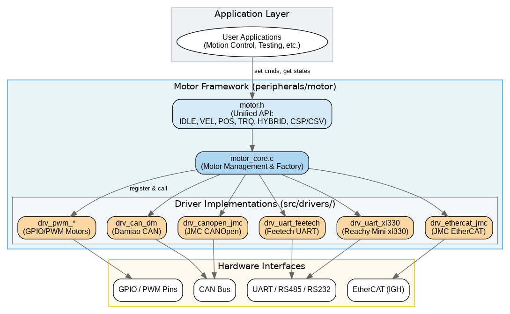
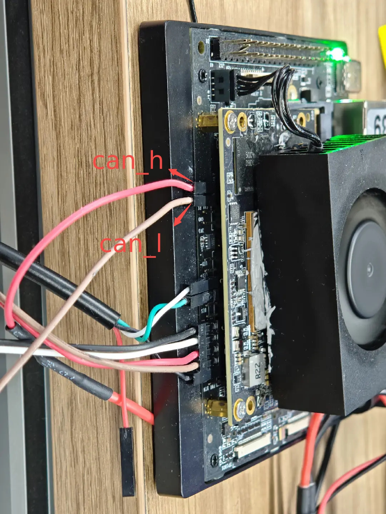
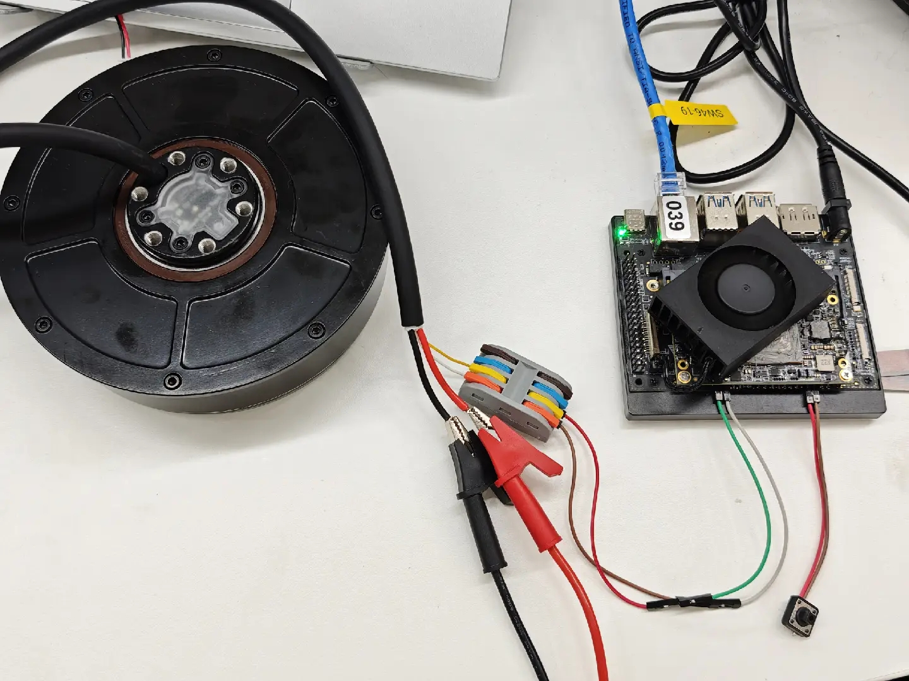
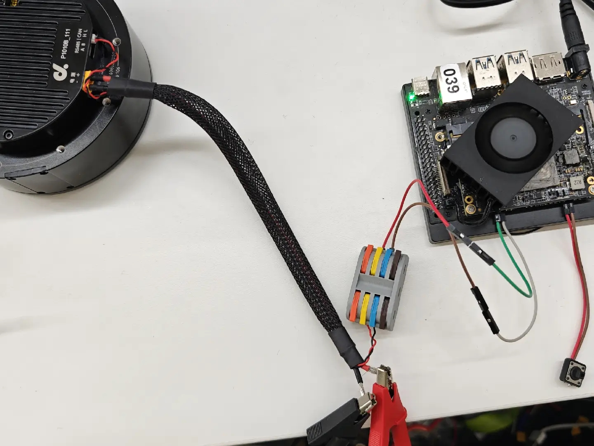
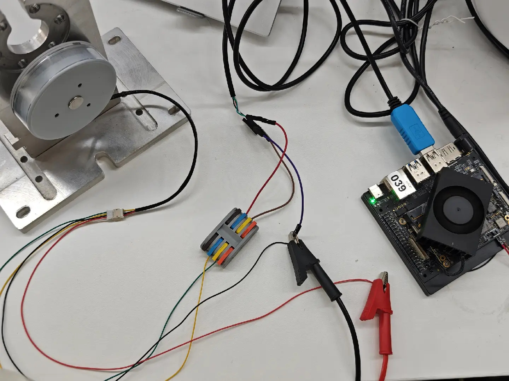
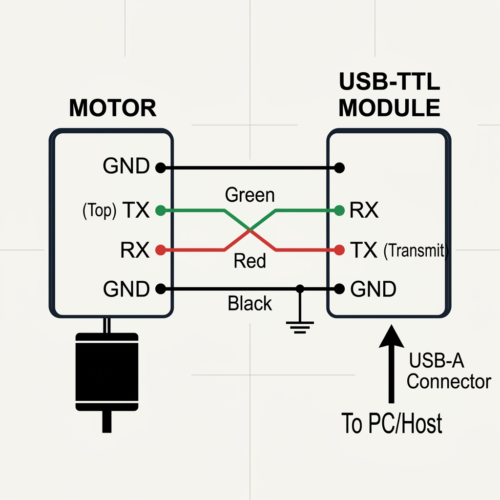
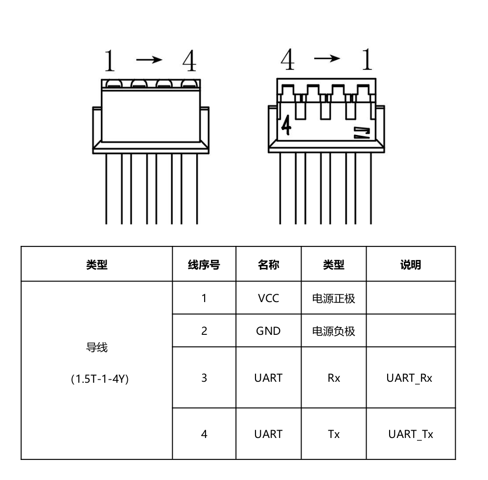
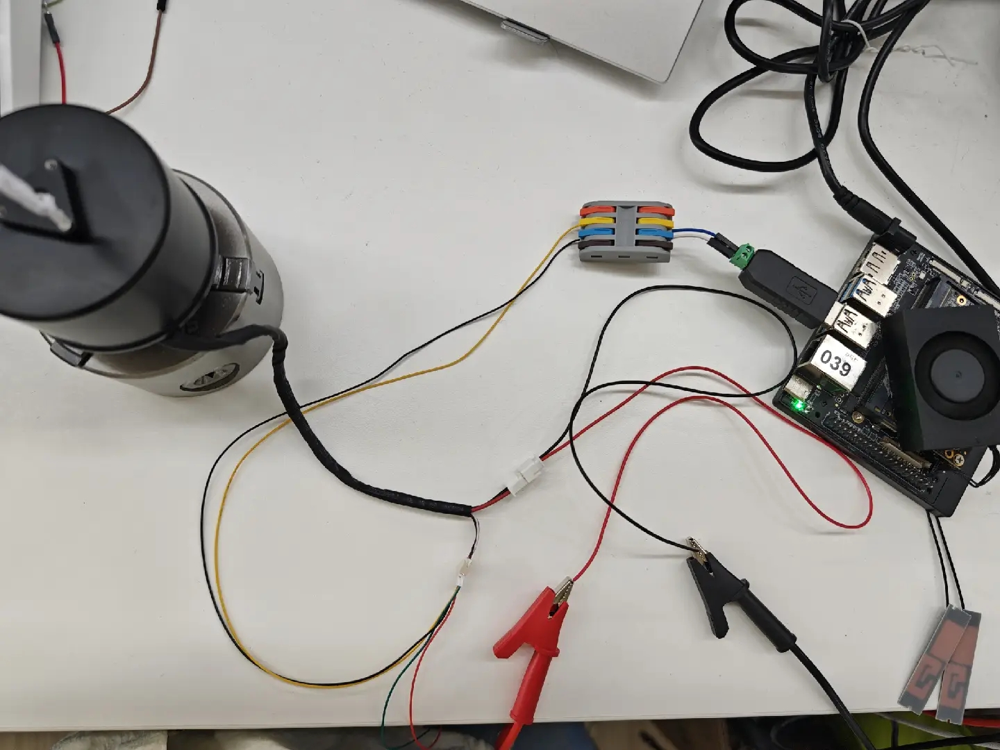
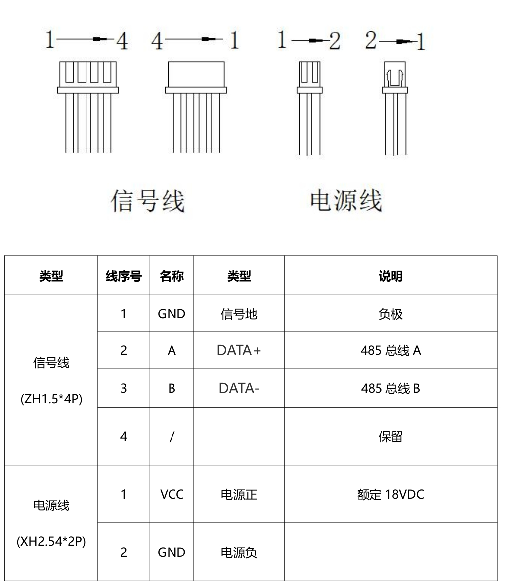
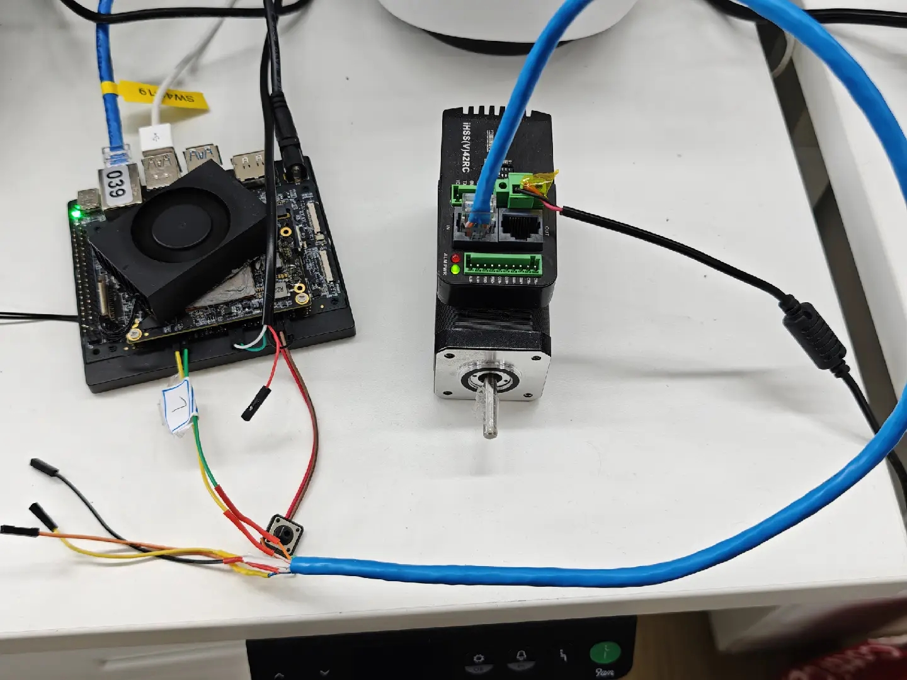

# Peripherals and Drivers · Motor

## 1. Overview

- **Key Features**: The Motor component is a unified motor control framework in the robot peripheral layer. It provides a standardized API for different motor types (PWM, CAN, UART, EtherCAT), enabling "write once, adapt to multiple protocols" and simplifying the integration of multi-protocol motor drivers in complex robot systems.
- **Specifications and Features**:
    - **Interface types**: Supports GPIO/PWM, CAN, UART (RS485/RS232), and EtherCAT (based on the IGH master).
    - **Control modes**: Supports idle (IDLE), velocity (VEL), position (POS), torque (TRQ), MIT impedance control (HYBRID), and EtherCAT synchronous modes (CSP/CSV/PP/PV/HM).
    - **API features**: Supports vectorized batch-operation APIs and an automatic driver-registration mechanism.

- **Software Block Diagram**:

  

- **Directory Structure**:

    | Path | Responsibility |
    | --- | --- |
    | `include/motor.h` | Unified public API header |
    | `src/motor_core.c` | Motor management core logic and factory functions |
    | `src/drivers/drv_485_ddt_m601c111/` | DDT M0601C111 RS485 motor driver implementation |
    | `src/drivers/drv_can_ddt_m152d133/` | DDT M152D133 CAN motor driver implementation |
    | `src/drivers/drv_can_ddt_p1010b/` | DDT P1010B CAN motor driver implementation |
    | `src/drivers/drv_can_dm/` | Damiao CAN motor driver implementation |
    | `src/drivers/drv_canopen_jmc/` | JMC CANOpen motor driver implementation |
    | `src/drivers/drv_ethercat_jmc/` | JMC EtherCAT motor driver implementation |
    | `src/drivers/drv_pwm_generic.c` | Generic PWM motor driver implementation |
    | `src/drivers/drv_pwm_RoHS.c` | RoHS PWM motor driver implementation |
    | `src/drivers/drv_uart_ddt_m603c111/` | DDT M0603C UART motor driver implementation |
    | `src/drivers/drv_uart_feetech/` | Feetech UART servo driver implementation |
    | `src/drivers/drv_uart_xl330/` | Reachy Mini xl330 motor driver implementation |
    | `tests/` | Functional test code for each motor type |

## 2. Environment Setup

### Prerequisites

- **Runtime Environment**: Linux (Ubuntu 20.04+ recommended), x86_64 architecture supported.

- **Hardware and Connections**:
    - **PWM**: Connect a GPIO pin with PWM output capability.
    - **CAN**: Use a CAN-to-USB adapter or an onboard CAN interface, and confirm the 120Ω terminating resistor.
    - **UART**: Connect the USB cable.
    - **EtherCAT**: Connect a servo drive with an EtherCAT slave interface.
- **Tools and Permissions**:
    - **Permissions**: Requires sudo, or add the user to the `dialout` (UART) and `gpio` (PWM) groups.
    - **Configuration**: The CAN interface must be brought up (e.g. `sudo ip link set can0 up type can bitrate 1000000`).

### Build

- **Getting the Code**:
    ```
    # Fetch a single component
    mkdir spacemit_robot && cd spacemit_robot  # SDK root directory

    repo init -u https://github.com/spacemit-robotics/manifest.git -b main -m default.xml \
    --repo-url=https://gitee.com/spacemit-robotics/git-repo \
    -g core,peripherals

    repo sync -j4

    ```
   To fetch everything, refer to [2.3 Building and Compilation](../../02-快速入门/2.3-构建编译.md).
- **Module Compilation**:
    - **Option 1: Standalone build**
      ```bash
      cd components/peripherals/motor
      mkdir build && cd build
      cmake ..
      make -j$(nproc)
      ```
    - **Option 2: SDK integrated build (recommended)**
      ```bash
      source build/envsetup.sh # In the SDK root directory
      lunch  # Select a configuration as needed
      m      # Build the entire system
      # or
      cd components/peripherals/motor
      mm     # Build only this module
      ```
- **Artifacts**: Test executables are output to `build/` (standalone build) or the system's `output/staging/bin` path (SDK build).

## 3. Example Usage (From Scratch)
**Note**: If you use the SDK integrated build, driving different motors requires enabling the corresponding driver per your build configuration.

Depending on the selected configuration, you can enable or disable the compilation of components/packages in the corresponding configuration file. To exclude a specific package, simply remove it from the configuration.
```
ls target/k3-*
target/k3-com260-mars.json        target/k3-humanoid-h1_2.json
target/k3-com260-minimal.json     target/k3-humanoid-qinglong.json
target/k3-com260-reach-mini.json  target/k3-humanoid-r1.json
target/k3-humanoid-asimov.json    target/k3-humanoid-tiangong.json
target/k3-humanoid-g1.json        target/k3-humanoid-tinker.json
target/k3-humanoid-go1.json
```
Take `k3-com260-minimal.json` as an example:
```
{
  "version": "1.0",
  "board": "k3-com260",
  "product": "minimal",
  "description": "K3 COM260 board - minimal build configuration",
  "enabled_packages": [
    "components/peripherals/motor"
  ],
  "enabled_package_options": {
    "components/peripherals/motor": { "enabled_drivers": ["drv_uart_xl330","drv_uart_feetech"] }
  },
  "options": {
    "parallel_jobs": 4,
    "auto_resolve_dependencies": true
  }
}

```
This enables the xl330 motor driver and the Feetech motor driver.
### 3.1 PWM Motor Test

**Prerequisites**: The hardware is connected to a GPIO pin with PWM drive capability.

**Step 1**: Run the test program.
```bash
test_motor_pwm
```

**Step 2**: Expected result.
- The terminal shows that PWM initialized successfully.
- The motor moves at the preset frequency.

---

### 3.2 CAN Motor Test

**Prerequisites**:
1. Hardware: Complete the CAN connection between the development board and the motor, and confirm the motor's communication rate.



- Damiao: DM-J4310 CAN motor, 48V power supply, power cable (with CAN communication terminals): XT30(2+2)-F plug cable ×1

- [DDT: M152D133 CAN motor](src/drivers/drv_can_ddt_m152d133/README.md), 24V power supply

Connect the motor's can_h and can_l to the development board's can_h and can_l respectively.

- [DDT: P1010B CAN motor](src/drivers/drv_can_ddt_p1010b/README.md), 24V power supply, power cable XT30PW-M, signal cable GH1.25-2PWBPZ ×1

Connect the motor's can_h and can_l to the development board's can_h and can_l respectively.

2. Software: Set the bus communication rate to match the target motor.
    ```
    sudo ip link set can0 up type can bitrate 1000000
    ```

**Step 1**: Run the example programs.
```bash
# Damiao J4310 CAN motor (tests the motor with default ID 0x02)
test_motor_can --driver drv_can_dm --if can0 --id 0x02

# DDT M152D133 CAN motor
test_motor_can_ddt_m152d133

# DDT P1010B CAN motor (Note: this program verifies multi-mode switching; limited by the framing mechanism, pay attention to braking and single-parameter configuration constraints)
test_motor_can_ddt_p1010b
```

**Step 2**: Expected result.
- The terminal prints the motor's `pos` (rad), `vel` (rad/s), and `trq` (Nm) data in real time.
- The motor moves smoothly.


---

### 3.3 UART Servo/Motor Test

**Prerequisites**:
1. Hardware:
- Feetech — [bus servo driver board](https://e.tb.cn/h.7Hmq4ScRufPu6im?tk=8s8nU8U1DSh)

- [DDT M0603C UART motor](src/drivers/drv_uart_ddt_m603c111/README.md), 14.4V power supply, USB-TTL, power & signal cable 1.5T-1-4Y

Connect the motor's RX and TX to the USB-to-TTL module's RX and TX respectively. Note that the two must be cross-connected: motor RX to module TX, and motor TX to module RX. In addition, the USB-to-TTL module's GND must be connected to the power supply's negative terminal, i.e. the USB-to-TTL module and the motor share a common ground.

Wiring terminal numbers.


- [DDT M0601C111 RS485 motor](src/drivers/drv_485_ddt_m601c111/README.md), 18V power supply, power cable XH2.54*2P, signal cable ZH1.5*4P, USB-485 module

Connect USB-485 A and B to the DDT motor's signal cable ZH1.5*4P A and B respectively.
The wiring terminal numbers are shown in the figure.



2. Connect a Feetech or Dynamixel (XL/XC) motor to the serial port (e.g. `/dev/ttyACM0`) and confirm permissions.

**Step 1**: Run the Feetech servo test.
```bash
# Format: test_motor_uart <serial port> <baud rate> <driver name (default drv_uart_feetech)> <motor count>
test_motor_uart /dev/ttyACM0 1000000 drv_uart_feetech 1
```

**Step 2**: Run the Reachy Mini (XL330/XC330) motor test.
```bash
test_uart_xl330 /dev/ttyACM0 # Tests the motor with default ID 10 (robot body-yaw)
```

**Step 3**: DDT serial motor test.
```bash
# DDT M0603C UART motor (using ID=1 is recommended)
# Warning: Long-running position mode suffers from integral drift. Avoid switching directly from open-loop/velocity-loop back to position loop; restart if necessary.
test_motor_uart_ddt_m603c111 /dev/ttyUSB0

# DDT M0601C111 RS485 motor (up to 500 Hz communication, request-response)
test_motor_485_ddt_m601c111 /dev/ttyUSB0 1
```

**Step 4**: Expected result.
- The servo/motor rotates to the target angle and reports its real-time position.

---

### 3.4 EtherCAT Servo Motor Test

**Prerequisites**:
1. Power on the hardware, connect the network to a Linux host network port with an IGH master, and run `ls /dev/Ether*` to confirm the device node is enabled.
2. If there are multiple motors, make sure motor 1's OUT port is connected to motor 2's IN port to form a closed loop.
3. Replace the deb.

    **Note: this deb changes the network port to ethercat and is only applicable to the image recommended in [Section 2.2](../../02-快速入门/2.2-镜像烧录.md).**
    ```
    eth1: ethernet@cac82000 {
    -      compatible = "spacemit,k3-gmac", "snps,dwmac-5.10a";
    +      compatible = "spacemit,k3-ec-gmac", "snps,dwmac-4.20a";
          reg = <0x0 0xcac82000 0x0 0x2000>;
          ...
    }
    ```
    - Fetch
      ```
      wget -r -np -nd -R "index.html*" https://archive.spacemit.com/ros2/k3-image-rc4-ethercat/
      ```
    - Replace
      ```
      dpkg -i linux-image-6.18.3-generic_6.18.3-20260506145840_riscv64.deb
      ```
    - Reboot to take effect
      ```
      reboot
      ```
4. Run `ethercat slaves` to confirm the slave is online.

    If there is no output, check the wiring and power supply first.

    

#### Test

**Step 1**: Run the motion test.
```bash
test_motor_ecat # By default, tests two motors

-------------------------------
Usage: test_motor_ecat [options]
Options:
  -m, --motors N    Number of motors (default 2, max 10)
  -c, --cycle MS    Control cycle (default 2 ms)
  -h, --help        Show help information
```
**_Note: This program should not be run from a serial terminal — log printing will severely block EtherCAT communication. If you must use a serial terminal, increase the control cycle to 5 ms or more._**

**Step 2**: Key logic to confirm.
- **Waiting for enable**: The program loops until the slave enters the `OPERATION_ENABLED` state (CiA402 state 0x0027). Wait for it to stabilize for 100 ms before sending non-zero position commands.

**Step 3**: Expected result.
- The motor is enabled and enters position/velocity cyclic mode.

---

### 3.5 CANOpen Servo Motor Test

**Prerequisites**:
1. Hardware: Complete the CAN connection to the JMC servo motor and confirm the bus rate.

   

2. Software: Bring up the CAN interface (e.g. `sudo ip link set can0 up type can bitrate 1000000`; adjust according to the driver's DIP-switch configuration).

**Step 1**: Run the motion test.
```bash
# By default, tests the CANOpen motor with ID 1, control cycle 10 ms
test_motor_canopen_jmc --motors 1 --cycle 10 -v
```

**Step 2**: Key features and logic (see `src/drivers/drv_canopen_jmc/README.md` for details).
- **Automatic state-machine management**: An independent background thread automatically drives the motor through NMT and TPDO/RPDO messages to the `Operation Enabled` state.
- **SDO/PDO interaction**: The program automatically tests synchronous parameter modification (writing acceleration to `0x6083`) and reads it back for verification. **Note: for JMC servos, the `0x6083` acceleration is a non-standard 2-byte length.**
- **Automatic test sequence**: The program serially demonstrates PP (Profile Position) reciprocating motion, PV (Profile Velocity) velocity cruising, and HM (Homing) automatic return-to-zero.

**Step 3**: Expected result.
- The terminal prints "parameter modification verified successfully".
- The motor completes one forward rotation, return-to-zero, one reverse rotation, and return-to-zero. It then rotates forward and reverse at a constant speed, and finally triggers homing.


## 4. Application Development

### 4.1 Minimal Usage Flow

```c
// 1. Initialize: allocate the motor device array and establish the library connection
struct motor_dev **devs = NULL;
int motor_init(&devs, 4); // devs: returns the allocated device object array, 4: number of motors to operate

// 2. Set commands: fill in control parameters and issue them in batch
struct motor_cmd *cmds = (struct motor_cmd *)calloc(4, sizeof(*cmds));
cmds[0].mode = MOTOR_MODE_POSITION; // Set the motor to position control mode
cmds[0].pos_des = 1.0;              // Set the target angle (rad)
motor_set_cmds(devs, cmds, 4);      // Issue the current command to all 4 motors at once

// 3. Read state: get real-time motor feedback data
struct motor_state *states = (struct motor_state *)calloc(4, sizeof(*states));
motor_get_states(devs, states, 4);  // Blocking or non-blocking read of current position/current/error, etc.

// 4. Release resources: close communication and destroy the object array
motor_free(devs, 4);
```

### 4.2 Main API Reference

**1. Initialization and resource management**
```c
// Batch-initialize motors: establish communication connections and allocate internal resources
int motor_init(struct motor_dev **devs, uint32_t count);
// devs: motor device array pointer, count: number of motors

// Batch-release motor resources: disconnect communication and free memory
void motor_free(struct motor_dev **devs, uint32_t count);
// devs: motor device array pointer, count: number of motors
```

**2. Core control and state reading**
```c
// Batch-set control commands: send position, velocity, torque, or MIT hybrid commands
int motor_set_cmds(struct motor_dev **devs, const struct motor_cmd *cmds, uint32_t count);
// devs: motor device array, cmds: command array, count: number of motors

// Batch-read motor states: get the latest real-time feedback data for all motors
int motor_get_states(struct motor_dev **devs, struct motor_state *states, uint32_t count);
// devs: motor device array, states: state array (output), count: number of motors
```

**3. Low-level parameter configuration (registers/object dictionary)**
```c
// Write low-level motor parameters (registers or dictionary indices, etc.)
int motor_set_paras(struct motor_dev *dev, const void *address, const void *data, uint32_t data_len);
// dev: motor device, address: parameter address/index pointer, data: pointer to the data to write, data_len: data length in bytes

// Read low-level motor parameters (registers or dictionary indices, etc.)
int motor_get_paras(struct motor_dev *dev, const void *address, void *out_data, uint32_t data_len);
// dev: motor device, address: parameter address/index pointer, out_data: pointer to the read data buffer, data_len: data length in bytes
```

### 4.3 Core Data Structures

**Motor control command struct**
```c
struct motor_cmd {
    uint32_t mode;    // Control mode
    float    pos_des; // Target position (rad)
    float    vel_des; // Target velocity (rad/s)
    float    trq_des; // Target torque (Nm) or feedforward torque
    float    kp;      // Stiffness gain (HYBRID mode)
    float    kd;      // Damping gain (HYBRID mode)
};
```

**Motor state feedback struct**
```c
struct motor_state {
    float    pos;  // Current position (rad)
    float    vel;  // Current velocity (rad/s)
    float    trq;  // Current torque (Nm)
    float    temp; // Temperature (°C)
    uint32_t err;  // Error flags
};
```


## 5. Debugging Guide

- **Debug output**: Enabling the `-DDEBUG_MOTOR` macro at compile time prints the raw hex data of the low-level driver's sent and received packets.
- **Toolchain assistance**:
    - **CAN**: Use `candump can0` to monitor messages and `cansend` to simulate sending.
    - **UART**: Use `minicom` to check physical connectivity and check the permissions of the `/dev/ttyUSB*` device nodes.
    - **EtherCAT**: Use `ethercat slaves` and `ethercat rescan` to maintain the connection.
- **Information to collect for common issues**: When the driver reports abnormal feedback, provide the `dmesg` log and the `err` error code from `motor_state`.

## 6. FAQ

| Symptom | Possible Cause | Resolution |
| --- | --- | --- |
| UART motor is not recognized | Incorrect ID encoding or insufficient permissions | Check the ID encoding of `motor_alloc_uart` and confirm `dialout` permissions |
| CAN motor does not respond | ID conflict or baud rate mismatch | Confirm the bus ID is unique and matches the rate set by `ip link set` |
| EtherCAT motor enable fails | Abnormal master state or the wait logic was not executed | Check `ethercat master` state and ensure a 100 ms stabilization wait after startup |
| PWM motor does not move | Wrong GPIO number or reversed signal wires | Check the hardware schematic to confirm the GPIO index |

## Appendix: Supported Motor Model List

| Type | Motor Model | Driver Name | Notes |
| --- | --- | --- | --- |
| **CAN** | Damiao DM-J4310-2EC / DM4310 | `drv_can_dm` | MIT mode recommended |
| **CAN** | JMC CANOpen servo | `drv_canopen_jmc` | Automatic state-machine management, supports PP/PV/HM |
| **CAN** | [DDT M152D133](src/drivers/drv_can_ddt_m152d133/README.md)  | `drv_can_ddt_m152d133` | Automatically resolves multi-turn position; supports PI tuning and feedback-period configuration |
| **CAN** | [DDT P1010B](src/drivers/drv_can_ddt_p1010b/README.md)  | `drv_can_ddt_p1010b` | Framing mechanism (one frame controls multiple motors); pay attention to braking and parameter-write logic |
| **EtherCAT** | JMC IHSS42-EC | `drv_ethercat_jmc` | Integrated stepper servo |
| **UART** | Feetech STS3215  | `drv_uart_feetech` | Smart servo |
| **UART** | Dynamixel XL330 / XC330 | `drv_uart_xl330` | For Reachy Mini; includes Python bindings |
| **UART** | [DDT M0603C](src/drivers/drv_uart_ddt_m603c111/README.md)  | `drv_uart_ddt_m603c111` | Built-in safety protection thresholds; beware of position integral drift and homing-reversal risk |
| **RS485** | [DDT M0601C111](src/drivers/drv_485_ddt_m601c111/README.md)  | `drv_485_ddt_m601c111` | Request-response up to 500 Hz; provides current/velocity/position loop control |
| **PWM** | Generic stepper/DC motor | `drv_pwm_generic` / `drv_pwm_RoHS` | Requires GPIO/PWM hardware support |
