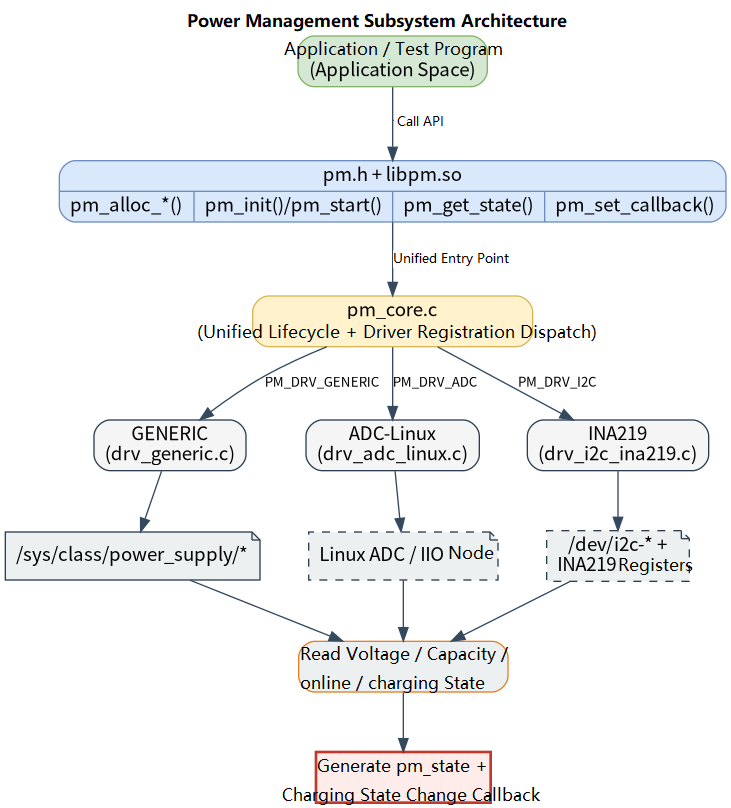

# Peripherals and Drivers · PM

## 1. Overview

- **Key Features**: The `pm` module, located at `components/peripherals/pm`, is a user-space component for power management and battery state reading. The module wraps multiple low-level drivers through a unified `pm.h` interface, providing upper layers with battery level and charge/discharge state reading capabilities, and supports triggering a callback when state changes occur.
- **Specifications and Features**: Exposes a C interface via `pm.h` + `libpm.so`; the public `struct pm_state` reserves fields for voltage, current, power, percentage, temperature, health, cycle count, and individual cell voltages; the only currently functional driver is `GENERIC`, which reads `online` and `capacity` from Linux `/sys/class/power_supply/` nodes and polls for charging state changes at `1 Hz`; the `ADC-Linux` and `INA219` driver factory functions and interfaces are stubbed out but their underlying sampling and switch control remain `TODO` skeleton implementations and should not be treated as production-ready.
- **Software Block Diagram**: See the diagram below.

  

- **Directory Structure**:

  | Path | Responsibility |
  | --- | --- |
  | `components/peripherals/pm/include/pm.h` | Publicly exposed state struct, configuration struct, and API declarations |
  | `components/peripherals/pm/src/pm_core.h` | Private driver registration, vtable, and device object definitions |
  | `components/peripherals/pm/src/pm_core.c` | Factory functions, default configuration, state reading, and driver registration dispatch |
  | `components/peripherals/pm/src/drivers/drv_generic.c` | Generic battery state reading driver based on `power_supply` sysfs nodes |
  | `components/peripherals/pm/src/drivers/drv_adc_linux.c` | Linux ADC sampling driver skeleton; core read logic not yet implemented |
  | `components/peripherals/pm/src/drivers/drv_i2c_ina219.c` | INA219 I2C driver skeleton; register configuration and read logic not yet implemented |
  | `components/peripherals/pm/test/test_pm_generic.c` | Generic driver demo program showing state reading and state-change callbacks |
  | `components/peripherals/pm/test/test_pm_adc.c` | ADC driver demo program, currently mainly use for illustrating the API call pattern |
  | `components/peripherals/pm/CMakeLists.txt` | Module build, install, driver enablement, and test target definitions |
  | `components/peripherals/pm/README.md` | Standalone usage guide and quick start |

## 2. Environment Setup

### Prerequisites

- **Runtime Environment**: Recommended board environment: `k1-deb1` with the matching system image; `cmake`, `make`, and `gcc` or `clang` must be available; the module builds under C99 and depends on `pthread`.

- **Hardware and Connections**: The board must integrate the CW2015 fuel gauge chip and IP2317 charge management chip, and the kernel must have their drivers enabled along with the appropriate DTS configuration.

### Build

- **Getting the Code**: See the [2.3 Building and Compilation](../../02-快速入门/2.3-构建编译.md) section for cloning the complete SDK with the `repo` tool. All build and test commands below are run from inside the SDK.

- **Module Compilation**:
    - **Option 1: Standalone build**
      ```bash
      cd components/peripherals/pm
      mkdir build && cd build
      cmake .. -DBUILD_TESTS=ON
      make -j$(nproc)
      ```
    - **Option 2: SDK integrated build (recommended)**
      ```bash
      source build/envsetup.sh
      cd components/peripherals/pm
      mm     # Build this module only
      ```

- **Artifacts**: `libpm.so` is output to `build/`; when `BUILD_TESTS` is enabled, `test_pm_generic` and `test_pm_adc` are also generated. SDK build artifacts are installed to the system's `output/staging/{lib,bin}` path.

- **Notes**: At least `drv_generic` is enabled by default.

## 3. Example Usage (From Scratch)

This section provides a step-by-step path for readers to reproduce the examples from scratch:

### 3.1 Run the built-in `test_pm_generic` demo program

**Prerequisites**: Confirm that the target board exposes readable `power_supply` nodes. If your node names differ from the defaults `ip2317-charger` and `cw-bat`, pass the actual names as arguments when running the program.

**Step 1**: Confirm the `power_supply` nodes exist and are readable.

```bash
ls /sys/class/power_supply/ip2317-charger/online
ls /sys/class/power_supply/cw-bat/capacity
cat /sys/class/power_supply/ip2317-charger/online
cat /sys/class/power_supply/cw-bat/capacity
```

Expected result: The first two commands find the files; the last two print an integer. Typically `online` is `0` or `1`, and `capacity` is an integer from `0` to `100`. If your platform uses different node names, replace `ip2317-charger` and `cw-bat` with the actual names.

**Step 2**: Build in the component directory.

```bash
cd components/peripherals/pm
cmake -S . -B build -DBUILD_TESTS=ON
cmake --build build -j$(nproc)
```

Expected result: The command completes successfully with exit code `0`; `libpm.so`, `test_pm_generic`, and `test_pm_adc` are generated in the `build/` directory.

**Step 3**: Run the generic driver demo program.

```bash
cd components/peripherals/pm
./build/test_pm_generic
```

To specify different node names explicitly:

```bash
cd components/peripherals/pm
./build/test_pm_generic <charger_node> <capacity_node>
```

Expected result: The terminal first prints device creation, initialization, and callback registration messages, for example: `=== PM GENERIC Test ===`, `[1] Creating GENERIC PM device...`, `[GENERIC] init:`, `Callback registered`.

**Step 4**: Observe periodic state output and state-change callbacks.

Expected result:
- The program calls `pm_get_state()` once per second, continuously printing state information of the form `[state] SOC=78.0% status=2`.
- When `online` changes from `0` to `1`, the callback thread prints `[callback] Charging, SOC=...%`.
- When `online` changes from `1` to `0`, the callback thread prints `[callback] Discharging, SOC=...%`.
- If the charging state does not change, the callback does not fire repeatedly — this is the expected behavior for the current implementation.

**Step 5**: Exit the program.

Expected result: `test_pm_generic` continues running after the first 20 state prints, entering a loop that waits only for callbacks. Press `Ctrl+C` to exit. Because the demo does not include extra signal cleanup logic, the user-space teardown prints after `pm_free()` will not be reached on termination — this is normal for the current sample code.

## 4. Application Development

### 4.1 Minimal Usage Flow

```c
static void on_power_event(struct pm_dev *dev, const struct pm_state *state, void *ctx)
{
    (void)dev;
    (void)ctx;
    printf("status=%d soc=%.1f%%\n", state->status, state->percentage);
}

int main(void)
{
    struct pm_dev *batt =
        pm_alloc_generic("main_batt", "ip2317-charger", "cw-bat", NULL);
    if (!batt) {
        return -1;
    }

    if (pm_init(batt, NULL) < 0) {
        pm_free(batt);
        return -1;
    }

    pm_set_callback(batt, on_power_event, NULL);

    struct pm_state st = {0};
    if (pm_get_state(batt, &st) == 0) {
        printf("soc=%.1f%% status=%d\n", st.percentage, st.status);
    }

    pm_free(batt);
    return 0;
}
```

### 4.2 Main API Reference

**1. Device creation and lifecycle**
```c
// Create an ADC, digital power monitor, or GENERIC device
struct pm_dev *pm_alloc_adc(const char *name, const char *adc_dev, float scale);
struct pm_dev *pm_alloc_digital(const char *name, const char *protocol, const char *dev_path, uint32_t addr);
struct pm_dev *pm_alloc_generic(const char *name, const char *charger_node, const char *capacity_node, void *args);

// Initialize and release
int pm_init(struct pm_dev *dev, const struct pm_config *cfg);
void pm_free(struct pm_dev *dev);
```

**2. State reading and callbacks**
```c
// Register a state-change callback
void pm_set_callback(struct pm_dev *dev, pm_callback_t cb, void *ctx);

// Start periodic sampling (currently still a placeholder interface)
int pm_start(struct pm_dev *dev, uint32_t freq_hz);

// Read the current state
int pm_get_state(struct pm_dev *dev, struct pm_state *out_state);
```

**3. Power switch control**
```c
// Control the enable state of a named channel
int pm_switch_set(struct pm_dev *dev, const char *channel_name, bool enable);
bool pm_switch_get(struct pm_dev *dev, const char *channel_name);
```

### 4.3 Core Data Structures

**Power configuration struct**
```c
struct pm_config {
    float capacity_mah;
    float max_voltage;
    float min_voltage;
    float warn_voltage;
    float crit_voltage;
    float max_temp;
};
```

**Power state struct**
```c
struct pm_state {
    uint64_t timestamp_us;
    float voltage;
    float current;
    float power;
    float percentage;
    float temperature;
    float health;
    uint32_t cycle_count;
    enum pm_status status;
    uint32_t error_code;
    uint8_t cell_count;
    float cell_voltages[16];
};
```

**State callback prototype**
```c
typedef void (*pm_callback_t)(struct pm_dev *dev, const struct pm_state *state, void *ctx);
```

Development notes: `pm_alloc_generic()` selects the `GENERIC` driver by default; `pm_init(dev, NULL)` uses the library's default configuration; the current `GENERIC` driver reliably outputs `percentage` and `status` — many other fields remain reserved; `pm_set_callback()` under the `GENERIC` driver starts an internal thread that fires the callback on charge/discharge state changes; `pm_start()` is currently a placeholder — for now, rely on polling with `pm_get_state()` or the `GENERIC` driver's internal callback thread.

**Reference demos and example paths**
```text
components/peripherals/pm/test/test_pm_generic.c
components/peripherals/pm/test/test_pm_adc.c
```

## 5. Debugging Guide

- If `test_pm_generic` continuously prints `[state] read failed`, first check that the `power_supply` nodes exist, are readable, and contain plain integers.
- If the state is printing but the callback never fires, confirm that the charge/discharge status is actually changing. The callback fires only when `status` changes; a SOC change alone does not trigger it.
- If `pm_start()` was called but there is no automatic sampling effect, this is the current implementation behavior — use `pm_get_state()` polling or `pm_set_callback()` for now.

## 6. FAQ

None at this time.
