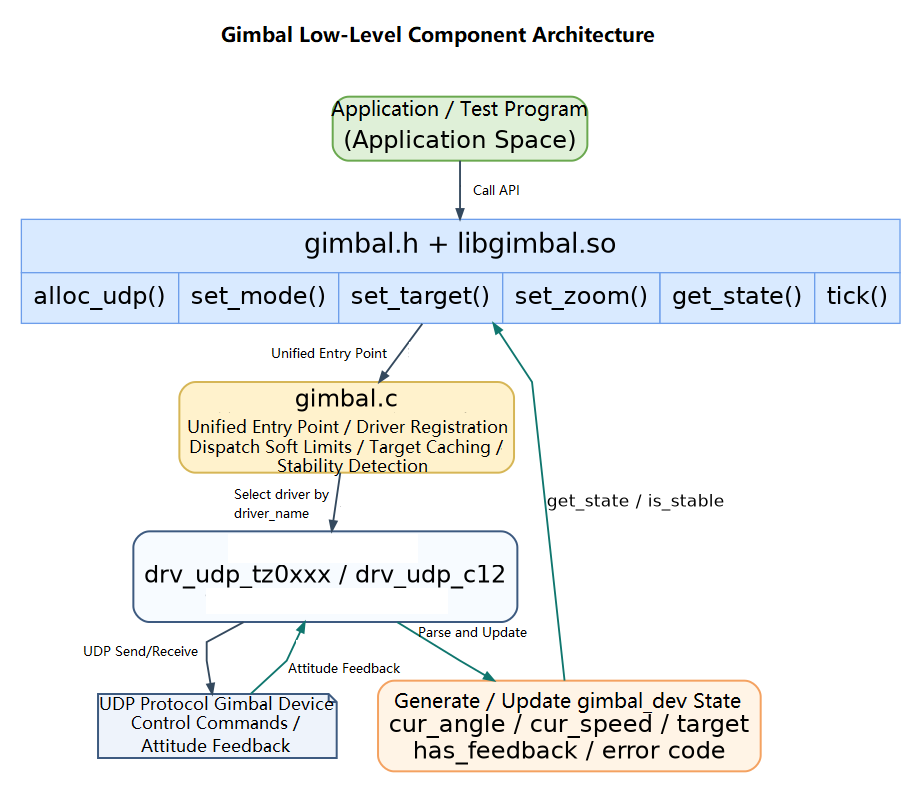

# Peripherals and Drivers · Gimbal

## 1. Overview

- **Key Features**: The `gimbal` module, located at `components/control/gimbal`, is a user-space gimbal control component. It wraps different gimbal protocols through a unified `gimbal.h` C API, providing upper layers with mode switching, angle control, speed control, zoom control, state reading, soft limits, and stability detection. The current implementation targets UDP gimbal devices and supports the TZ0xxx series and the Skydroid C12 gimbal.
- **Specifications and Features**: Exposes an interface via `gimbal.h` + `libgimbal.so`; the default build includes both `drv_udp_tz0xxx` and `drv_udp_c12` drivers, though CMake variables can restrict it to specific drivers; angles and angular velocities use degrees — `pitch` for pitch, `yaw` for yaw, `roll` for roll; the application must call `gimbal_tick()` periodically to receive UDP feedback and advance the speed-mode resend logic, with a recommended period of around `20 ms`.
- **Supported capabilities**:
  - Gimbal control modes: `OFF`, `ANGLE_ABS`, `ANGLE_REL`, `SPEED`, `FOLLOW`, `FPV`, `LOCK`, `CALIBRATE`.
  - Angle control: supports both absolute and relative target angle commands.
  - Speed control: supports yaw/pitch angular velocity commands with periodic resend at `resend_period_s`.
  - Zoom control: TZ0xxx maps to optical zoom commands; C12 maps to DZM digital zoom step commands.
  - State reading: parses current angle from feedback frames and calculates angular velocity from successive frames.
  - Stability detection: determines whether the gimbal has reached its target based on feedback freshness, angular velocity, and target angle error.
- **System Architecture**:

  

- **Directory Structure**:

| Path | Responsibility |
| --- | --- |
| `components/control/gimbal/include/gimbal.h` | Publicly exposed gimbal control C API, mode enums, angle struct, and error codes |
| `components/control/gimbal/src/gimbal.c` | Core gimbal logic — driver lookup, soft limits, target caching, state reading, and stability detection |
| `components/control/gimbal/src/gimbal_core.h` | Private device object, driver vtable, auto-registration macros, and internal utility functions |
| `components/control/gimbal/src/drivers/drv_udp_tz0xxx.c` | TZ0xxx series UDP gimbal driver |
| `components/control/gimbal/src/drivers/drv_udp_c12.c` | Skydroid C12 TOP UDP gimbal driver |
| `components/control/gimbal/test/test_gimbal_udp.c` | Unified UDP gimbal test program |
| `components/control/gimbal/CMakeLists.txt` | Module build, driver selection, test program, and install rules |
| `components/control/gimbal/README.md` | Standalone component usage guide |

## 2. Environment Setup

### Prerequisites

- **Runtime Environment**: Recommended board environment: `k3-com260` with the matching system image; `gcc`, `make`, and `cmake` are required; the module builds under C99 and depends on `pthread` and `libm`.
- **Hardware and Connections**:
  - TZ0xxx gimbal: the common device address used in examples is `192.168.44.160:4900`.
  - Skydroid C12 gimbal: the default device address is `192.168.144.108:5000`; it is recommended to bind local port `5000` to receive feedback.
  - The gimbal must be powered on and connected via Ethernet to the development board or a switch on the same subnet.
- **Tools and Permissions**: The running user needs ordinary UDP network access permissions. For troubleshooting, prepare tools such as `ping`, `ss`, `tcpdump`, and `strings`. Packet capture typically requires `sudo`.

### Build

- **Getting the Code**: See the [2.3 Building and Compilation](../../02-快速入门/2.3-构建编译.md) section for cloning the complete SDK with the `repo` tool. All build and test commands below are run from inside the SDK.

- **Module Compilation**:
  - **Option 1: Standalone build**

    ```bash
    cd components/control/gimbal
    mkdir -p build
    cd build
    cmake .. -DBUILD_TESTS=ON
    make -j$(nproc)
    ```

  - **Option 2: Enable only specified drivers**

    ```bash
    cd components/control/gimbal
    mkdir -p build
    cd build
    cmake .. -DBUILD_TESTS=ON -DSROBOTIS_CONTROL_GIMBAL_ENABLED_DRIVERS="drv_udp_c12"
    make -j$(nproc)
    ```

    To enable both UDP drivers at once:

    ```bash
    cmake .. -DBUILD_TESTS=ON -DSROBOTIS_CONTROL_GIMBAL_ENABLED_DRIVERS="drv_udp_tz0xxx;drv_udp_c12"
    ```

  - **Option 3: SDK integrated build**

    ```bash
    source build/envsetup.sh
    cd components/control/gimbal
    mm
    ```

- **Artifacts**: For a standalone build, `libgimbal.so` and `test_gimbal_udp` are output to `components/control/gimbal/build/`; for an SDK integrated build, they are installed to `output/staging/lib/libgimbal.so`, `output/staging/include/gimbal.h`, and `output/staging/bin/test_gimbal_udp`.

- **Notes**: Always pass the device IP, device port, and local bind port explicitly in the application; do not rely on the driver's internal defaults. `test_gimbal_udp` provides default parameters for common device addresses.

## 3. Example Usage (From Scratch)

This section provides a step-by-step path for readers to reproduce the examples from scratch. Before running, confirm the area around the gimbal is clear to avoid collisions during large-angle movements.

### 3.1 Run the C12 UDP gimbal test

**Prerequisites**: The C12 gimbal is powered on and the target board or debug host is connected to the `192.168.144.0/24` subnet.

**Step 1**: Configure the host network interface and confirm the device is reachable. Replace the interface name with the actual one.

```bash
ifconfig eth0 192.168.144.100 netmask 255.255.255.0 up
route add -net 192.168.144.0 netmask 255.255.255.0 dev eth0
ping -c 3 192.168.144.108
```

Expected result: `ping` receives responses. If unreachable, check power, cabling, switch, local IP, and gimbal IP first.

**Step 2**: Build the component.

```bash
cd components/control/gimbal
mkdir -p build
cd build
cmake .. -DBUILD_TESTS=ON
make -j$(nproc)
```

Expected result: `libgimbal.so` and `test_gimbal_udp` are generated in the `build/` directory.

**Step 3**: Run the C12 test program.

```bash
cd components/control/gimbal/build
./test_gimbal_udp --driver drv_udp_c12 --ip 192.168.144.108 --port 5000 --bind-port 5000
```

Expected result:
- The terminal prints the registered drivers and `Gimbal UDP Demo` startup information.
- The program sequentially runs center return, absolute angle control, relative angle control, speed control, zoom, and lock mode switching.
- After receiving valid feedback, it periodically prints `[RX-STATE] pitch=... yaw=... roll=...`.
- If `waiting feedback...` is printed continuously, no feedback has been received within 0.5 seconds; first check whether local port `5000` is bound and whether the network is bidirectionally reachable.

### 3.2 Run the TZ0xxx UDP gimbal test

**Prerequisites**: The TZ0xxx gimbal is powered on and the target board or debug host is connected to the gimbal's subnet. The following example uses the common address `192.168.44.160:4900`.

**Step 1**: Configure the host network interface and confirm the device is reachable.

```bash
ifconfig eth0 192.168.44.100 netmask 255.255.255.0 up
ping -c 3 192.168.44.160
```

**Step 2**: Run the TZ0xxx test program.

```bash
cd components/control/gimbal/build
./test_gimbal_udp --driver drv_udp_tz0xxx --ip 192.168.44.160 --port 4900 --bind-port 4900
```

Expected result: The terminal prints `[GIMBAL-T-UDP] Initialized driver 'drv_udp_tz0xxx'`; the program executes the demo actions and outputs attitude feedback. If the gimbal moves normally but no feedback is received, capture packets to confirm whether UDP port `4900` has return traffic.

### 3.3 Call the low-level API from a custom program

**Prerequisites**: The component build is complete and the application can include `gimbal.h` and link `libgimbal.so`.

**Step 1**: Create a UDP gimbal device.

```c
#include <stdio.h>
#include <unistd.h>

#include "gimbal.h"

int main(void)
{
    gimbal_udp_config_t cfg = {
        .bind_ip = "0.0.0.0",
        .bind_port = 5000,
        .device_ip = "192.168.144.108",
        .device_port = 5000,
        .resend_period_s = 0.02f,
    };

    struct gimbal_dev *dev = gimbal_alloc_udp("drv_udp_c12", &cfg);
    if (!dev) {
        fprintf(stderr, "alloc gimbal failed\n");
        return -1;
    }
```

**Step 2**: Set limits, switch mode, and send the target angle.

```c
    gimbal_limits_t limits = {
        .max_angle = {.pitch = 90.0f, .yaw = 90.0f, .roll = 90.0f},
        .min_angle = {.pitch = -90.0f, .yaw = -90.0f, .roll = -90.0f},
        .max_speed = {.pitch = 9.9f, .yaw = 9.9f, .roll = 0.0f},
    };
    (void)gimbal_set_limits(dev, &limits);

    if (gimbal_set_mode(dev, GIMBAL_MODE_LOCK) != GIMBAL_OK ||
        gimbal_set_mode(dev, GIMBAL_MODE_ANGLE_ABS) != GIMBAL_OK) {
        gimbal_free(dev);
        return -1;
    }

    gimbal_euler_t target = {
        .pitch = -10.0f,
        .yaw = 10.0f,
        .roll = 0.0f,
    };

    if (gimbal_set_target(dev, &target) != GIMBAL_OK) {
        gimbal_free(dev);
        return -1;
    }
```

**Step 3**: Call `gimbal_tick()` periodically and read the state.

```c
    for (int i = 0; i < 250; ++i) {
        gimbal_tick(dev, 0.02f);

        gimbal_euler_t angle = {0.0f, 0.0f, 0.0f};
        gimbal_euler_t speed = {0.0f, 0.0f, 0.0f};
        if (gimbal_get_state(dev, &angle, &speed) == GIMBAL_OK) {
            printf("pitch=%.2f yaw=%.2f roll=%.2f stable=%s\n",
                   angle.pitch, angle.yaw, angle.roll,
                   gimbal_is_stable(dev, 1.5f) ? "yes" : "no");
        }

        usleep(20000);
    }

    gimbal_set_zoom(dev, GIMBAL_ZOOM_IN, 0);
    gimbal_tick(dev, 0.02f);

    gimbal_free(dev);
    return 0;
}
```

**Step 4**: Compile and run. Assuming the example file is named `demo_gimbal.c`:

```bash
gcc demo_gimbal.c \
  -Icomponents/control/gimbal/include \
  -Lcomponents/control/gimbal/build \
  -lgimbal -lpthread -lm \
  -Wl,-rpath,components/control/gimbal/build \
  -o demo_gimbal

./demo_gimbal
```

Expected result: After creating the gimbal device, the program reads attitude feedback periodically and releases resources before exiting.

## 4. Application Development

### 4.1 Main API Reference

**1. Device creation and release**

```c
struct gimbal_dev *gimbal_alloc_udp(const char *driver_name, void *args);
void gimbal_free(struct gimbal_dev *dev);
```

`driver_name` currently accepts `drv_udp_tz0xxx` or `drv_udp_c12`. The `args` parameter for UDP drivers is `gimbal_udp_config_t *`; passing `NULL` uses the driver's internal defaults, but explicit configuration is recommended for real projects.

**2. Control interface**

```c
int gimbal_set_mode(struct gimbal_dev *dev, gimbal_mode_t mode);
int gimbal_set_target(struct gimbal_dev *dev, const gimbal_euler_t *target);
int gimbal_set_limits(struct gimbal_dev *dev, const gimbal_limits_t *limits);
int gimbal_set_zoom(struct gimbal_dev *dev, gimbal_zoom_dir_t dir,
                    uint8_t speed_level);
```

**3. Feedback and periodic interface**

```c
int gimbal_get_state(struct gimbal_dev *dev, gimbal_euler_t *out_angle,
                     gimbal_euler_t *out_speed);
bool gimbal_is_stable(struct gimbal_dev *dev, float threshold_deg);
void gimbal_tick(struct gimbal_dev *dev, float dt_s);
```

`gimbal_get_state()` returns `GIMBAL_OK` only when valid feedback was received within the last `0.5 s`; otherwise it returns `GIMBAL_ERR_TIMEOUT`. `gimbal_is_stable()` requires fresh feedback, all-axis angular velocity below `1 deg/s`, and current angle within `threshold_deg` of the target.

### 4.2 Core Data Structures

**Euler angle struct**

```c
typedef struct {
    float pitch;
    float yaw;
    float roll;
} gimbal_euler_t;
```

**UDP configuration struct**

```c
typedef struct {
    const char *bind_ip;
    uint16_t bind_port;
    const char *device_ip;
    uint16_t device_port;
    float resend_period_s;
} gimbal_udp_config_t;
```

**Soft limit struct**

```c
typedef struct {
    gimbal_euler_t max_angle;
    gimbal_euler_t min_angle;
    gimbal_euler_t max_speed;
} gimbal_limits_t;
```

**Common error codes**

| Error Code | Meaning |
| --- | --- |
| `GIMBAL_OK` | Success |
| `GIMBAL_ERR_ALLOC` | Memory allocation failed |
| `GIMBAL_ERR_CONNECT` | Network operation failed (socket, bind, sendto, etc.) |
| `GIMBAL_ERR_TIMEOUT` | State feedback timed out |
| `GIMBAL_ERR_CONFIG` | Configuration error |
| `GIMBAL_ERR_PARAM` | Parameter error |
| `GIMBAL_ERR_NOSYS` | The current driver does not implement this capability |

### 4.3 Usage Notes

- Recommended call sequence: `gimbal_alloc_udp()` → `gimbal_set_limits()` → `gimbal_set_mode()` → `gimbal_set_target()` / `gimbal_set_zoom()` → periodic `gimbal_tick()` and `gimbal_get_state()` → `gimbal_free()`.
- `GIMBAL_MODE_ANGLE_REL` computes the absolute target from the cached current angle, so valid feedback must already be received before sending a relative angle command.
- In `GIMBAL_MODE_SPEED`, the target value represents angular velocity — the gimbal does not stop automatically on reaching a particular angle; explicitly send a zero-velocity target or switch to another mode to stop.
- Soft limits are enforced in `gimbal.c` at the unified layer: angle modes clamp to `min_angle` / `max_angle`; speed mode clamps to `max_speed`.
- `gimbal_tick()` reads UDP feedback and periodically resends commands in speed mode — the application loop must not omit it.
- The C12 driver sends a GAA command on creation to enable attitude feedback and attempts to disable it on release. If the program exits abnormally, the device-side feedback state may need to be reset by restarting the program or reconfiguring.
- The C12 currently has fairly complete yaw/pitch control; the roll axis is mainly used for feedback parsing; `speed_level` has no effect on digital zoom in C12.

**Reference demos and example paths**

```text
components/control/gimbal/test/test_gimbal_udp.c
components/control/gimbal/include/gimbal.h
components/control/gimbal/src/drivers/drv_udp_tz0xxx.c
components/control/gimbal/src/drivers/drv_udp_c12.c
```

## 5. Debugging Guide

- Use `test_gimbal_udp` first to verify the low-level link. Once the network, ports, driver name, and gimbal protocol are confirmed correct, integrate into the upper-layer application or ROS 2 node.
- View the test program's available options:

  ```bash
  cd components/control/gimbal/build
  ./test_gimbal_udp --help
  ```

- Confirm network and ports:

  ```bash 
  ping -c 3 192.168.44.160
  ss -anu | grep 4900
  sudo tcpdump -ni any udp port 4900
  ```

  For C12, use:

  ```bash
  ping -c 3 192.168.144.108
  ss -anu | grep 5000
  sudo tcpdump -ni any udp port 5000
  ```

- Confirm that `libgimbal.so` contains the target driver:

  ```bash
  strings components/control/gimbal/build/libgimbal.so | grep drv_udp
  ```

  Expected output: `drv_udp_tz0xxx` and/or `drv_udp_c12`, depending on which drivers were compiled in.

- If the application reports `libgimbal.so` not found, set temporarily:

  ```bash
  export LD_LIBRARY_PATH=$PWD/components/control/gimbal/build:$LD_LIBRARY_PATH
  ```

- When coordinating with hardware or firmware engineers, provide: gimbal model, firmware version, device IP and port, local IP and bind port, full launch command, `test_gimbal_udp` output, `ping`/`ss`/`tcpdump` results, and whether attitude feedback is being received.

## 6. FAQ

None at this time.
