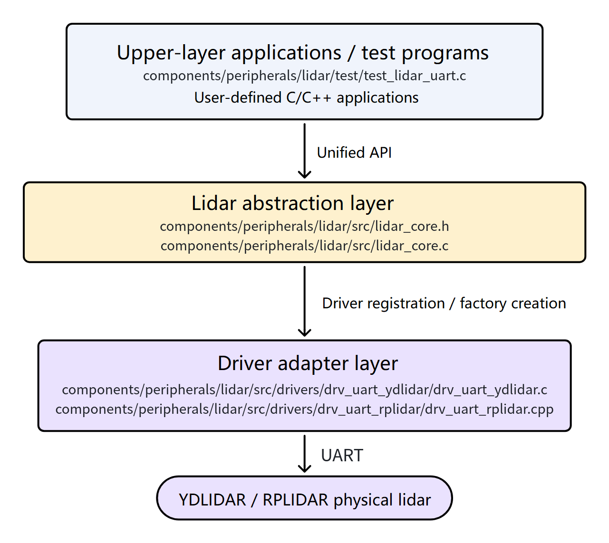
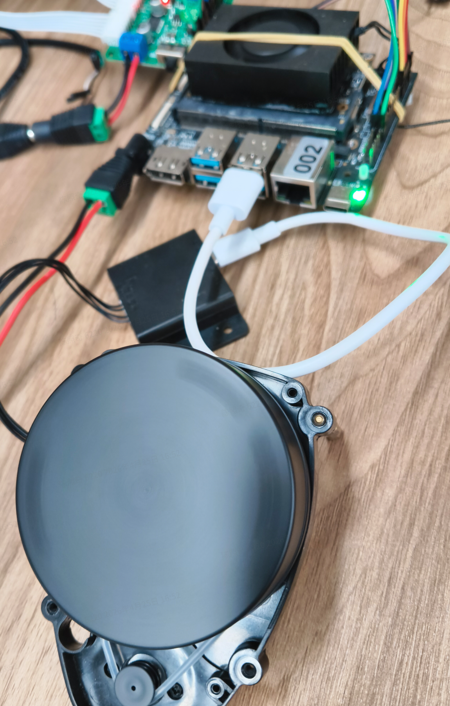
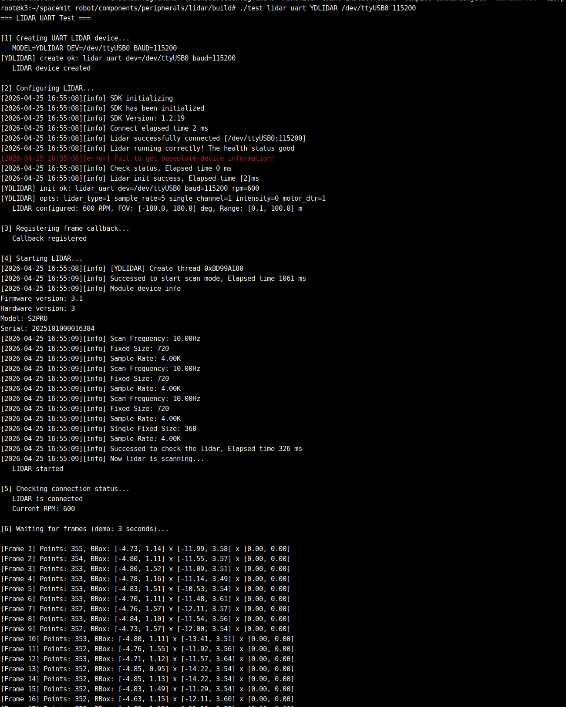
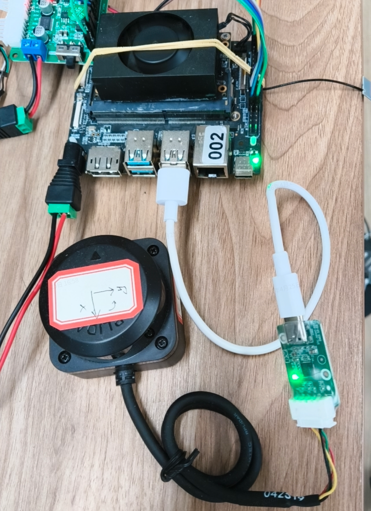
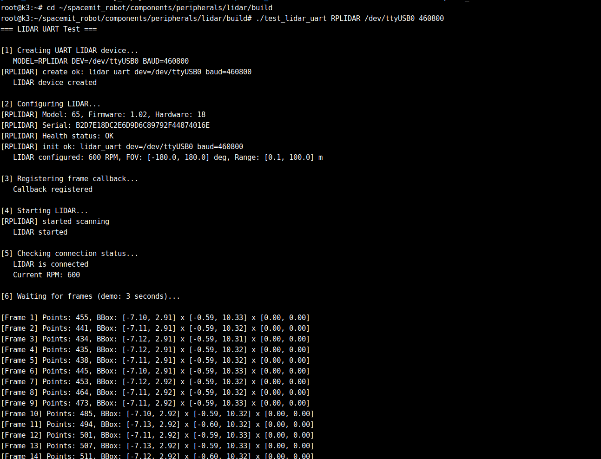

# Peripherals and Drivers · Lidar

## 1. Overview

- **Key Features**: The `lidar` component is located at `components/peripherals/lidar/` and provides a unified lidar abstraction layer that shields upper-layer applications from the differences between various manufacturers and 2D lidar models, outputting a consistent point-cloud frame interface. The project currently integrates two types of serial lidars, `YDLIDAR` and `RPLIDAR`, which can be used for low-level acquisition verification, point-cloud callback processing, and upper-layer algorithm integration.
- **Specifications and Features**:
	- **Interface types**: Currently mainly UART serial access; `Ethernet` and `Sim` interfaces are reserved.
	- **Supported drivers**: `drv_uart_ydlidar`, `drv_uart_rplidar`.
	- **Data format**: Unified output of `struct lidar_frame`; point-cloud points are `struct lidar_point`; coordinate system is `FLU`.
	- **Runtime parameters**: Supports configuring rotation speed `rpm`, scan angle range, range limits, return mode, and 4×4 pose transformation matrix.
	- **Operation mode**: Supports asynchronously receiving each frame of point-cloud data through the callback `lidar_set_callback()`.
- **Software Block Diagram**:

	
- **Directory Structure**:

  | Path | Responsibility |
  | --- | --- |
  | `components/peripherals/lidar/include/lidar.h` | Public API and data structure definitions |
  | `components/peripherals/lidar/src/lidar_core.c` | Unified lifecycle wrapper, driver factory, and common logic |
  | `components/peripherals/lidar/src/drivers/drv_uart_ydlidar/` | `YDLIDAR` serial driver adapter |
  | `components/peripherals/lidar/src/drivers/drv_uart_rplidar/` | `RPLIDAR` serial driver adapter |
  | `components/peripherals/lidar/test/test_lidar_uart.c` | Minimal serial test program using the low-level API |
  | `components/peripherals/lidar/README.md` | Standalone component build, quick start, and FAQ |
  | `build/README.md` | Top-level SDK build and `m` / `mm` / `lunch` command reference |

## 2. Environment Setup

### Prerequisites

- **Getting the Code**

  For SDK source code acquisition and basic build environment configuration, refer to the [Linksee Reference Solution](../../03-参考方案/3.2-轮式机器人Linksee.md). After completing SDK initialization, return to this document to continue.

- **Runtime Environment**:
	- Recommended board environment: `k3-com260` with the matching system image.

- **Dependencies and external resources**:
	- Basic dependencies: `build-essential`, `cmake`, `pkg-config`, `jq`.
	- The `YDLIDAR` and `RPLIDAR` third-party SDKs are automatically fetched to `~/.cache/thirdparty/` during the CMake configuration phase. Network access is required for the first build.

- **Environment Variables and Initialization**:
	- Run the following in the repository root directory:

	  ```bash
	  cd ~/spacemit_robot
	  source build/envsetup.sh
	  ```

- **Hardware and Connections**:
	- Use a `YDLIDAR X3 Pro` or compatible `RPLIDAR` model.
	- Connect the lidar to a USB-to-serial adapter or the onboard serial port, and confirm that the device node (e.g., `/dev/ttyUSB0`) appears on the system side.
	- Ensure the lidar is powered stably and that the motor rotates normally after power-on.

- **Tools and Permissions**:
	- You need serial port access permissions. If permissions are insufficient, add the current user to the `dialout` group.
	- Use `ls /dev/ttyUSB*` or `dmesg | tail` to help confirm device enumeration.
	- `sudo` permissions are required if you need to install dependencies or adjust permissions.

### Build

- **Module Compilation**:
  - **Option 1: Build the current module through the SDK top-level build**

    Run the following in the repository root directory:

    ```bash
    cd ~/spacemit_robot
    source build/envsetup.sh
    lunch # Select the Linksee configuration
    cd ~/spacemit_robot/components/peripherals/lidar
    mm
    ```

    After the build completes, the test program is installed into `output/staging/` and can be run directly after adding it to `PATH` via the environment script.

  - **Option 2: Full SDK build via the top-level**

  	```bash
  	source build/envsetup.sh
  	lunch # Select the Linksee configuration
  	m
  	```

  - **Option 3: Standalone component build independent of the SDK**

  	```bash
  	cd ~/spacemit_robot/components/peripherals/lidar
  	mkdir -p build && cd build
  	cmake .. -DLIDAR_ENABLED_DRIVERS="drv_uart_ydlidar;drv_uart_rplidar"
  	make -j$(nproc)
  	```

  	After the standalone build, you can run `test_lidar_uart` directly in the build directory.
- **Common Differences**:
  - The SDK top-level build uses `SROBOTIS_PERIPHERALS_LIDAR_ENABLED_DRIVERS` to control which drivers are enabled; the standalone build uses `LIDAR_ENABLED_DRIVERS` by default.
  - When switching between different lidar models, adjust the serial device name, baud rate, and `MODEL` accordingly.
  - A common example baud rate for `YDLIDAR` is `115200`; for `RPLIDAR` in project configurations it is often `460800`, but use the actual device values.

## 3. Example Usage (From Scratch)

### 3.1 Example 1: Verify `YDLIDAR` directly using SDK artifacts

The following example uses a `YDLIDAR X3 Pro` with device node `/dev/ttyUSB0` and baud rate `115200`.

Hardware connection:



**Step 1**: Compile the component directly (skip this if already done).

```bash
cd ~/spacemit_robot/components/peripherals/lidar
mkdir -p build && cd build
cmake .. -DLIDAR_ENABLED_DRIVERS="drv_uart_ydlidar;drv_uart_rplidar"
make -j$(nproc)
```

**Step 2**: Run the low-level test program.

```bash
./test_lidar_uart YDLIDAR /dev/ttyUSB0 115200
```

**Expected result**: The terminal outputs information similar to the following, indicating that the device has been created, initialized, and started successfully, and that point-cloud frames are being received continuously:



The lidar will accelerate its rotation until data acquisition stops.

### 3.2 Example 2: Switch to `RPLIDAR` for minimal verification

The following example uses an `RPLIDAR-C1` with device node `/dev/ttyUSB0` and baud rate `460800`.

**Hardware connection**



**Step 1**: Confirm the device node and serial port permissions.

```bash
ls /dev/ttyUSB*
```

**Expected result**: The target serial port node appears, for example `/dev/ttyUSB0`. If there is no device node, check the wiring, power supply, and USB enumeration first.

**Step 2**: Ensure the build has been executed.

```bash
cd ~/spacemit_robot/components/peripherals/lidar
mkdir -p build && cd build
cmake .. -DLIDAR_ENABLED_DRIVERS="drv_uart_ydlidar;drv_uart_rplidar"
make -j$(nproc)
```


**Step 3**: Run the test program directly, replacing only the device type and baud rate.

```bash
cd ~/spacemit_robot/components/peripherals/lidar/build
./test_lidar_uart RPLIDAR /dev/ttyUSB0 460800
```

Expected terminal output:




## 4. Application Development

- **API / Interface**:
	- Header file: `components/peripherals/lidar/include/lidar.h`.
	- Factory interfaces: `lidar_alloc_uart()`, `lidar_alloc_ethernet()`, `lidar_alloc_sim()`.
	- Lifecycle interfaces: `lidar_init()`, `lidar_start()`, `lidar_stop()`, `lidar_free()`.
	- Data callback interface: `lidar_set_callback()`.
	- Helper interfaces: `lidar_is_connected()`, `lidar_get_rpm()`.
- **Usage and Notes**:
	- The typical call sequence is: `alloc -> init -> set_callback -> start -> stop -> free`.
	- `lidar_init()` requires a complete `struct lidar_config`; at a minimum, configure `rpm`, angle range, and range limits explicitly.
	- Data is pushed asynchronously via the callback. Avoid time-consuming blocking operations inside the callback to prevent affecting the acquisition thread.
	- Before the program exits, you must call `lidar_stop()` and `lidar_free()` to release the serial port, threads, and driver-private resources.
	- Serial devices typically require `dialout` permissions; if the device is occupied by another process, initialization or startup will also fail.
- **Reference demos and example paths**:
	- `components/peripherals/lidar/test/test_lidar_uart.c`
	- `components/peripherals/lidar/README.md`

Example code skeleton:

```c
#include "lidar.h"

static void on_frame(struct lidar_dev *dev, const struct lidar_frame *frame, void *ctx) {
		(void)dev;
		(void)ctx;
		printf("points=%u\n", frame->point_count);
}

int main(void) {
		struct lidar_dev *dev = lidar_alloc_uart("my_lidar", "/dev/ttyUSB0", 230400, "YDLIDAR", NULL);
		struct lidar_config cfg = {
				.rpm = 600,
				.angle_min_deg = -180.0f,
				.angle_max_deg = 180.0f,
				.range_min_m = 0.1f,
				.range_max_m = 12.0f,
				.return_mode = 0,
				.enable_transform = false,
		};

		lidar_init(dev, &cfg);
		lidar_set_callback(dev, on_frame, NULL);
		lidar_start(dev);

		sleep(3);

		lidar_stop(dev);
		lidar_free(dev);
		return 0;
}
```

## 5. Debugging Guide

- If the program fails before startup, first check whether the device node exists: `ls /dev/ttyUSB*`; if necessary, check the recent enumeration log: `dmesg | tail`.
- If a serial port permission error is reported, run: `sudo usermod -aG dialout $USER`, then log out and try again.
- If the build phase reports that `ydlidar_sdk` / `rplidar_sdk` cannot be found, first check the network; if you suspect the third-party cache is corrupted, clear `~/.cache/thirdparty/ydlidar` and re-run `cmake`.
- To debug runtime issues, use `strace` on the test program to observe serial port open, read/write, and thread behavior; for crashes, use `gdb` to attach or run the program directly.

## 6. FAQ

| Symptom | Possible Cause | Resolution |
| --- | --- | --- |
| `test_lidar_uart` startup fails, reports device creation or initialization failure | Wrong serial port node, baud rate does not match the device, device is occupied | Check that `/dev/ttyUSB*` is correct, confirm that the model and baud rate match, close other processes occupying the serial port, and retry |
| Program reports insufficient permissions | Current user does not have serial port access permissions | Add the user to the `dialout` group, log out, and run again |
| Program starts successfully but no frames are received for a long time | Lidar is not powered on normally, device is not rotating, model parameters do not match | First check whether the lidar is rotating, then verify that `MODEL` and `BAUD` match the actual model; replace the serial cable or power supply if necessary |
| Standalone build reports third-party SDK not found | Failed to fetch third-party dependencies on first pull, or local cache is corrupted | Confirm the network is available; delete the cache such as `~/.cache/thirdparty/ydlidar` and reconfigure the build |
| After switching to `RPLIDAR`, still cannot communicate | Still using default `YDLIDAR` parameters | Change the `MODEL` in the command to `RPLIDAR` and change the baud rate to the device's actual value, such as `460800` |
