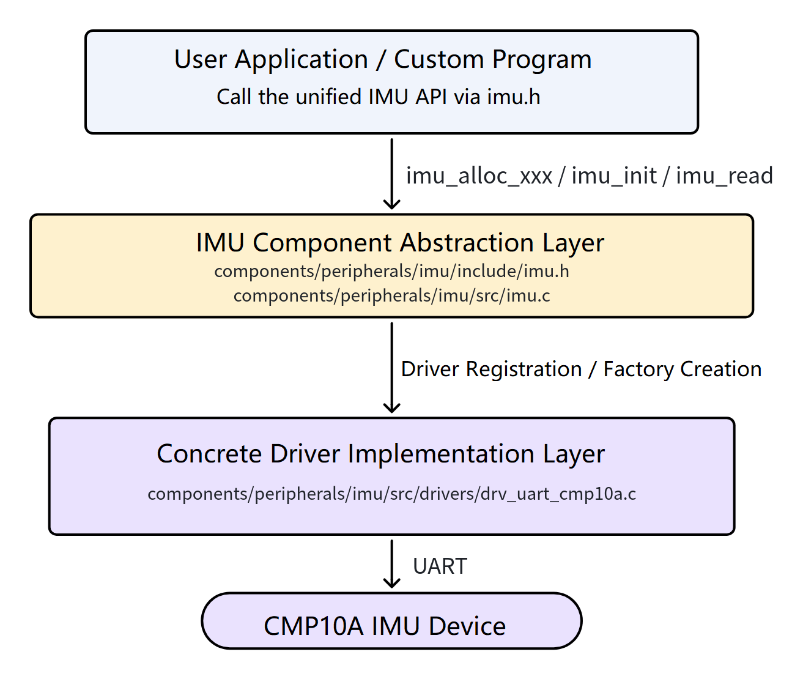
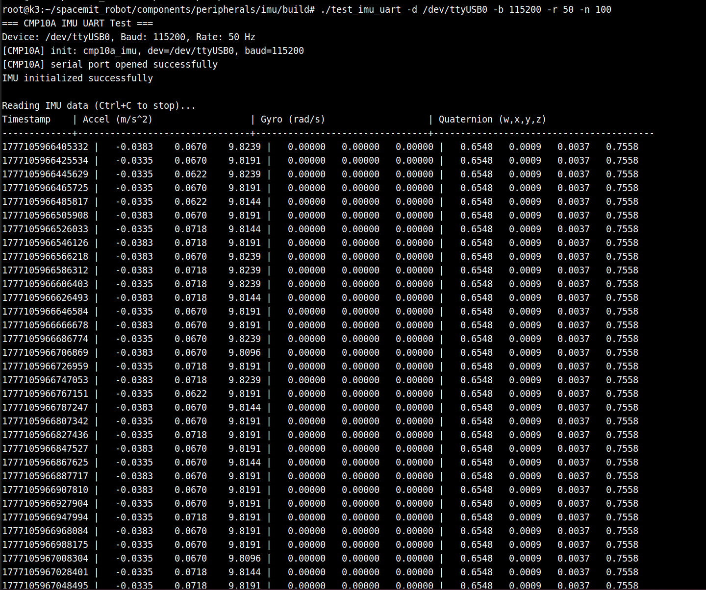

# Peripherals and Drivers · IMU

## 1. Overview

- **Key Features**: This module provides a unified low-level IMU access capability for the project. It reads inertial sensor data through the encapsulated component API, abstracts away differences between hardware interfaces, and gives upper-layer applications a consistent way to access acceleration, angular velocity, magnetic field, quaternion, and temperature data. The default driver enabled in the project is the `CMP10A` serial IMU, corresponding to `drv_uart_cmp10a`.
- **Specifications and Features**:
	- **Supported interfaces**: `I2C`, `SPI`, `UART`; the current project default is `UART`.
	- **Currently supported driver**: `drv_uart_cmp10a`.
	- **Typical baud rate**: `115200`.
	- **Typical sample rate**: `50 Hz`.
	- **Supported output data**: acceleration, angular velocity, magnetic field, quaternion, temperature.
	- **Supported capabilities**: mounting-matrix coordinate transform, gyroscope zero-bias calibration, callback-mode data push, sample rate and low-pass filter parameter configuration.
- **Software Block Diagram**:

  

- **Directory Structure**:

  | Path | Responsibility |
  | --- | --- |
  | `components/peripherals/imu/` | IMU component root directory — unified abstraction and build entry point |
  | `components/peripherals/imu/include/imu.h` | IMU public C API header |
  | `components/peripherals/imu/src/` | Common component implementation and driver registration logic |
  | `components/peripherals/imu/src/drivers/drv_uart_cmp10a.c` | `CMP10A` serial IMU driver implementation |
  | `components/peripherals/imu/test/test_imu_uart.c` | Minimal test program using the low-level API |

## 2. Environment Setup

### Prerequisites

- **Getting the Code**

  For SDK source code acquisition and basic build environment configuration, refer to the [Linksee Reference Solution](../../03-参考方案/3.2-轮式机器人Linksee.md). After completing SDK initialization, return to this document to continue.

- **Runtime Environment**:
	- Recommended board environment: `k3-com260` with the matching system image.

- **Hardware and Connections**:

	

	- Board: `k3-com260`.
	- Peripheral: `CMP10A` serial IMU.
	- Connection: via the onboard serial port or a USB-to-serial adapter; the device node is typically `/dev/ttyUSB*`.
	- Before use, confirm that the IMU is powered stably, the wiring is secure, and the relationship between the mounting orientation and the body coordinate system is clear.

- **Tools and Permissions**:
	- Serial port device access permissions are required.
	- Useful commands: `ls -l /dev/ttyUSB0`, `dmesg | tail`.
	- If device permissions are insufficient, add the current user to the `dialout` group, or temporarily adjust the serial port node permissions.

### Build

**Full build**

```
cd ~/spacemit_robot/
source build/envsetup.sh
lunch # Select the Linksee configuration
m # Full build
```

**Build only the low-level IMU component**

```bash
cd ~/spacemit_robot/components/peripherals/imu
mkdir -p build && cd build
cmake -DBUILD_TESTS=ON -DSROBOTIS_PERIPHERALS_IMU_ENABLED_DRIVERS="drv_uart_cmp10a" ..
make
```

Artifacts include the low-level test program `test_imu_uart`.

- **Common Differences**:
	- For low-level API verification only, use the standalone component build to avoid introducing other modules from the full repository.
	- The component documentation examples commonly use baud rate `115200`; specify it explicitly at runtime.
	- This document covers only the low-level wrapper API, not ROS 2 nodes or topic usage.

## 3. Example Usage (From Scratch)

### 3.1 Example 1: Minimal `CMP10A` serial read verification

**Prerequisites**: The IMU is correctly connected to the board and the actual serial device node (e.g., `/dev/ttyUSB0`) is confirmed.

**Step 1**: Navigate to the component build directory.

```bash
cd ~/spacemit_robot/components/peripherals/imu/build
```

**Step 2**: Run the low-level test program.

```bash
./test_imu_uart -d /dev/ttyUSB0 -b 115200 -r 50 -n 100
```

**Expected result**: The terminal first prints `CMP10A IMU UART Test`, the device path, the baud rate, and other startup information. After initialization succeeds, it continuously outputs timestamps, acceleration, angular velocity, and quaternion data.

Terminal output:



**Step 3**: Confirm that the basic link is stable.

Observe the output while the IMU is stationary, then rotate it slightly and observe the data change again.

**Expected result**:
- Angular velocity is close to zero when stationary.
- Acceleration in the gravity direction is stable.
- `gyro` and `quat` output changes noticeably when the device is rotated.
- If the serial port fails to open, the typical messages are: device does not exist, insufficient permissions, or initialization failed.


### 3.2 Example 2: Calling the low-level IMU API from a custom program

**Prerequisites**: The component build is complete and the header file and library source are available to the local project.

**Step 1**: Include the header and create a UART IMU device in the application code.

See the following call flow as a reference:

```c
#include "imu.h"

struct imu_dev *dev = imu_alloc_uart("CMP10A:cmp10a_imu", "/dev/ttyUSB0", 115200, NULL);
if (!dev) {
		return -1;
}
```

**Step 2**: Initialize the device and configure the sampling parameters.

```c
struct imu_config cfg = {0};
cfg.sample_rate = 50;
cfg.mounting_matrix[0] = 1; cfg.mounting_matrix[1] = 0; cfg.mounting_matrix[2] = 0;
cfg.mounting_matrix[3] = 0; cfg.mounting_matrix[4] = 1; cfg.mounting_matrix[5] = 0;
cfg.mounting_matrix[6] = 0; cfg.mounting_matrix[7] = 0; cfg.mounting_matrix[8] = 1;

if (imu_init(dev, &cfg) != 0) {
		imu_free(dev);
		return -1;
}
```

**Step 3**: Read data and release resources before exiting.

```c
struct imu_data data;
if (imu_read(dev, &data) == 0) {
		printf("acc: %.2f %.2f %.2f\n", data.acc[0], data.acc[1], data.acc[2]);
		printf("gyro: %.2f %.2f %.2f\n", data.gyro[0], data.gyro[1], data.gyro[2]);
}

imu_free(dev);
```

**Expected result**: After the program initializes successfully, you can read the `acc`, `gyro`, `mag`, `quat`, and `temp` fields from `imu_data`. If initialization fails, first check the device node, baud rate, and whether the driver is enabled.


## 4. Application Development

- **API / Interface** (header files, library name, services/topics):
	- Header file: `components/peripherals/imu/include/imu.h`.
	- Core data structures: `struct imu_dev`, `struct imu_config`, `struct imu_data`.
	- Factory functions: `imu_alloc_i2c`, `imu_alloc_spi`, `imu_alloc_uart`.
	- Core APIs: `imu_init`, `imu_read`, `imu_set_callback`, `imu_calibrate_gyro_bias`, `imu_free`.
- **Usage and Notes** (threading, permissions, resource cleanup, etc.):
	- Recommended call sequence: `imu_alloc_xxx` → `imu_init` → `imu_read` / `imu_set_callback` → `imu_free`.
	- Specify the serial device path and baud rate explicitly; do not rely entirely on default parameters.
	- If the device's mounting orientation does not match the body coordinate system, use `mounting_matrix` to apply a rotation correction.
	- When calibrating gyroscope zero bias, keep the IMU stationary during the `imu_calibrate_gyro_bias()` call.
	- Always call `imu_free()` before the program exits to release resources.
	- After a serial device is unexpectedly unplugged and reconnected, handle re-initialization and error recovery at the application layer.
- **Reference demos and example paths**:
	- `components/peripherals/imu/README.md`
	- `components/peripherals/imu/test/test_imu_uart.c`
	- `components/peripherals/imu/include/imu.h`

## 5. Debugging Guide

- Use `test_imu_uart` first for low-level link verification. Confirm that the hardware, serial port, and driver are correct before integrating into a custom application.
- First check the serial port parameters, paying close attention to whether the device node and baud rate are correct. The common baud rate for `CMP10A` is `115200`.
- Useful commands:
	- `ls -l /dev/ttyUSB0`: confirm the device node exists.
	- `dmesg | tail`: view the most recent serial device recognition log.
	- `stty -F /dev/ttyUSB0 -a`: help confirm the serial port configuration.
	- `strace ./test_imu_uart -d /dev/ttyUSB0 -b 115200`: locate the cause of device-open or serial-read failures.
- When debugging with hardware/kernel colleagues, collect at least the following:
	- IMU model, wiring method, and power supply status.
	- Actual device node name and serial port parameters.
	- Full startup log from `test_imu_uart`.
	- Raw output samples in both stationary and rotating states.
	- If initialization fails, include `dmesg` output and permission information.

## 6. FAQ

| Symptom | Possible Cause | Resolution |
| --- | --- | --- |
| Running `test_imu_uart` reports device open failure | Wrong serial device node, device not recognized, or insufficient permissions | Use `ls /dev/ttyUSB*` and `dmesg | tail` to check whether the device exists; confirm the current user has serial port access permissions |
| Program starts but data is abnormal or never changes | Baud rate mismatch, data read rate mismatch, or the IMU is not outputting data normally | Retry with explicit `-b 115200`, <br>check IMU power and wiring, <br>confirm the mode configuration from the host side to the IMU |
| Attitude direction does not match actual motion direction | IMU mounting orientation does not match the body coordinate system | Configure the correct mounting matrix in `imu_config.mounting_matrix` |
| Angular velocity zero-point drift is noticeable | Gyroscope zero bias is not calibrated, or the device was moving during calibration | Re-run `imu_calibrate_gyro_bias()` and ensure the device is stationary during calibration |
| Application fails to start after exit and restart | Resources were not released properly on the previous run, or the serial port is in an abnormal state | Ensure `imu_free()` is called before the program exits; if necessary, replug the device and retry |
