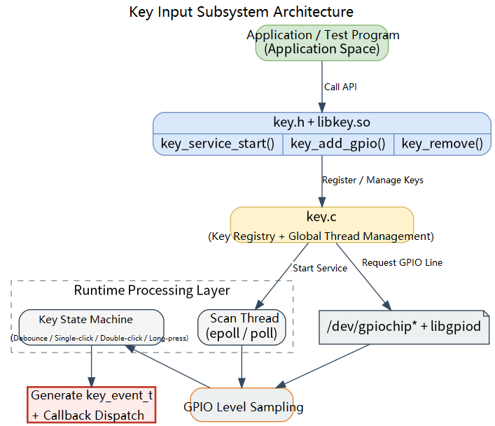
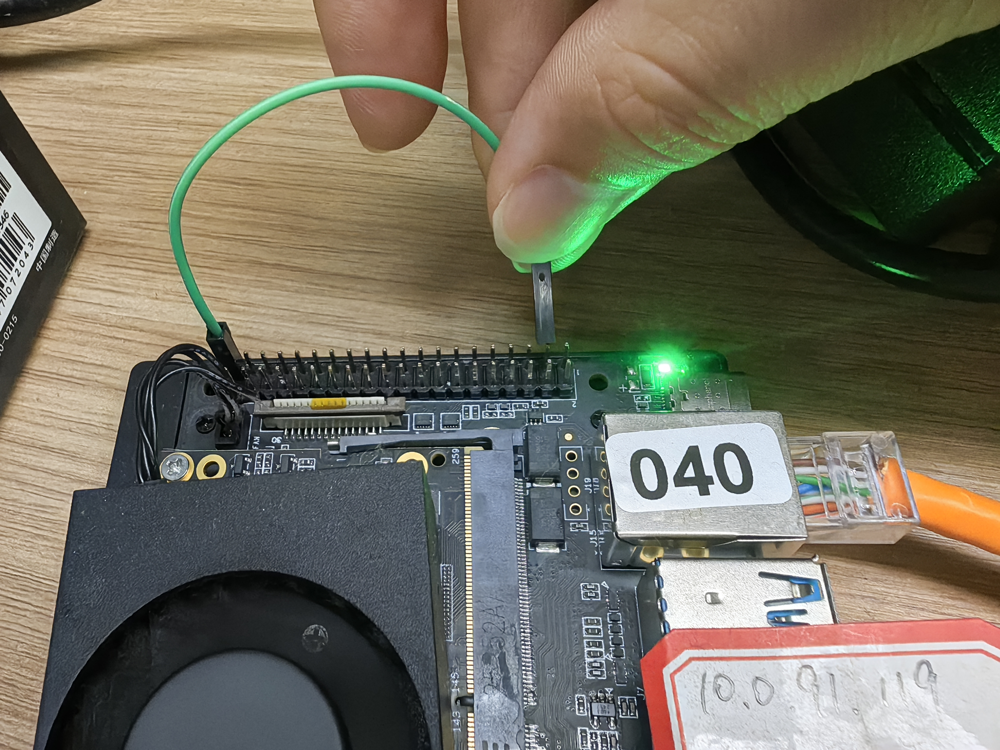

# Peripherals and Drivers · Key

## 1. Overview

- **Key Features**: The `key` module, located at `components/peripherals/key`, is a user-space key driver component targeting Linux GPIO character devices. It uses a background thread to periodically read GPIO levels, performing debounce, event recognition, and callback dispatch. It delivers press, release, single-click, double-click, long-press, and long-press repeat events to the upper layer.
- **Specifications and Features**: Exposes a C interface via `key.h` + `libkey.so`; the underlying layer relies on `libgpiod` to access `/dev/gpiochip*`; compatible with `libgpiod` v1/v2; supports short press, long press, and continuous press event triggering.
- **Software Block Diagram**: See the diagram below.

  

- **Directory Structure**:

  | Path | Responsibility |
  | --- | --- |
  | `components/peripherals/key/include/key.h` | Publicly exposed event enumeration, configuration structs, and API declarations |
  | `components/peripherals/key/src/key.c` | GPIO open, polling scan, debounce, single/double-click, long-press, and repeat event recognition implementation |
  | `components/peripherals/key/test/test_key.c` | Built-in demo program showing dual-key configuration and event printing |
  | `components/peripherals/key/CMakeLists.txt` | Module build, install, and `test_key` target definitions |
  | `components/peripherals/key/package.xml` | Component version and system dependency declarations |
  | `components/peripherals/key/README.md` | Standalone usage guide and quick start |

## 2. Environment Setup

### Prerequisites

- **Runtime Environment**: Recommended board environment: `k3-com260` with the matching system image.

- **Hardware and Connections**: The target board must expose a GPIO controller accessible from Linux, with a mechanical button or button board connected. Confirm the Linux logical GPIO number, active level, and pull-up/pull-down configuration for the button. The current demo program defaults to `GPIO113` and `GPIO114`, both configured as active-high.
- **Tools and Permissions**: The running user needs access to `/dev/gpiochip*`; if the device node permissions are not open, run the demo with `sudo`.

### Build

- **Getting the Code**: See the [2.3 Building and Compilation](../../02-快速入门/2.3-构建编译.md) section for cloning the complete SDK with the `repo` tool.

- **Module Compilation**:
    - **Option 1: Standalone build**
      ```bash
      cd components/peripherals/key
      mkdir build && cd build
      cmake ..
      make -j$(nproc)
      ```
    - **Option 2: SDK integrated build (recommended)**
      ```bash
      # In the repository root directory
      source build/envsetup.sh
      cd components/peripherals/key
      mm     # Build this module only
      ```

- **Artifacts**: `libkey.so` and `test_key` are output to `build/` (standalone build) or the system's `output/staging/{lib,bin}` path (SDK build).

- **Notes**: `CMakeLists.txt` automatically defines `LIBGPIOD_V1` or `LIBGPIOD_V2` depending on the `libgpiod` version. If the platform's GPIO numbering convention differs from the current implementation, adjust `open_gpio_chip()` in `src/key.c` for the actual SoC.

## 3. Example Usage (From Scratch)

This section provides a step-by-step path for readers to reproduce the examples from scratch:

### 3.1 Run the built-in `test_key` demo program

**Prerequisites**: For the `k3-com260` development board, refer to the wiring shown below — this corresponds to GPIO83, connected to GND via a jumper wire to simulate a physical key press.




**Step 1**: The current example registers two keys by default — `GPIO113` and `GPIO114`, both configured as active-high. If your board is a `k3-com260`, first modify the `gpio_num` and `active_low` values in `key1_config` and `key2_config`, then recompile.

```
    key_config_t key1_config = {
        .gpio_num = 82,
        .active_low = 1,           // gpio82 is pulled high by default, so set to 1
        .long_press_ms = 1500,     // 1.5 s long press
        .double_click_ms = 300     // double-click valid within 300 ms
    };

    // Configure key 2 (assumed connected to GPIO18, active-high)
    key_config_t key2_config = {
        .gpio_num = 83,
        .active_low = 1,           // gpio82 is pulled high by default, so set to 1
        .long_press_ms = 2000,     // 2 s long press
        .double_click_ms = 400     // double-click valid within 400 ms
    };

```

**Step 2**: Complete the build in the SDK component directory.

```bash
cd components/peripherals/key
mkdir -p build
cd build
cmake ..
make -j$(nproc)
```

Expected result: The command completes successfully; `test_key` and `libkey.so` are generated in the `build/` directory, and `make` returns exit code `0`.

**Step 3**: Run the demo program.

```bash
# Run the test program
sudo ./build/test_key
```

Expected result: The terminal prints startup information and the registered key information, for example: `启动按键驱动演示程序...` (Starting key driver demo...), `按键已添加:` (Key added:), `等待按键事件...` (Waiting for key events...).

**Step 4**: Perform short press, double-click, and long press actions on the physical button and observe the event output.

Expected result:
- A single short press first shows `物理按下` (Physical press) and `物理释放` (Physical release), followed by `单击事件` (Click event).
- Two quick presses show `双击事件` (Double-click event) after the second release.
- Holding the button past the threshold shows `长按事件` (Long-press event); continuing to hold shows `连发事件` (Repeat event) periodically.
- Pressing `Ctrl+C` to exit prints `清理资源...` (Cleaning up...) and `程序退出` (Program exited).

## 4. Application Development

### 4.1 Minimal Usage Flow

```c
static void key_event_callback(struct key_handle *key, key_event_t event, void *user_data)
{
    (void)key;
    printf("[%s] event=%d\n", (const char *)user_data, event);
}

int main(void)
{
    // 1. Start the service: create the background scan thread
    if (key_service_start() != 0) {
        return -1;
    }

    // 2. Configure the key: specify the GPIO number, active level, and timing parameters
    key_config_t cfg = {
        .gpio_num = 83,
        .active_low = 1,
        .long_press_ms = 1500,
        .double_click_ms = 300,
    };

    // 3. Register the key: bind the callback to receive key events asynchronously
    struct key_handle *key = key_add_gpio(&cfg, key_event_callback, "key1");
    if (!key) {
        key_service_stop();
        return -1;
    }

    // 4. Business logic: the main thread runs its own logic; events arrive via the callback
    sleep(10);

    // 5. Release resources: remove the key and stop the service
    key_remove(key);
    key_service_stop();
    return 0;
}
```

### 4.2 Main API Reference

**1. Service lifecycle**
```c
// Start the global key service and create the background scan thread
int key_service_start(void);

// Stop the background thread and release global resources
void key_service_stop(void);
```

**2. Key registration and removal**
```c
// Register a GPIO key
struct key_handle *key_add_gpio(const key_config_t *config, key_callback_t cb, void *user_data);
// config: key configuration, cb: event callback, user_data: user-private data

// Remove a key
void key_remove(struct key_handle *key);
// key: opaque handle returned by key_add_gpio
```

**3. Event callback**
```c
// Key event callback prototype
typedef void (*key_callback_t)(struct key_handle *key, key_event_t event, void *user_data);
// key: the key that generated the event, event: current event type, user_data: data passed through at registration
```

### 4.3 Core Data Structures

**Key configuration struct**
```c
typedef struct {
    int gpio_num;           // Linux GPIO number
    int active_low;         // 1: active-low, 0: active-high
    int long_press_ms;      // Long-press threshold; 0 uses the default of 1500 ms
    int double_click_ms;    // Double-click detection window; 0 uses the default of 300 ms
} key_config_t;
```

**Key event enumeration**
```c
typedef enum {
    KEY_EV_PRESSED,
    KEY_EV_RELEASED,
    KEY_EV_CLICK,
    KEY_EV_DOUBLE_CLICK,
    KEY_EV_LONG_PRESS,
    KEY_EV_HOLD_REPEAT
} key_event_t;
```

**Key handle**
```c
struct key_handle;
```

Development notes: you must call `key_service_start()` before registering any keys; the `cb` parameter of `key_add_gpio()` must not be NULL; once `KEY_EV_LONG_PRESS` fires, the current press will no longer generate click or double-click events; the long-press repeat interval is currently fixed at `200 ms`; the user callback runs in the module's internal scan-thread context — avoid blocking, time-consuming I/O, or complex business logic; post work to your own worker thread if needed; before exiting, call `key_remove()` for each key first, then call `key_service_stop()` to shut down the background thread.

**Reference demos and example paths**
```text
components/peripherals/key/test/test_key.c
```

## 5. Debugging Guide

- When coordinating with hardware or kernel engineers, provide: board model and kernel version, button schematic or wiring description, GPIO number and active level, and whether the kernel device tree has already configured the pin as GPIO mode.

## 6. FAQ

None at this time.
