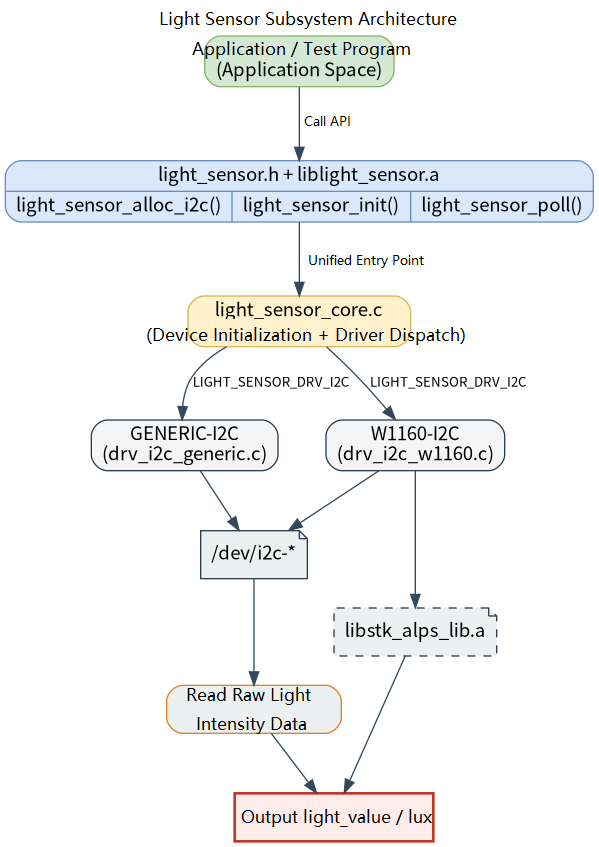

# Peripherals and Drivers · Light Sensor

## 1. Overview

- **Key Features**: The `light_sensor` module, located at `components/peripherals/light_sensor`, provides I2C-based ambient light sensor acquisition capability. It uses a unified device object and driver registration framework to encapsulate sensor initialization, polling, and resource release, reducing the upper layer's direct dependency on specific chip registers and algorithm libraries. The current codebase includes a generic I2C read/write adapter layer and a W1160-specific driver.
- **Specifications and Features**: Exposes a C interface via `light_sensor.h` + `liblight_sensor.a`; the current public API includes `light_sensor_alloc_i2c()`, `light_sensor_init()`, `light_sensor_poll()`, and `light_sensor_free()`; supports selecting a specific driver via a `driver_name:instance_name` string, e.g. `W1160:als0`; the current primary test device is the W1160 at default I2C address `0x48`, with the test program defaulting to `/dev/i2c-5`; polling returns a `uint32_t` value in `lux`; the W1160 driver depends on the static algorithm library `libstk_alps_lib.a` bundled in the repository and uses FIFO data to compute ambient light.
- **Software Block Diagram**: See the diagram below.

  

- **Directory Structure**:

| Path | Responsibility |
| --- | --- |
| `components/peripherals/light_sensor/include/light_sensor.h` | Publicly exposed device handle and base API declarations |
| `components/peripherals/light_sensor/src/light_sensor_core.c` | Device allocation, driver registry, driver instance selection, and unified API implementation |
| `components/peripherals/light_sensor/src/light_sensor_core.h` | Internal device model, driver vtable, and registration macros |
| `components/peripherals/light_sensor/src/drivers/drv_i2c_generic.c` | Generic I2C access driver providing basic `open/ioctl/read/write` wrappers |
| `components/peripherals/light_sensor/src/drivers/drv_i2c_w1160/drv_i2c_w1160.c` | W1160-specific initialization, FIFO read, lux calculation, and device lock implementation |
| `components/peripherals/light_sensor/src/drivers/drv_i2c_w1160/libstk_alps_lib.a` | W1160 algorithm static library |
| `components/peripherals/light_sensor/test/test_light_sensor_i2c.c` | Built-in demo program demonstrating W1160 initialization and polling |
| `components/peripherals/light_sensor/CMakeLists.txt` | Module build, static library linking, and test target definitions |

## 2. Environment Setup

### Prerequisites

- **Runtime Environment**: Recommended board environment: `k1-deb1` with the matching system image; I2C device node interfaces must be enabled; `gcc`, `make`, `cmake`, or equivalent build tools are required; the component builds under C99; access to `/dev/i2c-*` is required at runtime.
- **Dependencies and External Resources**: This module depends on the Linux I2C character device interface and requires no additional third-party dynamic libraries. The W1160 driver depends on the `src/drivers/drv_i2c_w1160/libstk_alps_lib.a` static library bundled in the repository, which `CMakeLists.txt` automatically links by default. If the static library is not in the default location, specify it at build time with `-DSTK_ALPS_STATIC_LIB=/path/to/libstk_alps_lib.a`.
- **Hardware and Connections**: An I2C-connected ambient light sensor is required; the current implementation focuses on supporting the W1160. Verify that the sensor is powered correctly, SCL/SDA are connected to the corresponding I2C controller on the target board, and confirm the device node path and slave address. The test program defaults to device node `/dev/i2c-5` and I2C address `0x48`.
- **Tools and Permissions**: For troubleshooting, pre-install `apt install i2c-tools` and use `i2cdetect`/`i2cdump` and similar tools for diagnosis.

### Build

- **Getting the Code**: See the [2.3 Building and Compilation](../../02-快速入门/2.3-构建编译.md) section for cloning the complete SDK with the `repo` tool. All build and test commands below are run from inside the SDK.

- **Module Compilation**:
    - **Option 1: Standalone build**
      ```bash
      cd components/peripherals/light_sensor
      mkdir build && cd build
      cmake .. -DBUILD_TESTS=ON
      make -j$(nproc)
      ```
    - **Option 2: SDK integrated build (recommended)**
      ```bash
      source build/envsetup.sh
      cd components/peripherals/light_sensor
      mm     # Build this module only
      ```

- **Artifacts**: `liblight_sensor.a` is output to `build/`; when `BUILD_TESTS` is enabled, `test_light_sensor_i2c` is also generated. SDK build artifacts are installed to the system's `output/staging/{lib,bin}` path.

- **Notes**: The W1160 driver depends on the `src/drivers/drv_i2c_w1160/libstk_alps_lib.a` static library bundled in the repository. Because this static library was not compiled with `-fPIC`, the K3 SDK build configuration is not currently supported for compilation verification.

## 3. Example Usage (From Scratch)

This section provides a step-by-step path for readers to reproduce the examples from scratch:

### 3.1 Run the built-in W1160 test program

**Prerequisites**: Confirm that the W1160 sensor is connected to the corresponding I2C bus on the target board, the device node and address are accessible, and the current user can access `/dev/i2c-*` and `/var/lock/`.

**Step 1**: Confirm the test parameters based on your hardware connection. `test/test_light_sensor_i2c.c` defaults to `/dev/i2c-5` and address `0x48`. If your board connection is different, override via command-line arguments rather than modifying the source code.

**Step 2**: Build the test program in the component directory.

```bash
cd components/peripherals/light_sensor
mkdir -p build
cd build
cmake .. -DBUILD_TESTS=ON
make -j$(nproc)
```

Expected result: After a successful build, `liblight_sensor.a` and `test_light_sensor_i2c` are visible in the `build/` directory.

**Step 3**: Run the test program.

```bash
cd components/peripherals/light_sensor
sudo ./build/test_light_sensor_i2c /dev/i2c-5 0x48
```

Expected result: The program first prints `W1160 Light Sensor I2C Test` and `Using: dev=/dev/i2c-5 addr=0x48`; after initialization succeeds, it prints `W1160 initialization OK, polling light values...`.

**Step 4**: Observe the polling results.

Expected result:
- While the FIFO has not yet accumulated enough data, `No new FIFO data yet` appears.
- Once FIFO data is ready, results of the form `[12] Light value: 356 lux` are printed periodically.
- The test program polls a total of 200 times, with a `1 s` interval between each. After all are complete, `Test complete.` is printed.

## 4. Application Development

### 4.1 Minimal Usage Flow

```c
int main(void)
{
    struct light_sensor_dev *dev =
        light_sensor_alloc_i2c("W1160:als0", "/dev/i2c-5", 0x48);
    if (!dev) {
        return -1;
    }

    if (light_sensor_init(dev) < 0) {
        light_sensor_free(dev);
        return -1;
    }

    for (int i = 0; i < 10; ++i) {
        uint32_t lux = 0;
        int ret = light_sensor_poll(dev, &lux);
        if (ret == 0) {
            printf("lux=%u\n", lux);
        }
        usleep(1000000);
    }

    light_sensor_free(dev);
    return 0;
}
```

### 4.2 Main API Reference

**1. Device creation and resource management**
```c
// Create a device instance using I2C
struct light_sensor_dev *light_sensor_alloc_i2c(const char *name, const char *i2c_dev, uint8_t addr);
// name: driver_name:instance_name, i2c_dev: I2C device node, addr: 7-bit device address

// Initialize the sensor: open the device and complete chip initialization
int light_sensor_init(struct light_sensor_dev *dev);

// Release device resources
void light_sensor_free(struct light_sensor_dev *dev);
```

**2. Data reading**
```c
// Poll and read the current illuminance value
int light_sensor_poll(struct light_sensor_dev *dev, uint32_t *light_value);
// light_value: output illuminance in lux
```

### 4.3 Core Data Structures

**Sensor handle**
```c
struct light_sensor_dev;
```

**I2C device creation parameters**
```c
struct light_sensor_dev *light_sensor_alloc_i2c(const char *name, const char *i2c_dev, uint8_t addr);
```

**Sampling output**
```c
uint32_t light_value;  // unit: lux
```

Development notes: pass an explicit `driver_name:instance_name` format such as `W1160:als0` as the `name` argument to `light_sensor_alloc_i2c()` to ensure the correct driver is selected; the W1160 driver completes initialization and data preparation before the first `poll()`, so the first few polling calls may not yet return a valid value; when `light_sensor_poll()` returns `-EAGAIN`, the current sample is not yet ready — keep polling; the W1160 driver uses a `/var/lock/` lock file during `init()` and `poll()` to serialize access to the same I2C device.

**Reference demos and example paths**
```text
components/peripherals/light_sensor/test/test_light_sensor_i2c.c
components/peripherals/light_sensor/src/drivers/drv_i2c_w1160/drv_i2c_w1160.c
```

## 5. Debugging Guide

- If initialization fails, first check `/dev/i2c-*`, the I2C address, and `/var/lock/` permissions, and use `i2cdetect -y <bus>` to confirm that address `0x48` is visible.
- If the program continuously prints `No new FIFO data yet`, the FIFO samples are not yet ready; first check the sensor power supply, I2C communication, and polling interval.
- If you suspect a driver selection issue, confirm that the `name` passed to `light_sensor_alloc_i2c()` uses the `driver_name:instance_name` format, e.g. `W1160:als0`.

## 6. FAQ

- `light_sensor_alloc_i2c()` returns `NULL`: typically caused by an incorrect `name` or `i2c_dev` parameter, or the specified driver is not registered. Use `W1160:als0` as the name.
- `light_sensor_init()` fails: typically caused by an incorrect device node, I2C address, permissions, or lock file permission issues. Use `sudo` if necessary and check `/var/lock/`.
- The `lux` value is unstable: first rule out real changes in ambient light, then check the algorithm library, sensor calibration, and whether the FIFO is outputting stably.
