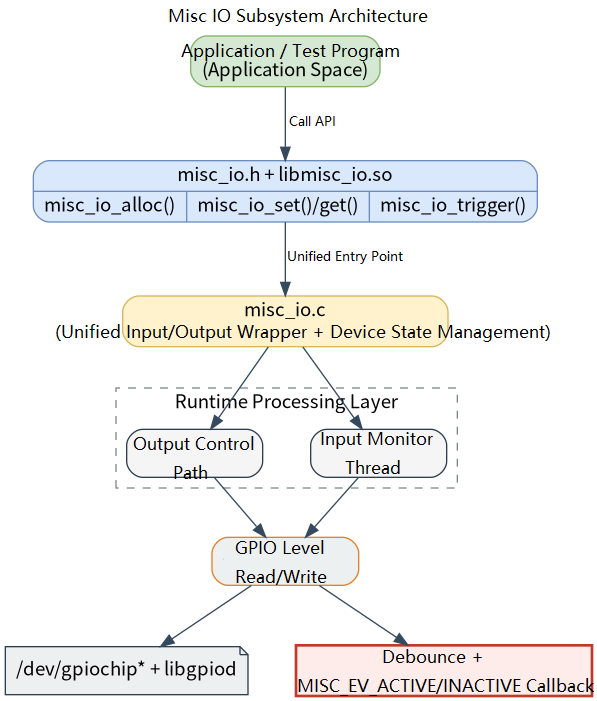

# Peripherals and Drivers · misc_io

## 1. Overview

- **Key Features**: The `misc_io` module, located at `components/peripherals/misc_io`, provides general-purpose digital input/output wrappers based on Linux GPIO for quickly integrating miscellaneous IO peripherals such as buzzers, relays, DIP switches, limit switches, and simple digital sensors. It uniformly encapsulates GPIO opening, direction request, level read/write, input debounce, and state-change callback flows.
- **Specifications and Features**: Exposes a C interface via `misc_io.h` + `libmisc_io.so`; depends on `libgpiod` to access `/dev/gpiochip*`; compatible with `libgpiod` v1/v2; supports input and output directions, `active high/active low` logic definitions, debounce time configuration, and callback triggering; in input scenarios, `misc_io_get()` returns a logical value indicating "currently active", not the raw level value; the v2 branch polls for level changes every `10 ms` via a background thread; the v1 branch waits for edge events based on `gpiod_line_event_wait()`.
- **Software Block Diagram**: See the diagram below.

  

- **Directory Structure**:

  | Path | Responsibility |
  | --- | --- |
  | `components/peripherals/misc_io/include/misc_io.h` | Publicly exposed device type, direction, logic, level event, and API declarations |
  | `components/peripherals/misc_io/src/misc_io.c` | GPIO open, line request, input polling/event waiting, debounce, read/write, and resource release implementation |
  | `components/peripherals/misc_io/test/test_misc_io.c` | Built-in demo program covering input trigger, active read, and output control scenarios |
  | `components/peripherals/misc_io/CMakeLists.txt` | Module build, `libgpiod` detection, test target, and install rules |
  | `components/peripherals/misc_io/package.xml` | Component version and system dependency declarations |
  | `components/peripherals/misc_io/README.md` | Component guide and quick start |

## 2. Environment Setup

### Prerequisites

- **Runtime Environment**: Recommended board environment: `k3-com260` with the matching system image.
- **Hardware and Connections**: The target board must expose a GPIO controller accessible from Linux, with the IO peripherals to be tested already connected. Confirm the `chip_name` and `line_offset` for each GPIO. The source documentation provides two common platform mapping approaches: for the K3 platform, interpret `GPIO83 -> gpiochip2 + line_offset 19`; for the K1 platform, all may fall under `gpiochip0`, e.g., `GPIO113 -> gpiochip0 + line_offset 113`.
- **Tools and Permissions**: The running user needs access to `/dev/gpiochip*`; use `sudo` when device node permissions are restricted. For troubleshooting, pre-install tools such as `gpioinfo`, `gpiodetect`, `gpioget`, and `gpioset` to confirm whether the line exists, is occupied, and its raw level state.

### Build

- **Getting the Code**: See the [2.3 Building and Compilation](../../02-快速入门/2.3-构建编译.md) section for cloning the complete SDK with the `repo` tool. All build and test commands below are run from inside the SDK.

- **Module Compilation**:
    - **Option 1: Standalone build**
      ```bash
      cd components/peripherals/misc_io
      mkdir build && cd build
      cmake ..
      make -j$(nproc)
      ```
    - **Option 2: SDK integrated build (recommended)**
      ```bash
      source build/envsetup.sh
      cd components/peripherals/misc_io
      mm     # Build this module only
      ```

- **Artifacts**: `libmisc_io.so` and `test_misc_io` are output to `build/` (standalone build) or the system's `output/staging/{lib,bin}` path (SDK build).

- **Notes**: `CMakeLists.txt` automatically defines `LIBGPIOD_V1` or `LIBGPIOD_V2` depending on the `libgpiod` version; the input monitoring mechanisms differ between the two, and documentation behavior follows the current source implementation.

## 3. Example Usage (From Scratch)

This section provides a step-by-step path for readers to reproduce the examples from scratch:

### 3.1 Run the input trigger callback test

**Prerequisites**: Confirm that the input peripheral under test is connected to a GPIO line on the target board, and confirm the corresponding `chip_name` and `line_offset`.

**Step 1**: Check and modify the `test_trigger()` configuration in `test/test_misc_io.c` based on your actual board setup. The current example defaults to: `chip_name = "gpiochip0"`, `line_offset = 9`, `active_logic = MISC_ACTIVE_HIGH`, `debounce_ms = 50`. If your hardware differs, adjust these values first.

**Step 2**: Build in the component directory.

```bash
cd components/peripherals/misc_io
mkdir -p build
cd build
cmake ..
make -j$(nproc)
```

Expected result: `libmisc_io.so` and `test_misc_io` are generated in the `build/` directory, and `make` returns exit code `0`.

**Step 3**: Run the test program.

```bash
cd components/peripherals/misc_io
sudo ./build/test_misc_io
```

Expected result: The program enters a persistent wait and does not exit immediately.

**Step 4**: Toggle the external input level and observe the callback output.

Expected result: After each stable state change, the terminal prints content of the form `[cb] count=1 ev=ACTIVE` or `[cb] count=2 ev=INACTIVE`; when bouncing occurs within the `50 ms` debounce window, the callback should not trigger repeatedly.

## 4. Application Development

### 4.1 Minimal Usage Flow

```c
static void on_misc_event(struct misc_dev *dev, enum misc_event ev, void *args)
{
    (void)dev;
    (void)args;
    printf("event=%d\n", ev);
}

int main(void)
{
    struct misc_gpiod_ctx ctx = {
        .chip_name = "gpiochip0",
        .line_offset = 83,
        .consumer = "misc_demo",
    };

    struct misc_dev *dev = misc_io_alloc(MISC_TYPE_SWITCH, MISC_DIR_INPUT, &ctx);
    if (!dev) {
        return -1;
    }

    misc_io_config(dev, MISC_ACTIVE_HIGH, 50);
    misc_io_trigger(dev, on_misc_event, NULL);

    sleep(10);

    misc_io_free(dev);
    return 0;
}
```

### 4.2 Main API Reference

**1. Device creation and configuration**
```c
// Create a device
struct misc_dev *misc_io_alloc(enum misc_type type, enum misc_dir dir, void *hw_ctx);

// Configure active logic and debounce time
void misc_io_config(struct misc_dev *dev, enum misc_logic active_logic, uint16_t debounce_ms);

// Release device resources
void misc_io_free(struct misc_dev *dev);
```

**2. Input/output operations**
```c
// Write output state
int misc_io_set(struct misc_dev *dev, bool active);

// Read current logical state
int misc_io_get(struct misc_dev *dev);
```

**3. Event triggering**
```c
// Start input monitoring and register callback
void misc_io_trigger(struct misc_dev *dev, misc_cb_t cb, void *args);

// Input event callback prototype
typedef void (*misc_cb_t)(struct misc_dev *dev, enum misc_event ev, void *args);
```

### 4.3 Core Data Structures

**GPIO context**
```c
struct misc_gpiod_ctx {
    const char *chip_name;
    unsigned int line_offset;
    const char *consumer;
};
```

**Logic and event enumerations**
```c
enum misc_logic {
    MISC_ACTIVE_LOW = 0,
    MISC_ACTIVE_HIGH
};

enum misc_event {
    MISC_EV_ACTIVE = 0,
    MISC_EV_INACTIVE,
};
```

**Device handle**
```c
struct misc_dev;
```

Development notes: `misc_io_alloc()` depends on correct board-level mapping of `chip_name` and `line_offset`; `misc_io_set()` and `misc_io_get()` return logical active/inactive, not raw GPIO levels; `misc_io_trigger()` applies only to input direction; the first call starts a background thread; the callback runs in the module's internal thread context — avoid blocking and time-consuming I/O.

**Reference demos and example paths**
```text
components/peripherals/misc_io/test/test_misc_io.c
components/peripherals/misc_io/src/misc_io.c
```

## 5. Debugging Guide

- If `misc_io_alloc()` fails, first check `chip_name`, `line_offset`, and `/dev/gpiochip*` permissions, and confirm that the GPIO is not occupied by another process.
- If the input level changes but there is no callback, first verify the device direction, `active_logic`, and `debounce_ms`, and cross-check with `gpioinfo` / `gpioget` if necessary.
- If the result from `misc_io_get()` is the opposite of the raw level, confirm that it returns logical active/inactive, not the raw GPIO high/low level.

## 6. FAQ

- `misc_io_alloc()` returns `NULL`: typically caused by incorrect `chip_name` or `line_offset`, or the GPIO line is already occupied.
- `misc_io_set()` returns a negative value: typically caused by an invalid handle, or the current device is in input direction and cannot perform output writes.
- `misc_io_get()` returns a value opposite to the raw level: this is because it returns the active/inactive logical value, not the raw GPIO level.
