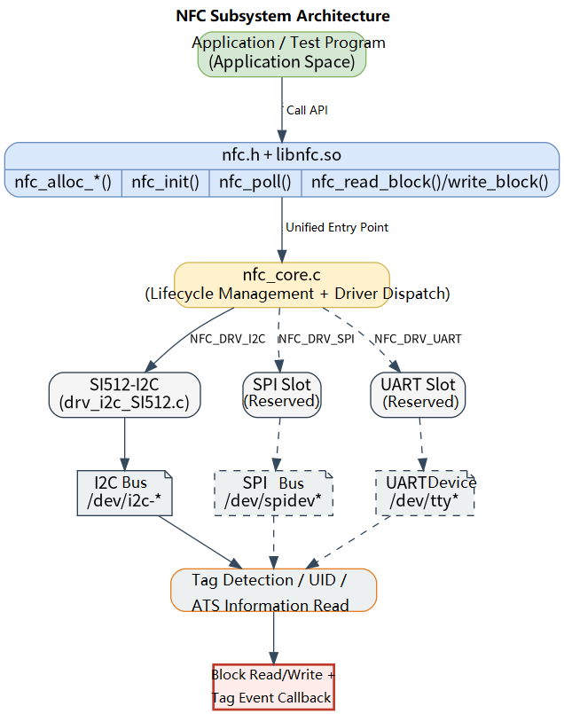

# Peripherals and Drivers · NFC

## 1. Overview

- **Key Features**: The `nfc` module, located at `components/peripherals/nfc`, provides a user-space NFC device abstraction layer and driver registration framework for initializing card readers, polling tags, reading UIDs, and performing block read/write operations based on device capabilities. The driver currently implemented in the repository is the I2C-based SI512 card reader, primarily used for quickly validating the Linux-side card-reading link and Type A tag interaction.
- **Specifications and Features**: Exposes a C interface via `nfc.h` + `libnfc.so`; supports three factory interfaces — `nfc_alloc_i2c()`, `nfc_alloc_spi()`, and `nfc_alloc_uart()` — but only `drv_i2c_SI512` driver source is present in the current directory; SPI/UART have API stubs and test shells only, with no corresponding driver implementation; the I2C example defaults to device node `/dev/i2c-5` and slave address `0x28`; `nfc_poll()` returns `0` when a tag is detected and `1` on timeout/no tag; the SI512 driver supports Type A tag UID reading and provides a 16-byte block read/write interface.
- **Software Block Diagram**: See the diagram below.

  

- **Directory Structure**:

| Path | Responsibility |
| --- | --- |
| `components/peripherals/nfc/include/nfc.h` | Publicly exposed tag info struct, lifecycle API, block read/write API, and factory functions |
| `components/peripherals/nfc/src/nfc_core.c` | Unified API implementation, driver registry, and `name=driver_name:instance_name` parsing logic |
| `components/peripherals/nfc/src/nfc_core.h` | Internal device object, driver vtable, bus type, and registration macros |
| `components/peripherals/nfc/src/drivers/drv_i2c_SI512/drv_i2c_SI512.c` | SI512 I2C driver — register access, Type A polling, and block read/write implementation |
| `components/peripherals/nfc/src/drivers/drv_i2c_SI512/drv_i2c_SI512.h` | SI512/MFRC522-style register, command, and device constant definitions |
| `components/peripherals/nfc/test/test_nfc_i2c.c` | I2C mode demo program showing initialization, polling, UID printing, and block read/write calls |
| `components/peripherals/nfc/test/test_nfc_spi.c` | SPI interface test stub for verifying return code conventions when a generic SPI driver is present |
| `components/peripherals/nfc/test/test_nfc_uart.c` | UART interface test stub for verifying return code conventions when a generic UART driver is present |
| `components/peripherals/nfc/CMakeLists.txt` | Component build, driver selection, and test target definitions |

## 2. Environment Setup

### Prerequisites

- **Runtime Environment**: Recommended board environment: `k1-deb1` with the matching system image; the system must have an I2C controller and corresponding device nodes; `gcc`, `make`, and `cmake` are required; the component builds under C99.
- **Dependencies and External Resources**: I2C mode depends on the kernel-exported `/dev/i2c-*` device nodes and requires no additional third-party dynamic libraries. The repository currently does not include SPI/UART driver sources with the `nfc` component, so if only using this directory's code, the only path that can be run through is I2C + SI512.
- **Hardware and Connections**: An SI512 NFC module connected via I2C to the target board is required. Confirm that power, SCL, and SDA are correctly connected, the module's I2C address matches the program parameters, and the test card is a Type A card compatible with the driver's current implementation path.

### Build

- **Getting the Code**: See the [2.3 Building and Compilation](../../02-快速入门/2.3-构建编译.md) section for cloning the complete SDK with the `repo` tool. All build and test commands below are run from inside the SDK.

- **Module Compilation**:
    - **Option 1: Standalone build**
      ```bash
      cd components/peripherals/nfc
      mkdir build && cd build
      cmake .. -DBUILD_TESTS=ON -DSROBOTIS_PERIPHERALS_NFC_ENABLED_DRIVERS="drv_i2c_SI512"
      make -j$(nproc)
      ```
    - **Option 2: SDK integrated build (recommended)**
      ```bash
      source build/envsetup.sh
      cd components/peripherals/nfc
      mm     # Build this module only
      ```

- **Artifacts**: `libnfc.so` is output to `build/`; when `BUILD_TESTS` is enabled, `test_nfc_i2c`, `test_nfc_spi`, and `test_nfc_uart` are also generated. SDK build artifacts are installed to the system's `output/staging/{lib,bin}` path.

- **Notes**: To run the I2C SI512 example, `drv_i2c_SI512` must be explicitly enabled at the configuration stage; otherwise, calling `nfc_alloc_i2c("SI512:...")` returns `NULL` because no driver is found.

## 3. Example Usage (From Scratch)

This section provides a step-by-step path for readers to reproduce the examples from scratch:

### 3.1 Run the SI512 I2C card-reading test

**Prerequisites**: Confirm that the SI512 module is connected to the target board's I2C bus, the device node is accessible, and the card type is compatible with the driver's current implementation path.

**Step 1**: Enable `drv_i2c_SI512` and complete the build using the command from the previous section.

```bash
cd components/peripherals/nfc
mkdir -p build
cd build
cmake .. -DBUILD_TESTS=ON -DSROBOTIS_PERIPHERALS_NFC_ENABLED_DRIVERS="drv_i2c_SI512"
make -j$(nproc)
```

Expected result: `libnfc.so` and `test_nfc_i2c` are generated in the `build/` directory.

**Step 2**: Run the I2C example program.

```bash
cd components/peripherals/nfc
sudo ./build/test_nfc_i2c /dev/i2c-5 0x28 4
```

The first argument is the I2C device node, the second is the SI512 address, and the third is the block number to read/write.

Expected result: After startup, `Using: dev=/dev/i2c-5 addr=0x28 block=4` is printed first, then the program enters up to 20 polling rounds.

**Step 3**: Hold a card near the reader and observe the result.

Expected result:
- When no card is present, `[poll] no tag` is printed periodically.
- When a card is detected, `[poll] tag detected:` is printed, followed by the UID.
- If a callback is registered, output of the form `[callback] dev=0x... uid_len=4 type=1 rssi=0` is also printed.
- The program then attempts to read and write the specified block, printing `read block ret=...` and `write block ret=...`; on success the return value is `16` (bytes), and on failure a negative error code is returned.

## 4. Application Development

### 4.1 Minimal Usage Flow

```c
static void on_tag_event(struct nfc_dev *dev, const struct nfc_tag_info *info, void *ctx)
{
    (void)dev;
    (void)ctx;
    printf("uid_len=%u type=%d\n", info ? info->uid_len : 0, info ? info->type : -1);
}

int main(void)
{
    struct nfc_dev *dev = nfc_alloc_i2c("SI512:nfc0", "/dev/i2c-5", 0x28);
    if (!dev) {
        return -1;
    }

    nfc_set_callback(dev, on_tag_event, NULL);

    if (nfc_init(dev) < 0) {
        nfc_free(dev);
        return -1;
    }

    struct nfc_tag_info info = {0};
    if (nfc_poll(dev, &info, 100) == 0) {
        uint8_t buf[16] = {0};
        nfc_read_block(dev, 4, buf, sizeof(buf));
    }

    nfc_free(dev);
    return 0;
}
```

### 4.2 Main API Reference

**1. Device creation and resource management**
```c
// Create a device using different bus types
struct nfc_dev *nfc_alloc_i2c(const char *name, const char *i2c_dev, uint8_t addr);
struct nfc_dev *nfc_alloc_spi(const char *name, const char *spi_dev, uint32_t cs_pin);
struct nfc_dev *nfc_alloc_uart(const char *name, const char *uart_dev, uint32_t baud);

// Initialize and release
int nfc_init(struct nfc_dev *dev);
void nfc_free(struct nfc_dev *dev);
```

**2. Polling and callbacks**
```c
// Register a tag event callback
void nfc_set_callback(struct nfc_dev *dev, nfc_event_cb_t cb, void *ctx);

// Poll for a tag within the given timeout
int nfc_poll(struct nfc_dev *dev, struct nfc_tag_info *info, uint32_t timeout_ms);
```

**3. Tag block read/write**
```c
// Read a tag data block
int nfc_read_block(struct nfc_dev *dev, uint8_t block, uint8_t *buf, size_t len);

// Write a tag data block
int nfc_write_block(struct nfc_dev *dev, uint8_t block, const uint8_t *buf, size_t len);
```

### 4.3 Core Data Structures

**Tag info struct**
```c
struct nfc_tag_info {
    uint8_t uid[16];
    uint8_t uid_len;
    enum nfc_tag_type type;
    int8_t  rssi_dbm;
    uint8_t ats[32];
    uint8_t ats_len;
};
```

**Tag type enumeration**
```c
enum nfc_tag_type {
    NFC_TAG_UNKNOWN = 0,
    NFC_TAG_MIFARE_CLASSIC,
    NFC_TAG_MIFARE_ULTRALIGHT,
    NFC_TAG_TYPE_A,
    NFC_TAG_TYPE_B,
    NFC_TAG_FELICA,
    NFC_TAG_ISO15693,
};
```

**Device handle and callback**
```c
struct nfc_dev;

typedef void (*nfc_event_cb_t)(struct nfc_dev *dev,
    const struct nfc_tag_info *info, void *ctx);
```

Development notes: use the explicit `driver_name:instance_name` format such as `SI512:nfc0` to select the driver; `nfc_poll()` is a synchronous polling interface — it returns `0` when a tag is detected and `1` when no tag is detected (timeout); the current SI512 driver acquires a lock under `/var/lock` for the same I2C device; `nfc_read_block()` and `nfc_write_block()` currently require `len` to be exactly `16` bytes.

**Reference demos and example paths**
```text
components/peripherals/nfc/test/test_nfc_i2c.c
components/peripherals/nfc/src/drivers/drv_i2c_SI512/drv_i2c_SI512.c
```

## 5. Debugging Guide

- If `no tag` is reported continuously, first check the SI512 module power, I2C connections, card type, and antenna distance, then use `i2cdetect -y <bus>` to confirm address `0x28` is visible.
- If the program reports `alloc i2c failed`, the current build typically does not include `drv_i2c_SI512`, or the runtime code does not use the `SI512:nfc0` driver name format.
- If `-EBUSY` occurs sporadically when multiple processes access the same I2C device, check the lock file under `/var/lock/` and other processes' bus usage.

## 6. FAQ

- `alloc i2c failed`: typically caused by `drv_i2c_SI512` not being enabled in the build, or the runtime code not using the `SI512:nfc0` driver name format.
- `nfc_init()` appears to succeed but `no tag` is always reported: first check the device node, address `0x28`, wiring, and card type, then use the `nfc_poll()` return value to diagnose further.
- `read block` / `write block` returns a negative value: confirm that a tag has already been detected and that the read/write buffer length is exactly `16` bytes.
- SPI/UART device allocation fails: only the I2C + SI512 path is directly usable in the current directory; SPI/UART still require driver implementation.
