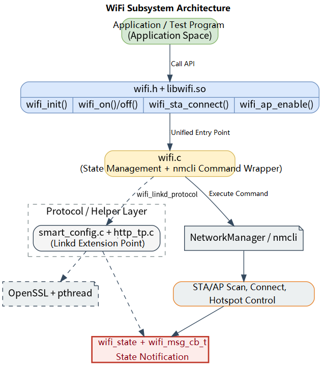

# Peripherals and Drivers · WiFi

## 1. Overview

- **Key Features**: The `wifi` module, located at `components/peripherals/wifi`, provides a NetworkManager-based WiFi management wrapper. The module calls `nmcli` through a unified `wifi.h` C API, covering STA scanning, connecting, disconnecting, information queries, saved-network management, AP hotspot start/stop, MAC query/set, and SoftAP provisioning.
- **Specifications and Features**: Exposes a C interface via `wifi.h` + `libwifi.so`; requires `NetworkManager` and `nmcli` at runtime; depends on `pthread` and OpenSSL at build time; the number of STA scan results is limited by the caller's array capacity, with the test program showing up to 32 by default; the saved-network list API returns at most `WIFI_STA_MAX_NUM=20` entries; SSID maximum length is 32 bytes, PSK maximum length is 64 bytes; the SoftAP provisioning page listens on port `8000` by default, with HTTP Basic authentication fixed at `admin/admin`; AP configuration queries refresh from `nmcli` first, falling back to the component's internal cache on failure.
- **Software Block Diagram**: See the diagram below.

  

- **Directory Structure**:

  | Path | Responsibility |
  | --- | --- |
  | `components/peripherals/wifi/include/wifi.h` | Publicly exposed status codes, modes, STA/AP structs, message callbacks, and WiFi API |
  | `components/peripherals/wifi/src/wifi.c` | `nmcli`-based WiFi initialization, STA, AP, MAC, Linkd, and state management implementation |
  | `components/peripherals/wifi/src/link_protocol/smart_config.c` | SoftAP provisioning HTTP service, SSID/PSK form parsing, and result callbacks |
  | `components/peripherals/wifi/src/link_protocol/http_tp.c` | HTTP response headers, configuration page, and save-result page templates |
  | `components/peripherals/wifi/test/test_wifi_demo.c` | Command-line demo program covering scan, connect, AP, MAC, status, and Linkd flows |
  | `components/peripherals/wifi/CMakeLists.txt` | Module build, OpenSSL/Threads linking, and test target definitions |
  | `components/peripherals/wifi/package.xml` | Component version and NetworkManager dependency description |

## 2. Environment Setup

### Prerequisites

- **Runtime Environment**: Recommended board environment: `k1-deb1` with the matching system image; NetworkManager must be installed and running; `nmcli` must be available; `gcc`, `make`, and `cmake` are required in the build environment.

- **Hardware and Connections**: The target board must have a WiFi adapter manageable by NetworkManager. STA mode requires a reachable router or hotspot; AP mode requires a wireless adapter and driver that support hotspot/AP mode; setting a cloned MAC requires an existing active connection and hardware/driver support for MAC modification.
- **Tools and Permissions**: Many `nmcli` operations require administrator privileges or polkit authorization. Use an account with network management permissions on the development board, and use `sudo` to run the test program when needed. For troubleshooting, run `nmcli device status`, `nmcli radio wifi`, `nmcli device wifi list`, and `nmcli connection show` directly.

### Build

- **Getting the Code**: See the [2.3 Building and Compilation](../../02-快速入门/2.3-构建编译.md) section for cloning the complete SDK with the `repo` tool. All build and test commands below are run from inside the SDK.

- **Module Compilation**:
    - **Option 1: Standalone build**
      ```bash
      cd components/peripherals/wifi
      mkdir build && cd build
      cmake .. -DBUILD_TESTS=ON
      make -j$(nproc)
      ```
    - **Option 2: SDK integrated build (recommended)**
      ```bash
      source build/envsetup.sh
      cd components/peripherals/wifi
      mm     # Build this module only
      ```

- **Artifacts**: `libwifi.so` is output to `build/`; when `BUILD_TESTS` is enabled, `test_wifi_demo` is also generated. SDK build artifacts are installed to the system's `output/staging/{lib,bin}` path.

- **Notes**: The SoftAP provisioning flow uses OpenSSL for Base64 encoding, so the build environment must be able to find OpenSSL. `nmcli` and NetworkManager are required at runtime.

## 3. Example Usage (From Scratch)

This section provides a step-by-step path for readers to reproduce the examples from scratch:

### 3.1 Scan and connect to WiFi

**Prerequisites**: See Section 2. Confirm that NetworkManager is running, the WiFi adapter is visible, the target AP is nearby, and the password is correct.

**Step 1**: Build the demo program.

```bash
cd components/peripherals/wifi
mkdir -p build
cd build
cmake .. -DBUILD_TESTS=ON
make -j$(nproc)
```

Expected result: `libwifi.so` and `test_wifi_demo` are generated in the `build/` directory.

**Step 2**: Scan for nearby WiFi networks.

```bash
cd components/peripherals/wifi
./build/test_wifi_demo scan
```

Expected result: The program prints `Found <N> networks (showing up to 32):` and outputs `SSID`, `RSSI`, `FREQ`, `SEC`, and `BSSID` for each entry. To observe component callbacks at the same time, run `./build/test_wifi_demo cb scan` — the callback will print `[cb] dev_status=...` and similar events.

**Step 3**: Connect to a specific WiFi network.

```bash
./build/test_wifi_demo connect <ssid> <password>
```

Expected result: On success, `wifi_sta_connect: 0` is printed. On failure, a negative status code is returned, for example `-1` meaning the underlying `nmcli` command failed, or `-2` meaning the component is not yet ready.

**Step 4**: Query the current connection information.

```bash
./build/test_wifi_demo info
```

Expected result: On success, the current `SSID`, `BSSID`, local `MAC`, frequency, signal, encryption type, IP, and gateway are printed.

### 3.2 Start an AP and use SoftAP provisioning

**Prerequisites**: The wireless adapter and driver support AP/hotspot mode, and the current account has permission to run `nmcli device wifi hotspot`.

**Step 1**: Start a regular AP hotspot.

```bash
cd components/peripherals/wifi
./build/test_wifi_demo ap TEST_AP 12345678 192.168.1.1 192.168.1.1
```

Expected result: The program first runs `wifi_on(WIFI_MODE_AP)`, then calls `wifi_ap_enable()`; on success it prints `wifi_ap_enable: 0`.

**Step 2**: Query the cached AP configuration.

```bash
./build/test_wifi_demo ap_get
```

Expected result: On success, `AP SSID`, `AP PSK`, `AP SEC`, `AP CH`, and `AP STA NUM` are printed. This information comes from an `nmcli` refresh or the component's internal cache.

**Step 3**: Run the SoftAP provisioning flow.

```bash
./build/test_wifi_demo linkd
```

Expected result: The program creates a default hotspot named `TEST_AP_LINK` and prints `linkd: connect to AP and open http://192.168.1.1:8000`. After connecting to that AP, open the URL in a browser and submit the target router's SSID/PSKs. On successful submission, the program prints `[linkd] ssid=... psk=...` via the callback, then attempts to close the `TEST_AP_LINK` configuration and connect to the target network.

**Step 4**: Disable the AP.

```bash
./build/test_wifi_demo ap_off
```

Expected result: On success, `wifi_ap_disable: 0` is printed and the component's `ap_state` changes to `WIFI_AP_STATE_DISABLE`.

## 4. Application Development

### 4.1 Minimal Usage Flow

```c
static void on_wifi_msg(struct wifi_msg_data *msg)
{
    if (!msg) {
        return;
    }
    printf("msg_id=%d\n", msg->id);
}

int main(void)
{
    struct wifi_sta_connect_param param = {0};

    if (wifi_init() != WIFI_STATUS_SUCCESS) {
        return -1;
    }

    wifi_register_msg_cb(on_wifi_msg, NULL);
    if (wifi_on(WIFI_MODE_STATION) != WIFI_STATUS_SUCCESS) {
        wifi_deinit();
        return -1;
    }

    param.ssid = "YourSSID";
    param.password = "YourPassword";
    param.sec = WIFI_SEC_WPA2_PSK;
    if (wifi_sta_connect(&param) != WIFI_STATUS_SUCCESS) {
        wifi_off(WIFI_MODE_STATION);
        wifi_deinit();
        return -1;
    }

    /* Application layer typically checks the connection result via the callback
       or by polling wifi_get_state() / wifi_sta_get_info() */

    wifi_off(WIFI_MODE_STATION);
    wifi_deinit();
    return 0;
}
```

### 4.2 Main API Reference

**1. Lifecycle and radio control**
```c
// Initialize and deinitialize
enum wifi_status wifi_init(void);
enum wifi_status wifi_deinit(void);

// Enable or disable the specified mode
enum wifi_status wifi_on(enum wifi_mode mode);
enum wifi_status wifi_off(enum wifi_mode mode);
```

**2. STA / AP core operations**
```c
// STA connect and disconnect
enum wifi_status wifi_sta_connect(struct wifi_sta_connect_param *param);
enum wifi_status wifi_sta_disconnect(void);

// AP enable and disable
enum wifi_status wifi_ap_enable(struct wifi_ap_config *config);
enum wifi_status wifi_ap_disable(void);
```

**3. Scan, state, and callbacks**
```c
// Get scan results
enum wifi_status wifi_get_scan_results(struct wifi_scan_result *result,
    const char *ssid, uint32_t *bss_num, uint32_t arr_size);

// Query current state
enum wifi_status wifi_get_state(struct wifi_state *state);

// Register a message callback
enum wifi_status wifi_register_msg_cb(wifi_msg_cb_t msg_cb, void *arg);
```

### 4.3 Core Data Structures

**STA connection parameters**
```c
struct wifi_sta_connect_param {
    const char *ssid;
    const char *password;
    uint8_t bssid[6];
    enum wifi_secure sec;
    bool fast_connect;
};
```

**Scan result struct**
```c
struct wifi_scan_result {
    uint8_t bssid[6];
    char ssid[WIFI_SSID_MAX_LEN + 1];
    uint32_t freq;
    int rssi;
    enum wifi_secure key_mgmt;
    bool scan_action;
};
```

**Message callback data**
```c
struct wifi_msg_data {
    enum wifi_msg_id id;
    union {
        enum wifi_dev_status d_status;
        enum wifi_sta_event event;
        enum wifi_sta_state state;
        enum wifi_ap_event ap_event;
        enum wifi_ap_state ap_state;
    } data;
    void *private_data;
};
```

Development notes: all major APIs require `wifi_init()` to be called first; `wifi_on()` / `wifi_off()` operate on the global WiFi radio and may affect other connections on the system; `wifi_sta_list_networks()` allocates memory for `list.nodes` — the caller must `free(list.nodes)` after use; `wifi_linkd_protocol()` currently supports only `WIFI_LINKD_MODE_SOFTAP`; message callbacks are not an independent background subscription thread but are triggered by the execution path of the related API.

**Reference demos and example paths**
```text
components/peripherals/wifi/test/test_wifi_demo.c
components/peripherals/wifi/src/wifi.c
components/peripherals/wifi/src/link_protocol/smart_config.c
```

## 5. Debugging Guide

- If `wifi_init()` fails, run `nmcli -t -f RUNNING general` and `nmcli device status` directly to confirm that NetworkManager is running and the wireless adapter is visible.
- If scan results are empty, first use `nmcli device wifi list` to verify that the system layer can scan for APs. If the command itself produces no output, check the RF kill switch, driver, and antenna.
- If AP or SoftAP provisioning fails, first confirm the adapter supports hotspot mode, and check whether port `8000` is occupied by another process.

## 6. FAQ

- `wifi_init failed: -1`: typically caused by NetworkManager not running or `nmcli` not being available.
- `wifi_sta_connect: -1`: typically caused by incorrect SSID/password, unreachable AP, or a failed underlying `nmcli` connection.
- `wifi_linkd_protocol()` returns `-5`: only `WIFI_LINKD_MODE_SOFTAP` is currently supported; BLE/QRCODE have not yet been implemented.
