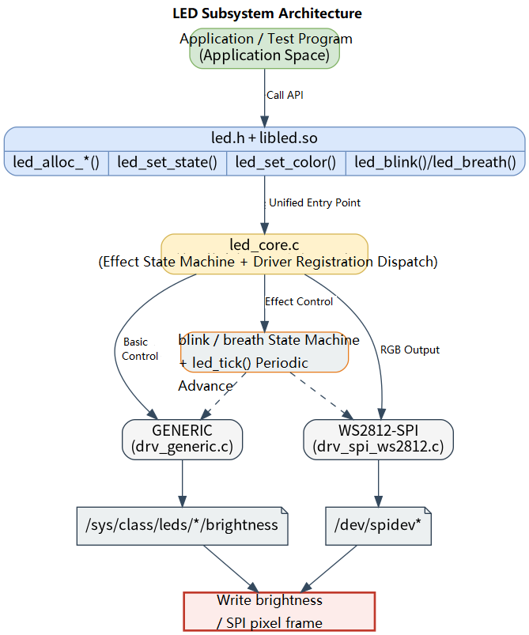

# Peripherals and Drivers · LED

## 1. Overview

- **Key Features**: The `led` module, located at `components/peripherals/led`, provides a unified user-space LED control interface for controlling standard sysfs LED indicators and SPI-based WS2812/SK6812 RGB light strips. The module uses a driver registration mechanism to abstract away low-level differences and exposes common operations — on/off, brightness, color, blink, and breathing effects — to the upper layer.
- **Specifications and Features**: Exposes a C interface via `led.h` + `libled.so`; by default only the `drv_generic` sysfs LED driver is compiled in; WS2812/SK6812 support requires explicitly enabling `drv_spi_ws2812` in CMake; the sysfs driver writes `/sys/class/leds/<name>/brightness` and currently writes only `0/1`; the WS2812 driver writes to `/dev/spidevX.Y`, with defaults of SPI rate `6400000 Hz`, reset padding `80` bytes, and LED count `1`, with encoding fixed in GRB order; blink and breathing effects depend on the application periodically calling `led_tick()`, recommended at 10 Hz to 50 Hz.
- **Software Block Diagram**: See the diagram below.

  

- **Directory Structure**:

  | Path | Responsibility |
  | --- | --- |
  | `components/peripherals/led/include/led.h` | Publicly exposed color struct, blink parameters, and LED control API |
  | `components/peripherals/led/src/led_core.c` | Device allocation, driver registry, on/off/brightness/color mapping, and effect state machine |
  | `components/peripherals/led/src/led_core.h` | Internal device object, driver vtable, driver type, and registration macros |
  | `components/peripherals/led/src/drivers/drv_generic.c` | sysfs LED driver controlling `/sys/class/leds/<name>/brightness` |
  | `components/peripherals/led/src/drivers/drv_spi_ws2812.c` | SPI WS2812/SK6812 driver handling GRB encoding and spidev transfer |
  | `components/peripherals/led/test/test_led_generic.c` | sysfs LED demo program covering on/off, toggle, blink, and breathing effects |
  | `components/peripherals/led/test/test_led_ws2812.c` | WS2812 SPI demo program covering color, brightness, blink, and breathing effects |
  | `components/peripherals/led/CMakeLists.txt` | Module build, driver selection, and test target definitions |

## 2. Environment Setup

### Prerequisites

- **Runtime Environment**: Recommended board environment: `k1-deb1` with the matching system image; `gcc`, `make`, and `cmake` are required in the build environment; the sysfs LED path requires kernel LED subsystem support; the WS2812 path requires spidev support.
- **Hardware and Connections**: Standard LEDs require a `gpio-leds` node configured in the device tree and exposed under `/sys/class/leds/`. WS2812/SK6812 light strips must be connected to an enabled SPI controller; confirm power, voltage levels, common ground, LED count, and SPI frequency meet the hardware requirements.

### Build

- **Getting the Code**: See the [2.3 Building and Compilation](../../02-快速入门/2.3-构建编译.md) section for cloning the complete SDK with the `repo` tool. All build and test commands below are run from inside the SDK.

- **Module Compilation**:
    - **Option 1: Standalone build**
      ```bash
      cd components/peripherals/led
      mkdir build && cd build
      cmake .. -DBUILD_TESTS=ON -DSROBOTIS_PERIPHERALS_LED_ENABLED_DRIVERS="drv_generic;drv_spi_ws2812"
      make -j$(nproc)
      ```
    - **Option 2: SDK integrated build (recommended)**
      ```bash
      source build/envsetup.sh
      cd components/peripherals/led
      mm -DBUILD_TESTS=ON -DSROBOTIS_PERIPHERALS_LED_ENABLED_DRIVERS="drv_generic;drv_spi_ws2812"     # Build this module only
      ```

- **Artifacts**: `libled.so` is output to `build/`; when `BUILD_TESTS` is enabled, `test_led_generic` and `test_led_ws2812` are also generated. SDK build artifacts are installed to the system's `output/staging/{lib,bin}` path.

- **Notes**: Only `drv_generic` is enabled by default. To include the WS2812 SPI driver, explicitly set `-DSROBOTIS_PERIPHERALS_LED_ENABLED_DRIVERS="drv_generic;drv_spi_ws2812"`, and note that the semicolon-separated value must be quoted as a whole.

## 3. Example Usage (From Scratch)

This section provides a step-by-step path for readers to reproduce the examples from scratch:

### 3.1 Control a WS2812 SPI light strip

**Prerequisites**: Confirm that the SPI controller is enabled, `/dev/spidevX.Y` exists, and the light strip's power and signal connections are correct.

**Step 1**: Enable the WS2812 SPI driver in the build.

```bash
cd components/peripherals/led
mkdir -p build
cd build
cmake .. -DBUILD_TESTS=ON -DSROBOTIS_PERIPHERALS_LED_ENABLED_DRIVERS="drv_spi_ws2812"
make -j$(nproc)
```

Expected result: `libled.so` and `test_led_ws2812` are generated in the `build/` directory.

**Step 2**: Run the WS2812 demo program.

```bash
cd components/peripherals/led
sudo ./build/test_led_ws2812 /dev/spidev0.0 23 grb 6400000 80
```

Expected result: The terminal prints `LED WS2812 SPI Test` and sequentially runs red, green, blue, off, blink, and breathing effects. The current driver actually encodes in GRB order regardless of the `order` argument; the `order` parameter in the test program's usage is a placeholder and is not passed into the driver.

## 4. Application Development

### 4.1 Minimal Usage Flow

```c
static void run_ticks(struct led_dev *dev, uint32_t duration_ms, uint16_t tick_ms)
{
    uint32_t elapsed = 0;
    while (elapsed < duration_ms) {
        led_tick(dev, tick_ms);
        usleep(tick_ms * 1000U);
        elapsed += tick_ms;
    }
}

int main(void)
{
    struct led_sysfs_args {
        const char *sysfs_name;
        int active_level;
    } args = {
        .sysfs_name = "sys-led_1",
        .active_level = 0,
    };

    struct led_dev *dev = led_alloc_generic("sys-led_1", &args);
    if (!dev) {
        return -1;
    }

    led_set_state(dev, true);

    struct led_blink_param blink = {
        .period_ms = 1000,
        .on_ms = 200,
        .count = 5,
    };
    led_blink(dev, &blink);
    run_ticks(dev, 5500, 50);

    led_set_state(dev, false);
    led_free(dev);
    return 0;
}
```

### 4.2 Main API Reference

**1. Device creation and release**
```c
// Create a generic or SPI LED device
struct led_dev *led_alloc_generic(const char *name, void *args);
struct led_dev *led_alloc_spi(const char *name, void *args);

// Release device resources
void led_free(struct led_dev *dev);
```

**2. Basic control**
```c
// On/off, toggle, brightness, and color control
void led_set_state(struct led_dev *dev, bool on);
void led_toggle(struct led_dev *dev);
void led_set_brightness(struct led_dev *dev, uint8_t brightness);
void led_set_color(struct led_dev *dev, const struct led_color *color);
```

**3. Effect control**
```c
// Blink, breathing, and state machine advance
void led_blink(struct led_dev *dev, const struct led_blink_param *param);
void led_breath(struct led_dev *dev, uint16_t period_ms);
void led_tick(struct led_dev *dev, uint16_t dt_ms);
```

### 4.3 Core Data Structures

**Color struct**
```c
struct led_color {
    uint8_t r;
    uint8_t g;
    uint8_t b;
};
```

**Blink parameter struct**
```c
struct led_blink_param {
    uint16_t period_ms;
    uint16_t on_ms;
    uint8_t count;
};
```

**Device handle**
```c
struct led_dev;
```

Development notes: the device name supports the `driver_name:instance_name` format, e.g., `spi-ws2812:strip0`; `led_blink()` and `led_breath()` only set the effect state — the application must call `led_tick()` periodically to advance the effect; the generic driver has no real RGB color interface and `led_set_color()` degrades to on/off control; the `args` parameter of `led_alloc_generic()` and `led_alloc_spi()` is driver-private — refer directly to the local struct definition in the demo for the current layout.

**Reference demos and example paths**
```text
components/peripherals/led/test/test_led_generic.c
components/peripherals/led/test/test_led_ws2812.c
components/peripherals/led/src/drivers/drv_generic.c
components/peripherals/led/src/drivers/drv_spi_ws2812.c
```

## 5. Debugging Guide

- If the sysfs LED or WS2812 device creation fails, check that `/sys/class/leds/<name>/brightness` and `/dev/spidevX.Y` exist and have the correct access permissions.
- If blink or breathing effects show no change, confirm that the application loop continuously calls `led_tick()` and that `dt_ms` is non-zero.

## 6. FAQ

- LED on/off is reversed from expected: first check whether `active_level` matches the hardware active level.
- The test demo reports device not found when run from a serial terminal: run it over SSH instead.
