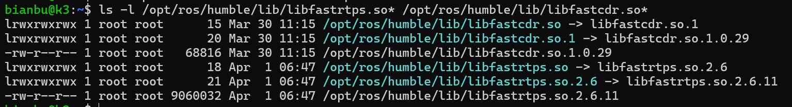

# ROS2 Installation


## Platform Requirements

Hardware: SpacemiT K3 RISC-V

Operating System: Bianbu 4.0.1 and above

## About Software Sources

SpacemiT Bianbu 4.0.1 and above firmware includes ROS2 software sources by default, no additional source configuration is needed.

Currently, the well-supported versions are Humble and Jazzy, both of which can install ros-$ROS_DISTRO-desktop. Humble is recommended.

Ensure you run:

```bash
sudo apt update
```

Do not configure sources according to the official ROS2 documentation!

## Installation

### Install Development Tools (Recommended)

If you need to compile ROS2 packages or perform secondary development, it is recommended to install the development toolset:

```bash
sudo apt update && sudo apt install ros-dev-tools
```

This will install necessary tools such as colcon.

### Install ROS-Base

The base version includes ROS communication libraries, message interfaces, command-line tools, and other core components, but does not include GUI tools:

Humble version is recommended:

```bash
sudo apt install ros-humble-ros-base
```


### Load ROS2 Environment Variables

```bash
source /opt/ros/humble/setup.sh
```


## Publish/Subscribe Example

```bash
sudo apt install ros-humble-demo-nodes-cpp
```

Terminal 1

```bash
source /opt/ros/humble/setup.sh
ros2 run demo_nodes_cpp talker
```

Output:


Terminal 2:

```bash
source /opt/ros/humble/setup.sh
ros2 run demo_nodes_cpp listener
```

Output


## rviz2 Usage Notes

```bash
sudo apt install ros-humble-desktop
```

Start it:

```bash
source /opt/ros/humble/setup.bash
rviz2
```

**If startup fails on Humble, try importing this in the terminal:**

```bash
export QT_QPA_PLATFORM=xcb
```

**If startup fails on Jazzy, try importing this in the terminal:**

```bash
export __GLX_VENDOR_LIBRARY_NAME=mesa
```

rviz2 has high resource consumption. Use it only when validating on the board.


## DDS Notes

K3 ROS2 Humble uses `fastdds` by default.

**Humble**

Fast DDS / Fast RTPS: 2.6.11
Fast CDR: 1.0.29

```bash
ls -l /opt/ros/humble/lib/libfastrtps.so* /opt/ros/humble/lib/libfastcdr.so*
```



If you need to customize fastdds, pay attention to version compatibility.
