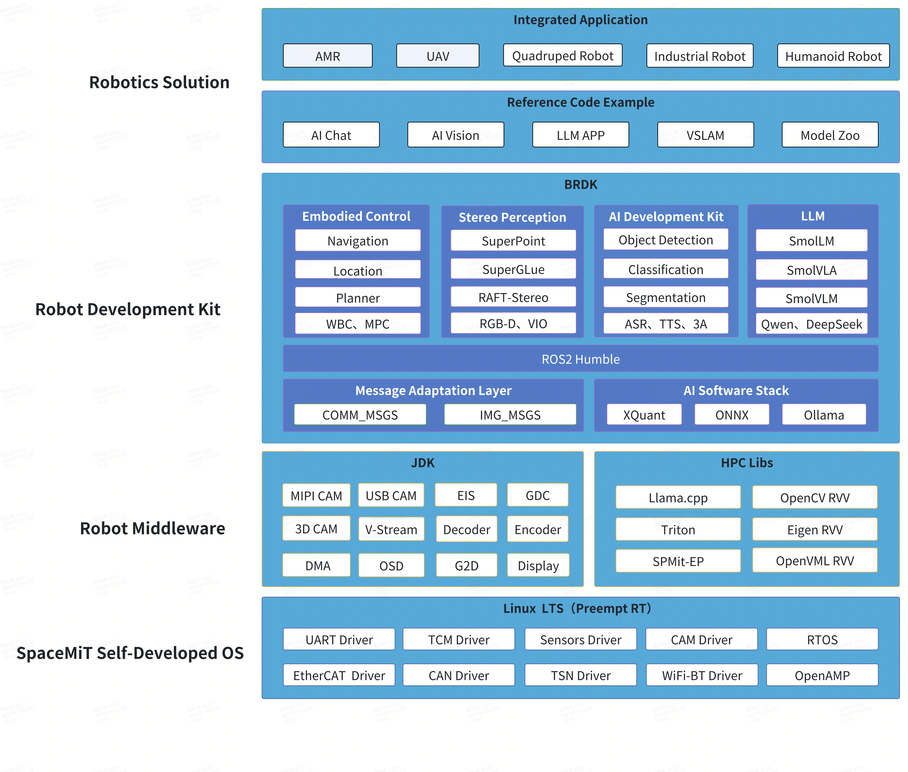

# Introduction

**Bianbu Robot** is a hardware–software co-design solution for next-generation intelligent robots, built on our self-developed **RISC-V K1** chip and proprietary operating system. It integrates on-device AI inference, Large Language Model (LLM) support, and high-performance control, with broad compatibility across service robots, quadrupeds, drones, robotic arms, and other intelligent terminals.

The core system **Bianbu ROS** is built upon the self-developed Bianbu OS as the kernel and uses **ROS2** as the runtime core. It integrates multimedia middleware **JDK**, high-performance computing libraries **HPC Libs**, and a development kit **BRDK**, forming a complete robotic application infrastructure. The system comes with built-in AI models and toolchains, supporting commonly used modules and sample references such as speech recognition, vision perception, task orchestration, and path planning — deployment-ready with minimal integration effort.

At its core, **Bianbu ROS** is based on the **Bianbu OS** kernel and uses **ROS2** as the runtime framework. It incorporates multimedia middleware **JDK**, high-performance computing libraries **HPC Libs**, and the **BRDK** development kit to form a complete robotic application infrastructure. The system includes built-in AI models and toolchains, supporting modules and reference implementations for speech recognition, computer vision, task orchestration, and path planning — deployment-ready with minimal integration effort.

## Platform Vision

Bianbu Robot aims to promote the adoption of RISC-V architecture in robotics, accelerate the development of a domestic intelligent robot ecosystem, empower intelligent perception and natural interaction capabilities, and help developers rapidly deploy next-generation smart terminals.

## System Architecture

The Bianbu Robot solution integrates large language model (LLM) capabilities for natural language interaction and intelligent multi-task orchestration. It supports a wide range of intelligent terminal applications, including drones, cleaning robots, quadrupeds, robotic arms, and AI-powered consumer robotics.

At the system level, the Bianbu Robot solution is based on the Bianbu ROS robot operating system and provides a complete reference for AI robotics. Bianbu ROS is built on the proprietary Bianbu OS, integrates deeply optimized robotic middleware and SDKs, and includes multimedia middleware JDK, high-performance computing libraries HPC Libs, and the BRDK development kit.

### RDK (ROS Dev Kits)

**RDK** performs deep abstraction and modular encapsulation based on **ROS2**, offering open-source reference solutions taligned with AI robotics product requirements.

- **Integrated AI development toolchain**
  Built-in quantization toolchains, foundational pretrained model libraries (Model Zoo), and sample code. Supports mainstream model formats and deployment workflows, ready to use out of the box.
- **Adapted for mainstream open-source large models**
  Natively supports DeepSeek, Qwen, Hugging Face Smol\* series, and more. Integrates the large model orchestration framework LocalAI with OpenAI API-compatible frontend interfaces for seamless integration with existing ecosystems.
- **Complete speech processing solution**
  Provides product-grade ASR (speech recognition) and TTS (speech synthesis) model libraries, multi-microphone array preprocessing, sound source localization SDKs, noise suppression, and echo cancellation modules — covering the full speech interaction chain from sensing to communication.
- **Open-source ROS2 service components**
  Offers a wide range of ROS2 packages including vision perception, voice interaction, sensor integration, embodied motor control, localization and navigation, and LLM task orchestration — supporting modular integration and customized development.
- **Reference application pipeline examples**
  Provides end-to-end references covering data acquisition, processing, modeling, and interaction to help developers quickly build full robotic application systems.

### MediaEngine

MediaEngine provides highly abstracted data pipelines based on the underlying OS, enabling modular functionality and high code reuse so developers can focus on building high-level pipelines without worrying about low-level data scheduling and system details.

- **IO HUB data hub**
  Compatible with various protocol camera devices, supports zero-copy data transfer, minimizes system bandwidth consumption, and significantly reduces power overhead.
- **Hardware-accelerated pipelines**
  Fully leverages chip-embedded hardware acceleration units in pipeline flows, supporting high-performance image operations like scaling, rotation, cropping, and blending.
- **Modular programming model**
  Supports block-style programming across the entire flow — including data acquisition, encoding, model inference, watermarking, video display, and multi-stream re-push — for flexible composition and rapid development.
- **Low-latency direct display mechanism**
  Provides flexible video direct rendering strategies, optimizes framebuffer paths, significantly reduces video pipeline latency, and meets real-time application demands.
- **OpenCL accelerated library support**
  Integrates a wide range of image enhancement and stabilization algorithms, including distortion correction and electronic image stabilization (EIS), accelerated by the AI CPU for efficient image processing.

### RVV-Opt Libs（RISC-V Vector Optimization Libraries）

High-performance computing is critical in robotic perception and control tasks. Bianbu Robot provides deeply optimized compute engines to maximize the hardware potential of the K1 chip.

- **Basic computation libraries**
  Integrates mainstream foundational libraries such as OpenCV for computer vision, OpenVML for math, and Eigen/OpenBLAS for linear algebra. These libraries are vectorized and deeply optimized for the RISC-V platform to fully utilize the 256-bit RISC-V Vector Extension (RVV).
- **AI operator libraries**
  Built upon custom AI instructions following the IME (Intelligent Matrix Engine) standard to form meta-operator-level AI operator libraries. By calling standard operator APIs, developers can harness powerful AI performance.
- **AI accelerated inference backend**
  Deeply adapted for the RISC-V platform with operator fusion, multithreaded scheduling, memory optimization, and dynamic SARM partitioning. Seamlessly integrates with ONNXRuntime, Llama.cpp, and other mainstream inference frameworks.
- **High-performance computing language**
  Based on a RISC-V-adapted version of OpenAI Triton, developers can write Python code to achieve near-peak hardware performance. Supports rapid migration of mainstream CUDA inference tasks to the RISC-V platform, significantly lowering adaptation costs and accelerating deployment.

## Solution Highlights

The Bianbu Robot solution focuses on speech algorithms, AI vision, and large model applications, offering out-of-the-box modular services tightly coupled with chip capabilities to help clients accelerate solution deployment. SDK source code is open to support developer innovation.

- **Supports a rich Model Zoo**
  Covers large model applications, speech processing, and traditional visual AI models.
- **Large model applications**
  Compatible with Qwen2 series, DeepSeek-1.5b, SomlLM2, SomlVLM, SomlVLA series. Supports large model conversational speech interaction with end-to-end latency under 1.5 seconds.
- **Speech processing**
  Covers VAD, ASR, TTS, DOA, NS, and multi-microphone sound source localization.
- **Traditional AI vision**
  Offers optimized models for object detection, classification, tracking, and more — supporting over 1000 application scenarios.
- **Localization and mapping**
  Supports laser navigation, monocular VSLAM, and stereo visual odometry solutions.
- **Supports Linux PreemptRT**
  Compatible with industrial control protocols like EtherCAT, CAN, RS485/232 — meeting real-time control requirements.
- **Low-latency video pipeline**
  Supports up to 1080P\@120FPS encoding — ideal for drone video latency demands.
- **Complete toolchain**
  Includes optimized GCC/Clang compilers, quantization tools, and large model fine-tuning tools.

## Solution Advantages

Current robotic terminals heavily rely on connectivity, but privacy protection is a key challenge. Bianbu Robot effectively addresses the core challenges of deploying large models:

- **Development flexibility**
  Linux SDK system source code is fully open, with rich debugging tools to support custom algorithm development and application extension.
- **Cost advantage**
  The K1 performs baseline AI inference on the edge, reducing dependency on cloud servers and lowering total system operation costs.
- **Performance balance**
  Combines lightweight edge inference with high-performance cloud computing — ensuring local smart model upgrades while avoiding latency from cloud-only solutions, enabling always-on smart responses.
- **Enhanced privacy**
  Handles sensitive tasks (e.g., ASR) locally using on-device compute, complying with privacy laws across countries and solving regulatory concerns in large model applications.

## Feedback

For issues or suggestions, please visit the project community:

🔗 [https://gitee.com/bianbu/brdk-doc/issues](https://gitee.com/bianbu/brdk-doc/issues)
