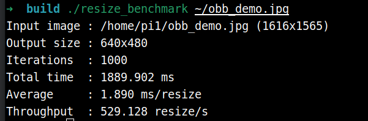
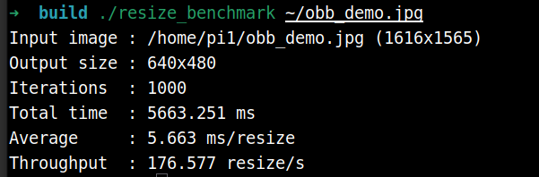
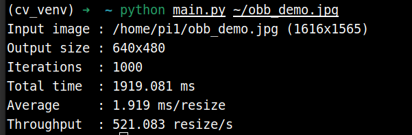

# 3.5.1 OpenCV RVV 使用

OpenCV 在 RVV（RISC-V Vector）上的使用与 x86 平台基本一致，主要是库的差异。

## 什么是OpenCV？

**OpenCV（Open Source Computer Vision Library）** 是一个开源的计算机视觉和机器学习软件库，由英特尔公司发起并得到社区的广泛支持。它提供了一个跨平台的编程框架，用于实时的计算机视觉应用开发。常用于:

- 图像处理和分析
- 人脸检测和识别
- 物体检测和跟踪
- 机器学习应用
- 视频分析
- 相机标定和 3D 重建

## C++使用

本节对比带 RVV 和不带 RVV的 resize 函数的性能表现

### 安装必要依赖

```
sudo apt install wget cmake gcc-14 g++-14
```

### 设置 gcc 编译器

为了更好地适配 RVV ，建议使用 gcc 14 编译器

```
sudo update-alternatives --install /usr/bin/gcc gcc /usr/bin/gcc-14 100
sudo update-alternatives --install /usr/bin/g++ g++ /usr/bin/g++-14 100
sudo update-alternatives --set gcc /usr/bin/gcc-14
sudo update-alternatives --set g++ /usr/bin/g++-14

sudo update-alternatives --install /usr/bin/riscv64-linux-gnu-gcc riscv64-linux-gnu-gcc /usr/bin/riscv64-linux-gnu-gcc-14 100
sudo update-alternatives --install /usr/bin/riscv64-linux-gnu-g++ riscv64-linux-gnu-g++ /usr/bin/riscv64-linux-gnu-g++-14 100
sudo update-alternatives --set riscv64-linux-gnu-gcc /usr/bin/riscv64-linux-gnu-gcc-14
sudo update-alternatives --set riscv64-linux-gnu-g++ /usr/bin/riscv64-linux-gnu-g++-14
```


### 安装 opencv-spacemit

`opencv-spacemit` 包跟踪上游最新的RVV优化，提供在 SpacemiT riscv64 平台上的最佳性能

```
sudo apt update
sudo apt install opencv-spacemit
```

安装完成后终端打印：

```
==============================
How to use this custom OpenCV
==============================

Method 1: Specify OpenCV_DIR in CMakeLists.txt

    set(OpenCV_DIR "/opt/opencv-spacemit/lib/cmake/opencv4")
    find_package(OpenCV REQUIRED)

Method 2: Set CMAKE_PREFIX_PATH when running cmake

    cmake -DCMAKE_PREFIX_PATH=/opt/opencv-spacemit ..

================================
```


### **测试图片下载**

```
cd ~
wget https://archive.spacemit.com/spacemit-ai/BRDK/Model_Zoo/Datasets/test/obb_demo.jpg
```

### **项目结构**

```
➜  cv_test tree -L 2 .
.
├── CMakeLists.txt
└── src
    └── main.cpp # 测试程序
```

**main.cpp**

```
#include <opencv2/opencv.hpp>

#include <cstdlib>
#include <iomanip>
#include <iostream>
#include <string>

namespace {

void printUsage(const char* program) {
    std::cout << "Usage: " << program << " [image_path] [iterations] [width] [height]\n"
              << "Defaults:\n"
              << "  image_path : obb_demo.jpg\n"
              << "  iterations : 1000\n"
              << "  width      : 640\n"
              << "  height     : 480\n";
}

int parsePositiveInt(const char* value, const char* name) {
    char* end = nullptr;
    const long parsed = std::strtol(value, &end, 10);
    if (*value == '\0' || *end != '\0' || parsed <= 0) {
        std::cerr << "Invalid " << name << ": " << value << '\n';
        std::exit(1);
    }
    return static_cast<int>(parsed);
}

}  // namespace

int main(int argc, char** argv) {
    if (argc > 1 && (std::string(argv[1]) == "-h" || std::string(argv[1]) == "--help")) {
        printUsage(argv[0]);
        return 0;
    }

    const std::string imagePath = argc > 1 ? argv[1] : "obb_demo.jpg";
    const int iterations = argc > 2 ? parsePositiveInt(argv[2], "iterations") : 1000;
    const int targetWidth = argc > 3 ? parsePositiveInt(argv[3], "width") : 640;
    const int targetHeight = argc > 4 ? parsePositiveInt(argv[4], "height") : 480;

    if (argc > 5) {
        printUsage(argv[0]);
        return 1;
    }

    const cv::Mat input = cv::imread(imagePath, cv::IMREAD_COLOR);
    if (input.empty()) {
        std::cerr << "Failed to read image: " << imagePath << '\n';
        return 1;
    }

    cv::Mat output;
    const cv::Size targetSize(targetWidth, targetHeight);

    for (int i = 0; i < 10; ++i) {
        cv::resize(input, output, targetSize, 0.0, 0.0, cv::INTER_LINEAR);
    }

    const int64 start = cv::getTickCount();
    for (int i = 0; i < iterations; ++i) {
        cv::resize(input, output, targetSize, 0.0, 0.0, cv::INTER_LINEAR);
    }
    const int64 end = cv::getTickCount();

    const double totalMs = (end - start) * 1000.0 / cv::getTickFrequency();
    const double avgMs = totalMs / iterations;
    const double fps = 1000.0 / avgMs;

    std::cout << std::fixed << std::setprecision(3)
              << "Input image : " << imagePath << " (" << input.cols << "x" << input.rows << ")\n"
              << "Output size : " << targetWidth << "x" << targetHeight << '\n'
              << "Iterations  : " << iterations << '\n'
              << "Total time  : " << totalMs << " ms\n"
              << "Average     : " << avgMs << " ms/resize\n"
              << "Throughput  : " << fps << " resize/s\n";

    return 0;
}
```

**CMakeLists.txt**

```
cmake_minimum_required(VERSION 3.10)
project(opencv_resize_benchmark LANGUAGES CXX)

set(CMAKE_CXX_STANDARD 17)
set(CMAKE_CXX_STANDARD_REQUIRED ON)

find_package(OpenCV REQUIRED)

add_executable(resize_benchmark src/main.cpp)
target_link_libraries(resize_benchmark PRIVATE ${OpenCV_LIBS})
target_include_directories(resize_benchmark PRIVATE ${OpenCV_INCLUDE_DIRS})
```

本文顶层目录路径默认为 `~/cv_test`

### 带 RVV 编译测试

```
cd ~/cv_test
mkdir build && cd build
cmake -DCMAKE_PREFIX_PATH=/opt/opencv-spacemit ..
```

**终端打印如下：**

```
➜  build cmake -DCMAKE_PREFIX_PATH=/opt/opencv-spacemit ..
-- The CXX compiler identification is GNU 14.2.0
-- Detecting CXX compiler ABI info
-- Detecting CXX compiler ABI info - done
-- Check for working CXX compiler: /usr/bin/c++ - skipped
-- Detecting CXX compile features
-- Detecting CXX compile features - done
-- Found OpenCV: /opt/opencv-spacemit (found version "4.14.0")
-- Configuring done (1.4s)
-- Generating done (0.0s)
-- Build files have been written to: /home/pi1/cv_test/build
```

**编译：**

```
make
```

**开启测试：**

```
./resize_benchmark ~/obb_demo.jpg
```

**终端打印如下：**



### 不带 RVV 编译测试

**安装系统 OpenCV库**

```
sudo apt install libopencv-dev
```

测试完成后，如需恢复为优先使用 `opencv-spacemit` 的环境，可卸载系统 OpenCV：

```
sudo apt remove libopencv-dev
sudo apt autoremove
```

**配置**

```
cd ~/cv_test
rm -rf build
mkdir build && cd build
cmake ..
```

**终端打印**

```
cmake ..
-- The CXX compiler identification is GNU 14.2.0
-- Detecting CXX compiler ABI info
-- Detecting CXX compiler ABI info - done
-- Check for working CXX compiler: /usr/bin/c++ - skipped
-- Detecting CXX compile features
-- Detecting CXX compile features - done
-- Found OpenCV: /usr (found version "4.6.0")
-- Configuring done (1.4s)
-- Generating done (0.0s)
-- Build files have been written to: /home/pi1/cv_test/build

```

**编译**

```
make
```

**开启测试**

```
./resize_benchmark ~/obb_demo.jpg
```

**终端打印如下**




可以看出，RVV 加速的 OpenCV 库性能相比于系统自带的 OpenCV 库有明显提升（5.663ms -> 1.890ms）


## Python使用

### 安装必要依赖

```
sudo apt install python3-venv python3-pip
```

### 设置 SpacemiT 源

```
pip config set global.index-url https://mirrors.aliyun.com/pypi/simple/
pip config set global.extra-index-url https://git.spacemit.com/api/v4/projects/33/packages/pypi/simple
```

### 创建虚拟环境

```
python3 -m venv ~/cv_venv
```

### 安装 opencv-python

```
source ~/cv_venv/bin/activate
pip install opencv-python
```

终端打印

```
(cv_venv) ➜  ~ pip install opencv-python
Looking in indexes: https://mirrors.aliyun.com/pypi/simple/, https://git.spacemit.com/api/v4/projects/33/packages/pypi/simple
Collecting opencv-python
  Downloading https://git.spacemit.com/api/v4/projects/33/packages/pypi/files/21718d6ed9cc3558fa3cc3dde26496ff8739e58d5b7b1d4e7b4f7a34e8ca947c/opencv_python-4.13.0.92-cp39-abi3-linux_riscv64.whl (91.2 MB)
     ━━━━━━━━━━━━━━━━━━━━━━━━━━━━━━━━━━━━━━━━ 91.2/91.2 MB 569.7 kB/s eta 0:00:00
Collecting numpy>=2 (from opencv-python)
  Using cached https://git.spacemit.com/api/v4/projects/33/packages/pypi/files/546ccf8391ebca22db0b16cd9fcf614c8ffcee86b2c9e4de3a9e4690ee3a9250/numpy-2.4.6-cp312-cp312-linux_riscv64.whl (10.4 MB)
Installing collected packages: numpy, opencv-python
Successfully installed numpy-2.4.6 opencv-python-4.13.0.92
```

### 测试

测试代码：

main.py

```
import argparse
import sys
import time

import cv2


def positive_int(value: str) -> int:
    try:
        parsed = int(value)
    except ValueError:
        raise argparse.ArgumentTypeError(f"invalid positive int value: {value}")

    if parsed <= 0:
        raise argparse.ArgumentTypeError(f"invalid positive int value: {value}")
    return parsed


def parse_args() -> argparse.Namespace:
    parser = argparse.ArgumentParser(
        description="Benchmark OpenCV resize performance.",
        formatter_class=argparse.RawTextHelpFormatter,
    )
    parser.add_argument("image_path", nargs="?", default="obb_demo.jpg")
    parser.add_argument("iterations", nargs="?", type=positive_int, default=1000)
    parser.add_argument("width", nargs="?", type=positive_int, default=640)
    parser.add_argument("height", nargs="?", type=positive_int, default=480)
    return parser.parse_args()


def main() -> int:
    args = parse_args()

    input_image = cv2.imread(args.image_path, cv2.IMREAD_COLOR)
    if input_image is None:
        print(f"Failed to read image: {args.image_path}", file=sys.stderr)
        return 1

    target_size = (args.width, args.height)
    output_image = None

    for _ in range(10):
        output_image = cv2.resize(input_image, target_size, interpolation=cv2.INTER_LINEAR)

    start = time.perf_counter()
    for _ in range(args.iterations):
        output_image = cv2.resize(input_image, target_size, interpolation=cv2.INTER_LINEAR)
    end = time.perf_counter()

    if output_image is None:
        return 1

    total_ms = (end - start) * 1000.0
    avg_ms = total_ms / args.iterations
    fps = 1000.0 / avg_ms

    height, width = input_image.shape[:2]
    print(f"Input image : {args.image_path} ({width}x{height})")
    print(f"Output size : {args.width}x{args.height}")
    print(f"Iterations  : {args.iterations}")
    print(f"Total time  : {total_ms:.3f} ms")
    print(f"Average     : {avg_ms:.3f} ms/resize")
    print(f"Throughput  : {fps:.3f} resize/s")

    return 0


if __name__ == "__main__":
    raise SystemExit(main())
```

```
source ~/cv_venv/bin/activate
python main.py ~/obb_demo.jpg
```

结果如下：




## 更多OpenCV性能测试数据

### 单核对比

- 使用 OPENCV_FOR_THREADS_NUM=1 OMP_NUM_THREADS=1 OPENBLAS_NUM_THREADS=1 MKL_NUM_THREADS=1 taskset -c 7 限制线程和核数
- 计时策略是跑 100 次取平均值，预热10次
- no_rvv_avg_ms 表示的是系统 libopencv-dev 包的表现
- rvv_avg_ms 表示的是 opencv-spacemit 包的表现


| module | function | api | input_size | output_size | no_rvv_avg_ms | rvv_avg_ms | speedup |
| :-: | :-: | :-: | :-: | :-: | :--: | :--: | :--: |
| imgproc | resize_linear | `cv::resize(INTER_LINEAR)` | 1280x720 | 224x224 | 5.0101 | 1.8688 | 2.6809x |
| imgproc | resize_linear | `cv::resize(INTER_LINEAR)` | 1280x720 | 320x320 | 8.5993 | 2.9769 | 2.8887x |
| imgproc | resize_linear | `cv::resize(INTER_LINEAR)` | 1280x720 | 640x640 | 25.9016 | 6.5986 | 3.9253x |
| imgproc | resize_linear | `cv::resize(INTER_LINEAR)` | 1280x720 | 512x512 | 18.3814 | 5.3787 | 3.4174x |
| imgproc | resize_linear | `cv::resize(INTER_LINEAR)` | 1280x720 | 1024x1024 | 55.2048 | 16.6154 | 3.3225x |
| imgproc | resize_linear | `cv::resize(INTER_LINEAR)` | 1920x1080 | 224x224 | 5.0177 | 1.6347 | 3.0695x |
| imgproc | resize_linear | `cv::resize(INTER_LINEAR)` | 1920x1080 | 320x320 | 8.5922 | 3.1135 | 2.7597x |
| imgproc | resize_linear | `cv::resize(INTER_LINEAR)` | 1920x1080 | 640x640 | 28.1919 | 8.9937 | 3.1346x |
| imgproc | resize_linear | `cv::resize(INTER_LINEAR)` | 1920x1080 | 512x512 | 20.1787 | 6.2786 | 3.2139x |
| imgproc | resize_linear | `cv::resize(INTER_LINEAR)` | 1920x1080 | 1024x1024 | 65.6284 | 17.7506 | 3.6972x |
| imgproc | resize_linear | `cv::resize(INTER_LINEAR)` | 2560x1440 | 224x224 | 4.2000 | 1.6831 | 2.4954x |
| imgproc | resize_linear | `cv::resize(INTER_LINEAR)` | 2560x1440 | 320x320 | 8.1376 | 2.8381 | 2.8673x |
| imgproc | resize_linear | `cv::resize(INTER_LINEAR)` | 2560x1440 | 640x640 | 27.9078 | 8.5876 | 3.2498x |
| imgproc | resize_linear | `cv::resize(INTER_LINEAR)` | 2560x1440 | 512x512 | 18.9830 | 5.7227 | 3.3171x |
| imgproc | resize_linear | `cv::resize(INTER_LINEAR)` | 2560x1440 | 1024x1024 | 69.0017 | 17.7506 | 3.8873x |
| imgproc | resize_linear | `cv::resize(INTER_LINEAR)` | 3840x2160 | 224x224 | 4.4851 | 9.3864 | 0.4778x |
| imgproc | resize_linear | `cv::resize(INTER_LINEAR)` | 3840x2160 | 320x320 | 8.3666 | 8.5807 | 0.9750x |
| imgproc | resize_linear | `cv::resize(INTER_LINEAR)` | 3840x2160 | 640x640 | 28.4929 | 9.7345 | 2.9270x |
| imgproc | resize_linear | `cv::resize(INTER_LINEAR)` | 3840x2160 | 512x512 | 19.2104 | 6.8924 | 2.7872x |
| imgproc | resize_linear | `cv::resize(INTER_LINEAR)` | 3840x2160 | 1024x1024 | 75.6757 | 19.6668 | 3.8479x |
| imgproc | resize_linear | `cv::resize(INTER_LINEAR)` | 640x480 | 224x224 | 3.6385 | 1.3983 | 2.6021x |
| imgproc | resize_linear | `cv::resize(INTER_LINEAR)` | 640x480 | 320x320 | 6.6513 | 1.9315 | 3.4436x |
| imgproc | resize_linear | `cv::resize(INTER_LINEAR)` | 640x480 | 640x640 | 21.6929 | 5.8661 | 3.6980x |
| imgproc | resize_linear | `cv::resize(INTER_LINEAR)` | 640x480 | 512x512 | 15.6062 | 3.8893 | 4.0126x |
| imgproc | resize_linear | `cv::resize(INTER_LINEAR)` | 640x480 | 1024x1024 | 47.1090 | 14.7610 | 3.1915x |
| imgproc | cvtColor_bgr2rgb | `cv::cvtColor(COLOR_BGR2RGB)` | 224x224 | 224x224 | 0.2513 | 0.0590 | 4.2593x |
| imgproc | cvtColor_bgr2rgb | `cv::cvtColor(COLOR_BGR2RGB)` | 320x320 | 320x320 | 0.5081 | 0.1043 | 4.8715x |
| imgproc | cvtColor_bgr2rgb | `cv::cvtColor(COLOR_BGR2RGB)` | 640x640 | 640x640 | 2.0023 | 0.4786 | 4.1837x |
| imgproc | cvtColor_bgr2rgb | `cv::cvtColor(COLOR_BGR2RGB)` | 512x512 | 512x512 | 1.3026 | 0.3103 | 4.1979x |
| imgproc | cvtColor_bgr2rgb | `cv::cvtColor(COLOR_BGR2RGB)` | 1024x1024 | 1024x1024 | 5.0451 | 1.1914 | 4.2346x |
| imgproc | cvtColor_bgr2gray | `cv::cvtColor(COLOR_BGR2GRAY)` | 224x224 | 224x224 | 0.3967 | 0.0726 | 5.4642x |
| imgproc | cvtColor_bgr2gray | `cv::cvtColor(COLOR_BGR2GRAY)` | 320x320 | 320x320 | 0.8229 | 0.1513 | 5.4389x |
| imgproc | cvtColor_bgr2gray | `cv::cvtColor(COLOR_BGR2GRAY)` | 640x640 | 640x640 | 3.2813 | 0.6615 | 4.9604x |
| imgproc | cvtColor_bgr2gray | `cv::cvtColor(COLOR_BGR2GRAY)` | 512x512 | 512x512 | 2.1171 | 0.4394 | 4.8182x |
| imgproc | cvtColor_bgr2gray | `cv::cvtColor(COLOR_BGR2GRAY)` | 1024x1024 | 1024x1024 | 8.3430 | 1.5864 | 5.2591x |
| core | normalize_uint8_to_fp32 | `Mat::convertTo(CV_32FC3)` | 224x224 | 224x224 | 0.8610 | 0.1353 | 6.3636x |
| core | normalize_uint8_to_fp32 | `Mat::convertTo(CV_32FC3)` | 320x320 | 320x320 | 1.7522 | 0.2782 | 6.2983x |
| core | normalize_uint8_to_fp32 | `Mat::convertTo(CV_32FC3)` | 640x640 | 640x640 | 7.0343 | 1.4667 | 4.7960x |
| core | normalize_uint8_to_fp32 | `Mat::convertTo(CV_32FC3)` | 512x512 | 512x512 | 4.5088 | 0.9284 | 4.8565x |
| core | normalize_uint8_to_fp32 | `Mat::convertTo(CV_32FC3)` | 1024x1024 | 1024x1024 | 17.9840 | 3.6634 | 4.9091x |
| dnn | blobFromImage_bgr_fp32 | `cv::dnn::blobFromImage` | 224x224 | 1x3x224x224 | 2.9165 | 0.7070 | 4.1252x |
| dnn | blobFromImage_bgr_fp32 | `cv::dnn::blobFromImage` | 320x320 | 1x3x320x320 | 5.8737 | 1.4379 | 4.0849x |
| dnn | blobFromImage_bgr_fp32 | `cv::dnn::blobFromImage` | 640x640 | 1x3x640x640 | 23.8507 | 5.8597 | 4.0703x |
| dnn | blobFromImage_bgr_fp32 | `cv::dnn::blobFromImage` | 512x512 | 1x3x512x512 | 15.1153 | 3.6601 | 4.1298x |
| dnn | blobFromImage_bgr_fp32 | `cv::dnn::blobFromImage` | 1024x1024 | 1x3x1024x1024 | 105.0601 | 14.1295 | 7.4355x |
| core | mean_std_normalize | `cv::subtract + cv::divide` | 224x224 | 224x224 | 5.1571 | 2.3362 | 2.2075x |
| core | mean_std_normalize | `cv::subtract + cv::divide` | 320x320 | 320x320 | 10.4401 | 4.8076 | 2.1716x |
| core | mean_std_normalize | `cv::subtract + cv::divide` | 640x640 | 640x640 | 41.4980 | 19.2127 | 2.1599x |
| core | mean_std_normalize | `cv::subtract + cv::divide` | 512x512 | 512x512 | 26.5887 | 12.3039 | 2.1610x |
| core | mean_std_normalize | `cv::subtract + cv::divide` | 1024x1024 | 1024x1024 | 105.9987 | 48.7399 | 2.1748x |
| imgproc | gaussian_blur_3x3 | `cv::GaussianBlur(Size(3,3))` | 224x224 | 224x224 | 1.8627 | 0.3386 | 5.5012x |
| imgproc | gaussian_blur_3x3 | `cv::GaussianBlur(Size(3,3))` | 320x320 | 320x320 | 3.8401 | 0.9890 | 3.8828x |
| imgproc | gaussian_blur_3x3 | `cv::GaussianBlur(Size(3,3))` | 640x640 | 640x640 | 15.0688 | 3.8436 | 3.9205x |
| imgproc | gaussian_blur_3x3 | `cv::GaussianBlur(Size(3,3))` | 512x512 | 512x512 | 9.6745 | 3.1101 | 3.1107x |
| imgproc | gaussian_blur_3x3 | `cv::GaussianBlur(Size(3,3))` | 1024x1024 | 1024x1024 | 39.0481 | 26.1777 | 1.4917x |
| core | copy_make_border_32 | `cv::copyMakeBorder(BORDER_CONSTANT)` | 224x224 | 288x288 | 0.1271 | 0.1216 | 1.0452x |
| core | copy_make_border_32 | `cv::copyMakeBorder(BORDER_CONSTANT)` | 320x320 | 384x384 | 0.2368 | 0.2258 | 1.0487x |
| core | copy_make_border_32 | `cv::copyMakeBorder(BORDER_CONSTANT)` | 640x640 | 704x704 | 0.7272 | 0.6883 | 1.0565x |
| core | copy_make_border_32 | `cv::copyMakeBorder(BORDER_CONSTANT)` | 512x512 | 576x576 | 0.5125 | 0.4818 | 1.0637x |
| core | copy_make_border_32 | `cv::copyMakeBorder(BORDER_CONSTANT)` | 1024x1024 | 1088x1088 | 1.6248 | 1.5020 | 1.0818x |
| core | split_channels | `cv::split` | 224x224 | 224x224 | 0.2084 | 0.0576 | 3.6181x |
| core | split_channels | `cv::split` | 320x320 | 320x320 | 0.4794 | 0.1076 | 4.4554x |
| core | split_channels | `cv::split` | 640x640 | 640x640 | 1.8337 | 0.5218 | 3.5142x |
| core | split_channels | `cv::split` | 512x512 | 512x512 | 1.1749 | 0.3456 | 3.3996x |
| core | split_channels | `cv::split` | 1024x1024 | 1024x1024 | 4.7293 | 1.2806 | 3.6930x |
| imgproc | threshold_otsu_gray | `cv::threshold(THRESH_OTSU)` | 224x224 | 224x224 | 0.6788 | 0.3965 | 1.7120x |
| imgproc | threshold_otsu_gray | `cv::threshold(THRESH_OTSU)` | 320x320 | 320x320 | 1.4082 | 0.7930 | 1.7758x |
| imgproc | threshold_otsu_gray | `cv::threshold(THRESH_OTSU)` | 640x640 | 640x640 | 5.4715 | 3.1367 | 1.7443x |
| imgproc | threshold_otsu_gray | `cv::threshold(THRESH_OTSU)` | 512x512 | 512x512 | 3.5355 | 2.0160 | 1.7537x |
| imgproc | threshold_otsu_gray | `cv::threshold(THRESH_OTSU)` | 1024x1024 | 1024x1024 | 13.8258 | 7.9430 | 1.7406x |
| core | addWeighted_segmentation_mask | `cv::addWeighted(mask overlay)` | 224x224 | 224x224 | 3.0316 | 0.3048 | 9.9462x |
| core | addWeighted_segmentation_mask | `cv::addWeighted(mask overlay)` | 320x320 | 320x320 | 6.2055 | 0.6790 | 9.1392x |
| core | addWeighted_segmentation_mask | `cv::addWeighted(mask overlay)` | 640x640 | 640x640 | 24.7294 | 2.7222 | 9.0843x |
| core | addWeighted_segmentation_mask | `cv::addWeighted(mask overlay)` | 512x512 | 512x512 | 15.8332 | 1.6817 | 9.4150x |
| core | addWeighted_segmentation_mask | `cv::addWeighted(mask overlay)` | 1024x1024 | 1024x1024 | 63.2532 | 6.6780 | 9.4719x |
| core | cartToPolar | `cv::cartToPolar` | 224x224 | 224x224 | 2.7456 | 0.3829 | 7.1705x |
| core | cartToPolar | `cv::cartToPolar` | 320x320 | 320x320 | 5.5790 | 0.7979 | 6.9921x |
| core | cartToPolar | `cv::cartToPolar` | 640x640 | 640x640 | 22.2610 | 3.1248 | 7.1240x |
| core | cartToPolar | `cv::cartToPolar` | 512x512 | 512x512 | 14.2674 | 2.0104 | 7.0968x |
| core | cartToPolar | `cv::cartToPolar` | 1024x1024 | 1024x1024 | 56.8756 | 7.9344 | 7.1682x |
| core | compare | `cv::compare(CMP_GT)` | 224x224 | 224x224 | 0.1411 | 0.0293 | 4.8157x |
| core | compare | `cv::compare(CMP_GT)` | 320x320 | 320x320 | 0.2787 | 0.0524 | 5.3187x |
| core | compare | `cv::compare(CMP_GT)` | 640x640 | 640x640 | 1.0784 | 0.1761 | 6.1238x |
| core | compare | `cv::compare(CMP_GT)` | 512x512 | 512x512 | 0.6991 | 0.1123 | 6.2253x |
| core | compare | `cv::compare(CMP_GT)` | 1024x1024 | 1024x1024 | 2.7598 | 0.4630 | 5.9607x |
| core | divide | `cv::divide(Scalar)` | 224x224 | 224x224 | 3.7292 | 2.0315 | 1.8357x |
| core | divide | `cv::divide(Scalar)` | 320x320 | 320x320 | 7.5653 | 4.1005 | 1.8450x |
| core | divide | `cv::divide(Scalar)` | 640x640 | 640x640 | 30.1944 | 16.3219 | 1.8499x |
| core | divide | `cv::divide(Scalar)` | 512x512 | 512x512 | 19.3388 | 10.4462 | 1.8513x |
| core | divide | `cv::divide(Scalar)` | 1024x1024 | 1024x1024 | 77.1576 | 41.6367 | 1.8531x |
| core | dot | `Mat::dot` | 224x224 | 1x1 | 0.6778 | 0.1099 | 6.1674x |
| core | dot | `Mat::dot` | 320x320 | 1x1 | 1.3835 | 0.2157 | 6.4140x |
| core | dot | `Mat::dot` | 640x640 | 1x1 | 5.5209 | 0.8603 | 6.4174x |
| core | dot | `Mat::dot` | 512x512 | 1x1 | 3.5358 | 0.5491 | 6.4393x |
| core | dot | `Mat::dot` | 1024x1024 | 1x1 | 14.1220 | 2.2020 | 6.4133x |
| core | dft | `cv::dft` | 224x224 | 224x224 | 3.2338 | 5.0524 | 0.6401x |
| core | dft | `cv::dft` | 320x320 | 320x320 | 5.3078 | 6.7634 | 0.7848x |
| core | dft | `cv::dft` | 640x640 | 640x640 | 25.4140 | 36.8707 | 0.6893x |
| core | dft | `cv::dft` | 512x512 | 512x512 | 22.6491 | 40.9605 | 0.5529x |
| core | dft | `cv::dft` | 1024x1024 | 1024x1024 | 177.9689 | 208.2255 | 0.8547x |
| core | exp | `cv::exp` | 224x224 | 224x224 | 6.3492 | 0.5207 | 12.1936x |
| core | exp | `cv::exp` | 320x320 | 320x320 | 12.9320 | 1.0259 | 12.6055x |
| core | exp | `cv::exp` | 640x640 | 640x640 | 51.6234 | 4.0402 | 12.7774x |
| core | exp | `cv::exp` | 512x512 | 512x512 | 33.0799 | 2.5967 | 12.7392x |
| core | exp | `cv::exp` | 1024x1024 | 1024x1024 | 132.0677 | 10.2757 | 12.8524x |
| core | flip_horizontal | `cv::flip(1)` | 224x224 | 224x224 | 0.4160 | 0.1041 | 3.9962x |
| core | flip_horizontal | `cv::flip(1)` | 320x320 | 320x320 | 0.8021 | 0.1096 | 7.3184x |
| core | flip_horizontal | `cv::flip(1)` | 640x640 | 640x640 | 5.7296 | 0.4982 | 11.5006x |
| core | flip_horizontal | `cv::flip(1)` | 512x512 | 512x512 | 3.7586 | 0.3266 | 11.5083x |
| core | flip_horizontal | `cv::flip(1)` | 1024x1024 | 1024x1024 | 14.3878 | 1.3090 | 10.9914x |
| core | LUT_invert | `cv::LUT` | 224x224 | 224x224 | 0.4685 | 0.1056 | 4.4366x |
| core | LUT_invert | `cv::LUT` | 320x320 | 320x320 | 0.9568 | 0.2131 | 4.4899x |
| core | LUT_invert | `cv::LUT` | 640x640 | 640x640 | 3.8845 | 0.8613 | 4.5100x |
| core | LUT_invert | `cv::LUT` | 512x512 | 512x512 | 2.4992 | 0.5634 | 4.4359x |
| core | LUT_invert | `cv::LUT` | 1024x1024 | 1024x1024 | 9.8896 | 2.1444 | 4.6118x |
| core | minMaxLoc | `cv::minMaxLoc` | 224x224 | 1x1 | 0.2144 | 0.0123 | 17.4309x |
| core | minMaxLoc | `cv::minMaxLoc` | 320x320 | 1x1 | 0.4357 | 0.0230 | 18.9435x |
| core | minMaxLoc | `cv::minMaxLoc` | 640x640 | 1x1 | 1.7453 | 0.0908 | 19.2214x |
| core | minMaxLoc | `cv::minMaxLoc` | 512x512 | 1x1 | 1.1147 | 0.0576 | 19.3524x |
| core | minMaxLoc | `cv::minMaxLoc` | 1024x1024 | 1x1 | 4.4852 | 0.2374 | 18.8930x |
| imgproc | remap_identity | `cv::remap(INTER_LINEAR)` | 224x224 | 224x224 | 4.1210 | 1.0977 | 3.7542x |
| imgproc | remap_identity | `cv::remap(INTER_LINEAR)` | 320x320 | 320x320 | 8.6658 | 2.1839 | 3.9680x |
| imgproc | remap_identity | `cv::remap(INTER_LINEAR)` | 640x640 | 640x640 | 40.9420 | 8.6604 | 4.7275x |
| imgproc | remap_identity | `cv::remap(INTER_LINEAR)` | 512x512 | 512x512 | 24.4002 | 5.5399 | 4.4044x |
| imgproc | remap_identity | `cv::remap(INTER_LINEAR)` | 1024x1024 | 1024x1024 | 104.6614 | 22.0984 | 4.7362x |
| core | transpose | `cv::transpose` | 224x224 | 224x224 | 0.1952 | 0.2070 | 0.9430x |
| core | transpose | `cv::transpose` | 320x320 | 320x320 | 0.5314 | 0.5411 | 0.9821x |
| core | transpose | `cv::transpose` | 640x640 | 640x640 | 3.3923 | 3.6344 | 0.9334x |
| core | transpose | `cv::transpose` | 512x512 | 512x512 | 2.1015 | 2.1486 | 0.9781x |
| core | transpose | `cv::transpose` | 1024x1024 | 1024x1024 | 58.8917 | 58.5936 | 1.0051x |
| imgproc | Canny | `cv::Canny` | 224x224 | 224x224 | 2.6614 | 1.1987 | 2.2202x |
| imgproc | Canny | `cv::Canny` | 320x320 | 320x320 | 5.0745 | 2.3118 | 2.1950x |
| imgproc | Canny | `cv::Canny` | 640x640 | 640x640 | 18.2434 | 7.1537 | 2.5502x |
| imgproc | Canny | `cv::Canny` | 512x512 | 512x512 | 11.9600 | 4.8746 | 2.4535x |
| imgproc | Canny | `cv::Canny` | 1024x1024 | 1024x1024 | 45.6254 | 14.7744 | 3.0881x |
| imgproc | erode_dilate | `cv::erode + cv::dilate` | 224x224 | 224x224 | 0.9406 | 0.5101 | 1.8440x |
| imgproc | erode_dilate | `cv::erode + cv::dilate` | 320x320 | 320x320 | 1.8491 | 0.9063 | 2.0403x |
| imgproc | erode_dilate | `cv::erode + cv::dilate` | 640x640 | 640x640 | 7.3687 | 3.4504 | 2.1356x |
| imgproc | erode_dilate | `cv::erode + cv::dilate` | 512x512 | 512x512 | 4.7683 | 2.5577 | 1.8643x |
| imgproc | erode_dilate | `cv::erode + cv::dilate` | 1024x1024 | 1024x1024 | 18.5037 | 9.1940 | 2.0126x |
| imgproc | pyrDown_pyrUp | `cv::pyrDown + cv::pyrUp` | 224x224 | 224x224 | 1.6452 | 0.9844 | 1.6713x |
| imgproc | pyrDown_pyrUp | `cv::pyrDown + cv::pyrUp` | 320x320 | 320x320 | 3.4336 | 2.1319 | 1.6106x |
| imgproc | pyrDown_pyrUp | `cv::pyrDown + cv::pyrUp` | 640x640 | 640x640 | 14.0995 | 8.6690 | 1.6264x |
| imgproc | pyrDown_pyrUp | `cv::pyrDown + cv::pyrUp` | 512x512 | 512x512 | 9.0037 | 5.6032 | 1.6069x |
| imgproc | pyrDown_pyrUp | `cv::pyrDown + cv::pyrUp` | 1024x1024 | 1024x1024 | 38.2357 | 22.3558 | 1.7103x |


### 八核对比

- 不限制线程数和核数
- 计时策略是跑 100 次取平均值，预热10次
- no_rvv_avg_ms 表示的是系统 libopencv-dev 包的表现
- rvv_avg_ms 表示的是 opencv-spacemit 包的表现


| module | function | api | input_size | output_size | no_rvv_avg_ms | rvv_avg_ms | speedup |
| :-: | :-: | :-: | :-: | :-: | :--: | :--: | :--: |
| imgproc | resize_linear | `cv::resize(INTER_LINEAR)` | 1280x720 | 224x224 | 5.0407 | 0.4943 | 10.1977x |
| imgproc | resize_linear | `cv::resize(INTER_LINEAR)` | 1280x720 | 320x320 | 5.1247 | 0.7003 | 7.3179x |
| imgproc | resize_linear | `cv::resize(INTER_LINEAR)` | 1280x720 | 640x640 | 4.8925 | 1.3550 | 3.6107x |
| imgproc | resize_linear | `cv::resize(INTER_LINEAR)` | 1280x720 | 512x512 | 5.0789 | 1.0375 | 4.8953x |
| imgproc | resize_linear | `cv::resize(INTER_LINEAR)` | 1280x720 | 1024x1024 | 8.3921 | 3.0292 | 2.7704x |
| imgproc | resize_linear | `cv::resize(INTER_LINEAR)` | 1920x1080 | 224x224 | 4.9483 | 0.7010 | 7.0589x |
| imgproc | resize_linear | `cv::resize(INTER_LINEAR)` | 1920x1080 | 320x320 | 5.6022 | 1.1330 | 4.9446x |
| imgproc | resize_linear | `cv::resize(INTER_LINEAR)` | 1920x1080 | 640x640 | 5.5209 | 2.0182 | 2.7356x |
| imgproc | resize_linear | `cv::resize(INTER_LINEAR)` | 1920x1080 | 512x512 | 5.8434 | 1.3891 | 4.2066x |
| imgproc | resize_linear | `cv::resize(INTER_LINEAR)` | 1920x1080 | 1024x1024 | 9.9467 | 3.1755 | 3.1323x |
| imgproc | resize_linear | `cv::resize(INTER_LINEAR)` | 2560x1440 | 224x224 | 4.1311 | 0.6717 | 6.1502x |
| imgproc | resize_linear | `cv::resize(INTER_LINEAR)` | 2560x1440 | 320x320 | 4.7876 | 1.0151 | 4.7164x |
| imgproc | resize_linear | `cv::resize(INTER_LINEAR)` | 2560x1440 | 640x640 | 5.5956 | 2.0171 | 2.7741x |
| imgproc | resize_linear | `cv::resize(INTER_LINEAR)` | 2560x1440 | 512x512 | 5.5792 | 1.6428 | 3.3962x |
| imgproc | resize_linear | `cv::resize(INTER_LINEAR)` | 2560x1440 | 1024x1024 | 11.2380 | 4.1014 | 2.7400x |
| imgproc | resize_linear | `cv::resize(INTER_LINEAR)` | 3840x2160 | 224x224 | 4.2879 | 1.2482 | 3.4353x |
| imgproc | resize_linear | `cv::resize(INTER_LINEAR)` | 3840x2160 | 320x320 | 5.4650 | 2.4151 | 2.2628x |
| imgproc | resize_linear | `cv::resize(INTER_LINEAR)` | 3840x2160 | 640x640 | 5.9438 | 5.4879 | 1.0831x |
| imgproc | resize_linear | `cv::resize(INTER_LINEAR)` | 3840x2160 | 512x512 | 5.8314 | 4.2409 | 1.3750x |
| imgproc | resize_linear | `cv::resize(INTER_LINEAR)` | 3840x2160 | 1024x1024 | 12.4542 | 6.9225 | 1.7991x |
| imgproc | resize_linear | `cv::resize(INTER_LINEAR)` | 640x480 | 224x224 | 3.6548 | 0.3385 | 10.7970x |
| imgproc | resize_linear | `cv::resize(INTER_LINEAR)` | 640x480 | 320x320 | 3.7123 | 0.5951 | 6.2381x |
| imgproc | resize_linear | `cv::resize(INTER_LINEAR)` | 640x480 | 640x640 | 4.1181 | 1.3799 | 2.9843x |
| imgproc | resize_linear | `cv::resize(INTER_LINEAR)` | 640x480 | 512x512 | 4.3646 | 0.6863 | 6.3596x |
| imgproc | resize_linear | `cv::resize(INTER_LINEAR)` | 640x480 | 1024x1024 | 7.1687 | 2.3710 | 3.0235x |
| imgproc | cvtColor_bgr2rgb | `cv::cvtColor(COLOR_BGR2RGB)` | 224x224 | 224x224 | 0.2538 | 0.0578 | 4.3910x |
| imgproc | cvtColor_bgr2rgb | `cv::cvtColor(COLOR_BGR2RGB)` | 320x320 | 320x320 | 0.3251 | 0.1036 | 3.1380x |
| imgproc | cvtColor_bgr2rgb | `cv::cvtColor(COLOR_BGR2RGB)` | 640x640 | 640x640 | 0.5007 | 0.4725 | 1.0597x |
| imgproc | cvtColor_bgr2rgb | `cv::cvtColor(COLOR_BGR2RGB)` | 512x512 | 512x512 | 0.4855 | 0.3086 | 1.5732x |
| imgproc | cvtColor_bgr2rgb | `cv::cvtColor(COLOR_BGR2RGB)` | 1024x1024 | 1024x1024 | 1.4603 | 1.2200 | 1.1970x |
| imgproc | cvtColor_bgr2gray | `cv::cvtColor(COLOR_BGR2GRAY)` | 224x224 | 224x224 | 0.4089 | 0.0556 | 7.3543x |
| imgproc | cvtColor_bgr2gray | `cv::cvtColor(COLOR_BGR2GRAY)` | 320x320 | 320x320 | 0.5181 | 0.0718 | 7.2159x |
| imgproc | cvtColor_bgr2gray | `cv::cvtColor(COLOR_BGR2GRAY)` | 640x640 | 640x640 | 0.7671 | 0.2476 | 3.0981x |
| imgproc | cvtColor_bgr2gray | `cv::cvtColor(COLOR_BGR2GRAY)` | 512x512 | 512x512 | 0.6640 | 0.1336 | 4.9701x |
| imgproc | cvtColor_bgr2gray | `cv::cvtColor(COLOR_BGR2GRAY)` | 1024x1024 | 1024x1024 | 1.5968 | 0.7685 | 2.0778x |
| core | normalize_uint8_to_fp32 | `Mat::convertTo(CV_32FC3)` | 224x224 | 224x224 | 0.8637 | 0.1383 | 6.2451x |
| core | normalize_uint8_to_fp32 | `Mat::convertTo(CV_32FC3)` | 320x320 | 320x320 | 1.7497 | 0.2917 | 5.9983x |
| core | normalize_uint8_to_fp32 | `Mat::convertTo(CV_32FC3)` | 640x640 | 640x640 | 7.0371 | 1.4548 | 4.8372x |
| core | normalize_uint8_to_fp32 | `Mat::convertTo(CV_32FC3)` | 512x512 | 512x512 | 4.5109 | 0.9277 | 4.8625x |
| core | normalize_uint8_to_fp32 | `Mat::convertTo(CV_32FC3)` | 1024x1024 | 1024x1024 | 17.9668 | 3.6520 | 4.9197x |
| dnn | blobFromImage_bgr_fp32 | `cv::dnn::blobFromImage` | 224x224 | 1x3x224x224 | 2.6795 | 0.7198 | 3.7226x |
| dnn | blobFromImage_bgr_fp32 | `cv::dnn::blobFromImage` | 320x320 | 1x3x320x320 | 5.3231 | 1.4619 | 3.6412x |
| dnn | blobFromImage_bgr_fp32 | `cv::dnn::blobFromImage` | 640x640 | 1x3x640x640 | 21.9473 | 5.8615 | 3.7443x |
| dnn | blobFromImage_bgr_fp32 | `cv::dnn::blobFromImage` | 512x512 | 1x3x512x512 | 14.4365 | 3.6531 | 3.9518x |
| dnn | blobFromImage_bgr_fp32 | `cv::dnn::blobFromImage` | 1024x1024 | 1x3x1024x1024 | 105.3875 | 14.3701 | 7.3338x |
| core | mean_std_normalize | `cv::subtract + cv::divide` | 224x224 | 224x224 | 5.1597 | 2.3198 | 2.2242x |
| core | mean_std_normalize | `cv::subtract + cv::divide` | 320x320 | 320x320 | 10.4452 | 4.7590 | 2.1948x |
| core | mean_std_normalize | `cv::subtract + cv::divide` | 640x640 | 640x640 | 41.5365 | 19.1078 | 2.1738x |
| core | mean_std_normalize | `cv::subtract + cv::divide` | 512x512 | 512x512 | 26.6111 | 12.2509 | 2.1722x |
| core | mean_std_normalize | `cv::subtract + cv::divide` | 1024x1024 | 1024x1024 | 106.0893 | 48.5620 | 2.1846x |
| imgproc | gaussian_blur_3x3 | `cv::GaussianBlur(Size(3,3))` | 224x224 | 224x224 | 0.2923 | 0.0862 | 3.3910x |
| imgproc | gaussian_blur_3x3 | `cv::GaussianBlur(Size(3,3))` | 320x320 | 320x320 | 1.0256 | 0.1422 | 7.2124x |
| imgproc | gaussian_blur_3x3 | `cv::GaussianBlur(Size(3,3))` | 640x640 | 640x640 | 2.1393 | 1.1549 | 1.8524x |
| imgproc | gaussian_blur_3x3 | `cv::GaussianBlur(Size(3,3))` | 512x512 | 512x512 | 1.4001 | 0.7017 | 1.9953x |
| imgproc | gaussian_blur_3x3 | `cv::GaussianBlur(Size(3,3))` | 1024x1024 | 1024x1024 | 5.3534 | 3.2412 | 1.6517x |
| core | copy_make_border_32 | `cv::copyMakeBorder(BORDER_CONSTANT)` | 224x224 | 288x288 | 0.1277 | 0.1232 | 1.0365x |
| core | copy_make_border_32 | `cv::copyMakeBorder(BORDER_CONSTANT)` | 320x320 | 384x384 | 0.2351 | 0.2240 | 1.0496x |
| core | copy_make_border_32 | `cv::copyMakeBorder(BORDER_CONSTANT)` | 640x640 | 704x704 | 0.7252 | 0.6872 | 1.0553x |
| core | copy_make_border_32 | `cv::copyMakeBorder(BORDER_CONSTANT)` | 512x512 | 576x576 | 0.5144 | 0.4791 | 1.0737x |
| core | copy_make_border_32 | `cv::copyMakeBorder(BORDER_CONSTANT)` | 1024x1024 | 1088x1088 | 1.6289 | 1.4966 | 1.0884x |
| core | split_channels | `cv::split` | 224x224 | 224x224 | 0.2219 | 0.0580 | 3.8259x |
| core | split_channels | `cv::split` | 320x320 | 320x320 | 0.4725 | 0.1187 | 3.9806x |
| core | split_channels | `cv::split` | 640x640 | 640x640 | 1.8379 | 0.5240 | 3.5074x |
| core | split_channels | `cv::split` | 512x512 | 512x512 | 1.1772 | 0.3415 | 3.4471x |
| core | split_channels | `cv::split` | 1024x1024 | 1024x1024 | 4.7525 | 1.2863 | 3.6947x |
| imgproc | threshold_otsu_gray | `cv::threshold(THRESH_OTSU)` | 224x224 | 224x224 | 0.6842 | 0.1750 | 3.9097x |
| imgproc | threshold_otsu_gray | `cv::threshold(THRESH_OTSU)` | 320x320 | 320x320 | 0.9347 | 0.2779 | 3.3634x |
| imgproc | threshold_otsu_gray | `cv::threshold(THRESH_OTSU)` | 640x640 | 640x640 | 2.1088 | 0.8892 | 2.3716x |
| imgproc | threshold_otsu_gray | `cv::threshold(THRESH_OTSU)` | 512x512 | 512x512 | 1.6150 | 0.7755 | 2.0825x |
| imgproc | threshold_otsu_gray | `cv::threshold(THRESH_OTSU)` | 1024x1024 | 1024x1024 | 5.1067 | 1.8968 | 2.6923x |
| core | addWeighted_segmentation_mask | `cv::addWeighted(mask overlay)` | 224x224 | 224x224 | 3.0474 | 0.3033 | 10.0475x |
| core | addWeighted_segmentation_mask | `cv::addWeighted(mask overlay)` | 320x320 | 320x320 | 6.2307 | 0.6773 | 9.1993x |
| core | addWeighted_segmentation_mask | `cv::addWeighted(mask overlay)` | 640x640 | 640x640 | 24.8109 | 2.6074 | 9.5156x |
| core | addWeighted_segmentation_mask | `cv::addWeighted(mask overlay)` | 512x512 | 512x512 | 15.8889 | 1.6641 | 9.5480x |
| core | addWeighted_segmentation_mask | `cv::addWeighted(mask overlay)` | 1024x1024 | 1024x1024 | 63.4309 | 6.6097 | 9.5966x |
| core | cartToPolar | `cv::cartToPolar` | 224x224 | 224x224 | 2.7690 | 0.3970 | 6.9748x |
| core | cartToPolar | `cv::cartToPolar` | 320x320 | 320x320 | 5.6414 | 0.7955 | 7.0916x |
| core | cartToPolar | `cv::cartToPolar` | 640x640 | 640x640 | 22.4029 | 3.1186 | 7.1836x |
| core | cartToPolar | `cv::cartToPolar` | 512x512 | 512x512 | 14.2975 | 2.0148 | 7.0962x |
| core | cartToPolar | `cv::cartToPolar` | 1024x1024 | 1024x1024 | 57.0222 | 7.9271 | 7.1933x |
| core | compare | `cv::compare(CMP_GT)` | 224x224 | 224x224 | 0.1421 | 0.0283 | 5.0212x |
| core | compare | `cv::compare(CMP_GT)` | 320x320 | 320x320 | 0.2806 | 0.0522 | 5.3755x |
| core | compare | `cv::compare(CMP_GT)` | 640x640 | 640x640 | 1.0804 | 0.1870 | 5.7775x |
| core | compare | `cv::compare(CMP_GT)` | 512x512 | 512x512 | 0.6936 | 0.1214 | 5.7133x |
| core | compare | `cv::compare(CMP_GT)` | 1024x1024 | 1024x1024 | 2.7635 | 0.4745 | 5.8240x |
| core | divide | `cv::divide(Scalar)` | 224x224 | 224x224 | 3.7402 | 2.0206 | 1.8510x |
| core | divide | `cv::divide(Scalar)` | 320x320 | 320x320 | 7.5821 | 4.0834 | 1.8568x |
| core | divide | `cv::divide(Scalar)` | 640x640 | 640x640 | 30.2626 | 16.2385 | 1.8636x |
| core | divide | `cv::divide(Scalar)` | 512x512 | 512x512 | 19.3863 | 10.3962 | 1.8647x |
| core | divide | `cv::divide(Scalar)` | 1024x1024 | 1024x1024 | 77.3536 | 41.4280 | 1.8672x |
| core | dot | `Mat::dot` | 224x224 | 1x1 | 0.6778 | 0.1059 | 6.4004x |
| core | dot | `Mat::dot` | 320x320 | 1x1 | 1.3835 | 0.2118 | 6.5321x |
| core | dot | `Mat::dot` | 640x640 | 1x1 | 5.5295 | 0.8530 | 6.4824x |
| core | dot | `Mat::dot` | 512x512 | 1x1 | 3.5382 | 0.5352 | 6.6110x |
| core | dot | `Mat::dot` | 1024x1024 | 1x1 | 14.1200 | 2.1678 | 6.5135x |
| core | dft | `cv::dft` | 224x224 | 224x224 | 3.3018 | 4.9337 | 0.6692x |
| core | dft | `cv::dft` | 320x320 | 320x320 | 5.3079 | 6.7001 | 0.7922x |
| core | dft | `cv::dft` | 640x640 | 640x640 | 25.4387 | 35.7984 | 0.7106x |
| core | dft | `cv::dft` | 512x512 | 512x512 | 23.0720 | 40.6902 | 0.5670x |
| core | dft | `cv::dft` | 1024x1024 | 1024x1024 | 178.4574 | 208.1628 | 0.8573x |
| core | exp | `cv::exp` | 224x224 | 224x224 | 6.4782 | 0.5255 | 12.3277x |
| core | exp | `cv::exp` | 320x320 | 320x320 | 13.1839 | 1.0270 | 12.8373x |
| core | exp | `cv::exp` | 640x640 | 640x640 | 52.6577 | 4.0506 | 13.0000x |
| core | exp | `cv::exp` | 512x512 | 512x512 | 33.7288 | 2.6175 | 12.8859x |
| core | exp | `cv::exp` | 1024x1024 | 1024x1024 | 134.6765 | 10.2877 | 13.0910x |
| core | flip_horizontal | `cv::flip(1)` | 224x224 | 224x224 | 0.4216 | 0.1040 | 4.0538x |
| core | flip_horizontal | `cv::flip(1)` | 320x320 | 320x320 | 0.8202 | 0.1057 | 7.7597x |
| core | flip_horizontal | `cv::flip(1)` | 640x640 | 640x640 | 5.7752 | 0.4944 | 11.6812x |
| core | flip_horizontal | `cv::flip(1)` | 512x512 | 512x512 | 3.6362 | 0.3202 | 11.3560x |
| core | flip_horizontal | `cv::flip(1)` | 1024x1024 | 1024x1024 | 14.4922 | 1.3102 | 11.0611x |
| core | LUT_invert | `cv::LUT` | 224x224 | 224x224 | 0.4692 | 0.1054 | 4.4516x |
| core | LUT_invert | `cv::LUT` | 320x320 | 320x320 | 0.9551 | 0.0798 | 11.9687x |
| core | LUT_invert | `cv::LUT` | 640x640 | 640x640 | 0.8301 | 0.3356 | 2.4735x |
| core | LUT_invert | `cv::LUT` | 512x512 | 512x512 | 0.7593 | 0.1832 | 4.1447x |
| core | LUT_invert | `cv::LUT` | 1024x1024 | 1024x1024 | 1.4732 | 1.0167 | 1.4490x |
| core | minMaxLoc | `cv::minMaxLoc` | 224x224 | 1x1 | 0.2148 | 0.0127 | 16.9134x |
| core | minMaxLoc | `cv::minMaxLoc` | 320x320 | 1x1 | 0.4363 | 0.0245 | 17.8082x |
| core | minMaxLoc | `cv::minMaxLoc` | 640x640 | 1x1 | 1.7443 | 0.0913 | 19.1051x |
| core | minMaxLoc | `cv::minMaxLoc` | 512x512 | 1x1 | 1.1163 | 0.0583 | 19.1475x |
| core | minMaxLoc | `cv::minMaxLoc` | 1024x1024 | 1x1 | 4.4859 | 0.2365 | 18.9679x |
| imgproc | remap_identity | `cv::remap(INTER_LINEAR)` | 224x224 | 224x224 | 4.1842 | 0.5589 | 7.4865x |
| imgproc | remap_identity | `cv::remap(INTER_LINEAR)` | 320x320 | 320x320 | 4.5461 | 0.7838 | 5.8001x |
| imgproc | remap_identity | `cv::remap(INTER_LINEAR)` | 640x640 | 640x640 | 8.4557 | 1.6716 | 5.0584x |
| imgproc | remap_identity | `cv::remap(INTER_LINEAR)` | 512x512 | 512x512 | 7.0065 | 1.3581 | 5.1590x |
| imgproc | remap_identity | `cv::remap(INTER_LINEAR)` | 1024x1024 | 1024x1024 | 18.1860 | 4.0442 | 4.4968x |
| core | transpose | `cv::transpose` | 224x224 | 224x224 | 0.1925 | 0.1965 | 0.9796x |
| core | transpose | `cv::transpose` | 320x320 | 320x320 | 0.5486 | 0.5343 | 1.0268x |
| core | transpose | `cv::transpose` | 640x640 | 640x640 | 3.4539 | 3.5140 | 0.9829x |
| core | transpose | `cv::transpose` | 512x512 | 512x512 | 2.0378 | 2.0882 | 0.9759x |
| core | transpose | `cv::transpose` | 1024x1024 | 1024x1024 | 58.6051 | 58.5397 | 1.0011x |
| imgproc | Canny | `cv::Canny` | 224x224 | 224x224 | 1.0052 | 0.4593 | 2.1885x |
| imgproc | Canny | `cv::Canny` | 320x320 | 320x320 | 1.5784 | 0.7784 | 2.0277x |
| imgproc | Canny | `cv::Canny` | 640x640 | 640x640 | 4.0139 | 2.7090 | 1.4817x |
| imgproc | Canny | `cv::Canny` | 512x512 | 512x512 | 2.9629 | 1.8061 | 1.6405x |
| imgproc | Canny | `cv::Canny` | 1024x1024 | 1024x1024 | 9.5778 | 5.8112 | 1.6482x |
| imgproc | erode_dilate | `cv::erode + cv::dilate` | 224x224 | 224x224 | 0.9556 | 0.1699 | 5.6245x |
| imgproc | erode_dilate | `cv::erode + cv::dilate` | 320x320 | 320x320 | 1.8691 | 0.2812 | 6.6469x |
| imgproc | erode_dilate | `cv::erode + cv::dilate` | 640x640 | 640x640 | 7.4172 | 1.0596 | 7.0000x |
| imgproc | erode_dilate | `cv::erode + cv::dilate` | 512x512 | 512x512 | 4.7752 | 0.6402 | 7.4589x |
| imgproc | erode_dilate | `cv::erode + cv::dilate` | 1024x1024 | 1024x1024 | 18.6069 | 2.8027 | 6.6389x |
| imgproc | pyrDown_pyrUp | `cv::pyrDown + cv::pyrUp` | 224x224 | 224x224 | 1.1835 | 0.4697 | 2.5197x |
| imgproc | pyrDown_pyrUp | `cv::pyrDown + cv::pyrUp` | 320x320 | 320x320 | 2.4700 | 1.1471 | 2.1533x |
| imgproc | pyrDown_pyrUp | `cv::pyrDown + cv::pyrUp` | 640x640 | 640x640 | 9.7354 | 4.6758 | 2.0821x |
| imgproc | pyrDown_pyrUp | `cv::pyrDown + cv::pyrUp` | 512x512 | 512x512 | 6.2695 | 3.1173 | 2.0112x |
| imgproc | pyrDown_pyrUp | `cv::pyrDown + cv::pyrUp` | 1024x1024 | 1024x1024 | 24.3416 | 11.9562 | 2.0359x |
