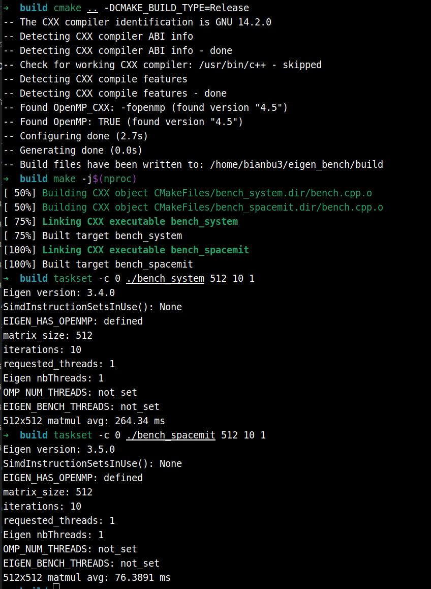
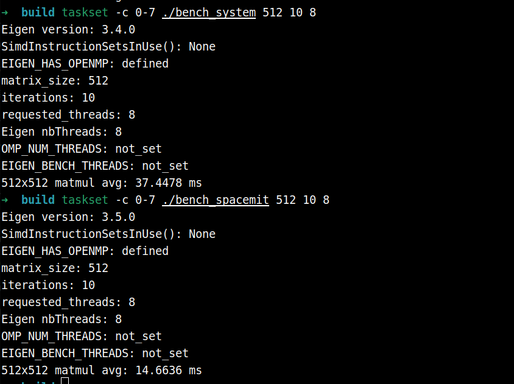
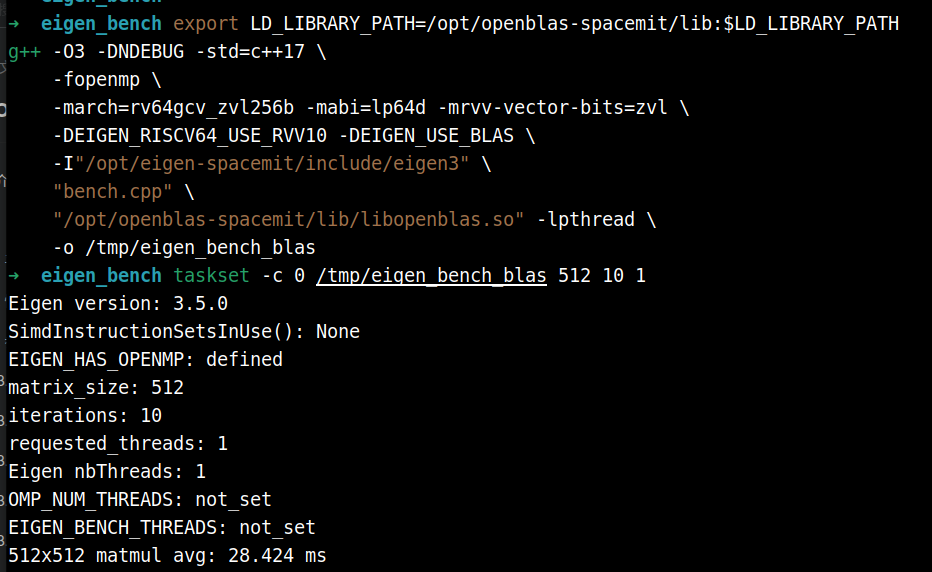
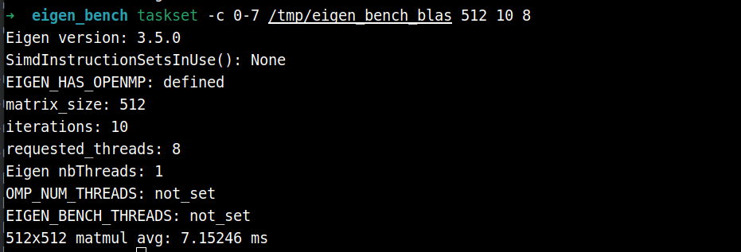

# Eigen RVV 使用

## Eigen 简介

[Eigen](https://eigen.tuxfamily.org) 是一个高性能的 C++ 模板库，专用于线性代数运算，涵盖矩阵、向量、数值求解及相关算法。它被广泛应用于机器人、计算机视觉、数值仿真等领域，是 ROS、OpenCV、PCL 等主流框架的核心依赖之一。

**主要特点：**

- **纯头文件**：无需编译，直接 `#include` 即可使用
- **高性能**：通过表达式模板（expression templates）消除临时变量，自动向量化（SIMD）
- **功能丰富**：支持稠密矩阵、稀疏矩阵、几何变换（旋转矩阵、四元数）、线性求解器等
- **跨平台**：支持 x86、ARM、RISC-V 等主流架构

## RVV 加速

RVV（RISC-V Vector Extension）是 RISC-V 架构的向量扩展指令集，可对矩阵运算进行 SIMD 加速。K1 搭载的 SpacemiT X60 8 核处理器原生支持 RVV 1.0（含 `zve64d`、`zvfh` 等向量子扩展）。

针对 K1 平台，我们提供了专为 RVV 优化的定制 Eigen 库 `eigen-spacemit`，相比系统默认的 Eigen 有显著差异：

| 对比项 | 系统 Eigen（`libeigen3-dev`） | eigen-spacemit |
|:-:|:-:|:-:|
| 安装路径 | `/usr/include/eigen3` | `/opt/eigen-spacemit` |
| RVV 加速 | 未启用 | 针对 RVV 1.0 优化 |
| 适用平台 | 通用（x86/ARM/RISC-V） | 专为 SpacemiT X60 定制 |
| 安装方式 | `apt install libeigen3-dev` | `apt install eigen-spacemit` |

在 k1 上进行高性能线性代数运算（如点云处理、SLAM、卡尔曼滤波）时，推荐优先使用 `eigen-spacemit` 以充分发挥 RVV 硬件能力。

## 使用示例

以下示例对比系统 libeigen3-dev 与 `eigen-spacemit` 在 512×512 矩阵乘法上的性能差异。

### 设置编译器

```
sudo apt install gfortran-14 gcc-14 g++-14
```

为了更好地适配 RVV ，建议使用 gcc 14 、gfortran-14

```
sudo update-alternatives --install /usr/bin/gcc gcc /usr/bin/gcc-14 100
sudo update-alternatives --install /usr/bin/g++ g++ /usr/bin/g++-14 100
sudo update-alternatives --set gcc /usr/bin/gcc-14
sudo update-alternatives --set g++ /usr/bin/g++-14

sudo update-alternatives --install /usr/bin/riscv64-linux-gnu-gcc riscv64-linux-gnu-gcc /usr/bin/riscv64-linux-gnu-gcc-14 100
sudo update-alternatives --install /usr/bin/riscv64-linux-gnu-g++ riscv64-linux-gnu-g++ /usr/bin/riscv64-linux-gnu-g++-14 100
sudo update-alternatives --set riscv64-linux-gnu-gcc /usr/bin/riscv64-linux-gnu-gcc-14
sudo update-alternatives --set riscv64-linux-gnu-g++ /usr/bin/riscv64-linux-gnu-g++-14
```

```
sudo update-alternatives --install /usr/bin/gfortran gfortran /usr/bin/gfortran-14 140
sudo update-alternatives --set gfortran /usr/bin/gfortran-14

sudo update-alternatives --install /usr/bin/riscv64-linux-gnu-gfortran riscv64-linux-gnu-gfortran /usr/bin/riscv64-linux-gnu-gfortran-14 140
sudo update-alternatives --set riscv64-linux-gnu-gfortran /usr/bin/riscv64-linux-gnu-gfortran-14
```

### **安装必要依赖**

```
sudo apt update
sudo apt install eigen-spacemit libeigen3-dev
```

### 测试代码

**目录结构：**

```
eigen_bench/
├── CMakeLists.txt
└── bench.cpp
```

**CMakeLists.txt：**

```cmake
cmake_minimum_required(VERSION 3.16)
project(eigen_bench LANGUAGES CXX)

# OpenMP 让 Eigen 支持的单个算子（主要是大矩阵乘法）可以使用多线程。
option(EIGEN_BENCH_ENABLE_OPENMP "Enable OpenMP so Eigen can parallelize supported operators" ON)

# RVV 编译参数用于 g++ 14 及以下；g++ 15 当前会跳过 -march/-mabi，避免不兼容。
set(RVV_MARCH "rv64gcv_zvl256b" CACHE STRING "RISC-V architecture flags for RVV builds")
set(RVV_MABI  "lp64d"           CACHE STRING "RISC-V ABI flags for RVV builds")

if(EIGEN_BENCH_ENABLE_OPENMP)
  find_package(OpenMP)
endif()

set(RVV_ARCH_FLAGS "")
if(CMAKE_CXX_COMPILER_ID STREQUAL "GNU")
  string(REGEX MATCH "^[0-9]+" GXX_MAJOR "${CMAKE_CXX_COMPILER_VERSION}")
  if(GXX_MAJOR VERSION_LESS_EQUAL "14")
    list(APPEND RVV_ARCH_FLAGS -march=${RVV_MARCH} -mabi=${RVV_MABI})
  endif()
endif()

# 统一创建 benchmark 目标：传入不同 Eigen include 路径即可对比不同实现。
function(add_bench target eigen_include)
  add_executable(${target} bench.cpp)
  target_include_directories(${target} PRIVATE "${eigen_include}")
  target_compile_options(${target} PRIVATE -O3 -DNDEBUG -std=c++17)
  if(EIGEN_BENCH_ENABLE_OPENMP AND OpenMP_CXX_FOUND)
    target_link_libraries(${target} PRIVATE OpenMP::OpenMP_CXX)
  endif()
endfunction()

# SpacemiT Eigen（RVV 加速）
add_bench(bench_spacemit /opt/eigen-spacemit/include/eigen3)
target_compile_options(bench_spacemit PRIVATE ${RVV_ARCH_FLAGS} -mrvv-vector-bits=zvl)
target_compile_definitions(bench_spacemit PRIVATE EIGEN_RISCV64_USE_RVV10)

# 系统 Eigen（无 RVV）
add_bench(bench_system /usr/include/eigen3)
```

**bench.cpp：**

```cpp
#include <Eigen/Dense>
#include <chrono>
#include <cstdlib>
#include <iostream>
#include <stdexcept>
#include <string>

namespace {

int parsePositiveInt(const char* value, const std::string& name) {
    const int parsed = std::stoi(value);
    if (parsed <= 0) {
        throw std::runtime_error(name + " must be positive");
    }
    return parsed;
}

std::string envOrUnset(const char* name) {
    const char* value = std::getenv(name);
    return value ? value : "not_set";
}

}  // namespace

int main(int argc, char** argv) {
    try {
    const int N = argc > 1 ? parsePositiveInt(argv[1], "matrix_size") : 512;
    const int iters = argc > 2 ? parsePositiveInt(argv[2], "iterations") : 10;
    const char* threads_env = std::getenv("EIGEN_BENCH_THREADS");
    const int threads = argc > 3 ? parsePositiveInt(argv[3], "threads") : (threads_env ? parsePositiveInt(threads_env, "EIGEN_BENCH_THREADS") : 8);
    Eigen::setNbThreads(threads);

    Eigen::MatrixXf A = Eigen::MatrixXf::Random(N, N);
    Eigen::MatrixXf B = Eigen::MatrixXf::Random(N, N);
    Eigen::MatrixXf C(N, N);

    C.noalias() = A * B; // warmup

    auto t0 = std::chrono::high_resolution_clock::now();
    for (int i = 0; i < iters; ++i)
        C.noalias() = A * B;
    auto t1 = std::chrono::high_resolution_clock::now();

    double ms = std::chrono::duration<double, std::milli>(t1 - t0).count() / iters;
    std::cout << "Eigen version: " << EIGEN_WORLD_VERSION << '.' << EIGEN_MAJOR_VERSION << '.' << EIGEN_MINOR_VERSION << '\n';
    std::cout << "SimdInstructionSetsInUse(): " << Eigen::SimdInstructionSetsInUse() << '\n';
#ifdef EIGEN_HAS_OPENMP
    std::cout << "EIGEN_HAS_OPENMP: defined\n";
#else
    std::cout << "EIGEN_HAS_OPENMP: not_defined\n";
#endif
    std::cout << "matrix_size: " << N << '\n';
    std::cout << "iterations: " << iters << '\n';
    std::cout << "requested_threads: " << threads << '\n';
    std::cout << "Eigen nbThreads: " << Eigen::nbThreads() << '\n';
    std::cout << "OMP_NUM_THREADS: " << envOrUnset("OMP_NUM_THREADS") << '\n';
    std::cout << "EIGEN_BENCH_THREADS: " << envOrUnset("EIGEN_BENCH_THREADS") << '\n';
    std::cout << N << "x" << N << " matmul avg: " << ms << " ms\n";
    return 0;
    } catch (const std::exception& error) {
        std::cerr << "error: " << error.what() << '\n';
        return 1;
    }
}
```

### **编译与运行：**

```bash
mkdir build && cd build
cmake .. -DCMAKE_BUILD_TYPE=Release
make -j$(nproc)

./bench_system    # 系统 Eigen
./bench_spacemit  # SpacemiT Eigen（RVV）
```

### **单核对比**



可以看出，RVV加速后的矩阵乘法性能有明显提升（264ms -> 76ms）

### **八核对比**




## 使用 openblas-spacemit 作为后端

Eigen 默认使用自身的模板实现完成矩阵运算，而 [OpenBLAS](https://www.openblas.net/) 是一个经过高度优化的 BLAS（Basic Linear Algebra Subprograms）数值库。通过在编译时添加 `-DEIGEN_USE_BLAS` 宏，Eigen 会将底层的矩阵乘法（`gemm`）等关键运算委托给 OpenBLAS 执行，从而利用其针对特定硬件深度调优的实现。

`openblas-spacemit` 是专为 SpacemiT k1 平台定制的 OpenBLAS 版本，充分利用了 RVV 1.0 向量扩展及平台特性。与单独使用 `eigen-spacemit`（RVV 向量化）相比，通过 `openblas-spacemit` 后端可以进一步将大规模矩阵乘法性能提升。

### **安装必要依赖**

```
sudo apt install openblas-spacemit
```

### **编译与运行**

仍使用上一节的bench.cpp

```
export LD_LIBRARY_PATH=/opt/openblas-spacemit/lib:$LD_LIBRARY_PATH
g++ -O3 -DNDEBUG -std=c++17 \
    -fopenmp \
    -march=rv64gcv_zvl256b -mabi=lp64d -mrvv-vector-bits=zvl \
    -DEIGEN_RISCV64_USE_RVV10 -DEIGEN_USE_BLAS \
    -I"/opt/eigen-spacemit/include/eigen3" \
    "bench.cpp" \
    "/opt/openblas-spacemit/lib/libopenblas.so" -lpthread \
    -o /tmp/eigen_bench_blas
```

```
/tmp/eigen_bench_blas
```

### **单核性能：**



使用 openblas-spacemit 作为 eigen 后端，矩阵乘法的性能还有进一步的提升（76ms -> 28 ms）

### **八核性能：**




## 更多性能测试数据

**多核测试说明**

- 多核测试编译需要 `target_link_libraries(${target_name} PRIVATE OpenMP::OpenMP_CXX)`
- 多核测试代码需要 `Eigen::setNbThreads(threads)`，`threads` 建议与测试时限制的核数一致
- 以下测试 `threads` 与核数均取一致

## eigen-spacemit VS libeigen3-dev

- 使用 taskset -c 限制核数
- 计时策略是跑 50 次取平均值，预热10次
- no_rvv_avg_ms 表示的是系统 libeigen3-dev 包的表现
- rvv_avg_ms 表示的是 eigen-spacemit 包的表现

### **单核对比**

taskset -c 0

threads：1


| module | function | api | dtype | input_size | output_size | no_rvv avg_ms | rvv avg_ms | no_rvv avg_gflops | rvv avg_gflops | speedup | improvement |
| :-: | :-: | :-: | :-: | :-: | :-: | :-: | :-: | :-: | :-: | :-: | :-: |
| array | vector_add_scalar | a + scalar | float32 | 262144x1 | 262144x1 | 1.0329 | 0.5768 | 0.2538 | 0.4545 | 1.79x | 79.07% |
| array | vector_add_scalar | a + scalar | float64 | 262144x1 | 262144x1 | 1.5756 | 1.1078 | 0.1664 | 0.2366 | 1.42x | 42.23% |
| array | vector_sub_scalar | a - scalar | float32 | 262144x1 | 262144x1 | 1.0325 | 0.5539 | 0.2539 | 0.4733 | 1.86x | 86.41% |
| array | vector_sub_scalar | a - scalar | float64 | 262144x1 | 262144x1 | 1.5933 | 1.0997 | 0.1645 | 0.2384 | 1.45x | 44.88% |
| array | vector_mul_scalar | a * scalar | float32 | 262144x1 | 262144x1 | 1.0323 | 0.5768 | 0.2539 | 0.4545 | 1.79x | 78.97% |
| array | vector_mul_scalar | a * scalar | float64 | 262144x1 | 262144x1 | 1.5829 | 1.1056 | 0.1656 | 0.2371 | 1.43x | 43.17% |
| array | vector_div_scalar | a / scalar | float32 | 262144x1 | 262144x1 | 1.4937 | 0.9948 | 0.1755 | 0.2635 | 1.50x | 50.15% |
| array | vector_div_scalar | a / scalar | float64 | 262144x1 | 262144x1 | 2.5495 | 2.0471 | 0.1028 | 0.1281 | 1.25x | 24.54% |
| array | vector_add_vector | a + b | float32 | 262144x1 | 262144x1 | 1.4650 | 0.9827 | 0.1789 | 0.2668 | 1.49x | 49.08% |
| array | vector_add_vector | a + b | float64 | 262144x1 | 262144x1 | 2.4667 | 1.9824 | 0.1063 | 0.1322 | 1.24x | 24.43% |
| array | vector_sub_vector | a - b | float32 | 262144x1 | 262144x1 | 1.4614 | 0.9734 | 0.1794 | 0.2693 | 1.50x | 50.13% |
| array | vector_sub_vector | a - b | float64 | 262144x1 | 262144x1 | 2.4775 | 1.9952 | 0.1058 | 0.1314 | 1.24x | 24.17% |
| array | vector_mul_vector | a * b | float32 | 262144x1 | 262144x1 | 1.4597 | 0.9895 | 0.1796 | 0.2649 | 1.48x | 47.52% |
| array | vector_mul_vector | a * b | float64 | 262144x1 | 262144x1 | 2.5418 | 1.9989 | 0.1031 | 0.1311 | 1.27x | 27.16% |
| array | vector_div_vector | a / (b + scalar) | float32 | 262144x1 | 262144x1 | 1.5838 | 1.0831 | 0.3310 | 0.4841 | 1.46x | 46.23% |
| array | vector_div_vector | a / (b + scalar) | float64 | 262144x1 | 262144x1 | 2.7555 | 2.2651 | 0.1903 | 0.2315 | 1.22x | 21.65% |
| array | vector_fma | a * b + c | float32 | 262144x1 | 262144x1 | 2.0214 | 1.2667 | 0.2594 | 0.4139 | 1.60x | 59.58% |
| array | vector_fma | a * b + c | float64 | 262144x1 | 262144x1 | 3.7769 | 2.6751 | 0.1388 | 0.1960 | 1.41x | 41.19% |
| array | vector_sqrt | (a + scalar).sqrt() | float32 | 262144x1 | 262144x1 | 7.3947 | 1.0472 | 0.0709 | 0.5007 | 7.06x | 606.14% |
| array | vector_sqrt | (a + scalar).sqrt() | float64 | 262144x1 | 262144x1 | 9.1064 | 2.1781 | 0.0576 | 0.2407 | 4.18x | 318.09% |
| array | vector_exp | exp(a * scalar) | float32 | 262144x1 | 262144x1 | 11.4518 | 3.7500 | 0.0458 | 0.1398 | 3.05x | 205.38% |
| array | vector_exp | exp(a * scalar) | float64 | 262144x1 | 262144x1 | 13.5589 | 9.0664 | 0.0387 | 0.0578 | 1.50x | 49.55% |
| array | vector_log | log(a + scalar) | float32 | 262144x1 | 262144x1 | 10.4218 | 3.7202 | 0.0503 | 0.1409 | 2.80x | 180.14% |
| array | vector_log | log(a + scalar) | float64 | 262144x1 | 262144x1 | 13.2271 | 8.8136 | 0.0396 | 0.0595 | 1.50x | 50.08% |
| array | vector_sin | sin(a) | float32 | 262144x1 | 262144x1 | 10.4582 | 3.6639 | 0.0251 | 0.0715 | 2.85x | 185.44% |
| array | vector_sin | sin(a) | float64 | 262144x1 | 262144x1 | 19.9281 | 19.5490 | 0.0132 | 0.0134 | 1.02x | 1.94% |
| array | vector_cos | cos(a) | float32 | 262144x1 | 262144x1 | 9.1451 | 3.6133 | 0.0287 | 0.0726 | 2.53x | 153.10% |
| array | vector_cos | cos(a) | float64 | 262144x1 | 262144x1 | 18.7050 | 18.2835 | 0.0140 | 0.0143 | 1.02x | 2.31% |
| array | vector_tanh | tanh(a * scalar) | float32 | 262144x1 | 262144x1 | 12.4055 | 2.3477 | 0.0423 | 0.2233 | 5.28x | 428.41% |
| array | vector_tanh | tanh(a * scalar) | float64 | 262144x1 | 262144x1 | 30.0913 | 29.7194 | 0.0174 | 0.0176 | 1.01x | 1.25% |
| array | vector_abs | abs(a - scalar) | float32 | 262144x1 | 262144x1 | 1.1021 | 0.5599 | 0.2379 | 0.4682 | 1.97x | 96.84% |
| array | vector_abs | abs(a - scalar) | float64 | 262144x1 | 262144x1 | 1.6946 | 1.1736 | 0.1547 | 0.2234 | 1.44x | 44.39% |
| array | vector_min | min(a, b) | float32 | 262144x1 | 262144x1 | 1.6618 | 0.9947 | 0.1578 | 0.2635 | 1.67x | 67.07% |
| array | vector_min | min(a, b) | float64 | 262144x1 | 262144x1 | 2.7908 | 2.0105 | 0.0939 | 0.1304 | 1.39x | 38.81% |
| array | vector_max | max(a, b) | float32 | 262144x1 | 262144x1 | 1.6366 | 0.9770 | 0.1602 | 0.2683 | 1.68x | 67.51% |
| array | vector_max | max(a, b) | float64 | 262144x1 | 262144x1 | 2.8612 | 2.0045 | 0.0916 | 0.1308 | 1.43x | 42.74% |
| array | vector_clamp | cwiseMax + cwiseMin | float32 | 262144x1 | 262144x1 | 2.9871 | 0.7279 | 0.1755 | 0.7203 | 4.10x | 310.37% |
| array | vector_clamp | cwiseMax + cwiseMin | float64 | 262144x1 | 262144x1 | 3.1686 | 1.4722 | 0.1655 | 0.3561 | 2.15x | 115.23% |
| array | vector_select | mask.select(a, b) | float32 | 262144x1 | 262144x1 | 1.3196 | 0.9793 | 0.1987 | 0.2677 | 1.35x | 34.75% |
| array | vector_select | mask.select(a, b) | float64 | 262144x1 | 262144x1 | 2.1670 | 2.0130 | 0.1210 | 0.1302 | 1.08x | 7.65% |
| array | vector_sum | sum() | float32 | 262144x1 | 1x1 | 0.6438 | 0.1515 | 0.4072 | 1.7298 | 4.25x | 324.95% |
| array | vector_sum | sum() | float64 | 262144x1 | 1x1 | 0.7899 | 0.2843 | 0.3319 | 0.9220 | 2.78x | 177.84% |
| array | vector_dot | dot() | float32 | 262144x1 | 1x1 | 0.7060 | 0.4106 | 0.7427 | 1.2769 | 1.72x | 71.94% |
| array | vector_dot | dot() | float64 | 262144x1 | 1x1 | 0.9708 | 0.8874 | 0.5401 | 0.5908 | 1.09x | 9.40% |
| array | vector_norm | norm() | float32 | 262144x1 | 1x1 | 0.6660 | 0.1523 | 0.7872 | 3.4431 | 4.37x | 337.29% |
| array | vector_norm | norm() | float64 | 262144x1 | 1x1 | 0.8788 | 0.3084 | 0.5966 | 1.7002 | 2.85x | 184.95% |
| array | vector_normalize | normalize() | float32 | 262144x1 | 262144x1 | 2.5135 | 1.6421 | 0.3129 | 0.4789 | 1.53x | 53.07% |
| array | vector_normalize | normalize() | float64 | 262144x1 | 262144x1 | 4.1888 | 3.2712 | 0.1877 | 0.2404 | 1.28x | 28.05% |
| array | vector_segment | segment() | float32 | 262144x1 | 131072x1 | 0.5063 | 0.2792 | 0.0000 | 0.0000 | 1.81x | 81.34% |
| array | vector_segment | segment() | float64 | 262144x1 | 131072x1 | 0.7655 | 0.5436 | 0.0000 | 0.0000 | 1.41x | 40.82% |
| geometry | vector_cross | cross() | float32 | 3x1 | 3x1 | 0.0001 | 0.0001 | 0.0771 | 0.0850 | 1.00x | 0.00% |
| geometry | vector_cross | cross() | float64 | 3x1 | 3x1 | 0.0001 | 0.0001 | 0.0837 | 0.0794 | 1.00x | 0.00% |
| geometry | quaternion_to_rotation_matrix | Quaternion::toRotationMatrix() | float32 | 3x1 | 3x3 | 0.0001 | 0.0001 | 0.2436 | 0.2037 | 1.00x | 0.00% |
| geometry | quaternion_to_rotation_matrix | Quaternion::toRotationMatrix() | float64 | 3x1 | 3x3 | 0.0001 | 0.0001 | 0.2315 | 0.2013 | 1.00x | 0.00% |
| geometry | quaternion_inverse | Quaternion::inverse() | float32 | 3x1 | 3x1 | 0.0001 | 0.0001 | 0.0706 | 0.0706 | 1.00x | 0.00% |
| geometry | quaternion_inverse | Quaternion::inverse() | float64 | 3x1 | 3x1 | 0.0002 | 0.0002 | 0.0590 | 0.0649 | 1.00x | 0.00% |
| geometry | quaternion_normalize | Quaternion::normalize() | float32 | 3x1 | 3x1 | 0.0001 | 0.0001 | 0.0823 | 0.0813 | 1.00x | 0.00% |
| geometry | quaternion_normalize | Quaternion::normalize() | float64 | 3x1 | 3x1 | 0.0002 | 0.0002 | 0.0702 | 0.0770 | 1.00x | 0.00% |
| matrix | matrix_add | A + B | float32 | 512x512 | 512x512 | 1.4574 | 0.9821 | 0.1799 | 0.2669 | 1.48x | 48.40% |
| matrix | matrix_add | A + B | float64 | 512x512 | 512x512 | 2.5876 | 2.0104 | 0.1013 | 0.1304 | 1.29x | 28.71% |
| matrix | matrix_sub | A - B | float32 | 512x512 | 512x512 | 1.4607 | 0.9762 | 0.1795 | 0.2685 | 1.50x | 49.63% |
| matrix | matrix_sub | A - B | float64 | 512x512 | 512x512 | 2.4803 | 2.0164 | 0.1057 | 0.1300 | 1.23x | 23.01% |
| matrix | matrix_cwise_product | cwiseProduct | float32 | 512x512 | 512x512 | 1.4554 | 0.9795 | 0.1801 | 0.2676 | 1.49x | 48.59% |
| matrix | matrix_cwise_product | cwiseProduct | float64 | 512x512 | 512x512 | 2.4785 | 2.0189 | 0.1058 | 0.1298 | 1.23x | 22.76% |
| matrix | matrix_transpose | transpose() | float32 | 512x512 | 512x512 | 12.5213 | 11.8165 | 0.0000 | 0.0000 | 1.06x | 5.96% |
| matrix | matrix_transpose | transpose() | float64 | 512x512 | 512x512 | 56.5780 | 56.3339 | 0.0000 | 0.0000 | 1.00x | 0.43% |
| matrix | matrix_inverse | inverse() | float32 | 512x512 | 512x512 | 702.7235 | 212.2859 | 0.3820 | 1.2645 | 3.31x | 231.03% |
| matrix | matrix_inverse | inverse() | float64 | 512x512 | 512x512 | 1149.1500 | 508.0213 | 0.2336 | 0.5284 | 2.26x | 126.20% |
| matrix | matrix_block | block() | float32 | 512x512 | 256x256 | 0.3507 | 0.2380 | 0.0000 | 0.0000 | 1.47x | 47.35% |
| matrix | matrix_block | block() | float64 | 512x512 | 256x256 | 0.9458 | 1.0499 | 0.0000 | 0.0000 | 0.90x | -9.92% |
| matrix | matrix_identity | Identity() | float32 | 1x1 | 512x512 | 1.6488 | 1.2747 | 0.0000 | 0.0000 | 1.29x | 29.35% |
| matrix | matrix_identity | Identity() | float64 | 1x1 | 512x512 | 1.7535 | 1.3150 | 0.0000 | 0.0000 | 1.33x | 33.35% |
| matrix | matrix_zero | Zero() | float32 | 1x1 | 512x512 | 0.7538 | 0.3602 | 0.0000 | 0.0000 | 2.09x | 109.27% |
| matrix | matrix_zero | Zero() | float64 | 1x1 | 512x512 | 1.1285 | 0.6621 | 0.0000 | 0.0000 | 1.70x | 70.44% |
| matrix | matrix_determinant | determinant() | float32 | 512x512 | 1x1 | 185.1969 | 50.1470 | 0.4832 | 1.7843 | 3.69x | 269.31% |
| matrix | matrix_determinant | determinant() | float64 | 512x512 | 1x1 | 328.8518 | 136.8319 | 0.2721 | 0.6539 | 2.40x | 140.33% |
| matrix | matrix_trace | trace() | float32 | 512x512 | 1x1 | 0.0041 | 0.0022 | 0.1249 | 0.2337 | 1.86x | 86.36% |
| matrix | matrix_trace | trace() | float64 | 512x512 | 1x1 | 0.0028 | 0.0029 | 0.1828 | 0.1780 | 0.97x | -3.45% |
| matrix | matrix_colwise_sum | colwise().sum() | float32 | 512x512 | 1x512 | 0.6609 | 0.1561 | 0.3959 | 1.6756 | 4.23x | 323.38% |
| matrix | matrix_colwise_sum | colwise().sum() | float64 | 512x512 | 1x512 | 0.7979 | 0.3035 | 0.3279 | 0.8620 | 2.63x | 162.90% |
| matrix | matrix_rowwise_sum | rowwise().sum() | float32 | 512x512 | 512x1 | 16.3880 | 1.5413 | 0.0160 | 0.1697 | 10.63x | 963.26% |
| matrix | matrix_rowwise_sum | rowwise().sum() | float64 | 512x512 | 512x1 | 54.2047 | 13.7245 | 0.0048 | 0.0191 | 3.95x | 294.95% |
| matrix | matrix_gemv | A * x | float32 | 512x512 | 512x1 | 2.6389 | 0.5287 | 0.1985 | 0.9907 | 4.99x | 399.13% |
| matrix | matrix_gemv | A * x | float64 | 512x512 | 512x1 | 6.2727 | 1.8393 | 0.0835 | 0.2848 | 3.41x | 241.04% |
| matrix | matrix_matmul | A * B | float32 | 512x512 | 512x512 | 245.8450 | 75.2698 | 1.0908 | 3.5628 | 3.27x | 226.62% |
| matrix | matrix_matmul | A * B | float64 | 512x512 | 512x512 | 442.0777 | 181.7320 | 0.6066 | 1.4757 | 2.43x | 143.26% |
| matrix | matrix_ldlt_solve | LDLT::solve(x) | float32 | 512x512 | 512x1 | 1.1049 | 0.8561 | 0.4745 | 0.6124 | 1.29x | 29.06% |
| matrix | matrix_ldlt_solve | LDLT::solve(x) | float64 | 512x512 | 512x1 | 4.2050 | 3.6982 | 0.1247 | 0.1418 | 1.14x | 13.70% |
| matrix | matrix_llt_solve | LLT::solve(x) | float32 | 512x512 | 512x1 | 1.2534 | 0.7436 | 0.4183 | 0.7051 | 1.69x | 68.56% |
| matrix | matrix_llt_solve | LLT::solve(x) | float64 | 512x512 | 512x1 | 5.1823 | 3.1527 | 0.1012 | 0.1663 | 1.64x | 64.38% |

### **四核对比**

taskset -c 0-3

threads：4


| module | function | api | dtype | input_size | output_size | no_rvv avg_ms | rvv avg_ms | no_rvv avg_gflops | rvv avg_gflops | speedup | improvement |
| :-: | :-: | :-: | :-: | :-: | :-: | :-: | :-: | :-: | :-: | :-: | :-: |
| array | vector_add_scalar | a + scalar | float32 | 262144x1 | 262144x1 | 1.0290 | 0.5590 | 0.2548 | 0.4690 | 1.84x | 84.08% |
| array | vector_add_scalar | a + scalar | float64 | 262144x1 | 262144x1 | 1.5832 | 1.0842 | 0.1656 | 0.2418 | 1.46x | 46.02% |
| array | vector_sub_scalar | a - scalar | float32 | 262144x1 | 262144x1 | 1.0293 | 0.5482 | 0.2547 | 0.4781 | 1.88x | 87.76% |
| array | vector_sub_scalar | a - scalar | float64 | 262144x1 | 262144x1 | 1.5838 | 1.0518 | 0.1655 | 0.2492 | 1.51x | 50.58% |
| array | vector_mul_scalar | a * scalar | float32 | 262144x1 | 262144x1 | 1.0329 | 0.5510 | 0.2538 | 0.4757 | 1.87x | 87.46% |
| array | vector_mul_scalar | a * scalar | float64 | 262144x1 | 262144x1 | 1.5868 | 1.0446 | 0.1652 | 0.2509 | 1.52x | 51.91% |
| array | vector_div_scalar | a / scalar | float32 | 262144x1 | 262144x1 | 1.4793 | 0.9868 | 0.1772 | 0.2656 | 1.50x | 49.91% |
| array | vector_div_scalar | a / scalar | float64 | 262144x1 | 262144x1 | 2.5443 | 2.0503 | 0.1030 | 0.1279 | 1.24x | 24.09% |
| array | vector_add_vector | a + b | float32 | 262144x1 | 262144x1 | 1.4598 | 0.9649 | 0.1796 | 0.2717 | 1.51x | 51.29% |
| array | vector_add_vector | a + b | float64 | 262144x1 | 262144x1 | 2.5876 | 1.9267 | 0.1013 | 0.1361 | 1.34x | 34.30% |
| array | vector_sub_vector | a - b | float32 | 262144x1 | 262144x1 | 1.4567 | 0.9637 | 0.1800 | 0.2720 | 1.51x | 51.16% |
| array | vector_sub_vector | a - b | float64 | 262144x1 | 262144x1 | 2.5994 | 1.9387 | 0.1008 | 0.1352 | 1.34x | 34.08% |
| array | vector_mul_vector | a * b | float32 | 262144x1 | 262144x1 | 1.4567 | 0.9714 | 0.1800 | 0.2699 | 1.50x | 49.96% |
| array | vector_mul_vector | a * b | float64 | 262144x1 | 262144x1 | 2.5568 | 1.9327 | 0.1025 | 0.1356 | 1.32x | 32.29% |
| array | vector_div_vector | a / (b + scalar) | float32 | 262144x1 | 262144x1 | 1.5722 | 1.0715 | 0.3335 | 0.4893 | 1.47x | 46.73% |
| array | vector_div_vector | a / (b + scalar) | float64 | 262144x1 | 262144x1 | 2.7292 | 2.2879 | 0.1921 | 0.2292 | 1.19x | 19.29% |
| array | vector_fma | a * b + c | float32 | 262144x1 | 262144x1 | 2.0363 | 1.2557 | 0.2575 | 0.4175 | 1.62x | 62.16% |
| array | vector_fma | a * b + c | float64 | 262144x1 | 262144x1 | 4.7672 | 2.5773 | 0.1100 | 0.2034 | 1.85x | 84.97% |
| array | vector_sqrt | (a + scalar).sqrt() | float32 | 262144x1 | 262144x1 | 7.4324 | 1.0467 | 0.0705 | 0.5009 | 7.10x | 610.08% |
| array | vector_sqrt | (a + scalar).sqrt() | float64 | 262144x1 | 262144x1 | 9.1247 | 2.1691 | 0.0575 | 0.2417 | 4.21x | 320.67% |
| array | vector_exp | exp(a * scalar) | float32 | 262144x1 | 262144x1 | 11.3133 | 3.7304 | 0.0463 | 0.1405 | 3.03x | 203.27% |
| array | vector_exp | exp(a * scalar) | float64 | 262144x1 | 262144x1 | 13.5662 | 9.0862 | 0.0386 | 0.0577 | 1.49x | 49.31% |
| array | vector_log | log(a + scalar) | float32 | 262144x1 | 262144x1 | 10.3932 | 3.7439 | 0.0504 | 0.1400 | 2.78x | 177.60% |
| array | vector_log | log(a + scalar) | float64 | 262144x1 | 262144x1 | 13.1619 | 8.7265 | 0.0398 | 0.0601 | 1.51x | 50.83% |
| array | vector_sin | sin(a) | float32 | 262144x1 | 262144x1 | 10.2494 | 3.5812 | 0.0256 | 0.0732 | 2.86x | 186.20% |
| array | vector_sin | sin(a) | float64 | 262144x1 | 262144x1 | 19.9568 | 19.6124 | 0.0131 | 0.0134 | 1.02x | 1.76% |
| array | vector_cos | cos(a) | float32 | 262144x1 | 262144x1 | 9.1432 | 3.5913 | 0.0287 | 0.0730 | 2.55x | 154.59% |
| array | vector_cos | cos(a) | float64 | 262144x1 | 262144x1 | 18.6205 | 18.2853 | 0.0141 | 0.0143 | 1.02x | 1.83% |
| array | vector_tanh | tanh(a * scalar) | float32 | 262144x1 | 262144x1 | 12.3840 | 2.3484 | 0.0423 | 0.2232 | 5.27x | 427.34% |
| array | vector_tanh | tanh(a * scalar) | float64 | 262144x1 | 262144x1 | 29.9670 | 29.7071 | 0.0175 | 0.0176 | 1.01x | 0.87% |
| array | vector_abs | abs(a - scalar) | float32 | 262144x1 | 262144x1 | 1.0921 | 0.5488 | 0.2400 | 0.4776 | 1.99x | 99.00% |
| array | vector_abs | abs(a - scalar) | float64 | 262144x1 | 262144x1 | 1.6105 | 1.0531 | 0.1628 | 0.2489 | 1.53x | 52.93% |
| array | vector_min | min(a, b) | float32 | 262144x1 | 262144x1 | 1.6411 | 0.9760 | 0.1597 | 0.2686 | 1.68x | 68.15% |
| array | vector_min | min(a, b) | float64 | 262144x1 | 262144x1 | 2.4733 | 1.9246 | 0.1060 | 0.1362 | 1.29x | 28.51% |
| array | vector_max | max(a, b) | float32 | 262144x1 | 262144x1 | 1.6454 | 0.9690 | 0.1593 | 0.2705 | 1.70x | 69.80% |
| array | vector_max | max(a, b) | float64 | 262144x1 | 262144x1 | 2.4683 | 1.9178 | 0.1062 | 0.1367 | 1.29x | 28.70% |
| array | vector_clamp | cwiseMax + cwiseMin | float32 | 262144x1 | 262144x1 | 2.9780 | 0.7239 | 0.1761 | 0.7242 | 4.11x | 311.38% |
| array | vector_clamp | cwiseMax + cwiseMin | float64 | 262144x1 | 262144x1 | 3.1682 | 1.4516 | 0.1655 | 0.3612 | 2.18x | 118.26% |
| array | vector_select | mask.select(a, b) | float32 | 262144x1 | 262144x1 | 1.3431 | 0.9726 | 0.1952 | 0.2695 | 1.38x | 38.09% |
| array | vector_select | mask.select(a, b) | float64 | 262144x1 | 262144x1 | 2.1918 | 1.9342 | 0.1196 | 0.1355 | 1.13x | 13.32% |
| array | vector_sum | sum() | float32 | 262144x1 | 1x1 | 0.6447 | 0.1435 | 0.4066 | 1.8270 | 4.49x | 349.27% |
| array | vector_sum | sum() | float64 | 262144x1 | 1x1 | 0.7904 | 0.2838 | 0.3316 | 0.9236 | 2.79x | 178.51% |
| array | vector_dot | dot() | float32 | 262144x1 | 1x1 | 0.7055 | 0.4261 | 0.7432 | 1.2305 | 1.66x | 65.57% |
| array | vector_dot | dot() | float64 | 262144x1 | 1x1 | 0.9590 | 0.8463 | 0.5467 | 0.6195 | 1.13x | 13.32% |
| array | vector_norm | norm() | float32 | 262144x1 | 1x1 | 0.6671 | 0.1529 | 0.7859 | 3.4293 | 4.36x | 336.30% |
| array | vector_norm | norm() | float64 | 262144x1 | 1x1 | 0.8720 | 0.3214 | 0.6012 | 1.6312 | 2.71x | 171.31% |
| array | vector_normalize | normalize() | float32 | 262144x1 | 262144x1 | 2.5131 | 1.6348 | 0.3129 | 0.4811 | 1.54x | 53.73% |
| array | vector_normalize | normalize() | float64 | 262144x1 | 262144x1 | 4.1634 | 3.2424 | 0.1889 | 0.2425 | 1.28x | 28.40% |
| array | vector_segment | segment() | float32 | 262144x1 | 131072x1 | 0.5029 | 0.2794 | 0.0000 | 0.0000 | 1.80x | 79.99% |
| array | vector_segment | segment() | float64 | 262144x1 | 131072x1 | 0.7615 | 0.5569 | 0.0000 | 0.0000 | 1.37x | 36.74% |
| geometry | vector_cross | cross() | float32 | 3x1 | 3x1 | 0.0001 | 0.0001 | 0.0831 | 0.0789 | 1.00x | 0.00% |
| geometry | vector_cross | cross() | float64 | 3x1 | 3x1 | 0.0001 | 0.0001 | 0.0837 | 0.0783 | 1.00x | 0.00% |
| geometry | quaternion_to_rotation_matrix | Quaternion::toRotationMatrix() | float32 | 3x1 | 3x3 | 0.0001 | 0.0001 | 0.2400 | 0.2000 | 1.00x | 0.00% |
| geometry | quaternion_to_rotation_matrix | Quaternion::toRotationMatrix() | float64 | 3x1 | 3x3 | 0.0001 | 0.0001 | 0.2454 | 0.2025 | 1.00x | 0.00% |
| geometry | quaternion_inverse | Quaternion::inverse() | float32 | 3x1 | 3x1 | 0.0001 | 0.0001 | 0.0718 | 0.0723 | 1.00x | 0.00% |
| geometry | quaternion_inverse | Quaternion::inverse() | float64 | 3x1 | 3x1 | 0.0002 | 0.0002 | 0.0645 | 0.0638 | 1.00x | 0.00% |
| geometry | quaternion_normalize | Quaternion::normalize() | float32 | 3x1 | 3x1 | 0.0001 | 0.0001 | 0.0832 | 0.0813 | 1.00x | 0.00% |
| geometry | quaternion_normalize | Quaternion::normalize() | float64 | 3x1 | 3x1 | 0.0002 | 0.0002 | 0.0702 | 0.0787 | 1.00x | 0.00% |
| matrix | matrix_add | A + B | float32 | 512x512 | 512x512 | 1.4646 | 0.9797 | 0.1790 | 0.2676 | 1.49x | 49.49% |
| matrix | matrix_add | A + B | float64 | 512x512 | 512x512 | 2.5941 | 1.9628 | 0.1011 | 0.1336 | 1.32x | 32.16% |
| matrix | matrix_sub | A - B | float32 | 512x512 | 512x512 | 1.4628 | 0.9826 | 0.1792 | 0.2668 | 1.49x | 48.87% |
| matrix | matrix_sub | A - B | float64 | 512x512 | 512x512 | 2.5937 | 2.0512 | 0.1011 | 0.1278 | 1.26x | 26.45% |
| matrix | matrix_cwise_product | cwiseProduct | float32 | 512x512 | 512x512 | 1.4631 | 0.9844 | 0.1792 | 0.2663 | 1.49x | 48.63% |
| matrix | matrix_cwise_product | cwiseProduct | float64 | 512x512 | 512x512 | 2.5663 | 1.9382 | 0.1021 | 0.1352 | 1.32x | 32.41% |
| matrix | matrix_transpose | transpose() | float32 | 512x512 | 512x512 | 12.6483 | 12.6536 | 0.0000 | 0.0000 | 1.00x | -0.04% |
| matrix | matrix_transpose | transpose() | float64 | 512x512 | 512x512 | 56.4375 | 56.5294 | 0.0000 | 0.0000 | 1.00x | -0.16% |
| matrix | matrix_inverse | inverse() | float32 | 512x512 | 512x512 | 611.5735 | 201.7677 | 0.4389 | 1.3304 | 3.03x | 203.11% |
| matrix | matrix_inverse | inverse() | float64 | 512x512 | 512x512 | 963.2164 | 462.9471 | 0.2787 | 0.5798 | 2.08x | 108.06% |
| matrix | matrix_block | block() | float32 | 512x512 | 256x256 | 0.3744 | 0.2510 | 0.0000 | 0.0000 | 1.49x | 49.16% |
| matrix | matrix_block | block() | float64 | 512x512 | 256x256 | 0.8561 | 1.0500 | 0.0000 | 0.0000 | 0.82x | -18.47% |
| matrix | matrix_identity | Identity() | float32 | 1x1 | 512x512 | 1.6484 | 1.2740 | 0.0000 | 0.0000 | 1.29x | 29.39% |
| matrix | matrix_identity | Identity() | float64 | 1x1 | 512x512 | 1.7434 | 1.3111 | 0.0000 | 0.0000 | 1.33x | 32.97% |
| matrix | matrix_zero | Zero() | float32 | 1x1 | 512x512 | 0.7512 | 0.3685 | 0.0000 | 0.0000 | 2.04x | 103.85% |
| matrix | matrix_zero | Zero() | float64 | 1x1 | 512x512 | 1.1164 | 0.6735 | 0.0000 | 0.0000 | 1.66x | 65.76% |
| matrix | matrix_determinant | determinant() | float32 | 512x512 | 1x1 | 102.2245 | 43.6361 | 0.8753 | 2.0506 | 2.34x | 134.27% |
| matrix | matrix_determinant | determinant() | float64 | 512x512 | 1x1 | 160.1561 | 102.4355 | 0.5587 | 0.8735 | 1.56x | 56.35% |
| matrix | matrix_trace | trace() | float32 | 512x512 | 1x1 | 0.0022 | 0.0023 | 0.2287 | 0.2266 | 0.96x | -4.35% |
| matrix | matrix_trace | trace() | float64 | 512x512 | 1x1 | 0.0028 | 0.0028 | 0.1830 | 0.1796 | 1.00x | 0.00% |
| matrix | matrix_colwise_sum | colwise().sum() | float32 | 512x512 | 1x512 | 0.6493 | 0.1560 | 0.4029 | 1.6767 | 4.16x | 316.22% |
| matrix | matrix_colwise_sum | colwise().sum() | float64 | 512x512 | 1x512 | 0.7990 | 0.3018 | 0.3275 | 0.8668 | 2.65x | 164.74% |
| matrix | matrix_rowwise_sum | rowwise().sum() | float32 | 512x512 | 512x1 | 11.7119 | 6.3493 | 0.0223 | 0.0412 | 1.84x | 84.46% |
| matrix | matrix_rowwise_sum | rowwise().sum() | float64 | 512x512 | 512x1 | 54.4487 | 13.7211 | 0.0048 | 0.0191 | 3.97x | 296.82% |
| matrix | matrix_gemv | A * x | float32 | 512x512 | 512x1 | 2.6224 | 0.5245 | 0.1997 | 0.9985 | 5.00x | 399.98% |
| matrix | matrix_gemv | A * x | float64 | 512x512 | 512x1 | 6.2919 | 1.9716 | 0.0832 | 0.2657 | 3.19x | 219.13% |
| matrix | matrix_matmul | A * B | float32 | 512x512 | 512x512 | 71.5122 | 20.2149 | 3.7500 | 13.2661 | 3.54x | 253.76% |
| matrix | matrix_matmul | A * B | float64 | 512x512 | 512x512 | 112.5959 | 48.8329 | 2.3817 | 5.4917 | 2.31x | 130.57% |
| matrix | matrix_ldlt_solve | LDLT::solve(x) | float32 | 512x512 | 512x1 | 1.0880 | 0.7337 | 0.4819 | 0.7145 | 1.48x | 48.29% |
| matrix | matrix_ldlt_solve | LDLT::solve(x) | float64 | 512x512 | 512x1 | 4.1370 | 3.1382 | 0.1267 | 0.1671 | 1.32x | 31.83% |
| matrix | matrix_llt_solve | LLT::solve(x) | float32 | 512x512 | 512x1 | 1.2268 | 0.8761 | 0.4273 | 0.5984 | 1.40x | 40.03% |
| matrix | matrix_llt_solve | LLT::solve(x) | float64 | 512x512 | 512x1 | 5.5755 | 3.5649 | 0.0940 | 0.1471 | 1.56x | 56.40% |

### 八核对比

taskset -c 0-7

threads：8


| module | function | api | dtype | input_size | output_size | no_rvv avg_ms | rvv avg_ms | no_rvv avg_gflops | rvv avg_gflops | speedup | improvement |
| :-: | :-: | :-: | :-: | :-: | :-: | :-: | :-: | :-: | :-: | :-: | :-: |
| array | vector_add_scalar | a + scalar | float32 | 262144x1 | 262144x1 | 1.0316 | 0.5874 | 0.2541 | 0.4463 | 1.76x | 75.62% |
| array | vector_add_scalar | a + scalar | float64 | 262144x1 | 262144x1 | 1.5587 | 1.1177 | 0.1682 | 0.2345 | 1.39x | 39.46% |
| array | vector_sub_scalar | a - scalar | float32 | 262144x1 | 262144x1 | 1.0331 | 0.5601 | 0.2537 | 0.4680 | 1.84x | 84.45% |
| array | vector_sub_scalar | a - scalar | float64 | 262144x1 | 262144x1 | 1.5809 | 1.1144 | 0.1658 | 0.2352 | 1.42x | 41.86% |
| array | vector_mul_scalar | a * scalar | float32 | 262144x1 | 262144x1 | 1.0332 | 0.5859 | 0.2537 | 0.4474 | 1.76x | 76.34% |
| array | vector_mul_scalar | a * scalar | float64 | 262144x1 | 262144x1 | 1.5835 | 1.1090 | 0.1656 | 0.2364 | 1.43x | 42.79% |
| array | vector_div_scalar | a / scalar | float32 | 262144x1 | 262144x1 | 1.4805 | 1.0071 | 0.1771 | 0.2603 | 1.47x | 47.01% |
| array | vector_div_scalar | a / scalar | float64 | 262144x1 | 262144x1 | 2.5469 | 2.0514 | 0.1029 | 0.1278 | 1.24x | 24.15% |
| array | vector_add_vector | a + b | float32 | 262144x1 | 262144x1 | 1.4661 | 0.9910 | 0.1788 | 0.2645 | 1.48x | 47.94% |
| array | vector_add_vector | a + b | float64 | 262144x1 | 262144x1 | 2.7775 | 1.9834 | 0.0944 | 0.1322 | 1.40x | 40.04% |
| array | vector_sub_vector | a - b | float32 | 262144x1 | 262144x1 | 1.4592 | 0.9890 | 0.1796 | 0.2651 | 1.48x | 47.54% |
| array | vector_sub_vector | a - b | float64 | 262144x1 | 262144x1 | 2.7889 | 1.9781 | 0.0940 | 0.1325 | 1.41x | 40.99% |
| array | vector_mul_vector | a * b | float32 | 262144x1 | 262144x1 | 1.4628 | 0.9827 | 0.1792 | 0.2667 | 1.49x | 48.86% |
| array | vector_mul_vector | a * b | float64 | 262144x1 | 262144x1 | 2.7738 | 1.9827 | 0.0945 | 0.1322 | 1.40x | 39.90% |
| array | vector_div_vector | a / (b + scalar) | float32 | 262144x1 | 262144x1 | 1.5738 | 1.0846 | 0.3331 | 0.4834 | 1.45x | 45.10% |
| array | vector_div_vector | a / (b + scalar) | float64 | 262144x1 | 262144x1 | 2.7365 | 2.2622 | 0.1916 | 0.2318 | 1.21x | 20.97% |
| array | vector_fma | a * b + c | float32 | 262144x1 | 262144x1 | 2.0945 | 1.3613 | 0.2503 | 0.3851 | 1.54x | 53.86% |
| array | vector_fma | a * b + c | float64 | 262144x1 | 262144x1 | 4.9396 | 2.5885 | 0.1061 | 0.2025 | 1.91x | 90.83% |
| array | vector_sqrt | (a + scalar).sqrt() | float32 | 262144x1 | 262144x1 | 7.4196 | 1.0424 | 0.0707 | 0.5030 | 7.12x | 611.78% |
| array | vector_sqrt | (a + scalar).sqrt() | float64 | 262144x1 | 262144x1 | 9.1770 | 2.1734 | 0.0571 | 0.2412 | 4.22x | 322.24% |
| array | vector_exp | exp(a * scalar) | float32 | 262144x1 | 262144x1 | 11.3359 | 3.7421 | 0.0463 | 0.1401 | 3.03x | 202.93% |
| array | vector_exp | exp(a * scalar) | float64 | 262144x1 | 262144x1 | 13.4875 | 9.0598 | 0.0389 | 0.0579 | 1.49x | 48.87% |
| array | vector_log | log(a + scalar) | float32 | 262144x1 | 262144x1 | 10.3997 | 3.7131 | 0.0504 | 0.1412 | 2.80x | 180.08% |
| array | vector_log | log(a + scalar) | float64 | 262144x1 | 262144x1 | 13.2031 | 8.8030 | 0.0397 | 0.0596 | 1.50x | 49.98% |
| array | vector_sin | sin(a) | float32 | 262144x1 | 262144x1 | 10.2797 | 3.5687 | 0.0255 | 0.0735 | 2.88x | 188.05% |
| array | vector_sin | sin(a) | float64 | 262144x1 | 262144x1 | 19.9836 | 21.3569 | 0.0131 | 0.0123 | 0.94x | -6.43% |
| array | vector_cos | cos(a) | float32 | 262144x1 | 262144x1 | 9.1216 | 3.6164 | 0.0287 | 0.0725 | 2.52x | 152.23% |
| array | vector_cos | cos(a) | float64 | 262144x1 | 262144x1 | 18.6081 | 19.9233 | 0.0141 | 0.0132 | 0.93x | -6.60% |
| array | vector_tanh | tanh(a * scalar) | float32 | 262144x1 | 262144x1 | 12.3809 | 2.3050 | 0.0423 | 0.2275 | 5.37x | 437.13% |
| array | vector_tanh | tanh(a * scalar) | float64 | 262144x1 | 262144x1 | 30.1368 | 29.7007 | 0.0174 | 0.0177 | 1.01x | 1.47% |
| array | vector_abs | abs(a - scalar) | float32 | 262144x1 | 262144x1 | 1.0911 | 0.5733 | 0.2403 | 0.4572 | 1.90x | 90.32% |
| array | vector_abs | abs(a - scalar) | float64 | 262144x1 | 262144x1 | 1.6491 | 1.1171 | 0.1590 | 0.2347 | 1.48x | 47.62% |
| array | vector_min | min(a, b) | float32 | 262144x1 | 262144x1 | 1.6947 | 0.9874 | 0.1547 | 0.2655 | 1.72x | 71.63% |
| array | vector_min | min(a, b) | float64 | 262144x1 | 262144x1 | 2.7480 | 2.0121 | 0.0954 | 0.1303 | 1.37x | 36.57% |
| array | vector_max | max(a, b) | float32 | 262144x1 | 262144x1 | 1.6671 | 0.9990 | 0.1572 | 0.2624 | 1.67x | 66.88% |
| array | vector_max | max(a, b) | float64 | 262144x1 | 262144x1 | 2.7275 | 2.0012 | 0.0961 | 0.1310 | 1.36x | 36.29% |
| array | vector_clamp | cwiseMax + cwiseMin | float32 | 262144x1 | 262144x1 | 2.9808 | 0.7300 | 0.1759 | 0.7182 | 4.08x | 308.33% |
| array | vector_clamp | cwiseMax + cwiseMin | float64 | 262144x1 | 262144x1 | 3.1784 | 1.4875 | 0.1650 | 0.3525 | 2.14x | 113.67% |
| array | vector_select | mask.select(a, b) | float32 | 262144x1 | 262144x1 | 1.3205 | 0.9982 | 0.1985 | 0.2626 | 1.32x | 32.29% |
| array | vector_select | mask.select(a, b) | float64 | 262144x1 | 262144x1 | 2.2291 | 2.0031 | 0.1176 | 0.1309 | 1.11x | 11.28% |
| array | vector_sum | sum() | float32 | 262144x1 | 1x1 | 0.6446 | 0.1440 | 0.4067 | 1.8200 | 4.48x | 347.64% |
| array | vector_sum | sum() | float64 | 262144x1 | 1x1 | 0.7899 | 0.2872 | 0.3319 | 0.9128 | 2.75x | 175.03% |
| array | vector_dot | dot() | float32 | 262144x1 | 1x1 | 0.7065 | 0.4158 | 0.7420 | 1.2608 | 1.70x | 69.91% |
| array | vector_dot | dot() | float64 | 262144x1 | 1x1 | 0.9608 | 0.8673 | 0.5457 | 0.6045 | 1.11x | 10.78% |
| array | vector_norm | norm() | float32 | 262144x1 | 1x1 | 0.6651 | 0.1527 | 0.7883 | 3.4331 | 4.36x | 335.56% |
| array | vector_norm | norm() | float64 | 262144x1 | 1x1 | 0.8743 | 0.3093 | 0.5997 | 1.6948 | 2.83x | 182.67% |
| array | vector_normalize | normalize() | float32 | 262144x1 | 262144x1 | 2.5034 | 1.6561 | 0.3141 | 0.4749 | 1.51x | 51.16% |
| array | vector_normalize | normalize() | float64 | 262144x1 | 262144x1 | 4.1321 | 3.2745 | 0.1903 | 0.2402 | 1.26x | 26.19% |
| array | vector_segment | segment() | float32 | 262144x1 | 131072x1 | 0.5036 | 0.2770 | 0.0000 | 0.0000 | 1.82x | 81.81% |
| array | vector_segment | segment() | float64 | 262144x1 | 131072x1 | 0.7602 | 0.5515 | 0.0000 | 0.0000 | 1.38x | 37.84% |
| geometry | vector_cross | cross() | float32 | 3x1 | 3x1 | 0.0001 | 0.0001 | 0.0864 | 0.0837 | 1.00x | 0.00% |
| geometry | vector_cross | cross() | float64 | 3x1 | 3x1 | 0.0001 | 0.0001 | 0.0838 | 0.0735 | 1.00x | 0.00% |
| geometry | quaternion_to_rotation_matrix | Quaternion::toRotationMatrix() | float32 | 3x1 | 3x3 | 0.0001 | 0.0001 | 0.2492 | 0.2064 | 1.00x | 0.00% |
| geometry | quaternion_to_rotation_matrix | Quaternion::toRotationMatrix() | float64 | 3x1 | 3x3 | 0.0001 | 0.0001 | 0.2454 | 0.2013 | 1.00x | 0.00% |
| geometry | quaternion_inverse | Quaternion::inverse() | float32 | 3x1 | 3x1 | 0.0001 | 0.0001 | 0.0714 | 0.0723 | 1.00x | 0.00% |
| geometry | quaternion_inverse | Quaternion::inverse() | float64 | 3x1 | 3x1 | 0.0002 | 0.0002 | 0.0633 | 0.0634 | 1.00x | 0.00% |
| geometry | quaternion_normalize | Quaternion::normalize() | float32 | 3x1 | 3x1 | 0.0001 | 0.0001 | 0.0800 | 0.0823 | 1.00x | 0.00% |
| geometry | quaternion_normalize | Quaternion::normalize() | float64 | 3x1 | 3x1 | 0.0002 | 0.0002 | 0.0713 | 0.0787 | 1.00x | 0.00% |
| matrix | matrix_add | A + B | float32 | 512x512 | 512x512 | 1.4562 | 0.9805 | 0.1800 | 0.2674 | 1.49x | 48.52% |
| matrix | matrix_add | A + B | float64 | 512x512 | 512x512 | 2.7904 | 1.9764 | 0.0939 | 0.1326 | 1.41x | 41.19% |
| matrix | matrix_sub | A - B | float32 | 512x512 | 512x512 | 1.4543 | 0.9744 | 0.1803 | 0.2690 | 1.49x | 49.25% |
| matrix | matrix_sub | A - B | float64 | 512x512 | 512x512 | 2.7920 | 1.9889 | 0.0939 | 0.1318 | 1.40x | 40.38% |
| matrix | matrix_cwise_product | cwiseProduct | float32 | 512x512 | 512x512 | 1.4582 | 0.9865 | 0.1798 | 0.2657 | 1.48x | 47.82% |
| matrix | matrix_cwise_product | cwiseProduct | float64 | 512x512 | 512x512 | 2.7702 | 1.9813 | 0.0946 | 0.1323 | 1.40x | 39.82% |
| matrix | matrix_transpose | transpose() | float32 | 512x512 | 512x512 | 12.0503 | 12.3510 | 0.0000 | 0.0000 | 0.98x | -2.43% |
| matrix | matrix_transpose | transpose() | float64 | 512x512 | 512x512 | 56.7254 | 56.2583 | 0.0000 | 0.0000 | 1.01x | 0.83% |
| matrix | matrix_inverse | inverse() | float32 | 512x512 | 512x512 | 615.1095 | 198.3714 | 0.4364 | 1.3532 | 3.10x | 210.08% |
| matrix | matrix_inverse | inverse() | float64 | 512x512 | 512x512 | 964.6611 | 464.6839 | 0.2783 | 0.5777 | 2.08x | 107.60% |
| matrix | matrix_block | block() | float32 | 512x512 | 256x256 | 0.5275 | 0.2432 | 0.0000 | 0.0000 | 2.17x | 116.90% |
| matrix | matrix_block | block() | float64 | 512x512 | 256x256 | 0.8524 | 1.0451 | 0.0000 | 0.0000 | 0.82x | -18.44% |
| matrix | matrix_identity | Identity() | float32 | 1x1 | 512x512 | 1.6592 | 1.2651 | 0.0000 | 0.0000 | 1.31x | 31.15% |
| matrix | matrix_identity | Identity() | float64 | 1x1 | 512x512 | 1.7447 | 1.3038 | 0.0000 | 0.0000 | 1.34x | 33.82% |
| matrix | matrix_zero | Zero() | float32 | 1x1 | 512x512 | 0.7724 | 0.3637 | 0.0000 | 0.0000 | 2.12x | 112.37% |
| matrix | matrix_zero | Zero() | float64 | 1x1 | 512x512 | 1.1124 | 0.6677 | 0.0000 | 0.0000 | 1.67x | 66.60% |
| matrix | matrix_determinant | determinant() | float32 | 512x512 | 1x1 | 102.0788 | 43.6750 | 0.8766 | 2.0487 | 2.34x | 133.72% |
| matrix | matrix_determinant | determinant() | float64 | 512x512 | 1x1 | 147.6013 | 98.1898 | 0.6062 | 0.9113 | 1.50x | 50.32% |
| matrix | matrix_trace | trace() | float32 | 512x512 | 1x1 | 0.0022 | 0.0023 | 0.2300 | 0.2271 | 0.96x | -4.35% |
| matrix | matrix_trace | trace() | float64 | 512x512 | 1x1 | 0.0029 | 0.0029 | 0.1749 | 0.1783 | 1.00x | 0.00% |
| matrix | matrix_colwise_sum | colwise().sum() | float32 | 512x512 | 1x512 | 0.6521 | 0.1581 | 0.4012 | 1.6544 | 4.12x | 312.46% |
| matrix | matrix_colwise_sum | colwise().sum() | float64 | 512x512 | 1x512 | 0.7992 | 0.3068 | 0.3274 | 0.8527 | 2.60x | 160.50% |
| matrix | matrix_rowwise_sum | rowwise().sum() | float32 | 512x512 | 512x1 | 11.4685 | 1.5624 | 0.0228 | 0.1675 | 7.34x | 634.03% |
| matrix | matrix_rowwise_sum | rowwise().sum() | float64 | 512x512 | 512x1 | 54.3731 | 13.7596 | 0.0048 | 0.0190 | 3.95x | 295.16% |
| matrix | matrix_gemv | A * x | float32 | 512x512 | 512x1 | 2.6114 | 0.5352 | 0.2006 | 0.9786 | 4.88x | 387.93% |
| matrix | matrix_gemv | A * x | float64 | 512x512 | 512x1 | 6.1994 | 1.8497 | 0.0845 | 0.2832 | 3.35x | 235.16% |
| matrix | matrix_matmul | A * B | float32 | 512x512 | 512x512 | 35.6512 | 11.2810 | 7.5221 | 23.7721 | 3.16x | 216.03% |
| matrix | matrix_matmul | A * B | float64 | 512x512 | 512x512 | 61.7217 | 33.3816 | 4.3449 | 8.0336 | 1.85x | 84.90% |
| matrix | matrix_ldlt_solve | LDLT::solve(x) | float32 | 512x512 | 512x1 | 1.1013 | 0.8736 | 0.4760 | 0.6001 | 1.26x | 26.06% |
| matrix | matrix_ldlt_solve | LDLT::solve(x) | float64 | 512x512 | 512x1 | 4.2548 | 3.6745 | 0.1232 | 0.1427 | 1.16x | 15.79% |
| matrix | matrix_llt_solve | LLT::solve(x) | float32 | 512x512 | 512x1 | 1.2280 | 0.7185 | 0.4270 | 0.7297 | 1.71x | 70.91% |
| matrix | matrix_llt_solve | LLT::solve(x) | float64 | 512x512 | 512x1 | 5.1029 | 3.1609 | 0.1027 | 0.1659 | 1.61x | 61.44% |

## eigen-sapcemit USE BLAS VS Without BLAS

- 对比 eigen-sapcemit 使用 openblas-spacemit 作为后端和不使用之间的性能差异
- 使用 taskset -c 限制核数
- 计时策略是跑 50 次取平均值，预热10次
- no_blas 表示直接使用 eigen-spacemit 的 API
- blas 表示 eigen-spacemit  使用 openblas-spacemit 作为后端


### 单核对比

taskset -c 0

threads：1


| module | function | api | dtype | input_size | output_size | no_blas avg_ms | blas avg_ms | no_blas avg_gflops | blas avg_gflops | speedup | improvement |
| :-: | :-: | :-: | :-: | :-: | :-: | :-: | :-: | :-: | :-: | :-: | :-: |
| array | vector_add_scalar | a + scalar | float32 | 262144x1 | 262144x1 | 0.5850 | 0.5537 | 0.4481 | 0.4734 | 1.06x | 5.65% |
| array | vector_add_scalar | a + scalar | float64 | 262144x1 | 262144x1 | 1.1108 | 1.0904 | 0.2360 | 0.2404 | 1.02x | 1.87% |
| array | vector_sub_scalar | a - scalar | float32 | 262144x1 | 262144x1 | 0.5524 | 0.5628 | 0.4746 | 0.4658 | 0.98x | -1.85% |
| array | vector_sub_scalar | a - scalar | float64 | 262144x1 | 262144x1 | 1.1134 | 1.0902 | 0.2354 | 0.2405 | 1.02x | 2.13% |
| array | vector_mul_scalar | a * scalar | float32 | 262144x1 | 262144x1 | 0.5764 | 0.5482 | 0.4548 | 0.4782 | 1.05x | 5.14% |
| array | vector_mul_scalar | a * scalar | float64 | 262144x1 | 262144x1 | 1.1007 | 1.0955 | 0.2382 | 0.2393 | 1.00x | 0.47% |
| array | vector_div_scalar | a / scalar | float32 | 262144x1 | 262144x1 | 1.0053 | 0.9977 | 0.2608 | 0.2627 | 1.01x | 0.76% |
| array | vector_div_scalar | a / scalar | float64 | 262144x1 | 262144x1 | 2.0588 | 2.0429 | 0.1273 | 0.1283 | 1.01x | 0.78% |
| array | vector_add_vector | a + b | float32 | 262144x1 | 262144x1 | 0.9886 | 0.9594 | 0.2652 | 0.2732 | 1.03x | 3.04% |
| array | vector_add_vector | a + b | float64 | 262144x1 | 262144x1 | 1.9841 | 1.9604 | 0.1321 | 0.1337 | 1.01x | 1.21% |
| array | vector_sub_vector | a - b | float32 | 262144x1 | 262144x1 | 0.9897 | 0.9720 | 0.2649 | 0.2697 | 1.02x | 1.82% |
| array | vector_sub_vector | a - b | float64 | 262144x1 | 262144x1 | 1.9804 | 1.9547 | 0.1324 | 0.1341 | 1.01x | 1.31% |
| array | vector_mul_vector | a * b | float32 | 262144x1 | 262144x1 | 0.9879 | 0.9662 | 0.2653 | 0.2713 | 1.02x | 2.25% |
| array | vector_mul_vector | a * b | float64 | 262144x1 | 262144x1 | 1.9923 | 1.9475 | 0.1316 | 0.1346 | 1.02x | 2.30% |
| array | vector_div_vector | a / (b + scalar) | float32 | 262144x1 | 262144x1 | 1.0846 | 1.0783 | 0.4834 | 0.4862 | 1.01x | 0.58% |
| array | vector_div_vector | a / (b + scalar) | float64 | 262144x1 | 262144x1 | 2.2667 | 2.2454 | 0.2313 | 0.2335 | 1.01x | 0.95% |
| array | vector_fma | a * b + c | float32 | 262144x1 | 262144x1 | 1.2797 | 1.2118 | 0.4097 | 0.4326 | 1.06x | 5.60% |
| array | vector_fma | a * b + c | float64 | 262144x1 | 262144x1 | 2.7014 | 2.6688 | 0.1941 | 0.1964 | 1.01x | 1.22% |
| array | vector_sqrt | (a + scalar).sqrt() | float32 | 262144x1 | 262144x1 | 1.0482 | 1.0392 | 0.5002 | 0.5045 | 1.01x | 0.87% |
| array | vector_sqrt | (a + scalar).sqrt() | float64 | 262144x1 | 262144x1 | 2.1704 | 2.2371 | 0.2416 | 0.2344 | 0.97x | -2.98% |
| array | vector_exp | exp(a * scalar) | float32 | 262144x1 | 262144x1 | 3.7238 | 3.7628 | 0.1408 | 0.1393 | 0.99x | -1.04% |
| array | vector_exp | exp(a * scalar) | float64 | 262144x1 | 262144x1 | 9.0951 | 9.0560 | 0.0576 | 0.0579 | 1.00x | 0.43% |
| array | vector_log | log(a + scalar) | float32 | 262144x1 | 262144x1 | 3.6999 | 3.6912 | 0.1417 | 0.1420 | 1.00x | 0.24% |
| array | vector_log | log(a + scalar) | float64 | 262144x1 | 262144x1 | 8.6815 | 8.6899 | 0.0604 | 0.0603 | 1.00x | -0.10% |
| array | vector_sin | sin(a) | float32 | 262144x1 | 262144x1 | 3.5738 | 3.6670 | 0.0734 | 0.0715 | 0.97x | -2.54% |
| array | vector_sin | sin(a) | float64 | 262144x1 | 262144x1 | 19.5701 | 19.6331 | 0.0134 | 0.0134 | 1.00x | -0.32% |
| array | vector_cos | cos(a) | float32 | 262144x1 | 262144x1 | 3.6399 | 3.6171 | 0.0720 | 0.0725 | 1.01x | 0.63% |
| array | vector_cos | cos(a) | float64 | 262144x1 | 262144x1 | 18.2612 | 18.2398 | 0.0144 | 0.0144 | 1.00x | 0.12% |
| array | vector_tanh | tanh(a * scalar) | float32 | 262144x1 | 262144x1 | 2.3616 | 2.3025 | 0.2220 | 0.2277 | 1.03x | 2.57% |
| array | vector_tanh | tanh(a * scalar) | float64 | 262144x1 | 262144x1 | 29.7362 | 29.6851 | 0.0176 | 0.0177 | 1.00x | 0.17% |
| array | vector_abs | abs(a - scalar) | float32 | 262144x1 | 262144x1 | 0.6814 | 0.5633 | 0.3847 | 0.4653 | 1.21x | 20.97% |
| array | vector_abs | abs(a - scalar) | float64 | 262144x1 | 262144x1 | 1.1164 | 1.0982 | 0.2348 | 0.2387 | 1.02x | 1.66% |
| array | vector_min | min(a, b) | float32 | 262144x1 | 262144x1 | 1.0610 | 0.9548 | 0.2471 | 0.2745 | 1.11x | 11.12% |
| array | vector_min | min(a, b) | float64 | 262144x1 | 262144x1 | 1.9967 | 1.9513 | 0.1313 | 0.1343 | 1.02x | 2.33% |
| array | vector_max | max(a, b) | float32 | 262144x1 | 262144x1 | 1.0494 | 0.9616 | 0.2498 | 0.2726 | 1.09x | 9.13% |
| array | vector_max | max(a, b) | float64 | 262144x1 | 262144x1 | 2.0029 | 1.9601 | 0.1309 | 0.1337 | 1.02x | 2.18% |
| array | vector_clamp | cwiseMax + cwiseMin | float32 | 262144x1 | 262144x1 | 0.7852 | 0.7271 | 0.6677 | 0.7211 | 1.08x | 7.99% |
| array | vector_clamp | cwiseMax + cwiseMin | float64 | 262144x1 | 262144x1 | 1.4689 | 1.4597 | 0.3569 | 0.3592 | 1.01x | 0.63% |
| array | vector_select | mask.select(a, b) | float32 | 262144x1 | 262144x1 | 1.0590 | 0.9811 | 0.2475 | 0.2672 | 1.08x | 7.94% |
| array | vector_select | mask.select(a, b) | float64 | 262144x1 | 262144x1 | 2.0119 | 1.9799 | 0.1303 | 0.1324 | 1.02x | 1.62% |
| array | vector_sum | sum() | float32 | 262144x1 | 1x1 | 0.1733 | 0.1442 | 1.5126 | 1.8174 | 1.20x | 20.18% |
| array | vector_sum | sum() | float64 | 262144x1 | 1x1 | 0.2858 | 0.2840 | 0.9172 | 0.9229 | 1.01x | 0.63% |
| array | vector_dot | dot() | float32 | 262144x1 | 1x1 | 0.4554 | 0.4093 | 1.1514 | 1.2808 | 1.11x | 11.26% |
| array | vector_dot | dot() | float64 | 262144x1 | 1x1 | 0.8410 | 0.8413 | 0.6234 | 0.6232 | 1.00x | -0.04% |
| array | vector_norm | norm() | float32 | 262144x1 | 1x1 | 0.1707 | 0.1526 | 3.0720 | 3.4356 | 1.12x | 11.86% |
| array | vector_norm | norm() | float64 | 262144x1 | 1x1 | 0.3102 | 0.3251 | 1.6900 | 1.6125 | 0.95x | -4.58% |
| array | vector_normalize | normalize() | float32 | 262144x1 | 262144x1 | 1.7374 | 1.6380 | 0.4526 | 0.4801 | 1.06x | 6.07% |
| array | vector_normalize | normalize() | float64 | 262144x1 | 262144x1 | 3.2759 | 3.2521 | 0.2401 | 0.2418 | 1.01x | 0.73% |
| array | vector_segment | segment() | float32 | 262144x1 | 131072x1 | 0.3126 | 0.2705 | 0.0000 | 0.0000 | 1.16x | 15.56% |
| array | vector_segment | segment() | float64 | 262144x1 | 131072x1 | 0.5411 | 0.5459 | 0.0000 | 0.0000 | 0.99x | -0.88% |
| geometry | vector_cross | cross() | float32 | 3x1 | 3x1 | 0.0001 | 0.0001 | 0.0824 | 0.0750 | 1.00x | 0.00% |
| geometry | vector_cross | cross() | float64 | 3x1 | 3x1 | 0.0001 | 0.0001 | 0.0824 | 0.0806 | 1.00x | 0.00% |
| geometry | quaternion_to_rotation_matrix | Quaternion::toRotationMatrix() | float32 | 3x1 | 3x3 | 0.0001 | 0.0001 | 0.2077 | 0.1810 | 1.00x | 0.00% |
| geometry | quaternion_to_rotation_matrix | Quaternion::toRotationMatrix() | float64 | 3x1 | 3x3 | 0.0001 | 0.0001 | 0.2038 | 0.1989 | 1.00x | 0.00% |
| geometry | quaternion_inverse | Quaternion::inverse() | float32 | 3x1 | 3x1 | 0.0001 | 0.0001 | 0.0723 | 0.0698 | 1.00x | 0.00% |
| geometry | quaternion_inverse | Quaternion::inverse() | float64 | 3x1 | 3x1 | 0.0002 | 0.0002 | 0.0644 | 0.0608 | 1.00x | 0.00% |
| geometry | quaternion_normalize | Quaternion::normalize() | float32 | 3x1 | 3x1 | 0.0001 | 0.0001 | 0.0814 | 0.0814 | 1.00x | 0.00% |
| geometry | quaternion_normalize | Quaternion::normalize() | float64 | 3x1 | 3x1 | 0.0002 | 0.0002 | 0.0796 | 0.0755 | 1.00x | 0.00% |
| matrix | matrix_add | A + B | float32 | 512x512 | 512x512 | 1.0673 | 0.9625 | 0.2456 | 0.2724 | 1.11x | 10.89% |
| matrix | matrix_add | A + B | float64 | 512x512 | 512x512 | 2.0240 | 2.0293 | 0.1295 | 0.1292 | 1.00x | -0.26% |
| matrix | matrix_sub | A - B | float32 | 512x512 | 512x512 | 1.0518 | 0.9540 | 0.2492 | 0.2748 | 1.10x | 10.25% |
| matrix | matrix_sub | A - B | float64 | 512x512 | 512x512 | 1.9913 | 1.9601 | 0.1316 | 0.1337 | 1.02x | 1.59% |
| matrix | matrix_cwise_product | cwiseProduct | float32 | 512x512 | 512x512 | 1.0768 | 0.9500 | 0.2435 | 0.2759 | 1.13x | 13.35% |
| matrix | matrix_cwise_product | cwiseProduct | float64 | 512x512 | 512x512 | 1.9994 | 1.9412 | 0.1311 | 0.1350 | 1.03x | 3.00% |
| matrix | matrix_transpose | transpose() | float32 | 512x512 | 512x512 | 12.2230 | 12.8008 | 0.0000 | 0.0000 | 0.95x | -4.51% |
| matrix | matrix_transpose | transpose() | float64 | 512x512 | 512x512 | 56.3279 | 56.5737 | 0.0000 | 0.0000 | 1.00x | -0.43% |
| matrix | matrix_inverse | inverse() | float32 | 512x512 | 512x512 | 219.3589 | 126.6106 | 1.2237 | 2.1202 | 1.73x | 73.25% |
| matrix | matrix_inverse | inverse() | float64 | 512x512 | 512x512 | 504.4303 | 301.9382 | 0.5322 | 0.8890 | 1.67x | 67.06% |
| matrix | matrix_block | block() | float32 | 512x512 | 256x256 | 0.2343 | 0.2385 | 0.0000 | 0.0000 | 0.98x | -1.76% |
| matrix | matrix_block | block() | float64 | 512x512 | 256x256 | 1.0499 | 1.0480 | 0.0000 | 0.0000 | 1.00x | 0.18% |
| matrix | matrix_identity | Identity() | float32 | 1x1 | 512x512 | 1.2736 | 1.2887 | 0.0000 | 0.0000 | 0.99x | -1.17% |
| matrix | matrix_identity | Identity() | float64 | 1x1 | 512x512 | 1.3277 | 1.3221 | 0.0000 | 0.0000 | 1.00x | 0.42% |
| matrix | matrix_zero | Zero() | float32 | 1x1 | 512x512 | 0.3671 | 0.3810 | 0.0000 | 0.0000 | 0.96x | -3.65% |
| matrix | matrix_zero | Zero() | float64 | 1x1 | 512x512 | 0.6697 | 0.6727 | 0.0000 | 0.0000 | 1.00x | -0.45% |
| matrix | matrix_determinant | determinant() | float32 | 512x512 | 1x1 | 50.9974 | 49.3853 | 1.7546 | 1.8118 | 1.03x | 3.26% |
| matrix | matrix_determinant | determinant() | float64 | 512x512 | 1x1 | 135.4545 | 112.5207 | 0.6606 | 0.7952 | 1.20x | 20.38% |
| matrix | matrix_trace | trace() | float32 | 512x512 | 1x1 | 0.0023 | 0.0022 | 0.2269 | 0.2375 | 1.05x | 4.55% |
| matrix | matrix_trace | trace() | float64 | 512x512 | 1x1 | 0.0028 | 0.0028 | 0.1805 | 0.1801 | 1.00x | 0.00% |
| matrix | matrix_colwise_sum | colwise().sum() | float32 | 512x512 | 1x512 | 0.1828 | 0.1810 | 1.4310 | 1.4458 | 1.01x | 0.99% |
| matrix | matrix_colwise_sum | colwise().sum() | float64 | 512x512 | 1x512 | 0.3021 | 0.3036 | 0.8660 | 0.8616 | 1.00x | -0.49% |
| matrix | matrix_rowwise_sum | rowwise().sum() | float32 | 512x512 | 512x1 | 6.4718 | 2.5722 | 0.0404 | 0.1017 | 2.52x | 151.61% |
| matrix | matrix_rowwise_sum | rowwise().sum() | float64 | 512x512 | 512x1 | 13.7298 | 13.6640 | 0.0191 | 0.0191 | 1.00x | 0.48% |
| matrix | matrix_gemv | A * x | float32 | 512x512 | 512x1 | 0.6181 | 0.4592 | 0.8475 | 1.1405 | 1.35x | 34.60% |
| matrix | matrix_gemv | A * x | float64 | 512x512 | 512x1 | 2.0203 | 3.3244 | 0.2593 | 0.1576 | 0.61x | -39.23% |
| matrix | matrix_matmul | A * B | float32 | 512x512 | 512x512 | 75.6775 | 36.5401 | 3.5436 | 7.3391 | 2.07x | 107.11% |
| matrix | matrix_matmul | A * B | float64 | 512x512 | 512x512 | 180.9414 | 103.0150 | 1.4821 | 2.6032 | 1.76x | 75.65% |
| matrix | matrix_ldlt_solve | LDLT::solve(x) | float32 | 512x512 | 512x1 | 0.7304 | 0.5461 | 0.7178 | 0.9600 | 1.34x | 33.75% |
| matrix | matrix_ldlt_solve | LDLT::solve(x) | float64 | 512x512 | 512x1 | 3.1507 | 1.5632 | 0.1664 | 0.3354 | 2.02x | 101.55% |
| matrix | matrix_llt_solve | LLT::solve(x) | float32 | 512x512 | 512x1 | 0.8637 | 0.5747 | 0.6071 | 0.9123 | 1.50x | 50.29% |
| matrix | matrix_llt_solve | LLT::solve(x) | float64 | 512x512 | 512x1 | 3.5940 | 1.5937 | 0.1459 | 0.3290 | 2.26x | 125.51% |


### **四核对比**

taskset -c 0-3

threads：4


| module | function | api | dtype | input_size | output_size | no_blas avg_ms | blas avg_ms | no_blas avg_gflops | blas avg_gflops | speedup | improvement |
| :-: | :-: | :-: | :-: | :-: | :-: | :-: | :-: | :-: | :-: | :-: | :-: |
| array | vector_add_scalar | a + scalar | float32 | 262144x1 | 262144x1 | 0.5541 | 0.5245 | 0.4731 | 0.4998 | 1.06x | 5.64% |
| array | vector_add_scalar | a + scalar | float64 | 262144x1 | 262144x1 | 1.0478 | 1.0465 | 0.2502 | 0.2505 | 1.00x | 0.12% |
| array | vector_sub_scalar | a - scalar | float32 | 262144x1 | 262144x1 | 0.5767 | 0.5359 | 0.4546 | 0.4892 | 1.08x | 7.61% |
| array | vector_sub_scalar | a - scalar | float64 | 262144x1 | 262144x1 | 1.0608 | 1.0469 | 0.2471 | 0.2504 | 1.01x | 1.33% |
| array | vector_mul_scalar | a * scalar | float32 | 262144x1 | 262144x1 | 0.5509 | 0.5259 | 0.4759 | 0.4985 | 1.05x | 4.75% |
| array | vector_mul_scalar | a * scalar | float64 | 262144x1 | 262144x1 | 1.0616 | 1.0475 | 0.2469 | 0.2502 | 1.01x | 1.35% |
| array | vector_div_scalar | a / scalar | float32 | 262144x1 | 262144x1 | 0.9917 | 0.9805 | 0.2644 | 0.2674 | 1.01x | 1.14% |
| array | vector_div_scalar | a / scalar | float64 | 262144x1 | 262144x1 | 2.0440 | 2.0401 | 0.1283 | 0.1285 | 1.00x | 0.19% |
| array | vector_add_vector | a + b | float32 | 262144x1 | 262144x1 | 0.9894 | 0.9444 | 0.2650 | 0.2776 | 1.05x | 4.76% |
| array | vector_add_vector | a + b | float64 | 262144x1 | 262144x1 | 1.9293 | 1.9168 | 0.1359 | 0.1368 | 1.01x | 0.65% |
| array | vector_sub_vector | a - b | float32 | 262144x1 | 262144x1 | 0.9942 | 0.9478 | 0.2637 | 0.2766 | 1.05x | 4.90% |
| array | vector_sub_vector | a - b | float64 | 262144x1 | 262144x1 | 1.9280 | 1.9283 | 0.1360 | 0.1359 | 1.00x | -0.02% |
| array | vector_mul_vector | a * b | float32 | 262144x1 | 262144x1 | 0.9777 | 0.9479 | 0.2681 | 0.2765 | 1.03x | 3.14% |
| array | vector_mul_vector | a * b | float64 | 262144x1 | 262144x1 | 1.9344 | 1.9214 | 0.1355 | 0.1364 | 1.01x | 0.68% |
| array | vector_div_vector | a / (b + scalar) | float32 | 262144x1 | 262144x1 | 1.0830 | 1.0708 | 0.4841 | 0.4896 | 1.01x | 1.14% |
| array | vector_div_vector | a / (b + scalar) | float64 | 262144x1 | 262144x1 | 2.2745 | 2.2338 | 0.2305 | 0.2347 | 1.02x | 1.82% |
| array | vector_fma | a * b + c | float32 | 262144x1 | 262144x1 | 1.2516 | 1.1748 | 0.4189 | 0.4463 | 1.07x | 6.54% |
| array | vector_fma | a * b + c | float64 | 262144x1 | 262144x1 | 2.5806 | 2.5203 | 0.2032 | 0.2080 | 1.02x | 2.39% |
| array | vector_sqrt | (a + scalar).sqrt() | float32 | 262144x1 | 262144x1 | 1.0424 | 1.0391 | 0.5029 | 0.5046 | 1.00x | 0.32% |
| array | vector_sqrt | (a + scalar).sqrt() | float64 | 262144x1 | 262144x1 | 2.1834 | 2.1655 | 0.2401 | 0.2421 | 1.01x | 0.83% |
| array | vector_exp | exp(a * scalar) | float32 | 262144x1 | 262144x1 | 3.7314 | 3.7893 | 0.1405 | 0.1384 | 0.98x | -1.53% |
| array | vector_exp | exp(a * scalar) | float64 | 262144x1 | 262144x1 | 8.9638 | 9.0124 | 0.0585 | 0.0582 | 0.99x | -0.54% |
| array | vector_log | log(a + scalar) | float32 | 262144x1 | 262144x1 | 3.7902 | 3.7479 | 0.1383 | 0.1399 | 1.01x | 1.13% |
| array | vector_log | log(a + scalar) | float64 | 262144x1 | 262144x1 | 8.6920 | 8.7054 | 0.0603 | 0.0602 | 1.00x | -0.15% |
| array | vector_sin | sin(a) | float32 | 262144x1 | 262144x1 | 3.6465 | 3.5958 | 0.0719 | 0.0729 | 1.01x | 1.41% |
| array | vector_sin | sin(a) | float64 | 262144x1 | 262144x1 | 19.5313 | 19.5549 | 0.0134 | 0.0134 | 1.00x | -0.12% |
| array | vector_cos | cos(a) | float32 | 262144x1 | 262144x1 | 3.6534 | 3.6476 | 0.0718 | 0.0719 | 1.00x | 0.16% |
| array | vector_cos | cos(a) | float64 | 262144x1 | 262144x1 | 18.2366 | 18.2557 | 0.0144 | 0.0144 | 1.00x | -0.10% |
| array | vector_tanh | tanh(a * scalar) | float32 | 262144x1 | 262144x1 | 2.2924 | 2.3226 | 0.2287 | 0.2257 | 0.99x | -1.30% |
| array | vector_tanh | tanh(a * scalar) | float64 | 262144x1 | 262144x1 | 29.5670 | 29.5502 | 0.0177 | 0.0177 | 1.00x | 0.06% |
| array | vector_abs | abs(a - scalar) | float32 | 262144x1 | 262144x1 | 0.5541 | 0.5276 | 0.4731 | 0.4969 | 1.05x | 5.02% |
| array | vector_abs | abs(a - scalar) | float64 | 262144x1 | 262144x1 | 1.0622 | 1.0566 | 0.2468 | 0.2481 | 1.01x | 0.53% |
| array | vector_min | min(a, b) | float32 | 262144x1 | 262144x1 | 0.9911 | 0.9418 | 0.2645 | 0.2783 | 1.05x | 5.23% |
| array | vector_min | min(a, b) | float64 | 262144x1 | 262144x1 | 1.9170 | 2.0363 | 0.1367 | 0.1287 | 0.94x | -5.86% |
| array | vector_max | max(a, b) | float32 | 262144x1 | 262144x1 | 0.9949 | 0.9464 | 0.2635 | 0.2770 | 1.05x | 5.12% |
| array | vector_max | max(a, b) | float64 | 262144x1 | 262144x1 | 2.0400 | 1.9680 | 0.1285 | 0.1332 | 1.04x | 3.66% |
| array | vector_clamp | cwiseMax + cwiseMin | float32 | 262144x1 | 262144x1 | 0.7289 | 0.7132 | 0.7193 | 0.7352 | 1.02x | 2.20% |
| array | vector_clamp | cwiseMax + cwiseMin | float64 | 262144x1 | 262144x1 | 1.4816 | 1.4692 | 0.3539 | 0.3569 | 1.01x | 0.84% |
| array | vector_select | mask.select(a, b) | float32 | 262144x1 | 262144x1 | 1.0043 | 0.9487 | 0.2610 | 0.2763 | 1.06x | 5.86% |
| array | vector_select | mask.select(a, b) | float64 | 262144x1 | 262144x1 | 1.9752 | 1.9764 | 0.1327 | 0.1326 | 1.00x | -0.06% |
| array | vector_sum | sum() | float32 | 262144x1 | 1x1 | 0.1454 | 0.1453 | 1.8034 | 1.8047 | 1.00x | 0.07% |
| array | vector_sum | sum() | float64 | 262144x1 | 1x1 | 0.3146 | 0.3255 | 0.8334 | 0.8053 | 0.97x | -3.35% |
| array | vector_dot | dot() | float32 | 262144x1 | 1x1 | 0.4294 | 0.4182 | 1.2211 | 1.2537 | 1.03x | 2.68% |
| array | vector_dot | dot() | float64 | 262144x1 | 1x1 | 0.8718 | 0.8812 | 0.6014 | 0.5950 | 0.99x | -1.07% |
| array | vector_norm | norm() | float32 | 262144x1 | 1x1 | 0.1537 | 0.1529 | 3.4109 | 3.4301 | 1.01x | 0.52% |
| array | vector_norm | norm() | float64 | 262144x1 | 1x1 | 0.3270 | 0.3276 | 1.6032 | 1.6006 | 1.00x | -0.18% |
| array | vector_normalize | normalize() | float32 | 262144x1 | 262144x1 | 1.6589 | 1.6079 | 0.4741 | 0.4891 | 1.03x | 3.17% |
| array | vector_normalize | normalize() | float64 | 262144x1 | 262144x1 | 3.3219 | 3.3382 | 0.2367 | 0.2356 | 1.00x | -0.49% |
| array | vector_segment | segment() | float32 | 262144x1 | 131072x1 | 0.2759 | 0.2656 | 0.0000 | 0.0000 | 1.04x | 3.88% |
| array | vector_segment | segment() | float64 | 262144x1 | 131072x1 | 0.6039 | 0.5728 | 0.0000 | 0.0000 | 1.05x | 5.43% |
| geometry | vector_cross | cross() | float32 | 3x1 | 3x1 | 0.0001 | 0.0001 | 0.0830 | 0.0878 | 1.00x | 0.00% |
| geometry | vector_cross | cross() | float64 | 3x1 | 3x1 | 0.0001 | 0.0001 | 0.0844 | 0.0824 | 1.00x | 0.00% |
| geometry | quaternion_to_rotation_matrix | Quaternion::toRotationMatrix() | float32 | 3x1 | 3x3 | 0.0001 | 0.0001 | 0.2104 | 0.1990 | 1.00x | 0.00% |
| geometry | quaternion_to_rotation_matrix | Quaternion::toRotationMatrix() | float64 | 3x1 | 3x3 | 0.0001 | 0.0001 | 0.2051 | 0.1929 | 1.00x | 0.00% |
| geometry | quaternion_inverse | Quaternion::inverse() | float32 | 3x1 | 3x1 | 0.0001 | 0.0001 | 0.0702 | 0.0736 | 1.00x | 0.00% |
| geometry | quaternion_inverse | Quaternion::inverse() | float64 | 3x1 | 3x1 | 0.0002 | 0.0002 | 0.0630 | 0.0642 | 1.00x | 0.00% |
| geometry | quaternion_normalize | Quaternion::normalize() | float32 | 3x1 | 3x1 | 0.0001 | 0.0001 | 0.0823 | 0.0842 | 1.00x | 0.00% |
| geometry | quaternion_normalize | Quaternion::normalize() | float64 | 3x1 | 3x1 | 0.0002 | 0.0002 | 0.0723 | 0.0787 | 1.00x | 0.00% |
| matrix | matrix_add | A + B | float32 | 512x512 | 512x512 | 0.9778 | 0.9417 | 0.2681 | 0.2784 | 1.04x | 3.83% |
| matrix | matrix_add | A + B | float64 | 512x512 | 512x512 | 2.0282 | 1.9980 | 0.1293 | 0.1312 | 1.02x | 1.51% |
| matrix | matrix_sub | A - B | float32 | 512x512 | 512x512 | 0.9761 | 0.9398 | 0.2686 | 0.2789 | 1.04x | 3.86% |
| matrix | matrix_sub | A - B | float64 | 512x512 | 512x512 | 2.0258 | 1.9857 | 0.1294 | 0.1320 | 1.02x | 2.02% |
| matrix | matrix_cwise_product | cwiseProduct | float32 | 512x512 | 512x512 | 0.9877 | 0.9448 | 0.2654 | 0.2775 | 1.05x | 4.54% |
| matrix | matrix_cwise_product | cwiseProduct | float64 | 512x512 | 512x512 | 1.9888 | 1.9449 | 0.1318 | 0.1348 | 1.02x | 2.26% |
| matrix | matrix_transpose | transpose() | float32 | 512x512 | 512x512 | 12.3457 | 12.8909 | 0.0000 | 0.0000 | 0.96x | -4.23% |
| matrix | matrix_transpose | transpose() | float64 | 512x512 | 512x512 | 56.2289 | 56.1468 | 0.0000 | 0.0000 | 1.00x | 0.15% |
| matrix | matrix_inverse | inverse() | float32 | 512x512 | 512x512 | 207.5835 | 86.4049 | 1.2931 | 3.1067 | 2.40x | 140.25% |
| matrix | matrix_inverse | inverse() | float64 | 512x512 | 512x512 | 463.2352 | 196.0282 | 0.5795 | 1.3694 | 2.36x | 136.31% |
| matrix | matrix_block | block() | float32 | 512x512 | 256x256 | 0.2392 | 0.2196 | 0.0000 | 0.0000 | 1.09x | 8.93% |
| matrix | matrix_block | block() | float64 | 512x512 | 256x256 | 1.0487 | 1.1416 | 0.0000 | 0.0000 | 0.92x | -8.14% |
| matrix | matrix_identity | Identity() | float32 | 1x1 | 512x512 | 1.2692 | 1.2595 | 0.0000 | 0.0000 | 1.01x | 0.77% |
| matrix | matrix_identity | Identity() | float64 | 1x1 | 512x512 | 1.3212 | 1.2989 | 0.0000 | 0.0000 | 1.02x | 1.72% |
| matrix | matrix_zero | Zero() | float32 | 1x1 | 512x512 | 0.3631 | 0.3550 | 0.0000 | 0.0000 | 1.02x | 2.28% |
| matrix | matrix_zero | Zero() | float64 | 1x1 | 512x512 | 0.6695 | 0.6698 | 0.0000 | 0.0000 | 1.00x | -0.04% |
| matrix | matrix_determinant | determinant() | float32 | 512x512 | 1x1 | 43.2691 | 34.9386 | 2.0680 | 2.5610 | 1.24x | 23.84% |
| matrix | matrix_determinant | determinant() | float64 | 512x512 | 1x1 | 104.2299 | 80.3894 | 0.8585 | 1.1131 | 1.30x | 29.66% |
| matrix | matrix_trace | trace() | float32 | 512x512 | 1x1 | 0.0022 | 0.0021 | 0.2307 | 0.2385 | 1.05x | 4.76% |
| matrix | matrix_trace | trace() | float64 | 512x512 | 1x1 | 0.0028 | 0.0028 | 0.1821 | 0.1813 | 1.00x | 0.00% |
| matrix | matrix_colwise_sum | colwise().sum() | float32 | 512x512 | 1x512 | 0.1702 | 0.2555 | 1.5376 | 1.0240 | 0.67x | -33.39% |
| matrix | matrix_colwise_sum | colwise().sum() | float64 | 512x512 | 1x512 | 0.3056 | 0.3050 | 0.8561 | 0.8579 | 1.00x | 0.20% |
| matrix | matrix_rowwise_sum | rowwise().sum() | float32 | 512x512 | 512x1 | 6.3739 | 2.5001 | 0.0410 | 0.1046 | 2.55x | 154.95% |
| matrix | matrix_rowwise_sum | rowwise().sum() | float64 | 512x512 | 512x1 | 13.7285 | 13.6472 | 0.0191 | 0.0192 | 1.01x | 0.60% |
| matrix | matrix_gemv | A * x | float32 | 512x512 | 512x1 | 0.6067 | 0.4363 | 0.8634 | 1.2006 | 1.39x | 39.06% |
| matrix | matrix_gemv | A * x | float64 | 512x512 | 512x1 | 2.0393 | 3.4158 | 0.2568 | 0.1533 | 0.60x | -40.30% |
| matrix | matrix_matmul | A * B | float32 | 512x512 | 512x512 | 20.2481 | 13.0505 | 13.2443 | 20.5490 | 1.55x | 55.15% |
| matrix | matrix_matmul | A * B | float64 | 512x512 | 512x512 | 48.4859 | 32.3701 | 5.5310 | 8.2846 | 1.50x | 49.79% |
| matrix | matrix_ldlt_solve | LDLT::solve(x) | float32 | 512x512 | 512x1 | 0.7403 | 0.5465 | 0.7082 | 0.9593 | 1.35x | 35.46% |
| matrix | matrix_ldlt_solve | LDLT::solve(x) | float64 | 512x512 | 512x1 | 3.1767 | 1.5840 | 0.1650 | 0.3310 | 2.01x | 100.55% |
| matrix | matrix_llt_solve | LLT::solve(x) | float32 | 512x512 | 512x1 | 0.8491 | 0.5693 | 0.6175 | 0.9209 | 1.49x | 49.15% |
| matrix | matrix_llt_solve | LLT::solve(x) | float64 | 512x512 | 512x1 | 3.7244 | 1.6227 | 0.1408 | 0.3231 | 2.30x | 129.52% |


### 八核对比

taskset -c 0-7

threads：8


| module | function | api | dtype | input_size | output_size | no_blas avg_ms | blas avg_ms | no_blas avg_gflops | blas avg_gflops | speedup | improvement |
| :-: | :-: | :-: | :-: | :-: | :-: | :-: | :-: | :-: | :-: | :-: | :-: |
| array | vector_add_scalar | a + scalar | float32 | 262144x1 | 262144x1 | 0.5546 | 0.5246 | 0.4727 | 0.4997 | 1.06x | 5.72% |
| array | vector_add_scalar | a + scalar | float64 | 262144x1 | 262144x1 | 1.1268 | 1.0799 | 0.2326 | 0.2427 | 1.04x | 4.34% |
| array | vector_sub_scalar | a - scalar | float32 | 262144x1 | 262144x1 | 0.5651 | 0.5345 | 0.4639 | 0.4905 | 1.06x | 5.72% |
| array | vector_sub_scalar | a - scalar | float64 | 262144x1 | 262144x1 | 1.1168 | 1.0902 | 0.2347 | 0.2405 | 1.02x | 2.44% |
| array | vector_mul_scalar | a * scalar | float32 | 262144x1 | 262144x1 | 0.5523 | 0.5273 | 0.4747 | 0.4972 | 1.05x | 4.74% |
| array | vector_mul_scalar | a * scalar | float64 | 262144x1 | 262144x1 | 1.1248 | 1.0499 | 0.2330 | 0.2497 | 1.07x | 7.13% |
| array | vector_div_scalar | a / scalar | float32 | 262144x1 | 262144x1 | 0.9851 | 0.9901 | 0.2661 | 0.2648 | 0.99x | -0.50% |
| array | vector_div_scalar | a / scalar | float64 | 262144x1 | 262144x1 | 2.0450 | 2.0339 | 0.1282 | 0.1289 | 1.01x | 0.55% |
| array | vector_add_vector | a + b | float32 | 262144x1 | 262144x1 | 0.9820 | 0.9519 | 0.2669 | 0.2754 | 1.03x | 3.16% |
| array | vector_add_vector | a + b | float64 | 262144x1 | 262144x1 | 2.0129 | 1.9038 | 0.1302 | 0.1377 | 1.06x | 5.73% |
| array | vector_sub_vector | a - b | float32 | 262144x1 | 262144x1 | 0.9772 | 0.9700 | 0.2682 | 0.2703 | 1.01x | 0.74% |
| array | vector_sub_vector | a - b | float64 | 262144x1 | 262144x1 | 1.9736 | 1.9024 | 0.1328 | 0.1378 | 1.04x | 3.74% |
| array | vector_mul_vector | a * b | float32 | 262144x1 | 262144x1 | 0.9764 | 0.9833 | 0.2685 | 0.2666 | 0.99x | -0.70% |
| array | vector_mul_vector | a * b | float64 | 262144x1 | 262144x1 | 1.9859 | 1.9216 | 0.1320 | 0.1364 | 1.03x | 3.35% |
| array | vector_div_vector | a / (b + scalar) | float32 | 262144x1 | 262144x1 | 1.0817 | 1.1215 | 0.4847 | 0.4675 | 0.96x | -3.55% |
| array | vector_div_vector | a / (b + scalar) | float64 | 262144x1 | 262144x1 | 2.2468 | 2.2370 | 0.2333 | 0.2344 | 1.00x | 0.44% |
| array | vector_fma | a * b + c | float32 | 262144x1 | 262144x1 | 1.2281 | 1.2923 | 0.4269 | 0.4057 | 0.95x | -4.97% |
| array | vector_fma | a * b + c | float64 | 262144x1 | 262144x1 | 2.6800 | 2.6295 | 0.1956 | 0.1994 | 1.02x | 1.92% |
| array | vector_sqrt | (a + scalar).sqrt() | float32 | 262144x1 | 262144x1 | 1.0398 | 1.0825 | 0.5042 | 0.4843 | 0.96x | -3.94% |
| array | vector_sqrt | (a + scalar).sqrt() | float64 | 262144x1 | 262144x1 | 2.1642 | 2.1613 | 0.2423 | 0.2426 | 1.00x | 0.13% |
| array | vector_exp | exp(a * scalar) | float32 | 262144x1 | 262144x1 | 3.7567 | 3.7641 | 0.1396 | 0.1393 | 1.00x | -0.20% |
| array | vector_exp | exp(a * scalar) | float64 | 262144x1 | 262144x1 | 9.0224 | 9.0577 | 0.0581 | 0.0579 | 1.00x | -0.39% |
| array | vector_log | log(a + scalar) | float32 | 262144x1 | 262144x1 | 3.7364 | 3.7245 | 0.1403 | 0.1408 | 1.00x | 0.32% |
| array | vector_log | log(a + scalar) | float64 | 262144x1 | 262144x1 | 8.7168 | 8.6845 | 0.0601 | 0.0604 | 1.00x | 0.37% |
| array | vector_sin | sin(a) | float32 | 262144x1 | 262144x1 | 3.5837 | 3.6374 | 0.0731 | 0.0721 | 0.99x | -1.48% |
| array | vector_sin | sin(a) | float64 | 262144x1 | 262144x1 | 21.0114 | 19.5294 | 0.0125 | 0.0134 | 1.08x | 7.59% |
| array | vector_cos | cos(a) | float32 | 262144x1 | 262144x1 | 3.6223 | 3.5955 | 0.0724 | 0.0729 | 1.01x | 0.75% |
| array | vector_cos | cos(a) | float64 | 262144x1 | 262144x1 | 19.6311 | 18.2127 | 0.0134 | 0.0144 | 1.08x | 7.79% |
| array | vector_tanh | tanh(a * scalar) | float32 | 262144x1 | 262144x1 | 2.3517 | 2.3146 | 0.2229 | 0.2265 | 1.02x | 1.60% |
| array | vector_tanh | tanh(a * scalar) | float64 | 262144x1 | 262144x1 | 30.7323 | 29.5517 | 0.0171 | 0.0177 | 1.04x | 4.00% |
| array | vector_abs | abs(a - scalar) | float32 | 262144x1 | 262144x1 | 0.5599 | 0.5254 | 0.4682 | 0.4989 | 1.07x | 6.57% |
| array | vector_abs | abs(a - scalar) | float64 | 262144x1 | 262144x1 | 1.1223 | 1.0506 | 0.2336 | 0.2495 | 1.07x | 6.82% |
| array | vector_min | min(a, b) | float32 | 262144x1 | 262144x1 | 0.9926 | 0.9462 | 0.2641 | 0.2770 | 1.05x | 4.90% |
| array | vector_min | min(a, b) | float64 | 262144x1 | 262144x1 | 1.9879 | 1.9135 | 0.1319 | 0.1370 | 1.04x | 3.89% |
| array | vector_max | max(a, b) | float32 | 262144x1 | 262144x1 | 0.9860 | 0.9431 | 0.2659 | 0.2779 | 1.05x | 4.55% |
| array | vector_max | max(a, b) | float64 | 262144x1 | 262144x1 | 1.9914 | 1.9095 | 0.1316 | 0.1373 | 1.04x | 4.29% |
| array | vector_clamp | cwiseMax + cwiseMin | float32 | 262144x1 | 262144x1 | 0.7292 | 0.7146 | 0.7190 | 0.7336 | 1.02x | 2.04% |
| array | vector_clamp | cwiseMax + cwiseMin | float64 | 262144x1 | 262144x1 | 1.4679 | 1.4308 | 0.3572 | 0.3664 | 1.03x | 2.59% |
| array | vector_select | mask.select(a, b) | float32 | 262144x1 | 262144x1 | 0.9859 | 0.9473 | 0.2659 | 0.2767 | 1.04x | 4.07% |
| array | vector_select | mask.select(a, b) | float64 | 262144x1 | 262144x1 | 1.9975 | 1.9158 | 0.1312 | 0.1368 | 1.04x | 4.26% |
| array | vector_sum | sum() | float32 | 262144x1 | 1x1 | 0.1527 | 0.1452 | 1.7163 | 1.8055 | 1.05x | 5.17% |
| array | vector_sum | sum() | float64 | 262144x1 | 1x1 | 0.2850 | 0.2855 | 0.9197 | 0.9182 | 1.00x | -0.18% |
| array | vector_dot | dot() | float32 | 262144x1 | 1x1 | 0.4208 | 0.4137 | 1.2461 | 1.2672 | 1.02x | 1.72% |
| array | vector_dot | dot() | float64 | 262144x1 | 1x1 | 0.8532 | 0.8367 | 0.6145 | 0.6266 | 1.02x | 1.97% |
| array | vector_norm | norm() | float32 | 262144x1 | 1x1 | 0.1534 | 0.1533 | 3.4168 | 3.4205 | 1.00x | 0.07% |
| array | vector_norm | norm() | float64 | 262144x1 | 1x1 | 0.3098 | 0.3104 | 1.6923 | 1.6892 | 1.00x | -0.19% |
| array | vector_normalize | normalize() | float32 | 262144x1 | 262144x1 | 1.6413 | 1.6157 | 0.4792 | 0.4867 | 1.02x | 1.58% |
| array | vector_normalize | normalize() | float64 | 262144x1 | 262144x1 | 3.2762 | 3.2099 | 0.2400 | 0.2450 | 1.02x | 2.07% |
| array | vector_segment | segment() | float32 | 262144x1 | 131072x1 | 0.2721 | 0.2643 | 0.0000 | 0.0000 | 1.03x | 2.95% |
| array | vector_segment | segment() | float64 | 262144x1 | 131072x1 | 0.5457 | 0.5154 | 0.0000 | 0.0000 | 1.06x | 5.88% |
| geometry | vector_cross | cross() | float32 | 3x1 | 3x1 | 0.0001 | 0.0001 | 0.0824 | 0.0850 | 1.00x | 0.00% |
| geometry | vector_cross | cross() | float64 | 3x1 | 3x1 | 0.0001 | 0.0001 | 0.0735 | 0.0864 | 1.00x | 0.00% |
| geometry | quaternion_to_rotation_matrix | Quaternion::toRotationMatrix() | float32 | 3x1 | 3x3 | 0.0001 | 0.0001 | 0.2025 | 0.2012 | 1.00x | 0.00% |
| geometry | quaternion_to_rotation_matrix | Quaternion::toRotationMatrix() | float64 | 3x1 | 3x3 | 0.0001 | 0.0001 | 0.1988 | 0.1862 | 1.00x | 0.00% |
| geometry | quaternion_inverse | Quaternion::inverse() | float32 | 3x1 | 3x1 | 0.0001 | 0.0001 | 0.0723 | 0.0723 | 1.00x | 0.00% |
| geometry | quaternion_inverse | Quaternion::inverse() | float64 | 3x1 | 3x1 | 0.0002 | 0.0002 | 0.0638 | 0.0642 | 1.00x | 0.00% |
| geometry | quaternion_normalize | Quaternion::normalize() | float32 | 3x1 | 3x1 | 0.0002 | 0.0001 | 0.0796 | 0.0823 | 2.00x | 100.00% |
| geometry | quaternion_normalize | Quaternion::normalize() | float64 | 3x1 | 3x1 | 0.0002 | 0.0002 | 0.0767 | 0.0762 | 1.00x | 0.00% |
| matrix | matrix_add | A + B | float32 | 512x512 | 512x512 | 0.9705 | 0.9446 | 0.2701 | 0.2775 | 1.03x | 2.74% |
| matrix | matrix_add | A + B | float64 | 512x512 | 512x512 | 2.0121 | 1.9704 | 0.1303 | 0.1330 | 1.02x | 2.12% |
| matrix | matrix_sub | A - B | float32 | 512x512 | 512x512 | 0.9697 | 0.9406 | 0.2703 | 0.2787 | 1.03x | 3.09% |
| matrix | matrix_sub | A - B | float64 | 512x512 | 512x512 | 2.0010 | 1.9689 | 0.1310 | 0.1331 | 1.02x | 1.63% |
| matrix | matrix_cwise_product | cwiseProduct | float32 | 512x512 | 512x512 | 0.9750 | 0.9442 | 0.2689 | 0.2776 | 1.03x | 3.26% |
| matrix | matrix_cwise_product | cwiseProduct | float64 | 512x512 | 512x512 | 1.9957 | 1.9500 | 0.1314 | 0.1344 | 1.02x | 2.34% |
| matrix | matrix_transpose | transpose() | float32 | 512x512 | 512x512 | 12.2545 | 12.2285 | 0.0000 | 0.0000 | 1.00x | 0.21% |
| matrix | matrix_transpose | transpose() | float64 | 512x512 | 512x512 | 56.0718 | 56.1146 | 0.0000 | 0.0000 | 1.00x | -0.08% |
| matrix | matrix_inverse | inverse() | float32 | 512x512 | 512x512 | 206.0062 | 75.8058 | 1.3030 | 3.5411 | 2.72x | 171.76% |
| matrix | matrix_inverse | inverse() | float64 | 512x512 | 512x512 | 461.8460 | 190.0233 | 0.5812 | 1.4126 | 2.43x | 143.05% |
| matrix | matrix_block | block() | float32 | 512x512 | 256x256 | 0.2412 | 0.2414 | 0.0000 | 0.0000 | 1.00x | -0.08% |
| matrix | matrix_block | block() | float64 | 512x512 | 256x256 | 1.0564 | 1.0460 | 0.0000 | 0.0000 | 1.01x | 0.99% |
| matrix | matrix_identity | Identity() | float32 | 1x1 | 512x512 | 1.2650 | 1.2634 | 0.0000 | 0.0000 | 1.00x | 0.13% |
| matrix | matrix_identity | Identity() | float64 | 1x1 | 512x512 | 1.3248 | 1.3059 | 0.0000 | 0.0000 | 1.01x | 1.45% |
| matrix | matrix_zero | Zero() | float32 | 1x1 | 512x512 | 0.3661 | 0.3613 | 0.0000 | 0.0000 | 1.01x | 1.33% |
| matrix | matrix_zero | Zero() | float64 | 1x1 | 512x512 | 0.6620 | 0.6750 | 0.0000 | 0.0000 | 0.98x | -1.93% |
| matrix | matrix_determinant | determinant() | float32 | 512x512 | 1x1 | 44.2589 | 36.6729 | 2.0217 | 2.4399 | 1.21x | 20.69% |
| matrix | matrix_determinant | determinant() | float64 | 512x512 | 1x1 | 98.1943 | 86.2216 | 0.9112 | 1.0378 | 1.14x | 13.89% |
| matrix | matrix_trace | trace() | float32 | 512x512 | 1x1 | 0.0023 | 0.0022 | 0.2244 | 0.2369 | 1.05x | 4.55% |
| matrix | matrix_trace | trace() | float64 | 512x512 | 1x1 | 0.0030 | 0.0029 | 0.1730 | 0.1744 | 1.03x | 3.45% |
| matrix | matrix_colwise_sum | colwise().sum() | float32 | 512x512 | 1x512 | 0.1584 | 0.1618 | 1.6516 | 1.6171 | 0.98x | -2.10% |
| matrix | matrix_colwise_sum | colwise().sum() | float64 | 512x512 | 1x512 | 0.3074 | 0.3225 | 0.8511 | 0.8112 | 0.95x | -4.68% |
| matrix | matrix_rowwise_sum | rowwise().sum() | float32 | 512x512 | 512x1 | 6.3489 | 6.3380 | 0.0412 | 0.0413 | 1.00x | 0.17% |
| matrix | matrix_rowwise_sum | rowwise().sum() | float64 | 512x512 | 512x1 | 13.6651 | 13.9575 | 0.0191 | 0.0187 | 0.98x | -2.09% |
| matrix | matrix_gemv | A * x | float32 | 512x512 | 512x1 | 0.6047 | 0.6727 | 0.8662 | 0.7787 | 0.90x | -10.11% |
| matrix | matrix_gemv | A * x | float64 | 512x512 | 512x1 | 1.9413 | 3.5922 | 0.2698 | 0.1458 | 0.54x | -45.96% |
| matrix | matrix_matmul | A * B | float32 | 512x512 | 512x512 | 11.6345 | 7.3579 | 23.0499 | 36.4468 | 1.58x | 58.12% |
| matrix | matrix_matmul | A * B | float64 | 512x512 | 512x512 | 39.6006 | 20.8576 | 6.7719 | 12.8573 | 1.90x | 89.86% |
| matrix | matrix_ldlt_solve | LDLT::solve(x) | float32 | 512x512 | 512x1 | 0.7376 | 0.5856 | 0.7108 | 0.8952 | 1.26x | 25.96% |
| matrix | matrix_ldlt_solve | LDLT::solve(x) | float64 | 512x512 | 512x1 | 3.2064 | 1.7481 | 0.1635 | 0.2999 | 1.83x | 83.42% |
| matrix | matrix_llt_solve | LLT::solve(x) | float32 | 512x512 | 512x1 | 0.8850 | 0.5324 | 0.5924 | 0.9848 | 1.66x | 66.23% |
| matrix | matrix_llt_solve | LLT::solve(x) | float64 | 512x512 | 512x1 | 3.6236 | 1.6606 | 0.1447 | 0.3157 | 2.18x | 118.21% |
