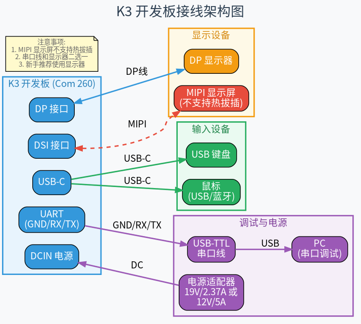
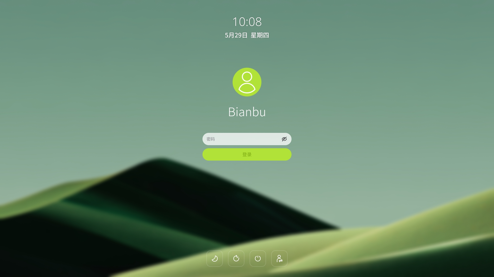
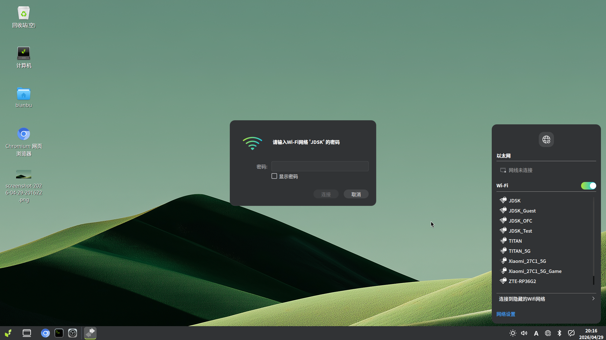

# 上电开机

本章介绍首次使用 K3 开发板时的上电开机流程：完成供电接线、显示器连接及调试串口配置（可选），并通过 PC 串口终端查看启动日志，确认开发板与线缆工作正常。

## 1. 物品清单

| 类型 | 说明 |
| --- | --- |
| 开发板 | SpacemiT K3 系列（本文以 COM260 为例，如图所示） |
| 供电 | DCIN 供电，19V/2.37A 或 12V/5A 电源适配器 |
| 显示器 | 支持 DP 或 MIPI DSI 接口的显示器 |
| 键盘&鼠标 | 任意 USB-C 键盘/鼠标（鼠标亦支持蓝牙连接） |
| 串口调试 | USB 转 TTL 串口线（可选） |
| USB | Type-C |

串口线与显示器二选一，建议新手优先使用显示器方式。


## 2. 接线顺序

若无串口调试工具，可通过 DP 接口连接显示器完成初始配置。以下以显示器方式为例进行演示。若无显示器，请参照第 3 章节通过串口方式操作。




1. 接入显示器 DP/MIPI。注意：**MIPI 显示器不支持热拔插，须在上电前接入、断电后拔出**
2. 接入电源
3. 接入鼠标与键盘

除 MIPI 显示屏外，以上步骤无特定顺序要求。

## 3. 操作步骤

### 3.1 启动开机
COM260 已预装进迭时空 Bianbu 操作系统。首次启动接入电源后，请按照配置向导完成初始设置。


请记录所注册的用户名及密码。

完成所有配置后即可进入系统。


### 3.2 登录配置

开机后可直接登录


### 3.3 网络连接

#### 以太网连接

支持 RJ45 有线网口，网线直连

#### Wi-Fi 连接

通过显示器界面中的网络设置进行 Wi-Fi 配置：




也可通过终端命令连接网络：

```bash
    nmcli device wifi connect "wifi_name" password "wifi_password"
```

## 3. 串口连接

串口线接线图如下：


请务必对照丝印标识 GND/RX/TX 与 USB-TTL 模块引脚进行接线。

参考线序说明（仅当 USB-TTL 线与下述定义一致时适用）：黑线接地（GND）、白线接板端 RX 丝印位、绿线接 TX 丝印位、红线为电源线，悬空不接。

串口接好后上电即可进入终端。默认用户名为 `bianbu` 或 `root`，密码均为 `bianbu`。


```bash
    nmcli device wifi connect "wifi_name" password "wifi_password"
```

## 4. 远程登录

设备连接网络后，即可通过远程方式登录开发板。

### 4.1 ssh

- Windows 登录
    推荐使用 MobaXterm 工具，操作如下：

    1）打开 MobaXterm，点击 “Sessions” → “New Session”，选择 SSH。

    2）设置连接参数：

    Remote host：开发板 IP 地址（如 192.168.1.100）；
    Specify username：默认用户名为 bianbu；
    Port：保持默认 22。
    3）点击 OK 发起连接，并输入密码完成登录。


- Ubuntu 登录

    在终端中输入以下命令：
    ```
    ssh bianbu@<remote_ip>
    ```
    将 <remote_ip> 替换为开发板的实际 IP 地址。首次连接时会提示确认主机指纹，输入 yes 即可。

### 4.2 远程桌面

参考  [远程连接/VNC 登录](https://www.spacemit.com/community/document/info?lang=zh&nodepath=software/SDK/ros/k1/01_Quick_start/1.4_Remote_Access.md)


## 5. 常见问题

| 现象 | 建议排查 |
| --- | --- |
| 串口完全无输出 | 供电是否正常；RX/TX 是否交叉且 GND 已接；PC 是否选对 COM/设备节点；波特率是否为 115200。 |
| 乱码 | 波特率与板载 UART 约定不一致；尝试核对硬件手册中的调试口波特率；排除 USB 线松动或接触不良。 |
| 仅依赖线色接线 | **不可靠**；务必对照 **丝印 GND/RX/TX** 与 USB-TTL 模块引脚定义。 |
| 是否需要先烧镜像 | 出厂若已有固件，接线正确即可见日志；重新刷机或换镜像见 [2.2-镜像烧录](2.2-镜像烧录.md)。 |

---

