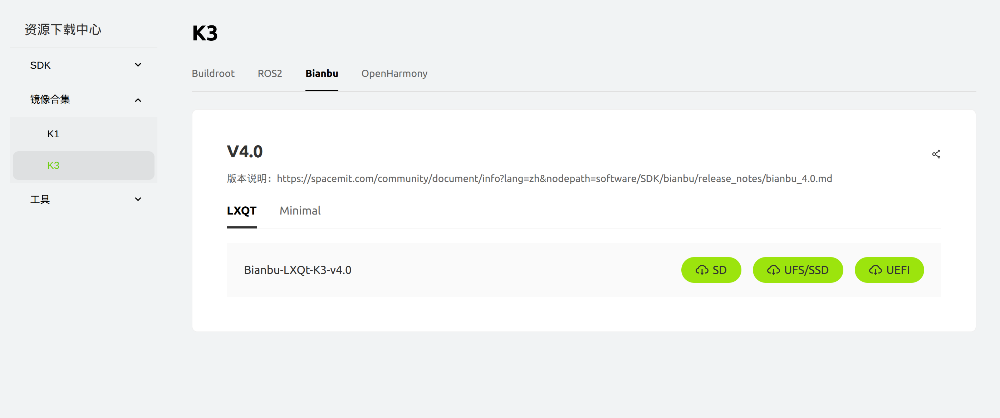
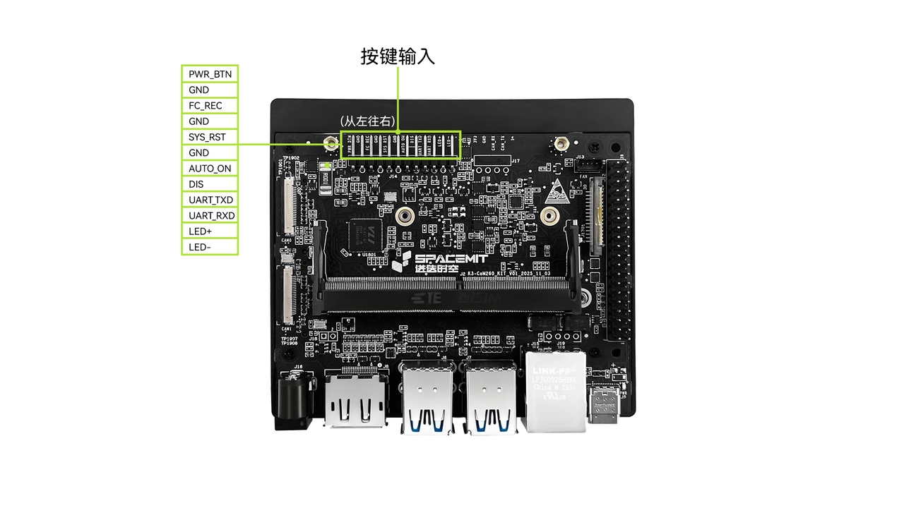
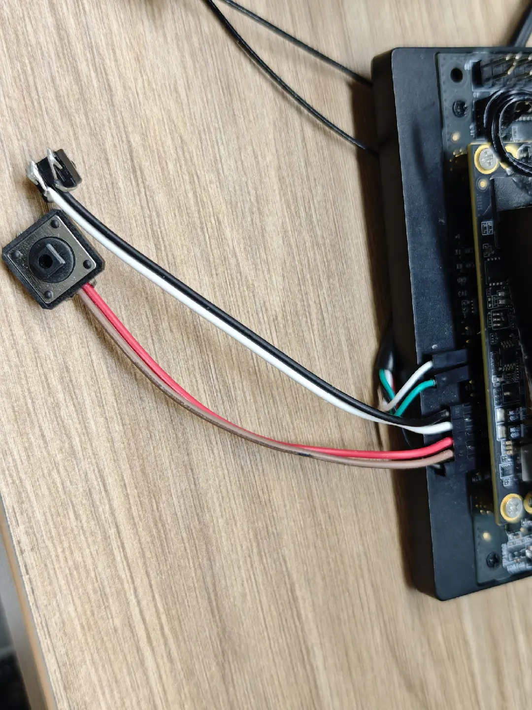
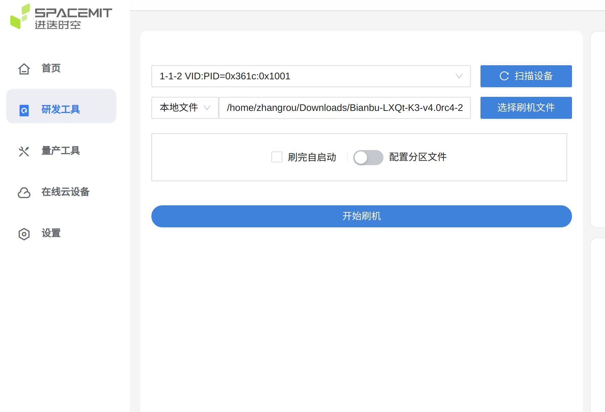
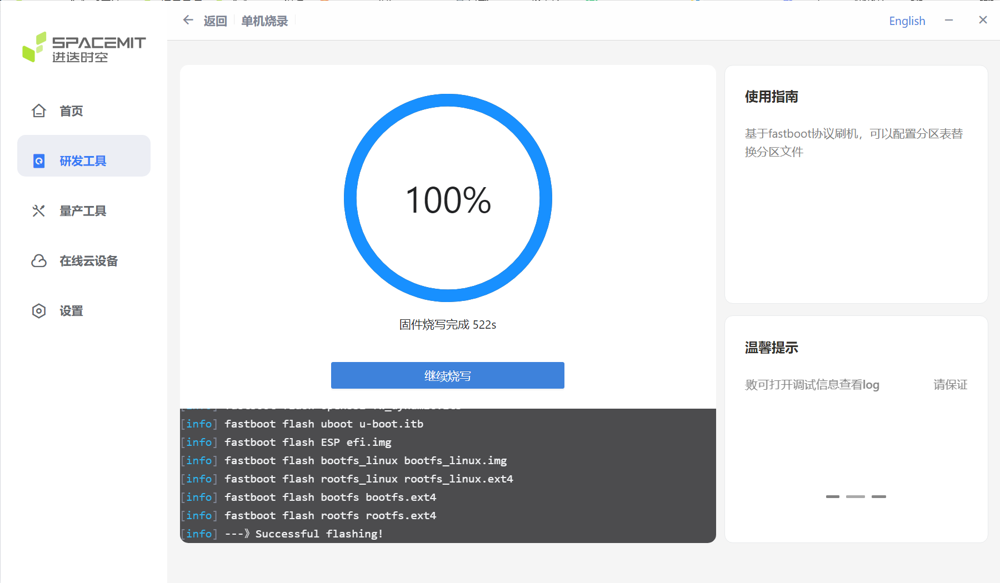

# 镜像烧录

## 1. 所需资源

| 类型 | 说明 |
| --- | --- |
| 硬件 | K3 开发板、Type-C 数据线、按键 |
| 刷机工具 | TiTan（详见 2.1 节）|
| 镜像 | [Bianbu-LXQt-K3-v4.0](https://spacemit.com/community/resources-download/Images%20Collects/K3/Bianbu)|


**出厂开发板已预装镜像，请根据实际需要决定是否重新烧录。** 推荐镜像：[Bianbu-LXQt-K3-v4.0](https://spacemit.com/community/resources-download/Images%20Collects/K3/Bianbu)

本节介绍的烧录方式为 UFS 启动模式，请下载对应镜像。


## 2. 操作步骤

按键参考


### 2.1 烧录模式


- 准备一根 Type-C 数据线，一端连接至上位机 PC，另一端连接至 K3 开发板的 Type-C 接口；
- 将按键分别接入 FC_REC - GND、SYS_RST - GND，如图所示：
 
- 长按 FC_REC 按键不松手；
- 短按一次 RST 按键；
- 松开 FC_REC 按键。

即：先按住 FC_REC 按键，再短按 RST 按键，随后松开 FC_REC，即可进入刷机模式。


判断是否成功进入烧录模式：

烧录工具中能够扫描到设备：



若已连接串口，串口将输出如下日志：
```
setup= 0x80500 0x0,                                                                
setup= 0x1000680 0x120000,                                                         
setup= 0x2000680 0x90000,                                                          
setup= 0x2000680 0x200000,                                                         
setup= 0x3000680 0xff0000,                                                         
setup= 0x3020680 0xff0409,                                  |                      
setup= 0x3010680 0xff0409,                                                         
setup= 0x10900 0x0,                                                                
usb_rx_bytes : start len[4096]                                                     
setup= 0x3020680 0xff0409,                                                         
setup= 0x3040680 0xff0409,                                                         
setup= 0x3000680 0x40000,                                                          
setup= 0x3010680 0xff0409,                                                         
setup= 0x3000680 0x40000,                                                          
setup= 0x3020680 0xff0409,                                                      
```
出现以上日志即表示已成功进入刷机模式。

### 2.1 刷机


进入刷机模式后，参考 [刷机工具下载和使用指南](https://www.spacemit.com/community/document/info?lang=zh&nodepath=tools/user_guide/flasher_user_guide.md)，选择推荐的系统镜像，点击开始刷机。

## 3. 验证与自检

完成烧录后，可通过以下方式确认操作成功：

- 刷机软件


- 显示器

    COM260 预装 Bianbu 操作系统，刷机后首次启动将运行配置向导，通过鼠标与键盘注册用户名与密码。

- 注意事项

    若无法外接显示器和键盘进行首次注册，则无法通过串口完成用户初始化配置。


    当登录界面出现以下提示时：

    ```
   Bianbu 4.0rc1 k3 ttyS0                                                             
    k3 login: 
                                                 
    密码：     
    ```
可临时使用超级用户进行开发：

    用户名：root

    密码：bianbu

建议正式开发时创建普通用户，避免使用 root 账户登录。


## 4. 常见问题

刷机软件提示刷机失败：

1. 检查数据线是否连接正常，刷机过程中请勿断开 USB 连接
2. 检查固件版本与开发板型号是否匹配
