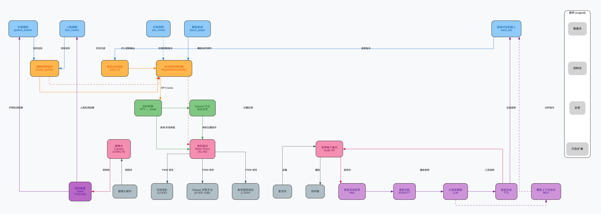
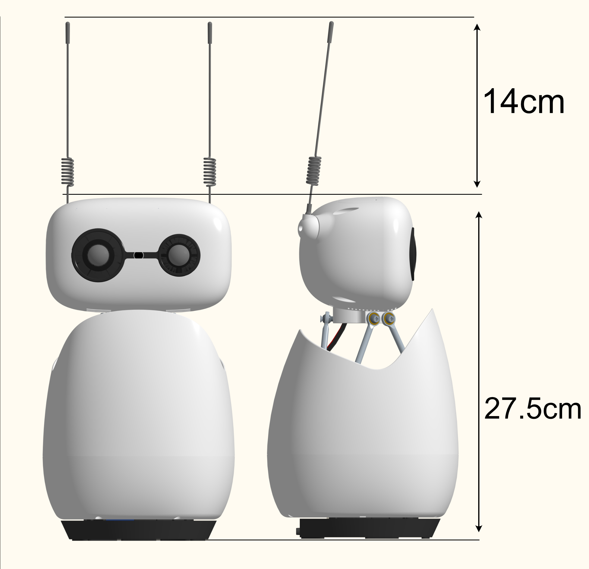
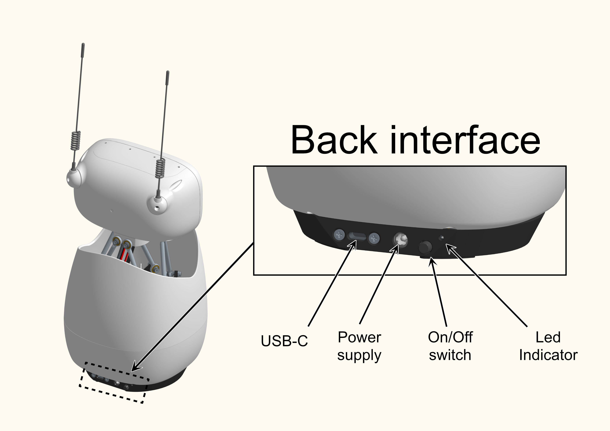
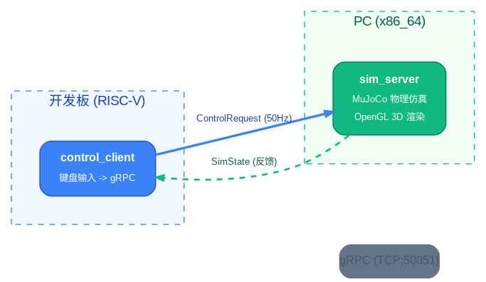
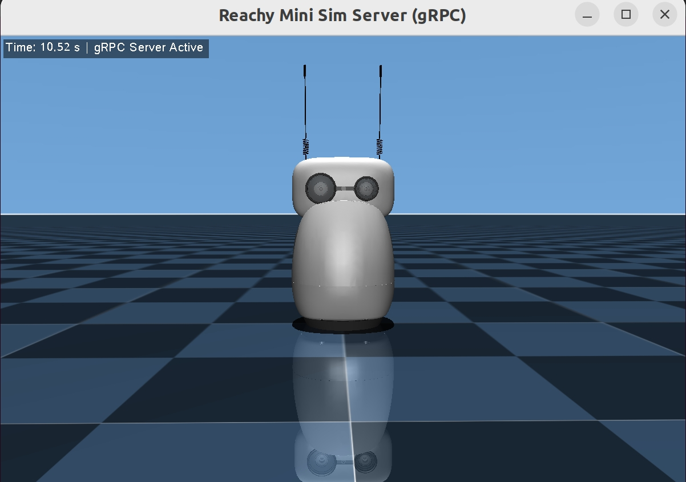

# Reachy Mini 桌面机器人

Reachy Mini 是由 Hugging Face 与 Pollen Robotics 联合推出的开源桌面机器人，本方案基于 K3-COM260 计算平台进行适配与开发。
## 1. 方案概述

Reachy Mini 是一个小型机器人运动控制交互应用，支持以下功能：

- **视觉跟随**：通过摄像头实时检测人脸/手势，经 PD 控制算法驱动 Stewart 并联平台电机
- **语音对话控制**：集成 VAD + ASR + LLM + TTS 全链路语音交互，支持语音指令控制机器人动作
- **舞蹈表演**：预编排的舞蹈动作序列，支持音频同步播放
- **仿真控制**：通过 gRPC 远程控制 PC 端 MuJoCo 仿真，支持键盘实时操控和预设动作



**核心组件**：
- 头部：6 DOF 运动（x, y, z, roll, pitch, yaw）
- 身体：垂直轴旋转
- 天线：2 个电机，360 度旋转

## 2. 硬件清单

| 项目 | 内容 |
| --- | --- |
| 推荐硬件 | Reachy Mini 机器人（Lite 版本） |
| 关键外设 | Sony IMX708 摄像头、PDM MEMS数字麦克风、扬声器、XL330 舵机 |
| 计算平台 | k3-com260  |

------------------------------------------
 


## 3. 环境搭建

### 3.1 硬件连接

1. 连接电源
2. 连接开发板 USB 口




通过拔插 USB 确定串口号
```
 # 电机串口默认为 /dev/ttyACM0
   ls /dev/tty*
```

### 3.2 外部依赖

**核心依赖**：
- `components/peripherals/motor` — 电机驱动库
- `components/model_zoo/vision` — 视觉推理库
- OpenCV（`/opt/opencv-spacemit`）— 图像采集与显示

**音频依赖**（`test_dance` 和 `reachy_voice_bot` 需要）：
- `libportaudio` — 音频采集/播放
- `libsndfile` — 音频文件读写
- `libsamplerate` — 采样率转换
- `libfftw3` — FFT 运算

**AI 组件依赖**（仅 `reachy_voice_bot`）：
- `components/model_zoo/asr` — 语音识别
- `components/model_zoo/tts` — 语音合成
- `components/model_zoo/vad` — 语音活动检测
- `components/model_zoo/llm` — 大语言模型推理     
- `components/multimedia/audio` — 音频处理库   # **优先编译此模块** 
- `mcp`

**_所有依赖在编译时会被下载_**

### 3.3 编译构建
```
cd spacemit_robot    # 跳转下载 SDK 的目录，即项目根目录

lunch  # 选择方案
```
方案如下
```
You're building on Linux

Lunch menu... pick a combo:

     1  k1-muse-pipro-minimal
     2  k3-com260-mars
     3  k3-com260-minimal
     4  k3-com260-reach-mini
     5  k3-com260-humanoid-asimov
     6  k3-com260-humanoid-g1
     7  k3-com260-humanoid-go1
     8  k3-com260-humanoid-h1_2
     9  k3-com260-humanoid-qinglong
     10 k3-com260-humanoid-r1
     11 k3-com260-humanoid-tiangong
     12 k3-com260-humanoid-tinker
     13 kx-generic-omni_agent

```
选择 k3-com260-reach-mini

```
m  #执行编译
```
**_所有依赖将在执行编译时检测和下载，系统依赖选择 y 自动安装_**


**首次编译说明**：
- 可执行文件安装到 `output/staging/bin`
- 所有依赖库和头文件安装在 `output/staging/lib` 和 `output/staging/include`


## 4. 场景一：人脸/手势跟随

### 4.1 复现步骤

1. **硬件**
   ```bash
   # 确定摄像头实际 id，默认 id 为 0

   v4l2-ctl --list-devices

   Reachy Mini Camera: Reachy Mini (usb-xhci-hcd.1.auto-1.4.4):
    /dev/video13
    /dev/video14
    /dev/media0

   ```

2. **下载模型**
    ```
    cd spacemit_robot  # 项目根目录下执行
    bash application/native/reachy_mini/config/download_face_gesture_models.sh
    ```

3. **启动人脸/手势跟随**

    **camera-id 与串口参数请根据实际情况填入**
   ```bash
   face_tracker yolov5-face.yaml --control --camera-id 13 --port /dev/ttyACM0
   ```

   ```
   gesture_tracker yolov5_gesture.yaml --control --camera-id 13 --port /dev/ttyACM0
   # 当前支持跟随手势 - 手掌
   ```
    **通用选项**：
- `--model-path <path>` — 覆盖配置文件中的模型路径
- `--camera-id <id>` — 相机设备 ID（默认 0）
- `--no-gui` — 禁用 GUI（无显示屏时使用）
- `--control` — 启用电机控制
- `--port <path>` — 电机串口路径（默认 `/dev/ttyACM0`）

4. **观察效果**
   机器人头部会实时跟随检测到的人脸/手势

### 4.2 运行效果

- 实时人脸/手势检测
- 头部平滑跟随（PD 控制算法）
- 可视化窗口显示检测框和跟随状态


## 5. 场景二：语音对话控制

### 5.1 复现步骤

1. **启动 LLM 服务**

    下载模型


    ```
    mkdir -p ~/.cache/models/llm
    cd ~/.cache/models/llm
    # 示例下载qwen2.5 0.5b的模型
    wget https://archive.spacemit.com/spacemit-ai/model_zoo/llm/qwen2.5-0.5b-instruct-q4_0.gguf
    ```
    启动 llama 服务
   ```bash
    llama-server -m ~/.cache/models/llm/qwen2.5-0.5b-instruct-q4_0.gguf -t 8 --port 8080
   ```

2. **列出可用音频设备**
   ```bash
   reachy_voice_bot --list-devices
   ```
   **`reachy_voice_bot -h` 查看使用方法与参数列表**
   
   **语音控制参数**：

    | 参数 | 说明 | 默认值 |
    |------|------|--------|
    | `--llm-url <url>` | LLM API 地址（必填） | — |
    | `--model <name>` | LLM 模型名称 | `qwen2.5:0.5b` |
    | `--tts <engine>` | TTS 后端 | `matcha:zh` |
    | `-i, --input-device <id>` | 麦克风设备索引 | 系统默认 |
    | `-o, --output-device <id>` | 扬声器设备索引 | 系统默认 |
    | `--capture-rate <hz>` | 录音采样率 | `16000` |
    | `--playback-rate <hz>` | 播放采样率 | `16000` |
    | `--motor-port <port>` | 电机串口路径 | `/dev/ttyACM0` |
    | `--mcp-config <path>` | MCP 配置文件（启用工具调用） | — |
    | `--save-audio [file]` | 保存录音用于调试 | `voice_debug.wav` |


3. **启动语音对话**
   ```bash
   reachy_voice_bot  -i 0 -o 0 --capture-rate 16000 --capture-channels 2 --playback-rate 16000 --playback-channels 2 --llm-url http://localhost:8080 --tts matcha:zh-en  # 使用默认 mcp 工具，--mcp-config path 指定自定义 mcp 工具路径
   ```

   本例使用本地模型，
   支持云端大模型

4. **交互**
   - 对着麦克风说话
   - 机器人会识别语音、理解意图、执行动作并回复

### 5.2 运行效果

- 完整语音交互链路：录音 → VAD 检测 → ASR 识别 → LLM 对话 → TTS 合成 → 播放
- 支持语音指令控制机器人动作（点头、摇头、舞蹈等）
- 实时音频处理和响应


### 辅助指令
```
# 音量调节
    # 1. 获取 card id
    aplay -l
    **** List of PLAYBACK Hardware Devices ****
    card 0: Audio [Reachy Mini Audio], device 0: USB Audio [USB Audio]
    Subdevices: 1/1
    Subdevice #0: subdevice #0

    # 2. 调节
    - 音量
        amixer -c 0 sset 'PCM',0 100%
    - 增益
        amixer -c 0 sset 'PCM',1 70%

```
<div style="width: 100%; display: flex; justify-content: center;">
  <video controls style=" width: 100%; height: auto; object-fit: contain;">
    <source src="assets/reachy-mini_voice_ctl.mp4" type="video/mp4">
  </video>
</div>


## 6. 常见问题

| 现象 | 处理 |
| --- | --- |
| 找不到模型文件 | 检查所有依赖组件是否已经编译，mm 触发时会自动安装模型库 |
| 摄像头无法打开 | 检查 `/dev/video*` 设备是否存在，尝试 `--camera-id 1` 或其他 ID |
| 电机无响应 | 确认串口连接正确，检查 `/dev/ttyACM0` 权限：`sudo chmod 666 /dev/ttyACM0`；执行 `test_api /dev/ttyACM0` 验证电机驱动 |
| 无显示屏时运行跟随程序 | 添加 `--no-gui` 参数禁用 GUI 窗口 |
| 语音识别不工作 | 检查麦克风设备 ID，使用 `--list-devices` 列出可用设备 |
| 机器人不响应指令 | 执行 `test_api /dev/ttyACM0` 验证电机驱动；执行 `test_dance /dev/ttyACM0` 验证舞蹈动作 |

## 7. 仿真控制

通过 gRPC 双向流式通信远程控制 PC 端的 MuJoCo 仿真服务端（`sim_server`），实现远程遥控仿真机器人。


### 代码获取


**注：仿真服务端在 pc 上运行，当前支持 linux 系统**

[代码仓库](https://gitlab.dc.com:8443/robotics/simulation)
```
git clone https://gitlab.dc.com:8443/robotics/simulation.git
```
下载资源文件
```
cd simulation
wget -r -np -nH --cut-dirs=2 -R index.html https://archive.spacemit.com/ros2/simulation_reachy_mini/assets/
```
**仿真服务端** 代码仅内部开放，持续更新中

### 7.1 架构




### 7.2 编译
客户控制端：

如果已经通过 mm/m 编译，则不用再执行本步骤
```bash
# 编译（作为主项目子模块自动编译，或单独编译）
cd simulation
mkdir -p build && cd build
cmake .. && make -j$(nproc)

```
仿真服务端见[代码仓库](https://gitlab.dc.com:8443/robotics/simulation)文档说明

### 7.3 网络配置

WiFi 延迟抖动较大，建议使用网线直连 PC 和开发板：

```bash
# PC 端配置静态 IP
sudo ip addr add 192.168.88.1/24 dev eth0
sudo ip link set eth0 up

# 开发板端配置静态 IP
sudo ip addr add 192.168.88.100/24 dev eth0
sudo ip link set eth0 up

# 验证连通性
ping 192.168.88.1
```


### 7.4 运行

```bash
# PC 端启动仿真服务
./sim_server 0.0.0.0:50051

# 开发板端启动客户端（默认连接 192.168.88.100:50051）
./control_client

# 指定服务端地址
./control_client 192.168.88.1:50051
```
服务端


### 7.5 键盘控制

| 按键 | 功能 | 说明 |
|------|------|------|
| `W/S` | Pitch 上/下 | [-35°, +35°]，步进 5° |
| `A/D` | Yaw 左/右 | [-170°, +170°]，步进 5° |
| `Q/E` | Roll 左/右倾 | [-25°, +25°]，步进 5° |
| `Z/X` | 左天线 减/增 | 步进 0.1 rad |
| `C/V` | 右天线 减/增 | 步进 0.1 rad |
| `1` | 点头动作 | 重复 3 次 |
| `2` | 摇头动作 | 重复 3 次 |
| `3` | 天线舞蹈 | 重复 3 次 |
| `H` | 回到原点 | 所有轴归零 |
| `ESC` | 退出程序 | — |


## 8. 技术参考

### 8.1 构建目标

| 可执行文件 | 说明 | 依赖 |
|---|---|---|
| `face_tracker` | 人脸跟随 | motor, vision, OpenCV |
| `gesture_tracker` | 手势跟随 | motor, vision, OpenCV |
| `reachy_voice_bot` | 语音对话控制 | motor, vision, OpenCV,  AI 组件库 |
| `control_client` | 仿真控制客户端 | gRPC, protobuf |
| `test_api` | 运动 API 测试（排查用） | motor |
| `test_dance` | 舞蹈动作测试（排查用） | motor, portaudio, sndfile, samplerate |

### 8.2 目录结构

```
reachy_mini
├── CMakeLists.txt
├── config
│   ├── yolov5-face.yaml
│   └── yolov5_gesture.yaml
├── package.xml
├── README.md
├── simulation
│   ├── CMakeLists.txt
│   ├── control_client.cc
│   └── reachy_sim.proto
└── src
    ├── face_tracker.c
    ├── gesture_tracker.c
    ├── kinematics
    ├── motor_ctl
    ├── talent_show
    ├── tracker_generic
    ├── vision
    ├── voice
    └── voice_bot.cpp
```

## 9. 许可证

Apache-2.0
