# 轮式机器人Linksee

## 1. 方案概述

- **支持功能**：
  面向 `k3-com260` 板卡的 `linksee` 机器人整机方案，集成**底盘运动控制、里程计发布、IMU 接入、2D 激光雷达接入、人体跟随、自主导航与多种 SLAM 建图能力**。
  其中：
  - 底盘侧启用了 base，支持差速底盘速度控制、`/cmd_vel` 到底盘驱动下发、[/odom](vscode-file://vscode-app/usr/share/code/resources/app/out/vs/code/electron-browser/workbench/workbench.html) 里程计与 TF 发布；
  - 传感器侧启用了 `IMU` 与 `Lidar` 外设组件，支持 `CMP10A` IMU、`YDLIDAR` / `RPLIDAR` 雷达驱动；
  - 感知侧启用了 `person_follow`，支持基于视觉检测的人体跟随；
  - 规划导航侧启用了 `nav2`，支持基于 2D 激光雷达或 RGB-D 的导航能力；
  - 建图定位侧同时启用了 `cartographer_run`、`rtabmap_run`、`slam_toolbox_run`，支持 2D 激光 SLAM、RGB-D SLAM、3D 点云 SLAM 等多种建图/定位模式；
  - AI 应用侧支持 `linkseeHost/linkseeClient` 端到端控制链路，覆盖遥操作、数据采集、ACT 模型训练、部署推理，以及通过 `mlink gateway + MCP + Hermes` 的自然语言任务触发；
  - 应用层启用了 [linksee](vscode-file://vscode-app/usr/share/code/resources/app/out/vs/code/electron-browser/workbench/workbench.html)，提供面向 `linksee` 产品形态的 ROS2 应用封装。


  - **架构层次说明**：
    `linksee` 方案的软件框图如下：

    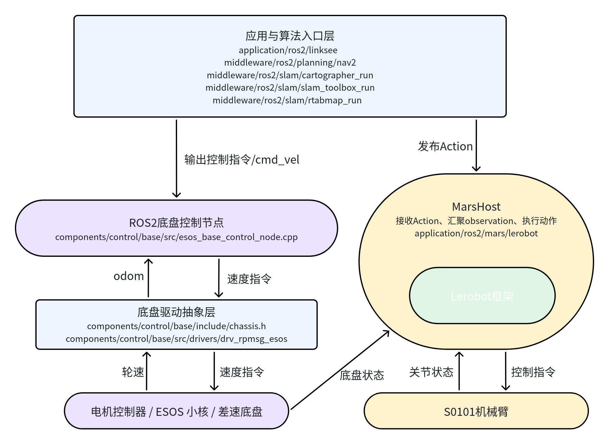

其中，`application/ros2/linksee` 负责整机应用封装，`middleware/ros2/planning/nav2` 提供导航能力，`middleware/ros2/slam/cartographer_run`、`middleware/ros2/slam/slam_toolbox_run`、`middleware/ros2/slam/rtabmap_run` 提供不同建图/定位模式；这些模块统一通过 `/cmd_vel` 与底盘控制链路对接。


## 2. 硬件清单

### 2.1 整体外观

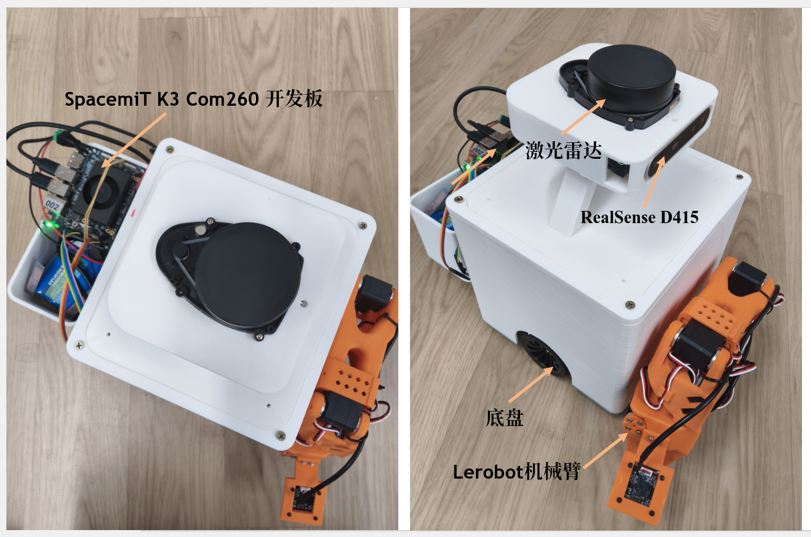

### 2.2 硬件清单

**主体物料清单：**

|     名称     |                       购买链接参考                        |                          型号                           | 数量 |
| :----------: | :---------------------------------------------------: | :-----------------------------------------------------: | :--: |
|    K3主控    |                                                       |                         COM260                          |  1   |
| 520直流电机  |   https://e.tb.cn/h.irv3MOgf5Ypwztr?tk=Poqm5iPOSL6    |      【MC520, 1:56减速比】+线材+支架+联轴器+65黑轮      |  2   |
| TB6612驱动器 | https://ic-item.jd.com/10162327051022.html#crumb-wrap |                 【焊接排针】双路 TB6612                 |  1   |
|    万向轮    |   https://e.tb.cn/h.isKSEn9zICLmVWB?tk=Yp9U5ilZAxt    |                  加厚CY-15A 不锈钢外壳                  |  1   |
|    定向轮    |        https://item.jd.com/10161843167223.html        |                黑镍支架0.5英寸橡胶定向轮                |  1   |
|     电池     |        https://item.jd.com/10079480141957.html        |                       12v 7500mAh                       |  1   |
|    转接头    |         https://item.jd.com/100112736411.html         | DC转接公头5.5-2.5（10个装)、DC转接母头5.5-2.5（10个装） |  1   |
|  电机连接线  |      https://ic-item.jd.com/10214775527601.html       |      xH2.54 6p (5条) + 1007#22 AWG 300mm 双头同向       |  1   |
|   激光雷达   |       https://ic-item.jd.com/100180910133.html        |                     YDLIDAR X3 Pro                      |  1   |

**注意** ：需要使用同向排线连接电机到驱动板，若使用其它电机和驱动板，注意引脚定义

**其它物料规格**：

|   名称   |           规格说明            |
| :------: | :---------------------------: |
| 连接螺栓 | M3x10、M3x8 内六角螺栓、螺母  |
| 自攻螺丝 | M3.5x10十字圆头带垫自攻螺丝钉 |
|  杜邦线  |            2.54mm             |


## 3. 环境搭建
### 3.1 硬件连接

引脚映射


调试串口连接


硬件配置及接线

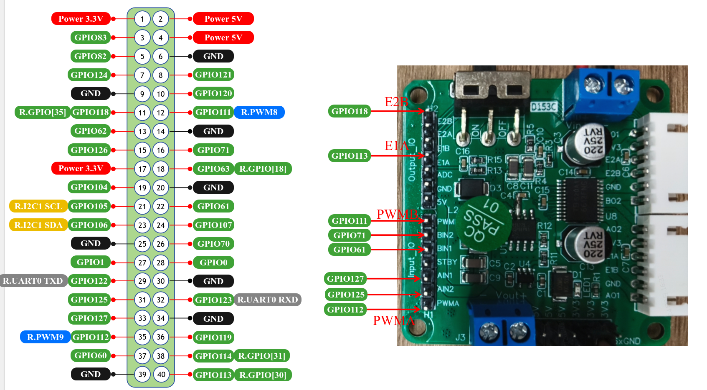


电机（左） 1

| 功能        | 引脚                         | 说明      |
| ----------- | ---------------------------- | --------- |
| 方向控制 0  | GPIO 125 -> AIN2             | H 桥控制  |
| 方向控制 1  | GPIO 127 -> AIN1             | H 桥控制  |
| PWM         | rpwm9 (GPIO 112) -> PWMA     | 10KHz PWM |
| 编码器 A 相 | GPIO 113（R.GPIO[30]）-> E1A | 中断输入  |

电机 （右）2

| 功能        | 引脚                         | 说明      |
| ----------- | ---------------------------- | --------- |
| 方向控制 0  | GPIO 71 -> BIN2              | H 桥控制  |
| 方向控制 1  | GPIO 61 -> BIN1              | H 桥控制  |
| PWM         | rpwm8 (GPIO 111) -> PWMB     | 10KHz PWM |
| 编码器 A 相 | GPIO 118（R.GPIO[35]）-> E1B | 中断输入  |

**注意**：不同电机的正反定义可能不同，可以调整方向控制的次序直到电机的转向符合预期

### 3.2 软件环境-小核

必须使用 bianbu26 lxqt rc4 之后版本的固件，否则内核不支持大小核通信

**小核itb文件替换**

```
sudo apt update && sudo apt install -y --allow-downgrades wget
wget https://archive.spacemit.com/ros2/prebuilt/esos_kernel/update_esos.sh
bash update_esos.sh
```

替换成功后，需要给开发板重新上电，小核串口打印如下：

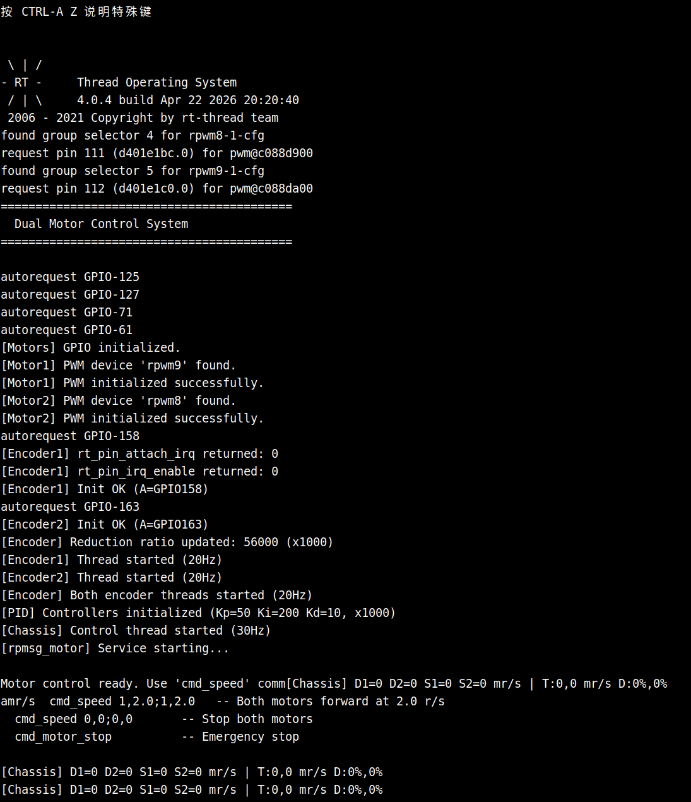

会持续打印编码器读数和轮速，轮速毫转/s

### 3.3 linksee软件环境设置

建议先阅读 [构建编译](../02-快速入门/2.3-构建编译.md)，以了解SDK的组织和构建方式

**系统依赖安装**

```
sudo apt update

sudo apt install ros-dev-tools ros-humble-ros-base \
python3-numpy 'ros-humble-cartographer*' 'ros-humble-nav*' libpcap-dev libuvc-dev \
ros-humble-filters ros-humble-turtlesim ros-humble-camera-info-manager  ros-humble-pcl-ros \
ros-humble-image-common ros-humble-image-geometry ros-humble-robot-localization \
ros-humble-joint-state-publisher liblgpio-dev libgpiod-dev 'ros-humble-rtabmap*' \
ros-humble-tf-transformations
```

```
pip config set global.index-url https://mirrors.aliyun.com/pypi/simple/
pip config set global.extra-index-url https://git.spacemit.com/api/v4/projects/33/packages/pypi/simple

pip install spacemit-audio spacemit-asr spacemit-vad --break-system-packages
```

**下载仓库**

```
sudo apt update
sudo apt install repo

mkdir spacemit_robot
cd spacemit_robot

repo init -u https://github.com/spacemit-robotics/manifest.git -b main -m default.xml \
  --repo-url=https://gitee.com/spacemit-robotics/git-repo
repo sync -j4
repo start robot-dev --all
```

进入顶层目录，目录内容如下：

```
root@k3:~/spacemit_robot# ls
application  build  components  middleware  scripts  target  tools
```

**编译**

```
source build/envsetup.sh
```

```
lunch #选择k3-com260-linksee
```

全量编译

```
m
```

全量清理

```
m clean
```


### 3.4 PC主机环境设置

- 建议使用ubuntu22.04
- 按照 https://docs.ros.org/en/humble/Installation/Ubuntu-Install-Debs.html 安装好 ROS2 humble

```
mkdir -p ~/visual_ws/src && cd ~/visual_ws/src
git clone https://github.com/spacemit-robotics/ros2_visualization.git
cd ..
source /opt/ros/humble/setup.bash
colcon build
```

该功能包主要用于rviz2可视化


## 4. SLAM建图

### 4.1 复现步骤

所有终端都需要 `source ~/spacemit_robot/output/staging/setup.bash`

**1、启动底盘**

```
ros2 launch linksee base_control_esos.launch.py
```

终端输出：

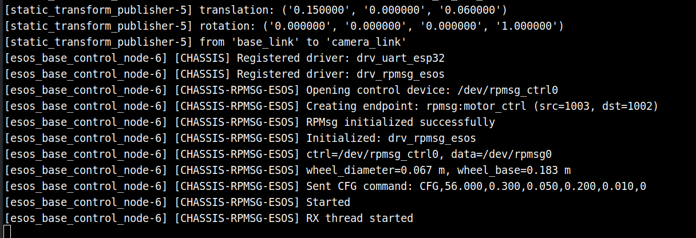

**2、启动雷达**

```
ros2 launch linksee start_ydlidar.launch.py
```

终端输出：

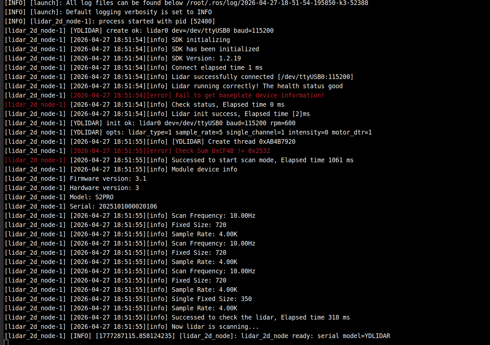

**3、启动建图**

新建终端

```
source ~/spacemit_robot/output/staging/setup.bash
```

```
ros2 launch cartographer_run cartographer_2d.launch.py
```

终端输出：

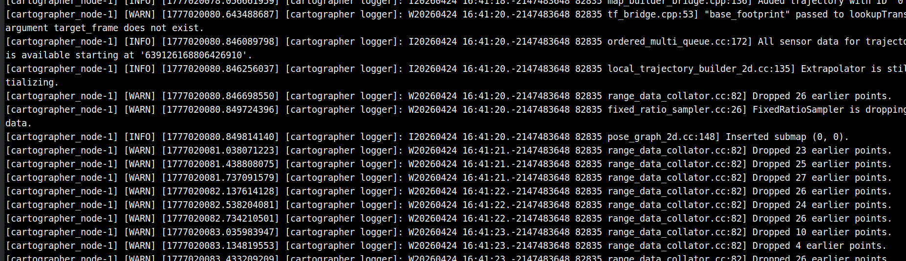

**4、启动键盘控制**

```
ros2 run teleop_twist_keyboard teleop_twist_keyboard
```

**5、PC端可视化**

```
source ~/visual_ws/install/setup.bash
ros2 launch visualization display_slam.launch.py
```

**6、保存地图**

新建终端

```
source /opt/ros/humble/setup.bash
```

```
ros2 run nav2_map_server map_saver_cli -f my_map
```

这里保存的地图在后续导航任务和巡航任务中会用到。

### 4.2. 运行效果

slam效果：

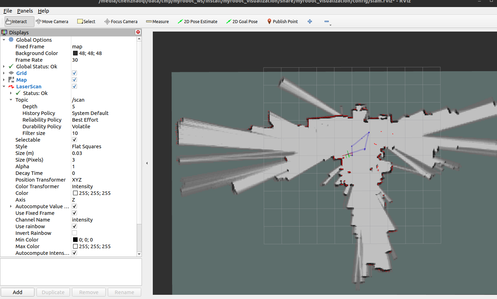


## 5. 视觉SLAM建图

### 5.1 复现步骤

所有终端均需要：`source ~/spacemit_robot/output/staging/setup.bash`

安装依赖：

```
sudo apt install 'ros-humble-rtabmap*' ros-humble-aruco-markers-msgs
```

**1、启动底盘**

```
ros2 launch linksee base_control_esos.launch.py
```

**2、启动雷达**

```
ros2 launch linksee start_ydlidar.launch.py
```

**3、启动里程计**

```
ros2 launch linksee start_odom.launch.py
```

**4、启动深度相机**

```
ros2 launch realsense2_camera rs_launch.py camera_namespace:=/
```

终端输出：

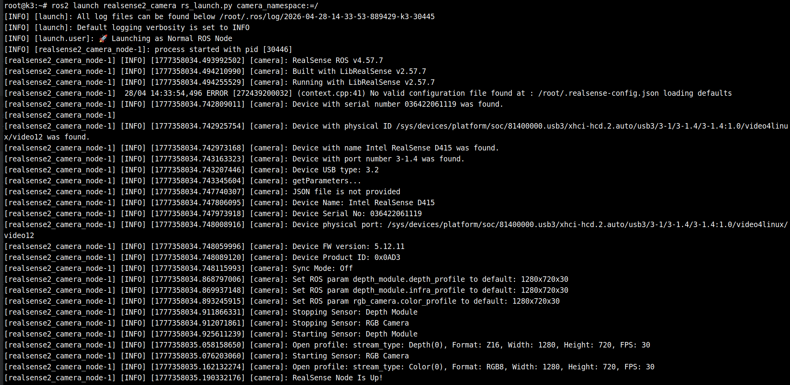

**步骤 5：启动 RGB-D 建图**

```bash
ros2 launch rtabmap_run rgbd_slam.launch.py
```

**预期现象**：`rtabmap`、`point_cloud_xyz`、`obstacles_detection` 等节点正常启动；开始发布 `/map`、`/camera/cloud`、`/camera/obstacles`、`/camera/ground`。

终端输出

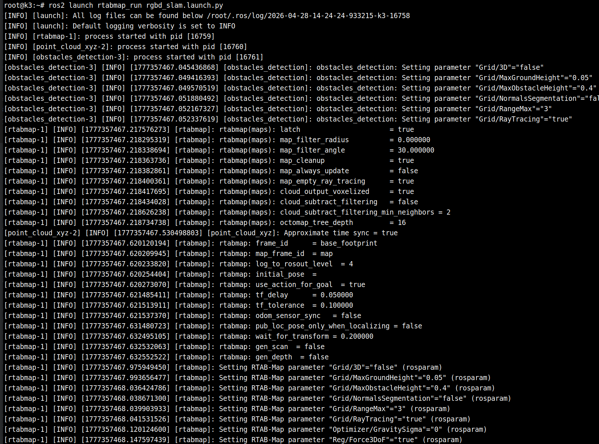

**步骤 6：PC 端可视化**

```bash
source ~/visual_ws/install/setup.bash
ros2 launch visualization display_rgbd.launch.py
```

**预期现象**：RViz 中可看到 RGB-D 相关可视化结果、点云与地图更新。


**步骤7：启动键盘控制**

```
ros2 run teleop_twist_keyboard teleop_twist_keyboard
```

使用键盘控制移动，扩大建图范围

### **5.2 运行效果**


## 6. Nav2导航

- 导航前请将激光雷达建好的地图拷贝到：`spacemit_robot/middleware/ros2/planning/nav2/map`，然后重新执行 lunch、m的全量编译，需要使用默认的 my_map 文件名。
- 确保小车在建图的起点

### 6.1 复现步骤

**1、启动底盘**

```
source ~/spacemit_robot/output/staging/setup.bash
```

```
ros2 launch linksee base_control_esos.launch.py
```

**2、启动雷达**

```
ros2 launch linksee start_ydlidar.launch.py
```

**3、启动里程计**

```
ros2 launch linksee start_odom.launch.py
```

**4、启动导航**

```
ros2 launch nav2 nav2.launch.py
```

终端输出

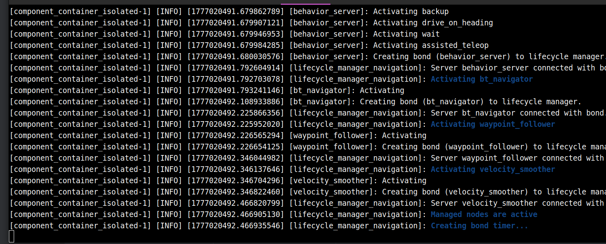

**5、PC端可视化**

```
source ~/visual_ws/install/setup.bash
ros2 launch visualization display_navigation.launch.py
```


### 6.2. 运行效果

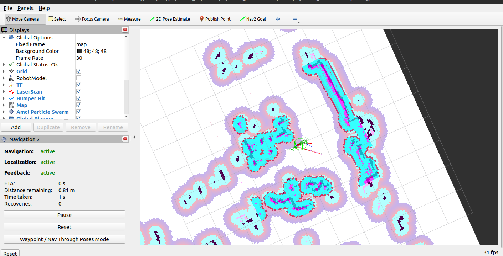


## 7. 自动巡航

- 巡航前请将激光雷达建好的地图拷贝到：`spacemit_robot/middleware/ros2/planning/nav2/map`，然后重新执行 lunch、m的全量编译，需要使用默认的 my_map 文件名。
- 确保小车在建图的起点
- 巡航演示需要一个至少2*2m的空间

### 7.1 复现步骤

**1、启动底盘**

```
source ~/spacemit_robot/output/staging/setup.bash
```

```
ros2 launch linksee base_control_esos.launch.py
```

**2、启动雷达**

```
ros2 launch linksee start_ydlidar.launch.py
```

**3、启动里程计**

```
ros2 launch linksee start_odom.launch.py
```

**4、启动导航**

```
ros2 launch nav2 nav2.launch.py
```

终端输出


**5、启动巡航节点**

```
ros2 run nav2 autonomous_patrol
```

终端输出：

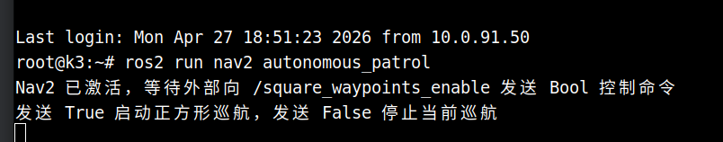

**6、开启巡航**

```
ros2 topic pub --once /square_waypoints_enable std_msgs/msg/Bool "{data: true}"
```

**7、PC端可视化**

```
source ~/visual_ws/install/setup.bash
ros2 launch visualization display_navigation.launch.py
```

### 7.2. 运行效果


## 8. 语音控制小车

**硬件连接：**

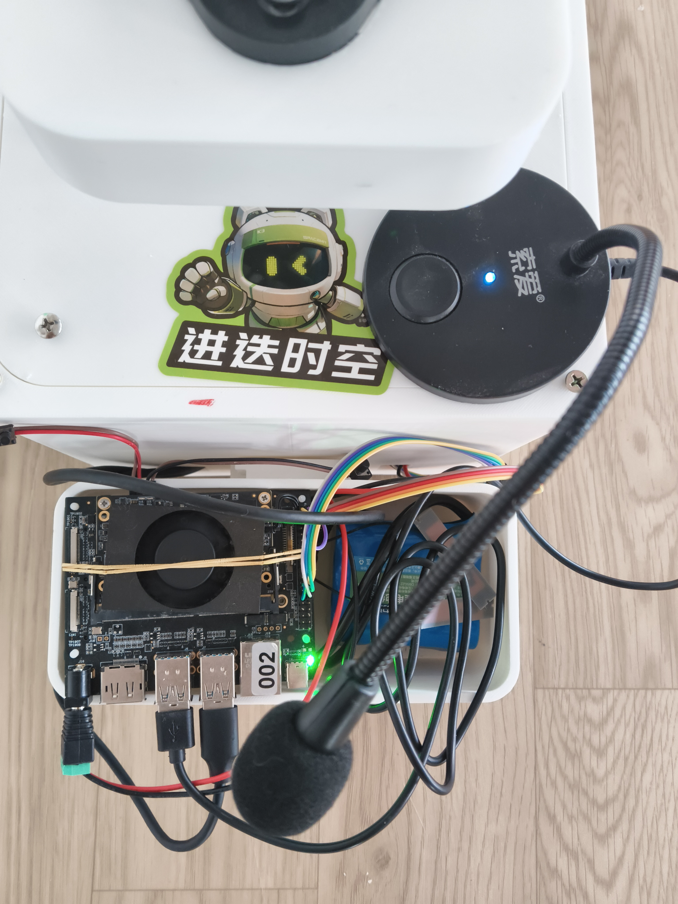

### 8.1 复现步骤

所有终端均需要：`source ~/spacemit_robot/output/staging/setup.bash`

**1、启动底盘**

```
ros2 launch linksee base_control_esos.launch.py
```

**2、启动雷达**

```
ros2 launch linksee start_ydlidar.launch.py
```

**3、启动里程计**

```
ros2 launch linksee start_odom.launch.py
```

**4、启动底盘语音控制**

```
ros2 launch linksee voice_cmd.launch.py
```

终端输出：

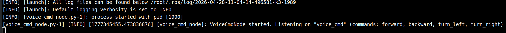

**5、启动分发节点**

```
ros2 run linksee voice_dispatcher_node.py
```

分发节点订阅语音转文字节点发布的 `/asr_text` 话题，并将文字解析为具体的指令

终端输出

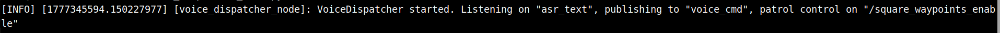

**6、启动语音转文字节点**

```
ros2 run linksee asr_node.py -r 48000
```

-r 指定麦克风的采样频率，根据实际情况做修改，其他参数见：`~/spacemit_robot/application/ros2/linksee/scripts/asr_node.py`

**预期输出**

语音输入：左转、右转、向前进、向后退，小车执行相应动作

终端输出：

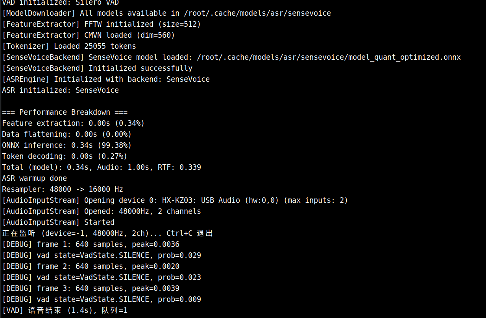

### 8.2 运行效果


## 9. Linksee 机器人端到端推理

本章节在现有 Linksee 移动机器人底盘、传感器与导航能力基础上，进一步整合移动抓取端到端控制方案。方案覆盖 Linksee 机器人数据采集、模型训练、部署推理，以及将推理能力封装为工具后，通过自然语言触发移动抓取任务的完整链路。

### 9.1 方案概述

本方案支持以下能力：

- **通信控制**：基于 Host/Client 架构完成 Linksee 机器人本体控制、观测采集与远程通信；
- **遥操作**：使用 SO101 主导臂控制 Linksee 手臂，使用键盘控制 Linksee 底盘，实现移动抓取遥操作；
- **数据采集**：采集包含机械臂、底盘和多路相机观测的端到端数据集；
- **模型训练**：基于采集数据训练 ACT 模型，并支持断点恢复训练；
- **推理测评**：将训练好的模型部署到推理端，完成 Linksee 机器人的端到端推理与评测；
- **自然语言控制**：将 Linksee 端到端推理流程封装为原生应用，通过 `mlink device → mlink gateway → MCP → Hermes` 链路注册为 MCP工具，集成到 Hermes Agent 框架中，支持使用自然语言控制 Linksee 机器人完成移动抓取任务。

Linksee 机器人端到端控制流程采用 Host/Client 分布式架构：

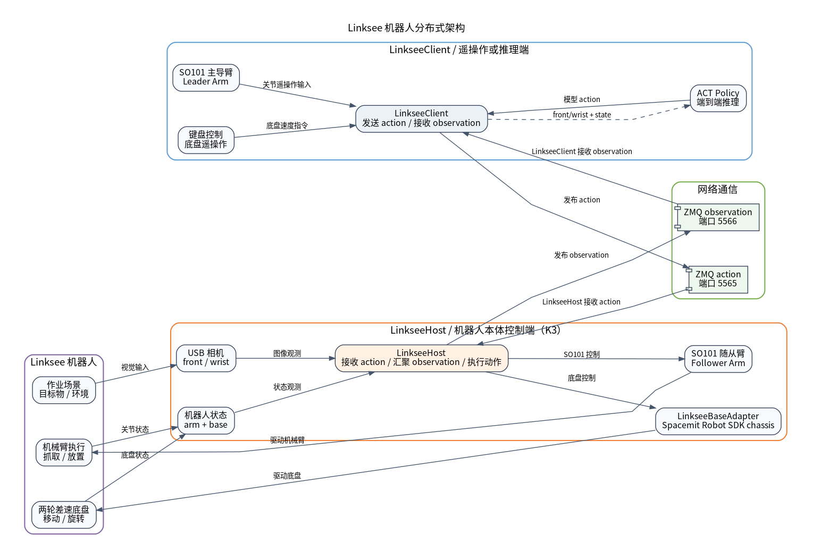

- `LinkseeHost` 连接 Linksee 机器人，负责实例化 Linksee，直接控制机械臂和底盘；
  - 机械臂通过 Lerobot 的 SO101 方案控制；
  - 底盘通过 `LinkseeBaseAdapter` 对接 Spacemit Robot SDK 的 `third_party/chassis` 共享库；
- `LinkseeClient` 负责将遥操信息或推理信息发送给 `LinkseeHost`；
  - 通过 ZMQ 发送 action；
  - 通过 ZMQ 接收 observation。

**`LinkseeHost` 和 `LinkseeClient` 可以部署在同一台设备上，也可以分别部署在不同设备上运行。**

### 9.2 硬件清单

| 项目                   | 内容                                                         |
| ---------------------- | ------------------------------------------------------------ |
| 硬件/整机              | Linksee 移动抓取机器人                                       |
| 训练平台               | 一台配置 RTX 系列及以上 GPU 的服务器                         |
| 遥操和数采平台（可选） | PC                                                           |
| 推理平台               | Spacemit K3 开发板                                           |
| 机械臂                 | SO101 主导臂，遥操和数采需要                                 |
| 视觉输入               | 两个 USB 相机，示例中为 `front` 和 `wrist`                   |
| 关键外设与接口         | follower arm 串口通常为 `/dev/ttyACM0`；底盘串口通常为 `/dev/ttyACM1`；相机为 `/dev/video*` |

运行前请确认：

- Linksee 手臂、底盘和 USB 相机已连接到 K3 开发板；
- 遥操作和数采时，确保 SO101 主导臂已连接到 PC。

Linksee 手臂、底盘与相机通过 USB 连接到 K3 开发板：


SO101 主导臂通过 USB 线连接到 PC：


### 9.3 场景一：Linksee 端到端控制流程

本场景覆盖 Linksee 移动抓取机器人从真机遥操作、数据采集，到 ACT 模型训练和推理的完整流程。

#### 9.3.1 环境搭建

> [!NOTE]
>
> 本场景涉及三个代码环境：
>
> 1. **遥操作和数采**：PC 和 K3 开发板均需安装环境依赖；
> 2. **训练**：GPU 服务器上需安装环境依赖；
> 3. **推理测评**：仅 K3 开发板需安装环境依赖。

1. 克隆代码

```bash
git clone git@github.com:spacemit-robotics/lerobot.git
```

2. 安装系统依赖

```
sudo apt update

sudo apt install ffmpeg

sudo apt install -y \
  libavformat-dev \
  libavcodec-dev \
  libavdevice-dev \
  libavutil-dev \
  libavfilter-dev \
  libswscale-dev \
  libswresample-dev

sudo apt install -y \
  build-essential \
  cmake \
  pkg-config \
  python3-dev
```

- `python3-venv`：用于创建 Python 虚拟环境；
- `ffmpeg`：用于视频帧处理和数据集视频编码。

3. 安装 LeRobot 依赖

创建虚拟环境并安装依赖：

```bash
cd ~/lerobot

# 设置 python 版本为 3.12, 需先参考 《3.3.1-真机训练推理》的 3.3 节安装 pyenv 环境
pyenv local 3.12.13
python3 -V

# 创建并激活虚拟环境
python3 -m venv ~/.lerobot-venv
source ~/.lerobot-venv/bin/activate

# 安装 torch 和 wandb 依赖
pip install torch==2.7.1
pip install torchvision==0.22.0
pip install wandb==0.24.0
pip install pyarrow==23.0.0

# 安装 LeRobot 与 LeKiwi/Linksee 相关依赖
pip install -e .
pip install "lerobot[lekiwi]"
```

4. 构建 Linksee 底盘共享库

LinkseeHost 端进入仓库并构建底盘共享库：

```bash
cd ~/lerobot
./scripts/build_mars_chassis.sh
```

默认会产出：

```text
third_party/chassis/build/libchassis.so
```

如不使用默认 vendored 库路径，可在启动 Host 时通过 `--robot.base_control_library_path` 手动指定 `.so` 的绝对路径。

5. 确认机械臂和底盘、以及相机设备索引

```bash
# 查看机械臂和底盘设备节点
lerobot-find-port

# 查看相机设备节点
lerobot-find-cameras opencv
```

6. 设置机械臂和底盘设备权限为可读写

```
sudo chmod 666 /dev/ttyACM*
```

#### 9.3.2 启动 LinkseeHost

LinkseeHost 端进入仓库：

```bash
cd ~/lerobot
source ~/.lerobot-venv/bin/activate
```

启动 Host：

```bash
python -m lerobot.robots.linksee.linksee_host \
  --robot.id=my_linksee \
  --robot.port=/dev/ttyACM0 \
  --robot.base_driver=drv_uart_esp32 \
  --robot.base_dev_path=/dev/ttyACM1 \
  --robot.base_baud=115200 \
  --robot.base_type=diff_2wd \
  --robot.base_left_wheel_gain=1.0 \
  --host.port_zmq_cmd=5565 \
  --host.port_zmq_observations=5566 \
  --host.connection_time_s=3600 \
  --robot.cameras='{
    "front": {"type":"opencv","index_or_path":"/dev/video15","width":640,"height":480,"fps":30,"fourcc":"MJPG"},
    "wrist": {"type":"opencv","index_or_path":"/dev/video13","width":640,"height":480,"fps":30,"fourcc":"MJPG"}
  }'
```

> [!TIP]
>
> 1. 请根据实际系统中的端口号替换 `/dev/ttyACM0` 和 `/dev/ttyACM1`。
> 2. 请根据实际系统中的相机索引号替换 `front` 和 `wrist` 相机的索引 `ID`。
> 3. 首次启动会发起机械臂校准流程，校准过程参考 [SO101 机械臂校准流程](https://huggingface.co/docs/lerobot/en/so101#calibrate)。
> 4. 校准文件存放于 `~/.cache/huggingface/lerobot/calibration` 目录下。

常用 Host 启动参数说明：

| 参数                                | 说明                                                    |
| ----------------------------------- | ------------------------------------------------------- |
| `--robot.port`                      | 机器人侧 follower arm 串口                              |
| `--robot.base_dev_path`             | 机器人侧底盘串口                                        |
| `--robot.base_control_library_path` | 可选；不使用默认 vendored 库路径时，指定 `.so` 绝对路径 |
| `--robot.base_driver`               | 底盘驱动类型；真实底盘默认使用 `drv_uart_esp32`         |
| `--robot.base_baud`                 | UART 波特率                                             |
| `--robot.base_type`                 | 底盘模型，当前示例使用 `diff_2wd`                       |
| `--robot.base_left_wheel_gain`      | 左轮增益，用于底盘速度校准                              |
| `--host.port_zmq_cmd`               | Host 接收 Client action 的端口                          |
| `--host.port_zmq_observations`      | Host 对外发送 observation 的端口                        |
| `--host.connection_time_s`          | Host 运行时长上限，到时自动退出                         |
| `--robot.cameras`                   | 相机配置，示例包含 `front` 和 `wrist` 两路相机          |

> [!TIP]
>
> 建议在 UVC 相机上显式设置 `fourcc="MJPG"`，让相机直接输出 Motion-JPEG。这样通常能降低 USB 带宽压力，更容易稳定运行在 `640x480@30fps`；否则部分摄像头默认使用 `YUYV`，可能导致 Host 侧观测帧率不稳、录制掉帧或推理显示卡顿。

在 K3 开发板上，Linksee 底盘支持通过 RPMSG 驱动启用小核通信，如果选择使用 RPMSG 驱动，可将 UART 相关参数替换为：

```bash
--robot.base_driver=drv_rpmsg_esos \
--robot.base_rpmsg_ctrl_dev=/dev/rpmsg_ctrl0 \
--robot.base_rpmsg_data_dev=/dev/rpmsg0 \
--robot.base_rpmsg_service_name=rpmsg:motor_ctrl \
--robot.base_rpmsg_local_addr=1003 \
--robot.base_rpmsg_remote_addr=1002
```

#### 9.3.3 Client 端启动遥操作

遥操脚本位于：

```text
examples/linksee/teleoperate.py
```

至少修改以下代码片段：

```python
# 设置 Host IP 地址和 linksee 机器人手臂 hf_id
# 当 linksee_host_remote_ip 默认为 127.0.0.1 时，意味 LinkseeHost 和 Linksee Client 均在 K3 开发板端运行
robot_config = LinkseeClientConfig(remote_ip="linksee_host_remote_ip", id="my_linksee")

# 设置主导臂串口号和主导臂 hf_id
teleop_arm_config = SO101LeaderConfig(port="/dev/ttyACM0", id="my_linksee_leader")
```

确保 `Host` 处于连接状态，启动遥操作：

```bash
cd ~/lerobot
source ~/.lerobot-venv/bin/activate
python examples/linksee/teleoperate.py
```

遥操作过程中：

- SO101 主导臂控制 SO101 随从臂；
- 键盘控制 Linksee 底盘。

底盘键盘控制说明：

| 按键 | 功能                                           |
| ---- | ---------------------------------------------- |
| `w`  | forward                                        |
| `s`  | backward                                       |
| `a`  | left                                           |
| `d`  | right                                          |
| `z`  | rotate_left                                    |
| `x`  | rotate_right                                   |
| `r`  | speed_up                                       |
| `f`  | speed_down                                     |
| `q`  | 退出 teleop 循环，退出前发送一次零底盘速度命令 |

> [!NOTE]
>
> 对于两轮差速底盘，左右平移功能不支持。

#### 9.3.4 Client 端启动数据集采集

> [!TIP]
>
> 数采、录制、训练流程都可能涉及到 HuggingFace 账户登录，用于上传数据集和模型。
>
> ```bash
> hf auth login
> HF_USER=$(hf auth whoami | head -n 1 | awk '{print $3}')
> echo $HF_USER
> ```
>
> 如果不登录 Hugging Face，手动设置 $HF_USER 变量：
>
> ```bash
> HF_USER=annyi   # 改为自己的 hf 账户名
> echo $HF_USER
> ```


Client 端数采脚本位于：

```text
examples/linksee/record.py
```

需要修改以下代码片段：

```python
REMOTE_IP = "linksee_host_remote_ip"
ROBOT_ID = "my_linksee"
LEADER_PORT = "/dev/ttyACM0"
LEADER_ID = "my_linksee_leader"
KEYBOARD_ID = "my_keyboard"

NUM_EPISODES = 30
FPS = 30
EPISODE_TIME_SEC = 600
RESET_TIME_SEC = 30
TASK_DESCRIPTION = "pick and place the cube on the orange box"
# 数据集名称，训练和推理需用到
HF_REPO_ID = "${HF_USER}/linksee-pick-place-move-v2"
PUSH_TO_HUB = False
# 是否续采
RESUME = False
```

确保 `Host` 处于连接状态，启动数采：

```bash
cd ~/lerobot
source ~/.lerobot-venv/bin/activate
python examples/linksee/record.py
```

录制完成后，脚本会执行：

- `dataset.finalize()`；
- 当 `PUSH_TO_HUB=True` 且本次确实保存了 episode 时，执行 `dataset.push_to_hub()`。

续采功能：

- `RESUME = True`：在已有数据集上继续录制；
- `RESUME = False`：创建全新的数据集。

#### 9.3.5 训练 ACT 模型

数采完之后，将数据集放置到 GPU 服务器的 `lerobot/datasets` 目录，并开启训练。直接复用 LeRobot 通用训练入口：

```bash
lerobot-train \
  --policy.type=act \
  --policy.repo_id=${HF_USER}/linksee_act_pick_place_move_v2 \
  --dataset.repo_id=${HF_USER}/linksee-pick-place-move-v2 \
  --dataset.root=datasets/linksee-pick-place-move-v2 \
  --output_dir=outputs/train/linksee_act_pick_place_move_v2 \
  --job_name=linksee_act_pick_place_move_v2 \
  --batch_size=4 \
  --steps=100000 \
  --policy.device=cuda \
  --policy.use_amp=True
```

参数说明：

| 参数                | 说明                                     |
| ------------------- | ---------------------------------------- |
| `--policy.type=act` | 使用 ACT 策略训练                        |
| `--policy.repo_id`  | 训练完成后的模型标识                     |
| `--dataset.repo_id` | 训练数据集标识                           |
| `--dataset.root`    | 本地数据集路径，优先于 `dataset.repo_id` |
| `--output_dir`      | checkpoint 输出目录                      |
| `--job_name`        | 训练任务名称                             |
| `--batch_size`      | 训练 batch size                          |
| `--steps`           | 训练步数                                 |
| `--policy.device`   | 训练设备，通常为 `cuda`                  |
| `--policy.use_amp`  | 是否开启混合精度训练                     |

恢复训练示例：

```bash
lerobot-train \
  --config_path=outputs/train/linksee_act_pick_place_move_v2/checkpoints/last/pretrained_model/train_config.json \
  --resume=true
```

训练完成后，将模型 checkpoint 部署到推理端。模型路径示例：

```text
outputs/train/linksee_act_pick_place_move_v2/checkpoints/100000/pretrained_model
```

可按需下载笔者已训练好的 [模型权重](https://archive.spacemit.com/spacemit-ai/model_zoo/vla/act/linksee_act_pick_place_move_v2.tar.gz)。

#### 9.3.6 Client 端启动推理

推理脚本位于：

```text
examples/linksee/evaluate.py
```

需要修改以下代码片段：

```python
REMOTE_IP = "linksee_host_remote_ip"
ROBOT_ID = "my_linksee"
# 训练数据集名称
TRAIN_DATASET_REPO_ID = "${HF_USER}/linksee-pick-place-move-v2"
NUM_EPISODES = 1
FPS = 30
EPISODE_TIME_SEC = 180
RESET_TIME_SEC = 20
TASK_DESCRIPTION = "pick and place the cube on the orange box"
# 模型路径，精确到 pretrained_model
HF_MODEL_ID = "outputs/train/linksee_act_pick_place_move_v2/checkpoints/100000/pretrained_model"
# 测评数据集名称，与训练数据集区分
HF_DATASET_ID = "${HF_USER}/linksee-pick-place-move-v2-eval"
PUSH_TO_HUB = False
```

确保 `Host` 处于连接状态，执行推理：

```bash
cd ~/lerobot
source ~/.lerobot-venv/bin/activate
python examples/linksee/evaluate.py
```

#### 9.3.7 运行效果

推理成功后，`LinkseeClient` 会根据模型输出的 action 控制 `LinkseeHost`，进而驱动 Linksee 机器人完成移动抓取任务：


### 9.4 场景二：自然语言控制 Linksee 机器人移动抓取

本场景将 Linksee 主机和客户端控制流程封装为 C++ 原生应用，并通过 `mlink device → mlink gateway → MCP → Hermes` 链路，提供可调用的 MCP 工具。用户可以在 Hermes Agent 框架中通过自然语言触发 `linksee.start_host`、`linksee.start_inference`、`linksee.stop_host` 和 `linksee.stop_inference`，实现 Linksee 端到端推理任务的启动与停止。

#### 9.4.1 模型和运行环境准备

##### 代码下载

先下载 Spacemit Robot SDK 代码：

```bash
mkdir spacemit_robot
cd spacemit_robot
repo init -u https://github.com/spacemit-robotics/manifest.git -b main -m default.xml \
  --repo-url=https://gitee.com/spacemit-robotics/git-repo
repo sync -j4
repo start robot-dev --all
```

Linksee 自然语言控制示例代码位于：

```text
spacemit_robot/application/ros2/linksee/linksee_app
```

该应用主要包含：

- `linksee_native`：本地命令行入口，用于直接启动或停止 Linksee host/推理流程；
- `linksee_device`：mlink 设备进程，用于向 gateway 动态注册 Linksee 工具；
- `scripts/run_host.py`：Linksee host 启动入口，封装 `lerobot.robots.linksee.linksee_host`；
- `scripts/evaluate.py`：Linksee ACT 推理入口，加载本地模型并记录评测数据；
- `scripts/start_host.sh`、`scripts/start_inference.sh`：后台启动 host 和推理进程；
- `scripts/stop_host.sh`、`scripts/stop_inference.sh`：停止 host 和推理进程。

首次运行前，请先确认机械臂、底盘和相机已经正确连接。硬件连接图可参考本章 `9.2` 节。

##### 模型准备

运行之前将训练好的模型复制到 models 目录下，笔者给出训练好的 [模型权重](https://archive.spacemit.com/spacemit-ai/model_zoo/vla/act/linksee_act_pick_place_move_v2.tar.gz)，有需要的用户可自行下载。

```text
spacemit_robot/application/ros2/linksee/linksee_app/models/linksee_act_pick_place_move_v2/checkpoints/100000/pretrained_model
```

默认推理评测数据集目录为：

```text
application/ros2/linksee/linksee_app/datasets/linksee_pick_place_move_v2_eval
```

每次启动推理前，`scripts/evaluate.py` 会检查模型目录是否存在，并清理旧的评测数据集目录，避免历史数据混入新结果。若实际模型路径或模型版本不同，请同步修改 `scripts/evaluate.py` 中的 `MODEL_DIR` 配置。

##### 确认相机和机械臂设备索引

查看相机和机械臂设备索引，确保索引号与 `scripts/start_host.sh` 中配置一致。

##### 虚拟环境安装

Linksee 移动抓取流程依赖 Python 环境，首次运行前需要准备当前应用的虚拟环境：

```bash
# 进入 spacemit robot sdk，并设置环境变量
cd spacemit_robot
source build/envsetup.sh

# 设置 python 版本为 3.12
pyenv local 3.12.13
python3 -V

m_env_build application/ros2/linksee/linksee_app
```

或者进入应用目录安装：

```bash
cd application/ros2/linksee/linksee_app
bash scripts/setup_env.sh
```

脚本会在仓库根目录下准备虚拟环境：

```text
output/envs/linksee_app
```

##### 底盘库编译

```bash
cd components/thirdparty/lerobot
./scripts/build_mars_chassis.sh
```

#### 9.4.2 编译 mlink device 依赖

`linksee_device` 在编译时依赖 `mlink` 提供的头文件和动态库。编译 Linksee 原生应用前，先完成 `mlink device` 构建：

```bash
cd spacemit_robot
source build/envsetup.sh
cd components/agent_tools/mlink/device
mm
```

构建完成后，通常可看到以下产物：

```text
output/staging/include/mlink.h
output/staging/lib/libmlink_device.so
output/staging/bin/mlink_device_test
```

其中：

- `output/staging/include/mlink.h`：供 `linksee_device` 编译时引用的头文件；
- `output/staging/lib/libmlink_device.so`：供 `linksee_device` 链接及运行时加载的动态库；
- `output/staging/bin/mlink_device_test`：`mlink device` 组件自带测试程序。

#### 9.4.3 构建 Linksee 原生应用

进入目录构建：

```bash
cd spacemit_robot
source build/envsetup.sh
cd application/ros2/linksee/linksee_app
mm
```

构建完成后，产物安装到：

```text
output/staging/bin/linksee_native
output/staging/bin/linksee_device
```

- `output/staging/bin/linksee_native`：本地命令行执行入口；
- `output/staging/bin/linksee_device`：mlink 设备进程，用于向 gateway 动态注册工具并转发调用到 `linksee_native`。

如果只做本地调试，也可以使用独立 CMake：

```bash
cd application/ros2/linksee/linksee_app
cmake -B build -S .
cmake --build build
```

此时本地产物位于：

```text
build/linksee_native
build/linksee_device
```

#### 9.4.4 直接验证 Linksee 工具

可以先通过命令行直接验证 `linksee_native`：

```bash
linksee_native tool-start-host
linksee_native tool-start-inference
linksee_native tool-stop-inference
linksee_native tool-stop-host
```

命令说明：

| 命令                                  | 说明                                                         |
| ------------------------------------- | ------------------------------------------------------------ |
| `linksee_native tool-start-host`      | 启动 Linksee host 进程，连接机械臂、底盘和相机，并发布 observation |
| `linksee_native tool-start-inference` | 启动 Linksee ACT 推理进程，加载本地模型并向 host 发送 action |
| `linksee_native tool-stop-inference`  | 停止 Linksee 推理进程                                        |
| `linksee_native tool-stop-host`       | 停止 Linksee host 进程                                       |

`start_host.sh` 默认会在后台启动 host，并将日志和 PID 写入：

```text
/tmp/linksee_host.log
/tmp/linksee_host.pid
```

`start_inference.sh` 默认会在后台启动推理流程，并将日志和 PID 写入：

```text
/tmp/linksee_inference.log
/tmp/linksee_inference.pid
```

默认 host 启动脚本会使用如下设备配置：

```text
follower arm: /dev/ttyACM0
base device:  /dev/ttyACM1
front camera: /dev/video15
wrist camera: /dev/video13
```

如实际设备不同，请修改 `application/ros2/linksee/linksee_app/scripts/start_host.sh` 中的端口和相机配置。

#### 9.4.5 启动 mlink device 并验证工具注册

1. 启动 gateway：

```bash
cd spacemit_robot
source build/envsetup.sh
m_env_build components/agent_tools/mlink/gateway

source output/envs/mlink-gateway/bin/activate
mlink gateway restart
```

2. 启动 `linksee_device`：

```bash
linksee_device unix linksee
```

3. 检查 gateway 工具列表：

```bash
mlink gateway tools
```

若注册成功，应看到以下工具：

```text
linksee.start_host
linksee.start_inference
linksee.stop_host
linksee.stop_inference
```

#### 9.4.6 Hermes 自然语言调用

安装 Hermes：

```bash
sudo apt-get update
sudo apt-get install --reinstall hermes-agent
```

配置模型：

```bash
hermes model
```

随后按照命令行向导完成密钥和模型配置。

启动交互式 CLI：

```bash
hermes
```

当 `mlink gateway` 已运行且 `linksee_device` 已连接后，Hermes 就能通过 MCP 看到 Linksee 相关工具。

如需将本机 gateway 的 HTTP MCP endpoint 写入 Hermes 配置，可维护 `~/.hermes/config.yaml`：

```yaml
mcp_servers:
    mlink-gateway:
        transport: http
        url: http://127.0.0.1:18765/mcp
        enabled: true
```

配置完成后，可在 Hermes CLI 中使用自然语言发起指令，例如：

- “启动 Linksee host”；
- “启动 Linksee 推理”；
- “停止 Linksee 推理”；
- “停止 Linksee host”。

Hermes 会将这些请求路由到对应 MCP tool，进而触发 `linksee_device` 回调 `linksee_native`，最终执行对应 shell 脚本。

#### 9.4.7 运行效果

在 K3 上打开 Hermes 终端，用自然语言与它对话，查询可调用的工具：

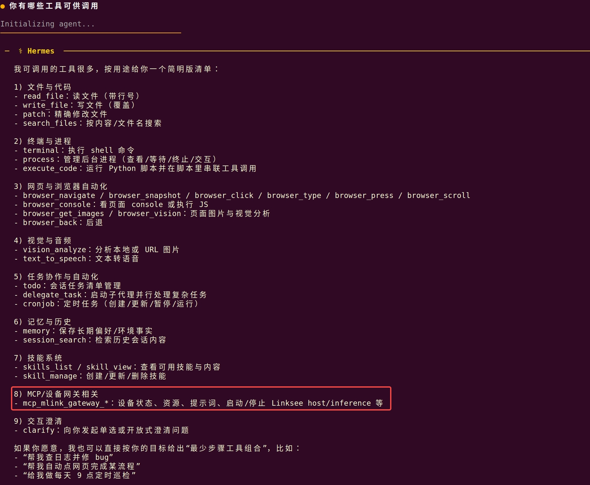

输入“启动 Linksee host”，后台将启动 `LinkseeHost`；输入“启动推理任务”，后台将启动 `LinkseeClient` 推理，控制 Linksee 移动抓取，运行效果如本章 `9.3.7` 节所示。


## 10. 常见问题

| 现象 | 处理 |
| :-: | :-: |
| `lunch` 中看不到 `linksee` 方案 | 先执行 `source build/envsetup.sh` 重新加载编译环境；确认仓库已完整同步，且当前目录位于 `spacemit_robot` 顶层；必要时重新执行 `repo sync -j4` 后再试。 |
| 执行 `m` 编译失败，提示 ROS 2 依赖缺失 | 按本文“系统依赖安装”重新安装 `ros-humble-nav*`、`ros-humble-cartographer*`、`ros-humble-pcl-ros`、`ros-humble-robot-localization` 等依赖；安装完成后重新打开终端并加载环境。 |
| 底盘控制节点已启动，但小车不运动 | 确认是否已有 `/cmd_vel` 输入；可先运行 `teleop_twist_keyboard` 做最小化验证；同时检查底盘控制器、电机驱动和电池是否正常上电。 |
| 机器人运动方向不对，前进变后退或左右转向相反 | 优先检查左右电机接线和电机方向定义是否一致；同步确认左右轮映射、方向控制引脚和底盘参数配置。 |
| `/odom` 没有数据或里程计明显异常 | 检查编码器反馈链路是否正常；确认轮径、轮距、减速比等参数与实际底盘一致；若存在明显漂移，需重新标定 `wheel_base`、`reduction_ratio` 等参数。 |
| 雷达启动失败或导航中看不到激光点云 | 确认雷达 USB/串口已正确接入并被系统识别；重新执行 `ros2 launch linksee start_ydlidar.launch.py` 观察日志；检查雷达供电是否稳定、型号是否与当前启动文件匹配。 |
| 导航无法正常工作，启动 `nav2` 后地图或定位异常 | 先确认底盘 `/odom`、雷达 `/scan`、IMU 等基础话题已正常发布；建图、定位、导航建议分步骤验证，不要在底层链路未打通时直接联调 `nav2`。 |
| PC 端可视化无法显示机器人或话题列表为空 | 确认板端和 PC 端 ROS 2 版本一致且网络互通；分别在两端正确 `source` 对应工作区环境；必要时检查 `ROS_DOMAIN_ID` 是否一致。 |
| 更换了小核内核或 `itb` 后仍无法使用底盘方案 | 确认 `update_esos.sh` 和内核替换步骤已完整执行并重启系统；启动后检查相关设备节点和驱动日志，必要时重新刷写并再次验证。 |
| Host 无法启动底盘 | 确认已执行 `./scripts/build_linksee_chassis.sh`，并检查 `third_party/chassis/build/libchassis.so` 是否存在。 |
| 找不到 follower arm 串口 | 检查 linksee 手臂连接，确认 `--robot.port` 是否为实际串口，例如 `/dev/ttyACM0`。 |
| 找不到底盘串口 | 检查底盘控制器连接，确认 `--robot.base_dev_path` 是否为实际串口，例如 `/dev/ttyACM1`。 |
| 串口权限不足 | 对对应端口执行 `sudo chmod 666 /dev/ttyACM0` 或 `sudo chmod 666 /dev/ttyACM1`。 |
| Client 连接不上 Host | 确认 `remote_ip` / `REMOTE_IP` 为 Host 设备 IP，且 `5565`、`5566` 端口未被防火墙阻断。 |
| 相机帧率不稳或掉帧 | 在 `--robot.cameras` 中显式设置 `fourcc":"MJPG"`，并确认 USB 带宽充足。 |
| 两轮差速底盘无法左右平移 | 属于正常现象，两轮差速底盘不支持左右平移。 |
| 续采覆盖旧数据 | 将 `RESUME = True` 用于追加采集；如需新数据集，设置新的 `HF_REPO_ID` 或清理本地数据。 |
| 恢复训练失败 | 检查 `--config_path` 是否指向已有 checkpoint 下的 `train_config.json`，并设置 `--resume=true`。 |
| 推理模型路径错误 | 检查 `HF_MODEL_ID` 是否指向实际存在的 `pretrained_model` 目录。 |
| `linksee_device` 启动后 gateway 看不到工具 | 确认 `mlink gateway` 已启动，设备名为 `linksee`，启动命令为 `linksee_device unix linksee`。 |
| Hermes 中看不到 linksee 工具 | 检查 `~/.hermes/config.yaml` 中 MCP 地址是否指向 `http://127.0.0.1:18765/mcp`，并确认 `linksee_device` 已连接 gateway。 |
| 自然语言启动推理失败，提示模型目录不存在 | 确认模型已放入 `application/native/linksee/models/linksee_act_pick_place_move_v2/checkpoints/100000/pretrained_model`。 |
| 停止 host 后机械臂未释放 | `stop_host.sh` 会先发送 `SIGINT` 触发 Python 清理逻辑；如超时仍未退出，会回退到强制停止，可查看 `/tmp/linksee_host.log` 排查。 |
