# 轮式机器人Linksee

## 1. 方案概述

- **支持功能**：
  面向 `k3-com260` 板卡的 `linksee` 机器人整机方案，集成**底盘运动控制、里程计发布、IMU 接入、2D 激光雷达接入、人体跟随、自主导航与多种 SLAM 建图能力**。
  其中：
  - 底盘侧启用了 base，支持差速底盘速度控制、`/cmd_vel` 到底盘驱动下发、[/odom](vscode-file://vscode-app/usr/share/code/resources/app/out/vs/code/electron-browser/workbench/workbench.html) 里程计与 TF 发布；
  - 传感器侧启用了 `IMU` 与 `Lidar` 外设组件，支持 `CMP10A` IMU、`YDLIDAR` / `RPLIDAR` 雷达驱动；
  - 感知侧启用了 `person_follow`，支持基于视觉检测的人体跟随；
  - 规划导航侧启用了 `nav2`，支持基于 2D 激光雷达或 RGB-D 的导航能力；
  - 建图定位侧同时启用了 `cartographer_run`、`rtabmap_run`、`slam_toolbox_run`，支持 2D 激光 SLAM、RGB-D SLAM、3D 点云 SLAM 等多种建图/定位模式；
  - AI 应用侧支持 `linkseeHost/linkseeClient` 端到端控制链路，覆盖遥操作、数据采集、ACT 模型训练、部署推理，以及通过 `mlink gateway + MCP + Hermes` 的自然语言任务触发；
  - 应用层启用了 [linksee](vscode-file://vscode-app/usr/share/code/resources/app/out/vs/code/electron-browser/workbench/workbench.html)，提供面向 `linksee` 产品形态的 ROS2 应用封装。


  - **架构层次说明**：
    `linksee` 方案的软件框图如下：

    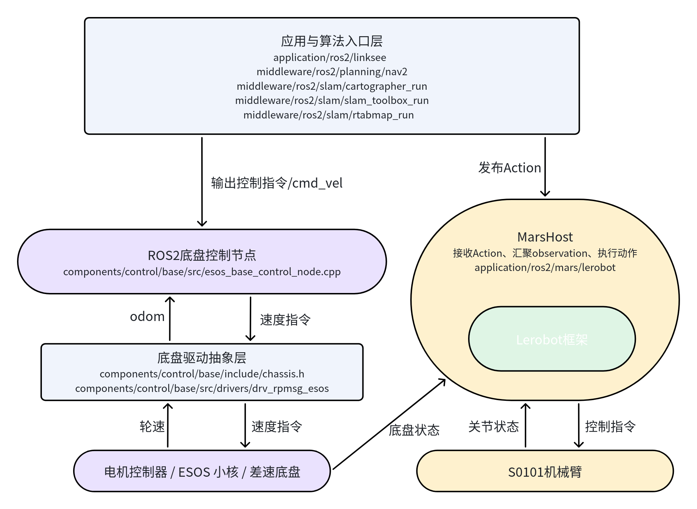

其中，`application/ros2/linksee` 负责整机应用封装，`middleware/ros2/planning/nav2` 提供导航能力，`middleware/ros2/slam/cartographer_run`、`middleware/ros2/slam/slam_toolbox_run`、`middleware/ros2/slam/rtabmap_run` 提供不同建图/定位模式；这些模块统一通过 `/cmd_vel` 与底盘控制链路对接。


## 2. 硬件清单

### 2.1 整体外观

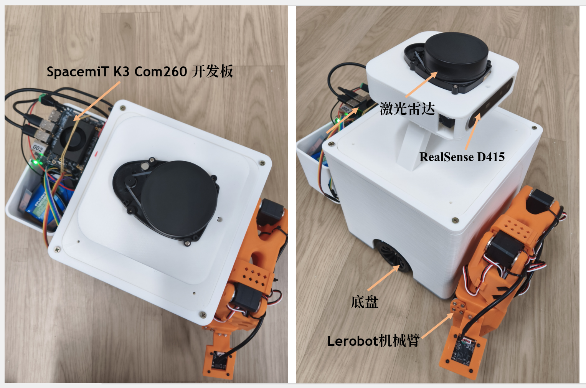

### 2.2 硬件清单

**3D 打印结构件：**

Linksee 机器人外壳和底盘结构件需要提前完成 3D 打印。3D 模型文件仓库地址为：[spacemit-robotics/linksee-mechanical](https://github.com/spacemit-robotics/linksee-mechanical)。仓库目录结构如下：

```text
linksee-mechanical
├── LICENSE
└── step
  ├── chassis.step
  ├── cover.step
  ├── head.step
  ├── main_housing.step
  └── rear_enclosure.step
```

各 3D 模型文件作用如下：

| 文件 | 结构件 | 作用 |
| :-- | :-- | :-- |
| `step/chassis.step` | 底盘 | 机器人底部承载结构，用于安装电机、车轮、万向轮/定向轮、电池、驱动板等底盘相关部件。 |
| `step/main_housing.step` | 壳体 | 机器人主体外壳结构，用于固定 K3 主控、线束和内部电子部件，并为上层结构提供安装支撑。 |
| `step/head.step` | 头部 | 机器人前部/上部外观结构件，用于形成 Linksee 头部造型，并为传感器或前向结构预留安装位置。 |
| `step/cover.step` | 盖板 | 主体顶部或维护开口盖板，用于遮盖内部器件，便于装配和后续维护。 |
| `step/rear_enclosure.step` | 后盖 | 机器人后部封装结构件，用于保护尾部线束和内部器件，完善整机外观。 |

打印完成后，可结合下方主体物料、螺栓和杜邦线等辅料完成整机装配，底盘、盖板与壳体的连接使用 M4 15mm~20mm 长的自攻螺丝即可。

**机械臂结构件说明：**

Linksee 移动抓取方案中的机械臂使用 [ARM101 从臂](https://github.com/TheRobotStudio/SO-ARM100)，可参考下方主体物料清单里面 `SO-ARM100` 的购买链接 。本文提供的 `linksee-mechanical` 仓库仅包含 Linksee 车体相关的 3D 打印结构件，不包含机械臂部分的 3D 打印模型；如需自制机械臂，请单独按照 [`SO-ARM100` 仓库](https://github.com/TheRobotStudio/SO-ARM100)说明准备 ARM101 从臂结构件和舵机等物料。

**注意:** 机械臂使用最底部的舵机与壳体直接连接，若最底部舵机连接了其他部件，请拆除。

**主体物料清单：**

|     名称     |                     购买链接参考                      |                             型号                             | 数量 |
| :----------: | :---------------------------------------------------: | :----------------------------------------------------------: | :--: |
|    K3主控    |                                                       |                            COM260                            |  1   |
| ARM101 从臂  |   https://e.tb.cn/h.R4sNHFaEmy3Qgn1?tk=IlvQ5D62QjP    | 从臂成品[6个12V舵机+从臂打印件] 含控制板、数据线、电源、G字夹 |  1   |
| 520直流电机  |   https://e.tb.cn/h.irv3MOgf5Ypwztr?tk=Poqm5iPOSL6    |        【MC520, 1:56减速比】+线材+支架+联轴器+65黑轮         |  2   |
| TB6612驱动器 | https://ic-item.jd.com/10162327051022.html#crumb-wrap |                   【焊接排针】双路 TB6612                    |  1   |
|    万向轮    |   https://e.tb.cn/h.isKSEn9zICLmVWB?tk=Yp9U5ilZAxt    |                    加厚CY-15A 不锈钢外壳                     |  1   |
|    定向轮    |        https://item.jd.com/10161843167223.html        |                  黑镍支架0.5英寸橡胶定向轮                   |  1   |
|     电池     |        https://item.jd.com/10079480141957.html        |                         12v 7500mAh                          |  1   |
|    转接头    |         https://item.jd.com/100112736411.html         |   DC转接公头5.5-2.5（10个装)、DC转接母头5.5-2.5（10个装）    |  1   |
|  电机连接线  |      https://ic-item.jd.com/10214775527601.html       |         xH2.54 6p (5条) + 1007#22 AWG 300mm 双头同向         |  1   |
|   激光雷达   |       https://ic-item.jd.com/100180910133.html        |                        YDLIDAR X3 Pro                        |  1   |

**注意** ：需要使用同向排线连接电机到驱动板，若使用其它电机和驱动板，注意引脚定义

**深度相机选型说明：**

如需使用 RGB-D 导航、RGB-D SLAM 或 3D 点云 SLAM 等能力，建议选用 Intel RealSense D4xx 系列深度相机。目前已完成验证的型号为 RealSense D415 和 RealSense D435i，可优先选择上述型号进行适配和调试。

**其它物料规格**：

|   名称   |           规格说明            |
| :------: | :---------------------------: |
| 连接螺栓 | M3x10、M3x8 内六角螺栓、螺母  |
| 自攻螺丝 | M3.5x10十字圆头带垫自攻螺丝钉 |
|  杜邦线  |            2.54mm             |

### 2.3 详细视图

**侧面和内部**

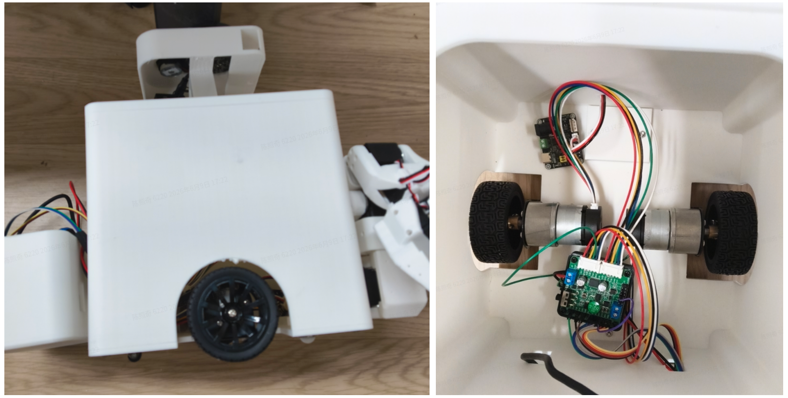

**底盘详细**


**底盘接线**

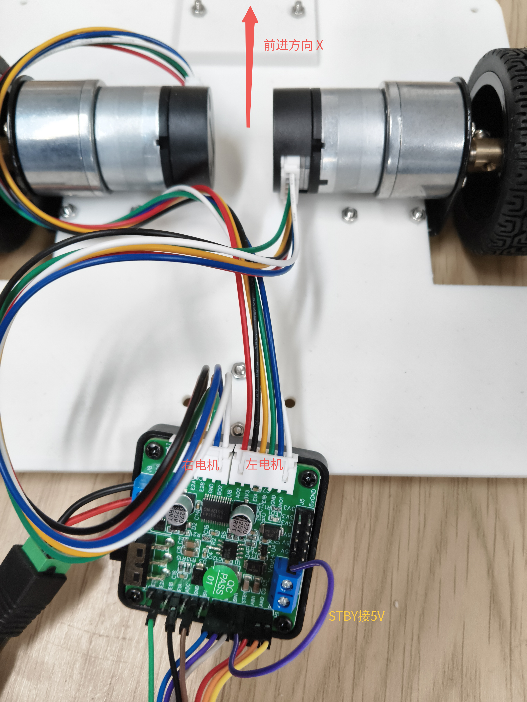

## 3. 环境搭建

### 3.1 硬件连接

引脚映射


调试串口连接

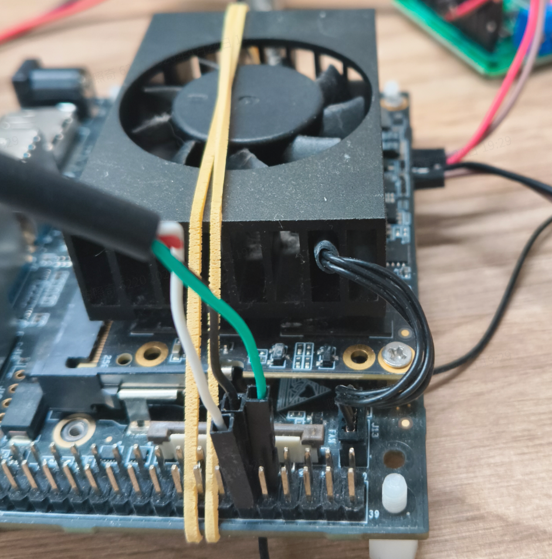


硬件配置及接线


电机（左） 1

| 功能        | 引脚                         | 说明      |
| ----------- | ---------------------------- | --------- |
| 方向控制 0  | GPIO 125 -> AIN2             | H 桥控制  |
| 方向控制 1  | GPIO 127 -> AIN1             | H 桥控制  |
| PWM         | rpwm9 (GPIO 112) -> PWMA     | 10KHz PWM |
| 编码器 A 相 | GPIO 113（R.GPIO[30]）-> E1A | 中断输入  |

电机 （右）2

| 功能        | 引脚                         | 说明      |
| ----------- | ---------------------------- | --------- |
| 方向控制 0  | GPIO 71 -> BIN2              | H 桥控制  |
| 方向控制 1  | GPIO 61 -> BIN1              | H 桥控制  |
| PWM         | rpwm8 (GPIO 111) -> PWMB     | 10KHz PWM |
| 编码器 B 相 | GPIO 118（R.GPIO[35]）-> E2B | 中断输入  |

**注意**：不同电机的正反定义可能不同，可以调整方向控制的次序直到电机的转向符合预期

### 3.2 软件环境-小核

系统镜像必须使用 bianbu26 lxqt 4.0 之后版本，参考 [镜像烧录](../02-快速入门/2.2-镜像烧录.md) 推荐的固件，否则内核不支持大小核通信

**小核itb文件替换**

```
sudo apt update && sudo apt install -y --allow-downgrades wget
su root && cd ~
wget https://archive.spacemit.com/ros2/prebuilt/esos_kernel/update_esos.sh
bash update_esos.sh
```

非root用户需配置权限：
```
sudo tee /etc/udev/rules.d/99-rpmsg.rules <<EOF
KERNEL=="rpmsg*", MODE="0666"
KERNEL=="rpmsg_ctrl*", MODE="0666"
EOF
```

```
sudo udevadm control --reload-rules
sudo udevadm trigger
```

替换成功后，需要给开发板重新上电，小核串口打印如下：


会持续打印编码器读数和轮速，轮速毫转/s

### 3.3 linksee软件环境设置

建议先阅读 [构建编译](../02-快速入门/2.3-构建编译.md)，以了解SDK的组织和构建方式

**系统依赖安装**

```
sudo apt update

sudo apt install ros-dev-tools ros-humble-ros-base \
python3-numpy 'ros-humble-cartographer*' 'ros-humble-nav*' libpcap-dev libuvc-dev \
ros-humble-filters ros-humble-turtlesim ros-humble-camera-info-manager  ros-humble-pcl-ros \
ros-humble-image-common ros-humble-image-geometry ros-humble-robot-localization \
ros-humble-joint-state-publisher liblgpio-dev libgpiod-dev 'ros-humble-rtabmap*' \
ros-humble-tf-transformations
```

```
pip config set global.index-url https://mirrors.aliyun.com/pypi/simple/
pip config set global.extra-index-url https://git.spacemit.com/api/v4/projects/33/packages/pypi/simple

pip install spacemit-audio spacemit-asr spacemit-vad --break-system-packages
```

**下载仓库**

```
sudo apt update
sudo apt install repo

mkdir spacemit_robot
cd spacemit_robot

repo init -u https://github.com/spacemit-robotics/manifest.git -b main -m default.xml \
  --repo-url=https://gitee.com/spacemit-robotics/git-repo
repo sync -j4
repo start robot-dev --all
```

进入顶层目录，目录内容如下：

```
root@k3:~/spacemit_robot# ls
application  build  components  middleware  scripts  target  tools
```

**编译**

```
source build/envsetup.sh
```

```
lunch #选择k3-com260-linksee
```

全量编译

```
m
```

全量清理

```
m clean
```


### 3.4 PC主机环境设置

- 建议使用ubuntu22.04
- 按照 https://docs.ros.org/en/humble/Installation/Ubuntu-Install-Debs.html 安装好 ROS2 humble

```
mkdir -p ~/visual_ws/src && cd ~/visual_ws/src
git clone https://github.com/spacemit-robotics/ros2_visualization.git
cd ..
source /opt/ros/humble/setup.bash
colcon build
```

该功能包主要用于rviz2可视化


## 4. SLAM建图

### 4.1 复现步骤

所有终端都需要 `source ~/spacemit_robot/output/staging/setup.bash`

**1、启动底盘**

```
ros2 launch linksee base_control_esos.launch.py
```

终端输出：

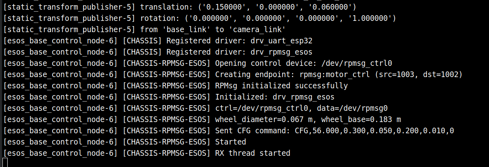

**2、启动雷达**

```
ros2 launch linksee start_ydlidar.launch.py
```

终端输出：


**3、启动建图**

新建终端

```
source ~/spacemit_robot/output/staging/setup.bash
```

```
ros2 launch cartographer_run cartographer_2d.launch.py
```

终端输出：


**4、启动键盘控制**

```
ros2 run teleop_twist_keyboard teleop_twist_keyboard
```

**5、PC端可视化**

```
source ~/visual_ws/install/setup.bash
ros2 launch visualization display_slam.launch.py
```

**6、保存地图**

新建终端

```
source /opt/ros/humble/setup.bash
```

```
ros2 run nav2_map_server map_saver_cli -f my_map
```

这里保存的地图在后续导航任务和巡航任务中会用到。

### 4.2. 运行效果

slam效果：

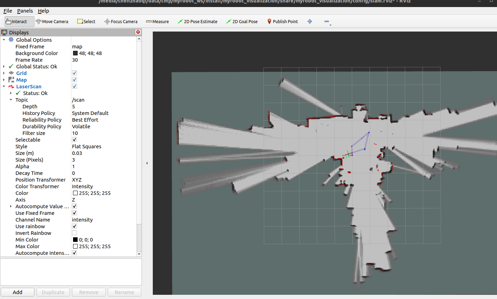


## 5. 视觉SLAM建图

### 5.1 复现步骤

所有终端均需要：`source ~/spacemit_robot/output/staging/setup.bash`

安装依赖：

```
sudo apt install 'ros-humble-rtabmap*' ros-humble-aruco-markers-msgs
```

**1、启动底盘**

```
ros2 launch linksee base_control_esos.launch.py
```

**2、启动雷达**

```
ros2 launch linksee start_ydlidar.launch.py
```

**3、启动里程计**

```
ros2 launch linksee start_odom.launch.py
```

**4、启动深度相机**

```
ros2 launch realsense2_camera rs_launch.py camera_namespace:=/
```

终端输出：


**步骤 5：启动 RGB-D 建图**

```bash
ros2 launch rtabmap_run rgbd_slam.launch.py
```

**预期现象**：`rtabmap`、`point_cloud_xyz`、`obstacles_detection` 等节点正常启动；开始发布 `/map`、`/camera/cloud`、`/camera/obstacles`、`/camera/ground`。

终端输出


**步骤 6：PC 端可视化**

```bash
source ~/visual_ws/install/setup.bash
ros2 launch visualization display_rgbd.launch.py
```

**预期现象**：RViz 中可看到 RGB-D 相关可视化结果、点云与地图更新。

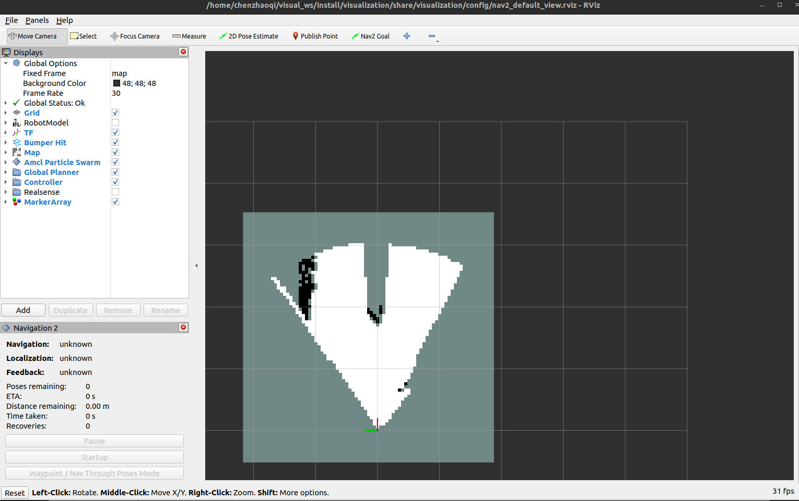

**步骤7：启动键盘控制**

```
ros2 run teleop_twist_keyboard teleop_twist_keyboard
```

使用键盘控制移动，扩大建图范围

### **5.2 运行效果**


## 6. Nav2导航

- 导航前请将激光雷达建好的地图拷贝到：`spacemit_robot/middleware/ros2/planning/nav2/map`，然后重新执行 lunch、m的全量编译，需要使用默认的 my_map 文件名。
- 确保小车在建图的起点

### 6.1 复现步骤

**1、启动底盘**

```
source ~/spacemit_robot/output/staging/setup.bash
```

```
ros2 launch linksee base_control_esos.launch.py
```

**2、启动雷达**

```
ros2 launch linksee start_ydlidar.launch.py
```

**3、启动里程计**

```
ros2 launch linksee start_odom.launch.py
```

**4、启动导航**

```
ros2 launch nav2 nav2.launch.py
```

终端输出


**5、PC端可视化**

```
source ~/visual_ws/install/setup.bash
ros2 launch visualization display_navigation.launch.py
```


### 6.2. 运行效果


## 7. 自动巡航

- 巡航前请将激光雷达建好的地图拷贝到：`spacemit_robot/middleware/ros2/planning/nav2/map`，然后重新执行 lunch、m的全量编译，需要使用默认的 my_map 文件名。
- 确保小车在建图的起点
- 巡航演示需要一个至少2*2m的空间

### 7.1 复现步骤

**1、启动底盘**

```
source ~/spacemit_robot/output/staging/setup.bash
```

```
ros2 launch linksee base_control_esos.launch.py
```

**2、启动雷达**

```
ros2 launch linksee start_ydlidar.launch.py
```

**3、启动里程计**

```
ros2 launch linksee start_odom.launch.py
```

**4、启动导航**

```
ros2 launch nav2 nav2.launch.py
```

终端输出


**5、启动巡航节点**

```
ros2 run nav2 autonomous_patrol
```

终端输出：

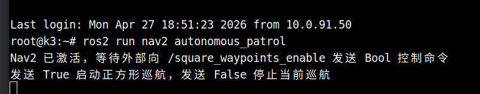

**6、开启巡航**

```
ros2 topic pub --once /square_waypoints_enable std_msgs/msg/Bool "{data: true}"
```

**7、PC端可视化**

```
source ~/visual_ws/install/setup.bash
ros2 launch visualization display_navigation.launch.py
```

### 7.2. 运行效果


## 8. 语音控制小车

**硬件连接：**

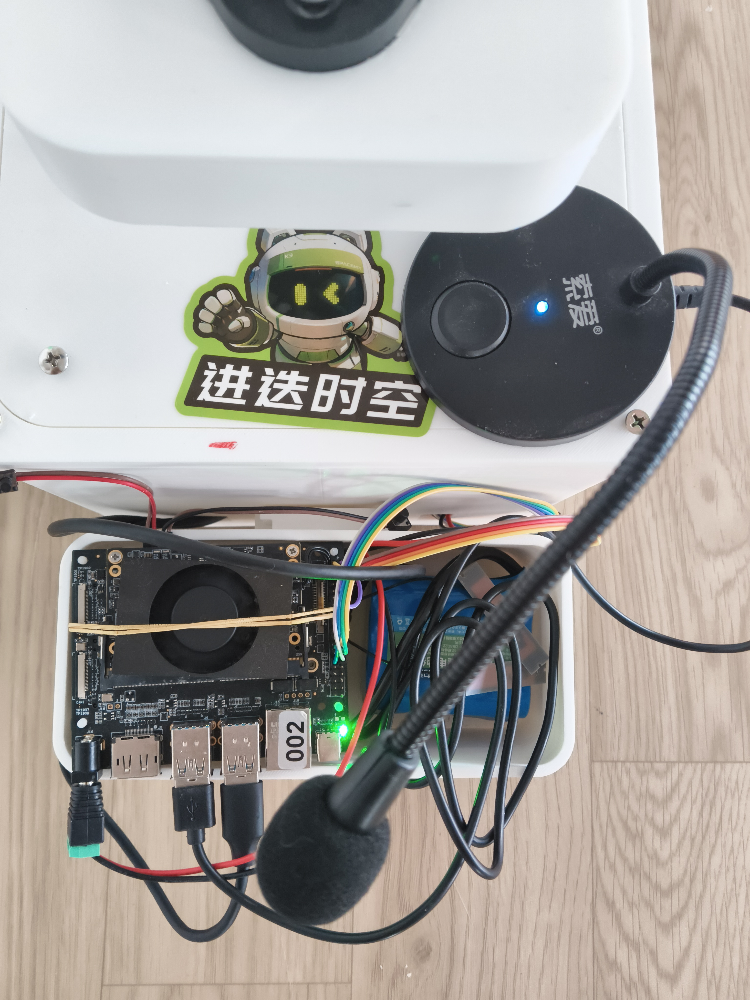

### 8.1 复现步骤

所有终端均需要：`source ~/spacemit_robot/output/staging/setup.bash`

**1、启动底盘**

```
ros2 launch linksee base_control_esos.launch.py
```

**2、启动雷达**

```
ros2 launch linksee start_ydlidar.launch.py
```

**3、启动里程计**

```
ros2 launch linksee start_odom.launch.py
```

**4、启动底盘语音控制**

```
ros2 launch linksee voice_cmd.launch.py
```

终端输出：

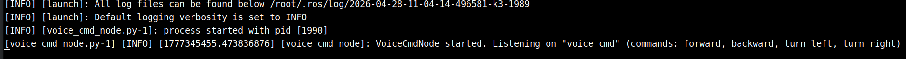

**5、启动分发节点**

```
ros2 run linksee voice_dispatcher_node.py
```

分发节点订阅语音转文字节点发布的 `/asr_text` 话题，并将文字解析为具体的指令

终端输出

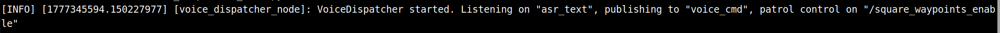

**6、启动语音转文字节点**

```
ros2 run linksee asr_node.py -r 48000
```

-r 指定麦克风的采样频率，根据实际情况做修改，其他参数见：`~/spacemit_robot/application/ros2/linksee/scripts/asr_node.py`

**预期输出**

语音输入：左转、右转、向前进、向后退，小车执行相应动作

终端输出：

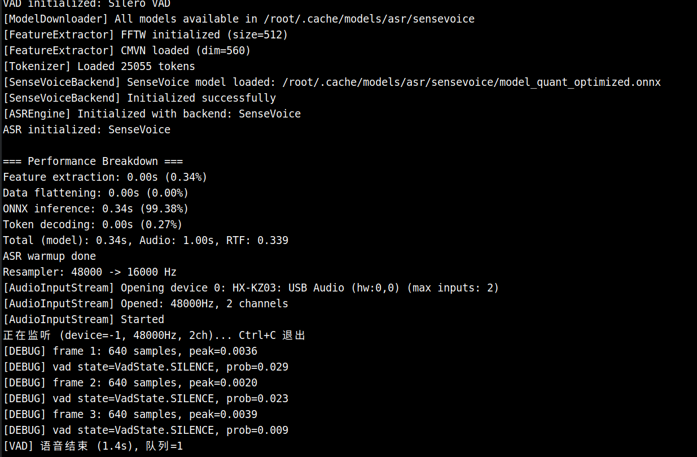

### 8.2 运行效果


## 9. Linksee 机器人端到端推理

本章节在现有 Linksee 移动机器人底盘、传感器与导航能力基础上，进一步整合移动抓取端到端控制方案。方案覆盖 Linksee 机器人数据采集、模型训练、部署推理，以及将推理能力封装为工具后，通过自然语言触发移动抓取任务的完整链路。

### 9.1 方案概述

本方案支持以下能力：

- **通信控制**：基于 Host/Client 架构完成 Linksee 机器人本体控制、观测采集与远程通信；
- **遥操作**：使用 SO101 主导臂控制 Linksee 手臂，使用键盘控制 Linksee 底盘，实现移动抓取遥操作；
- **数据采集**：采集包含机械臂、底盘和多路相机观测的端到端数据集；
- **模型训练**：基于采集数据训练 ACT 模型，并支持断点恢复训练；
- **推理测评**：将训练好的模型部署到推理端，完成 Linksee 机器人的端到端推理与评测；
- **自然语言控制**：将 Linksee 端到端推理流程封装为原生应用，通过 `mlink device → mlink gateway → MCP` 链路注册为 MCP工具，并集成到 Hermes Agent 框架中，支持使用自然语言控制 Linksee 机器人完成移动抓取任务。

Linksee 机器人端到端控制流程采用 Host/Client 分布式架构：

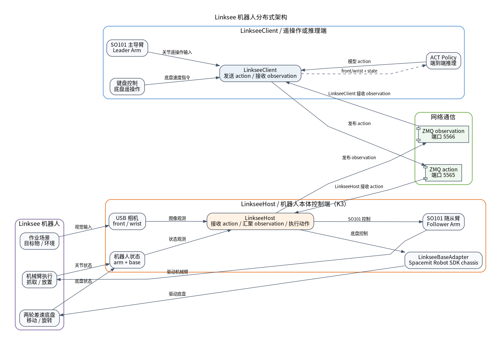

- `LinkseeHost` 连接 Linksee 机器人，负责实例化 Linksee，直接控制机械臂和底盘；
  - 机械臂通过 Lerobot 的 SO101 方案控制；
  - 底盘通过 `LinkseeBaseAdapter` 对接 Spacemit Robot SDK 的 `third_party/chassis` 共享库；
- `LinkseeClient` 负责将遥操信息或推理信息发送给 `LinkseeHost`；
  - 通过 ZMQ 发送 action；
  - 通过 ZMQ 接收 observation。

**`LinkseeHost` 和 `LinkseeClient` 可以部署在同一台设备上，也可以分别部署在不同设备上运行。**

### 9.2 硬件清单

| 项目                   | 内容                                                         |
| ---------------------- | ------------------------------------------------------------ |
| 硬件/整机              | Linksee 移动抓取机器人                                       |
| 训练平台               | 一台配置 RTX 系列及以上 GPU 的服务器                         |
| 遥操和数采平台（可选） | PC                                                           |
| 推理平台               | Spacemit K3 开发板 + Bianbu v3.0+ 固件                       |
| 机械臂                 | SO101 主导臂，遥操和数采需要                                 |
| 视觉输入               | 两个 USB 相机，示例中为 `front` 和 `wrist`                   |
| 关键外设与接口         | follower arm 串口通常为 `/dev/ttyACM0`；底盘串口通常为 `/dev/ttyACM1`；相机为 `/dev/video*` |

运行前请确认：

- Linksee 手臂、底盘和 USB 相机已连接到 K3 开发板；
- 遥操作和数采时，确保 SO101 主导臂已连接到 PC。

Linksee 手臂、底盘与相机通过 USB 连接到 K3 开发板：

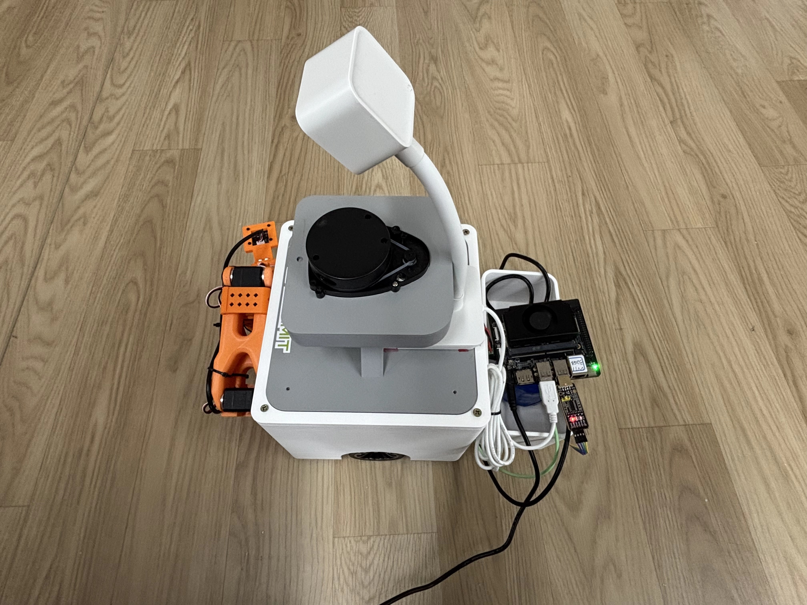

SO101 主导臂通过 USB 线连接到 PC：


### 9.3 场景一：Linksee 端到端控制流程

本场景覆盖 Linksee 移动抓取机器人从真机遥操作、数据采集，到 ACT 模型训练和推理的完整流程。

#### 9.3.1 环境搭建

> [!NOTE]
>
> 本场景涉及三个代码环境：
>
> 1. 遥操作和数采：PC 和 K3 开发板均需安装环境依赖；
> 2. 训练：GPU 服务器上需安装环境依赖；
> 3. 推理测评：仅 K3 开发板需安装环境依赖。

1. 克隆代码

```bash
git clone git@github.com:spacemit-robotics/lerobot.git
```

2. 安装系统依赖

```
sudo apt update

sudo apt install ffmpeg

sudo apt install -y \
  libavformat-dev \
  libavcodec-dev \
  libavdevice-dev \
  libavutil-dev \
  libavfilter-dev \
  libswscale-dev \
  libswresample-dev

sudo apt install -y \
  build-essential \
  cmake \
  pkg-config \
  python3-dev
```

- `python3-venv`：用于创建 Python 虚拟环境；
- `ffmpeg`：用于视频帧处理和数据集视频编码。

3. 安装 LeRobot 依赖

创建虚拟环境并安装依赖：

```bash
cd ~/lerobot

# 设置 python 版本为 3.12, 需先参考 《3.3.1-真机训练推理》的 3.3 节安装 pyenv 环境
pyenv local 3.12.13
python3 -V

# 创建并激活虚拟环境
python3 -m venv ~/.lerobot-venv
source ~/.lerobot-venv/bin/activate

# 安装 torch 和 wandb 依赖
pip install torch==2.7.1
pip install torchvision==0.22.0
pip install wandb==0.24.0
pip install pyarrow==23.0.0

# 安装 LeRobot 与 LeKiwi/Linksee 相关依赖
pip install -e .
pip install "lerobot[lekiwi]"
```

4. 构建 Linksee 底盘共享库

LinkseeHost 端进入仓库并构建底盘共享库：

```bash
cd ~/lerobot
./scripts/build_mars_chassis.sh
```

默认会产出：

```text
third_party/chassis/build/libchassis.so
```

如不使用默认 vendored 库路径，可在启动 Host 时通过 `--robot.base_control_library_path` 手动指定 `.so` 的绝对路径。

5. 将用户加入 video 组获取相机访问权限

```bash
sudo usermod -aG video $USER
```

`USER` 为当前系统用户名。设置之后需要重新登入系统以生效。

6. 确认机械臂和底盘、以及相机设备索引

```bash
# 查看机械臂和底盘设备节点
lerobot-find-port

# 查看相机设备节点
lerobot-find-cameras opencv
```

7. 设置机械臂和底盘设备权限为可读写

```
sudo chmod 666 /dev/ttyACM*
```

7. 将用户加入 video 组获取相机访问权限

```bash
sudo usermod -aG video $USER
```

`USER` 为当前系统用户名。设置之后需要重新登入系统以生效。

#### 9.3.2 启动 LinkseeHost

LinkseeHost 端进入仓库：

```bash
cd ~/lerobot
source ~/.lerobot-venv/bin/activate
```

启动 Host：

```bash
python -m lerobot.robots.linksee.linksee_host \
  --robot.id=my_linksee \
  --robot.port=/dev/ttyACM0 \
  --robot.base_driver=drv_uart_esp32 \
  --robot.base_dev_path=/dev/ttyACM1 \
  --robot.base_baud=115200 \
  --robot.base_type=diff_2wd \
  --robot.base_left_wheel_gain=1.0 \
  --host.port_zmq_cmd=5565 \
  --host.port_zmq_observations=5566 \
  --host.connection_time_s=3600 \
  --robot.cameras='{
    "front": {"type":"opencv","index_or_path":"/dev/video15","width":640,"height":480,"fps":30,"fourcc":"MJPG"},
    "wrist": {"type":"opencv","index_or_path":"/dev/video13","width":640,"height":480,"fps":30,"fourcc":"MJPG"}
  }'
```

> [!TIP]
>
> 1. 请根据实际系统中的端口号替换 `/dev/ttyACM0` 和 `/dev/ttyACM1`。
> 2. 请根据实际系统中的相机索引号替换 `front` 和 `wrist` 相机的索引 `ID`。
> 3. 首次启动会发起机械臂校准流程，校准过程参考 [SO101 机械臂校准流程](https://huggingface.co/docs/lerobot/en/so101#calibrate)。
> 4. 校准文件存放于 `~/.cache/huggingface/lerobot/calibration` 目录下。

常用 Host 启动参数说明：

| 参数                                | 说明                                                    |
| ----------------------------------- | ------------------------------------------------------- |
| `--robot.port`                      | 机器人侧 follower arm 串口                              |
| `--robot.base_dev_path`             | 机器人侧底盘串口                                        |
| `--robot.base_control_library_path` | 可选；不使用默认 vendored 库路径时，指定 `.so` 绝对路径 |
| `--robot.base_driver`               | 底盘驱动类型；真实底盘默认使用 `drv_uart_esp32`         |
| `--robot.base_baud`                 | UART 波特率                                             |
| `--robot.base_type`                 | 底盘模型，当前示例使用 `diff_2wd`                       |
| `--robot.base_left_wheel_gain`      | 左轮增益，用于底盘速度校准                              |
| `--host.port_zmq_cmd`               | Host 接收 Client action 的端口                          |
| `--host.port_zmq_observations`      | Host 对外发送 observation 的端口                        |
| `--host.connection_time_s`          | Host 运行时长上限，到时自动退出                         |
| `--robot.cameras`                   | 相机配置，示例包含 `front` 和 `wrist` 两路相机          |

> [!TIP]
>
> 建议在 UVC 相机上显式设置 `fourcc="MJPG"`，让相机直接输出 Motion-JPEG。这样通常能降低 USB 带宽压力，更容易稳定运行在 `640x480@30fps`；否则部分摄像头默认使用 `YUYV`，可能导致 Host 侧观测帧率不稳、录制掉帧或推理显示卡顿。

在 K3 开发板上，Linksee 底盘支持通过 RPMSG 驱动启用小核通信，如果选择使用 RPMSG 驱动，可将 UART 相关参数替换为：

```bash
--robot.base_driver=drv_rpmsg_esos \
--robot.base_rpmsg_ctrl_dev=/dev/rpmsg_ctrl0 \
--robot.base_rpmsg_data_dev=/dev/rpmsg0 \
--robot.base_rpmsg_service_name=rpmsg:motor_ctrl \
--robot.base_rpmsg_local_addr=1003 \
--robot.base_rpmsg_remote_addr=1002
```

#### 9.3.3 Client 端启动遥操作

遥操脚本位于：

```text
examples/linksee/teleoperate.py
```

至少修改以下代码片段：

```python
# 设置 Host IP 地址和 linksee 机器人手臂 hf_id
# 当 linksee_host_remote_ip 默认为 127.0.0.1 时，意味 LinkseeHost 和 Linksee Client 均在 K3 开发板端运行
robot_config = LinkseeClientConfig(remote_ip="linksee_host_remote_ip", id="my_linksee")

# 设置主导臂串口号和主导臂 hf_id
teleop_arm_config = SO101LeaderConfig(port="/dev/ttyACM0", id="my_linksee_leader")
```

确保 `Host` 处于连接状态，启动遥操作：

```bash
cd ~/lerobot
source ~/.lerobot-venv/bin/activate
python examples/linksee/teleoperate.py
```

遥操作过程中：

- SO101 主导臂控制 SO101 随从臂；
- 键盘控制 Linksee 底盘。

底盘键盘控制说明：

| 按键 | 功能                                           |
| ---- | ---------------------------------------------- |
| `w`  | forward                                        |
| `s`  | backward                                       |
| `a`  | left                                           |
| `d`  | right                                          |
| `z`  | rotate_left                                    |
| `x`  | rotate_right                                   |
| `r`  | speed_up                                       |
| `f`  | speed_down                                     |
| `q`  | 退出 teleop 循环，退出前发送一次零底盘速度命令 |

> [!NOTE]
>
> 对于两轮差速底盘，左右平移功能不支持。

#### 9.3.4 Client 端启动数据集采集

> [!TIP]
>
> 数采、录制、训练流程都可能涉及到 HuggingFace 账户登录，用于上传数据集和模型。
>
> ```bash
> hf auth login
> HF_USER=$(hf auth whoami | head -n 1 | awk '{print $3}')
> echo $HF_USER
> ```
>
> 如果不登录 Hugging Face，手动设置 $HF_USER 变量：
>
> ```bash
> HF_USER=annyi   # 改为自己的 hf 账户名
> echo $HF_USER
> ```


Client 端数采脚本位于：

```text
examples/linksee/record.py
```

需要修改以下代码片段：

```python
REMOTE_IP = "linksee_host_remote_ip"
ROBOT_ID = "my_linksee"
LEADER_PORT = "/dev/ttyACM0"
LEADER_ID = "my_linksee_leader"
KEYBOARD_ID = "my_keyboard"

NUM_EPISODES = 30
FPS = 30
EPISODE_TIME_SEC = 600
RESET_TIME_SEC = 30
TASK_DESCRIPTION = "pick and place the cube on the orange box"
# 数据集名称，训练和推理需用到
HF_REPO_ID = "${HF_USER}/linksee-pick-place-move-v2"
PUSH_TO_HUB = False
# 是否续采
RESUME = False
```

确保 `Host` 处于连接状态，启动数采：

```bash
cd ~/lerobot
source ~/.lerobot-venv/bin/activate
python examples/linksee/record.py
```

录制完成后，脚本会执行：

- `dataset.finalize()`；
- 当 `PUSH_TO_HUB=True` 且本次确实保存了 episode 时，执行 `dataset.push_to_hub()`。

续采功能：

- `RESUME = True`：在已有数据集上继续录制；
- `RESUME = False`：创建全新的数据集。

也可直接使用笔者采集的 [数据集](https://archive.spacemit.com/spacemit-ai/model_zoo/vla/act/datasets/linksee-pick-place-move-v2.tar.gz)，确保场景一致可复用于训练。数据集下载之后解压放至 `~/.cache/huggingface/lerobot/${HF_USER}/` 目录。

#### 9.3.5 训练 ACT 模型

数采完之后，将数据集放置到 GPU 服务器的 `lerobot/datasets` 目录，并开启训练。直接复用 LeRobot 通用训练入口：

```bash
lerobot-train \
  --policy.type=act \
  --policy.repo_id=${HF_USER}/linksee_act_pick_place_move_v2 \
  --dataset.repo_id=${HF_USER}/linksee-pick-place-move-v2 \
  --dataset.root=datasets/linksee-pick-place-move-v2 \
  --output_dir=outputs/train/linksee_act_pick_place_move_v2 \
  --job_name=linksee_act_pick_place_move_v2 \
  --batch_size=4 \
  --steps=100000 \
  --policy.device=cuda \
  --policy.use_amp=True
```

参数说明：

| 参数                | 说明                                     |
| ------------------- | ---------------------------------------- |
| `--policy.type=act` | 使用 ACT 策略训练                        |
| `--policy.repo_id`  | 训练完成后的模型标识                     |
| `--dataset.repo_id` | 训练数据集标识                           |
| `--dataset.root`    | 本地数据集路径，优先于 `dataset.repo_id` |
| `--output_dir`      | checkpoint 输出目录                      |
| `--job_name`        | 训练任务名称                             |
| `--batch_size`      | 训练 batch size                          |
| `--steps`           | 训练步数                                 |
| `--policy.device`   | 训练设备，通常为 `cuda`                  |
| `--policy.use_amp`  | 是否开启混合精度训练                     |

恢复训练示例：

```bash
lerobot-train \
  --config_path=outputs/train/linksee_act_pick_place_move_v2/checkpoints/last/pretrained_model/train_config.json \
  --resume=true
```

训练完成后，将模型 checkpoint 部署到推理端。模型路径示例：

```text
outputs/train/linksee_act_pick_place_move_v2/checkpoints/100000/pretrained_model
```

可按需下载笔者已训练好的 [模型权重](https://archive.spacemit.com/spacemit-ai/model_zoo/vla/act/linksee_act_pick_place_move_v2.tar.gz)。

#### 9.3.6 Client 端启动推理

推理脚本位于：

```text
examples/linksee/evaluate.py
```

需要修改以下代码片段：

```python
REMOTE_IP = "linksee_host_remote_ip"
ROBOT_ID = "my_linksee"
# 训练数据集名称
TRAIN_DATASET_REPO_ID = "${HF_USER}/linksee-pick-place-move-v2"
NUM_EPISODES = 1
FPS = 30
EPISODE_TIME_SEC = 180
RESET_TIME_SEC = 20
TASK_DESCRIPTION = "pick and place the cube on the orange box"
# 模型路径，精确到 pretrained_model
HF_MODEL_ID = "outputs/train/linksee_act_pick_place_move_v2/checkpoints/100000/pretrained_model"
# 测评数据集名称，与训练数据集区分
HF_DATASET_ID = "${HF_USER}/linksee-pick-place-move-v2-eval"
PUSH_TO_HUB = False
```

此外，还需要下载模型和训练数据集，后者用于测评数据集的创建：

- 模型正确放置到脚本指定位置；
- 训练数据集放置到 `~/.cache/huggingface/lerobot/${HF_USER}/` 目录。

确保 `Host` 处于连接状态，执行推理：

```bash
cd ~/lerobot
source ~/.lerobot-venv/bin/activate
python examples/linksee/evaluate.py
```

#### 9.3.7 运行效果

推理成功后，`LinkseeClient` 会根据模型输出的 action 控制 `LinkseeHost`，进而驱动 Linksee 机器人完成移动抓取任务：


### 9.4 场景二：自然语言控制 Linksee 机器人移动抓取

本场景将 Linksee 主机和客户端控制流程封装为 C++ 原生应用，并通过 `mlink device → mlink gateway → MCP → Hermes` 链路，提供可调用的 MCP 工具，并将其绑定到 Hermes Agent 框架中。用户可以在 Hermes Agent 框架中通过自然语言触发 `linksee.start_host`、`linksee.start_inference`、`linksee.stop_host` 和 `linksee.stop_inference`，实现 Linksee 端到端推理任务的启动与停止。

#### 9.4.1 模型和运行环境准备

##### 代码下载

先下载 Spacemit Robot SDK 代码：

```bash
mkdir spacemit_robot
cd spacemit_robot
repo init -u https://github.com/spacemit-robotics/manifest.git -b main -m default.xml \
  --repo-url=https://gitee.com/spacemit-robotics/git-repo
repo sync -j4
repo start robot-dev --all
```

Linksee 自然语言控制示例代码位于：

```text
spacemit_robot/application/ros2/linksee/linksee_app
```

该应用主要包含：

- `linksee_native`：本地命令行入口，用于直接启动或停止 Linksee host/推理流程；
- `linksee_device`：mlink 设备进程，用于向 gateway 动态注册 Linksee 工具；
- `scripts/run_host.py`：Linksee host 启动入口，封装 `lerobot.robots.linksee.linksee_host`；
- `scripts/evaluate.py`：Linksee ACT 推理入口，加载本地模型并记录评测数据；
- `scripts/start_host.sh`、`scripts/start_inference.sh`：后台启动 host 和推理进程；
- `scripts/stop_host.sh`、`scripts/stop_inference.sh`：停止 host 和推理进程。

首次运行前，请先确认机械臂、底盘和相机已经正确连接。硬件连接图可参考本章 `9.2` 节。

##### 模型准备

运行之前将训练好的模型复制到 models 目录下，笔者给出训练好的 [模型权重](https://archive.spacemit.com/spacemit-ai/model_zoo/vla/act/linksee_act_pick_place_move_v2.tar.gz)，有需要的用户可自行下载。

```text
spacemit_robot/application/ros2/linksee/linksee_app/models/linksee_act_pick_place_move_v2/checkpoints/100000/pretrained_model
```

默认推理评测数据集目录为：

```text
application/ros2/linksee/linksee_app/datasets/linksee_pick_place_move_v2_eval
```

每次启动推理前，`scripts/evaluate.py` 会检查模型目录是否存在，并清理旧的评测数据集目录，避免历史数据混入新结果。若实际模型路径或模型版本不同，请同步修改 `scripts/evaluate.py` 中的 `MODEL_DIR` 配置。

##### 数据集准备

运行推理需要根据训练数据集创建测评数据集实例，请先将训练数据集存放至 `~/.cache/huggingface/lerobot/${HF_USER}/` 目录。

笔者给出采集的 [训练数据集](https://archive.spacemit.com/spacemit-ai/model_zoo/vla/act/datasets/linksee-pick-place-move-v2.tar.gz)，如果场景一致，用户可复用。

##### 确认相机和机械臂设备索引

查看相机和机械臂设备索引，确保索引号与 `scripts/start_host.sh` 中配置一致。

##### 系统依赖安装

```bash
sudo apt update
sudo apt install -y python3-cryptography libssl-dev cargo rustc pkg-config build-essential python3-dev
```

##### 虚拟环境安装

Linksee 移动抓取流程依赖 Python 环境，首次运行前需要准备当前应用的虚拟环境：

```bash
# 进入 spacemit robot sdk，并设置环境变量
cd spacemit_robot
source build/envsetup.sh

# 设置 python 版本为 3.12
pyenv local 3.12.13
python3 -V

m_env_build application/ros2/linksee/linksee_app
```

或者进入应用目录安装：

```bash
cd application/ros2/linksee/linksee_app
bash scripts/setup_env.sh
```

脚本会在仓库根目录下准备虚拟环境：

```text
output/envs/linksee_app
```

##### 底盘库编译

```bash
cd components/thirdparty/lerobot
./scripts/build_mars_chassis.sh
```

#### 9.4.2 编译 mlink device 依赖

`linksee_device` 在编译时依赖 `mlink` 提供的头文件和动态库。编译 Linksee 原生应用前，先完成 `mlink device` 构建：

```bash
cd spacemit_robot
source build/envsetup.sh
cd components/agent_tools/mlink_device
mm
```

构建完成后，通常可看到以下产物：

```text
output/staging/include/mlink.h
output/staging/lib/libmlink_device.so
output/staging/bin/mlink_device_test
```

其中：

- `output/staging/include/mlink.h`：供 `linksee_device` 编译时引用的头文件；
- `output/staging/lib/libmlink_device.so`：供 `linksee_device` 链接及运行时加载的动态库；
- `output/staging/bin/mlink_device_test`：`mlink device` 组件自带测试程序。

#### 9.4.3 构建 Linksee 原生应用

进入目录构建：

```bash
cd spacemit_robot
source build/envsetup.sh
cd application/ros2/linksee/linksee_app
mm
```

构建完成后，产物安装到：

```text
output/staging/bin/linksee_native
output/staging/bin/linksee_device
```

- `output/staging/bin/linksee_native`：本地命令行执行入口；
- `output/staging/bin/linksee_device`：mlink 设备进程，用于向 gateway 动态注册工具并转发调用到 `linksee_native`。

如果只做本地调试，也可以使用独立 CMake：

```bash
cd application/ros2/linksee/linksee_app
cmake -B build -S .
cmake --build build
```

此时本地产物位于：

```text
build/linksee_native
build/linksee_device
```

#### 9.4.4 直接验证 Linksee 工具

可以先通过命令行直接验证 `linksee_native`：

```bash
linksee_native tool-start-host
linksee_native tool-start-inference
linksee_native tool-stop-inference
linksee_native tool-stop-host
```

命令说明：

| 命令                                  | 说明                                                         |
| ------------------------------------- | ------------------------------------------------------------ |
| `linksee_native tool-start-host`      | 启动 Linksee host 进程，连接机械臂、底盘和相机，并发布 observation |
| `linksee_native tool-start-inference` | 启动 Linksee ACT 推理进程，加载本地模型并向 host 发送 action |
| `linksee_native tool-stop-inference`  | 停止 Linksee 推理进程                                        |
| `linksee_native tool-stop-host`       | 停止 Linksee host 进程                                       |

`start_host.sh` 默认会在后台启动 host，并将日志和 PID 写入：

```text
/tmp/linksee_host.log
/tmp/linksee_host.pid
```

`start_inference.sh` 默认会在后台启动推理流程，并将日志和 PID 写入：

```text
/tmp/linksee_inference.log
/tmp/linksee_inference.pid
```

默认 host 启动脚本会使用如下设备配置：

```text
follower arm: /dev/ttyACM0
base device:  /dev/ttyACM1
front camera: /dev/video15
wrist camera: /dev/video13
```

如实际设备不同，请修改 `application/ros2/linksee/linksee_app/scripts/start_host.sh` 中的端口和相机配置。

#### 9.4.5 启动 mlink device 并验证工具注册

1. 启动 gateway：

```bash
cd spacemit_robot
source build/envsetup.sh
m_env_build components/agent_tools/mlink_gateway

source output/envs/mlink-gateway/bin/activate
mlink gateway restart
```

2. 启动 `linksee_device`：

```bash
linksee_device unix linksee
```

3. 检查 gateway 工具列表：

```bash
mlink gateway tools
```

若注册成功，应看到以下工具：

```text
linksee.start_host
linksee.start_inference
linksee.stop_host
linksee.stop_inference
```

#### 9.4.6 Hermes 自然语言调用

1. 安装 Hermes：

```bash
sudo apt-get update
sudo apt-get install --reinstall hermes-agent
```

2. 配置模型：

```bash
hermes model
```

随后按照命令行向导完成密钥和模型配置。

3. 绑定 MCP Servers

将本机 gateway 的 HTTP MCP endpoint 写入 Hermes 配置，将下述内容追加到 `~/.hermes/config.yaml`：

```yaml
mcp_servers:
    mlink-gateway:
        transport: http
        url: http://127.0.0.1:18765/mcp
        enabled: true
```

4. 启动交互式 CLI：

```bash
hermes
```

当 `mlink gateway` 已运行且 `linksee_device` 已连接后，Hermes 就能通过 MCP 看到 Linksee 相关工具。可在 Hermes CLI 中使用自然语言发起指令，例如：

- “启动 Linksee host”；
- “启动 Linksee 推理”；
- “停止 Linksee 推理”；
- “停止 Linksee host”。

Hermes 会将这些请求路由到对应 MCP tool，进而触发 `linksee_device` 回调 `linksee_native`，最终执行对应 shell 脚本。

#### 9.4.7 运行效果

在 K3 上打开 Hermes 终端，用自然语言与它对话，查询可调用的工具：


输入“启动 Linksee host”，后台将启动 `LinkseeHost`；输入“启动推理任务”，后台将启动 `LinkseeClient` 推理，控制 Linksee 移动抓取，运行效果如本章 `9.3.7` 节所示。

## 10. 感知抓取

`perceptive_grasp` 是面向 Linksee 轮式机器人的桌面闭环感知抓取应用。系统从 RGB-D 图像中检测并分割目标，通过深度反投影、eye-to-hand 手眼标定和三维几何规划生成顶抓或侧抓路径，再驱动底盘、机械臂和夹爪完成对齐、抓取、放置与安全恢复。

同一套 pipeline 支持三种发布模式：

| 运行模式 | 配置文件 | RGB-D 输入 | 执行后端 | 部署位置 |
| --- | --- | --- | --- | --- |
| Linksee 真机 | `config/grasp_pipeline.yaml` | RealSense D435i 或 `spacemit_las2` | Linksee SO101、夹爪和底盘 | K3 |
| PC 本地 MuJoCo | `config/grasp_pipeline_mujoco_ur5e.yaml` 和 `config/grasp_pipeline_remote_mujoco_ur5e.yaml` | MuJoCo 虚拟 RGB-D 相机 | MuJoCo UR5e | 仿真服务和 pipeline 均在 PC |
| PC/K3 远程 MuJoCo | 同上 | PC 提供的 MuJoCo 虚拟 RGB-D 相机 | PC 中的 MuJoCo UR5e | 服务在 PC，pipeline 在 K3 |

系统由以下模块组成：

- 感知输入：RealSense D435i、`spacemit_las2` 或 MuJoCo 后端，输出像素对齐的彩色图、深度图和相机内参。
- 目标检测：K3 使用 `vision_service`，PC 使用 OpenCV DNN；两者运行 YOLOv8-Seg 并输出目标类别、检测框和分割掩码。仿真配置还可以使用实例颜色细化或补充分割掩码。
- 三维估计：`grasp_geometry`，生成目标点云并估计桌面平面、三维尺寸和水平主轴。
- 任务控制：`grasp_pipeline` 完成目标关联、策略锁定、观察或底盘动作后的重感知、执行编排和失败恢复。
- 抓取规划：`grasp_planner` 和 `grasp_geometry` 生成并验证顶抓或侧抓候选。
- 机械臂执行：`spacemit_manipulator`、`grasp` 或 MuJoCo 执行器完成接近、夹取、抬升、放置、归位和失败恢复。
- 底盘对齐：`libchassis` 调整机器人与目标的相对位置。
- 语音交互：`spacemit_audio`、VAD、ASR 和 TTS 接收命令并播报状态。

本方案适用于桌面或近距离场景中的单目标抓取。底盘辅助不提供导航、避障和全局路径规划。

### 10.1 方案概述

下图以 Linksee 真机为主线展示感知抓取链路；MuJoCo 模式复用任务状态机和抓取规划，只替换 RGB-D 与机械臂执行后端：

1. **感知输入**：RGB-D 后端输出彩色图、对齐深度和相机内参。
2. **目标检测**：YOLOv8-Seg 输出目标类别、检测框和分割掩码，pipeline 在连续帧中关联同一目标并等待目标稳定。
3. **三维估计**：几何规划器生成目标点云并拟合桌面平面，估计目标长、宽、高和水平主轴，完成顶抓或侧抓初判。
4. **闭环规划**：pipeline 锁定抓取策略，进入对应观察位，并在观察动作或底盘动作后重新检测。候选需要通过工作空间、逆运动学（IK）、关节限制、桌面间隙和完整路径检查。
5. **机械臂执行**：Linksee 机械臂依次完成接近、夹取、抬升、放置、归位和失败恢复。

闭环规划还包含以下支路：

- **底盘辅助对齐**：目标超出舒适抓取区时，底盘执行短距离移动并停车，然后返回目标检测，重新获取彩色图像和深度信息。
- **语音交互**：ASR 向任务状态机输入抓取命令，TTS 播报任务状态。

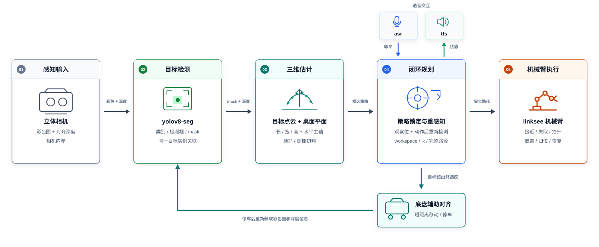

### 10.2 硬件准备

运行本方案需要以下硬件：

- Linksee 轮式机器人，提供 K3 计算平台、机械臂、差速底盘和机身结构。
- RGB-D 相机，支持 RealSense D435i 或 `spacemit_las2` 双目相机。
- 麦克风和扬声器，启用语音交互时需要。

实物连接如图所示：

<div style="display: grid; grid-template-columns: repeat(2, minmax(0, 1fr)); gap: 12px; align-items: start; max-width: 760px; margin: 0 auto;">
  
  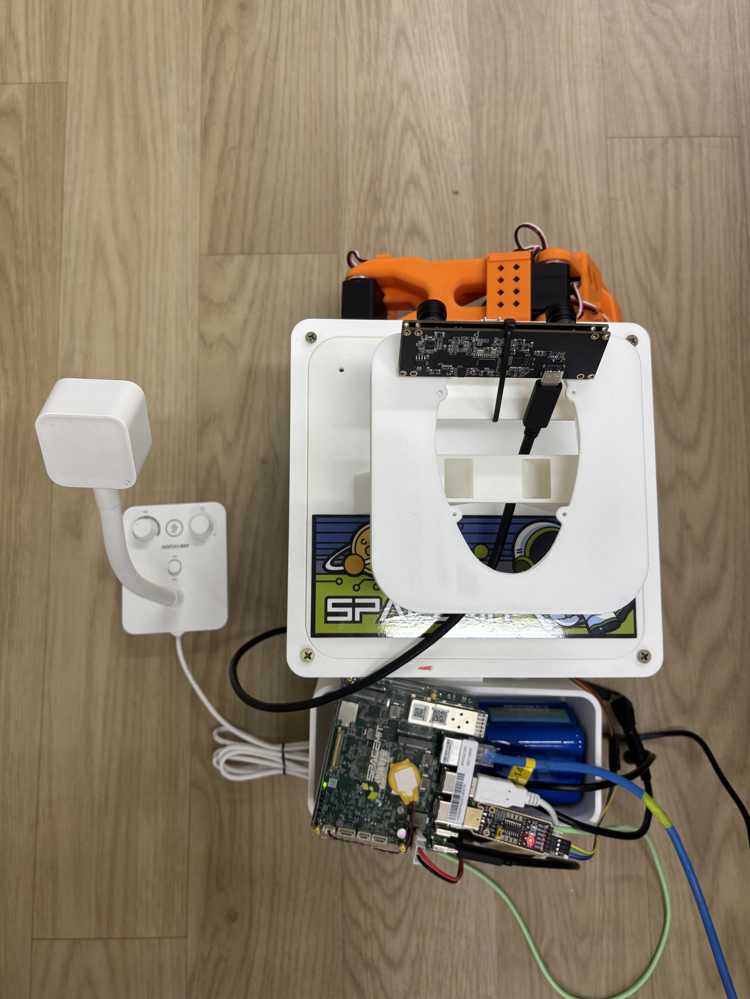
</div>

- 左图展示 RGB-D 相机面向机械臂工作区的安装方式。
- 右图展示 K3 与 RGB-D 相机、机械臂、底盘和音频设备的连接关系。
- 相机固定在机身顶部，机械臂工作区应同时位于彩色图像和有效深度范围内。

### 10.3 应用部署

#### 10.3.1 获取代码

以下命令默认 SDK 位于 `~/spacemit_robot`：

```bash
mkdir -p ~/spacemit_robot
cd ~/spacemit_robot
repo init -u https://github.com/spacemit-robotics/manifest.git \
  -b main \
  -m default.xml \
  --repo-url=https://gitee.com/spacemit-robotics/git-repo
repo sync -j4
repo start robot-dev --all
```

每次打开新终端后，先加载 SDK 环境：

```bash
cd ~/spacemit_robot
source build/envsetup.sh
```

#### 10.3.2 安装软件依赖

##### 安装公共依赖

1. 安装源码管理、构建、Python 和运动学依赖：

```bash
sudo apt update
sudo apt install -y \
  git \
  repo \
  wget \
  unzip \
  patchelf \
  cmake \
  build-essential \
  meson \
  ninja-build \
  python3-pip \
  python3-venv \
  v4l-utils \
  libyaml-cpp-dev \
  libeigen3-dev \
  libboost-all-dev \
  liburdfdom-dev
```

2. pinocchio 为机械臂提供正运动学和逆运动学计算。提前编译 pinocchio 库：

```bash
cd ~
git clone --recursive \
  -b v3.9.0 \
  https://github.com/stack-of-tasks/pinocchio.git

cmake -S ~/pinocchio -B ~/pinocchio/build \
  -DCMAKE_BUILD_TYPE=Release \
  -DCMAKE_INSTALL_PREFIX=/usr/local \
  -DBUILD_PYTHON_INTERFACE=OFF \
  -DBUILD_TESTING=OFF \
  -DBUILD_WITH_COLLISION_SUPPORT=OFF
cmake --build ~/pinocchio/build -j"$(nproc)"
sudo cmake --install ~/pinocchio/build
sudo ldconfig
```

3. 创建 Python 虚拟环境：

```bash
cd ~/spacemit_robot/application/ros2/linksee/perceptive_grasp
python3 -m venv ~/.venv-grasp
source ~/.venv-grasp/bin/activate
python3 -m pip install --upgrade pip
python3 -m pip install -r requirements.txt
```

##### 构建 SDK 组件

`mm` 会将公共头文件和动态库安装到 `~/spacemit_robot/output/staging`。按以下顺序构建组件：

1. 激活 SDK 环境变量

```bash
cd ~/spacemit_robot
source build/envsetup.sh
```

2. 底盘控制组件提供 uart 驱动，用于短距离前后移动和原地转向。

```bash
cd components/control/base
mm

ls ~/spacemit_robot/output/staging/include/chassis.h
ls ~/spacemit_robot/output/staging/lib/libchassis.so
```

3. 视觉推理组件提供 `vision_service` 接口，并通过 SpaceMIT EP 在 X100 AI 核上执行 YOLOv8-Seg 推理。

```bash
cd ~/spacemit_robot/components/model_zoo/vision
mm

ls ~/spacemit_robot/output/staging/include/vision_service.h
ls ~/spacemit_robot/output/staging/lib/libvision.so
```

4. 夹爪控制组件提供夹爪开合、力度控制和夹持状态读取接口。

```bash
cd ~/spacemit_robot/components/control/grasp
mm

ls ~/spacemit_robot/output/staging/include/grasp.h
ls ~/spacemit_robot/output/staging/lib/libgrasp.so
```

5. 机械臂控制组件提供 Linksee 机械臂驱动、关节运动、直线运动和运动学接口。

```bash
cd ~/spacemit_robot/components/control/manipulator
mm

ls ~/spacemit_robot/output/staging/include/manipulator.h
ls ~/spacemit_robot/output/staging/lib/libmanipulator.so
```

##### 准备检测模型

下载 YOLOv8-Seg 模型并安装 COCO 标签：

```bash
cd ~/spacemit_robot/components/model_zoo/vision/examples/yolov8_seg
bash scripts/download_models.sh

mkdir -p ~/.cache/models/vision/labels
cp ~/spacemit_robot/components/model_zoo/vision/assets/labels/coco.txt \
  ~/.cache/models/vision/labels/coco.txt

ls ~/.cache/models/vision/yolov8_seg/yolov8n-seg.q.onnx
ls ~/.cache/models/vision/labels/coco.txt
```

##### 准备 RGB-D 相机后端

应用只初始化 `camera.type` 选中的后端。CMake 自动探测本机已安装的后端。运行时选择的后端必须包含在构建摘要中。

- 使用 RealSense D435i 时，安装运行库和工具：

```bash
sudo apt install -y ros-humble-librealsense2
source /opt/ros/humble/setup.sh
rs-enumerate-devices --version
```

- 使用 `spacemit_las2` 时，从托管站点下载运行时和深度模型。默认目录为 `~/las2_runtime`，无需额外设置环境变量：

```bash
cd ~
wget -O las2_runtime_handoff.zip \
  https://archive.spacemit.com/spacemit-ai/model_zoo/vla/libs/las2/las2_runtime_handoff.zip
unzip -oq las2_runtime_handoff.zip

mkdir -p ~/las2_runtime/models
wget -O ~/las2_runtime/models/LAS2_M_256x320.fp16.iofp32.corr_func_nhwc.gelu.onnx \
  https://archive.spacemit.com/spacemit-ai/model_zoo/vla/libs/las2/LAS2_M_256x320.fp16.iofp32.corr_func_nhwc.gelu.onnx

ls ~/las2_runtime/include/las2_usb_stereo.h
ls ~/las2_runtime/lib/liblas2_usb_stereo.so
ls ~/las2_runtime/models/LAS2_M_256x320.fp16.iofp32.corr_func_nhwc.gelu.onnx
ls ~/las2_runtime/config/matlab_stereo_opencv.json
```

`spacemit_las2` 使用双目标定文件计算深度和三维坐标。

##### 准备语音模型（可选）

只使用命令行抓取时可以跳过本节。本地语音桥需要 VAD、ASR、TTS 和中文文本规范化资源：

```bash
mkdir -p ~/.cache/models/asr
cd ~/.cache/models/asr
wget -O sensevoice.tar.gz \
  https://archive.spacemit.com/spacemit-ai/model_zoo/asr/sensevoice.tar.gz
tar -xzf sensevoice.tar.gz

# 使用 Qwen3-ASR 时安装 K3 优化运行时并准备模型
sudo apt install -y llama.cpp-tools-spacemit
mkdir -p ~/.cache/models/asr/qwen3asr
cd ~/.cache/models/asr/qwen3asr
wget -O qwen3-asr-0.6B-dynq-q40.tar.gz \
  https://archive.spacemit.com/spacemit-ai/model_zoo/asr/qwen3-asr-0.6B-dynq-q40.tar.gz
tar -xzf qwen3-asr-0.6B-dynq-q40.tar.gz
rm -f qwen3-asr-0.6B-dynq-q40.tar.gz

mkdir -p ~/.cache/models/vad/silero
wget -O ~/.cache/models/vad/silero/silero_vad.onnx \
  https://archive.spacemit.com/spacemit-ai/model_zoo/vad/silero/silero_vad.onnx

mkdir -p ~/.cache/models/tts/matcha-tts
cd ~/.cache/models/tts/matcha-tts
wget -O matcha-icefall-zh-baker.tar.gz \
  https://archive.spacemit.com/spacemit-ai/model_zoo/tts/matcha-tts/matcha-icefall-zh-baker.tar.gz
tar -xzf matcha-icefall-zh-baker.tar.gz

mkdir -p ~/.cache/models/tts/vocoder
wget -O ~/.cache/models/tts/vocoder/vocos-22khz-univ.q.onnx \
  https://archive.spacemit.com/spacemit-ai/model_zoo/tts/vocoder/vocos-22khz-univ.q.onnx

mkdir -p ~/.cache/models/tts/text_norm/v1/zh
cd ~/.cache/models/tts/text_norm/v1/zh
wget https://archive.spacemit.com/spacemit-ai/model_zoo/tts/text_norm/v1/zh/date.fst
wget https://archive.spacemit.com/spacemit-ai/model_zoo/tts/text_norm/v1/zh/new_heteronym.fst
wget https://archive.spacemit.com/spacemit-ai/model_zoo/tts/text_norm/v1/zh/number.fst
wget https://archive.spacemit.com/spacemit-ai/model_zoo/tts/text_norm/v1/zh/phone.fst
```

Qwen3-ASR 媒体后端需要 `llama.cpp-tools-spacemit 0.1.7` 或更高版本。应用在选择 `qwen3_asr` 后会自动启动本机 `llama-server`，无需单独常驻服务。

#### 10.3.3 选择发布配置并设置 RGB-D 后端

三份发布配置分别用于 Linksee 真机、PC MuJoCo 服务和远程 MuJoCo pipeline。首次运行环境检查前，先选择与部署模式匹配的配置文件：

| 配置文件 | 用途 | 需要现场修改的内容 |
| --- | --- | --- |
| `config/grasp_pipeline.yaml` | Linksee 真机抓取 | RGB-D 后端、设备路径、手眼标定、机械臂与底盘串口、音频设备 |
| `config/grasp_pipeline_mujoco_ur5e.yaml` | PC MuJoCo 服务 | 监听地址、端口和场景资源路径 |
| `config/grasp_pipeline_remote_mujoco_ur5e.yaml` | PC 或 K3 连接仿真服务 | `remote_mujoco.host`、端口和可选音频设备 |

真机主配置为 `config/grasp_pipeline.yaml`，至少完成以下设置：

- 通过 `camera.type` 选择 RGB-D 相机后端。
- 填写所选后端需要的设备、模型和标定文件路径。
- 其他参数保留发布配置中的默认值。

##### RealSense D435i 深度相机

使用 RealSense D435i 时配置为：

```yaml
camera:
  type: "realsense"
  realsense:
    width: 640
    height: 480
    fps: 30
    motion_flush_frames: 30
    align_depth: true
    depth_filter:
      spatial: true
      temporal: false
      hole_filling: false
```

##### `spacemit_las2` 双目相机

使用 `spacemit_las2` 时，先连接双目相机并查询稳定的视频设备路径：

```bash
ls -l /dev/v4l/by-id/*-video-index0
```

完成以下准备后配置 `spacemit_las2`：

- 将输出中指向双目相机的 `/dev/v4l/by-id/...-video-index0` 路径写入 `video_device`。
- 确认模型和双目标定文件位于 `~/las2_runtime`。

```yaml
camera:
  type: "spacemit_las2"
  spacemit_las2:
    video_device: "/dev/v4l/by-id/<video-index0>"
    model_path: "~/las2_runtime/models/LAS2_M_256x320.fp16.iofp32.corr_func_nhwc.gelu.onnx"
    calib_path: "~/las2_runtime/config/matlab_stereo_opencv.json"
    core_count: 1
    core_affinity: "8"
    depth:
      min_m: 0.05
      max_m: 2.0
```

`spacemit_las2` 参数说明如下：

- `model_path`：`spacemit_las2` 深度模型路径。
- `calib_path`：当前双目相机的标定文件路径。
- `core_count`：深度推理会话数。默认使用一个会话，减少 X100 AI 核竞争，并将其余 AI 核留给 YOLOv8-Seg。
- `core_affinity`：每个会话绑定的 X100 AI 逻辑核，有效范围为 `8–15`，条目数必须与 `core_count` 一致。

##### 目标检测

目标检测使用 YOLOv8-Seg 和 SpaceMIT EP。发布配置如下：

```yaml
detection:
  config_path: yolov8_seg.yaml
  target_labels: []
  min_confidence: 0.10
  min_area: 1000
  stable_frames: 3
```

- `target_labels` 为空时检测全部 COCO 类别。
- `min_confidence` 和 `min_area` 分别过滤低置信度和过小目标。
- `stable_frames` 表示目标检测框的位置和面积连续稳定多少帧后进入规划。目标仍在移动时，pipeline 保持在检测阶段。

#### 10.3.4 构建应用

从项目根目录构建：

```bash
cd ~/spacemit_robot/application/ros2/linksee/perceptive_grasp
source ~/spacemit_robot/build/envsetup.sh
cmake -S . -B build
cmake --build build -j"$(nproc)"
ctest --test-dir build --output-on-failure

source ~/.venv-grasp/bin/activate
python3 -m unittest discover -s tests -p 'test_*.py'
```

构建目录中的 `perceptive_grasp` 是结构化日志启动器，`perceptive_grasp_core` 是实际执行 pipeline 的 C++ 程序。正常运行使用启动器。

重要构建选项如下：

- `ENABLE_LAS2_CAMERA`：控制是否构建 `spacemit_las2` 后端，默认开启。只使用 RealSense 后端且未准备 LAS2 运行时时，可设置为 `OFF`。
- `ENABLE_WEBRTC_AEC`：控制是否构建 WebRTC 软件回声消除模块，默认开启。使用 `hardware_aec`、`half_duplex` 或不启用语音时可设置为 `OFF`。
- `ENABLE_ROS2_VOICE`：控制是否构建基于 ROS 2 `std_msgs/String` 的语音话题桥，默认关闭。本节使用的本地语音桥不依赖该选项。
- `ENABLE_MUJOCO_EXECUTOR`：控制是否构建 PC 端 MuJoCo 仿真服务和本地仿真后端，默认关闭。
- `ENABLE_REMOTE_MUJOCO`：控制是否构建 `remote_mujoco` 相机和机械臂客户端，默认关闭。PC 与 K3 分离运行仿真时需要开启。
- `X86_STANDALONE`：启用 x86 主机侧规划和调试构建，同时使用 OpenCV DNN 检测器和 mock 执行器。该模式不控制真实机械臂和底盘。
- `LAS2_RUNTIME_DIR`：指定非默认的 `spacemit_las2` 运行时目录。运行时位于 `~/las2_runtime` 时无需设置。

默认构建启用 WebRTC AEC。首次配置时会下载固定版本的 `webrtc-audio-processing`，并缓存到 `~/.cache/thirdparty`。配置日志应包含：

```text
-- [Voice] WebRTC AEC enabled
```

例如，只构建 RealSense 后端并关闭软件回声消除：

```bash
cmake -S . -B build \
  -DENABLE_LAS2_CAMERA=OFF \
  -DENABLE_WEBRTC_AEC=OFF
cmake --build build -j"$(nproc)"
```

构建摘要应显示真实硬件执行器、`vision_service` 检测器以及至少一个可用相机后端，例如：

```text
=== perceptive_grasp Build Summary ===
  Detector:  VisionService
  Executor:  Real hardware
  Camera:    realsense, spacemit_las2
```

`Camera` 只列出本次构建可用的后端。实际运行后端由 `camera.type` 选择。

#### 10.3.5 硬件配置和运行前检查

连接设备前关闭机械臂和底盘动力。运行用户需要访问串口、视频和音频设备：

```bash
sudo usermod -aG dialout,video,audio "$USER"
exec su - "$USER"
```

使用 `spacemit_las2` 时，还需要允许 `video` 用户组访问 DMA heap：

```bash
echo 'SUBSYSTEM=="dma_heap", KERNEL=="system", GROUP="video", MODE="0660"' | \
  sudo tee /etc/udev/rules.d/99-las2-dma-heap.rules
sudo udevadm control --reload-rules
sudo chgrp video /dev/dma_heap/system
sudo chmod 0660 /dev/dma_heap/system
```

连接硬件后首次执行运行环境检查：

```bash
cd ~/spacemit_robot/application/ros2/linksee/perceptive_grasp
source ~/spacemit_robot/build/envsetup.sh
source ~/.venv-grasp/bin/activate
python3 scripts/check_runtime_env.py \
  --config config/grasp_pipeline.yaml \
  --build-dir build \
  --no-fix
```

运行环境检查包括：

- 根据 `camera.type` 检查相机设备、运行库、模型和标定文件。
- 识别机械臂、底盘和音频设备。
- 给出机械臂和底盘的稳定串口路径。

设备路径尚未更新时，首次检查可以出现 `[FAIL]`：

```text
[SUGGEST] manipulator.uart_device: "/dev/serial/by-id/..."
[SUGGEST] mobile_base.dev_path: "/dev/serial/by-id/..."
```

##### 配置机械臂和底盘

根据检查结果更新机械臂和底盘的稳定串口路径。以下内容摘自发布配置，用于核对现场必改字段和安全相关默认值；不要用该片段替换完整配置文件。

```yaml
manipulator:
  uart_device: "/dev/serial/by-id/<机械臂串口>"
  urdf_path: "../urdf/so101.urdf"
  home_joints: [1.546, -1.765, 1.400, 1.093, 0.186]
  observe_joints: [1.544, -0.067, 0.101, 1.382, 0.188]
  side_ready_joints: [1.550, 0.021, 1.400, -1.700, -0.036]
  joint_limits:
    - {joint: 0, min: -1.540, max: 1.630}
    - {joint: 1, min: -1.770, max: 1.680}
    - {joint: 2, min: -1.840, max: 1.430}
    - {joint: 3, min: -1.790, max: 1.670}
    - {joint: 4, min: -2.700, max: 2.800}

place:
  place_joints: [-1.500, -0.122, 0.101, 1.383, 0.330]
  release_open: 0.5

mobile_base:
  enabled: true
  dev_path: "/dev/serial/by-id/<底盘串口>"
  target_x: 0.275
  x_tolerance: 0.035
  y_tolerance: 0.15
  max_step_m: 0.12
  linear_speed: 0.20
  angular_speed: 1.2
  min_cmd_duration_ms: 350
  max_align_attempts: 6
  max_total_travel_m: 0.24
```

- `target_x ± x_tolerance` 定义目标的前向舒适区。
- `y_tolerance` 定义相对机械臂基座中心线的横向允许偏差。
- `max_align_attempts` 和 `max_total_travel_m` 限制单轮任务的底盘对齐次数和累计直线移动距离。
- `observe_joints` 和 `side_ready_joints` 分别定义顶抓与侧抓观察姿态。
- `home_joints` 和 `place_joints` 分别定义任务归位姿态和放置姿态。更换机械臂后，应在完成关节标定的前提下重新确认这些预定义姿态。
- 底盘将目标移入舒适区后，pipeline 仍会执行机械臂工作空间和逆运动学可达性检查。

##### 配置抓取策略

`grasp.strategy` 支持 `auto`、`top` 和 `side`。发布配置使用 `auto`，根据目标三维高度、水平尺寸和候选可达性选择顶抓或侧抓，不读取目标类别。

```yaml
grasp:
  strategy: "auto"
  top:
    approach_height: 0.10
    grasp_depth: 0.015
    gripper_offset: 0.0
    grasp_point_x_ratio: 1.0
    position_source: "mask_depth"
    safe_mask_interior: false
    support_plane_occlusion_recovery: false
    support_plane_height_anchor: false
    minimum_grasp_height: 0.0
    verification_lift_m: 0.0
    gripper_open: 0.6
  side:
    min_height_m: 0.060
    min_height_width_ratio: 1.0
    approach_distance_m: 0.020
    entry_clearance_m: 0.030
    pregrasp_min_x_m: 0.270
    single_sided_gripper: true
    gripper_offset_m: 0.010
    grasp_forward_offset_m: 0.020
    grasp_height_ratio: 0.60
    initial_lift_m: 0.050
    lift_retreat_m: 0.025
  gripper_effort: 0.8
  gripper_hold_load_threshold: 100.0
  gripper_empty_position_margin: 0.03
  gripper_timeout_ms: 3000
  geometry:
    sample_stride: 2
    max_object_points: 4000
    min_object_points: 80
    plane_distance_threshold_m: 0.008
    table_clearance_m: 0.005
    footprint_padding_m: 0.005
    gripper_max_width_m: 0.10
    planning_timeout_ms: 750
    perception_budget_ms: 500
  workspace:
    x_min: 0.0
    x_max: 0.5
    y_min: -0.3
    y_max: 0.3
    z_min: 0.0
    z_max: 0.20
```

- `top` 参数只影响顶抓，`side` 参数只影响侧抓，两组参数不会互相覆盖。
- `side.min_height_m` 和 `side.min_height_width_ratio` 共同定义 `auto` 首次选择侧抓的三维形状门限。
- `side.entry_clearance_m` 控制机械臂从观察位进入侧抓区域时，夹爪下缘高于目标最高点的安全距离。
- `side.approach_distance_m` 定义预抓取位到抓取位的水平进给距离；`side.grasp_forward_offset_m` 对整套侧抓位姿施加前后补偿，不改变进给距离。
- `geometry` 控制目标点云、桌面平面、夹爪宽度和候选规划约束。
- `geometry.perception_budget_ms` 是性能告警预算。超过预算时记录 `OVERRUN`，但不会仅因耗时超限而终止安全候选。
- `workspace` 是机械臂动作前的安全边界。底盘对齐不会绕过工作空间和 IK 检查。
- 夹爪负载和闭合位置共同用于判断是否抓住目标。

##### 配置语音设备（可选）

启用本地语音交互时，根据检查结果更新采集设备和播放设备编号：

```yaml
voice:
  echo_cancellation:
    mode: "webrtc_aec"
    delay_ms: 50
    noise_suppression: true
    high_pass_filter: true

  asr:
    backend: "sensevoice"
    device: 1
    device_name: ""
    rate: 16000
    channels: 1
    channel_index: -1
    mixer_volume: 40
    vad_trigger_threshold: 0.4
    vad_stop_threshold: 0.3
    vad_min_speech_duration_ms: 100
    vad_endpoint_hold_ms: 600
    vad_max_speech_duration_ms: 4000

  tts:
    enabled: true
    engine: "matcha:zh"
    playback_device: 1
    playback_device_name: ""
    playback_rate: 48000
    channels: 1
    speed: 1.0
    volume: 80
    mixer_volume: 80
    speak_all_states: false
```

语音设备参数说明如下：

- `echo_cancellation.mode`：普通麦克风和扬声器组合使用 `webrtc_aec`；音频硬件已输出消除回声后的录音流时使用 `hardware_aec`；无法使用回声消除时使用 `half_duplex`。
- `echo_cancellation.delay_ms`：扬声器播放到回声进入麦克风的估计延迟，仅用于 `webrtc_aec`。
- `asr.backend`：ASR 后端，可选 `sensevoice` 或 `qwen3_asr`。
- `asr.device_name`：采集设备名称。非空时优先按名称解析当前设备编号；未配置时使用 `asr.device`。
- `asr.device`：采集设备编号。
- `tts.enabled`：是否启用状态语音播报。
- `tts.playback_device_name`：播放设备名称。非空时优先按名称解析当前设备编号；未配置时使用 `tts.playback_device`。
- `tts.playback_device`：播放设备编号。
- `rate`、`playback_rate` 和 `channels`：录音与播放格式，应与所选设备支持的格式一致。
- `mixer_volume`：启动时设置的 ALSA 录音增益或 `PCM` 音量，设为 `-1` 时不修改 mixer。

设备不支持默认格式时，语音桥会探测可用格式并输出最终选择结果。

`hardware_aec` 和 `webrtc_aec` 在 TTS 播放期间保持 VAD 和 ASR 连续运行。`half_duplex` 会在 TTS 播放期间暂停语音识别。

##### 复查运行环境

更新配置并修正其他 `[FAIL]` 项后，重新执行检查：

```bash
python3 scripts/check_runtime_env.py \
  --config config/grasp_pipeline.yaml \
  --build-dir build \
  --no-fix
```

环境可运行时，最后一行显示：

```text
[SUMMARY] ready
```

#### 10.3.6 执行手眼标定

`perceptive_grasp` 使用 eye-to-hand 标定计算 RGB-D 相机坐标系到机械臂基座坐标系的变换。安装如图所示，要求如下：

- RGB-D 相机固定在机身上。
- ChArUco 标定板刚性固定在夹爪末端。

<p align="center">
  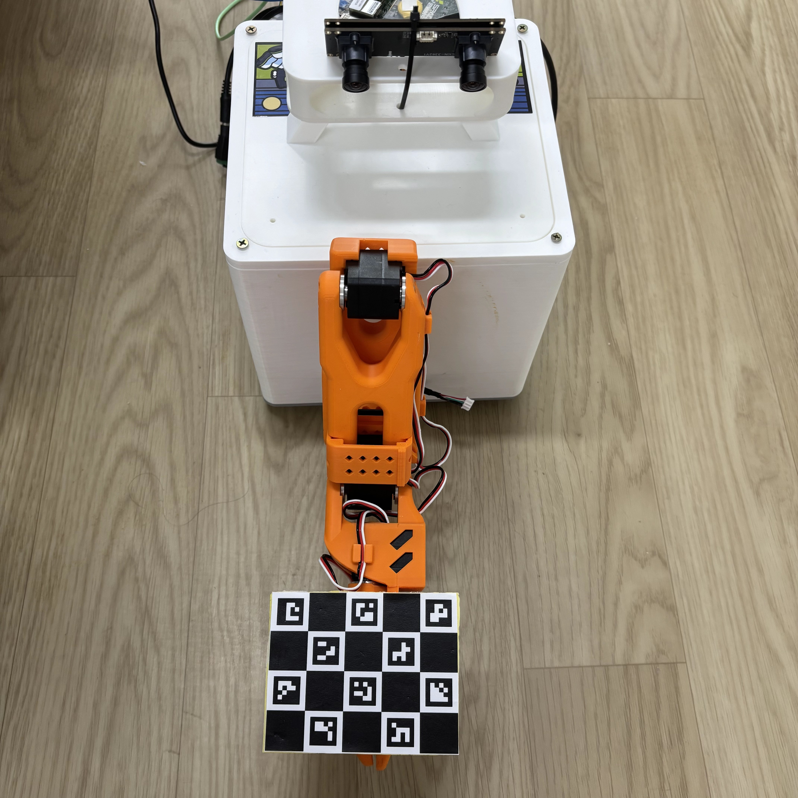
</p>

##### 标定板生成

生成 4 × 5 ChArUco 标定板：

```bash
cd ~/spacemit_robot/application/ros2/linksee/perceptive_grasp
source ~/spacemit_robot/build/envsetup.sh
source ~/.venv-grasp/bin/activate
python3 scripts/generate_charuco_board.py \
  --squares-x 4 \
  --squares-y 5 \
  --square-length 0.020 \
  --marker-length 0.014 \
  --output config/charuco_4x5_20mm_14mm.png
```

##### 数据采集

采集数据时满足以下要求：

- 标定板尺寸使用打印后的实测值。
- 采集至少 15 个有效姿态。
- 姿态应覆盖左、中、右、高、低和不同腕部角度。

```bash
python3 scripts/calibrate_hand_eye.py \
  --config config/grasp_pipeline.yaml \
  --charuco-squares-x 4 \
  --charuco-squares-y 5 \
  --charuco-square-length 0.020 \
  --charuco-marker-length 0.014 \
  --num-poses 15 \
  --dataset-dir "config/hand_eye_datasets/handeye_$(date +%Y%m%d_%H%M%S)"
```

##### 标定结果写入

将 `<dataset>` 替换为采集命令生成的数据集目录，求解并写回配置：

```bash
python3 scripts/calibrate_hand_eye.py \
  --solve-only \
  --dataset-dir config/hand_eye_datasets/<dataset> \
  --apply-config config/grasp_pipeline.yaml
```

脚本会更新 `calibration.<camera.type>.T_base_camera` 并备份原配置，不会覆盖其他相机后端的手眼标定结果。

##### 标定结果验证

使用定位工具验证目标在机械臂基座坐标系中的位置：

```bash
./build/debug_localize \
  --config config/grasp_pipeline.yaml \
  --target banana \
  --frames 5 \
  --output /tmp/debug_localize
```

根据定位结果检查标定质量：

- `base_point_m` 应与目标相对机械臂基座的实测位置一致。
- 存在稳定偏差时，检查标定板尺寸、采集姿态覆盖和相机固定情况。
- 不要使用抓取偏移掩盖标定误差。

#### 10.3.7 运行抓取

**以下命令会初始化真实硬件，其中非 `--plan-only` 命令会驱动机械臂和底盘。运行前清理机器人工作空间，确认急停和断电装置可用，并保持人员远离运动范围。**

先验证配置结构。该命令不初始化硬件：

```bash
./build/perceptive_grasp_core \
  --config config/grasp_pipeline.yaml \
  --validate-config
```

输出包含 `[Config] valid` 时，配置字段和取值通过检查。

先使用 `--plan-only` 验证目标感知、抓取策略和机械臂路径。该模式会初始化硬件并读取机械臂状态，但不会发送机械臂或底盘运动命令：

```bash
cd ~/spacemit_robot/application/ros2/linksee/perceptive_grasp
source ~/spacemit_robot/build/envsetup.sh
./build/perceptive_grasp \
  --config config/grasp_pipeline.yaml \
  --target cup \
  --plan-only
```

确认规划成功后执行真实抓取：

```bash
cd ~/spacemit_robot/application/ros2/linksee/perceptive_grasp
source ~/spacemit_robot/build/envsetup.sh
./build/perceptive_grasp \
  --config config/grasp_pipeline.yaml \
  --target banana
```

程序按以下流程运行：

1. `DETECTING` 关联连续帧中的同一目标，并等待检测框的位置和面积满足稳定条件。
2. `PLANNING` 生成目标点云、拟合桌面平面并计算顶抓或侧抓候选。目标位置需要调整时，pipeline 进入 `BASE_ALIGNING`，停车后返回 `DETECTING`。
3. 目标位置满足要求后，pipeline 锁定抓取策略。顶抓进入 `observe_joints`，侧抓进入 `side_ready_joints`。
4. 观察动作结束后，pipeline 刷新相机数据并重新检测和规划。移动前的图像、深度和三维坐标不会复用。
5. 已锁定策略的候选通过工作空间、夹爪宽度、关节限制、IK、桌面间隙和完整路径检查后，pipeline 进入 `APPROACHING`。
6. 顶抓从目标上方向下接近。侧抓先从目标上方进入安全预抓取位，张开夹爪后下降并水平进给。
7. `GRASPING` 闭合夹爪，`LIFTING` 抬升或退出，`PLACING` 放置并释放目标，`HOMING` 完成本轮收尾。
8. 夹爪在闭合后和抬升后结合位置与负载判断是否持物。任一阶段失败时，pipeline 进入 `RECOVERING`。

底盘可以在策略锁定前或观察动作后的重规划阶段介入。每次底盘动作后都重新获取图像和深度；策略锁定后不会因单帧深度波动切换顶抓或侧抓。

连续抓取时增加 `--loop`：

```bash
./build/perceptive_grasp \
  --config config/grasp_pipeline.yaml \
  --target banana \
  --loop
```

`--loop` 不限制循环次数。每轮完成后，机械臂回到本轮策略对应的观察位并立即开始下一轮检测。循环模式不区分上一轮目标实例，视野中满足目标类别和稳定性要求的目标可以再次被抓取。

按一次 `Ctrl+C` 后，程序等待当前动作结束并安全归位。仅在无法安全退出时，再次按 `Ctrl+C` 强制终止。

日志分为以下两种模式：

- 默认模式按阶段输出开始时间、耗时和结果，并在结束时给出 `PIPELINE SUMMARY`。
- 调试第三方库、相机、机械臂或底盘驱动时增加 `--debug`。

```bash
./build/perceptive_grasp \
  --debug \
  --config config/grasp_pipeline.yaml \
  --target banana
```

#### 10.3.8 启动语音控制

语音桥会启动抓取程序，并负责录音、VAD、ASR、TTS 和状态播报：

```bash
cd ~/spacemit_robot/application/ros2/linksee/perceptive_grasp
source ~/spacemit_robot/build/envsetup.sh
source ~/.venv-grasp/bin/activate
./build/perceptive_grasp \
  --voice-control \
  --config config/grasp_pipeline.yaml
```

真机配置默认使用 SenseVoice。需要临时切换到 Qwen3-ASR 时增加 `--asr-backend qwen3_asr`；该参数只覆盖本次运行，不修改配置文件：

```bash
./build/perceptive_grasp \
  --voice-control \
  --asr-backend qwen3_asr \
  --config config/grasp_pipeline.yaml
```

终端出现以下日志后即可发送语音命令：

```text
[VoiceBridge] Listening: ...
```

支持的命令包括：

- “抓香蕉”：启动一次香蕉抓取任务。
- “停止”：取消当前任务。夹爪未持物时回到观察位继续等待；夹爪可能持物时回到 home 位并退出。
- “结束”或“回家”：机械臂回到 home 姿态并退出程序。

### 10.4 验收真机抓取与日志

使用顶抓和侧抓目标分别完成至少一次全流程验收。每次任务应满足以下条件：

- RGB-D 彩色图、深度图和相机内参初始化成功。
- 目标连续稳定后进入规划；观察动作或底盘动作结束后重新获取 RGB-D 数据。
- 候选通过工作空间、夹爪宽度、关节限制、IK、桌面间隙和完整路径检查。
- pipeline 依次完成 `APPROACHING`、`GRASPING`、`LIFTING`、`PLACING` 和 `HOMING`。
- 目标在夹爪闭合并确认持物后抬升，最终放置到指定区域。
- 最终摘要显示 `result=SUCCESS`，且没有进入 `RECOVERING` 或出现未处理错误。

默认日志用于核对阶段耗时和结果：

- `[Init]`：输出相机、检测器、机械臂和底盘的初始化结果。
- `[Stage N]`：输出状态机阶段、阶段耗时和结果。
- `[Action]`：输出机械臂、夹爪或底盘动作耗时。
- `[Timing] stage=PERCEPTION_PLANNING`：输出单轮感知与规划耗时、预算和结果。
- `PIPELINE SUMMARY`：汇总初始化、任务、端到端耗时和最终失败原因。

### 10.5 运行效果

`spacemit_las2` 真机抓取效果如下：


### 10.6 MuJoCo 仿真

`perceptive_grasp` 支持将仿真环境和抓取 pipeline 分开运行：

- PC 运行 MuJoCo 物理仿真、RGB-D 渲染和第三视角窗口。
- 抓取 pipeline 可以运行在同一台 PC，也可以运行在 K3。
- PC 和 K3 通过 `remote_mujoco` 协议传输彩色图、深度图、相机内参和机械臂命令。
- K3 运行 pipeline 时，可以使用板端麦克风和扬声器进行语音交互。

仿真环境具有以下特性：

- 机器人使用 MuJoCo Menagerie 的 UR5e 和 Robotiq 2F-85 模型。
- 物理环境模拟重力、摩擦、接触和物体运动。
- 执行前检查机械臂与桌面碰撞、完整路径和双指接触状态。
- 真机和仿真复用同一个启动器、pipeline 状态机、目标检测、三维几何估计、抓取规划和语音桥。
- 仿真配置只替换相机和机械臂后端，并关闭底盘对齐，不改变真机默认执行路径。

#### 10.6.1 构建 PC 仿真服务

PC 需要 x86_64 Linux 和支持 OpenGL 的桌面会话。安装窗口与渲染依赖：

```bash
sudo apt update
sudo apt install -y libglfw3-dev libgl1-mesa-dev
```

构建仿真服务：

```bash
cd ~/spacemit_robot/application/ros2/linksee/perceptive_grasp
python3 scripts/prepare_mujoco_assets.py
cmake -S . -B build_mujoco \
  -DUSE_OPENCV_DNN=ON \
  -DUSE_MOCK_EXECUTOR=ON \
  -DENABLE_WEBRTC_AEC=OFF \
  -DENABLE_LAS2_CAMERA=OFF \
  -DENABLE_MUJOCO_EXECUTOR=ON \
  -DENABLE_REMOTE_MUJOCO=ON
cmake --build build_mujoco -j"$(nproc)"
ctest --test-dir build_mujoco --output-on-failure
```

CMake 优先使用 `MUJOCO_DIR`、`/usr/local` 或 `/opt/mujoco` 中的 MuJoCo。未找到时，构建系统会下载固定版本并缓存到 `~/.cache/thirdparty/mujoco`。

构建完成后检查仿真服务、场景资源和 pipeline 程序：

```bash
python3 scripts/check_runtime_env.py \
  --config config/grasp_pipeline_mujoco_ur5e.yaml \
  --build-dir build_mujoco \
  --skip-voice \
  --no-fix
```

最后一行应显示 `[SUMMARY] ready`。

#### 10.6.2 启动 PC 仿真服务

```bash
./build_mujoco/perceptive_grasp \
  --serve-simulation \
  --config config/grasp_pipeline_mujoco_ur5e.yaml \
  --listen 0.0.0.0 \
  --port 9090 \
  --viewer
```

服务启动后显示第三视角窗口，右上角显示虚拟 RGB-D 相机画面。相机位姿以斜向下视角覆盖工作区。

场景按以下规则初始化：

- 加宽的绿色取物区位于机械臂前方，红色放置区位于机械臂右侧，两者互不重叠。
- `apple`、`banana`、`cube` 和 `cup` 根据旋转后的占用宽度动态排成一行，避免相互遮挡。
- 每次启动服务或显式重置场景时，程序都会随机调整排列顺序、位置和水平摆放角度。切换抓取目标不会重置场景。

服务端通过 `[MujocoSimulation] Pickup layout:` 输出当前布局的物体位置和 `yaw`。

#### 10.6.3 在 PC 本地运行 pipeline

仿真服务启动后，新建终端运行同一个上层启动器：

```bash
./build_mujoco/perceptive_grasp \
  --config config/grasp_pipeline_remote_mujoco_ur5e.yaml \
  --target apple \
  --remote-host 127.0.0.1
```

PC 本地路线通过环回地址连接同一台 PC 上的仿真服务，用于检查场景、物理接触、碰撞和抓放动作。目标检测使用 PC 构建中的 OpenCV DNN 后端。

#### 10.6.4 构建并运行 K3 客户端

在 K3 上构建远程仿真后端：

```bash
cd ~/spacemit_robot
source build/envsetup.sh
cd application/ros2/linksee/perceptive_grasp
cmake -S . -B build_remote_mujoco \
  -DENABLE_REMOTE_MUJOCO=ON \
  -DENABLE_LAS2_CAMERA=OFF \
  -DENABLE_WEBRTC_AEC=ON
cmake --build build_remote_mujoco -j"$(nproc)"
```

运行前检查当前构建、可选语音设备和 PC 仿真服务：

```bash
source ~/.venv-grasp/bin/activate
python3 scripts/check_runtime_env.py \
  --config config/grasp_pipeline_remote_mujoco_ur5e.yaml \
  --build-dir build_remote_mujoco \
  --no-fix
```

运行抓取，将 `<pc_ip>` 替换为 PC 的实际地址：

```bash
./build_remote_mujoco/perceptive_grasp \
  --config config/grasp_pipeline_remote_mujoco_ur5e.yaml \
  --target apple \
  --remote-host <pc_ip>
```

`--target` 支持 `apple`、`banana`、`cube` 和 `cup`。`--remote-host` 和 `--remote-port` 会同时覆盖远程相机和机械臂地址。

将 `--target` 设置为 `apple`、`banana` 或 `cube` 可验收顶抓；设置为 `cup` 可验收侧抓。顶层 `remote_mujoco` 配置块同时设置相机和机械臂服务地址，`--remote-host` 和 `--remote-port` 会覆盖本次运行使用的共享端点。

#### 10.6.5 在 K3 使用语音控制仿真

先在 `config/grasp_pipeline_remote_mujoco_ur5e.yaml` 中根据设备枚举结果设置 `voice.asr.device_name`、`voice.asr.device`、`voice.tts.playback_device_name` 和 `voice.tts.playback_device`，然后运行：

```bash
./build_remote_mujoco/perceptive_grasp \
  --voice-control \
  --config config/grasp_pipeline_remote_mujoco_ur5e.yaml \
  --remote-host <pc_ip>
```

语音桥在 K3 本地执行 VAD、ASR、AEC 和 TTS，pipeline 通过同一个 `remote_mujoco` 端点读取仿真相机并控制 UR5e。语音命令与真机相同，包括抓取、取消和归位。

K3 本地运行 MuJoCo 不属于本方案支持范围。MuJoCo 物理仿真、OpenGL 渲染和第三视角窗口保持在 x86_64 PC 运行。

#### 10.6.6 验收仿真结果

先在 PC 上验证两份 MuJoCo 配置：

```bash
./build_mujoco/perceptive_grasp_core \
  --config config/grasp_pipeline_mujoco_ur5e.yaml \
  --validate-config
./build_mujoco/perceptive_grasp_core \
  --config config/grasp_pipeline_remote_mujoco_ur5e.yaml \
  --validate-config
```

两条命令均应输出 `[Config] valid`。

一次完整任务应满足以下条件：

1. `apple`、`banana` 和 `cube` 选择 `top`，`cup` 选择 `side`。
2. 绿色取物区、红色放置区和四个物体完整出现在相机画面中，物体之间没有遮挡。
3. 夹爪与目标产生双指接触后，目标才随夹爪移动。
4. 机械臂将目标抬起并搬运到红色放置区上方。
5. 夹爪张开后，目标受重力落到桌面，服务端输出 `inside_zone_xy=true`。
6. pipeline 完成 `APPROACHING`、`GRASPING`、`LIFTING`、`PLACING` 和 `HOMING`，最终摘要显示 `result=SUCCESS`。
7. 连续抓取时，已放置目标保持在红色区域内，后续目标选择不会重置场景。

发生机械臂与桌面碰撞、完整路径碰撞、空抓、通信超时或目标落在红色区域外时，任务进入失败恢复流程。程序不会直接修改物体坐标以伪造抓取成功。

## 11. 常见问题

| 现象 | 处理 |
| :-: | :-: |
| `lunch` 中看不到 `linksee` 方案 | 先执行 `source build/envsetup.sh` 重新加载编译环境；确认仓库已完整同步，且当前目录位于 `spacemit_robot` 顶层；必要时重新执行 `repo sync -j4` 后再试。 |
| 执行 `m` 编译失败，提示 ROS 2 依赖缺失 | 按本文“系统依赖安装”重新安装 `ros-humble-nav*`、`ros-humble-cartographer*`、`ros-humble-pcl-ros`、`ros-humble-robot-localization` 等依赖；安装完成后重新打开终端并加载环境。 |
| 底盘控制节点已启动，但小车不运动 | 确认是否已有 `/cmd_vel` 输入；可先运行 `teleop_twist_keyboard` 做最小化验证；同时检查底盘控制器、电机驱动和电池是否正常上电。 |
| 机器人运动方向不对，前进变后退或左右转向相反 | 优先检查左右电机接线和电机方向定义是否一致；同步确认左右轮映射、方向控制引脚和底盘参数配置。 |
| `/odom` 没有数据或里程计明显异常 | 检查编码器反馈链路是否正常；确认轮径、轮距、减速比等参数与实际底盘一致；若存在明显漂移，需重新标定 `wheel_base`、`reduction_ratio` 等参数。 |
| 雷达启动失败或导航中看不到激光点云 | 确认雷达 USB/串口已正确接入并被系统识别；重新执行 `ros2 launch linksee start_ydlidar.launch.py` 观察日志；检查雷达供电是否稳定、型号是否与当前启动文件匹配。 |
| 导航无法正常工作，启动 `nav2` 后地图或定位异常 | 先确认底盘 `/odom`、雷达 `/scan`、IMU 等基础话题已正常发布；建图、定位、导航建议分步骤验证，不要在底层链路未打通时直接联调 `nav2`。 |
| PC 端可视化无法显示机器人或话题列表为空 | 确认板端和 PC 端 ROS 2 版本一致且网络互通；分别在两端正确 `source` 对应工作区环境；必要时检查 `ROS_DOMAIN_ID` 是否一致。 |
| 更换了小核内核或 `itb` 后仍无法使用底盘方案 | 确认 `update_esos.sh` 和内核替换步骤已完整执行并重启系统；启动后检查相关设备节点和驱动日志，必要时重新刷写并再次验证。 |
| Host 无法启动底盘 | 确认已执行 `./scripts/build_linksee_chassis.sh`，并检查 `third_party/chassis/build/libchassis.so` 是否存在。 |
| 找不到 follower arm 串口 | 检查 linksee 手臂连接，确认 `--robot.port` 是否为实际串口，例如 `/dev/ttyACM0`。 |
| 找不到底盘串口 | 检查底盘控制器连接，确认 `--robot.base_dev_path` 是否为实际串口，例如 `/dev/ttyACM1`。 |
| 串口权限不足 | 对对应端口执行 `sudo chmod 666 /dev/ttyACM0` 或 `sudo chmod 666 /dev/ttyACM1`。 |
| Client 连接不上 Host | 确认 `remote_ip` / `REMOTE_IP` 为 Host 设备 IP，且 `5565`、`5566` 端口未被防火墙阻断。 |
| 相机帧率不稳或掉帧 | 在 `--robot.cameras` 中显式设置 `fourcc":"MJPG"`，并确认 USB 带宽充足。 |
| 两轮差速底盘无法左右平移 | 属于正常现象，两轮差速底盘不支持左右平移。 |
| 续采覆盖旧数据 | 将 `RESUME = True` 用于追加采集；如需新数据集，设置新的 `HF_REPO_ID` 或清理本地数据。 |
| 恢复训练失败 | 检查 `--config_path` 是否指向已有 checkpoint 下的 `train_config.json`，并设置 `--resume=true`。 |
| 推理模型路径错误 | 检查 `HF_MODEL_ID` 是否指向实际存在的 `pretrained_model` 目录。 |
| `linksee_device` 启动后 gateway 看不到工具 | 确认 `mlink gateway` 已启动，设备名为 `linksee`，启动命令为 `linksee_device unix linksee`。 |
| Hermes 中看不到 linksee 工具 | 检查 `~/.hermes/config.yaml` 中 MCP 地址是否指向 `http://127.0.0.1:18765/mcp`，并确认 `linksee_device` 已连接 gateway。 |
| 自然语言启动推理失败，提示模型目录不存在 | 确认模型已放入 `application/native/linksee/models/linksee_act_pick_place_move_v2/checkpoints/100000/pretrained_model`。 |
| 停止 host 后机械臂未释放 | `stop_host.sh` 会先发送 `SIGINT` 触发 Python 清理逻辑；如超时仍未退出，会回退到强制停止，可查看 `/tmp/linksee_host.log` 排查。 |
