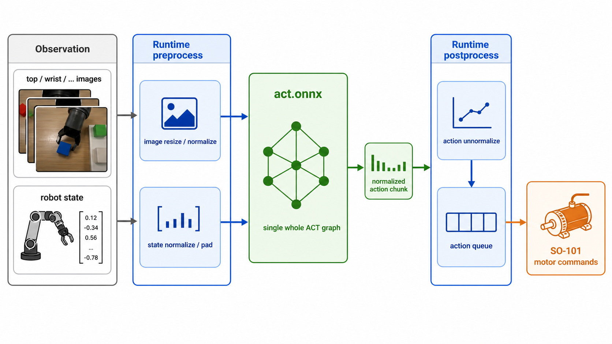
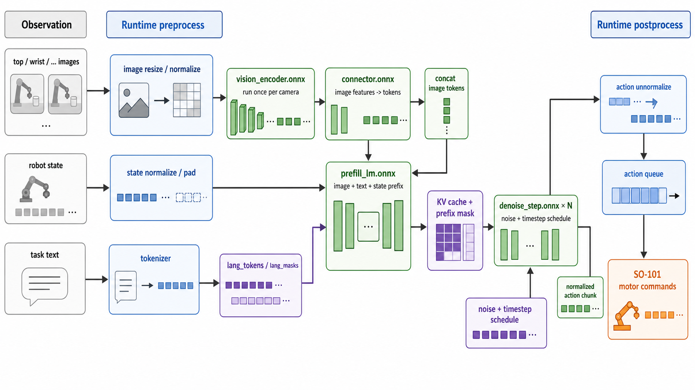

# ONNX 部署指南

本文档介绍 ACT 和 SmolVLA 策略模型在 SpacemiT K3 开发板上的 ONNX 部署方法，覆盖模型导出、量化、Python 推理、C++ 推理、离线验证和 SO-101 真机运行。

## 1. 方案概述

ACT 策略以多路相机图像和机械臂关节状态为输入，输出一段动作序列（action chunk）。ACT ONNX 部署使用单个完整图，完整数据通路如下：



SmolVLA 策略以多路相机图像、机械臂关节状态和任务文本为输入，输出 action chunk。SmolVLA ONNX 部署使用 4 个子图串联，完整数据通路如下：



ONNX 图只负责神经网络前向推理。以下步骤由 Python / C++ 运行时在图外完成：

- 图像、关节状态归一化；
- SmolVLA 任务文本 token 和 KV cache 管理；
- action 反归一化；
- SO-101 舵机标定值与 LeRobot 动作空间转换；
- action queue 播放。

## 2. 硬件清单

| 硬件 | 说明 |
|---|---|
| x86 主机 | 推荐用于 PyTorch checkpoint 导出 ONNX、模型量化 |
| SpacemiT K3 开发板 | 推理平台 |
| SO-101 Follower 机械臂 | 通过 USB 串口控制 Feetech 总线舵机 |
| 俯视相机 top camera | 示例设备号为 `/dev/video15` |
| 手腕相机 wrist camera | 示例设备号为 `/dev/video13` |

## 3. 场景一：ACT 部署指南

### 3.1 环境搭建

#### 3.1.1 获取代码

K3 板端示例路径以 `~/spacemit_robot` 为例：

```bash
cd ~
mkdir -p spacemit_robot
cd spacemit_robot

repo init -u https://github.com/spacemit-robotics/manifest.git \
  -b main -m default.xml \
  --repo-url=https://gitee.com/spacemit-robotics/git-repo
repo sync -j4
repo start robot-dev --all
```

进入 ACT / SmolVLA ONNX 示例目录：

```bash
cd ~/spacemit_robot/components/thirdparty/lerobot/examples/onnx_inference
```

#### 3.1.2 K3 C++ 环境

安装 Spacemit ORT SDK：

```bash
sudo apt-get update
sudo apt-get install -y spacemit-onnxruntime python3-spacemit-ort
```

安装后应能找到以下文件：

```text
/usr/include/spacemit_ort_env.h
/usr/lib/libonnxruntime.so
/usr/lib/libspacemit_ep.so
```

如果没有安装系统包，也可以单独下载并解压 SpaceMIT ORT SDK，然后在 CMake 时指定外部路径：

```bash
cmake .. -DSPACEMIT_ORT_DIR=/path/to/spacemit-ort-sdk
```

该路径下需要包含：

```text
/path/to/spacemit-ort-sdk/include/spacemit_ort_env.h
/path/to/spacemit-ort-sdk/lib/libonnxruntime.so
/path/to/spacemit-ort-sdk/lib/libspacemit_ep.so
```

如果直接运行 `act_benchmark` 或 `act_evaluate` 时使用外部 SDK，还需要：

```bash
export LD_LIBRARY_PATH=/path/to/spacemit-ort-sdk/lib:$LD_LIBRARY_PATH
```

#### 3.1.3 K3 Python 环境

Python 真机入口依赖 LeRobot、Feetech 驱动、safetensors 和 SpaceMIT EP：

```bash
python -m venv ~/.lerobot-venv
source ~/.lerobot-venv/bin/activate

cd ~/spacemit_robot/components/thirdparty/lerobot/examples/onnx_inference
pip install -r requirements-act.txt
```

#### 3.1.4 x86 导出与量化环境

模型导出建议在有完整 PyTorch / LeRobot 环境的 x86 主机执行：

```bash
conda create -n lerobot-venv python=3.11 -y
conda activate lerobot-venv

cd ~/spacemit_robot/components/thirdparty/lerobot/examples/onnx_inference
pip install -r requirements-act-pc.txt
```

`requirements-act-pc.txt` 已包含 ACT 导出、ONNX 对比和 INT8 动态量化所需依赖。

### 3.2 前置准备

#### 3.2.1 PyTorch 模型生成

参考[《真机训练推理》](3.3.1-真机训练推理.md)章节，完成 ACT 模型的数采和训练，并将训练好的 ACT checkpoint 放到：

```text
~/spacemit_robot/components/thirdparty/lerobot/examples/onnx_inference/models/pytorch/act/checkpoints/100000/pretrained_model/
├── config.json
├── model.safetensors
├── policy_preprocessor.json
├── policy_preprocessor_step_3_normalizer_processor.safetensors
├── policy_postprocessor.json
└── policy_postprocessor_step_0_unnormalizer_processor.safetensors
```

#### 3.2.2 ONNX 导出

在 x86 主机执行：

```bash
python tools/act_pytorch_to_onnx.py \
  --checkpoint models/pytorch/act/checkpoints/100000/pretrained_model \
  --output-dir models/onnx/act-fp32
```

导出产物：

```text
models/onnx/act-fp32/act.onnx
```

模型输入输出：

| 名称 | Shape | 说明 |
|---|---|---|
| `images` | `(B, n_cam, 3, H, W)` | 已归一化图像，float32 |
| `state` | `(B, state_dim)` | 已归一化关节状态，float32 |
| `actions` | `(B, chunk_size, action_dim)` | 已归一化动作序列，float32 |

笔者给出 [基于《真机训练推理》章节导出和量化的模型](https://archive.spacemit.com/spacemit-ai/model_zoo/vla/act/onnx/models.tar.gz)，可供读者参考并复现 benchmark 。

#### 3.2.3 精度验证

##### 3.2.3.1 仅运行 ONNX

K3 或 x86 均可执行。K3 上可打开 SpaceMIT EP：

```bash
python tools/compare_act_onnx.py \
  --model-dir models/onnx/act-fp32 \
  --checkpoint models/pytorch/act/checkpoints/100000/pretrained_model \
  --use-spacemit-ep \
  --ep-threads 8 \
  --ep-affinity "8;9;10;11;12;13;14;15"
```

##### 3.2.3.2 与 PyTorch 对比

在有 PyTorch / LeRobot 的机器上执行：

```bash
python tools/compare_act_onnx.py \
  --model-dir models/onnx/act-fp32 \
  --checkpoint models/pytorch/act/checkpoints/100000/pretrained_model \
  --cpu \
  --with-torch
```

也可以在 x86 上保存参考输出，再拷贝到 K3 对比：

```bash
# X86 生成输出
python tools/compare_act_onnx.py \
  --model-dir models/onnx/act-fp32 \
  --checkpoint models/pytorch/act/checkpoints/100000/pretrained_model \
  --cpu \
  --with-torch \
  --save-ref /tmp/act_ref.npy

# K3 运行对比
python tools/compare_act_onnx.py \
  --model-dir models/onnx/act-fp32 \
  --checkpoint models/pytorch/act/checkpoints/100000/pretrained_model \
  --use-spacemit-ep \
  --ep-threads 8 \
  --ep-affinity "8;9;10;11;12;13;14;15" \
  --ref-npy /tmp/act_ref.npy
```

#### 3.2.4 INT8 量化

使用 xslim 动态量化生成 INT8 模型：

```bash
python -m xslim \
  -i models/onnx/act-fp32/act.onnx \
  -o models/onnx/act-int8/act.q.onnx \
  --dynq
```

量化产物：

```text
models/onnx/act-int8/act.q.onnx
```

### 3.3 部署推理

#### 3.3.1 C++ 部署

##### 3.3.1.1 导出 C++ 运行所需统计参数

`act_evaluate` 需要归一化参数和 SO-101 标定参数：

```bash
python tools/export_norm_stats.py \
  --checkpoint models/pytorch/act/checkpoints/100000/pretrained_model \
  --output models/onnx/act-fp32/act_norm_stats.txt
```

##### 3.3.1.2 生成离线测试输入

```bash
python tools/make_act_test_inputs.py \
  --model-dir models/onnx/act-fp32 \
  --stats models/onnx/act-fp32/act_norm_stats.txt \
  --out-dir cpp/inputs
```

生成文件：

```text
cpp/inputs/images.npy
cpp/inputs/state_deg.npy
cpp/inputs/ref_action0.txt
```

##### 3.3.1.3 离线测试构建

```bash
cd ~/spacemit_robot/components/thirdparty/lerobot/examples/onnx_inference/cpp
rm -rf build && mkdir build && cd build
cmake ..
make -j$(nproc)
```

如果使用外部 SDK：

```bash
cmake .. -DSPACEMIT_ORT_DIR=/path/to/spacemit-ort-sdk
make -j$(nproc)
```

##### 3.3.1.4 离线测试

```bash
cd ~/spacemit_robot/components/thirdparty/lerobot/examples/onnx_inference/cpp/build

./act_benchmark ../../models/onnx/act-int8/act.q.onnx \
  --images-npy ../inputs/images.npy \
  --state-npy ../inputs/state_deg.npy \
  -s -t 8 -a "8;9;10;11;12;13;14;15" \
  -n 20 -w 3
```

##### 3.3.1.5 真机运行

真机运行需要启用 `ACT_ROBOT_HW`，并确保能访问 `components/peripherals/motor`：

```bash
cd ~/spacemit_robot/components/thirdparty/lerobot/examples/onnx_inference/cpp
rm -rf build && mkdir build && cd build
cmake .. -DACT_ROBOT_HW=ON
make act_evaluate -j$(nproc)
```

运行：

```bash
cd ~/spacemit_robot/components/thirdparty/lerobot/examples/onnx_inference/cpp/build

./act_evaluate ../../models/onnx/act-int8/act.q.onnx \
  --stats ../../models/onnx/act-fp32/act_norm_stats.txt \
  --port /dev/ttyACM0 --camera top=15 --camera wrist=13 \
  --fps 30 --episode-time 180 \
  -s -t 8 -a "8;9;10;11;12;13;14;15"
```

参数解释：

| 参数 | 说明 | 默认值 |
|---|---|---|
| `--stats` | `act_norm_stats.txt` 路径 | 必填 |
| `--port` | SO-101 串口 | `/dev/ttyACM0` |
| `--camera NAME=IDX` | 相机名到 `/dev/videoIDX` 的映射 | 无 |
| `--fps` | 控制循环频率 | 30 |
| `--episode-time` | 单次运行时长，单位秒 | 180 |
| `-s, --spacemit` | 启用 SpaceMIT EP | 关闭 |
| `-t, --threads` | EP / ORT 线程数 | 4 |
| `-a, --affinity` | EP 线程亲和性 | 空 |
| `--dry-run` | 只算动作，不下发电机 | 关闭 |
| `--verbose` | 打印每步状态和动作 | 关闭 |

#### 3.3.2 Python 部署

##### 3.3.2.1 离线测试

```bash
source ~/.lerobot-venv/bin/activate
cd ~/spacemit_robot/components/thirdparty/lerobot/examples/onnx_inference

python python/act_benchmark.py \
  --model-dir models/onnx/act-int8 \
  --checkpoint models/pytorch/act/checkpoints/100000/pretrained_model \
  --use-spacemit-ep \
  --ep-threads 8 \
  --ep-affinity "8;9;10;11;12;13;14;15" \
  --warmup 5 \
  --iters 20
```

##### 3.3.2.2 真机运行

```bash
source ~/.lerobot-venv/bin/activate
cd ~/spacemit_robot/components/thirdparty/lerobot/examples/onnx_inference

python python/act_evaluate.py \
  --model-dir models/onnx/act-int8 \
  --checkpoint models/pytorch/act/checkpoints/100000/pretrained_model \
  --port /dev/ttyACM0 \
  --camera top=15 \
  --camera wrist=13 \
  --use-spacemit-ep \
  --ep-threads 8 \
  --ep-affinity "8;9;10;11;12;13;14;15" \
  --episode-time 180
```

### 3.4 效果展示

如图是 ACT Python 真机运行的效果，对比 PyTorch 版本，由于 Chunk 推理时延的大幅降低，动作块之间衔接流畅了很多。


## 4. 场景二：SmolVLA 部署指南

SmolVLA ONNX 部署包含 fp32 导出、fp16 量化、fp16 算子手术、数值对比和真机运行。K3 真机部署推荐使用 C++ fp16 手术版模型；Python 路径建议用于 fp32 离线验证和调试。

### 4.1 环境搭建

K3 Python 推理和数值对比环境：

```bash
python -m venv ~/.lerobot-venv
source ~/.lerobot-venv/bin/activate

cd ~/spacemit_robot/components/thirdparty/lerobot/examples/onnx_inference
pip install -r requirements-smolvla.txt
```

x86 导出、量化和数值对比环境：

```bash
conda create -n lerobot-venv python=3.11 -y
conda activate lerobot-venv

cd ~/spacemit_robot/components/thirdparty/lerobot/examples/onnx_inference
pip install -r examples/onnx_inference/requirements-smolvla-pc.txt
```

C++ 真机入口需要 K3 上安装构建依赖：

```bash
sudo apt-get update
sudo apt-get install -y build-essential cmake pkg-config libopencv-dev
```

### 4.2 前置准备

进入 ONNX 示例目录：

```bash
cd ~/spacemit_robot/components/thirdparty/lerobot/examples/onnx_inference
```

可直接下载已发布的 SmolVLA 2 路相机模型用于复现：

```bash
mkdir -p models/pytorch models/onnx /tmp/smolvla_models

curl -L \
  https://archive.spacemit.com/spacemit-ai/model_zoo/vla/smolvla/models/pytorch/so101_smolvla_pick_green_cube_2cam.tar.gz \
  -o /tmp/smolvla_models/so101_smolvla_pick_green_cube_2cam.tar.gz
curl -L \
  https://archive.spacemit.com/spacemit-ai/model_zoo/vla/smolvla/models/onnx/so101_smolvla_pick_green_cube_2cam_100k_fp32.tar.gz \
  -o /tmp/smolvla_models/so101_smolvla_pick_green_cube_2cam_100k_fp32.tar.gz
curl -L \
  https://archive.spacemit.com/spacemit-ai/model_zoo/vla/smolvla/models/onnx/so101_smolvla_pick_green_cube_2cam_100k_fp16_surgeried.tar.gz \
  -o /tmp/smolvla_models/so101_smolvla_pick_green_cube_2cam_100k_fp16_surgeried.tar.gz

tar -xzf /tmp/smolvla_models/so101_smolvla_pick_green_cube_2cam.tar.gz -C models/pytorch
tar -xzf /tmp/smolvla_models/so101_smolvla_pick_green_cube_2cam_100k_fp32.tar.gz -C models/onnx
tar -xzf /tmp/smolvla_models/so101_smolvla_pick_green_cube_2cam_100k_fp16_surgeried.tar.gz -C models/onnx

ln -sfn so101_smolvla_pick_green_cube_2cam_100k_fp32 models/onnx/smolvla-fp32
ln -sfn so101_smolvla_pick_green_cube_2cam_100k_fp16_surgeried models/onnx/smolvla-fp16-surgeried
mkdir -p models/pytorch/smolvla/checkpoints/100000
ln -sfn ../../../so101_smolvla_pick_green_cube_2cam/checkpoints/100000/pretrained_model \
  models/pytorch/smolvla/checkpoints/100000/pretrained_model
```

K3 上运行 fp16 手术版模型时需要补丁版 Spacemit ORT SDK：

```bash
curl -L \
  https://archive.spacemit.com/spacemit-ai/model_zoo/vla/smolvla/spacemit-ort-sdk/spacemit-ort.riscv64.2.0.3_yyx.tar.gz \
  -o /tmp/smolvla_models/spacemit-ort.riscv64.2.0.3_yyx.tar.gz

tar -xzf /tmp/smolvla_models/spacemit-ort.riscv64.2.0.3_yyx.tar.gz -C ~
export SPACEMIT_ORT_DIR=~/spacemit-ort.riscv64.2.0.3_yyx
```

> [!NOTE]
>
> SmolVLA fp16 手术版需要在补丁版 Spacemit ORT SDK 上运行。若使用系统 SpaceMIT EP、普通 ONNX Runtime 或 CPU 跑 fp16，可能出现数值漂移或溢出。若只做 Python 调试，建议使用 fp32 模型。

### 4.3 导出 ONNX FP32

如果使用自行训练的 SmolVLA checkpoint，将 checkpoint 放到：

```text
~/spacemit_robot/components/thirdparty/lerobot/examples/onnx_inference/models/pytorch/smolvla/checkpoints/100000/pretrained_model/
├── config.json
├── model.safetensors
├── policy_preprocessor.json
├── policy_postprocessor.json
└── train_config.json
```

在 x86 主机执行导出：

```bash
python tools/export_smolvla_4model_to_onnx.py \
  --checkpoint models/pytorch/smolvla/checkpoints/100000/pretrained_model \
  --output-dir models/onnx/smolvla-fp32 \
  --num-cameras 2 \
  --validate-load
```

导出产物：

```text
models/onnx/smolvla-fp32/
├── vision_encoder.onnx
├── connector.onnx
├── prefill_lm.onnx
└── denoise_step.onnx
```

`--num-cameras` 表示 ONNX 模型的相机槽位数，应与训练时使用的相机数量或 empty camera 配置一致。例如 2 路相机训练时设置为 `2`，3 路相机训练时设置为 `3`。

### 4.4 FP16 量化与算子手术

先将 fp32 ONNX 转换为 fp16：

```bash
python tools/convert_smolvla_fp32_to_fp16.py \
  --input-dir models/onnx/smolvla-fp32 \
  --output-dir models/onnx/smolvla-fp16
```

直接将整个 SmolVLA 图转成 fp16 后，部分归一化和索引更新相关子图容易出现数值漂移。尤其是 `prefill_lm` 和 `denoise_step` 中的 RMSNorm 子图会参与语言模型和扩散去噪的关键计算，误差会在多步 denoise 中累积，最终可能表现为 action 异常、抓取失败甚至 fp16 溢出。因此需要在 fp16 模型上执行算子手术，保留主要算子的 fp16 加速，同时把敏感子图改成更稳定的形式。

执行 fp16 算子手术：

```bash
python tools/surgery_smolvla_fp16.py \
  --input-dir models/onnx/smolvla-fp16 \
  --output-dir models/onnx/smolvla-fp16-surgeried
```

当前手术内容包括：

- 将 `prefill_lm` 和 `denoise_step` 中的 RMSNorm 相关子图 fp32 化，降低归一化阶段的 fp16 累积误差；
- 对 `prefill_lm` 和 `denoise_step` 中的 `ScatterND` 子图做兼容性降解，避免补丁版 SpaceMIT EP 上的图执行和数值问题；
- 保持 `vision_encoder` 和 `connector` 等主要前向计算仍为 fp16，以保留 K3 上的推理速度收益。

手术后的目录仍包含 4 个 ONNX 子图：

```text
models/onnx/smolvla-fp16-surgeried/
├── vision_encoder.onnx
├── connector.onnx
├── prefill_lm.onnx
└── denoise_step.onnx
```

### 4.5 精度验证

在 x86 或 K3 上可先使用 CPU 对比 fp32 与 fp16 手术版输出：

```bash
python tools/compare_smolvla_onnx.py \
  --fp32-dir models/onnx/smolvla-fp32 \
  --fp16-dir models/onnx/smolvla-fp16-surgeried \
  --cpu \
  --num-cameras 2 \
  --denoise-steps 10
```

在 K3 上验证 fp16 手术版 SpaceMIT EP 输出：

```bash
python tools/compare_smolvla_onnx.py \
  --fp32-dir models/onnx/smolvla-fp32 \
  --fp16-dir models/onnx/smolvla-fp16-surgeried \
  --use-spacemit-ep \
  --spacemit-ort-dir ~/spacemit-ort.riscv64.2.0.3_yyx \
  --ep-threads 8 \
  --ep-affinity "8;9;10;11;12;13;14;15" \
  --num-cameras 2 \
  --denoise-steps 10
```

### 4.6 导出 C++ 运行时元数据

C++ 真机入口需要任务文本、归一化参数、相机顺序、action chunk 参数和 SO-101 标定。首次部署或更换机械臂后，先校准 follower：

```bash
lerobot-calibrate \
  --robot.type=so101_follower \
  --robot.port=/dev/ttyACM0 \
  --robot.id=my_awesome_follower_arm
```

确认标定文件存在：

```bash
ls ~/.cache/huggingface/lerobot/calibration/robots/so_follower/my_awesome_follower_arm.json
```

导出 `smolvla_runtime.txt`：

```bash
python tools/export_smolvla_runtime.py \
  --checkpoint models/pytorch/smolvla/checkpoints/100000/pretrained_model \
  --output models/onnx/smolvla_runtime.txt \
  --task "Place the green cube into the box" \
  --num-cameras 2 \
  --calibration ~/.cache/huggingface/lerobot/calibration/robots/so_follower/my_awesome_follower_arm.json
```

- `--task` 需要与训练和部署任务一致。
- 在线推理时，`--camera` 名称需要与 checkpoint 的图像 key 后缀一致，例如 `observation.images.top` 对应 `top`，`observation.images.wrist` 对应 `wrist`。

### 4.7 Python 推理

Python SmolVLA 路径建议使用 fp32 模型进行离线验证或 dry-run 调试。该路径便于快速检查模型目录、checkpoint、相机映射和 action 输出是否正常，但 fp16 手术版模型建议通过 C++ 路径部署，因为 fp16 数值正确性依赖补丁版 Spacemit ORT SDK 和对应 EP 配置。

运行前先确认以下文件存在：

```bash
cd ~/spacemit_robot/components/thirdparty/lerobot/examples/onnx_inference

ls models/onnx/smolvla-fp32/vision_encoder.onnx
ls models/onnx/smolvla-fp32/connector.onnx
ls models/onnx/smolvla-fp32/prefill_lm.onnx
ls models/onnx/smolvla-fp32/denoise_step.onnx
ls models/pytorch/smolvla/checkpoints/100000/pretrained_model/config.json
```

#### 4.7.1 离线 benchmark

离线 benchmark 不连接机械臂和相机，使用合成 observation 跑完整 4-model pipeline。该模式用于验证模型加载、EP 是否可用，以及统计 full-inference 延迟。

```bash
source ~/.lerobot-venv/bin/activate
cd ~/spacemit_robot/components/thirdparty/lerobot/examples/onnx_inference

python python/smolvla_evaluate.py \
  --no-robot --iters 1 \
  --model-dir ../models/onnx/smolvla-fp32 \
  --checkpoint ../models/pytorch/smolvla/checkpoints/100000/pretrained_model \
  --use-spacemit-ep \
  --ep-threads 8 --ep-affinity "8;9;10;11;12;13;14;15" \
  --warmup 1 \
  --denoise-steps 10 \
  --n-action-steps 50 \
  --infer-every-tick \
  --print-actions
```

关键参数：

| 参数 | 说明 | 默认值 |
|---|---|---|
| `--no-robot` | 使用合成 observation，不连接机械臂和相机 | 关闭 |
| `--model-dir` | SmolVLA fp32 ONNX 目录 | `models/onnx/smolvla-fp32` |
| `--checkpoint` | SmolVLA `pretrained_model` 目录 | `models/pytorch/smolvla/checkpoints/100000/pretrained_model` |
| `--use-spacemit-ep` | 使用 SpaceMIT EP | 默认开启 |
| `--cpu` | 强制使用 CPU EP，用于诊断 | 关闭 |
| `--warmup` | 正式计时前的合成输入 warmup 次数 | 0 |
| `--infer-every-tick` | 每轮都完整推理，用于测 full-inference 延迟 | 关闭 |
| `--denoise-steps` | 每次推理调用 `denoise_step` 的次数 | 10 |
| `--n-action-steps` | 每次推理后放入 action queue 的动作步数 | 读取 checkpoint |

不加 `--infer-every-tick` 时，脚本会复用 action queue 中尚未消费的动作，后续循环可能不重新跑完整模型，因此不能用来统计 full-inference 延迟。

#### 4.7.2 dry-run 调试

dry-run 会连接真实机械臂和相机、读取真实 observation，但不会下发动作给电机。首次上机建议先用 `--max-iters 1` 检查相机、串口、模型输出和 action 数值范围。

```bash
python python/smolvla_evaluate.py \  
  --dry-run --max-iters 1 \
  --port /dev/ttyACM0 \
  --camera top=/dev/video15 --camera wrist=/dev/video13 \
  --camera-fps 30 --camera-fourcc MJPG \
  --use-spacemit-ep \
  --ep-threads 8 --ep-affinity "8;9;10;11;12;13;14;15" \
  --model-dir ../models/onnx/smolvla-fp32 \
  --checkpoint ../models/pytorch/smolvla/checkpoints/100000/pretrained_model \
  --denoise-steps 10 \
  --n-action-steps 50 \
  --print-actions
```

dry-run 常用检查项：

- 相机路径是否正确，例如 `top=/dev/video15`、`wrist=/dev/video13`；
- `--camera` 名称是否与训练数据和 `smolvla_runtime.txt` 的图像 key 后缀一致；
- 第一帧 action 是否有限值，是否明显超出机械臂动作范围；
- `--denoise-steps`、`--n-action-steps` 是否与后续 C++ 真机部署配置一致。

### 4.8 C++ 真机部署

C++ 路径是 SmolVLA 在 K3 上的推荐部署方式。默认运行 `models/onnx/smolvla-fp16-surgeried`，并通过 `run_smolvla_robot_pipeline.sh` 设置补丁版 Spacemit ORT SDK、EP 线程、绑核和 fp16 数值修复相关环境变量。

#### 4.8.1 构建

构建前确认补丁版 SDK 已解压，并且模型和 runtime metadata 已准备好：

```bash
ls ~/spacemit-ort.riscv64.2.0.3_yyx/lib/libonnxruntime.so
ls ~/spacemit-ort.riscv64.2.0.3_yyx/lib/libspacemit_ep.so
ls ~/spacemit_robot/components/thirdparty/lerobot/examples/onnx_inference/models/onnx/smolvla-fp16-surgeried/
ls ~/spacemit_robot/components/thirdparty/lerobot/examples/onnx_inference/models/onnx/smolvla_runtime.txt
```

构建 SmolVLA C++ 真机入口：

```bash
cd ~/spacemit_robot/components/thirdparty/lerobot/examples/onnx_inference/cpp
SPACEMIT_ORT_DIR=~/spacemit-ort.riscv64.2.0.3_yyx ./build_smolvla_robot_cpp.sh EP203
```

构建产物：

```text
cpp/build_smolvla_robot/smolvla_robot_pipeline
```

#### 4.8.2 完整推理 benchmark

运行完整推理 benchmark 时打开 `--infer-every-tick`，避免 action queue 复用动作。该模式每个控制周期都会重新采集 observation 并执行完整 4-model pipeline，用于统计真实推理耗时。

```bash
cd ~/spacemit_robot/components/thirdparty/lerobot/examples/onnx_inference/cpp

./run_smolvla_robot_pipeline.sh \
  --port /dev/ttyACM0 \
  --camera top=15 \
  --camera wrist=13 \
  --warmup 1 \
  --max-iters 3 \
  --infer-every-tick \
  --n-action-steps 50
```

- `--warmup 1` 表示正式计时前先用合成输入跑 1 次推理，减少首次运行的模型初始化影响。
- `--max-iters 3` 表示只跑 3 个控制周期，适合 benchmark 或上机前快速检查。

#### 4.8.3 dry-run 安全检查

真机执行前建议先 dry-run。该模式会打开相机和机械臂、读取真实状态和图像，但不会下发动作：

```bash
./run_smolvla_robot_pipeline.sh \
  --port /dev/ttyACM0 \
  --camera top=15 \
  --camera wrist=13 \
  --dry-run \
  --max-iters 1 \
  --n-action-steps 25 \
  --print-actions
```

dry-run 通过后，再进入真机运行。

#### 4.8.4 真机运行

```bash
./run_smolvla_robot_pipeline.sh \
  --port /dev/ttyACM0 \
  --camera top=15 \
  --camera wrist=13 \
  --n-action-steps 25 \
  --print-actions
```

参数解释：

| 参数 | 说明 | 默认值 |
|---|---|---|
| `--model-dir` | SmolVLA ONNX 目录 | `models/onnx/smolvla-fp16-surgeried` |
| `--runtime` | `smolvla_runtime.txt` 路径 | `models/onnx/smolvla_runtime.txt` |
| `--port` | SO-101 串口 | `/dev/ttyACM0` |
| `--camera NAME=IDX` | 相机名到 `/dev/videoIDX` 的映射 | 无 |
| `--n-action-steps` | 每次推理后放入 action queue 的动作步数 | 读取 runtime |
| `--denoise-steps` | denoise 循环次数，数值越大越慢 | 10 |
| `--infer-every-tick` | 每个控制周期都完整推理，用于 benchmark | 关闭 |
| `--dry-run` | 只算动作，不下发电机 | 关闭 |
| `--print-actions` | 打印动作 | 脚本默认开启 |

`--n-action-steps` 会影响 action queue 刷新频率。推荐从 `25` 开始测试；若动作过于频繁地重新规划，可适当增大该值，若需要更快响应环境变化，可适当减小该值。

#### 4.8.5 多相机模型

2 路相机模型示例使用 `top` 和 `wrist`。如果训练时使用 3 路相机，导出 ONNX 和 `smolvla_runtime.txt` 时也需要使用对应相机数量，并在运行时传入对应相机映射。

3 路相机模型示例：

```bash
./run_smolvla_robot_pipeline.sh \
  --model-dir models/onnx/smolvla-3cam-fp16-surgeried \
  --runtime models/onnx/smolvla_runtime_3cam.txt \
  --port /dev/ttyACM0 \
  --camera camera1=3 \
  --camera camera2=1 \
  --camera camera3=5 \
  --dry-run \
  --max-iters 1 \
  --print-actions
```

### 4.9 效果展示

如图是 C++ SmolVLA 真机运行的效果，`--n-action-steps` 设置为 35。


## 5. K3 实测参考

### 5.1 Python 性能测试数据

| 模型 | 配置 | 平均延迟 |
|---|---|---|
| act-fp32 | EP 8 线程 | 1290.0 ms |
| act-int8 | EP 8 线程 | 210.9 ms |
| smolvla-fp32 | EP 8 线程 | 8762.5 ms |

### 5.2 C++ 性能测试数据

| 模型 | 配置 | 平均延迟 |
|---|---|---|
| act-fp32 | EP 8 线程 | 1288.3 ms |
| act-int8 | EP 8 线程 | 195.1 ms |
| smolvla-fp32 | EP 8 线程 | 9023.9 ms |
| smolvla-fp16 | EP 8 线程 | 1980.6 ms |

SmolVLA 数据在 K3 上测试，使用 2 路相机模型和 `--denoise-steps 10`，统计推理平均耗时，不包含模型加载。

## 6. 常见问题

### 6.1 ACT 和 SmolVLA 应该选择哪个部署入口？

ACT 推荐优先使用 Python 或 C++ INT8 模型，端到端延迟更低。SmolVLA 推荐使用 C++ fp16 手术版模型，Python 路径主要用于 fp32 离线验证和 dry-run 调试。

### 6.2 SmolVLA fp16 为什么必须使用补丁版 Spacemit ORT SDK？

SmolVLA fp16 对部分算子数值更敏感。补丁版 SDK 配合 fp16 手术版模型验证过数值正确性；使用系统 SpaceMIT EP、普通 ONNX Runtime 或 CPU 跑 fp16，可能出现数值漂移或溢出。

### 6.3 `--camera` 名称应该怎么填？

`--camera` 名称必须与训练数据和模型 metadata 中的图像 key 后缀一致。例如训练时使用 `observation.images.top` 和 `observation.images.wrist`，部署时应传 `--camera top=15 --camera wrist=13`。

### 6.4 `--n-action-steps` 会影响什么？

该参数控制每次推理后放入 action queue 的动作步数。值越大，推理结果复用时间越长、动作更连续但响应变慢；值越小，重新规划更频繁、响应更快但可能增加抖动。SmolVLA 真机建议从 `25` 开始调试。

### 6.5 如何确认机械臂标定文件可用？

C++ 真机运行前需要导出包含 SO-101 标定的 runtime metadata。先执行 `lerobot-calibrate`，再确认 `~/.cache/huggingface/lerobot/calibration/robots/so_follower/<robot_id>.json` 存在，并在 `export_smolvla_runtime.py` 中通过 `--calibration` 指向该文件。
