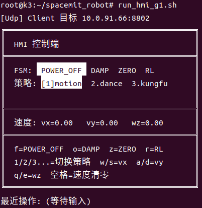
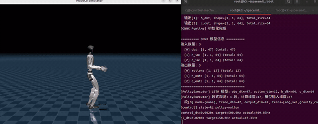
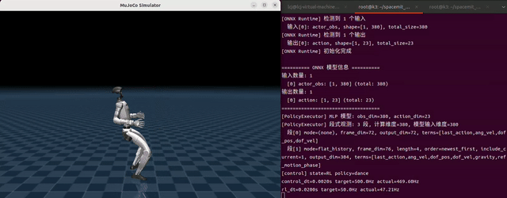

# K3 跨机 FSM 仿真


## 1. 验证目标

本流程验证“键盘输入 → HMI 指令 → FSM 状态切换 → RL 推理 → MuJoCo 仿真驱动”的完整控制链路。PC 运行 `driver_runtime`，K3 板卡运行 `control_runtime` 与 `hmi_runtime`，三者通过 UDP 通信。以下以 Unitree G1 为例。

## 2. 硬件与网络

| 设备 | 用途 |
| --- | --- |
| x86_64 PC，Ubuntu 22.04 或 24.04 | 运行 MuJoCo 与 `driver_runtime` |
| SpacemiT K3 COM260-KIT | 运行 `control_runtime`、`hmi_runtime` 与 RL 推理 |

PC 与 K3 需处于同一网段并可互相 `ping` 通。

## 3. 环境与策略模型

PC 与 K3 均需完成[安装与构建](../3.4.2-开发基础/3.4.2.1-安装与构建.md)。首次使用时，在 K3 板卡上下载对应机型的策略模型：

```bash
source build/envsetup.sh
download_models_g1.sh
```

每款机型的 `download_models_<robot>.sh` 脚本会在编译对应 target 后安装到 `output/staging/bin/`。脚本将该机型的 RL 策略模型下载到对应机型目录的 `policy/` 下。

## 4. 配置 UDP

在 `application/native/humanoid_unitree_g1/config/g1.yaml` 中设置 `transport.type: "udp"`，并填写 PC 与 K3 的实际 IP：

```yaml
transport:
  type: "udp"
  udp:
    driver_ip: "192.168.1.100"   # PC 的 IP
    control_ip: "192.168.1.200"  # K3 板卡的 IP
```

## 5. 启动进程

### 5.1 PC：启动仿真驱动

```bash
source build/envsetup.sh
run_driver_g1.sh
```

MuJoCo 窗口弹出后，终端打印仿真参数和 UDP 端口信息：


```text
[ThreadLoop] 线程 driver_main 配置完成 (cpu=-1, sched=other, priority=0)
[MuJoCo] 机器人: g1
[MuJoCo] 窗口置顶: 成功
[MuJoCo] 仿真频率: 500 Hz
[MuJoCo] 自由度: 29
[MuJoCo] 悬挂保护: 启用 (高度: 0.75m)
[MuJoCo] 按 Ctrl+C 退出
[MuJoCo] 按 F 键切换悬挂保护
[MuJoCo] 按 ↑/↓ 键调节悬挂高度 (±5cm)
[MuJoCo] 按 R 键重置悬挂高度到默认值
[Udp] Client 目标 10.0.91.0:8800
[Udp] Server 监听 0.0.0.0:8801
[driver_demo] 启动（使用 transport_executor）
```

### 5.2 K3：启动控制进程

在 K3 终端 1 运行：

```bash
source build/envsetup.sh
run_control_g1.sh
```

终端持续刷新状态。`actual` 频率非零说明已经收到 `driver_runtime` 的仿真状态：

```text
[ThreadLoop] 线程 control_main 配置完成 (cpu=-1, sched=other, priority=0)
[BehaviorManager] 机器人: g1, 自由度: 29
[ONNX Runtime] ImpClass 构造
[ONNX Runtime] OnnxRuntimeClass 构造
[BehaviorManager] RL 状态: 已加载 (/root/spacemit_robot/application/native/humanoid_unitree_g1/policy/motion/motion.onnx)
[StatePowerOff] 进入不上电状态
[FSM] 初始化完成，当前状态: POWER_OFF
[BehaviorManager] 初始化完成
[Udp] Server 监听 0.0.0.0:8800
[Udp] Client 目标 10.0.90.6:8801
[Udp] Server 监听 0.0.0.0:8802
[control_demo] 启动（使用 transport_executor）
[control] state=POWER_OFF policy=motion
control_dt=0.0020s target=500.0Hz actual=479.98Hz
rl_dt=0.0200s target=50.0Hz actual=0.00Hz
```

### 5.3 K3：启动 HMI

在 K3 终端 2 运行：

```bash
source build/envsetup.sh
run_hmi_g1.sh
```

终端显示 FSM 状态、策略列表和速度指令：

```text
[Udp] Client 目标 10.0.91.0:8802
╔══════════════════════════════════════════╗
║  HMI 控制端                              ║
╠══════════════════════════════════════════╣
║  FSM:  POWER_OFF  DAMP  ZERO  RL         ║
║  策略: [1]motion  2.dance  3.kungfu  4.stand ║
║                                          ║
╠══════════════════════════════════════════╣
║  速度: vx=0.00   vy=0.00   wz=0.00       ║
╠══════════════════════════════════════════╣
║  f=POWER_OFF  o=DAMP  z=ZERO  r=RL       ║
║  1/2/3...=切换策略  w/s=vx  a/d=vy       ║
║  q/e=wz  空格=速度清零                   ║
╚══════════════════════════════════════════╝
最近操作: (等待输入)
```

## 6. HMI 操作



| 按键 | 功能 |
| --- | --- |
| `o` | 进入 DAMP（阻尼保持） |
| `z` | 进入 ZERO（回零位） |
| `r` | 进入 RL 控制 |
| `f` | 切换到 POWER_OFF（完全失力） |
| `w` / `s` | 增 / 减前进速度 vx |
| `a` / `d` | 增 / 减横向速度 vy |
| `q` / `e` | 增 / 减旋转角速度 wz |
| `空格` | 速度清零 |
| `1`～`9` | 切换到对应序号的 RL 策略 |

`1`～`9` 可在 `POWER_OFF` 或 `DAMP` 状态预选策略，无需重启进程。策略序号由 YAML 中 `rl_policy.onnx_infer.policies` 下的策略列表顺序决定，从 1 开始。

进入 `ZERO` 后策略锁定，此后的切换指令会被忽略。ZERO 的目标位置、`kp`、`kd` 取自当前策略的 `rl_default_pos`、`kp`、`kd`，切换策略会同步重建 ZERO 状态。

若目标策略在 YAML 中配置了 `prerequisite: { policy, duration }`，例如 dance 或 kungfu 配置 stand 2 秒，`behavior_manager` 会先运行前置策略，达到指定时长后再切换目标策略。


## 7. 运行结果

MuJoCo 窗口打开后，机器人悬挂在空中。按 `o` → `z` → `r` 依次切换状态，进入 RL 后机器人应站立并响应速度指令。

`driver_runtime` 根据控制端发送的 `ControlMode` 自动管理悬挂保护：进入 `RL` 状态时取消悬挂，回到 `POWER_OFF` 时重新启用。MuJoCo 窗口内的 `F` 键仍可在 `POWER_OFF`、`DAMP`、`ZERO` 状态下手动切换悬挂；`↑` / `↓` 调节悬挂高度，`R` 重置悬挂高度。

运行完一个策略后，如果机器人已经摔倒、瘫软在地，或姿态偏离当前策略的 `rl_default_pos` 较远，应在悬挂保护启用时用 `↑` / `↓` 调节高度，让机器人在 ZERO 状态尽量回到接近初始姿态，再进入 RL，避免 ZERO → RL 瞬间的关节冲击或控制失稳。

### 跨机 FSM 仿真



### 舞蹈动作



### 功夫动作


图中左侧为 PC 端 MuJoCo 窗口，右侧为 K3 板卡上的 `control_runtime` 终端。终端每 100 ms 刷新当前 FSM 状态与策略名、`control_dt` 的目标与实际频率，以及 `rl_dt` 的目标与实际频率。

出现模型、通信、配置或控制异常时，参考[仿真问题](../3.4.10-故障排查/3.4.10.4-仿真问题.md)。
