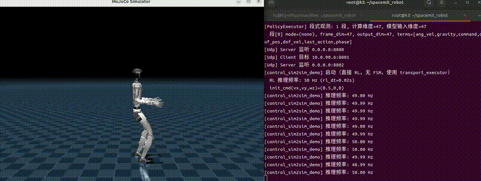

# K3 跨机 Sim2Sim

<!-- TODO: 更新 Sim2Sim 通信图，移除 MuJoCo 仅支持 x86_64 的限定，并标明本流程的 PC/K3 进程位置。 -->

## 1. 验证目标

本流程跳过 FSM 状态机、HMI 和 `policy_adapter`，用于验证可由通用 RL 接口完整描述的策略。PC 运行 `driver_runtime`，K3 板卡运行 `control_sim2sim_runtime`，两者通过 UDP 完成仿真闭环。以下以 Unitree G1 为例；需要参考动作适配或 SONIC Planner 的策略使用 FSM 流程。

## 2. 硬件与网络

| 设备 | 用途 |
| --- | --- |
| x86_64 PC，Ubuntu 22.04 或 24.04 | 运行 MuJoCo 与 `driver_runtime` |
| SpacemiT K3 COM260-KIT | 运行 `control_sim2sim_runtime` 与 RL 推理 |

PC 与 K3 需处于同一网段并可互相 `ping` 通。

## 3. 环境与配置

1. PC 与 K3 均完成[安装与构建](../3.4.2-开发基础/3.4.2.1-安装与构建.md)。
2. 按 [K3 跨机 FSM 仿真](3.4.8.3-K3跨机FSM仿真.md#3-环境与策略模型)下载对应机型的策略模型。
3. 按 [UDP 配置](3.4.8.3-K3跨机FSM仿真.md#4-配置-udp)填写实际端点。Sim2Sim 实际使用 state/control 通道，不启动 HMI。
4. 确认 `rl_policy.onnx_infer.default_policy` 指向本次策略；首次可使用 `walk_mjlab`，`command.init` 保持零速度。

## 4. 启动进程

### 4.1 PC：启动仿真驱动

```bash
source build/envsetup.sh
run_driver_g1.sh
```

预期输出与 [K3 跨机 FSM 仿真](3.4.8.3-K3跨机FSM仿真.md#51-pc启动仿真驱动)中的仿真驱动一致，显示 MuJoCo 窗口和 `driver_runtime` 终端信息。

### 4.2 K3：启动 Sim2Sim 控制

```bash
source build/envsetup.sh
run_sim2sim_g1.sh
```

程序加载 `rl_policy.onnx_infer.default_policy` 指定的策略，按 YAML 的 `model_io` 绑定张量。检查模型路径、观测与动作维度、实际推理后端、`rl_dt` 和初始速度是否符合本次配置，并确认控制端持续收到仿真状态、完成推理。

## 5. 运行结果

MuJoCo 窗口打开后，K3 端直接进入 RL 推理循环。机器人应站立并保持姿态，无需键盘切换状态。



图中为历史跨机仿真示意；当前终端布局、默认策略和频率以本次配置及运行输出为准。Sim2Sim 不覆盖 FSM 故障恢复和实机安全链路。

出现模型、通信、配置或控制异常时，参考[仿真问题](../3.4.10-故障排查/3.4.10.4-仿真问题.md)。
