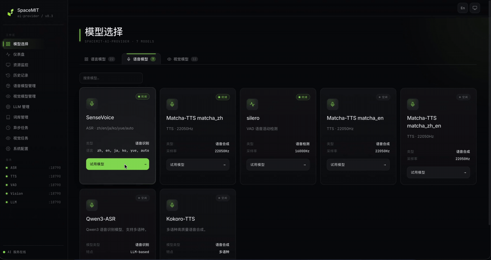

# 4.1.1 ASR

## 1. 模块概述

ASR 组件提供统一的语音识别接口，负责把 16kHz 语音转换为文本。组件位于 `components/model_zoo/asr`，提供 C++ API、Python 绑定、文件识别 demo 和流式识别 demo，可被 `omni_agent` 用作语音输入前端。

当前支持的后端：

| 后端 | 形态 | 典型用途 |
| --- | --- | --- |
| SenseVoice | 本地 ONNX，默认后端 | 中文/多语言离线识别，支持文件与流式 flush。 |
| Zipformer CTC | 本地 ONNX 流式模型 | 轻量流式识别场景。 |
| Qwen3-ASR | `llama-server` 服务 | 通过 OpenAI 兼容接口调用 ASR 模型服务。 |

典型数据链路：

```text
WAV/麦克风 PCM -> 采样率与声道整理 -> ASR 后端 -> RecognitionResult 文本
```

主要目录：

| 路径 | 说明 |
| --- | --- |
| `components/model_zoo/asr/include/asr_service.h` | C++ 对外 API。 |
| `components/model_zoo/asr/src/` | ASR 引擎、配置、后端适配和模型下载逻辑。 |
| `components/model_zoo/asr/examples/asr_file_demo.cpp` | C++ 文件识别示例。 |
| `components/model_zoo/asr/examples/asr_stream_demo.cpp` | C++ 麦克风流式识别示例。 |
| `components/model_zoo/asr/python/` | Python 包 `spacemit_asr` 与示例。 |

### 演示视频



## 2. 环境准备

### 前置条件

SDK 源码获取和基础编译环境配置统一参考 [2.3-构建编译](../../02-快速入门/2.3-构建编译.md)。完成 SDK 初始化后，回到本文继续执行“构建编译”。

后续命令默认在 `spacemit_robot` SDK 根目录执行。

### 构建编译

语音组件使用 `target/k3-com260-omni-agent.json` 目标配置。系统缺少依赖时先安装：

```bash
sudo apt install libsndfile1-dev libfftw3-dev libcurl4-openssl-dev
```

在 SDK 根目录加载构建环境后编译 ASR：

```bash
source build/envsetup.sh
lunch k3-com260-omni-agent
cd components/model_zoo/asr
mm
```

流式示例和本文录音命令还依赖 audio 组件和 PortAudio。如当前环境没有 `audio_demo`，继续编译 audio：

```bash
cd ../../multimedia/audio
mm
```

SDK 集成构建会把 `asr_file_demo`、`asr_stream_demo`、`audio_demo` 安装到 `output/staging/bin`，加载 `build/envsetup.sh` 后可直接运行。

需要 Python 示例时，可以在 SDK 根目录构建所有 Python wheel：

```bash
m -py
```

也可以只在 ASR 组件目录构建当前组件的 Python wheel：

```bash
cd components/model_zoo/asr
mm -py
```

注意：`m -py` / `mm -py` 是构建 wheel，使用系统 Python 环境执行；不要在 `~/.comm-env` 中执行。`~/.comm-env` 只用于后面的 `pip install` 和运行 Python 示例。

运行 Python 示例前，先安装虚拟环境依赖，并创建、激活 `~/.comm-env`：

```bash
sudo apt install python3-venv python-is-python3 python3-pip
python3 -m venv ~/.comm-env
source ~/.comm-env/bin/activate
```

然后二选一安装 Python 包。方式一，直接安装发布包：

```bash
python -m pip install spacemit-asr \
    --index-url https://git.spacemit.com/api/v4/projects/33/packages/pypi/simple
```

方式二，回到 SDK 根目录安装本地构建出的 wheel：

```bash
python -m pip install output/wheels/components_model_zoo_asr/spacemit_asr-*.whl \
    --index-url https://git.spacemit.com/api/v4/projects/33/packages/pypi/simple
```

Python 流式识别示例还依赖 audio 组件，需同样安装 `spacemit-audio`：

```bash
python -m pip install spacemit-audio \
    --index-url https://git.spacemit.com/api/v4/projects/33/packages/pypi/simple
```

如果选择安装本地 audio wheel，先在 audio 组件目录构建 wheel，再回到 SDK 根目录安装：

```bash
cd components/multimedia/audio
mm -py
cd ../../..
python -m pip install output/wheels/components_multimedia_audio/spacemit_audio-*.whl \
    --index-url https://git.spacemit.com/api/v4/projects/33/packages/pypi/simple
```

SenseVoice 默认模型路径为 `~/.cache/models/asr/sensevoice/`，包含 `model_quant_optimized.onnx`、`tokens.txt`、`am.mvn`。程序首次运行时会检查模型，缺失时按组件下载逻辑准备。Qwen3-ASR 需要安装 `llama.cpp-tools-spacemit`，并先启动带媒体后端的 `llama-server`。

## 3. 示例使用

### 3.1 录音并做文件识别

先使用 audio 组件录制 5 秒 16kHz 双声道 WAV。K3 麦克风通常按 16kHz/2ch 打开，ASR 文件识别会在内部混成单声道后送入模型：

```bash
audio_demo record test.wav --duration 5 --rate 16000 --channels 2 --device -1
```

预期日志包含 `Recording 5s to test.wav`、`Opened: 16000Hz, 2 channels` 和 `Saved ... to test.wav`。

如果不想录音，也可以下载模型仓库提供的测试音频：

```bash
mkdir -p ~/.cache/models/assets/audio
wget https://archive.spacemit.com/spacemit-ai/model_zoo/assets/audio/001_zh_daily_weather.wav \
    -P ~/.cache/models/assets/audio/
```

同目录还提供 `002_en_daily_weather.wav`、`003_zh_en_search.wav`、`004_zh_selling_sausages.wav`，可按需替换文件名。

然后运行默认 SenseVoice 文件识别。以下示例使用下载到本地缓存目录的测试音频：

```bash
asr_file_demo ~/.cache/models/assets/audio/001_zh_daily_weather.wav
```

预期输出会打印引擎、语言、Provider、识别文本和 RTF，例如 `引擎类型: sensevoice`、`Provider: spacemit`、`文本:`。

### 3.2 Python 文件识别

确保已激活 `~/.comm-env`，并已安装 `spacemit-asr` 后运行：

```bash
cd components/model_zoo/asr/python/examples
python asr_file_demo.py ~/.cache/models/assets/audio/001_zh_daily_weather.wav
```

预期输出包含 `ASR 版本`、`Provider: spacemit`、识别文本、音频时长、处理时间和 RTF。

### 3.3 Zipformer 文件识别

当前 Zipformer 后端在 K3 + SpaceMIT EP 下需要临时禁用 `Conv` 算子，用于规避现阶段 SpaceMIT EP 侧兼容问题。后续 bug 修复后，该环境变量可移除。

```bash
export SPACEMIT_EP_DISABLE_OP_TYPE_FILTER="Conv"
asr_file_demo ~/.cache/models/assets/audio/001_zh_daily_weather.wav --engine zipformer
```

### 3.4 C++ 流式识别

```bash
asr_stream_demo -c 2 -t 60 -f 3 -p spacemit
```

该示例从默认麦克风采集 16kHz/2ch 音频并混成单声道，每 3 秒 flush 一次当前缓冲并通过回调输出最终文本。运行时会先列出输入设备，随后出现 `实时识别结果`、`定时 Flush`、`[回调] 最终结果` 等日志。若默认设备不符合预期，先运行 `asr_stream_demo -l` 查看设备列表，再按需追加 `-i <id>`。

### 3.5 Python 流式识别

安装 `spacemit-asr` 与 `spacemit-audio` 后，可运行：

```bash
cd components/model_zoo/asr/python/examples
python asr_stream_demo.py -c 2
```

示例会使用 multiprocessing 采集双声道音频并混成单声道，日志包含 `ASR 版本`、`Flush 间隔`、`[句子 1] 定时 flush` 和识别结果。

### 3.6 Qwen3-ASR 服务识别

Qwen3-ASR 通过 `llama-server` 提供 OpenAI 兼容接口。先安装工具包并准备模型：

```bash
sudo apt install llama.cpp-tools-spacemit

mkdir -p ~/.cache/models/asr/qwen3asr
cd ~/.cache/models/asr/qwen3asr
wget https://archive.spacemit.com/spacemit-ai/model_zoo/asr/qwen3-asr-0.6B-dynq-q40.tar.gz
tar -xzf qwen3-asr-0.6B-dynq-q40.tar.gz
rm -f qwen3-asr-0.6B-dynq-q40.tar.gz
```

注意：Qwen3-ASR 默认不建议在 8G 内存板卡上直接运行，启动 `llama-server` 时可能因内存不足失败或被系统 kill。建议使用更大内存配置；如必须在 8G 板卡上尝试，需先配置 swap 后再启动 `llama-server`。

然后启动 `llama-server`：

```bash
llama-server \
    -m ~/.cache/models/asr/qwen3asr/qwen3-asr-0.6B-dynq-q40/Qwen3-ASR-0.6B-text-q40.gguf \
    --media-backend smt \
    --smt-config-dir ~/.cache/models/asr/qwen3asr/qwen3-asr-0.6B-dynq-q40/ \
    --host 127.0.0.1 --port 8063 -t 4
```

再调用：

```bash
asr_file_demo ~/.cache/models/assets/audio/001_zh_daily_weather.wav \
    --engine qwen3-asr \
    --endpoint http://127.0.0.1:8063/v1/chat/completions
```

## 4. 应用开发

本章面向应用开发者，说明如何在自己的 C++ / Python 应用中集成 ASR 组件。完整接口以 `components/model_zoo/asr/include/asr_service.h` 为准；本节只介绍常用公开接口和典型调用方式。ASR 的 C++ 入口是 `SpacemiT::AsrEngine`，Python 入口是 `spacemit_asr.Engine`。

### 4.1 接口说明

ASR 组件的核心入口是 `SpacemiT::AsrEngine`。应用侧通过该类创建引擎、配置后端和模型，并发起阻塞或流式识别请求。

#### 4.1.1 常用数据结构

| 类型 | 说明 |
| --- | --- |
| `AsrConfig` | 引擎配置。常用字段：`engine`（sensevoice / zipformer / qwen3-asr）、`model_dir`、`language`（zh/en/ja/ko/yue/auto）、`punctuation`、`sample_rate`、`provider`（cpu / spacemit）、`hotwords`、`hotword_boost`、`endpoint`、`model`、`timeout`。可用 `Preset(name)` 创建预置配置。 |
| `Sentence` | 单句结果。字段 `text`、`begin_time`、`end_time`（毫秒）、`confidence`（0–1）。 |
| `RecognitionResult` | 识别结果。提供 `GetText()`、`GetSentences()`、`IsSentenceEnd()`、`GetRTF()`、`GetAudioDuration()`、`GetProcessingTime()`、`IsEmpty()`、`GetRequestId()`。流式下用 `IsSentenceEnd()` 区分中间结果与句末最终结果。 |
| `AsrEngineCallback` | 流式回调基类。覆写 `OnOpen()`、`OnEvent(result)`、`OnComplete()`、`OnError(result)`、`OnClose()`。回调由 ASR 引擎内部线程触发，自有状态需自行加锁。 |

#### 4.1.2 引擎初始化与预设

| 接口 | 说明 | 参数 | 返回值 |
| --- | --- | --- | --- |
| `AsrEngine(engine, model_dir)` | 通过引擎名快速构造，模型路径为空时使用默认缓存路径。 | `engine`：sensevoice / zipformer / qwen3-asr；`model_dir`：可选模型目录。 | 引擎实例。 |
| `AsrEngine(AsrConfig)` | 用完整配置构造，可指定语言、标点、provider、热词、Qwen3-ASR endpoint 等。 | `config`：`AsrConfig` 实例。 | 引擎实例。 |
| `AsrConfig::Preset(name)` | 静态工厂方法，返回指定预设的 `AsrConfig`，可在其上覆写字段。 | `name`：sensevoice / zipformer / qwen3-asr。 | `AsrConfig`。 |
| `AsrConfig::AvailablePresets()` | 静态方法，返回当前可用的预设名称列表。 | 无。 | `std::vector<std::string>`。 |
| `IsInitialized()` | 引擎是否成功初始化。 | 无。 | `bool`。 |
| `GetEngineName()` / `GetConfig()` | 取当前引擎名 / 配置快照。 | 无。 | `string` / `AsrConfig`。 |

#### 4.1.3 阻塞识别

| 接口 | 说明 | 参数 | 返回值 |
| --- | --- | --- | --- |
| `Call(file_path, phrase_id="")` | 识别 WAV/PCM 文件，内部完成解码与重采样。失败返回 `nullptr`。 | `file_path`：音频文件路径；`phrase_id`：可选请求标识。 | `shared_ptr<RecognitionResult>`。 |
| `Recognize(vector<int16_t>, sample_rate=16000)` | 识别内存中的 PCM16 音频，单声道；常用于上游已采集好的音频帧。 | `audio`：PCM16 单声道；`sample_rate`：采样率。 | `shared_ptr<RecognitionResult>`。 |
| `Recognize(vector<float>, sample_rate=16000)` | 识别 float32 PCM，幅度范围 [-1.0, 1.0]。 | 同上。 | `shared_ptr<RecognitionResult>`。 |

#### 4.1.4 流式识别

| 接口 | 说明 | 参数 | 返回值 |
| --- | --- | --- | --- |
| `SetCallback(callback)` | 注册流式回调对象，必须在 `Start()` 之前调用。 | `callback`：`shared_ptr<AsrEngineCallback>`。 | 无。 |
| `Start(phrase_id="")` | 开始一次流式会话，进入接收音频帧状态。 | `phrase_id`：可选请求标识。 | 无。 |
| `SendAudioFrame(data)` | 送入一帧 PCM 16kHz / 16bit / mono 数据；可分多次调用。 | `data`：`vector<uint8_t>`，长度对齐到 `int16_t`。 | 无。 |
| `Flush()` | 立即识别当前缓冲并通过回调输出结果，会话不结束，可继续 `SendAudioFrame()`。常用于 VAD 触发的句末识别或定时切句。 | 无。 | 无。 |
| `Stop()` | 结束本次流式会话；阻塞至所有结果通过回调返回完毕。 | 无。 | 无。 |

#### 4.1.5 运行时配置

| 接口 | 说明 | 参数 | 返回值 |
| --- | --- | --- | --- |
| `SetLanguage(lang)` / `SetPunctuation(enabled)` | 运行时切换识别语言和标点开关。 | `lang`：zh/en/ja/ko/yue/auto；`enabled`：bool。 | 无。 |
| `SetHotwords(words, boost=1.0)` | 更新热词列表与权重，立即生效。 | `words`：词条列表；`boost`：权重。 | 无。 |
| `LoadHotwordFile(path, default_boost=1.0)` | 从文件加载热词；每行 `word` 或 `word\tboost`。 | `path`：热词文件；`default_boost`：缺省权重。 | 无。 |
| `GetLastRequestId()` / `GetFirstPackageDelay()` / `GetLastPackageDelay()` | 取最近一次请求标识、首包/末包延迟（毫秒），用于调试时延。 | 无。 | `string` / `int`。 |

### 4.2 C++ 调用示例

以下示例默认已完成 §2 构建；SenseVoice 模型在 `~/.cache/models/asr/sensevoice/`。Qwen3-ASR `llama-server` 启动方式见 §3.6。

ASR 组件编译后会把 `asr_service.h` 和 `libasr_service_cpp.so` 安装到 `output/staging`。下游组件链接 ASR 库的 CMake 写法：

```cmake
add_executable(my_app main.cpp)

find_library(ASR_SERVICE_LIB NAMES asr_service_cpp
    PATHS ${CMAKE_INSTALL_PREFIX}/lib NO_DEFAULT_PATH)
find_path(ASR_SERVICE_INCLUDE_DIR NAMES asr_service.h
    PATHS ${CMAKE_INSTALL_PREFIX}/include NO_DEFAULT_PATH)
if(NOT ASR_SERVICE_LIB OR NOT ASR_SERVICE_INCLUDE_DIR)
    message(FATAL_ERROR "asr_service_cpp not found. Build components/model_zoo/asr first.")
endif()

target_include_directories(my_app PRIVATE ${ASR_SERVICE_INCLUDE_DIR})
target_link_libraries(my_app PRIVATE ${ASR_SERVICE_LIB})
```

包依赖建议在当前组件的 `package.xml` 中声明 `<depend>asr</depend>`，使用 `m` 或 `mm` 构建时构建系统会先编译并安装 ASR 组件，再编译当前应用组件。

#### 4.2.1 文件离线识别

适用场景：离线批量识别 WAV 文件、回归测试、固定音频回放。

调用步骤：

1. 用 `AsrConfig::Preset("sensevoice")` 创建预设配置，按需覆写 `language`、`punctuation`、`provider`。
2. 构造 `AsrEngine` 并通过 `IsInitialized()` 检查。
3. 调用 `Call(file_path)` 取回 `RecognitionResult`。
4. 用 `IsEmpty()` 判断后再读 `GetText()` 和 `GetRTF()`。

```cpp
#include <iostream>
#include <memory>
#include "asr_service.h"

int main() {
    SpacemiT::AsrConfig config = SpacemiT::AsrConfig::Preset("sensevoice");
    config.language = "zh";
    config.punctuation = true;
    config.provider = "spacemit";

    auto engine = std::make_shared<SpacemiT::AsrEngine>(config);
    if (!engine->IsInitialized()) {
        std::cerr << "ASR 引擎初始化失败" << std::endl;
        return 1;
    }

    auto result = engine->Call("test.wav");
    if (result && !result->IsEmpty()) {
        std::cout << "文本: " << result->GetText() << std::endl;
        std::cout << "音频: " << result->GetAudioDuration() << " ms"
                  << "  处理: " << result->GetProcessingTime() << " ms"
                  << "  RTF: " << result->GetRTF() << std::endl;
    }
    return 0;
}
```

完整版含命令行参数解析、多轮 warmup 和汇总统计，见 `components/model_zoo/asr/examples/asr_file_demo.cpp`。

#### 4.2.2 PCM 内存识别

适用场景：上游已经在内存中拿到 PCM（例如 audio 组件采集回调、网络推流、文件解码后），不希望再落盘成 WAV。

调用步骤：

1. 把上游 PCM 整理为 16kHz 单声道。多声道需先混音；非 16kHz 需先重采样（参考 audio 组件的 `Resampler`）。
2. 选择 `Recognize(vector<int16_t>)` 或 `Recognize(vector<float>)` 重载。
3. 处理返回的 `RecognitionResult`。

```cpp
#include <vector>
#include <iostream>
#include "asr_service.h"

void RecognizePcm(const std::vector<int16_t>& pcm_16k_mono) {
    SpacemiT::AsrEngine engine(SpacemiT::AsrConfig::Preset("sensevoice"));

    auto result = engine.Recognize(pcm_16k_mono, 16000);
    if (result && !result->IsEmpty()) {
        std::cout << result->GetText() << std::endl;
    }
}
```

float32 重载用法相同，幅度需归一化到 `[-1.0, 1.0]`：

```cpp
std::vector<float> pcm_float(pcm_16k_mono.size());
for (size_t i = 0; i < pcm_16k_mono.size(); ++i) {
    pcm_float[i] = pcm_16k_mono[i] / 32768.0f;
}
auto result = engine.Recognize(pcm_float, 16000);
```

#### 4.2.3 麦克风流式识别 + 回调

适用场景：实时识别、边录边出字幕、配合 VAD 做句末切分；与 omni_agent 的语音输入链路一致。

调用步骤：

1. 实现 `AsrEngineCallback` 子类，覆写 `OnEvent` 处理中间/最终结果。
2. 构造引擎并 `SetCallback()`，再调用 `Start()` 进入流式状态。
3. 把麦克风采集回调里的 PCM 字节通过 `SendAudioFrame()` 送入。
4. 按定时或 VAD 触发 `Flush()` 切句；收到对应 `OnEvent(result)` 且 `IsSentenceEnd()==true` 时为最终结果。
5. 退出前 `Stop()`，等待所有回调完成。

```cpp
#include <chrono>
#include <iostream>
#include <memory>
#include <thread>
#include <vector>

#include "asr_service.h"
#include "audio_base.hpp"

class StreamCallback : public SpacemiT::AsrEngineCallback {
 public:
    void OnEvent(std::shared_ptr<SpacemiT::RecognitionResult> result) override {
        if (!result) return;
        const std::string text = result->GetText();
        if (text.empty()) return;
        if (result->IsSentenceEnd()) {
            std::cout << "[最终] " << text
                      << "  RTF=" << result->GetRTF() << std::endl;
        } else {
            std::cout << "[中间] " << text << std::endl;
        }
    }
    void OnError(std::shared_ptr<SpacemiT::RecognitionResult> result) override {
        std::cerr << "[ASR] 错误: "
                  << (result ? result->GetText() : "unknown") << std::endl;
    }
};

int main() {
    SpacemiT::AsrConfig config = SpacemiT::AsrConfig::Preset("sensevoice");
    config.language = "zh";

    auto engine = std::make_shared<SpacemiT::AsrEngine>(config);
    auto callback = std::make_shared<StreamCallback>();
    engine->SetCallback(callback);
    engine->Start();

    SpacemitAudio::AudioCapture capture(-1);
    capture.SetCallback([&](const uint8_t* data, size_t size) {
        engine->SendAudioFrame(std::vector<uint8_t>(data, data + size));
    });
    capture.Start(16000, 1, 4096);

    auto last_flush = std::chrono::steady_clock::now();
    for (int s = 0; s < 30; ++s) {
        std::this_thread::sleep_for(std::chrono::seconds(1));
        if (std::chrono::steady_clock::now() - last_flush
                >= std::chrono::seconds(3)) {
            engine->Flush();
            last_flush = std::chrono::steady_clock::now();
        }
    }

    engine->Stop();
    capture.Stop();
    return 0;
}
```

K3 麦克风若只支持双声道采集，需要先混成单声道再送 ASR；带重采样和混音的完整版见 `components/model_zoo/asr/examples/asr_stream_demo.cpp`。

#### 4.2.4 热词加载

适用场景：识别专有名词、产品名、机器人指令等领域词；对未在通用模型中充分覆盖的词条提供解码偏置。

调用步骤：

1. 构造时通过 `AsrConfig::hotwords` 配置一次性热词，或运行时通过 `SetHotwords()` 切换。
2. 文件场景用 `LoadHotwordFile(path, default_boost)`，文件每行 `word` 或 `word\tboost`。
3. `boost` 越大偏置越强，常用范围 1.5–3.0；过大会引入误识别。

```cpp
SpacemiT::AsrConfig config = SpacemiT::AsrConfig::Preset("sensevoice");
config.hotwords = {"SpacemiT", "进迭时空", "RISC-V"};
config.hotword_boost = 2.0f;

SpacemiT::AsrEngine engine(config);

// 运行时再切一组热词
engine.SetHotwords({"K3", "X100", "A100"}, 3.0f);

// 或从文件加载
engine.LoadHotwordFile("hotwords.txt", 2.0f);

auto result = engine.Call("test.wav");
```

### 4.3 Python 示例

Python 包名为 `spacemit_asr`，安装方式见 §2 中 wheel 安装步骤。导入后直接使用：

```python
import spacemit_asr
```

#### 4.3.1 文件识别

```python
import spacemit_asr

config = spacemit_asr.Config("~/.cache/models/asr/sensevoice")
config.language = spacemit_asr.Language.ZH
config.punctuation_enabled = True
config.provider = "spacemit"

with spacemit_asr.Engine(config) as engine:
    result = engine.recognize_file("test.wav")
    print(result.text)
    print(f"音频 {result.audio_duration_ms} ms, "
          f"处理 {result.processing_time_ms} ms, "
          f"RTF {result.rtf:.3f}")
```

`with` 上下文管理器会自动调用 `engine.initialize()` 与 `engine.shutdown()`。如果不用 `with`，需要显式调用 `engine.initialize()`。

也可以用模块级快捷函数一句话识别：

```python
text = spacemit_asr.recognize_file("test.wav")
```

#### 4.3.2 流式识别（麦克风）

`MicrophoneStream` 内部封装了音频采集、重采样和分块识别，调用方只迭代结果即可：

```python
import spacemit_asr

with spacemit_asr.MicrophoneStream(
        language=spacemit_asr.Language.ZH,
        chunk_duration=5.0) as stream:
    print("Listening... (Ctrl+C 停止)")
    for result in stream.recognize():
        print(f"[识别] {result.text}")
```

如果需要与 C++ 流式 API 对齐的底层用法（自定义回调 + 手动 `send_audio_frame` + `flush`），可参考 `components/model_zoo/asr/python/examples/asr_stream_demo.py` 中的 `StreamingCallback` 与 `engine.start(callback=...)` 写法。

#### 4.3.3 C++ ↔ Python 接口对照

| C++（`SpacemiT::`） | Python（`spacemit_asr.`） | 备注 |
| --- | --- | --- |
| `AsrConfig` | `Config(model_dir)` | Python `Config` 构造只接收 `model_dir`，其它字段通过属性 setter（`language`、`punctuation_enabled`、`provider`、`sample_rate`）或链式 `with_language()` / `with_punctuation()` 设置。 |
| `AsrEngine(config)` + `IsInitialized()` | `Engine(config)` + `engine.initialize()` 或 `with Engine(config) as engine` | Python 必须显式 `initialize()` 或用 `with`，构造时不会自动初始化。 |
| `Call(file)` | `Engine.recognize_file(path)` 或 `spacemit_asr.recognize_file(path)` | 后者是模块级快捷函数。 |
| `Recognize(pcm_16k_mono)` | `Engine.recognize(numpy_array)` | Python 接收 `np.ndarray`（float32 / int16 / float64）；多维数组会自动 flatten。 |
| `SetCallback` / `Start` / `SendAudioFrame` / `Flush` / `Stop` | `engine.start(callback=AsrCallback())` / `engine.send_audio_frame(bytes)` / `engine.flush()` / `engine.stop()` | 流式 API 1:1 对应；高层封装见 `MicrophoneStream`。 |
| `AsrEngineCallback` | `AsrCallback` / `PrintCallback` / `CollectCallback` | 后两个为内置便捷实现。 |
| `SetHotwords(words, boost)` | `engine.update_hotwords(words, boost=1.0)` | 名称差异；Python 形参保留 `boost` 但当前实现未透传到底层（`engine.py: self._engine.update_hotwords(hotwords)`），需要调权重时改用 C++ API 或在 `Config` 里通过 `hotword_boost` 字段设置。 |
| 无 | `spacemit_asr.list_devices()` | Python 侧便利函数，等价于调用 `spacemit_audio.AudioCapture.list_devices()`。 |

更多 Python 示例（含完整 multiprocessing 流式、设备枚举）见 `components/model_zoo/asr/python/examples/`。

## 5. 调试指南

调试 ASR 时建议先固定输入音频，再分别确认模型、后端和采集设备状态：

- 用 `audio_demo play` 回放输入 WAV，确认音频非静音、采样率和声道数符合预期。
- 通过 `asr_stream_demo -l` 列出输入设备，确认麦克风设备索引后再指定 `-i <id>`。
- Qwen3-ASR 场景先用 `curl http://127.0.0.1:8063/health` 检查 `llama-server` 状态。
- 性能评估以 warmup 后的第二次及后续结果为准，避免把模型加载时间计入稳定推理时延。

## 6. 常见问题

| 现象 | 可能原因 | 处理 |
| --- | --- | --- |
| 首次识别很慢 | 模型加载和 warmup 被计入首次运行 | 以第二次及之后结果评估性能。 |
| 识别文本为空或很短 | 输入音频过短、静音或采样率不匹配 | 用 `audio_demo play` 回放，确认 WAV 是 16kHz 有声内容。 |
| 流式采集报设备错误 | 默认输入设备不符合预期 | 先运行 `asr_stream_demo -l`，再用 `-i <id>` 指定设备。 |
| Zipformer 报 SpaceMIT EP/Conv 相关错误 | 当前 K3 + SpaceMIT EP 下 `Conv` 算子存在临时兼容问题 | 运行前设置 `SPACEMIT_EP_DISABLE_OP_TYPE_FILTER="Conv"`。 |
| Qwen3-ASR 调用失败 | `llama-server` 未启动或 endpoint 不正确 | 用 `curl http://127.0.0.1:8063/health` 确认服务状态。 |
| Qwen3-ASR 启动失败或被 kill | 8G 内存板卡可能内存不足 | 检查系统内存；如必须在 8G 板卡上运行，先配置 swap 后再启动 `llama-server`。 |

## 附录：K3 实测数据

以下为 K3 平台实测数据，硬件测试不在本文档构建验证中重复执行。

| 场景 | 音频时长 | 处理时间 | RTF | 说明 |
| --- | --- | --- | --- | --- |
| `asr_file_demo 002_en_daily_weather.wav` | 1.80s | 0.232s | 0.129 | SenseVoice，Provider 为 `spacemit`。 |
| `python asr_file_demo.py 001_zh_daily_weather.wav` | 1.619s | 0.236s | 0.146 | Python SenseVoice，Provider 为 `spacemit`。 |
| `asr_file_demo test_roujie.wav --engine qwen3-asr` | 5.00s | 0.475s | 0.095 | Qwen3-ASR，通过本机 `llama-server` endpoint 调用。 |
| `asr_stream_demo -c 2 -t 60 -f 3 -p spacemit` 第一次 flush | 6.528s | 1.411s | 0.216 | C++ 流式，2ch 混 1ch，定时 flush。 |
| `asr_stream_demo -c 2 -t 60 -f 3 -p spacemit` 停止前 flush | 2.688s | 0.344s | 0.128 | C++ 流式，2ch 混 1ch。 |
| `python asr_stream_demo.py -c 2` 第一次 flush | 9.40s | 2.46s | 0.261 | Python 流式，2ch 混 1ch。 |
| `python asr_stream_demo.py -c 2` 第二次 flush | 3.05s | 0.37s | 0.123 | Python 流式。 |

**测试方法**：在 K3 板卡上使用 `target/k3-com260-omni-agent.json` 构建，运行表内命令或对应 Python 示例；文件识别使用缓存目录下测试 WAV，流式识别使用板载麦克风采集，统计日志打印的处理时间和 RTF。
