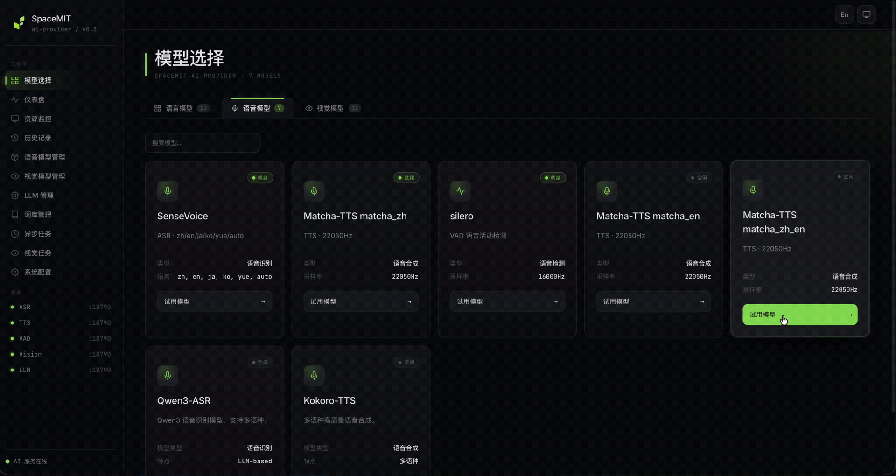

# 4.1.2 TTS

## 1. 模块概述

TTS 组件提供统一的本地语音合成接口，负责把文本合成为 WAV/PCM 音频。组件位于 `components/model_zoo/tts`，提供 C++ API、Python 绑定、文件合成 demo 和流式合成 demo，可被 `omni_agent` 用作语音回复输出。

支持的后端：

| 后端 | 语言 | 采样率 | 说明 |
| --- | --- | --- | --- |
| `matcha:zh` | 中文 | 22050Hz | Matcha-TTS 中文模型。 |
| `matcha:en` | 英文 | 22050Hz | Matcha-TTS 英文模型，依赖 `espeak-ng` 做英文音素处理。 |
| `matcha:zh-en` | 中英混合 | 16000Hz | Matcha-TTS 中英混合模型，适合机器人对话。 |
| `kokoro` / `kokoro:<voice>` | 中文/英文 | 24000Hz | Kokoro 多音色模型。 |

典型数据链路：

```text
输入文本 -> 分词/音素处理 -> TTS 后端 -> WAV/PCM -> AudioPlayer 播放
```

主要目录：

| 路径 | 说明 |
| --- | --- |
| `components/model_zoo/tts/include/tts_service.h` | C++ 对外 API。 |
| `components/model_zoo/tts/src/backends/matcha/` | Matcha-TTS 后端。 |
| `components/model_zoo/tts/src/backends/kokoro/` | Kokoro 后端和音色管理。 |
| `components/model_zoo/tts/examples/tts_file_demo.cpp` | C++ 文件合成示例。 |
| `components/model_zoo/tts/examples/tts_stream_demo.cpp` | C++ 流式合成播放示例。 |
| `components/model_zoo/tts/python/` | Python 包 `spacemit_tts` 与示例。 |

### 演示视频



## 2. 环境准备

### 前置条件

SDK 源码获取和基础编译环境配置统一参考 [2.3-构建编译](../../02-快速入门/2.3-构建编译.md)。完成 SDK 初始化后，回到本文继续执行“构建编译”。

后续命令默认在 `spacemit_robot` SDK 根目录执行。

### 构建编译

语音组件使用 `target/k3-com260-omni-agent.json` 目标配置。系统缺少依赖时先安装：

```bash
sudo apt install libsndfile1-dev libfftw3-dev espeak-ng
```

在 SDK 根目录加载环境后编译 TTS：

```bash
source build/envsetup.sh
lunch k3-com260-omni-agent
cd components/model_zoo/tts
mm
```

流式播放和本文回放命令还依赖 audio 组件和 PortAudio。如当前环境没有 `audio_demo`，继续编译 audio：

```bash
cd ../../multimedia/audio
mm
```

构建产物会把 `tts_file_demo`、`tts_stream_demo`、`audio_demo` 安装到 `output/staging/bin`。需要 Python 示例时，在 SDK 根目录执行：

```bash
m -py
```

注意：`m -py` / `mm -py` 是构建 wheel，使用系统 Python 环境执行；不要在 `~/.comm-env` 中执行。`~/.comm-env` 只用于后面的 `pip install` 和运行 Python 示例。

运行 Python 示例前，先安装虚拟环境依赖，并创建、激活 `~/.comm-env`：

```bash
sudo apt install python3-venv python-is-python3 python3-pip
python3 -m venv ~/.comm-env
source ~/.comm-env/bin/activate
```

然后二选一安装 Python 包。方式一，直接安装发布包：

```bash
python -m pip install spacemit-tts \
    --index-url https://git.spacemit.com/api/v4/projects/33/packages/pypi/simple
```

方式二，回到 SDK 根目录安装本地构建出的 wheel：

```bash
python -m pip install output/wheels/components_model_zoo_tts/spacemit_tts-*.whl \
    --index-url https://git.spacemit.com/api/v4/projects/33/packages/pypi/simple
```

安装后可 `import spacemit_tts`。

模型默认放在 `~/.cache/models/tts/` 下，首次运行会按后端检查模型。Matcha 中文还会使用 `cppjieba` 词典，`matcha:zh-en` 和 Kokoro 会使用 `cpp-pinyin` 词典；相关第三方资源通常缓存在 `~/.cache/thirdparty/`。

## 3. 示例使用

### 3.1 文件合成

```bash
tts_file_demo -p "今天学Python" -l matcha:zh-en
```

预期输出包含引擎名称、采样率、音频时长、处理时间、RTF，并保存 `output.wav`。可以用 audio 组件回放：

```bash
audio_demo play ./output.wav -c 2 -d 1
```

常用后端示例：

```bash
tts_file_demo -p "你好世界" -l matcha:zh
tts_file_demo -p "Hello" -l matcha:en
tts_file_demo -p "今天学Python" -l matcha:zh-en
tts_file_demo -p "你好" -l kokoro
tts_file_demo -p "你好" -l kokoro:yunxi
```

### 3.2 自定义发音 lexicon

`tts_file_demo` 支持通过 `--lexicon` 修正中文多音字或指定英文热词读法。中文 phoneme 使用带声调拼音；`matcha:zh-en` 的英文热词可用 `locale=en` 交给 `espeak-ng` 生成 IPA。

```bash
tts_file_demo -p "你好,我是 SpaceMIT 的语音合成模型,很高兴为你服务" \
    -l matcha:zh-en \
    --lexicon "为你:wei4 ni3:zh,SpaceMIT:space meet:en"
```

### 3.3 C++ 流式合成

```bash
tts_stream_demo -p "你好" -e matcha:zh-en
```

该示例会把输入文本切分成句子，边模拟 LLM 输出边合成音频并播放。日志包含 `开始流式合成`、`[合成] 第 1 句完成`、`[播放] 重采样` 和 `播放完成`。

### 3.4 Python 多引擎 demo

```bash
cd components/model_zoo/tts/python/examples
python tts_file_demo.py
```

示例会依次创建 Matcha 中文、英文、中英混合和 Kokoro 引擎，输出多个 WAV 文件。流式 Python 示例：

```bash
python tts_stream_demo.py -p "你好"
```

## 4. 应用开发

本章面向应用开发者，说明如何在自己的 C++ / Python 应用中集成 TTS 组件。完整接口以 `components/model_zoo/tts/include/tts_service.h` 为准；本节只介绍常用公开接口和典型调用方式。TTS 的 C++ 入口是 `SpacemiT::TtsEngine`，Python 入口是 `spacemit_tts.Engine`。

### 4.1 接口说明

TTS 组件的核心入口是 `SpacemiT::TtsEngine`。应用侧通过该类创建合成引擎、选择后端，并发起阻塞合成、流式合成或双向流合成请求。

#### 4.1.1 常用数据结构

| 类型 | 说明 |
| --- | --- |
| `TtsConfig` | 引擎配置。常用字段：`backend`、`model_dir`、`voice`（Kokoro 音色名）、`speaker_id`（多说话人模型）、`sample_rate`、`speech_rate`、`pitch`、`volume`（[0,100]）、`lexicon`、`num_threads`。可用 `Preset(name)` 创建预置配置；含链式 `withSpeed/withSpeaker/withVolume`。 |
| `BackendType` | 后端枚举。`MATCHA_ZH` / `MATCHA_EN`（22050Hz）、`MATCHA_ZH_EN`（16000Hz，中英混合）、`KOKORO`（24000Hz，多音色）、`COSYVOICE` / `VITS` / `PIPER` / `CUSTOM`（保留）。**不同后端默认采样率不同，接 audio 播放需重采样**。 |
| `AudioFormat` | 输出音频格式。`PCM`、`WAV`；`MP3`、`OGG` 为预留。 |
| `PronunciationEntry` | 自定义发音条目。字段 `word`（要纠正的词）、`phoneme`（拼音或音素）、`locale`（默认 `zh`，可选 `en` 仅对 matcha:zh-en 有效）。 |
| `TtsEngineResult` | 合成结果。提供 `GetAudioData()`（bytes）/ `GetAudioFloat()` / `GetAudioInt16()`、`GetSampleRate()`、`GetDurationMs()`、`GetProcessingTimeMs()`、`GetRTF()`、`IsSuccess()`、`GetMessage()`、`IsEmpty()`、`IsSentenceEnd()`、`SaveToFile(path)`。 |
| `TtsResultCallback` | 流式回调基类。覆写 `OnOpen()`、`OnEvent(result)`、`OnComplete()`、`OnError(message)`、`OnClose()`。回调由 TTS 引擎内部线程触发，自有状态需自行加锁。 |
| `TtsEngine::DuplexStream` | 双向流句柄。提供 `SendText(text)` 持续推送文本片段、`Complete()` 表示文本流结束、`IsActive()` 查询状态；典型用于 LLM 流式输出对接 TTS。 |

#### 4.1.2 引擎初始化与预设

| 接口 | 说明 | 参数 | 返回值 |
| --- | --- | --- | --- |
| `TtsEngine(backend, model_dir)` | 通过后端枚举快速构造，模型路径为空时使用默认缓存路径。 | `backend`：`BackendType`；`model_dir`：可选模型目录。 | 引擎实例。 |
| `TtsEngine(TtsConfig)` | 用完整配置构造，可指定语速、音色、采样率、发音词典等。 | `config`：`TtsConfig` 实例。 | 引擎实例。 |
| `TtsConfig::Preset(name)` | 静态工厂，返回指定预设的 `TtsConfig`，可在其上覆写字段。 | `name`：matcha_zh / matcha_en / matcha_zh_en / kokoro 等。 | `TtsConfig`。 |
| `TtsConfig::AvailablePresets()` | 静态方法，返回当前可用的预设名称列表。 | 无。 | `std::vector<std::string>`。 |
| `IsInitialized()` / `GetEngineName()` / `GetBackendType()` / `GetSampleRate()` / `GetNumSpeakers()` / `GetConfig()` | 状态与配置查询。 | 无。 | 各自类型。 |

#### 4.1.3 阻塞合成

| 接口 | 说明 | 参数 | 返回值 |
| --- | --- | --- | --- |
| `Call(text, config=TtsConfig())` | 一次性合成完整文本，返回包含全部音频的结果对象。 | `text`：要合成的文本；`config`：可选覆盖配置。 | `shared_ptr<TtsEngineResult>`，失败返回 `nullptr` 或 `IsSuccess()==false`。 |
| `CallToFile(text, file_path)` | 合成并直接写 WAV 文件，免去手动 `SaveToFile()`。 | `text`：要合成的文本；`file_path`：输出 WAV 路径。 | `bool`。 |

#### 4.1.4 流式合成

| 接口 | 说明 | 参数 | 返回值 |
| --- | --- | --- | --- |
| `StreamingCall(text, callback, config=TtsConfig())` | 一次性输入文本，分句合成；每句通过 `OnEvent` 回调返回一个 chunk，`IsSentenceEnd()` 区分中间/句末。 | `text`：完整文本；`callback`：`shared_ptr<TtsResultCallback>`；`config`：可选覆盖配置。 | 无直接返回；输出通过 callback。 |
| `StartDuplexStream(callback, config=TtsConfig())` | 启动双向流会话，返回 `DuplexStream` 句柄；适合上游持续产文本（例如 LLM 流式输出）。 | `callback`：`shared_ptr<TtsResultCallback>`；`config`：可选覆盖配置。 | `shared_ptr<DuplexStream>`。 |
| `DuplexStream::SendText(text)` | 把一段文本片段推入流，引擎内部会做切句和合成。可多次调用。 | `text`：文本片段。 | 无。 |
| `DuplexStream::Complete()` | 标记文本流结束；引擎合成完剩余文本后触发 `OnComplete`。 | 无。 | 无。 |

#### 4.1.5 运行时配置

| 接口 | 说明 | 参数 | 返回值 |
| --- | --- | --- | --- |
| `SetSpeed(speed)` / `SetSpeaker(speaker_id)` / `SetVolume(volume)` | 运行时切换语速、说话人、音量；下一次 `Call()` 起生效。 | `speed`：>1 加速、<1 减速；`speaker_id`：多说话人模型索引；`volume`：[0, 100]。 | 无。 |
| `UpdateLexicon(entries)` | 更新自定义发音词典，立即生效，影响后续合成。 | `entries`：`vector<PronunciationEntry>`。 | 无。 |
| `GetLastRequestId()` | 取最近一次合成的请求标识，便于日志关联。 | 无。 | `string`。 |

### 4.2 C++ 调用示例

以下示例默认已完成 §2 构建；模型在 `~/.cache/models/tts/` 下对应子目录（matcha-tts / kokoro / ...）。

TTS 组件编译后会把 `tts_service.h` 和 `libtts_service_cpp.so` 安装到 `output/staging`。下游组件链接 TTS 库的 CMake 写法：

```cmake
add_executable(my_app main.cpp)

find_library(TTS_SERVICE_LIB NAMES tts_service_cpp
    PATHS ${CMAKE_INSTALL_PREFIX}/lib NO_DEFAULT_PATH)
find_path(TTS_SERVICE_INCLUDE_DIR NAMES tts_service.h
    PATHS ${CMAKE_INSTALL_PREFIX}/include NO_DEFAULT_PATH)
if(NOT TTS_SERVICE_LIB OR NOT TTS_SERVICE_INCLUDE_DIR)
    message(FATAL_ERROR "tts_service_cpp not found. Build components/model_zoo/tts first.")
endif()

target_include_directories(my_app PRIVATE ${TTS_SERVICE_INCLUDE_DIR})
target_link_libraries(my_app PRIVATE ${TTS_SERVICE_LIB})
```

包依赖建议在当前组件的 `package.xml` 中声明 `<depend>tts</depend>`。

#### 4.2.1 一次性合成存 WAV

适用场景：批量离线合成、固定提示音生成、脚本化测试。

调用步骤：

1. 用 `TtsConfig::Preset("matcha_zh")` 创建预设配置，按需覆写 `speech_rate`、`volume`、`sample_rate`。
2. 构造 `TtsEngine` 并通过 `IsInitialized()` 检查。
3. 调用 `CallToFile(text, path)` 直接落盘，或 `Call(text)` 取结果再 `SaveToFile()`。

```cpp
#include <iostream>
#include "tts_service.h"

int main() {
    SpacemiT::TtsConfig config = SpacemiT::TtsConfig::Preset("matcha_zh");
    config.speech_rate = 1.0f;

    SpacemiT::TtsEngine engine(config);
    if (!engine.IsInitialized()) {
        std::cerr << "TTS 引擎初始化失败" << std::endl;
        return 1;
    }

    if (!engine.CallToFile("你好，欢迎使用语音合成。", "hello.wav")) {
        std::cerr << "合成失败" << std::endl;
        return 1;
    }
    std::cout << "已生成 hello.wav，采样率 "
              << engine.GetSampleRate() << " Hz" << std::endl;
    return 0;
}
```

完整版含命令行参数解析和交互模式，见 `components/model_zoo/tts/examples/tts_file_demo.cpp`。

#### 4.2.2 PCM 内存合成 + 直送播放器

适用场景：合成结果不落盘，直接送 `SpacemitAudio::AudioPlayer` 播放；或塞入应用自有音频管线（队列、网络发送等）。

调用步骤：

1. 构造引擎并 `Call(text)` 取 `TtsEngineResult`。
2. 通过 `GetAudioInt16()` 拿 PCM16 样本，`GetSampleRate()` 拿采样率。
3. 起 `AudioPlayer` 用对应采样率播放，把样本转为字节写入。

```cpp
#include <vector>
#include "tts_service.h"
#include "audio_base.hpp"

void SpeakOnce(const std::string& text) {
    SpacemiT::TtsEngine engine(SpacemiT::TtsConfig::Preset("matcha_zh"));
    auto result = engine.Call(text);
    if (!result || !result->IsSuccess()) return;

    std::vector<int16_t> pcm = result->GetAudioInt16();
    int sample_rate = result->GetSampleRate();

    SpacemitAudio::AudioPlayer player(-1);
    player.Start(sample_rate, 1);
    const auto* bytes = reinterpret_cast<const uint8_t*>(pcm.data());
    player.Write(bytes, pcm.size() * sizeof(int16_t));
    player.Stop();
    player.Close();
}
```

若播放设备只支持 48kHz（K3 默认），先用 `Resampler` 把 22050 / 16000 / 24000 转成 48000；具体见 `6.3.3-audio` §4.2.5。

#### 4.2.3 流式合成边播

适用场景：长文本或低延迟回复，需要"边合成边播"，避免等整段合成完才出声；用户打断（barge-in）也依赖流式接口。

调用步骤：

1. 实现 `TtsResultCallback` 子类，覆写 `OnEvent` 把 chunk 推入播放队列；`OnComplete` 通知主线程合成结束。
2. 构造引擎，调用 `StreamingCall(text, callback)`；该函数会启动后台合成。
3. 主线程从队列取 PCM 写入 `AudioPlayer`，达到边合成边播效果。

```cpp
#include <atomic>
#include <iostream>
#include <memory>
#include <mutex>
#include <queue>

#include "tts_service.h"
#include "audio_base.hpp"

class PlaybackCallback : public SpacemiT::TtsResultCallback {
 public:
    void OnEvent(std::shared_ptr<SpacemiT::TtsEngineResult> result) override {
        if (!result || !result->IsSuccess()) return;
        std::lock_guard<std::mutex> lk(mu_);
        chunks_.push(result->GetAudioInt16());
        sample_rate_ = result->GetSampleRate();
    }
    void OnComplete() override { done_ = true; }
    void OnError(const std::string& msg) override {
        std::cerr << "[TTS] " << msg << std::endl;
        done_ = true;
    }

    std::mutex mu_;
    std::queue<std::vector<int16_t>> chunks_;
    std::atomic<bool> done_{false};
    int sample_rate_ = 0;
};

int main() {
    SpacemiT::TtsEngine engine(SpacemiT::TtsConfig::Preset("matcha_zh"));
    auto cb = std::make_shared<PlaybackCallback>();

    engine.StreamingCall("你好世界。今天天气很好。", cb);

    SpacemitAudio::AudioPlayer player(-1);
    bool started = false;
    while (!cb->done_ || !cb->chunks_.empty()) {
        std::vector<int16_t> pcm;
        {
            std::lock_guard<std::mutex> lk(cb->mu_);
            if (!cb->chunks_.empty()) { pcm = std::move(cb->chunks_.front()); cb->chunks_.pop(); }
        }
        if (pcm.empty()) continue;
        if (!started) { player.Start(cb->sample_rate_, 1); started = true; }
        player.Write(reinterpret_cast<const uint8_t*>(pcm.data()),
                     pcm.size() * sizeof(int16_t));
    }
    player.Stop();
    player.Close();
    return 0;
}
```

完整版含进度展示与采样率自适应，见 `components/model_zoo/tts/examples/tts_stream_demo.cpp`。

#### 4.2.4 双向流（边输入文本边合成）

适用场景：上游持续产文本（典型如 LLM 流式输出），希望文本一边到达就一边触发合成，整体延迟最小化。

调用步骤：

1. 实现 `TtsResultCallback`，处理 chunk（参考 §4.2.3）。
2. 调用 `StartDuplexStream(callback)` 取得 `DuplexStream`。
3. 上游每收到一段文本就 `stream->SendText(piece)`；上游结束时调 `stream->Complete()`，等待 `OnComplete`。

```cpp
auto engine = std::make_shared<SpacemiT::TtsEngine>(
    SpacemiT::TtsConfig::Preset("matcha_zh_en"));
auto cb = std::make_shared<PlaybackCallback>();

auto stream = engine->StartDuplexStream(cb);
stream->SendText("你好");
stream->SendText("世界，");
stream->SendText("现在开始流式合成。");
stream->Complete();   // 通知文本流结束
// 主线程继续从 cb->chunks_ 取数据播放，与 §4.2.3 相同
```

#### 4.2.5 自定义发音 lexicon

适用场景：纠正多音字（如"为你"读 wei4 ni3 而非 wei2 ni3）、产品名注音、混合语合成（matcha:zh-en 下指定英文词的英文读法）。

调用步骤：

1. 准备 `vector<PronunciationEntry>`，每条含 `word`、`phoneme`、`locale`（默认 `zh`）。
2. 构造或运行时调 `engine.UpdateLexicon(entries)`。
3. 后续 `Call()` / `StreamingCall()` 都会用更新后的词典。

```cpp
SpacemiT::TtsEngine engine(SpacemiT::TtsConfig::Preset("matcha_zh_en"));

std::vector<SpacemiT::PronunciationEntry> entries = {
    {"为你", "wei4 ni3", "zh"},
    {"SpaceMIT", "space meet", "en"},
};
engine.UpdateLexicon(entries);

engine.CallToFile("你好，我是 SpaceMIT 的语音合成模型，很高兴为你服务。",
                  "lexicon_demo.wav");
```

`locale="zh"` 时 phoneme 是带声调拼音（空格分隔）；`locale="en"` 仅对 matcha:zh-en 有效，phoneme 是英文单词或短语，由 espeak-ng 渲染成 IPA。

### 4.3 Python 示例

Python 包名为 `spacemit_tts`，安装方式见 §2 中 wheel 安装步骤。导入后直接使用：

```python
import spacemit_tts
```

#### 4.3.1 文件合成

```python
import spacemit_tts

config = spacemit_tts.Config.preset("matcha_zh")
config.speech_rate = 1.0
config.volume = 80

with spacemit_tts.Engine(config) as engine:
    result = engine.synthesize("你好，欢迎使用语音合成。")
    print(f"采样率 {result.sample_rate} Hz, "
          f"时长 {result.duration_ms} ms, RTF {result.rtf:.3f}")
    result.save("hello.wav")
```

也可以用模块级快捷函数一句话存盘：

```python
import spacemit_tts
spacemit_tts.synthesize_to_file("你好世界", "output.wav")
```

#### 4.3.2 流式合成

继承 `TtsCallback` 实现自定义回调，结合 `synthesize_streaming(text, callback)` 触发流式合成：

```python
import numpy as np
import spacemit_tts

class CollectCallback(spacemit_tts.TtsCallback):
    def __init__(self):
        super().__init__()
        self.chunks = []
        self.sample_rate = 0

    def on_event(self, result):
        if result.is_success and not bool(result) is False:
            self.chunks.append(np.array(result.get_audio_int16(),
                                         dtype=np.int16))
            self.sample_rate = result.get_sample_rate()

    def on_error(self, message: str):
        print(f"[TTS] {message}")

cb = CollectCallback()
engine = spacemit_tts.Engine(spacemit_tts.Config.preset("matcha_zh"))
engine.synthesize_streaming("你好世界。今天天气很好。", cb)

audio = np.concatenate(cb.chunks) if cb.chunks else np.empty(0, dtype=np.int16)
print(f"共 {audio.size} 采样点，{cb.sample_rate} Hz")
```

也可直接复用包内置回调（`PrintCallback` / `SaveCallback` / `CollectCallback`），无需自己继承 ABC。完整流式 demo 见 `components/model_zoo/tts/python/examples/tts_stream_demo.py`。

#### 4.3.3 C++ ↔ Python 接口对照

| C++（`SpacemiT::`） | Python（`spacemit_tts.`） | 备注 |
| --- | --- | --- |
| `TtsConfig` + `Preset(name)` | `Config(backend, model_dir)` 或 `Config.preset(name)` | Python 字段通过属性 setter（`speech_rate` / `volume` / `speaker_id` / `sample_rate` / `pitch`）或链式 `with_speed/with_speaker/with_volume`。 |
| `TtsEngine(config)` + `IsInitialized()` | `Engine(config)` 或 `with Engine(config) as engine` | Python 构造时直接初始化，无需显式 `initialize()`；`engine.is_initialized` 查询状态。 |
| `Call(text)` | `Engine.synthesize(text) → Result` 或 `synthesize(text)` 模块级快捷函数 | |
| `CallToFile(text, path)` | `Engine.synthesize_to_file(text, path) → bool` 或 `synthesize_to_file(text, path)` | |
| `StreamingCall(text, callback)` | `Engine.synthesize_streaming(text, callback)` | callback 需为 `TtsCallback` 子类实例。 |
| `StartDuplexStream(callback)` | 当前 Python 包**未暴露** | 双向流场景请使用 C++ API。 |
| `TtsResultCallback` | `TtsCallback`（ABC）/ `PrintCallback` / `SaveCallback` / `CollectCallback` | 后三者为内置便捷实现。 |
| `SetSpeed/SetSpeaker/SetVolume/UpdateLexicon` | `engine.set_speed(speed)` / `set_speaker(id)` / `set_volume(vol)` / `update_lexicon(entries)` | `entries` 接受 dict 列表（`{"word": ..., "phoneme": ..., "locale": ...}`）或 `PronunciationEntry` 实例。 |
| `TtsEngineResult::GetAudioFloat/Int16/Data` 等 getter | `result.audio_float` / `audio_int16` / `audio_bytes` / `sample_rate` / `duration_ms` / `rtf` 属性 | Python 侧用属性而非方法；`result.save(path)` 等价 `SaveToFile`。 |

更多 Python 示例（含 Kokoro 多音色、双语切换）见 `components/model_zoo/tts/python/examples/`。

## 5. 调试指南

调试 TTS 时先确认后端、文本处理和播放链路：

- 文件合成优先用 `tts_file_demo` 验证，确认输出 WAV 可被 `audio_demo play` 正常播放。
- 英文或中英混合文本先确认 `espeak-ng`、lexicon 和词典资源是否可用。
- 播放异常时记录模型输出采样率和播放设备采样率，必要时显式重采样。
- 性能评估以模型 warmup 后的合成 RTF 为准，Kokoro 首次初始化时间应单独记录。

## 6. 常见问题

| 现象 | 可能原因 | 处理 |
| --- | --- | --- |
| 首次合成明显慢 | 模型加载和 warmup 开销 | 以 warmup 后的合成 RTF 评估性能。 |
| 英文发音异常 | `espeak-ng` 缺失或热词未配置 | 安装 `espeak-ng`，必要时用 `--lexicon` 指定读法。 |
| 播放速度或音调异常 | 播放采样率与模型采样率不一致 | 用 `audio_demo play` 或 `AudioPlayer` 播放时开启重采样。 |
| Kokoro 初始化很慢 | 模型和音色加载开销较大 | 应用启动阶段预初始化，不要在每轮对话里反复创建引擎。 |

## 附录：K3 实测数据

以下为 K3 平台实测数据，均为阶段性结果。

| 场景 | 输入文本 | 引擎 / 采样率 | Warmup | 音频时长 | 处理时间 | RTF |
| --- | --- | --- | --- | --- | --- | --- |
| `tts_file_demo -p "今天学Python" -l matcha:zh-en` | 今天学Python | Matcha-TTS 中英混合 / 16000Hz | 322ms | 1920ms | 778ms | 0.405 |
| `tts_file_demo -p "你好世界" -l matcha:zh` | 你好世界 | Matcha-TTS 中文 / 22050Hz | 301ms | 1195ms | 617ms | 0.516 |
| `tts_file_demo -p "Hello" -l matcha:en` | Hello | Matcha-TTS 英文 / 22050Hz | 113ms | 371ms | 251ms | 0.677 |
| `tts_file_demo -p "你好" -l kokoro` | 你好 | Kokoro / 24000Hz | 8755ms | 2075ms | 12759ms | 6.149 |
| C++ `tts_stream_demo -p "你好" -e matcha:zh-en` | 你好 | Matcha-TTS 中英混合 / 16000Hz | 323ms | 1264ms | 464ms | 0.367 |
| Python Matcha 中文 demo | 你好世界，这是一个语音合成测试。 | Matcha-TTS 中文 / 22050Hz | 301ms | 3784ms | 1790ms | 0.473 |
| Python Matcha 英文 demo | Hello world, this is a text-to-speech test. | Matcha-TTS 英文 / 22050Hz | 114ms | 2403ms | 1180ms | 0.491 |
| Python Matcha 中英混合 demo | 你好 Hello，这是 bilingual test。 | Matcha-TTS 中英混合 / 16000Hz | 322ms | 3248ms | 1127ms | 0.347 |
| Python Kokoro demo | 你好，我是Kokoro语音合成引擎。 | Kokoro / 24000Hz | 8742ms | 4350ms | 27127ms | 6.236 |

Python demo 未直接打印处理时间，表中对应处理时间按 `RTF × 音频时长` 换算。
Python Kokoro 变速合成补充结果：`0.8x` 慢速输出时长 2507ms，`1.5x` 快速输出时长 1335ms。

**测试方法**：在 K3 板卡上使用 `target/k3-com260-omni-agent.json` 构建，按表内命令分别运行 C++ 和 Python demo；处理时间来自示例日志，Python 未直接打印处理时间的场景按 `RTF × 音频时长` 换算。
