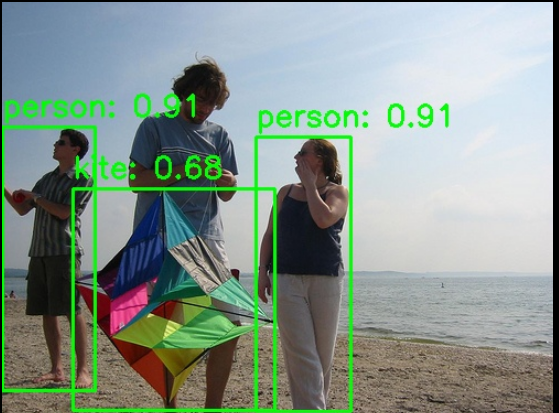

# 视觉 · 目标检测

## 1. 模块概述

- 主要功能：基于 YOLO 系列模型的通用目标检测，支持 COCO 80 类物体的实时检测，输出每个目标的边界框（bounding box）、置信度与类别标签。
- 规格或特性：
  - 支持模型：YOLOv5（n/s）、YOLOv8（n/s/m）、YOLOv11（n/s/m）、YOLO12（n/s）
  - 输入尺寸：`[1, 3, 640, 640]`
  - 量化类型：int8
  - 推理后端：ONNX Runtime + SpaceMITExecutionProvider
  - 接口形态：C++（`vision_service.h`）、Python（`ModelFactory`）
- 相关目录结构：

```
examples/yolov5/          # YOLOv5 示例
├── config/yolov5.yaml    # 配置文件
├── cpp/yolov5.cpp        # C++ 示例
├── python/yolov5.py      # Python 示例
└── scripts/              # 模型下载脚本
examples/yolov8/          # YOLOv8 示例（结构同上）
examples/yolov11/         # YOLOv11 示例（结构同上）
examples/yolo12/          # YOLO12 示例（结构同上）
src/deploy/yolov5/        # YOLOv5 部署实现
src/deploy/yolov8/        # YOLOv8 部署实现
src/deploy/yolov11/       # YOLOv11 部署实现
```

## 2. 环境准备

### 前置条件

SDK 源码获取和基础编译环境配置统一参考 [2.3-构建编译](../../02-快速入门/2.3-构建编译.md)。完成 SDK 初始化后，回到本文继续执行"构建编译"。

后续命令默认在 `spacemit_robot` SDK 根目录执行。

### 构建编译

系统缺少依赖时先安装：

```bash
sudo apt install python3-spacemit-ort opencv-spacemit libeigen3-dev spacemit-onnxruntime libyaml-cpp-dev
```

在 SDK 根目录加载构建环境后编译视觉组件：

```bash
source build/envsetup.sh
cd components/model_zoo/vision
mm
```

SDK 集成构建会把 `yolov8`、`yolov5`、`yolov11`、`yolo12` 等示例程序安装到 `output/staging/bin`，加载 `build/envsetup.sh` 后可直接运行。


运行 Python 示例前，先安装虚拟环境依赖，并创建、激活 `~/.comm-env`：

```bash
sudo apt install python3-venv python-is-python3 python3-pip
python3 -m venv ~/.comm-env
source ~/.comm-env/bin/activate
pip install -e .
```

模型权重默认存放路径为 `~/.cache/models/vision/yolov8/`、`~/.cache/models/vision/yolov5/`、`~/.cache/models/vision/yolov11/`、`~/.cache/models/vision/yolo12/`。须先手动执行下载脚本；缺失时程序会直接报错（Model file not found）。

## 3. 示例使用（从 0 跑通）

本节为读者**按步骤复现**的主线：命令可复制、路径写绝对或写明工作目录、每步给出**预期现象**。

### 3.1 YOLOv8 目标检测（Python）

**前置**：见 §2，依赖已安装，代码已克隆。

**步骤 1**：下载模型

```bash
cd components/model_zoo/vision
bash examples/yolov8/scripts/download_models.sh
```

预期现象：模型文件下载至 `~/.cache/models/vision/yolov8/yolov8n_no_dfl.q.onnx`。

**步骤 2**：下载测试素材

```bash
bash scripts/download_assets.sh
```

预期现象：测试图片下载至 `~/.cache/assets/image/` 目录。

**步骤 3**：运行推理

```bash
python3 examples/yolov8/python/yolov8.py --config examples/yolov8/config/yolov8.yaml
```

**步骤 4**（可选）：使用摄像头实时检测

先确认摄像头设备号（`--camera-id` 为 `/dev/videoN` 中的 `N`，默认 `0`）：

```bash
v4l2-ctl --list-devices
ls /dev/video*
```

若 `--camera-id 0` 无法打开，请根据输出选择实际采集节点（例如 `/dev/video20` 对应 `--camera-id 20`）。需要时可执行 `v4l2-ctl -d /dev/videoN --all` 查看节点详情。

```bash
python3 examples/yolov8/python/yolov8.py --config examples/yolov8/config/yolov8.yaml --use-camera --camera-id 0
```

### 3.2 YOLOv8 目标检测（C++）

**前置**：见 §2，C++ 编译完成。

**步骤 1**：下载模型（同 §3.1 步骤 1）

**步骤 2**：运行推理

```bash
cd components/model_zoo/vision
yolov8 examples/yolov8/config/yolov8.yaml
```

**步骤 3**（可选）：使用摄像头实时检测

设备号查询方式见 §3.1 步骤 4。

```bash
yolov8 examples/yolov8/config/yolov8.yaml --use-camera --camera-id 0
```

### 3.3 YOLOv5 目标检测

**步骤 1**：下载模型

```bash
bash examples/yolov5/scripts/download_models.sh
```

**步骤 2**：运行推理

```bash
# Python
python3 examples/yolov5/python/yolov5.py --config examples/yolov5/config/yolov5.yaml

# C++
yolov5 examples/yolov5/config/yolov5.yaml
```

### 3.4 YOLOv11 目标检测

**步骤 1**：下载模型

```bash
bash examples/yolov11/scripts/download_models.sh
```

**步骤 2**：运行推理

```bash
# Python
python3 examples/yolov11/python/yolov11.py --config examples/yolov11/config/yolov11.yaml

# C++
yolov11 examples/yolov11/config/yolov11.yaml
```

### 3.5 YOLO12 目标检测

**步骤 1**：下载模型

```bash
bash examples/yolo12/scripts/download_models.sh
```

预期现象：模型文件下载至 `~/.cache/models/vision/yolo12/yolo12n.q.onnx`。

**步骤 2**：运行推理

```bash
# Python
python3 examples/yolo12/python/yolo12.py --config examples/yolo12/config/yolo12.yaml

# C++
yolo12 examples/yolo12/config/yolo12.yaml
```

### 3.6 运行结果示例

**终端输出示例**（以 YOLOv8n 为例）：

```
Detected 3 objects:
  Class 0, Score: 0.9169, Box: [0.5929,113.6988,84.9922,352.1162]
  Class 0, Score: 0.9169, Box: [230.9947,122.2212,316.2409,371.1132]
  Class 33, Score: 0.6868, Box: [64.5499,169.1887,247.2958,370.5807]
Result image saved to: result.jpg
```

**可视化结果**：



图中展示了检测到的目标边界框、类别标签和置信度分数。

## 4. 应用开发

本章面向应用开发者，说明如何在自己的 C++ 或 Python 应用中集成目标检测组件。完整接口定义以 `include/vision_service.h` 和 `src/core/python/vision_model_factory.py` 为准；本节介绍常用公开接口和典型调用方式。

### 4.1 接口说明

目标检测组件的核心入口是 `VisionService`（C++）和 `ModelFactory`（Python）。应用侧通过这些接口加载 YOLO 模型，并发起图像或视频流的目标检测请求。

#### 4.1.1 常用数据结构

| 类型 | 说明 |
| --- | --- |
| vision::Detection | 目标检测结果结构体，含边界框 `bbox`（x1, y1, x2, y2）、置信度 `score`、类别 ID `label`。 |
| vision::Result | 统一结果变体（`std::variant`），目标检测时实际持有 `vision::Detection`。可用 `vision::get_bbox/get_label/get_score` 读取通用字段，或用 `std::get_if<vision::Detection>` 取具体类型。 |
| VisionServiceResponse | 推理响应，`results` 为 `vision::ResultList`（即 `std::vector<vision::Result>`），并含 `ok`、`error_message`。 |
| VisionServiceRequest | 推理请求，图像模型填充 `image`，可在 `params` 中临时覆盖 `conf_threshold`、`iou_threshold` 等参数。 |

#### 4.1.2 服务初始化

**C++ 接口**

| 接口 | 说明 | 参数 | 返回值 |
| --- | --- | --- | --- |
| VisionService::Create | 从 YAML 配置文件创建检测服务实例 | config_path：YAML 配置文件路径 | VisionService 智能指针 |
| VisionService::LastCreateError | 获取最近一次创建失败的错误信息 | 无 | 错误描述字符串 |

**Python 接口**

| 接口 | 说明 | 参数 | 返回值 |
| --- | --- | --- | --- |
| ModelFactory().create_model | 根据模型名与配置目录创建检测器实例 | model_name：模型名（config 文件名去扩展名）；config_dir：配置目录；override_params：可选覆盖参数 | 检测器对象 |

#### 4.1.3 目标检测

**C++ 接口**

| 接口 | 说明 | 参数 | 返回值 |
| --- | --- | --- | --- |
| Infer | 对图像文件进行目标检测 | image_path：图像文件路径；response：输出响应；params：可选推理参数 | VisionServiceStatus（VISION_SERVICE_OK 表示成功） |
| Infer | 对 cv::Mat 图像进行目标检测 | image：OpenCV Mat 对象；response：输出响应；params：可选推理参数 | VisionServiceStatus |
| Draw | 在图像上绘制检测结果（无状态，需显式传入响应） | image：输入图像；response：推理响应；out_image：输出图像 | VisionServiceStatus |
| LastError | 获取最近一次推理的错误信息 | 无 | 错误描述字符串 |

**Python 接口**

| 接口 | 说明 | 参数 | 返回值 |
| --- | --- | --- | --- |
| infer | 对图像进行目标检测 | image：numpy 数组（cv2 读取的图像） | 检测结果列表，每项含 `bbox`、`class_id`、`confidence` |
| draw_detections | 在图像上绘制检测结果（来自 `common.python.drawing`） | image、boxes、classes、scores、labels | 绘制后的图像 |

#### 4.1.4 性能监控

**C++ 接口**

| 接口 | 说明 | 参数 | 返回值 |
| --- | --- | --- | --- |
| SetTimingOptions | 启用/禁用性能计时 | options：VisionServiceTimingOptions（enabled、print_to_stdout） | void |
| GetLastTiming | 获取最近一次推理的各阶段耗时 | 无 | VisionServiceTiming 结构体（preprocess_ms、model_infer_ms、postprocess_ms、infer_ms 等） |

### 4.2 典型调用流程

#### 4.2.1 C++ 单图检测

```cpp
#include "vision_service.h"
#include <opencv2/opencv.hpp>
#include <iostream>

int main() {
    // 1. 创建服务
    auto service = VisionService::Create("examples/yolov8/config/yolov8.yaml");
    if (!service) {
        std::cerr << "Failed to create service: "
                  << VisionService::LastCreateError() << std::endl;
        return -1;
    }

    // 2. 启用性能计时（可选）
    VisionServiceTimingOptions timing_options;
    timing_options.enabled = true;
    service->SetTimingOptions(timing_options);

    // 3. 执行推理
    VisionServiceResponse response;
    if (service->Infer("test.jpg", &response) != VISION_SERVICE_OK) {
        std::cerr << "Inference failed: " << service->LastError() << std::endl;
        return -1;
    }

    // 4. 处理结果（结果为 vision::Result 变体，用访问器读取通用字段）
    std::cout << "Detected " << response.results.size() << " objects:" << std::endl;
    for (const auto& result : response.results) {
        const vision::BoundingBox box = vision::get_bbox(result);
        std::cout << "  Class " << vision::get_label(result)
                  << ", Score: " << vision::get_score(result)
                  << ", Box: [" << box.x1 << "," << box.y1 << ","
                  << box.x2 << "," << box.y2 << "]" << std::endl;
    }

    // 5. 绘制结果（Draw 无状态，需显式传入 response）
    cv::Mat image = cv::imread("test.jpg");
    cv::Mat output;
    service->Draw(image, response, &output);
    cv::imwrite("result.jpg", output);

    // 6. 查看性能指标（可选）
    auto timing = service->GetLastTiming();
    std::cout << "Preprocess: " << timing.preprocess_ms << " ms" << std::endl;
    std::cout << "Inference: " << timing.model_infer_ms << " ms" << std::endl;
    std::cout << "Postprocess: " << timing.postprocess_ms << " ms" << std::endl;

    return 0;
}
```

#### 4.2.2 C++ 视频流检测

```cpp
#include "vision_service.h"
#include <opencv2/opencv.hpp>

int main() {
    auto service = VisionService::Create("examples/yolov8/config/yolov8.yaml");
    cv::VideoCapture cap(0);  // 打开摄像头
    cv::Mat frame, output;

    while (cap.read(frame)) {
        VisionServiceResponse response;
        if (service->Infer(frame, &response) != VISION_SERVICE_OK) break;
        service->Draw(frame, response, &output);

        cv::imshow("Detection", output);
        if (cv::waitKey(1) == 'q') break;
    }

    return 0;
}
```

#### 4.2.3 Python 单图检测

```python
from pathlib import Path
import cv2
import numpy as np
from core.python.vision_model_factory import ModelFactory
from common.python.drawing import draw_detections

# 1. 创建检测器（model_name 为 config 文件名去扩展名）
config_path = Path("examples/yolov8/config/yolov8.yaml")
detector = ModelFactory().create_model("yolov8", config_dir=config_path.parent)

# 2. 执行推理
image = cv2.imread("test.jpg")
detections = detector.infer(image)

# 3. 处理结果（每项为 dict，含 bbox / class_id / confidence）
print(f"Detected {len(detections)} objects:")
for det in detections:
    bbox = det['bbox']
    print(f"  Class {det['class_id']}, Score: {det['confidence']:.4f}, "
          f"Box: [{bbox[0]:.1f},{bbox[1]:.1f},{bbox[2]:.1f},{bbox[3]:.1f}]")

# 4. 绘制结果（统一绘制接口）
boxes = np.array([det['bbox'] for det in detections])
classes = np.array([det['class_id'] for det in detections])
scores = np.array([det['confidence'] for det in detections])
output = draw_detections(image, boxes, classes, scores)
cv2.imwrite("result.jpg", output)
```

#### 4.2.4 Python 视频流检测

```python
from pathlib import Path
import cv2
import numpy as np
from core.python.vision_model_factory import ModelFactory
from common.python.drawing import draw_detections

config_path = Path("examples/yolov8/config/yolov8.yaml")
detector = ModelFactory().create_model("yolov8", config_dir=config_path.parent)
cap = cv2.VideoCapture(0)

while True:
    ret, frame = cap.read()
    if not ret:
        break

    detections = detector.infer(frame)
    boxes = np.array([det['bbox'] for det in detections]) if detections else np.empty((0, 4))
    classes = np.array([det['class_id'] for det in detections]) if detections else np.empty((0,))
    scores = np.array([det['confidence'] for det in detections]) if detections else np.empty((0,))
    output = draw_detections(frame, boxes, classes, scores)

    cv2.imshow("Detection", output)
    if cv2.waitKey(1) & 0xFF == ord('q'):
        break

cap.release()
cv2.destroyAllWindows()
```

### 4.3 配置说明

YAML 配置文件是模型加载和推理参数的核心，以下是完整配置项说明：

```yaml
# 模型文件路径（支持相对路径和 ~ 展开）
model_path: ~/.cache/models/vision/yolov8/yolov8n_no_dfl.q.onnx

# 测试图像路径（用于示例程序）
test_image: ~/.cache/assets/image/006_test.jpg

# 类别标签文件路径（COCO 80 类）
label_file_path: assets/labels/coco.txt

# 模型输入尺寸 [height, width]
image_size: [640, 640]

# 部署类名（用于 Python ModelFactory）
class: deploy.yolov8.YOLOv8Detector

# 推理参数
default_params:
  # 置信度阈值（0.0-1.0），低于此值的检测框将被过滤
  conf_threshold: 0.25
  
  # IOU 阈值（0.0-1.0），用于 NMS 非极大值抑制
  iou_threshold: 0.45
  
  # 推理线程数（示例默认 8；K3 平台 intra-op 最大建议 8，可按场景调低）
  num_threads: 8
  
  # 推理后端（优先使用 SpaceMITExecutionProvider）
  providers:
    - SpaceMITExecutionProvider
    - CPUExecutionProvider  # 备用后端
```

**参数调优建议**：

- **conf_threshold**：提高可减少误检，降低可增加召回率。默认 0.25 适用于大多数场景。
- **iou_threshold**：提高可保留更多重叠框，降低可减少冗余检测。默认 0.45 平衡效果。
- **num_threads**：示例 yaml 默认为 8，K3 平台 intra-op 线程数**最大建议 8**。若 CPU 竞争或延迟不稳定，可尝试降至 4 观察效果，不建议超过 8。
- **providers**：优先使用 SpaceMITExecutionProvider 以获得最佳性能，CPUExecutionProvider 作为备用。

### 4.4 性能监控

通过启用性能计时，可以分析推理各阶段的耗时，用于性能优化和瓶颈定位。

**C++ 示例**：

```cpp
VisionServiceTimingOptions timing_options;
timing_options.enabled = true;
service->SetTimingOptions(timing_options);

VisionServiceResponse response;
service->Infer("test.jpg", &response);

auto timing = service->GetLastTiming();
std::cout << "Preprocess: " << timing.preprocess_ms << " ms" << std::endl;
std::cout << "Inference: " << timing.model_infer_ms << " ms" << std::endl;
std::cout << "Postprocess: " << timing.postprocess_ms << " ms" << std::endl;
std::cout << "Total: " << timing.infer_ms << " ms" << std::endl;
```

**性能优化建议**：

- 预处理耗时高：检查图像尺寸是否过大，考虑降低输入分辨率。
- 推理耗时高：确认使用 SpaceMITExecutionProvider，检查线程数设置。
- 后处理耗时高：检查检测框数量是否过多，适当提高 conf_threshold。

**参考 demo 路径**：
- `examples/yolov8/`、`examples/yolov5/`、`examples/yolov11/`、`examples/yolo12/`
- 应用案例：`applications/fire_detection/`（火灾检测）、`applications/intrusion_detection/`（入侵检测）

## 5. 调试指南

- 启用计时：通过 `SetTimingOptions` 查看预处理、推理、后处理各阶段耗时
- 检查模型加载：`VisionService::LastCreateError()` 获取创建失败的详细信息
- 检查推理错误：`service->LastError()` 返回最近一次推理的错误信息
- 检测结果为空：调整 `conf_threshold` 观察检测数量变化，确认输入图片包含目标物体

## 6. 常见问题

| 现象 | 可能原因 | 处理 |
| --- | --- | --- |
| `Model file not found` | 模型未下载或路径错误 | 执行 `bash examples/yolov8/scripts/download_models.sh` 下载模型 |
| 检测结果为空 | `conf_threshold` 过高或输入图片无目标 | 降低 `conf_threshold`（如 0.1），换用包含目标的测试图片 |
| `SpaceMITExecutionProvider not found` | spacemit-ort 未安装 | `sudo apt-get install python3-spacemit-ort` |
| 推理速度慢 | 线程数设置不当或使用了 CPU provider | 确认 YAML 中 `providers` 为 `SpaceMITExecutionProvider`；`num_threads` 默认 8（最大建议 8），可按需调低 |

## 附录：性能与测试数据

以下数据摘自 Vision 组件 [`README.md`](../../../../README.md) 附录「**不包含前后处理**」（纯 ONNX 模型推理，不含图像预处理与后处理）。为 K3 平台阶段性实测结果，持续优化中，完整表见 README。

### K3 平台

| 具体模型 | 输入大小 | 数据类型 | 帧率 (4核) | 帧率 (8核) |
| --- | --- | --- | --- | --- |
| yolov5n | [1,3,640,640] | int8 | 69.1 | 104.4 |
| yolov5s | [1,3,640,640] | int8 | 41.3 | 62.8 |
| yolov8n | [1,3,640,640] | int8 | 60.8 | 97.0 |
| yolov8s | [1,3,640,640] | int8 | 36.3 | 57.1 |
| yolov8m | [1,3,640,640] | int8 | 19.5 | 30.6 |
| yolo11n | [1,3,640,640] | int8 | 45.1 | 70.8 |
| yolo11s | [1,3,640,640] | int8 | 29.4 | 45.3 |
| yolo11m | [1,3,640,640] | int8 | 14.5 | 22.7 |

**复现方法**：使用 `onnxruntime_perf_test` 工具（以 YOLOv8n 为例，4 线程）：

```bash
onnxruntime_perf_test ~/.cache/models/vision/yolov8/yolov8n_no_dfl.q.onnx -e spacemit -r 20 -x 1 -S 1 -s -I -c 1 -i "SPACEMIT_EP_INTRA_THREAD_NUM|4"
```

详细说明见 SpacemiT 社区文档 [AI 计算栈 · ONNX Runtime](https://www.spacemit.com/community/document/info?lang=zh&nodepath=ai/compute_stack/ai_compute_stack/onnxruntime.md) 中的 **onnxruntime_perf_test** 章节。
