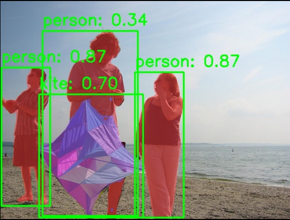

# 视觉 · 实例分割

## 1. 模块概述

- 主要功能：基于 YOLOv8-Seg 的实例分割，在检测目标边界框的同时输出每个实例的像素级掩码（mask），可区分同类不同个体。
- 规格或特性：
  - 支持模型：YOLOv8n-seg、YOLOv8s-seg、YOLOv8m-seg
  - 输入尺寸：`[1, 3, 640, 640]`
  - 量化类型：int8
  - 输出：边界框 + 置信度 + 类别 + 实例掩码
  - 推理后端：ONNX Runtime + SpaceMITExecutionProvider
  - 接口形态：C++（`vision_service.h`）、Python（`ModelFactory`）
- 相关目录结构：

```
examples/yolov8_seg/
├── config/yolov8_seg.yaml   # 配置文件
├── cpp/yolov8_seg.cpp       # C++ 示例
├── python/yolov8_seg.py     # Python 示例
└── scripts/                 # 模型下载脚本
src/deploy/yolov8_seg/       # 部署实现（C++ / Python）
```

## 2. 环境准备

### 前置条件

SDK 源码获取和基础编译环境配置统一参考 [2.3-构建编译](../../02-快速入门/2.3-构建编译.md)。完成 SDK 初始化后，回到本文继续执行"构建编译"。

后续命令默认在 `spacemit_robot` SDK 根目录执行。

### 构建编译

系统缺少依赖时先安装：

```bash
sudo apt install python3-spacemit-ort opencv-spacemit libeigen3-dev spacemit-onnxruntime libyaml-cpp-dev
```

在 SDK 根目录加载构建环境后编译视觉组件：

```bash
source build/envsetup.sh
cd components/model_zoo/vision
mm
```

SDK 集成构建会把 `yolov8_seg` 等示例程序安装到 `output/staging/bin`，加载 `build/envsetup.sh` 后可直接运行。

运行 Python 示例前，先安装虚拟环境依赖，并创建、激活 `~/.comm-env`：

```bash
sudo apt install python3-venv python-is-python3 python3-pip
python3 -m venv ~/.comm-env
source ~/.comm-env/bin/activate
pip install -e .
```

模型权重默认存放路径为 `~/.cache/models/vision/yolov8_seg/`。程序首次运行时会检查模型，缺失时按组件下载逻辑准备。

## 3. 示例使用（从 0 跑通）

### 3.1 YOLOv8-Seg 实例分割（Python）

**前置**：见 §2。

**步骤 1**：下载模型

```bash
cd components/model_zoo/vision
bash examples/yolov8_seg/scripts/download_models.sh
```

预期现象：模型文件下载至 `~/.cache/models/vision/yolov8_seg/yolov8n-seg.q.onnx`。

**步骤 2**：下载测试素材

```bash
bash scripts/download_assets.sh
```

**步骤 3**：运行推理

```bash
python3 examples/yolov8_seg/python/yolov8_seg.py --config examples/yolov8_seg/config/yolov8_seg.yaml
```

**步骤 4**（可选）：使用摄像头实时分割

```bash
python3 examples/yolov8_seg/python/yolov8_seg.py --config examples/yolov8_seg/config/yolov8_seg.yaml --use-camera --camera-id 0
```

### 3.2 YOLOv8-Seg 实例分割（C++）

**前置**：见 §2，C++ 编译完成。

**步骤 1**：下载模型（同 §3.1 步骤 1）

**步骤 2**：运行推理

```bash
yolov8_seg examples/yolov8_seg/config/yolov8_seg.yaml
```

**步骤 3**（可选）：使用摄像头实时分割

```bash
yolov8_seg examples/yolov8_seg/config/yolov8_seg.yaml --use-camera --camera-id 0
```

### 3.3 运行结果示例

**终端输出示例**：

```
Detected 4 objects with segmentation masks
Result image saved to: yolov8_seg_result.jpg
```

**可视化结果**：



图中展示了检测到的目标边界框和彩色实例掩码，不同实例使用不同颜色区分。

## 4. 应用开发

本章面向应用开发者，说明如何在自己的 C++ 或 Python 应用中集成实例分割组件。完整接口定义以 `include/vision_service.h` 和 `src/core/python/vision_model_factory.py` 为准；本节介绍常用公开接口和典型调用方式。

### 4.1 接口说明

实例分割组件的核心入口是 `VisionService`（C++）和 `ModelFactory`（Python）。应用侧通过这些接口加载 YOLOv8-Seg 模型，并发起图像或视频流的实例分割请求。

#### 4.1.1 常用数据结构

| 类型 | 说明 |
| --- | --- |
| VisionServiceResult | 分割结果，包含边界框坐标（x1, y1, x2, y2）、置信度（score）、类别 ID（label）、实例掩码（mask）。 |
| VisionServiceConfig | 配置参数，包含模型路径、输入尺寸、置信度阈值、IOU 阈值、线程数、推理后端等。 |

#### 4.1.2 服务初始化

**C++ 接口**

| 接口 | 说明 | 参数 | 返回值 |
| --- | --- | --- | --- |
| VisionService::Create | 从 YAML 配置文件创建分割服务实例 | config_path：YAML 配置文件路径 | VisionService 智能指针 |
| VisionService::LastCreateError | 获取最近一次创建失败的错误信息 | 无 | 错误描述字符串 |

**Python 接口**

| 接口 | 说明 | 参数 | 返回值 |
| --- | --- | --- | --- |
| ModelFactory.create | 从 YAML 配置文件创建分割器实例 | config_path：YAML 配置文件路径 | 分割器对象 |

#### 4.1.3 实例分割

**C++ 接口**

| 接口 | 说明 | 参数 | 返回值 |
| --- | --- | --- | --- |
| InferImage | 对单张图像进行实例分割 | image_path：图像文件路径；results：输出结果向量 | bool（成功/失败） |
| InferImage | 对 cv::Mat 图像进行实例分割 | image：OpenCV Mat 对象；results：输出结果向量 | bool（成功/失败） |
| Draw | 在图像上绘制分割结果（边界框、标签、掩码） | input：输入图像；output：输出图像 | void |
| LastError | 获取最近一次推理的错误信息 | 无 | 错误描述字符串 |

**Python 接口**

| 接口 | 说明 | 参数 | 返回值 |
| --- | --- | --- | --- |
| detect | 对图像进行实例分割 | image_path：图像文件路径或 numpy 数组 | 分割结果列表 |
| draw | 在图像上绘制分割结果 | image：输入图像；results：分割结果 | 绘制后的图像 |

#### 4.1.4 性能监控

**C++ 接口**

| 接口 | 说明 | 参数 | 返回值 |
| --- | --- | --- | --- |
| SetTimingOptions | 启用/禁用性能计时 | enable：是否启用 | void |
| GetTimingInfo | 获取最近一次推理的各阶段耗时 | 无 | TimingInfo 结构体（预处理、推理、后处理耗时） |

### 4.2 典型调用流程

#### 4.2.1 C++ 单图分割

```cpp
#include "vision_service.h"
#include <opencv2/opencv.hpp>
#include <iostream>

int main() {
    // 1. 创建服务
    auto service = VisionService::Create("examples/yolov8_seg/config/yolov8_seg.yaml");
    if (!service) {
        std::cerr << "Failed to create service: " 
                  << VisionService::LastCreateError() << std::endl;
        return -1;
    }

    // 2. 启用性能计时（可选）
    service->SetTimingOptions(true);

    // 3. 执行推理
    std::vector<VisionServiceResult> results;
    if (!service->InferImage("test.jpg", &results)) {
        std::cerr << "Inference failed: " << service->LastError() << std::endl;
        return -1;
    }

    // 4. 处理结果
    std::cout << "Detected " << results.size() << " objects with masks:" << std::endl;
    for (const auto& r : results) {
        std::cout << "  Class " << r.label 
                  << ", Score: " << r.score
                  << ", Box: [" << r.x1 << "," << r.y1 << "," 
                  << r.x2 << "," << r.y2 << "]";
        
        // 检查掩码是否存在
        if (!r.mask.empty()) {
            std::cout << ", Mask size: " << r.mask.size() << std::endl;
        } else {
            std::cout << ", No mask" << std::endl;
        }
    }

    // 5. 绘制结果（包含掩码）
    cv::Mat image = cv::imread("test.jpg");
    cv::Mat output;
    service->Draw(image, &output);
    cv::imwrite("result.jpg", output);

    // 6. 查看性能指标（可选）
    auto timing = service->GetTimingInfo();
    std::cout << "Preprocess: " << timing.preprocess_ms << " ms" << std::endl;
    std::cout << "Inference: " << timing.inference_ms << " ms" << std::endl;
    std::cout << "Postprocess: " << timing.postprocess_ms << " ms" << std::endl;

    return 0;
}
```

#### 4.2.2 C++ 视频流分割

```cpp
#include "vision_service.h"
#include <opencv2/opencv.hpp>

int main() {
    auto service = VisionService::Create("examples/yolov8_seg/config/yolov8_seg.yaml");
    cv::VideoCapture cap(0);  // 打开摄像头
    cv::Mat frame, output;

    while (cap.read(frame)) {
        std::vector<VisionServiceResult> results;
        service->InferImage(frame, &results);
        service->Draw(frame, &output);
        
        cv::imshow("Segmentation", output);
        if (cv::waitKey(1) == 'q') break;
    }

    return 0;
}
```

#### 4.2.3 Python 单图分割

```python
from src.core.python.vision_model_factory import ModelFactory
import cv2
import numpy as np

# 1. 创建分割器
segmentor = ModelFactory.create("examples/yolov8_seg/config/yolov8_seg.yaml")

# 2. 执行推理
results = segmentor.detect("test.jpg")

# 3. 处理结果
print(f"Detected {len(results)} objects with masks:")
for r in results:
    print(f"  Class {r['label']}, Score: {r['score']:.4f}, "
          f"Box: [{r['x1']:.1f},{r['y1']:.1f},{r['x2']:.1f},{r['y2']:.1f}]")
    
    # 访问掩码
    if 'mask' in r and r['mask'] is not None:
        mask = r['mask']
        print(f"    Mask shape: {mask.shape}, dtype: {mask.dtype}")

# 4. 绘制结果
image = cv2.imread("test.jpg")
output = segmentor.draw(image, results)
cv2.imwrite("result.jpg", output)
```

#### 4.2.4 Python 视频流分割

```python
from src.core.python.vision_model_factory import ModelFactory
import cv2

segmentor = ModelFactory.create("examples/yolov8_seg/config/yolov8_seg.yaml")
cap = cv2.VideoCapture(0)

while True:
    ret, frame = cap.read()
    if not ret:
        break
    
    results = segmentor.detect(frame)
    output = segmentor.draw(frame, results)
    
    cv2.imshow("Segmentation", output)
    if cv2.waitKey(1) & 0xFF == ord('q'):
        break

cap.release()
cv2.destroyAllWindows()
```

### 4.3 配置说明

YAML 配置文件是模型加载和推理参数的核心，以下是完整配置项说明：

```yaml
# 模型文件路径（必须是 -seg 后缀的分割模型）
model_path: ~/.cache/models/vision/yolov8_seg/yolov8n-seg.q.onnx

# 测试图像路径（用于示例程序）
test_image: ~/.cache/assets/image/006_test.jpg

# 类别标签文件路径（COCO 80 类）
label_file_path: assets/labels/coco.txt

# 模型输入尺寸 [height, width]
image_size: [640, 640]

# 部署类名（用于 Python ModelFactory）
class: deploy.yolov8_seg.YOLOv8SegDetector

# 推理参数
default_params:
  # 置信度阈值（0.0-1.0），低于此值的检测框将被过滤
  conf_threshold: 0.25
  
  # IOU 阈值（0.0-1.0），用于 NMS 非极大值抑制
  iou_threshold: 0.45
  
  # 推理线程数（K3 平台建议 4）
  num_threads: 4
  
  # 推理后端（优先使用 SpaceMITExecutionProvider）
  providers:
    - SpaceMITExecutionProvider
    - CPUExecutionProvider  # 备用后端
```

**参数调优建议**：

- **conf_threshold**：提高可减少误检，降低可增加召回率。默认 0.25 适用于大多数场景。
- **iou_threshold**：提高可保留更多重叠框，降低可减少冗余检测。默认 0.45 平衡效果。
- **num_threads**：K3 平台建议设为 4，过高可能导致性能下降。
- **providers**：优先使用 SpaceMITExecutionProvider 以获得最佳性能，CPUExecutionProvider 作为备用。
- **image_size**：保持 [640, 640] 以获得最佳分割精度，降低分辨率会导致掩码边界粗糙。

### 4.4 性能监控

通过启用性能计时，可以分析推理各阶段的耗时，用于性能优化和瓶颈定位。

**C++ 示例**：

```cpp
service->SetTimingOptions(true);
service->InferImage("test.jpg", &results);

auto timing = service->GetTimingInfo();
std::cout << "Preprocess: " << timing.preprocess_ms << " ms" << std::endl;
std::cout << "Inference: " << timing.inference_ms << " ms" << std::endl;
std::cout << "Postprocess: " << timing.postprocess_ms << " ms" << std::endl;
std::cout << "Total: " << (timing.preprocess_ms + timing.inference_ms + timing.postprocess_ms) << " ms" << std::endl;
```

**性能优化建议**：

- 预处理耗时高：检查图像尺寸是否过大，考虑降低输入分辨率（但会影响掩码质量）。
- 推理耗时高：确认使用 SpaceMITExecutionProvider，检查线程数设置。实例分割比目标检测慢 20-30%。
- 后处理耗时高：掩码生成和 NMS 是主要开销，适当提高 conf_threshold 可减少处理对象数量。

**参考 demo 路径**：`examples/yolov8_seg/`

## 5. 调试指南

- 启用计时：通过 `SetTimingOptions` 查看预处理、推理、后处理各阶段耗时
- 掩码为空：确认使用的是 `-seg` 后缀的模型文件，普通检测模型不输出掩码
- 检查模型加载：`VisionService::LastCreateError()` 获取错误详情

## 6. 常见问题

| 现象 | 可能原因 | 处理 |
| --- | --- | --- |
| `Model file not found` | 模型未下载 | 执行 `bash examples/yolov8_seg/scripts/download_models.sh` |
| 掩码结果为空 | 使用了非 seg 模型 | 确认 `model_path` 指向 `yolov8n-seg.q.onnx` |
| 分割边界粗糙 | 输入分辨率不足 | 确认 `image_size` 为 `[640, 640]` |

## 附录：性能与测试数据

### K3 平台

| 具体模型 | 输入大小 | 数据类型 | 帧率 (4 核) |
| --- | --- | --- | --- |
| yolov8n-seg | [1,3,640,640] | int8 | 42.4 |
| yolov8s-seg | [1,3,640,640] | int8 | 27.3 |
| yolov8m-seg | [1,3,640,640] | int8 | 15.4 |

**测试方法**：使用 `onnxruntime_perf_test` 工具，4 线程，SpaceMITExecutionProvider，20 次迭代取平均。

```bash
onnxruntime_perf_test ~/.cache/models/vision/yolov8_seg/yolov8n-seg.q.onnx -e spacemit -r 20 -x 1 -S 1 -s -I -c 1 -i "SPACEMIT_EP_INTRA_THREAD_NUM|4"
```
