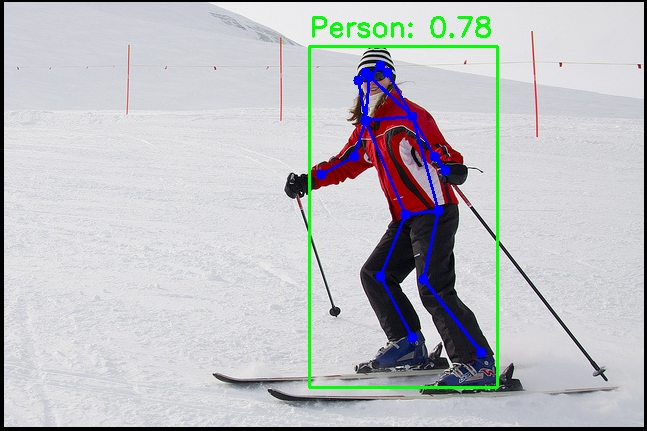

# 视觉 · 人体姿态

## 1. 模块概述

- 主要功能：基于 YOLOv8-Pose 的人体关键点检测，输出每个人体的边界框与 17 个 COCO 格式关键点（鼻子、眼睛、耳朵、肩膀、肘部、手腕、臀部、膝盖、脚踝），可用于姿态分析、行为识别前置等场景。
- 规格或特性：
  - 支持模型：YOLOv8n-pose、YOLOv8s-pose、YOLOv8m-pose
  - 输入尺寸：`[1, 3, 640, 640]`
  - 量化类型：int8
  - 输出：边界框 + 置信度 + 17 个关键点（x, y, visibility）
  - 推理后端：ONNX Runtime + SpaceMITExecutionProvider
  - 接口形态：C++（`vision_service.h`）、Python（`spacemit_vision` wheel：`VisionServiceNative`）
- 相关目录结构：

```
examples/yolov8_pose/
├── config/yolov8_pose.yaml   # 配置文件
├── cpp/yolov8_pose.cpp       # C++ 示例
├── python/yolov8_pose.py     # Python 示例
└── scripts/                  # 模型下载脚本
src/deploy/yolov8_pose/       # 部署实现（C++ / Python）
```

## 2. 环境准备

### 前置条件

SDK 源码获取和基础编译环境配置统一参考 [2.3-构建编译](../../02-快速入门/2.3-构建编译.md)。完成 SDK 初始化后，回到本文继续执行"构建编译"。

后续命令默认在 `spacemit_robot` SDK 根目录执行。

### 构建编译

系统缺少依赖时先安装：

```bash
sudo apt install python3-spacemit-ort opencv-spacemit libeigen3-dev spacemit-onnxruntime libyaml-cpp-dev
```

在 SDK 根目录加载构建环境后编译视觉组件：

```bash
source build/envsetup.sh
cd components/model_zoo/vision
mm
```

SDK 集成构建会把 `yolov8_pose` 等示例程序安装到 `output/staging/bin`，加载 `build/envsetup.sh` 后可直接运行。

运行 Python 示例前，需先安装 `spacemit_vision` wheel：

```bash
cd components/model_zoo/vision
python3 -m pip install -U pybind11 build setuptools wheel
cmake -S . -B build && cmake --build build -j
python3 -m pip install --force-reinstall src/python/dist/*.whl
python3 -c "from spacemit_vision import VisionServiceNative; print('ok')"
```

模型权重默认存放路径为 `~/.cache/models/vision/yolov8_pose/`。须先手动执行下载脚本；缺失时程序会直接报错（Model file not found）。

## 3. 示例使用（从 0 跑通）

### 3.1 YOLOv8-Pose 姿态估计（Python）

**前置**：见 §2。

**步骤 1**：下载模型

```bash
cd components/model_zoo/vision
bash examples/yolov8_pose/scripts/download_models.sh
```

预期现象：模型文件下载至 `~/.cache/models/vision/yolov8_pose/yolov8n-pose.q.onnx`。

**步骤 2**：下载测试素材

```bash
bash scripts/download_assets.sh
```

**步骤 3**：运行推理

```bash
python3 examples/yolov8_pose/python/yolov8_pose.py --config examples/yolov8_pose/config/yolov8_pose.yaml
```

**步骤 4**（可选）：使用摄像头实时姿态估计

先确认摄像头设备号（`--camera-id` 为 `/dev/videoN` 中的 `N`，默认 `0`）：

```bash
v4l2-ctl --list-devices
ls /dev/video*
```

若 `--camera-id 0` 无法打开，请根据输出选择实际采集节点（例如 `/dev/video20` 对应 `--camera-id 20`）。需要时可执行 `v4l2-ctl -d /dev/videoN --all` 查看节点详情。

```bash
python3 examples/yolov8_pose/python/yolov8_pose.py --config examples/yolov8_pose/config/yolov8_pose.yaml --use-camera --camera-id 0
```

### 3.2 YOLOv8-Pose 姿态估计（C++）

**前置**：见 §2，C++ 编译完成。

**步骤 1**：下载模型（同 §3.1 步骤 1）

**步骤 2**：运行推理

```bash
yolov8_pose examples/yolov8_pose/config/yolov8_pose.yaml
```

**步骤 3**（可选）：使用摄像头实时姿态估计

设备号查询方式见 §3.1 步骤 4。

```bash
yolov8_pose examples/yolov8_pose/config/yolov8_pose.yaml --use-camera --camera-id 0
```

### 3.3 运行结果示例

**终端输出示例**：

```
Detected 3 persons with keypoints
Result image saved to: yolov8_pose_result.jpg
```

**可视化结果**：



图中展示了检测到的人体边界框、17 个 COCO 关键点和连接骨架线。

## 4. 应用开发

本章面向应用开发者，说明如何在自己的 C++ 或 Python 应用中集成人体姿态估计组件。完整接口定义以 `include/vision_service.h` 和 `src/python/spacemit_vision/vision_service_native.py` 为准；本节介绍常用公开接口和典型调用方式。

### 4.1 接口说明

人体姿态估计组件的核心入口是 `VisionService`（C++）和 `VisionServiceNative`（Python，`spacemit_vision` wheel）。应用侧通过这些接口加载 YOLOv8-Pose 模型，并发起图像或视频流的姿态估计请求。

#### 4.1.1 常用数据结构

| 类型 | 说明 |
| --- | --- |
| VisionServiceResponse | 统一推理响应，`results` 字段为 `vision::ResultList`（即 `std::vector<vision::Result>` 变体列表），另含 `ok`、`error_message`。 |
| vision::Pose | 姿态估计结果具体类型（位于 `namespace vision`），包含边界框（bbox）、置信度（score）、类别（label）、17 个 COCO 关键点（`std::vector<vision::KeyPoint> keypoints`）。 |
| vision::BoundingBox | 边界框结构，包含坐标 x1、y1、x2、y2。 |
| vision::KeyPoint | 关键点结构，包含坐标（x, y）和可见度（visibility，0.0-1.0）。 |
| VisionServiceInferParams | 推理参数，包含 conf_threshold、iou_threshold、kp_threshold、top_k、max_det 等（字段 <= 0 表示沿用配置默认值）。 |

#### 4.1.2 服务初始化

**C++ 接口**

| 接口 | 说明 | 参数 | 返回值 |
| --- | --- | --- | --- |
| VisionService::Create | 从 YAML 配置文件创建姿态估计服务实例 | config_path：YAML 配置文件路径 | VisionService 智能指针 |
| VisionService::LastCreateError | 获取最近一次创建失败的错误信息 | 无 | 错误描述字符串 |

**Python 接口**

| 接口 | 说明 | 参数 | 返回值 |
| --- | --- | --- | --- |
| VisionServiceNative.create | 从 YAML 配置文件创建姿态估计服务 | config_path：YAML 路径；model_path_override：可选覆盖模型路径 | VisionServiceNative 实例 |
| VisionServiceNative.last_create_error | 获取最近一次创建失败的错误信息 | 无 | 错误描述字符串 |

#### 4.1.3 姿态估计

**C++ 接口**

| 接口 | 说明 | 参数 | 返回值 |
| --- | --- | --- | --- |
| Infer | 对单张图像进行姿态估计 | image_path：图像文件路径；response：输出响应指针 | VisionServiceStatus（VISION_SERVICE_OK 表示成功） |
| Infer | 对 cv::Mat 图像进行姿态估计 | image：OpenCV Mat 对象；response：输出响应指针 | VisionServiceStatus（VISION_SERVICE_OK 表示成功） |
| Draw | 在图像上绘制姿态结果（边界框、关键点、骨架），无状态 | image：输入图像；response：推理响应；out_image：输出图像指针 | VisionServiceStatus |
| LastError | 获取最近一次推理的错误信息 | 无 | 错误描述字符串 |

**Python 接口**

| 接口 | 说明 | 参数 | 返回值 |
| --- | --- | --- | --- |
| infer_image | 对图像进行姿态估计 | image_or_path：BGR numpy 数组或图像路径；conf/iou：可选阈值 | (VisionServiceStatus, results 列表；每项含 score、x1~y2、keypoints) |
| draw | 绘制最近一次推理结果（含骨架） | image：BGR numpy 数组 | (VisionServiceStatus, 绘制后图像) |
| supports_draw | 当前模型是否支持 C++ 侧绘制 | 无 | bool |
| last_error | 获取最近一次推理错误 | 无 | 错误描述字符串 |

#### 4.1.4 性能监控

**C++ 接口**

| 接口 | 说明 | 参数 | 返回值 |
| --- | --- | --- | --- |
| SetTimingOptions | 启用/禁用性能计时 | options：VisionServiceTimingOptions（enabled、print_to_stdout） | void |
| GetLastTiming | 获取最近一次推理的各阶段耗时 | 无 | VisionServiceTiming 结构体（preprocess_ms、model_infer_ms、postprocess_ms、infer_ms 等） |

### 4.2 典型调用流程

#### 4.2.1 C++ 单图姿态估计

```cpp
#include "vision_service.h"
#include <opencv2/opencv.hpp>
#include <iostream>

int main() {
    // 1. 创建服务
    auto service = VisionService::Create("examples/yolov8_pose/config/yolov8_pose.yaml");
    if (!service) {
        std::cerr << "Failed to create service: " 
                  << VisionService::LastCreateError() << std::endl;
        return -1;
    }

    // 2. 启用性能计时（可选）
    VisionServiceTimingOptions timing_options;
    timing_options.enabled = true;
    service->SetTimingOptions(timing_options);

    // 3. 执行推理
    VisionServiceResponse response;
    VisionServiceStatus ret = service->Infer("test.jpg", &response);
    if (ret != VISION_SERVICE_OK) {
        std::cerr << "Inference failed: " << service->LastError() << std::endl;
        return -1;
    }

    // 4. 处理结果
    std::cout << "Detected " << response.results.size() << " persons with keypoints:" << std::endl;
    for (const auto& result : response.results) {
        vision::BoundingBox box = vision::get_bbox(result);
        std::cout << "  Person - Score: " << vision::get_score(result)
                  << ", Box: [" << box.x1 << "," << box.y1 << ","
                  << box.x2 << "," << box.y2 << "]" << std::endl;

        // 取出姿态具体类型，遍历 17 个关键点
        const vision::Pose* pose = std::get_if<vision::Pose>(&result);
        if (pose) {
            std::cout << "  Keypoints:" << std::endl;
            for (size_t i = 0; i < pose->keypoints.size(); ++i) {
                const vision::KeyPoint& kp = pose->keypoints[i];
                std::cout << "    [" << i << "] (" << kp.x << "," << kp.y
                          << ") visibility: " << kp.visibility << std::endl;
            }
        }
    }

    // 5. 绘制结果（包含骨架）
    cv::Mat image = cv::imread("test.jpg");
    cv::Mat output;
    service->Draw(image, response, &output);
    cv::imwrite("result.jpg", output);

    // 6. 查看性能指标（可选）
    VisionServiceTiming timing = service->GetLastTiming();
    std::cout << "Preprocess: " << timing.preprocess_ms << " ms" << std::endl;
    std::cout << "Model infer: " << timing.model_infer_ms << " ms" << std::endl;
    std::cout << "Postprocess: " << timing.postprocess_ms << " ms" << std::endl;
    std::cout << "Total: " << timing.infer_ms << " ms" << std::endl;

    return 0;
}
```

#### 4.2.2 C++ 视频流姿态估计

```cpp
#include "vision_service.h"
#include <opencv2/opencv.hpp>

int main() {
    auto service = VisionService::Create("examples/yolov8_pose/config/yolov8_pose.yaml");
    cv::VideoCapture cap(0);  // 打开摄像头
    cv::Mat frame, output;

    while (cap.read(frame)) {
        VisionServiceResponse response;
        VisionServiceStatus ret = service->Infer(frame, &response);
        if (ret != VISION_SERVICE_OK) break;
        service->Draw(frame, response, &output);

        cv::imshow("Pose Estimation", output);
        if (cv::waitKey(1) == 'q') break;
    }

    return 0;
}
```

#### 4.2.3 Python 单图姿态估计

```python
import cv2
from spacemit_vision import VisionServiceNative, VisionServiceStatus

svc = VisionServiceNative.create("examples/yolov8_pose/config/yolov8_pose.yaml")
image = cv2.imread("test.jpg")

status, results = svc.infer_image(image)
if status != VisionServiceStatus.OK:
    raise RuntimeError(svc.last_error())

print(f"Detected {len(results)} persons:")
for r in results:
    print(f"  Score: {r.score:.4f}, Box: [{r.x1:.0f},{r.y1:.0f},{r.x2:.0f},{r.y2:.0f}]")
    for i, kp in enumerate(r.keypoints):
        print(f"    [{i}] ({kp.x:.1f},{kp.y:.1f}) visibility: {kp.visibility:.2f}")

if svc.supports_draw():
    st, output = svc.draw(image)
    if st == VisionServiceStatus.OK:
        cv2.imwrite("result.jpg", output)
```

#### 4.2.4 Python 视频流姿态估计

```python
import cv2
from spacemit_vision import VisionServiceNative, VisionServiceStatus

svc = VisionServiceNative.create("examples/yolov8_pose/config/yolov8_pose.yaml")
cap = cv2.VideoCapture(0)

while True:
    ret, frame = cap.read()
    if not ret:
        break
    status, _ = svc.infer_image(frame)
    if status != VisionServiceStatus.OK:
        break
    output = frame
    if svc.supports_draw():
        st, output = svc.draw(frame)
    cv2.imshow("Pose Estimation", output)
    if cv2.waitKey(1) & 0xFF == ord('q'):
        break

cap.release()
cv2.destroyAllWindows()
```

### 4.3 配置说明

YAML 配置文件是模型加载和推理参数的核心，以下是完整配置项说明：

```yaml
# 模型文件路径（必须是 -pose 后缀的姿态估计模型）
model_path: ~/.cache/models/vision/yolov8_pose/yolov8n-pose.q.onnx

# 测试图像路径（用于示例程序）
test_image: ~/.cache/assets/image/006_test.jpg

# 类别标签文件路径（COCO 80 类，姿态估计主要使用 person 类）
label_file_path: assets/labels/coco.txt

# 模型输入尺寸 [height, width]
image_size: [640, 640]

# 部署类名（C++ 模型工厂注册名，Python 通过 yaml 路径间接使用）
class: deploy.yolov8_pose.YOLOv8PoseDetector

# 推理参数
default_params:
  # 置信度阈值（0.0-1.0），低于此值的检测框将被过滤
  conf_threshold: 0.25
  
  # IOU 阈值（0.0-1.0），用于 NMS 非极大值抑制
  iou_threshold: 0.45
  
  # 推理线程数（示例默认 8；K3 平台 intra-op 最大建议 8，可按场景调低）
  num_threads: 8
  
  # 推理后端（优先使用 SpaceMITExecutionProvider）
  providers:
    - SpaceMITExecutionProvider
    - CPUExecutionProvider  # 备用后端
```

**参数调优建议**：

- **conf_threshold**：提高可减少误检，降低可增加召回率。默认 0.25 适用于大多数场景。
- **iou_threshold**：提高可保留更多重叠框，降低可减少冗余检测。默认 0.45 平衡效果。
- **num_threads**：示例 yaml 默认为 8，K3 平台 intra-op 线程数**最大建议 8**。若 CPU 竞争或延迟不稳定，可尝试降至 4 观察效果，不建议超过 8。
- **providers**：优先使用 SpaceMITExecutionProvider 以获得最佳性能，CPUExecutionProvider 作为备用。

**COCO 17 关键点索引**：

| 索引 | 关键点 | 索引 | 关键点 |
| --- | --- | --- | --- |
| 0 | 鼻子 | 9 | 左手腕 |
| 1 | 左眼 | 10 | 右手腕 |
| 2 | 右眼 | 11 | 左臀 |
| 3 | 左耳 | 12 | 右臀 |
| 4 | 右耳 | 13 | 左膝 |
| 5 | 左肩 | 14 | 右膝 |
| 6 | 右肩 | 15 | 左脚踝 |
| 7 | 左肘 | 16 | 右脚踝 |
| 8 | 右肘 | | |

### 4.4 性能监控

通过启用性能计时，可以分析推理各阶段的耗时，用于性能优化和瓶颈定位。

**C++ 示例**：

```cpp
VisionServiceTimingOptions timing_options;
timing_options.enabled = true;
service->SetTimingOptions(timing_options);

VisionServiceResponse response;
service->Infer("test.jpg", &response);

VisionServiceTiming timing = service->GetLastTiming();
std::cout << "Preprocess: " << timing.preprocess_ms << " ms" << std::endl;
std::cout << "Model infer: " << timing.model_infer_ms << " ms" << std::endl;
std::cout << "Postprocess: " << timing.postprocess_ms << " ms" << std::endl;
std::cout << "Total: " << timing.infer_ms << " ms" << std::endl;
```

**性能优化建议**：

- 预处理耗时高：检查图像尺寸是否过大，考虑降低输入分辨率。
- 推理耗时高：确认使用 SpaceMITExecutionProvider，检查线程数设置。姿态估计比目标检测略慢。
- 后处理耗时高：关键点解码和 NMS 是主要开销，适当提高 conf_threshold 可减少处理对象数量。

**参考 demo 路径**：
- `examples/yolov8_pose/`
- 下游应用：`applications/fall_detection/`（跌倒检测，姿态 + STGCN 联合推理）

## 5. 调试指南

- 启用计时：通过 `SetTimingOptions` 查看各阶段耗时
- 关键点可见度低：检查输入图片中人体是否被遮挡，调整 `conf_threshold`
- 骨架绘制异常：确认使用的是 `-pose` 后缀的模型文件

## 6. 常见问题

| 现象 | 可能原因 | 处理 |
| --- | --- | --- |
| `Model file not found` | 模型未下载 | 执行 `bash examples/yolov8_pose/scripts/download_models.sh` |
| `No module named 'spacemit_vision'` | wheel 未安装 | 按 §2 编译并 `pip install src/python/dist/*.whl` |
| 关键点为空 | 使用了非 pose 模型 | 确认 `model_path` 指向 `yolov8n-pose.q.onnx` |
| 部分关键点缺失 | 人体被遮挡 | 正常现象，`visibility` 字段标识可见度 |

## 附录：性能与测试数据

以下数据摘自 Vision 组件 [`README.md`](../../../../README.md) 附录「**不包含前后处理**」（纯 ONNX 模型推理，不含图像预处理与后处理）。为 K3 平台阶段性实测结果，完整表见 README。

### K3 平台

| 具体模型 | 输入大小 | 数据类型 | 帧率 (4核) | 帧率 (8核) |
| --- | --- | --- | --- | --- |
| yolov8n-pose | [1,3,640,640] | int8 | 61.1 | 88.9 |
| yolov8s-pose | [1,3,640,640] | int8 | 35.4 | 52.9 |
| yolov8m-pose | [1,3,640,640] | int8 | 19.3 | 29.3 |

**复现方法**：使用 `onnxruntime_perf_test` 工具（4 线程）：

```bash
onnxruntime_perf_test ~/.cache/models/vision/yolov8_pose/yolov8n-pose.q.onnx -e spacemit -r 20 -x 1 -S 1 -s -I -c 1 -i "SPACEMIT_EP_INTRA_THREAD_NUM|4"
```