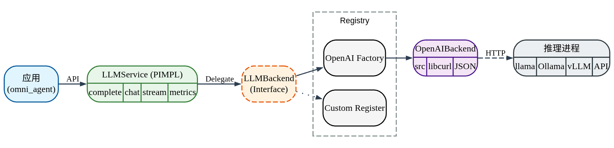
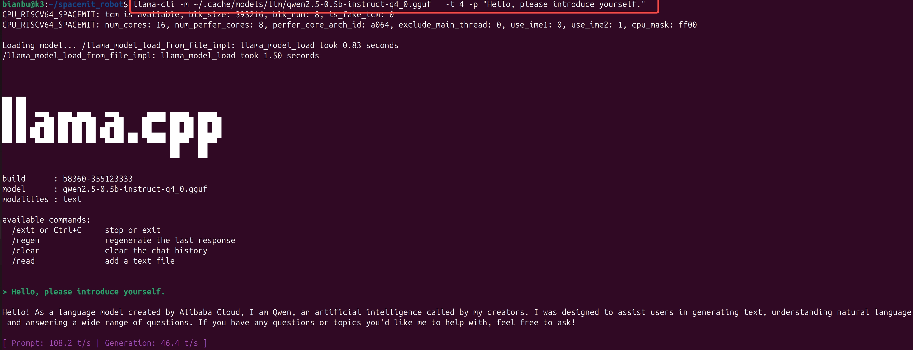
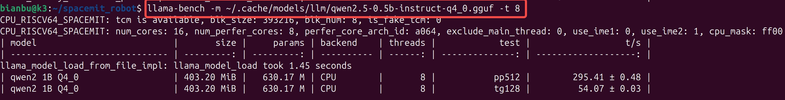
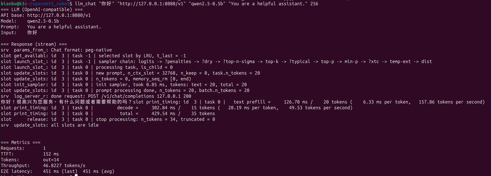

# LLM

## 1. 模块概述

LLM模块的主要功能是提供统一的 C++ LLM 调用接口，方便用户使用C++的接口实现上层应用，在机器人应用中集成“对话/推理/工具调用”能力，支持单轮、多轮、流式与 Tool Calling。

下面是 spacemit_robot/components/model_zoo/llm 的软件分层示意图，从左到右为调用方向。




代码目录结构：

  ```text
  components/model_zoo/llm/
  ├── include/llm_service.h          # 对外 C++ API（PIMPL）
  ├── src/                           # 后端实现与工厂
  ├── example/cpp/                   # 示例（含 llm_chat）
  ├── scripts/bench_llm.sh           # 基准测试脚本（起 llama-server + 跑 llm_chat）
  └── README.md                      # 组件 README（运行与模型下载说明）
  ```

## 2. 环境准备

### 2.1 获取源码

SDK 源码获取和基础编译环境配置参考 [2.3-构建编译](../02-快速入门/2.3-构建编译.md)。完成 SDK 初始化后，回到本文继续执行 §2.2。

后续命令默认在 spacemit_robot SDK 根目录执行。

### 2.2 一键编译

```bash
source build/envsetup.sh

cd components/model_zoo/llm/

mm
```

第一次编译会检查系统依赖，若依赖缺失会提示安装。编译完成后将生成 llm_chat 示例应用，并安装到 output/staging/bin。


### 2.3 下载模型（GGUF）

当前支持的模型格式主要以GGUF为主，请将模型统一放到默认目录，便于示例与应用复用：

```bash
mkdir -p ~/.cache/models/llm
cd ~/.cache/models/llm
```

- **SpacemiT 镜像（推荐）**：[LLM（GGUF）模型目录 — archive.spacemit.com](https://archive.spacemit.com/spacemit-ai/model_zoo/llm/)

示例（下载一个小模型用于快速验证，更多模型可以自行下载测试）：

```bash
wget https://archive.spacemit.com/spacemit-ai/model_zoo/llm/qwen2.5-0.5b-instruct-q4_0.gguf
```

- **Hugging Face（自选）**：在模型页搜索 GGUF，下载 .gguf 到 ~/.cache/models/llm

## 3. 示例使用

### 3.1 验证模型与基础对话

这里演示使用 llama.cpp 提供的 llama-cli 和 llama-bench 应用跑 LLM 功能。这些命令由 llama.cpp-tools-spacemit 提供；如果提示 command not found，请先完成 §2.2 的编译依赖检查，或安装该包。

**步骤 1**：运行一次对话验证：

```bash
llama-cli -m ~/.cache/models/llm/qwen2.5-0.5b-instruct-q4_0.gguf \
  -t 4 -p "Hello, please introduce yourself."
```




**步骤 2（可选）**：快速跑一次 benchmark：

```bash
llama-bench -m ~/.cache/models/llm/qwen2.5-0.5b-instruct-q4_0.gguf -t 8
```



### 3.2 llm_chat应用

前置条件需要按照2.2（见 §2.2）章节编译生成可执行应用llm_chat以及按照2.3章节下载好模型（见 §2.3）

**步骤 1**：在本地启动 OpenAI 兼容服务（以 8080 为例）：

```bash
llama-server -m ~/.cache/models/llm/qwen2.5-0.5b-instruct-q4_0.gguf -t 4 --port 8080 &
```

启动后，可通过下述命令验证服务可用。

```bash
curl -s http://127.0.0.1:8080/v1/models
```

**步骤 2**：运行 llm_chat 示例：

```bash
llm_chat "你好" "http://127.0.0.1:8080/v1" "qwen2.5-0.5b" "You are a helpful assistant." 256
```




## 4. 应用开发

本章面向应用开发者，说明如何在自己的 C++ 应用中集成 LLM 组件。完整接口定义以 components/model_zoo/llm/include/llm_service.h 为准；本节只介绍常用公开接口和典型调用方式。

### 4.1 接口说明

LLM 组件的核心入口是 spacemit_llm::LLMService。应用侧通过该类连接 OpenAI 兼容 LLM 服务，并发起单轮生成、多轮对话、流式输出和 Tool Calling 请求。

#### 4.1.1 常用数据结构

| 类型 | 说明 |
| --- | --- |
| ChatMessage | 多轮对话消息，支持 System、User、Assistant、Tool 四类角色。 |
| ChatResult | 多轮流式调用结果，包含 content、tool_calls_json、cancelled、error，可通过 HasToolCalls() 判断是否包含工具调用。 |
| Metrics | 性能指标，包含请求数、处理状态、端到端延迟、TTFT、输出 token 数和 tokens/s。 |

#### 4.1.2 服务初始化

| 接口 | 说明 | 参数 | 返回值 |
| --- | --- | --- | --- |
| LLMService | 创建 OpenAI 兼容 HTTP 后端客户端，适用于连接本地 llama-server、远端 vLLM 或其它兼容 OpenAI API 的服务。 | model：模型名；api_base：服务地址；api_key：鉴权密钥，本地服务可为空；prompt：默认 system prompt；max_tokens：最大输出 token 数。 | LLMService 实例 |
| LLMService | 预留的自定义后端初始化接口，适用于已注册自定义 backend 的高级场景。普通应用优先使用 OpenAI 兼容 HTTP 构造方式。 | config_dir：后端配置目录；prompt：默认 system prompt；max_tokens：最大输出 token 数。 | LLMService 实例 |

#### 4.1.3 文本生成与对话

| 接口 | 说明 | 参数 | 返回值 |
| --- | --- | --- | --- |
| complete | 单轮同步生成，调用会阻塞，直到模型返回完整结果。 | user_text：用户输入；prompt：可选 system prompt，为空时使用默认 prompt。 | std::string，正常时返回完整回复文本；出错时返回 Error: ... 文本 |
| complete_async | 单轮异步生成，适用于不希望阻塞当前线程的简单问答场景。 | user_text：用户输入；callback：完成回调，返回 result 和 error；prompt：可选 system prompt。 | 无直接返回值，结果通过 callback 返回 |
| complete_stream | 单轮流式生成，适用于边生成边显示、边生成边播报、支持打断的交互场景。 | user_text：用户输入；callback：流式回调，返回 chunk、is_finished、error；prompt：可选 system prompt。callback 返回 false 可取消生成。 | 无直接返回值，输出通过 callback 分片返回 |
| chat | 多轮同步对话，适用于需要携带上下文历史的对话场景。 | messages：ChatMessage 列表，包含 system、user、assistant、tool 等角色消息。 | std::string，正常时返回完整回复文本；出错时返回 Error: ... 文本 |
| chat_stream | 多轮流式对话，支持 Tool Calling，适用于 Agent、工具调用和机器人控制场景。 | messages：上下文消息列表；callback：流式回调；tools_json：OpenAI tools 格式的工具定义，可为空。 | ChatResult，包含回复文本、工具调用、取消状态和错误信息 |

#### 4.1.4 运行时配置与状态

| 接口 | 说明 | 参数 | 返回值 |
| --- | --- | --- | --- |
| update_prompt | 运行时更新默认 system prompt，并可同时更新最大输出 token 数。 | new_prompt：新的默认 prompt；max_tokens：可选，只有大于 0 时才更新，否则保持不变。 | 无 |
| update_model | 运行时切换模型名。 | new_model：新的模型名。 | 无 |
| update_api_settings | 运行时切换 API 服务地址或鉴权密钥，仅 OpenAI API 模式可用。 | api_base：新的服务地址；api_key：新的鉴权密钥。 | 无 |
| get_metrics | 获取最近请求的性能指标，用于调试延迟、TTFT 和吞吐。 | 无。 | Metrics |
| get_backend_type | 获取当前后端类型。 | 无。 | BackendType |

### 4.2 调用示例

以下示例默认已完成 llama-server 启动，启动方式见 §3.2。除 4.2.1 外，后续示例默认已创建 spacemit_llm::LLMService llm 实例。

如果需要在 SDK 内自己的 C++ 组件中链接 LLM 组件，可参考 components/model_zoo/llm/example/cpp/CMakeLists.txt。LLM 组件编译后会把 llm_service.h 和 libllm_service_cpp.so 安装到 SDK 的 output/staging，SDK 构建系统会在编译下游组件时传入安装前缀。

下游组件的 CMakeLists.txt 可按如下方式查找并链接 LLM 库：

```cmake
add_executable(llm_app main.cpp)

find_library(LLM_SERVICE_LIB NAMES llm_service_cpp
    PATHS ${CMAKE_INSTALL_PREFIX}/lib NO_DEFAULT_PATH)
find_path(LLM_SERVICE_INCLUDE_DIR NAMES llm_service.h
    PATHS ${CMAKE_INSTALL_PREFIX}/include NO_DEFAULT_PATH)
if(NOT LLM_SERVICE_LIB OR NOT LLM_SERVICE_INCLUDE_DIR)
    message(FATAL_ERROR "llm_service_cpp not found. Build components/model_zoo/llm first.")
endif()

target_include_directories(llm_app PRIVATE ${LLM_SERVICE_INCLUDE_DIR})
target_link_libraries(llm_app PRIVATE ${LLM_SERVICE_LIB})
```

包依赖建议在当前组件的 package.xml 中声明 <depend>llm</depend>，这样使用 m 或 mm 构建时，构建系统会先编译并安装 LLM 组件，再编译当前应用组件。

#### 4.2.1 单轮同步问答

适用场景：简单命令解析、一次性文本生成、不需要实时显示输出的任务。

调用步骤：

1. 创建 LLMService 实例，指定模型名、API 地址、API Key、默认 prompt 和最大输出 token 数。
2. 调用 complete() 获取完整回复。
3. 根据业务需要处理返回文本。

```cpp
#include <iostream>
#include "llm_service.h"

int main() {
    spacemit_llm::LLMService llm(
        "qwen2.5-0.5b",
        "http://127.0.0.1:8080/v1",
        "",
        "You are a helpful assistant.",
        256);

    std::string reply = llm.complete("你好，请用一句话介绍 K3。");
    std::cout << reply << std::endl;
    return 0;
}
```

#### 4.2.2 流式输出与取消生成

适用场景：聊天窗口逐字显示、语音 TTS 边生成边播报、用户打断生成。

调用步骤：

1. 创建 LLMService 实例。
2. 调用 complete_stream()。
3. 在 callback 中处理每个 chunk。
4. 如果需要取消生成，让 callback 返回 false。

complete_stream() 在 OpenAI HTTP 后端会启动后台线程，应用需要等待 callback 收到 is_finished=true 后再退出程序或读取性能指标；完整等待方式可参考 components/model_zoo/llm/example/cpp/llm_chat.cpp。

```cpp
bool stop_requested = false;

llm.complete_stream(
    "写一段机器人助手的欢迎语。",
    [&](const std::string& chunk, bool is_finished, const std::string& error) {
        if (!error.empty()) {
            std::cerr << "LLM error: " << error << std::endl;
            return false;
        }

        if (!chunk.empty()) {
            std::cout << chunk << std::flush;
        }

        if (stop_requested) {
            return false;
        }

        return !is_finished;
    });
```

#### 4.2.3 多轮对话

适用场景：需要保留上下文的连续问答、机器人任务确认、多轮规划。

调用步骤：

1. 使用 ChatMessage::System() 设置角色或行为约束。
2. 每次用户输入后追加 ChatMessage::User()。
3. 调用 chat() 或 chat_stream()。
4. 将模型回复追加为 ChatMessage::Assistant()。
5. 控制历史长度，避免上下文无限增长。

```cpp
using spacemit_llm::ChatMessage;

std::vector<ChatMessage> messages;
messages.push_back(ChatMessage::System("You are a robot assistant."));
messages.push_back(ChatMessage::User("你能做什么？"));

std::string answer = llm.chat(messages);
messages.push_back(ChatMessage::Assistant(answer));

messages.push_back(ChatMessage::User("用更短的话再说一遍。"));
std::string short_answer = llm.chat(messages);
```

#### 4.2.4 Tool Calling

适用场景：Agent、机器人控制、查询外部状态、调用业务工具。

调用步骤：

1. 准备 messages 对话上下文。
2. 准备 OpenAI tools 格式的 tools_json。
3. 调用 chat_stream(messages, callback, tools_json)。
4. 如果 ChatResult::HasToolCalls() 为 true，解析 tool_calls_json。
5. 应用层执行对应工具。
6. 将工具结果通过 ChatMessage::Tool() 追加到上下文。
7. 再次调用 chat() 或 chat_stream()，让模型基于工具结果生成最终回复。

tools_json 必须是合法的 OpenAI tools JSON 数组；若格式非法，后端会忽略工具定义。

```cpp
using spacemit_llm::ChatMessage;

std::vector<ChatMessage> messages = {
    ChatMessage::System("You are a robot assistant."),
    ChatMessage::User("查看当前机器人电量。")
};

std::string tools_json = R"([
  {
    "type": "function",
    "function": {
      "name": "get_battery_status",
      "description": "Get current robot battery status",
      "parameters": {
        "type": "object",
        "properties": {}
      }
    }
  }
])";

auto result = llm.chat_stream(
    messages,
    [](const std::string& chunk, bool is_done, const std::string& error) {
        if (!error.empty()) {
            std::cerr << error << std::endl;
            return false;
        }
        if (!chunk.empty()) {
            std::cout << chunk << std::flush;
        }
        return !is_done;
    },
    tools_json);

if (result.HasToolCalls()) {
    // 应用层解析 result.tool_calls_json，获取真实 tool_call_id 并执行对应工具。
    std::string tool_call_id = "<从 result.tool_calls_json 中解析出的 id>";
    std::string tool_result = R"({"battery": 86, "status": "normal"})";

    messages.push_back(ChatMessage::Assistant(result.content, result.tool_calls_json));
    messages.push_back(ChatMessage::Tool(tool_result, tool_call_id));

    std::string final_answer = llm.chat(messages);
    std::cout << final_answer << std::endl;
}
```

LLM 组件只负责把 tools 定义传给模型，并返回模型生成的工具调用请求。工具参数校验、权限控制、真实设备操作和结果回填应由应用层负责。

#### 4.2.5 性能指标读取

适用场景：确认模型响应速度、定位首 token 延迟、比较不同模型或线程数配置。

调用步骤：

1. 完成一次 complete()、complete_stream()、chat() 或 chat_stream() 调用；若使用 complete_stream()，应等待 callback 收到 is_finished=true。
2. 调用 get_metrics()。
3. 记录端到端延迟、TTFT 和吞吐。

```cpp
auto metrics = llm.get_metrics();

std::cout << "requests: " << metrics.total_requests << std::endl;
std::cout << "latency(ms): " << metrics.last_latency_ms << std::endl;
std::cout << "ttft(ms): " << metrics.last_ttft_ms << std::endl;
std::cout << "tokens/s: " << metrics.last_tokens_per_second << std::endl;
```


## 5. 调试指南

（1）检查llama-server是否就绪

```bash
curl -s http://127.0.0.1:<port>/v1/models
```

（2）llama-server启动常见配置参数


- 指定线程数：-t <threads>，K3平台上线程数不要超过8
- 指定端口：--port <port>
- 指定模型路径：-m <path/to/model.gguf>


## 6. 常见问题

| 现象 | 可能原因 | 处理 |
| --- | --- | --- |
| llama-server / llama-cli / llama-bench: command not found | 未安装 llama.cpp-tools-spacemit 或 PATH 未包含 | sudo apt-get install llama.cpp-tools-spacemit |
| llm_chat 连接失败 | api_base 写错 / 服务没起 | 确认 http://127.0.0.1:<port>/v1 |
| 输出很慢或卡顿 | 线程数过低 / 模型过大 / 设备资源不足 | 提高 -t；换更小模型；确认散热与电源策略 |
| Tool Calling 不生效 | 未按 OpenAI tools 格式传参 / 后端不支持 | 确认 tools_json 格式；更换支持 function calling 的后端 |

## 附录：性能与测试数据

详见 [Bianbu 开发者中心 · AILab](https://developer.bianbu.xyz/ailab)。
