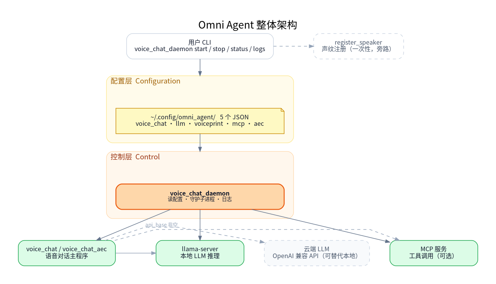
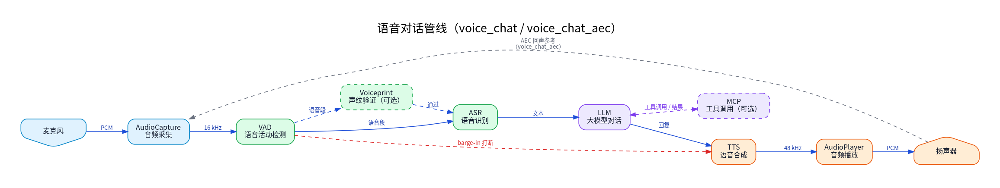

# Agent

## 1. 模块概述

`omni_agent` 是 SDK 中的端到端语音对话应用，位于 `application/native/omni_agent`。它把音频采集、VAD、ASR、LLM、TTS、声纹验证和 MCP 工具调用组合成完整语音助手。用户侧推荐只使用 `voice_chat_daemon`，它统一负责配置初始化、音频设备选择、本地或云端 LLM、声纹注册/验证、MCP 工具服务、日志和进程管理。

### 1.1 整体架构图



整图分四层：用户从顶层 CLI 进入，daemon 读取配置层的 5 个 JSON，再向下启动服务层中的 `llama-server`、`voice_chat` / `voice_chat_aec` 主程序以及可选的 MCP 工具服务；云端 LLM 与声纹注册是旁路。

### 1.2 语音对话管线



`voice_chat` / `voice_chat_aec` 进程内部的语音数据流：麦克风采集后，VAD 检测语音起止；可选经声纹验证后送 ASR 识别成文本，交 LLM 生成回复（必要时调用 MCP 工具），再由 TTS 合成回放到扬声器。TTS 播放期间 VAD 持续工作，连续检测到语音即触发 barge-in 打断；`voice_chat_aec` 模式额外把扬声器输出作为回声参考送回采集端，由 WebRTC AEC3 消除回声。

### 1.3 主要依赖组件

| 组件 | 路径 | 作用 |
| --- | --- | --- |
| audio | `components/multimedia/audio` | 音频采集、播放和重采样。 |
| VAD | `components/model_zoo/vad` | Silero VAD，检测说话开始、结束和 barge-in。 |
| ASR | `components/model_zoo/asr` | SenseVoice 等语音识别后端。 |
| TTS | `components/model_zoo/tts` | Matcha-TTS / Kokoro 语音合成。 |
| voiceprint | `components/model_zoo/voiceprint` | 可选说话人验证。 |
| MCP | `components/agent_tools/mcp` | 可选工具调用客户端。 |

## 2. 构建编译

Agent 使用 `target/k3-com260-omni-agent.json` 目标配置。完整构建：

```bash
source build/envsetup.sh
lunch k3-com260-omni-agent
m
```

只修改 Agent 代码时，可以只编 `omni_agent`：

```bash
source build/envsetup.sh
lunch k3-com260-omni-agent
cd application/native/omni_agent
mm
```

如需启用软件 AEC 内部模式，构建时打开 `USE_AEC`：

```bash
cd application/native/omni_agent
mm -DUSE_AEC=ON
```

常用 CMake 选项：

| 选项 | 默认值 | 说明 |
| --- | --- | --- |
| `USE_MCP` | `ON` | 启用 MCP 工具调用支持。 |
| `USE_AEC` | `OFF` | 构建软件 AEC 内部模式，默认关闭。 |
| `USE_VP` | `ON` | 启用声纹验证支持。 |

构建完成后，用户入口 `voice_chat_daemon` 会安装到 `output/staging/bin`。加载 `build/envsetup.sh` 后可直接运行。

## 3. 一键启动

`voice_chat_daemon` 会自动初始化缺失配置、管理本地 LLM 服务、启动语音对话进程，并把日志写入 `~/.cache/omni_agent/logs/`。daemon 不会自动下载 LLM 模型；首次启动前需要先准备本地模型，或者把 `llm.json` 改成云端 OpenAI-compatible API。

使用默认本地 LLM 时：

```bash
mkdir -p ~/.cache/models/llm
wget -O ~/.cache/models/llm/qwen2.5-0.5b-instruct-q4_0.gguf \
    https://archive.spacemit.com/spacemit-ai/model_zoo/llm/qwen2.5-0.5b-instruct-q4_0.gguf
```

使用云端 LLM 时，先生成配置再编辑 `llm.json`：

```bash
voice_chat_daemon config-init
vi ~/.config/omni_agent/llm.json
```

然后启动：

```bash
voice_chat_daemon start
voice_chat_daemon status
voice_chat_daemon logs
voice_chat_daemon stop
```

首次 `start` 或 `--register-speaker` 会自动在用户配置目录写入缺失的默认 JSON，已有文件不会覆盖。默认配置目录是 `~/.config/omni_agent/`；如果设置了 `XDG_CONFIG_HOME`，则使用 `$XDG_CONFIG_HOME/omni_agent/`。需要手动初始化或还原默认配置：

```bash
voice_chat_daemon config-init
voice_chat_daemon config-init --force
```

`config-init --force` 会先备份现有目录为 `<config_dir>.backup-<timestamp>`，再覆盖写入默认 JSON。

如果已经生成过旧版配置，新默认字段不会自动写入已有文件。需要使用新默认模型、默认 MCP 三件套、启动问候或 TTS 音频保存字段时，可以运行 `voice_chat_daemon config-init --force` 后再按需修改；原配置会保留在备份目录中。

查看合并后的有效配置：

```bash
voice_chat_daemon config-show
```

`voice_chat_daemon start` 自动完成的事情：

- 加载用户配置目录下的 5 个 JSON。
- 按配置枚举并匹配 PortAudio 输入/输出设备。
- 本地 LLM 模式下检查模型文件；模型已存在时启动本地 LLM 服务，缺失时直接报错并提示 `model_path` 和 `model_url`。
- 云端 LLM 模式下使用 `llm.json` 中的 `api_base`、`api_key` 和 `model_name`。
- 按配置启用声纹验证、MCP 工具和 AEC 内部模式。
- double-fork 后台运行，日志写入 `~/.cache/omni_agent/logs/voice_chat-<timestamp>.log`。
- 任一关键子进程退出时自动清理并退出。

## 4. 命令

```text
voice_chat_daemon start [--aec] [--mcp]
voice_chat_daemon restart [--aec] [--mcp]
voice_chat_daemon stop
voice_chat_daemon status
voice_chat_daemon logs
voice_chat_daemon config-init [--force]
voice_chat_daemon config-show
voice_chat_daemon --register-speaker NAME [--force]
```

| 命令 | 行为 |
| --- | --- |
| `start [--aec] [--mcp]` | 启动 daemon；`--aec` 临时切换到软件 AEC 内部模式，`--mcp` 临时启用 MCP。 |
| `restart [--aec] [--mcp]` | 先停止再启动 daemon，参数同 `start`。 |
| `stop` | 停止 daemon 及其托管的子进程。 |
| `status` | 显示 daemon、LLM、语音进程 PID 和当前日志路径。 |
| `logs` | `tail -f` 当前日志。 |
| `config-init` | 写入缺失的默认配置文件，已有文件不覆盖。 |
| `config-init --force` | 先备份现有配置目录，再覆盖还原 5 个默认 JSON。 |
| `config-show` | 输出合并后的纯 JSON 配置，并显示每个配置文件加载状态。 |
| `--register-speaker NAME [--force]` | 进入 3 次录音的声纹注册流程。 |

## 5. 配置文件

默认配置目录为 `~/.config/omni_agent/`；如果设置了 `XDG_CONFIG_HOME`，则使用 `$XDG_CONFIG_HOME/omni_agent/`。配置拆成 5 个 JSON，任一文件不存在、字段缺失或字段为 `null` 时使用内置默认值；任一 JSON 语法错误时该文件使用默认值，其他文件继续生效。

| 文件 | 职责 |
| --- | --- |
| `voice_chat.json` | 主干配置：内部运行模式、音频设备、TTS、VAD、启动问候、调试录音/TTS 音频、日志和 PID 路径。 |
| `llm.json` | LLM 配置：本地 LLM 服务或云端 OpenAI-compatible API、模型名、密钥、上下文、线程数、生成长度和系统提示词。 |
| `voiceprint.json` | 声纹验证配置：开关、数据库、线程、阈值、top、指定说话人。 |
| `mcp.json` | MCP 工具配置：开关、backend、timeout、registry、servers。 |
| `aec.json` | 软件 AEC 内部模式配置：AEC/NS/AGC、延迟补偿和 buffer。 |

### 5.1 voice_chat.json

默认模板：

```json
{
    "mode": "voice_chat",
    "audio": {
        "input_device_hints":  ["SPV Composite", "USB Audio"],
        "output_device_hints": ["SPV Composite", "USB Audio"],
        "input_device_id":  null,
        "output_device_id": null,
        "capture_rate":     null,
        "playback_rate":    null,
        "capture_channels": 1,
        "playback_channels": 1
    },
    "tts": "matcha:zh-en",
    "vad": {
        "threshold":        0.8,
        "silence_duration": 0.5
    },
    "debug": {
        "save_audio":          false,
        "save_audio_file":     "voice_debug.wav",
        "save_tts_audio":      false,
        "save_tts_audio_file": "tts_debug.wav"
    },
    "startup_greeting": "你好，请问有什么可以帮到您？",
    "log_dir":  "~/.cache/omni_agent/logs",
    "pid_file": "~/.cache/omni_agent/voice_chat_daemon.pid"
}
```

字段说明：

| 字段 | 默认值 | 说明 |
| --- | --- | --- |
| `mode` | `voice_chat` | 内部运行模式。`voice_chat` 为标准模式；`voice_chat_aec` 为软件 AEC 内部模式。也可用 `start --aec` 临时覆盖。 |
| `audio.input_device_hints` | `["SPV Composite", "USB Audio"]` | 输入设备名 substring 匹配序列，按顺序首个命中即采用；非空且都不命中时 daemon 报错并列出当前可见设备。 |
| `audio.output_device_hints` | 同上 | 输出设备名 substring 匹配序列。 |
| `audio.input_device_id` | `null` | 非 null 时直接使用指定 PortAudio 输入设备 index，跳过 hints。 |
| `audio.output_device_id` | `null` | 非 null 时直接使用指定 PortAudio 输出设备 index，跳过 hints。 |
| `audio.capture_rate` | `null` | 标准模式录音采样率；null 使用默认 16000 Hz。软件 AEC 内部模式要求 48000 Hz，非 48000 会被忽略并使用 AEC 默认值。 |
| `audio.playback_rate` | `null` | 标准模式播放采样率；null 使用默认 48000 Hz。USB 设备如只支持 16kHz，可显式设为 16000。 |
| `audio.capture_channels` | `1` | 录音声道数。 |
| `audio.playback_channels` | `1` | 播放声道数。 |
| `tts` | `matcha:zh-en` | TTS 后端。MCP 工具回复常含英文、数字和路径，推荐保留中英双语后端。 |
| `vad.threshold` | `0.8` | VAD 触发阈值，范围 0~1，越高越不容易触发。 |
| `vad.silence_duration` | `0.5` | 判定语音结束前需要持续静音的秒数。 |
| `debug.save_audio` | `false` | 是否保存调试录音。 |
| `debug.save_audio_file` | `voice_debug.wav` | 调试录音保存路径。 |
| `debug.save_tts_audio` | `false` | 是否保存 TTS 输出音频，便于排查播放白噪音、截断或异常音色。 |
| `debug.save_tts_audio_file` | `tts_debug.wav` | TTS 输出音频保存路径。 |
| `startup_greeting` | `你好，请问有什么可以帮到您？` | 子进程初始化完 TTS 和音频输出后播放的启动问候；设为空字符串可关闭。 |
| `log_dir` | `~/.cache/omni_agent/logs` | daemon 日志目录。 |
| `pid_file` | `~/.cache/omni_agent/voice_chat_daemon.pid` | daemon PID 文件路径。 |

### 5.2 llm.json

默认模板：

```json
{
    "auto_start_server": true,
    "api_base":          null,
    "api_key":           null,
    "server_binary":     "llama-server",
    "server_host":       "127.0.0.1",
    "server_port":       9191,
    "model_path":        "~/.cache/models/llm/qwen2.5-0.5b-instruct-q4_0.gguf",
    "model_url":         "https://archive.spacemit.com/spacemit-ai/model_zoo/llm/qwen2.5-0.5b-instruct-q4_0.gguf",
    "model_name":        "qwen2.5-0.5b",
    "ctx_size":          4096,
    "threads":           4,
    "reasoning_budget":  0,
    "extra_args":        [],
    "max_tokens":        150,
    "system_prompt":     "You are a helpful assistant."
}
```

字段说明：

| 字段 | 默认值 | 说明 |
| --- | --- | --- |
| `auto_start_server` | `true` | 是否自动拉起本地 LLM 服务；`api_base` 非空时 daemon 自动跳过本地启动。 |
| `api_base` | `null` | OpenAI-compatible 云端/外部 API base，按服务商文档填写。例如 DeepSeek 使用 `https://api.deepseek.com`。 |
| `api_key` | `null` | 云端 API 密钥；daemon 通过 `OPENAI_API_KEY` 传给子进程，不放入命令行；`config-show` 会掩码显示。 |
| `server_binary` | `llama-server` | 本地 LLM 服务二进制名或绝对路径。 |
| `server_host` | `127.0.0.1` | 本地 LLM 服务监听地址。 |
| `server_port` | `9191` | 本地 LLM 服务监听端口。 |
| `model_path` | `~/.cache/models/llm/qwen2.5-0.5b-instruct-q4_0.gguf` | 本地 GGUF 模型路径。 |
| `model_url` | SpacemiT archive URL | 本地模型下载参考地址。daemon 只打印该地址，不会自动下载模型。 |
| `model_name` | `qwen2.5-0.5b` | 传给 LLM API 的模型名。云端模式必须改成服务商支持的模型名。 |
| `ctx_size` | `4096` | 本地 LLM 服务上下文长度。 |
| `threads` | `4` | 本地 LLM 服务推理线程数。 |
| `reasoning_budget` | `0` | 本地模式传给 `llama-server`；云端 OpenAI-compatible 模式下，`0` 表示隐藏 `reasoning_content` / `thinking` 流式输出，并过滤普通正文里的 `<think>...</think>`，避免把思考内容送入 TTS；`-1` 表示不覆盖。 |
| `extra_args` | `[]` | 追加给本地 LLM 服务的原始参数。 |
| `max_tokens` | `150` | 单轮最大生成 token 数。 |
| `system_prompt` | `You are a helpful assistant.` | 默认系统提示词；MCP 可在 `mcp.json` 中覆盖。 |

云端 LLM 示例：

```json
{
    "api_base": "https://api.deepseek.com",
    "api_key": "sk-...",
    "model_name": "deepseek-v4-flash"
}
```

只要 `api_base` 非空，daemon 就不会启动本地 LLM 服务。

本地 LLM 模式下，先把模型文件准备到 `model_path`。默认路径如下：

```bash
mkdir -p ~/.cache/models/llm
wget -O ~/.cache/models/llm/qwen2.5-0.5b-instruct-q4_0.gguf \
    https://archive.spacemit.com/spacemit-ai/model_zoo/llm/qwen2.5-0.5b-instruct-q4_0.gguf
```

### 5.3 voiceprint.json

默认模板：

```json
{
    "enabled":   false,
    "database":  "~/.cache/omni_agent/speakers.db",
    "threads":   1,
    "threshold": 0.6,
    "top":       3,
    "verify":    ""
}
```

字段说明：

| 字段 | 默认值 | 说明 |
| --- | --- | --- |
| `enabled` | `false` | 是否启用声纹验证。 |
| `database` | `~/.cache/omni_agent/speakers.db` | 声纹数据库路径。注册和运行时需要使用同一个 Linux 用户，才能共享默认数据库。 |
| `threads` | `1` | 声纹推理线程数。 |
| `threshold` | `0.6` | 声纹相似度阈值；越高越严格。 |
| `top` | `3` | 检查前 N 个匹配结果。 |
| `verify` | `""` | 空字符串表示接受所有已注册说话人；非空时只接受指定 name。 |

注册说话人：

```bash
voice_chat_daemon --register-speaker alice
voice_chat_daemon --register-speaker alice --force
```

### 5.4 mcp.json

默认模板：

```json
{
    "enabled":  false,
    "backend":  "llama",
    "system_prompt": null,
    "timeout":  120,
    "registry_url":           null,
    "registry_poll_interval": 5,
    "servers": [
        {
            "name": "Calculator",
            "type": "http",
            "url":  "http://127.0.0.1:8001/mcp"
        },
        {
            "name": "TimeService",
            "type": "http",
            "url":  "http://127.0.0.1:8002/mcp"
        },
        {
            "name": "SystemMonitor",
            "type": "http",
            "url":  "http://127.0.0.1:8003/mcp"
        }
    ]
}
```

字段说明：

| 字段 | 默认值 | 说明 |
| --- | --- | --- |
| `enabled` | `false` | 是否启用 MCP；也可用 `start --mcp` 临时开启。 |
| `backend` | `llama` | MCP LLM backend，透传给 MCP 配置。 |
| `system_prompt` | `null` | 非 null 时覆盖 `llm.json.system_prompt`。 |
| `timeout` | `120` | MCP 请求超时秒数。 |
| `registry_url` | `null` | MCP registry URL。 |
| `registry_poll_interval` | `5` | registry 轮询间隔秒数。 |
| `servers` | 三个本地 HTTP 示例服务 | 静态 MCP 服务列表。支持 `stdio`、`socket` 和 `http` 三种连接方式。 |

`servers` 示例：

```json
{
    "enabled": true,
    "servers": [
        {
            "name": "Calculator",
            "type": "stdio",
            "command": "python3",
            "args": ["examples/services/calculator/stdio_server.py"]
        },
        {
            "name": "SystemMonitor",
            "type": "socket",
            "path": "/tmp/mcp_system_monitor.sock"
        },
        {
            "name": "TimeService",
            "type": "http",
            "url": "http://127.0.0.1:8002/mcp"
        }
    ]
}
```

说明：

- `stdio` 服务由 MCP client 按 `command + args` 启动。相对脚本路径会在 daemon 写入 resolved 配置时解析为绝对路径。
- `socket` 服务要求对应 Unix socket 已由外部服务创建。
- `http` 服务要求 HTTP MCP 服务已可访问。
- 默认三个本地 HTTP 示例服务写在 `servers` 里，用户可直接删除或追加自己的服务。
- `start --mcp` 发现默认示例服务时，会使用固定目录 `~/.local/share/omni_agent/mcp/services` 启动对应后端服务。
- 首次启动默认 MCP 示例服务时，daemon 会从 SDK 的 `components/agent_tools/mcp/examples` 同步服务到固定目录。首次同步要求当前 SDK 树能找到该目录；如果只拷贝了二进制或源码不在默认位置，需要设置 `OMNI_AGENT_MCP_EXAMPLES_DIR` 指向 `components/agent_tools/mcp/examples`。
- 默认示例服务会使用本机端口 `8001`、`8002`、`8003` 和 registry 端口 `9000`。
- MCP Python 环境固定为 `~/.mcp-env`；daemon 只检查依赖，不会在启动时安装 Python 包。
- `start --mcp` 只临时启用 MCP，不会回写 `~/.config/omni_agent/mcp.json`。
- 删除默认 Calculator、TimeService 和 SystemMonitor 后，daemon 不再自动启动内置三件套；此时由用户自己的 `servers` 或 `registry_url` 决定可用工具。
- resolved 配置写入 `~/.cache/omni_agent/mcp_resolved.json`，用于排查实际传给 MCP client 的内容。

MCP Python 环境准备示例：

```bash
python3 -m venv ~/.mcp-env
~/.mcp-env/bin/python -m pip install flask mcp starlette uvicorn psutil \
    --prefer-binary \
    --retries 0 \
    --timeout 2 \
    --index-url https://git.spacemit.com/api/v4/projects/33/packages/pypi/simple \
    --extra-index-url https://mirrors.aliyun.com/pypi/simple/
```

使用默认三件套启用 MCP：

```bash
voice_chat_daemon start --mcp
cat ~/.cache/omni_agent/mcp_resolved.json
```

接入 mlink HTTP MCP 服务时，把 `components/agent_tools/mcp/examples/configs/mlink_http.json` 中的 `servers` 内容写入 `~/.config/omni_agent/mcp.json`：

```json
{
    "enabled": true,
    "backend": "llama",
    "system_prompt": null,
    "timeout": 120,
    "registry_url": null,
    "registry_poll_interval": 5,
    "servers": [
        {
            "name": "mlink-gateway",
            "type": "http",
            "url": "http://127.0.0.1:18765/mcp"
        }
    ]
}
```

接入用户自己的 registry 时，只设置 `registry_url`：

```json
{
    "enabled": true,
    "backend": "llama",
    "system_prompt": null,
    "timeout": 120,
    "registry_url": "http://192.168.1.10:9000/mcp/services",
    "registry_poll_interval": 5,
    "servers": []
}
```

### 5.5 aec.json

默认模板：

```json
{
    "no_aec":        false,
    "no_ns":         false,
    "agc":           false,
    "aec_delay_ms":  50,
    "buffer_frames": 0
}
```

字段说明：

| 字段 | 默认值 | 说明 |
| --- | --- | --- |
| `no_aec` | `false` | true 时禁用回声消除。 |
| `no_ns` | `false` | true 时禁用噪声抑制。 |
| `agc` | `false` | true 时启用自动增益控制。默认关闭，避免低能量输入被激进放大。 |
| `aec_delay_ms` | `50` | AEC 延迟补偿，常用范围 20-100ms。 |
| `buffer_frames` | `0` | AEC buffer frames；0 表示使用底层默认。 |

临时启用软件 AEC 内部模式：

```bash
voice_chat_daemon start --aec
```

持久启用时，把 `voice_chat.json` 的 `mode` 改为 `voice_chat_aec`。软件 AEC 内部模式按 48kHz 工作；不要把 `audio.capture_rate` 设成 16000 来驱动 AEC。

## 6. 常见操作

### 6.1 修改配置并重启

```bash
vi ~/.config/omni_agent/llm.json
voice_chat_daemon restart
```

### 6.2 查看有效配置

```bash
voice_chat_daemon config-show
```

`api_key` 会以 `********` 显示，不会明文输出。

### 6.3 还原默认配置

```bash
voice_chat_daemon config-init --force
```

执行后会生成备份目录：

```text
<config_dir>.backup-<timestamp>
```

### 6.4 启用声纹验证

```bash
voice_chat_daemon --register-speaker alice
vi ~/.config/omni_agent/voiceprint.json
voice_chat_daemon restart
```

把 `voiceprint.json` 中 `enabled` 改为 `true`。如果只允许指定说话人，把 `verify` 设置成注册名。

### 6.5 启用云端 LLM

编辑 `~/.config/omni_agent/llm.json`：

```json
{
    "api_base": "https://api.deepseek.com",
    "api_key": "sk-...",
    "model_name": "deepseek-v4-flash"
}
```

然后重启：

```bash
voice_chat_daemon restart
```

## 7. 调试与排查

调试优先看 daemon 日志：

```bash
voice_chat_daemon status
voice_chat_daemon logs
```

常见问题：

| 现象 | 可能原因 | 处理 |
| --- | --- | --- |
| `start` 报未找到 `llama-server` | 本地 LLM 模式下缺少 LLM 服务工具 | 安装对应工具包，或在 `llm.json` 中配置云端 `api_base` / `api_key`。 |
| `start` 报端口 9191 已占用 | 本地 LLM 服务端口被占用 | 停掉占用进程，或修改 `llm.json.server_port`。 |
| `start` 报本地 LLM 模型不存在 | 默认模型文件尚未准备到 `model_path` | 手动下载、拷贝或预置模型到 `model_path`；`model_url` 只是参考地址，daemon 不自动下载。 |
| 没有麦克风或扬声器声音 | 设备 hints 未命中或设备 index 不对 | 编辑 `voice_chat.json` 的 `audio.input_device_hints` / `output_device_hints`，或直接设置设备 id。 |
| USB 音频设备报 `Invalid sample rate` | 设备不支持默认播放采样率 | 在标准模式下把 `audio.playback_rate` 显式设为设备支持的采样率，例如 16000。 |
| 云端 LLM 返回 HTTP 400 | `model_name` 或 `api_base` 与服务商要求不一致 | 按服务商文档填写 `api_base` 和 `model_name`。DeepSeek 示例为 `https://api.deepseek.com` + `deepseek-v4-flash`。 |
| 普通云端对话可用，但 `start --mcp` 后 HTTP 400 | 云端模型不支持 OpenAI tool calling，或服务商对 tools 参数兼容性不同 | 先用服务商的 `/chat/completions` 和 tools 示例验证工具调用；必要时更换支持 tool calling 的模型。 |
| 云端 LLM 播放思考内容 | `reasoning_budget` 未传到子进程或被设为 `-1` | 保持 `llm.json.reasoning_budget` 为 `0`；daemon 会隐藏 `reasoning_content` / `thinking`，并过滤普通正文中的 `<think>...</think>`。 |
| MCP 工具不可用 | 服务未启动、固定服务目录未初始化或 resolved 配置不符合预期 | 先运行 `voice_chat_daemon start --mcp` 自动初始化，再检查 `~/.local/share/omni_agent/mcp/services`、`mcp.json`、`~/.cache/omni_agent/mcp_resolved.json` 和 daemon 日志。 |
| MCP 首次启动找不到示例服务目录 | 当前环境只有安装后的二进制，daemon 找不到 SDK 的 `components/agent_tools/mcp/examples` | 在 SDK checkout 中首次启动，或设置 `OMNI_AGENT_MCP_EXAMPLES_DIR=/path/to/components/agent_tools/mcp/examples`。 |
| MCP 默认三件套启动失败或端口不通 | `8001`、`8002`、`8003` 或 `9000` 已被占用 | 停掉占用进程，或删除默认三件套后在 `mcp.json.servers` 中配置自己的服务地址。 |
| 声纹经常识别不到 | 阈值过高或注册音频质量不足 | 适当降低 `voiceprint.json.threshold`，或重新注册清晰、稳定的声纹样本。 |
| 播放时误触发 barge-in | 麦克风收到扬声器回声 | 降低音量、调整麦克风位置，或在确实需要时启用软件 AEC 内部模式。 |

## 8. 运行时路径

| 路径 | 说明 |
| --- | --- |
| `~/.config/omni_agent/` | 默认用户可编辑配置目录；设置 `XDG_CONFIG_HOME` 时改为 `$XDG_CONFIG_HOME/omni_agent/`。 |
| `~/.cache/omni_agent/logs/` | daemon 和子进程日志。 |
| `~/.cache/omni_agent/voice_chat_daemon.pid` | daemon PID 文件。 |
| `~/.cache/omni_agent/speakers.db` | 默认声纹数据库。 |
| `~/.cache/omni_agent/mcp_resolved.json` | daemon 生成的 MCP resolved 配置。 |
| `~/.local/share/omni_agent/mcp/services` | 默认 MCP 示例服务固定目录。 |
| `~/.mcp-env` | MCP Python 虚拟环境。 |
