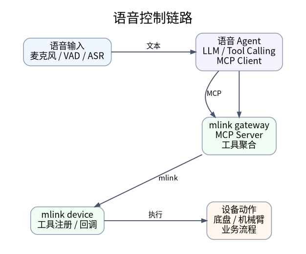

# 语音控制

## 1. 模块概述

语音控制模块用于把机器人设备能力封装成 MCP 工具，并接入语音 Agent。用户通过麦克风说出自然语言指令后，Agent 完成 ASR、LLM 理解与 Tool Calling，再通过 mlink gateway 调用设备侧 mlink device 注册的工具，最终触发底盘、机械臂或业务应用动作。

下面是语音控制模块的软件分层示意图



本章对应代码目录：

```text
components/agent_tools/
├── mlink_gateway/                  # Python 网关，聚合设备工具并对外暴露 MCP Server
│   ├── cli.py                      # mlink gateway start/run/status/tools/test/call
│   ├── main.py                     # 网关启动入口
│   ├── config/gateway.yaml         # 设备侧 TCP/Unix 监听与工具快照配置
│   ├── gateway/                    # 设备、工具注册和调用路由
│   ├── mcp/                        # MCP Server 与内置诊断工具
│   ├── protocol/                   # mlink JSON-RPC 会话
│   └── transport/                  # TCP/Unix 设备连接监听
└── mlink_device/                   # C 语言设备侧 SDK
│   ├── include/mlink.h             # 对外 C API
│   ├── core/
│   │   ├── mcp/                    # 设备侧 MCP 协议、工具、参数和返回值实现
│   │   ├── transport/              # transport 抽象与 Unix/TCP 硬件 I/O 实现
│   │   └── posix/                  # Linux/POSIX 系统适配层
│   ├── example/mlink_device_test.c # 最小设备示例，注册 base_move/dance
│   └── CMakeLists.txt              # 构建 libmlink_device.so 和 mlink_device_test
```

模块分为三层：

| 模块 | 运行位置 | 主要职责 |
| --- | --- | --- |
| mlink_device | 机器人设备进程内 | 注册工具、声明参数、接收 tools/call、执行真实动作并返回结果。 |
| mlink_gateway | K3 本机或上位机 | 监听设备连接，执行 initialize / tools/list，把设备工具聚合为 MCP Server。 |
| Agent / voice_chat / Hermes | 语音交互应用 | 连接 MCP Server，让 LLM 根据自然语言自动选择并调用工具。 |

其中 mlink_device 是设备侧运行库，不依赖语音 Agent。它把设备动作抽象成 MCP tool，并在内部完成 initialize、tools/list、tools/call 等协议处理。应用侧只需要通过 include/mlink.h 注册工具和回调，不需要直接处理 JSON-RPC、schema 拼装、连接读写和线程调度。

mlink_device 面向 Linux 和 RTOS 类系统设计。当前仓库提供 Linux/POSIX 适配实现，系统相关能力集中在 core/posix/ 和 include/utils/，包括线程、队列、互斥锁、事件、时间和后台调度等封装；通信相关能力集中在 core/transport/ 和 include/transport/，通过 hwio_ops 抽象底层读写与回调。移植到 RTOS 时，通常保留 MCP 协议层和公开 API，只替换系统适配层和底层 transport 实现。

网关默认对上层暴露 HTTP MCP 服务：

```text
http://127.0.0.1:18765/mcp
```

设备侧默认支持两种连接方式：

| 传输 | 默认目标 | 适用场景 |
| --- | --- | --- |
| Unix Socket | /tmp/mlink.sock | 设备进程与 gateway 在同一台机器上运行。 |
| TCP | 127.0.0.1:8080 | 设备进程通过 TCP 连接 gateway，适合后续扩展到跨进程或跨设备部署。 |

gateway 自带 3 个诊断工具：gateway.ping、gateway.status、gateway.list_devices。当设备连接成功后，设备工具会按 <device_id>.<tool_name> 形式暴露，例如 robot.base_move、robot.dance、linksee.start_host。

## 2. 环境准备

### 2.1 获取源码

SDK 源码获取和基础编译环境配置参考 [2.3-构建编译](../02-快速入门/2.3-构建编译.md)。完成 SDK 初始化后，回到本文继续执行 §2.2。

后续命令默认在 spacemit_robot SDK 根目录执行。

### 2.2 编译 mlink device

mlink_device 是设备侧 C SDK，编译后会安装公共头文件、动态库和测试程序。

```bash
source build/envsetup.sh

cd components/agent_tools/mlink_device/
mm
```

编译完成后，关键产物通常位于：

```text
output/staging/include/mlink.h
output/staging/lib/libmlink_device.so
output/staging/bin/mlink_device_test
```

其中：

- mlink.h：设备侧应用引用的公开 C API。
- libmlink_device.so：设备侧应用链接的运行库。
- mlink_device_test：最小联调程序，默认注册 base_move 和 dance 两个工具，支持 run、start、stop、restart、status。

### 2.3 准备 mlink gateway 环境

mlink_gateway 是 Python 包，依赖 mcp[cli]、loguru 和 PyYAML。首次使用时回到 SDK 根目录，创建虚拟环境并安装可编辑包：

```bash
m_env_build components/agent_tools/mlink_gateway/
source output/envs/mlink-gateway/bin/activate
pip install -e components/agent_tools/mlink_gateway
```

安装完成后应可以执行：

```bash
mlink gateway --help
```

常用命令：

| 命令 | 说明 |
| --- | --- |
| mlink gateway start | 后台启动 HTTP MCP 服务，默认监听 127.0.0.1:18765/mcp。 |
| mlink gateway run | 前台运行 gateway，适合调试日志。 |
| mlink gateway status | 查看 PID、HTTP endpoint、日志路径、Unix socket 和工具快照路径。 |
| mlink gateway tools | 通过 HTTP MCP endpoint 拉取当前工具列表、描述和参数 schema。 |
| mlink gateway tools <tool_name> | 查询单个工具详情，例如 mlink gateway tools robot.base_move。 |
| mlink gateway tools --json | 输出机器可解析的工具元数据，适合脚本或自动化测试读取。 |
| mlink gateway test | 检查 MCP endpoint 是否可访问，并判断 robot.base_move 是否已注册。 |
| mlink gateway call | 通过 HTTP MCP endpoint 直接调用指定工具，适合最小链路验证。 |
| mlink gateway stop | 停止后台 gateway。 |
| mlink gateway restart | 重启后台 gateway，并清理残留运行状态。 |

### 2.4 准备 LLM 与语音 Agent

如果需要完整语音控制，需要先准备语音 Agent 所依赖的 ASR、LLM 和 TTS。LLM 服务启动方式参考 [4.4-LLM](4.4-LLM.md)，Agent 端到端语音链路参考 [4.5-Agent](4.5-Agent.md)。

本文的最小联调只验证 mlink_device -> mlink_gateway -> MCP 链路，不强制要求麦克风、TTS 或真实机器人硬件。

## 3. 示例使用

### 3.1 最小 mlink 联调

本节只验证 mlink_device -> mlink_gateway -> MCP 链路，不依赖语音 Agent。使用 mlink_device_test 模拟机器人设备，它会注册两个工具：

| 工具 | 参数 | 行为 |
| --- | --- | --- |
| robot.base_move | direction，可取 forward、backward、left、right、stop | 模拟底盘短动作，stop 可中断当前动作。 |
| robot.dance | 无 | 模拟约 120 秒的长动作，可用 base_move(direction=stop) 中断。 |

启动 gateway 和设备示例：

```bash
source output/envs/mlink-gateway/bin/activate
mlink gateway restart
mlink_device_test restart
mlink_device_test status
```

mlink_device_test restart 会把设备示例切到后台运行，日志写入 /tmp/mlink-device-test.log。设备示例默认使用 Unix Socket 连接 /tmp/mlink.sock，设备名为 robot。继续执行最小验证：

```bash
mlink gateway tools robot.base_move
mlink gateway call robot.base_move '{"direction":"forward"}'
mlink gateway call robot.dance
mlink gateway call robot.base_move '{"direction":"stop"}'
```

这几条命令对应的能力点如下：

| 能力 | 预期现象 |
| --- | --- |
| 工具注册 | mlink gateway tools robot.base_move 能看到工具描述和 inputSchema，其中包含 direction 参数。 |
| 指令分发 | call robot.base_move 和 call robot.dance 会被 gateway 路由到设备侧对应回调。 |
| 执行反馈 | call 命令会打印 Result；/tmp/mlink-device-test.log 会记录 base_move 或 dance 执行日志。 |
| 即时打断 | robot.dance 是约 120 秒长动作，随后调用 robot.base_move {"direction":"stop"} 会触发设备侧停止逻辑。 |

如果不继续执行 §3.2，联调结束后停止后台进程：

```bash
mlink_device_test stop
mlink gateway stop
```

mlink gateway 是通用 HTTP MCP 网关，不绑定 robot.base_move。真实设备工具变化后，先用 mlink gateway tools 查询当前工具名、描述和 inputSchema，再用 mlink gateway call <tool_name> <arguments_json> 验证调用。

### 3.2 接入omni_agent

omni_agent 是 ai robot SDK 中语音交互的智能体，其支持 MCP 接入。mlink_gateway 对上层 Agent 暴露标准 HTTP MCP endpoint。voice_chat / omni_agent 可以连接本地 LLM，也可以连接云端 OpenAI 兼容 LLM。本节默认 §3.1 中的 gateway 和 mlink_device_test 已经在运行；如果已经执行 stop，请先重新执行 mlink gateway restart 和 mlink_device_test restart。MCP 配置使用 components/agent_tools/mcp/examples/configs/mlink_http.json。

先编译 voice_chat。首次使用建议完整构建 omni_agent 目标：

```bash
source build/envsetup.sh
lunch k3-com260-omni-agent
m
```
编译完成后，voice_chat 会安装到 output/staging/bin。运行前先列出音频设备：

```bash
source build/envsetup.sh
voice_chat -l
```

从 voice_chat -l 输出中选择麦克风输入设备编号和扬声器/耳机输出设备编号。下面示例假设输入设备为 1，输出设备为 2；如果系统默认设备可用，也可以都设为 0。

```bash
export VOICE_INPUT_DEVICE=1
export VOICE_OUTPUT_DEVICE=2
```

#### 3.2.1 使用本地 LLM

本地 LLM 服务启动方式参考 [4.4-LLM](4.4-LLM.md)。确认本地服务已提供 OpenAI 兼容接口后启动：

```bash
mkdir -p ~/.cache/models/llm
cd ~/.cache/models/llm
export LOCAL_LLM_FILE=qwen2.5-0.5b-instruct-q4_0.gguf
export LOCAL_LLM_MODEL=qwen2.5-0.5b
wget https://archive.spacemit.com/spacemit-ai/model_zoo/llm/${LOCAL_LLM_FILE}

llama-server -m ~/.cache/models/llm/${LOCAL_LLM_FILE} \
    -t 4 --reasoning-budget 0 --port 9191 --host 0.0.0.0 &

until curl -s http://127.0.0.1:9191/v1/models >/dev/null; do
  sleep 1
done

cd ~/spacemit_robot # 切换到项目根目录
voice_chat \
  -i "$VOICE_INPUT_DEVICE" \
  -o "$VOICE_OUTPUT_DEVICE" \
  --llm-url http://127.0.0.1:9191/v1 \
  --model "$LOCAL_LLM_MODEL" \
  --mcp-config components/agent_tools/mcp/examples/configs/mlink_http.json
```

#### 3.2.2 使用云端 LLM

云端模型需要支持 Tool Calling。把地址、模型名和 Key 替换为实际值后启动：

```bash
export CLOUD_LLM_BASE_URL="https://api.example.com/v1"
export CLOUD_LLM_MODEL="qwen-plus"
export OPENAI_API_KEY="<your-api-key>"

cd ~/spacemit_robot # 切换到项目根目录
voice_chat \
  -i "$VOICE_INPUT_DEVICE" \
  -o "$VOICE_OUTPUT_DEVICE" \
  --llm-url "$CLOUD_LLM_BASE_URL" \
  --model "$CLOUD_LLM_MODEL" \
  --mcp-config components/agent_tools/mcp/examples/configs/mlink_http.json
```

启动后说以下口令验证链路：

```text
向前走一下
跳个舞
停止移动
```

预期 voice_chat 日志显示已加载 robot.base_move 和 robot.dance；“向前走一下”触发 robot.base_move，“跳个舞”触发 robot.dance，“停止移动”触发 robot.base_move(direction=stop)。工具返回值会进入 LLM 对话上下文，并由 TTS 播报执行结果。若模型只自然语言回复而不调用工具，优先检查模型 Tool Calling 能力、mcp 配置路径和 §3.1 的 gateway 工具注册状态。

### 3.3 接入 Hermes

Hermes 可以作为上层 Agent 直接连接 mlink gateway 的 HTTP MCP endpoint，并用自然语言调用设备工具。本节默认 §3.1 中的 gateway 和 mlink_device_test 已经在运行。

先用 hermes model 完成模型服务地址、模型名称和鉴权信息配置：

```bash
hermes model
```

再把 mlink gateway 写入 ~/.hermes/config.yaml：

```yaml
mcp_servers:
    mlink-gateway:
        transport: http
        url: http://127.0.0.1:18765/mcp
        enabled: true
```

启动 Hermes：

```bash
hermes
```

在 Hermes CLI 中输入同样的验证口令：

```text
向前走一下
跳个舞
停止移动
```

预期现象：

| 能力 | 预期现象 |
| --- | --- |
| 工具注册 | Hermes 连接 mlink-gateway 后能看到 robot.base_move 和 robot.dance。 |
| 指令分发 | “向前走一下”会触发 robot.base_move；“跳个舞”会触发 robot.dance。 |
| 执行反馈 | Hermes 会把工具返回结果纳入回复。 |
| 即时打断 | “停止移动”应触发 robot.base_move(direction=stop)，设备侧停止长动作。 |

真实机器人应用接入方式相同，只需把 mlink_device_test 换成对应设备进程。当前仓库已有两个参考应用：

| 应用 | 设备进程 | 默认设备名 | 暴露工具 |
| --- | --- | --- | --- |
| Linksee | linksee_device unix linksee | linksee | linksee.start_host、linksee.start_inference、linksee.stop_host、linksee.stop_inference |
| LeRobot | lerobot_device unix lerobot | lerobot | lerobot.pick_cube |

例如 linksee_device unix linksee 连接成功后，可在 Hermes 中输入“启动 Linksee host”或“停止 Linksee 推理”；lerobot_device unix lerobot 连接成功后，可输入“抓木块”。Hermes 会将请求路由到对应 MCP tool。

## 4. 应用开发

本章面向设备应用开发者，说明如何把一个动作封装为可被语音 Agent 调用的工具。设备应用只需要依赖公开头文件 components/agent_tools/mlink_device/include/mlink.h。

### 4.1 接入模型

mlink_device 的边界是“设备能力注册与调用执行”。设备应用负责描述自己能做什么，SDK 负责把这些能力转换为 MCP tool，并处理协议收发、工具清单导出、参数解析、返回值封装和 transport 读写。

一个设备工具的接入流程如下：

1. mlink_server_init(type, server_name) 创建设备 server，并连接 gateway。
2. mlink_property_list_create() 创建参数列表，用 mlink_property_list_add_*() 描述工具输入。
3. mlink_tool_create() 创建工具，绑定工具名、描述、参数 schema 和回调函数。
4. mlink_server_add_tool() 把工具注册到当前设备 server。
5. mlink_server_run() 保持设备进程运行，等待 gateway 下发 tools/call。

gateway 侧会把工具暴露为 <server_name>.<tool_name>。例如设备名为 robot、工具名为 base_move 时，上层 Agent 看到的 MCP tool 名称是 robot.base_move。

| 概念 | 设备侧写法 | gateway / Agent 侧看到 |
| --- | --- | --- |
| 设备名 | mlink_server_init(..., "robot") | device_id = robot |
| 工具名 | mlink_tool_create("base_move", ...) | robot.base_move |
| 参数 | mlink_property_list_add_string(props, "direction", NULL) | inputSchema.properties.direction |
| 返回值 | mlink_return_string("ok") | MCP tools/call result |

### 4.2 核心 API 速查

#### 4.2.1 Server 生命周期

| 接口 | 说明 | 参数 | 返回值 |
| --- | --- | --- | --- |
| mlink_server_init | 创建设备侧 server，并连接 gateway。 | type：transport 类型；server_name：设备名，会成为 gateway 中的 device_id。 | 成功返回 mlink_server_t 指针，失败返回 NULL。 |
| mlink_server_run | 阻塞当前线程，保持设备进程运行。 | server：server 句柄。 | 无。 |
| mlink_server_destroy | 释放 server、transport 和后台调度资源。 | server：server 句柄。 | 无。 |
| mlink_notify_message | 向上层发送日志或状态通知。 | server：server 句柄；level：日志级别；logger：日志来源；text：通知内容。 | 无。 |

常用 transport：

| 类型 | 当前状态 | 说明 |
| --- | --- | --- |
| TRANSPORT_TYPE_UNIX | 已实现 | 连接本机 /tmp/mlink.sock，适合设备进程与 gateway 同机部署。 |
| TRANSPORT_TYPE_TCP | 已实现 | 连接 127.0.0.1:8080，适合跨进程或跨设备部署。 |
| TRANSPORT_TYPE_MQTT / HTTP / WS / UART / SPI | 枚举预留 | 可通过新增 transport / hwio_ops 实现扩展。 |

#### 4.2.2 参数 schema

| 接口 | 说明 | 参数 | 返回值 |
| --- | --- | --- | --- |
| mlink_property_list_create | 创建工具参数列表。 | 无。 | 成功返回 mlink_property_list_t 指针，失败返回 NULL。 |
| mlink_property_list_add_bool | 添加 bool 参数。 | list：参数列表句柄；name：参数名；has_default：是否有默认值；default_value：默认值。 | 成功返回 true，失败返回 false。 |
| mlink_property_list_add_int | 添加 int 参数，可生成 minimum / maximum 约束。 | list：参数列表句柄；name：参数名；has_default：是否有默认值；default_value：默认值；has_min：是否有最小值；min_value：最小值；has_max：是否有最大值；max_value：最大值。 | 成功返回 true，失败返回 false。 |
| mlink_property_list_add_string | 添加 string 参数。 | list：参数列表句柄；name：参数名；default_value：默认值，NULL 表示必填参数，非空表示可选参数并带默认值。 | 成功返回 true，失败返回 false。 |
| mlink_property_list_destroy | 释放参数列表。 | list：参数列表句柄。 | 无。 |

参数 schema 会通过设备侧 tools/list 暴露给 gateway。LLM 选择工具和生成参数时主要依赖工具描述和 inputSchema。

#### 4.2.3 工具注册与回调

| 接口 | 说明 | 参数 | 返回值 |
| --- | --- | --- | --- |
| mlink_tool_create | 创建工具，并绑定工具描述、参数 schema 和回调。 | name：设备内局部工具名，例如 base_move；description：工具描述；properties：参数列表；callback：工具回调；user_ctx：用户上下文；user_only：是否仅用户可见。 | 成功返回 mlink_tool_t 指针，失败返回 NULL。 |
| mlink_server_add_tool | 将工具注册到设备 server。 | server：server 句柄；tool：工具句柄。 | 成功返回 true，失败返回 false。 |
| mlink_tool_destroy | 释放未注册成功的工具。 | tool：工具句柄。 | 无。 |
| mlink_tool_callback_t | 工具回调类型，gateway 调用 tools/call 时进入该回调。 | properties：本次调用参数；user_ctx：用户上下文。 | struct mlink_return_value。 |

回调函数签名：

```c
typedef struct mlink_return_value (*mlink_tool_callback_t)(
    const mlink_property_list_t *properties,
    void *user_ctx);
```

properties 是本次调用的参数快照。参数缺失、类型错误或超出 int 范围时，SDK 会在进入回调前返回错误。

工具命名和描述会直接影响 LLM 的工具选择效果。建议工具名保持短且稳定，例如 base_move、pick_cube、start_inference；工具描述写清动作范围、参数取值和安全限制。长时间运行的动作应设计停止语义，可以提供独立停止工具，也可以像 base_move(direction=stop) 一样在同一工具里提供 stop 参数。回调中仍要做权限、状态和安全检查，不要完全信任 LLM 生成的参数；mlink 只负责协议转发，不替代急停、限速、超时等机器人安全控制。

#### 4.2.4 参数读取与返回值

| 接口 | 说明 | 参数 | 返回值 |
| --- | --- | --- | --- |
| mlink_property_list_get_bool | 读取 bool 参数。 | list：参数列表句柄；name：参数名；out_value：输出值指针。 | 成功返回 true，失败返回 false。 |
| mlink_property_list_get_int | 读取 int 参数。 | list：参数列表句柄；name：参数名；out_value：输出值指针。 | 成功返回 true，失败返回 false。 |
| mlink_property_list_get_string | 读取 string 参数。 | list：参数列表句柄；name：参数名。 | 成功返回字符串指针，失败返回 NULL。 |
| mlink_return_bool | 创建 bool 返回值。 | value：返回值。 | struct mlink_return_value。 |
| mlink_return_int | 创建 int 返回值。 | value：返回值。 | struct mlink_return_value。 |
| mlink_return_string | 创建字符串返回值。 | value：返回值。 | struct mlink_return_value。 |
| mlink_return_json | 创建 JSON 返回值。 | json：cJSON 对象。 | struct mlink_return_value。 |
| mlink_return_image | 创建图片返回值。 | image：图片内容对象。 | struct mlink_return_value。 |
| mlink_return_value_free | 释放手动持有的返回值资源。 | value：返回值指针。 | 无。 |

在工具回调中直接 return mlink_return_*() 即可，SDK 会在序列化 tools/call 结果后释放返回值中的动态资源。只有应用自己长期持有 mlink_return_value 时，才需要调用 mlink_return_value_free()。

### 4.3 最小设备工具示例

下面示例展示如何注册一个 base_move 工具。真实应用中应把 printf 替换为底盘、机械臂或业务脚本调用。

```c
#include <stdbool.h>
#include <stdio.h>
#include <string.h>
#include <mlink.h>

static struct mlink_return_value base_move_cb(
    const mlink_property_list_t *props,
    void *user_ctx) {
    (void)user_ctx;

    const char *direction = mlink_property_list_get_string(props, "direction");
    if (!direction) {
        return mlink_return_string("missing direction");
    }

    if (strcmp(direction, "forward") == 0) {
        printf("move forward\n");
    } else if (strcmp(direction, "stop") == 0) {
        printf("stop\n");
    } else {
        return mlink_return_string("unknown direction");
    }

    return mlink_return_string("ok");
}

int main(void) {
    mlink_server_t *server = mlink_server_init(TRANSPORT_TYPE_UNIX, "robot");
    if (!server) {
        return 1;
    }

    mlink_property_list_t *props = mlink_property_list_create();
    if (!props) {
        mlink_server_destroy(server);
        return 1;
    }

    /* default_value=NULL means this parameter is required. */
    mlink_property_list_add_string(props, "direction", NULL);

    mlink_tool_t *tool = mlink_tool_create(
        "base_move",
        "Control the mobile base. direction is one of: forward/stop.",
        props,
        base_move_cb,
        NULL,
        false);
    mlink_property_list_destroy(props);

    if (!tool || !mlink_server_add_tool(server, tool)) {
        if (tool) {
            mlink_tool_destroy(tool);
        }
        mlink_server_destroy(server);
        return 1;
    }

    mlink_server_run(server);
    mlink_server_destroy(server);
    return 0;
}
```

设备进程启动后，gateway 会主动执行：

1. initialize：读取设备侧 serverInfo.name，作为 device_id。
2. tools/list：读取设备已注册工具和参数 schema。
3. 动态注册 MCP tool：把 base_move 暴露为 robot.base_move。
4. tools/call：当 Agent 调用 robot.base_move 时，转发为设备侧 base_move 回调。

### 4.4 CMake 链接方式

下游 C/C++ 组件可以参考 application/ros2/linksee/linksee_app/CMakeLists.txt 或 application/native/lerobot_app/CMakeLists.txt。

最小 CMake 片段如下：

```cmake
add_executable(robot_device main.c)

find_library(MLINK_DEVICE_LIB NAMES mlink_device
    PATHS ${CMAKE_INSTALL_PREFIX}/lib NO_DEFAULT_PATH)
find_path(MLINK_DEVICE_INCLUDE_DIR NAMES mlink.h
    PATHS ${CMAKE_INSTALL_PREFIX}/include NO_DEFAULT_PATH)

if(NOT MLINK_DEVICE_LIB OR NOT MLINK_DEVICE_INCLUDE_DIR)
    message(FATAL_ERROR "mlink_device not found. Build components/agent_tools/mlink_device first.")
endif()

target_include_directories(robot_device PRIVATE ${MLINK_DEVICE_INCLUDE_DIR})
target_link_libraries(robot_device PRIVATE ${MLINK_DEVICE_LIB})
```

包依赖建议在当前组件的 package.xml 中声明：

```xml
<depend>mlink_device</depend>
```

这样使用 m 或 mm 构建时，构建系统会先编译并安装 mlink_device，再编译当前应用组件。

### 4.5 系统封装与移植接口

mlink_device 内部把系统能力和通信能力做了分层封装，便于在不同运行环境中复用同一套工具注册 API。

| 层级 | 代码位置 | 说明 |
| --- | --- | --- |
| 公开应用 API | include/mlink.h | 设备应用只依赖这一层，负责 server 生命周期、工具注册、参数读取和返回值创建。 |
| MCP 协议层 | core/mcp/ | 实现 initialize、tools/list、tools/call，生成工具 inputSchema，执行工具回调。 |
| transport 抽象层 | include/transport/、core/transport/ | 通过 transport_register() / transport_create() 管理不同通信实现。 |
| 硬件 I/O 适配层 | include/transport/hwio.h、core/transport/hwio/ | 通过 hwio_ops 封装 init、deinit、write、callback，当前已实现 Unix Socket 和 TCP。 |
| 系统适配层 | include/utils/、core/posix/ | 封装线程、队列、互斥锁、事件、时间、后台调度、链表和日志等基础能力。 |

当前 Linux 版本使用 core/posix/ 实现系统接口，并提供 TRANSPORT_TYPE_UNIX 和 TRANSPORT_TYPE_TCP 两种可用 transport。移植到 RTOS 时，建议保持 include/mlink.h 和 core/mcp/ 不变，主要替换或新增以下部分：

| 适配项 | Linux/POSIX 当前实现 | RTOS 移植关注点 |
| --- | --- | --- |
| 线程与调度 | core/posix/task.c、background_sched.c、schedule.c | 替换为 RTOS task/thread、work queue 或消息循环。 |
| 同步与队列 | core/posix/mutex.c、queue.c、event_group.c | 替换为 RTOS mutex、queue、event flag。 |
| 时间接口 | core/posix/sys_time.c | 替换为 RTOS tick 或 monotonic time。 |
| 底层通信 | core/transport/hwio/unix.c、tcp.c | 根据系统能力实现 TCP、UART、SPI、MQTT 或其他链路。 |
| 日志输出 | include/utils/log.h | 可替换为板端日志系统、串口日志或平台 tracing。 |

因此，设备应用代码通常不需要关心自己运行在 Linux 还是 RTOS 上；只要平台完成系统适配和 transport 适配，同样的工具注册代码就可以复用。

## 5. 调试指南

（1）检查 gateway 是否启动。

```bash
mlink gateway status
```

重点确认：

```text
Status: running
HTTP listener: ready
UNIX socket: /tmp/mlink.sock
```

（2）检查设备工具是否注册。

```bash
mlink gateway tools
```

如果只看到 gateway.ping、gateway.status、gateway.list_devices，说明 gateway 可用，但设备尚未连上或工具同步失败。

（3）查看 gateway 日志。

```bash
tail -f /tmp/mlink-gateway/gateway.log
```

设备正常连接时，日志中应出现类似：

```text
Device robot initialize -> ...
Registered tool robot.base_move from device robot
Registered tool robot.dance from device robot
```

（4）查看工具快照。

```bash
cat /tmp/mlink.tools.json
```

该文件由 gateway 的 tools_snapshot 功能生成，便于确认当前动态工具和内置工具。

（5）前台运行 gateway。

```bash
mlink gateway stop
mlink gateway run
```

前台模式会把日志直接输出到终端，适合观察设备连接、断连和 tools/call 转发过程。

（6）检查 socket 或端口。

```bash
ls -l /tmp/mlink.sock
ss -ltnp | grep 18765
ss -ltnp | grep 8080
```

18765 是上层 MCP HTTP 服务端口，8080 是 gateway 默认监听设备 TCP 连接的端口。

## 6. 常见问题

| 现象 | 可能原因 | 处理 |
| --- | --- | --- |
| mlink: command not found | 未激活 mlink-gateway 虚拟环境，或未执行 pip install -e | source output/envs/mlink-gateway/bin/activate 后重新安装 gateway 包。 |
| mlink gateway tools 只有 gateway.* | 设备进程未启动、连接失败或工具同步失败 | 先启动 mlink_device_test 或真实设备进程，再查看 /tmp/mlink-gateway/gateway.log。 |
| 设备启动时报 UNIX connect to /tmp/mlink.sock failed | gateway 未启动，或残留 socket 状态异常 | 执行 mlink gateway restart 后重新启动设备进程。 |
| HTTP MCP endpoint 访问失败 | gateway 未运行、端口被占用或虚拟环境不一致 | 执行 mlink gateway status，必要时改用 --mcp-port 指定新端口。 |
| Agent 能对话但不会调用工具 | MCP 配置未加载、LLM 不支持 Tool Calling、system prompt 没有说明可用工具 | 确认 mlink_http.json 路径、模型能力，并执行 mlink gateway tools 确认工具已注册。 |
| 工具调用到了错误设备 | 多个设备使用了相同 server_name，后连接设备覆盖前一个设备 | 给不同设备设置唯一名称，例如 robot1、linksee、lerobot。 |
| 长动作无法停止 | 工具回调阻塞或未设计停止语义 | 将长动作放到后台线程执行，并提供 stop 参数或独立停止工具。 |

## 附录：测试数据

当前文档提供链路验证方法，不包含固定性能指标。建议按以下方式记录项目内测试结果：

| 指标 | 测试方法 |
| --- | --- |
| gateway 启动时间 | 记录 mlink gateway start 到 HTTP listener: ready 的耗时。 |
| 设备发现耗时 | 记录设备进程启动到 Registered tool ... 日志出现的耗时。 |
| 工具调用端到端延迟 | 从 Agent 发出 tools/call 到设备回调返回的耗时。 |
| 长动作中断耗时 | 发送停止工具后到设备动作实际停止的耗时。 |

测试时请记录硬件平台、SDK 版本、LLM 模型、Agent 类型、transport 类型和设备数量，便于对比不同部署方式。
