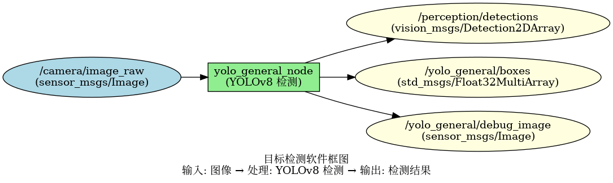
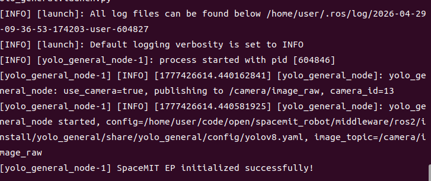
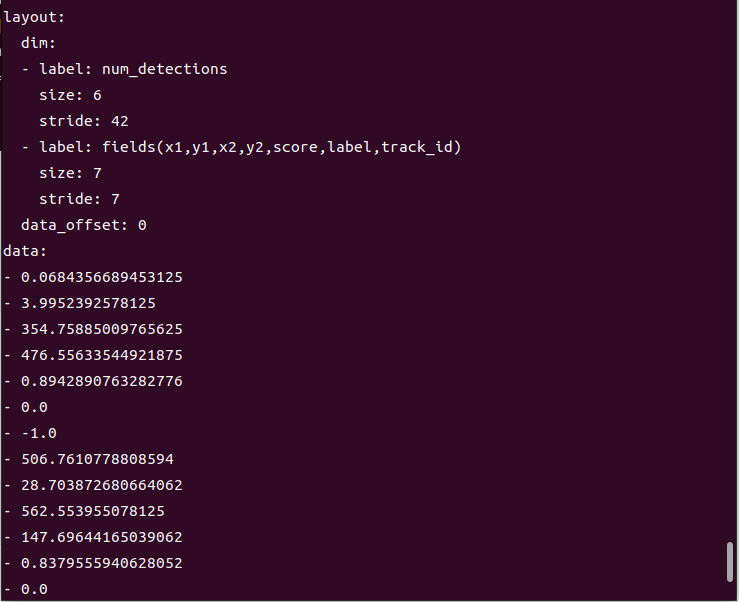

# 机器感知 · 目标检测

## 1. 模块概述

本模块提供基于 YOLOv8 的通用目标检测能力，可以实时识别图像中的 80 类常见物体（人、车辆、动物、日常用品等）。

### 功能特性

- **算法**：YOLOv8n（轻量级版本，适合嵌入式设备）
- **输入分辨率**：640×640
- **支持类别**：COCO 80 类（包括人、自行车、汽车、猫、狗、椅子、杯子等）
- **推理后端**：SpaceMIT EP（ONNX Runtime）
- **输出格式**：vision_msgs/Detection2DArray、Float32MultiArray

### 软件框图



### 目录结构

```
yolo_general/
├── src/
│   └── yolo_general_node.cpp      # 主节点实现
├── config/
│   └── yolov8.yaml                # 模型配置
├── launch/
│   └── yolo_general.launch.py     # 启动文件
└── package.xml
```

## 2. 环境准备

### 前置条件

**运行环境**
- 操作系统：Ubuntu 20.04 或 22.04
- ROS 版本：ROS 2 Humble

**依赖资源**
- `output/staging`：提供视觉推理库（`libvision.so` 与 `vision_service.h`）
- YOLOv8 模型文件：`~/.cache/models/vision/yolov8/yolov8n.q.onnx`
- COCO 标签文件：`assets/labels/coco.txt`
- ROS 2 依赖包：rclcpp、sensor_msgs、std_msgs、perception_common、vision_msgs

**硬件要求**
- 支持 USB 摄像头或网络摄像头
- 设备节点通常为 `/dev/video0`（可通过 `ls /dev/video*` 查看）

**环境初始化**
- 参照《02 快速入门》中的 ROS 2 环境配置

### 构建编译

**获取代码**
- 参照《02 快速入门 · 2.3 配置编译》获取完整代码

**编译步骤**
```bash
cd spacemit_robot
source build/envsetup.sh
cd components/model_zoo/vision
mm 
bash scripts/download_all_models.sh
bash scripts/download_assets.sh
cd ../../../
colcon build --packages-select yolo_general
source install/setup.bash
```


**编译产物**
- 可执行文件：`install/lib/yolo_general/yolo_general_node`

## 3. 快速上手

本节提供完整的操作步骤，帮助您快速跑通目标检测功能。

### 3.1 使用摄像头实时检测

这是最常用的场景，直接使用摄像头进行实时目标检测。

**准备工作**
1. 确保摄像头已连接到设备
2. 确认模型文件已下载到 `~/.cache/models/vision/yolov8/yolov8n.q.onnx`
3. 检查摄像头设备号（通常是 0 或 1）：
   ```bash
   ls /dev/video*
   ```

**重要提示**：如果您的摄像头不是 `/dev/video0`，需要修改配置文件 `config/yolo_general.yaml` 中的 `camera_id` 参数。

**步骤 1：启动检测节点**
```bash
source install/setup.bash
ros2 launch yolo_general yolo_general.launch.py
```

**终端输出：**



**步骤 2：查看检测结果**

打开新终端，查看检测框数据：
```bash
# 终端 2：查看检测框数据
ros2 topic echo /yolo_general/boxes
```

**终端输出：**



## 4. 应用开发

### 接口说明

**订阅话题**
- `/camera/image_raw` (sensor_msgs/Image) - 输入图像

**发布话题**
- `/perception/detections` (vision_msgs/Detection2DArray) - 标准检测消息，包含类别、置信度、边界框
- `/yolo_general/boxes` (std_msgs/Float32MultiArray) - 简化格式，每个目标 7 个数：x1, y1, x2, y2, score, label, track_id
- `/yolo_general/debug_image` (sensor_msgs/Image) - 带检测框的可视化图像

### 使用方式

**参数配置**
- `use_camera`：true 时直连摄像头，false 时订阅外部图像话题
- `score_threshold`：置信度阈值，默认 0.25（范围 0-1，值越高检测越严格）
- `camera_id`：摄像头设备号，默认 0

**命令行传参示例**
```bash
# 使用摄像头 1，置信度阈值 0.5
ros2 launch yolo_general yolo_general.launch.py camera_id:=1 score_threshold:=0.5
```

### 注意事项

1. **置信度阈值调整**：如果检测结果太多误检，可以提高 `score_threshold`；如果漏检太多，可以降低该值
2. **摄像头模式**：使用 `use_camera:=true` 时，节点会自动发布原始图像到 `/camera/image_raw`
3. **订阅模式**：使用 `use_camera:=false` 时，需要其他节点发布图像到 `/camera/image_raw`

### 参考资料

- 配置文件：`install/share/yolo_general/config/yolov8.yaml`
- 启动文件：`install/share/yolo_general/launch/yolo_general.launch.py`

## 5. 调试指南

### 日志调试

**查看节点日志**
```bash
# 启动节点后，日志会自动输出到终端
ros2 launch yolo_general yolo_general.launch.py
```

**提示**：如需调整日志级别，可以修改 launch 文件中的日志配置

### 常用调试命令

**检查话题状态**
```bash
# 查看所有相关话题
ros2 topic list | grep yolo_general

# 查看话题发布频率
ros2 topic hz /yolo_general/boxes

# 查看节点信息
ros2 node info /yolo_general_node
```

**检查输入图像**
```bash
# 确认图像话题是否有数据
ros2 topic hz /camera/image_raw

# 查看图像话题详细信息
ros2 topic info /camera/image_raw
```

**动态调整参数**
```bash
# 查看所有参数
ros2 param list /yolo_general_node

# 动态修改置信度阈值
ros2 param set /yolo_general_node score_threshold 0.4
```

### 性能分析

**检查 CPU 占用**
```bash
top -p $(pgrep -f yolo_general_node)
```

**检查推理延迟**
- 在节点日志中查找 inference time 相关输出

## 6. 常见问题

| 问题现象 | 可能原因 | 解决方法 |
| --- | --- | --- |
| 节点启动失败，提示找不到模型文件 | 模型路径配置错误或文件不存在 | 1. 检查 `~/.cache/models/vision/yolov8/yolov8n.q.onnx` 是否存在<br>2. 修改 `config/yolov8.yaml` 中的 model_path |
| 无检测结果输出 | 输入图像话题无数据或置信度阈值过高 | 1. 检查图像话题：`ros2 topic hz /camera/image_raw`<br>2. 降低 score_threshold 参数（如改为 0.15） |
| 检测框位置不准确 | 输入图像分辨率与模型训练分辨率差异大 | 1. 调整摄像头分辨率<br>2. 修改 config 中的 image_size 参数 |
| 推理速度慢，帧率低 | 硬件性能不足或线程数配置不当 | 1. 检查 CPU 占用情况<br>2. 调整 config 中的 num_threads 参数<br>3. 考虑使用更轻量的模型 |
| 提示缺少 vision_msgs | ROS 2 依赖包未安装 | 安装依赖：`sudo apt install ros-humble-vision-msgs` |
| 误检太多 | 置信度阈值过低 | 提高 score_threshold 参数（如改为 0.4 或 0.5） |
| 漏检目标 | 置信度阈值过高或目标太小 | 1. 降低 score_threshold 参数<br>2. 提高输入图像分辨率 |

## 附录

### COCO 80 类别列表

常见类别包括：
- 人物：person
- 交通工具：bicycle, car, motorcycle, bus, truck
- 动物：cat, dog, bird, horse, cow
- 家具：chair, couch, bed, dining table
- 电子设备：tv, laptop, mouse, keyboard, cell phone
- 日常用品：bottle, cup, fork, knife, spoon, bowl

完整类别列表请参考 `assets/labels/coco.txt` 文件。
