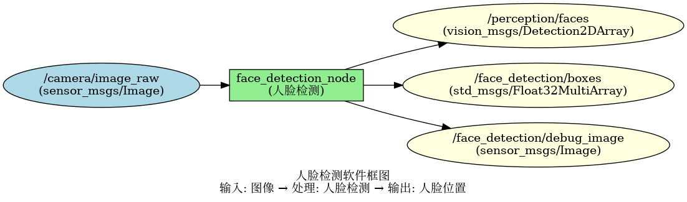
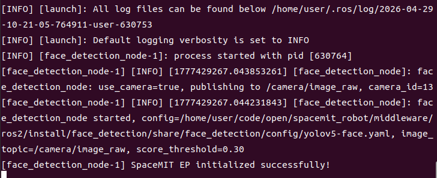
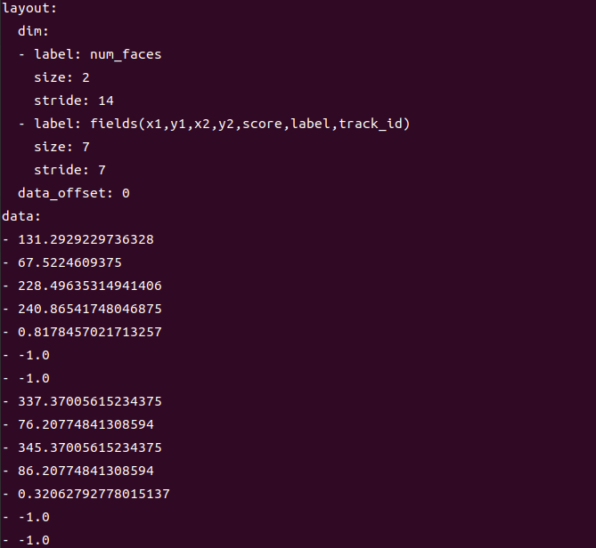

# 机器感知 · 人脸检测

## 1. 模块概述

本模块提供基于深度学习的人脸检测能力，可以实时检测图像中的人脸位置，支持多人脸同时检测。

### 功能特性

- **算法**：专用人脸检测模型（基于 YOLO 或 RetinaFace 架构）
- **输入分辨率**：可配置，默认 640×640
- **检测能力**：支持多角度、多尺度人脸检测
- **推理后端**：SpaceMIT EP（ONNX Runtime）
- **输出格式**：vision_msgs/Detection2DArray、Float32MultiArray

### 软件框图



### 目录结构

```
face_detection/
├── src/
│   └── face_detection_node.cpp    # 主节点实现
├── config/
│   └── face_detection.yaml        # 节点配置
├── launch/
│   └── face_detection.launch.py   # 启动文件
└── package.xml
```

## 2. 环境准备

### 前置条件

**运行环境**
- 操作系统：Ubuntu 20.04 或 22.04
- ROS 版本：ROS 2 Humble

**依赖资源**
- `output/staging`：提供视觉推理库（`libvision.so` 与 `vision_service.h`）
- 人脸检测模型文件：需在 config yaml 中指定路径
- ROS 2 依赖包：rclcpp、sensor_msgs、std_msgs、perception_common、vision_msgs

**硬件要求**
- 支持 USB 摄像头或网络摄像头

**环境初始化**
- 参照《02 快速入门》中的 ROS 2 环境配置

### 构建编译

**获取代码**
- 参照《02 快速入门 · 2.3 配置编译》获取完整代码

**编译步骤**
```bash
cd spacemit_robot
source build/envsetup.sh
cd components/model_zoo/vision
mm 
bash scripts/download_all_models.sh
bash scripts/download_assets.sh
cd ../../../
colcon build --packages-select face_detection
source install/setup.bash
```

**编译产物**
- 可执行文件：`install/lib/face_detection/face_detection_node`

## 3. 快速上手

本节提供完整的操作步骤，帮助您快速跑通人脸检测功能。

### 3.1 使用摄像头实时检测人脸

**准备工作**
1. 确保摄像头已连接到设备
2. 确认模型文件路径已在 config 中配置
3. 检查摄像头设备号：`ls /dev/video*`

**重要提示**：如果您的摄像头不是 `/dev/video0`，需要修改配置文件 `config/face_detection.yaml` 中的 `camera_id` 参数。

**步骤 1：启动人脸检测节点**
```bash
source install/setup.bash
ros2 launch face_detection face_detection.launch.py
```

**终端输出：**



**步骤 2：查看检测结果**

打开新终端，查看检测框数据：
```bash
# 终端 2：查看检测框数据
ros2 topic echo /face_detection/boxes
```

**终端输出：**



## 4. 应用开发

### 接口说明

**订阅话题**
- `/camera/image_raw` (sensor_msgs/Image) - 输入图像

**发布话题**
- `/perception/faces` (vision_msgs/Detection2DArray) - 标准检测消息
- `/face_detection/boxes` (std_msgs/Float32MultiArray) - 每人脸 7 个数：x1, y1, x2, y2, score, label, track_id
- `/face_detection/debug_image` (sensor_msgs/Image) - 可视化图像

### 使用方式

**参数配置**
- `use_camera`：true 时直连摄像头，false 时订阅外部图像话题
- `score_threshold`：置信度阈值，可调整检测灵敏度
- `camera_id`：摄像头设备号

**命令行传参示例**
```bash
# 使用摄像头 1，置信度阈值 0.6
ros2 launch face_detection face_detection.launch.py camera_id:=1 score_threshold:=0.6
```

### 注意事项

1. **检测结果中的 class_id 统一为 "face"**
2. **支持多人脸同时检测**，每个人脸都会有独立的检测框
3. **光照条件影响检测效果**，建议在良好光照下使用

### 参考资料

- 配置文件：`install/share/face_detection/config/`
- 启动文件：`install/share/face_detection/launch/face_detection.launch.py`

## 5. 调试指南

### 日志调试

**查看节点日志**
```bash
# 启动节点后，日志会自动输出到终端
ros2 launch face_detection face_detection.launch.py
```

**提示**：如需调整日志级别，可以修改 launch 文件中的日志配置

### 常用调试命令

**检查话题状态**
```bash
# 查看所有相关话题
ros2 topic list | grep face_detection

# 查看话题发布频率
ros2 topic hz /face_detection/boxes

# 查看节点信息
ros2 node info /face_detection_node
```

**检查输入图像**
```bash
# 确认图像话题是否有数据
ros2 topic hz /camera/image_raw

# 查看图像话题详细信息
ros2 topic info /camera/image_raw
```

### 性能分析

**检查 CPU 占用**
```bash
top -p $(pgrep -f face_detection_node)
```

**检查推理延迟**
- 在节点日志中查找 inference time 相关输出

## 6. 常见问题

| 问题现象 | 可能原因 | 解决方法 |
| --- | --- | --- |
| 节点启动失败，提示找不到模型文件 | 模型路径配置错误 | 检查 config yaml 中的 model_path 是否正确 |
| 无检测结果输出 | 输入图像无人脸或置信度阈值过高 | 1. 确认输入图像中有清晰人脸<br>2. 降低 score_threshold 参数 |
| 漏检或误检 | 模型精度问题或图像质量差 | 1. 提高图像分辨率<br>2. 改善光照条件<br>3. 调整置信度阈值 |
| 小人脸检测不到 | 输入分辨率不足 | 提高输入图像分辨率或使用多尺度检测 |
| 侧脸检测不到 | 人脸角度过大 | 1. 调整拍摄角度<br>2. 使用支持多角度的模型 |
| 提示缺少 vision_msgs | ROS 2 依赖包未安装 | 安装依赖：`sudo apt install ros-humble-vision-msgs` |

## 附录

### 应用场景

- **人脸识别预处理**：为人脸识别系统提供人脸区域定位
- **人数统计**：统计场景中的人数
- **人脸跟踪**：结合跟踪算法实现人脸跟踪
- **安防监控**：实时监控场景中的人脸
- **人机交互**：检测用户人脸位置，用于交互控制
