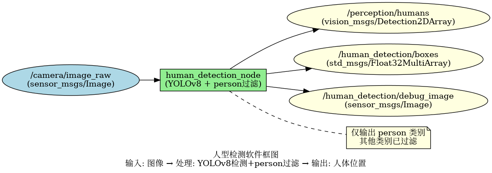
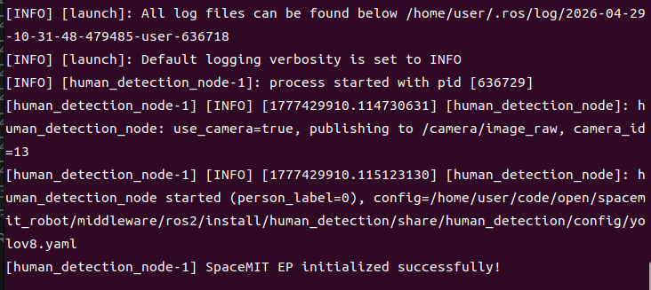
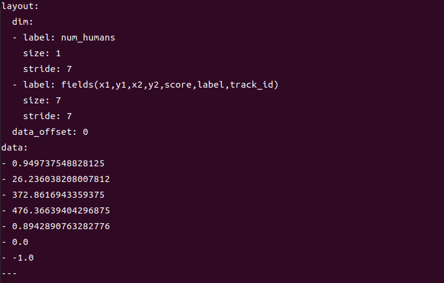

# 机器感知 · 人型检测

## 1. 模块概述

本模块提供基于 YOLOv8 的人体检测能力，专门检测图像中的"人"（person），过滤掉其他类别，适用于人流统计、人员跟踪等场景。

### 功能特性

- **算法**：YOLOv8n + COCO 数据集（仅保留 person 类别，label=0）
- **输入分辨率**：640×640
- **检测类别**：仅 person（人）
- **推理后端**：SpaceMIT EP（ONNX Runtime）
- **输出格式**：vision_msgs/Detection2DArray、Float32MultiArray

### 软件框图



### 目录结构

```
human_detection/
├── src/
│   └── human_detection_node.cpp   # 主节点实现
├── config/
│   ├── human_detection.yaml       # 节点配置
│   └── yolov8.yaml                # 模型配置
├── launch/
│   └── human_detection.launch.py  # 启动文件
└── package.xml
```

## 2. 环境准备

### 前置条件

**运行环境**
- 操作系统：Ubuntu 20.04 或 22.04
- ROS 版本：ROS 2 Humble

**依赖资源**
- `output/staging`：提供视觉推理库（`libvision.so` 与 `vision_service.h`）
- YOLOv8 模型文件：`~/.cache/models/vision/yolov8/yolov8n.q.onnx`
- COCO 标签文件：`assets/labels/coco.txt`
- ROS 2 依赖包：rclcpp、sensor_msgs、std_msgs、perception_common、vision_msgs

**硬件要求**
- 支持 USB 摄像头或网络摄像头
- 设备节点通常为 `/dev/video0`

**环境初始化**
- 参照《02 快速入门》中的 ROS 2 环境配置

### 构建编译

**获取代码**
- 参照《02 快速入门 · 2.3 配置编译》获取完整代码

**编译步骤**
```bash
cd spacemit_robot
source build/envsetup.sh
cd components/model_zoo/vision
mm 
bash scripts/download_all_models.sh
bash scripts/download_assets.sh
cd ../../../
colcon build --packages-select human_detection
source install/setup.bash
```

**编译产物**
- 可执行文件：`install/lib/human_detection/human_detection_node`

## 3. 快速上手

本节提供完整的操作步骤，帮助您快速跑通人型检测功能。

### 3.1 使用摄像头实时检测人体

**准备工作**
1. 确保摄像头已连接到设备
2. 确认模型文件已下载到 `~/.cache/models/vision/yolov8/yolov8n.q.onnx`
3. 检查摄像头设备号：`ls /dev/video*`

**重要提示**：如果您的摄像头不是 `/dev/video0`，需要修改配置文件 `config/human_detection.yaml` 中的 `camera_id` 参数。

**步骤 1：启动人体检测节点**
```bash
source install/setup.bash
ros2 launch human_detection human_detection.launch.py
```

**终端输出：**



**步骤 2：查看检测结果**

打开新终端，查看检测框数据：
```bash
# 终端 2：查看检测框数据
ros2 topic echo /human_detection/boxes
```

**终端输出：**




## 4. 应用开发

### 接口说明

**订阅话题**
- `/camera/image_raw` (sensor_msgs/Image) - 输入图像

**发布话题**
- `/perception/humans` (vision_msgs/Detection2DArray) - 标准检测消息，class_id 固定为 "person"
- `/human_detection/boxes` (std_msgs/Float32MultiArray) - 每人 7 个数：x1, y1, x2, y2, score, label, track_id
- `/human_detection/debug_image` (sensor_msgs/Image) - 可视化图像

### 使用方式

**参数配置**
- `person_label_id`：COCO 中 person 的类别 ID，默认 0
- `use_camera`：true 时直连摄像头并发布图像，false 时订阅外部图像话题
- `score_threshold`：置信度阈值，默认 0.25

**命令行传参示例**
```bash
# 使用摄像头 1，置信度阈值 0.3
ros2 launch human_detection human_detection.launch.py camera_id:=1 score_threshold:=0.3
```

### 注意事项

1. **输出的 `/perception/humans` 仅包含 person 类别**，其他类别已过滤
2. **debug_image 可能显示其他类别框**：这是正常现象，debug_image 显示模型原始输出，但 /perception/humans 已过滤
3. **适用场景**：人流统计、人员跟踪、人体检测等只关注人的场景

### 参考资料

- 配置文件：`install/share/human_detection/config/human_detection.yaml`
- 模型配置：`install/share/human_detection/config/yolov8.yaml`
- 启动文件：`install/share/human_detection/launch/human_detection.launch.py`

## 5. 调试指南

### 日志调试

**查看节点日志**
```bash
# 启动节点后，日志会自动输出到终端
ros2 launch human_detection human_detection.launch.py
```

**提示**：如需调整日志级别，可以修改 launch 文件中的日志配置

### 常用调试命令

**检查话题状态**
```bash
# 查看所有相关话题
ros2 topic list | grep human_detection

# 查看话题发布频率
ros2 topic hz /human_detection/boxes

# 查看节点参数
ros2 param list /human_detection_node
```

**动态调整参数**
```bash
# 动态修改置信度阈值
ros2 param set /human_detection_node score_threshold 0.3
```

**检查输入图像**
```bash
# 确认图像话题是否有数据
ros2 topic hz /camera/image_raw

# 查看图像话题详细信息
ros2 topic echo /camera/image_raw --once
```

### 性能分析

**检查 CPU 占用**
```bash
top -p $(pgrep -f human_detection_node)
```

**检查推理延迟**
- 在节点日志中查找 inference time 相关输出

## 6. 常见问题

| 问题现象 | 可能原因 | 解决方法 |
| --- | --- | --- |
| 节点启动失败，提示找不到模型文件 | 模型路径配置错误或文件不存在 | 检查 `~/.cache/models/vision/yolov8/yolov8n.q.onnx` 是否存在 |
| 无检测结果输出 | 输入图像话题无数据或场景中无人 | 1. 检查 `/camera/image_raw` 是否有数据<br>2. 确认场景中有人<br>3. 降低 score_threshold |
| 检测到其他物体 | person_label_id 配置错误 | 检查 config 中 person_label_id 是否为 0（COCO 标准） |
| 漏检部分人体 | 置信度阈值过高或人体被遮挡 | 1. 降低 score_threshold<br>2. 改善拍摄角度和光照 |
| debug_image 显示其他类别框 | 这是正常现象 | debug_image 显示模型原始输出，但 /perception/humans 已过滤 |
| 提示缺少 vision_msgs | ROS 2 依赖包未安装 | 安装依赖：`sudo apt install ros-humble-vision-msgs` |

## 附录

### 应用场景

- **人流统计**：统计特定区域的人数
- **人员跟踪**：结合跟踪算法实现人员轨迹跟踪
- **安防监控**：检测监控区域内的人员
- **人机交互**：检测用户位置，用于交互控制
- **智能零售**：统计店铺客流量
