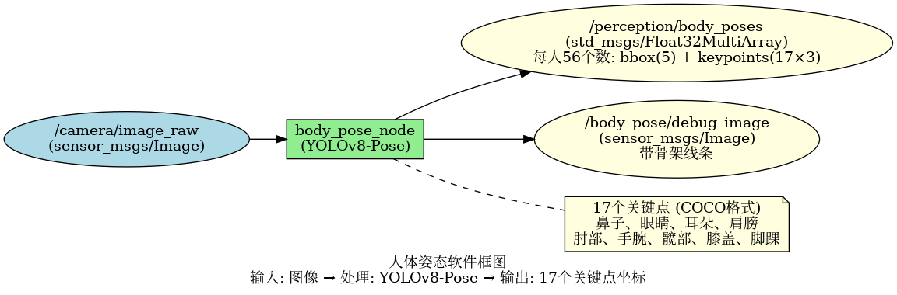
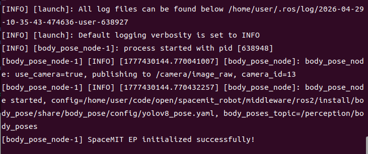
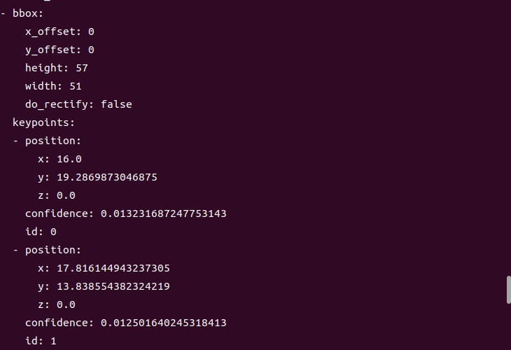

# 机器感知 · 人体姿态

## 1. 模块概述

本模块提供基于 YOLOv8-Pose 的人体姿态估计能力，可以检测图像中的人体并输出 17 个关键点（COCO 格式），包括头部、躯干、四肢等关键部位，适用于动作识别、姿态分析、健身指导等场景。

### 功能特性

- **算法**：YOLOv8-Pose（YOLOv8n-pose 轻量级版本）
- **输入分辨率**：640×640
- **关键点数量**：17 个（COCO 标准）
- **关键点定义**：鼻子、眼睛、耳朵、肩膀、肘部、手腕、髋部、膝盖、脚踝
- **推理后端**：SpaceMIT EP（ONNX Runtime）
- **输出格式**：Float32MultiArray（每人 56 个数：bbox + 17×3 关键点坐标及可见性）

### 软件框图



### 目录结构

```
body_pose/
├── src/
│   └── body_pose_node.cpp         # 主节点实现
├── config/
│   ├── body_pose.yaml             # 节点配置
│   └── yolov8_pose.yaml           # 模型配置
├── launch/
│   └── body_pose.launch.py        # 启动文件
└── package.xml
```

## 2. 环境准备

### 前置条件

**运行环境**
- 操作系统：Ubuntu 20.04 或 22.04
- ROS 版本：ROS 2 Humble

**依赖资源**
- `output/staging`：提供视觉推理库（`libvision.so` 与 `vision_service.h`）
- YOLOv8-Pose 模型文件：`~/.cache/models/vision/yolov8_pose/yolov8n-pose.q.onnx`
- ROS 2 依赖包：rclcpp、sensor_msgs、std_msgs、perception_common

**硬件要求**
- 支持 USB 摄像头或网络摄像头

**环境初始化**
- 参照《02 快速入门》中的 ROS 2 环境配置

### 构建编译

**获取代码**
- 参照《02 快速入门 · 2.3 配置编译》获取完整代码

**编译步骤**
```bash
cd spacemit_robot
source build/envsetup.sh
cd components/model_zoo/vision
mm 
bash scripts/download_all_models.sh
bash scripts/download_assets.sh
cd ../../../
colcon build --packages-select body_pose
source install/setup.bash
```

**编译产物**
- 可执行文件：`install/lib/body_pose/body_pose_node`

## 3. 快速上手

本节提供完整的操作步骤，帮助您快速跑通人体姿态估计功能。

### 3.1 使用摄像头实时姿态估计

**准备工作**
1. 确保摄像头已连接到设备
2. 确认模型文件已下载到 `~/.cache/models/vision/yolov8_pose/yolov8n-pose.q.onnx`
3. 检查摄像头设备号：`ls /dev/video*`

**重要提示**：如果您的摄像头不是 `/dev/video0`，需要修改配置文件 `config/body_pose.yaml` 中的 `camera_id` 参数。

**步骤 1：启动人体姿态节点**
```bash
source install/setup.bash
ros2 launch body_pose body_pose.launch.py
```

**终端输出：**



**步骤 2：查看姿态数据**

打开新终端，查看关键点数据：
```bash
# 终端 2：查看关键点数据
ros2 topic echo /perception/body_poses
```

**终端输出：**



## 4. 应用开发

### 接口说明

**订阅话题**
- `/camera/image_raw` (sensor_msgs/Image) - 输入图像

**发布话题**
- `/perception/body_poses` (std_msgs/Float32MultiArray) - 每人 56 个数：bbox(5) + keypoints(17×3)
- `/body_pose/debug_image` (sensor_msgs/Image) - 带骨架的可视化图像

### 关键点说明

**COCO 17 点顺序**（索引从 0 开始）：
- 0: 鼻子 (nose)
- 1: 左眼 (left_eye)
- 2: 右眼 (right_eye)
- 3: 左耳 (left_ear)
- 4: 右耳 (right_ear)
- 5: 左肩 (left_shoulder)
- 6: 右肩 (right_shoulder)
- 7: 左肘 (left_elbow)
- 8: 右肘 (right_elbow)
- 9: 左腕 (left_wrist)
- 10: 右腕 (right_wrist)
- 11: 左髋 (left_hip)
- 12: 右髋 (right_hip)
- 13: 左膝 (left_knee)
- 14: 右膝 (right_knee)
- 15: 左踝 (left_ankle)
- 16: 右踝 (right_ankle)

**【图片占位：人体关键点位置示意图】**

**可见性值（visibility）**：
- 0: 不可见
- 1: 遮挡
- 2: 可见

### 使用方式

**参数配置**
- `use_camera`：true 时直连摄像头，false 时订阅外部图像话题
- `score_threshold`：置信度阈值，默认 0.25

**命令行传参示例**
```bash
# 使用摄像头 1，置信度阈值 0.3
ros2 launch body_pose body_pose.launch.py camera_id:=1 score_threshold:=0.3
```

### 注意事项

1. **关键点坐标**：x, y 为像素坐标，原点在图像左上角
2. **可见性判断**：使用 visibility 值判断关键点是否可用
3. **人体完整性**：部分遮挡时，被遮挡的关键点 visibility 会标记为 0 或 1

### 参考资料

- 配置文件：`install/share/body_pose/config/body_pose.yaml`
- 模型配置：`install/share/body_pose/config/yolov8_pose.yaml`
- 启动文件：`install/share/body_pose/launch/body_pose.launch.py`

## 5. 调试指南

### 日志调试

**查看节点日志**
```bash
# 启动节点后，日志会自动输出到终端
ros2 launch body_pose body_pose.launch.py
```

**提示**：如需调整日志级别，可以修改 launch 文件中的日志配置

### 常用调试命令

**检查话题状态**
```bash
# 查看所有相关话题
ros2 topic list | grep body_pose

# 查看话题发布频率
ros2 topic hz /perception/body_poses

# 查看节点参数
ros2 param list /body_pose_node
```

### 性能分析

**检查 CPU 占用**
```bash
top -p $(pgrep -f body_pose_node)
```

**检查推理延迟**
- 在节点日志中查找 inference time 相关输出

## 6. 常见问题

| 问题现象 | 可能原因 | 解决方法 |
| --- | --- | --- |
| 节点启动失败，提示找不到模型文件 | 模型路径配置错误 | 检查 `~/.cache/models/vision/yolov8_pose/yolov8n-pose.q.onnx` 是否存在 |
| 无姿态输出 | 输入图像无人或置信度阈值过高 | 1. 确认场景中有完整人体<br>2. 降低 score_threshold |
| 关键点位置不准确 | 人体被遮挡或姿态复杂 | 1. 改善拍摄角度<br>2. 提高图像分辨率<br>3. 使用更大的模型 |
| 节点崩溃 exit -11 | 推理库或摄像头驱动问题 | 见上方"崩溃排查"，使用 gdb 定位 |
| 关键点抖动严重 | 检测不稳定 | 1. 提高置信度阈值<br>2. 添加时序平滑算法 |
| 小人体检测不到关键点 | 输入分辨率不足 | 提高输入图像分辨率 |

## 附录

### 应用场景

- **动作识别**：作为动作识别的输入，提供骨架序列数据
- **姿态分析**：分析人体姿态，用于健身指导、康复训练
- **手势识别**：结合手部关键点进行手势识别
- **跌倒检测**：通过关键点位置判断是否跌倒
- **人机交互**：基于姿态的交互控制
- **运动分析**：体育运动中的动作分析
