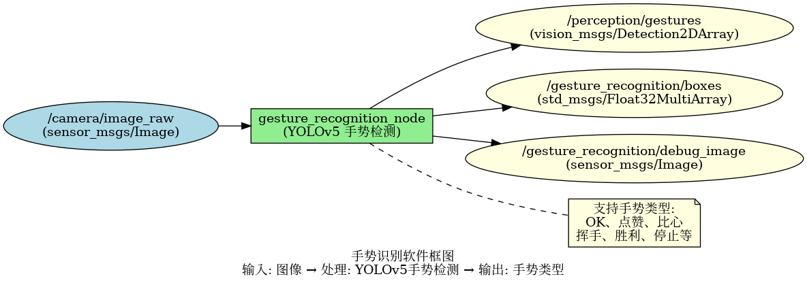
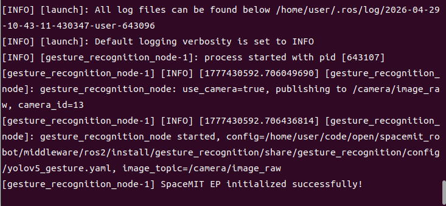
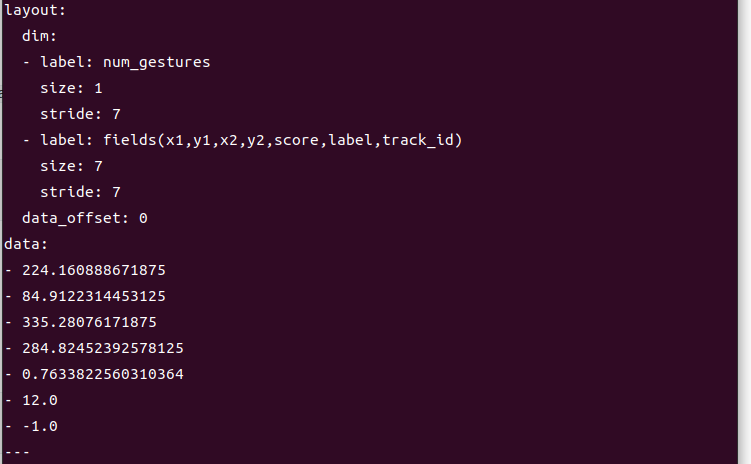

# 机器感知 · 手势识别

## 1. 模块概述

本模块提供基于 YOLOv5 的手势识别能力，可以检测图像中的手势并识别手势类型，适用于人机交互、手势控制、手语识别等场景。

### 功能特性

- **算法**：YOLOv5 手势检测模型
- **输入分辨率**：可配置，默认 640×640
- **支持手势类型**：根据训练模型而定（如：OK、点赞、比心、挥手等）
- **推理后端**：SpaceMIT EP（ONNX Runtime）
- **输出格式**：vision_msgs/Detection2DArray、Float32MultiArray

### 软件框图



### 目录结构

```
gesture_recognition/
├── src/
│   └── gesture_recognition_node.cpp   # 主节点实现
├── config/
│   └── yolov5_gesture.yaml            # 模型配置
├── launch/
│   └── gesture_recognition.launch.py  # 启动文件
└── package.xml
```

## 2. 环境准备

### 前置条件

**运行环境**
- 操作系统：Ubuntu 20.04 或 22.04
- ROS 版本：ROS 2 Humble

**依赖资源**
- `output/staging`：提供视觉推理库（`libvision.so` 与 `vision_service.h`）
- YOLOv5 手势模型文件：`~/.cache/models/vision/yolov5/yolov5_gesture.q.onnx`
- ROS 2 依赖包：rclcpp、sensor_msgs、std_msgs、perception_common、vision_msgs

**硬件要求**
- 支持 USB 摄像头或网络摄像头

**环境初始化**
- 参照《02 快速入门》中的 ROS 2 环境配置

### 构建编译

**获取代码**
- 参照《02 快速入门 · 2.3 配置编译》获取完整代码

**编译步骤**
```bash
cd spacemit_robot
source build/envsetup.sh
cd components/model_zoo/vision
mm 
bash scripts/download_all_models.sh
bash scripts/download_assets.sh
cd ../../../
colcon build --packages-select gesture_recognition
source install/setup.bash
```

**编译产物**
- 可执行文件：`install/lib/gesture_recognition/gesture_recognition_node`

## 3. 快速上手

本节提供完整的操作步骤，帮助您快速跑通手势识别功能。

### 3.1 使用摄像头实时识别手势

**准备工作**
1. 确保摄像头已连接到设备
2. 确认模型文件已下载到 `~/.cache/models/vision/yolov5/yolov5_gesture.q.onnx`
3. 检查摄像头设备号：`ls /dev/video*`

**重要提示**：如果您的摄像头不是 `/dev/video0`，需要修改配置文件 `config/gesture_recognition.yaml` 中的 `camera_id` 参数。

**步骤 1：启动手势识别节点**
```bash
source install/setup.bash
ros2 launch gesture_recognition gesture_recognition.launch.py
```

**终端输出：**



**步骤 2：查看识别结果**

打开新终端，查看手势检测框数据：
```bash
# 终端 2：查看手势检测框数据
ros2 topic echo /gesture_recognition/boxes
```

**终端输出：**



## 4. 应用开发

### 接口说明

**订阅话题**
- `/camera/image_raw` (sensor_msgs/Image) - 输入图像

**发布话题**
- `/perception/gestures` (vision_msgs/Detection2DArray) - 标准检测消息
- `/gesture_recognition/boxes` (std_msgs/Float32MultiArray) - 每手势 7 个数：x1, y1, x2, y2, score, label, track_id
- `/gesture_recognition/debug_image` (sensor_msgs/Image) - 带框与标签的可视化图像

### 使用方式

**参数配置**
- `use_camera`：true 时直连摄像头并发布图像，false 时订阅外部图像话题
- `score_threshold`：置信度阈值，可调整识别灵敏度
- `class`：手势类别配置，需与模型匹配

**命令行传参示例**
```bash
# 使用摄像头 1，置信度阈值 0.4
ros2 launch gesture_recognition gesture_recognition.launch.py camera_id:=1 score_threshold:=0.4
```

### 注意事项

1. **手势类型取决于训练模型**：需确保 yaml 中的 `class` 配置与模型匹配
2. **光照条件影响识别效果**：建议在良好光照条件下使用
3. **手势应清晰可见**：手势不应被遮挡，且应在摄像头视野范围内
4. **距离适中**：手势距离摄像头不宜过远或过近

### 参考资料

- 配置文件：`install/share/gesture_recognition/config/yolov5_gesture.yaml`
- 启动文件：`install/share/gesture_recognition/launch/gesture_recognition.launch.py`

## 5. 调试指南

### 日志调试

**查看节点日志**
```bash
# 启动节点后，日志会自动输出到终端
ros2 launch gesture_recognition gesture_recognition.launch.py
```

**提示**：如需调整日志级别，可以修改 launch 文件中的日志配置

### 常用调试命令

**检查话题状态**
```bash
# 查看所有相关话题
ros2 topic list | grep gesture_recognition

# 查看话题发布频率
ros2 topic hz /gesture_recognition/boxes

# 查看节点参数
ros2 param list /gesture_recognition_node
```

**动态调整参数**
```bash
# 动态修改置信度阈值
ros2 param set /gesture_recognition_node score_threshold 0.4
```

**检查输入图像**
```bash
# 确认图像话题是否有数据
ros2 topic hz /camera/image_raw
```

### 性能分析

**检查 CPU 占用**
```bash
top -p $(pgrep -f gesture_recognition_node)
```

**检查推理延迟**
- 在节点日志中查找 inference time 相关输出

## 6. 常见问题

| 问题现象 | 可能原因 | 解决方法 |
| --- | --- | --- |
| 节点启动失败，提示找不到模型文件 | 模型路径配置错误 | 检查 `~/.cache/models/vision/yolov5/yolov5_gesture.q.onnx` 是否存在 |
| 无识别结果输出 | 输入图像无手势或置信度阈值过高 | 1. 确认场景中有清晰手势<br>2. 降低 score_threshold |
| 手势识别错误 | 模型训练数据不足或手势不标准 | 1. 使用标准手势<br>2. 改善光照条件<br>3. 重新训练模型 |
| 识别延迟高 | 图像分辨率过高或硬件性能不足 | 1. 降低输入分辨率<br>2. 调整 num_threads 参数 |
| 误检其他物体为手势 | 置信度阈值过低 | 提高 score_threshold 参数 |
| 提示缺少 vision_msgs | ROS 2 依赖包未安装 | 安装依赖：`sudo apt install ros-humble-vision-msgs` |

## 附录

### 常见手势类型

根据训练模型，可能支持的手势类型包括：
- **OK 手势**：拇指和食指形成圆圈
- **点赞**：竖起大拇指
- **比心**：双手或单手形成心形
- **挥手**：手掌左右摆动
- **胜利手势**：食指和中指呈 V 字形
- **停止手势**：手掌向前伸出

### 应用场景

- **人机交互**：通过手势控制机器人或设备
- **手语识别**：识别手语进行交流
- **智能家居**：手势控制家电设备
- **游戏控制**：使用手势进行游戏操作
- **演示控制**：手势控制演示文稿翻页
