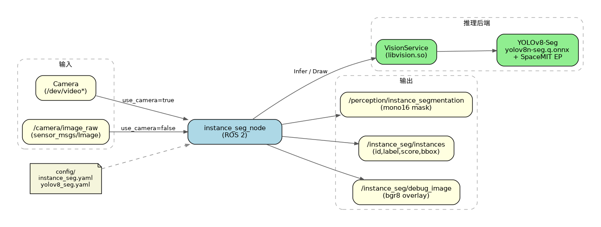
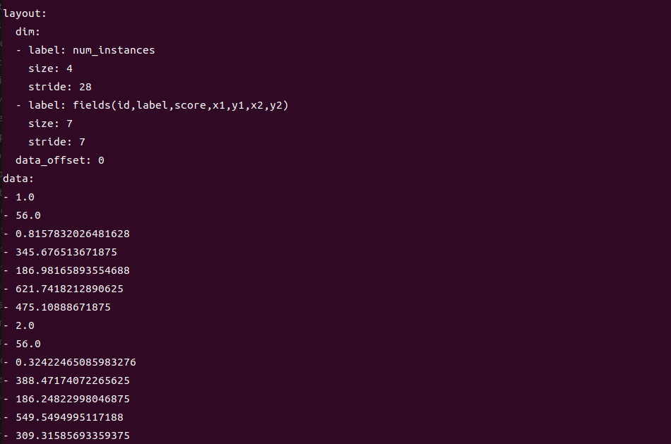

# 机器感知 · 实例分割

## 1. 模块概述

本模块提供基于 YOLOv8-Seg 的实例分割能力，可对图像中的每个目标实例输出分割掩码与检测框，适用于目标抠图、精确轮廓感知、场景交互等场景。

### 功能特性

- **算法**：YOLOv8n-Seg（量化 ONNX，适合板端推理）
- **输入分辨率**：640×640
- **支持类别**：COCO 80 类
- **推理后端**：SpaceMIT EP（ONNX Runtime）
- **输出格式**：
  - `sensor_msgs/Image`（`mono16` 实例掩码）
  - `std_msgs/Float32MultiArray`（实例元数据）
  - `sensor_msgs/Image`（`bgr8` 调试叠加图）

### 软件框图



### 目录结构

```
instance_seg/
├── src/
│   ├── instance_seg_node.cpp   # 主节点实现
│   ├── image_utils.cpp         # 图像消息转换
│   └── instance_utils.cpp      # 实例元数据编码
├── config/
│   ├── instance_seg.yaml       # 节点参数
│   └── yolov8_seg.yaml         # 模型配置
├── launch/
│   └── instance_seg.launch.py  # 启动文件
├── include/instance_seg/
├── tests/
└── package.xml
```

## 2. 环境准备

### 前置条件

**运行环境**
- 操作系统：Ubuntu 20.04 或 22.04
- ROS 版本：ROS 2 Humble

**依赖资源**
- `output/staging`：提供视觉推理库（`libvision.so` 与 `vision_service.h`）
- YOLOv8-Seg 模型：`~/.cache/models/vision/yolov8_seg/yolov8n-seg.q.onnx`
- COCO 标签文件：`assets/labels/coco.txt`（相对模型工程根目录解析）
- ROS 2 依赖包：rclcpp、sensor_msgs、std_msgs、ament_index_cpp

**硬件要求**
- 支持 USB 摄像头或外部图像话题输入
- 设备节点可通过 `ls /dev/video*` 查看

**环境初始化**
- 参照《02 快速入门》中的 ROS 2 环境配置

### 构建编译

**获取代码**
- 参照《02 快速入门 · 2.3 配置编译》获取完整代码

**编译步骤**
```bash
cd spacemit_robot
source build/envsetup.sh
cd components/model_zoo/vision
mm
bash scripts/download_all_models.sh
bash scripts/download_assets.sh
cd ../../../
# 推荐用 SDK 方式把包安装到 output/staging
cd middleware/ros2/perception/instance_seg && mm --with-deps
# 或：
# colcon build --packages-select instance_seg
# source install/setup.bash
```

**编译产物**
- 可执行文件：`install/lib/instance_seg/instance_seg_node`
  （若使用 SDK staging，则为 `output/staging/lib/instance_seg/instance_seg_node`）

## 3. 快速上手

本节提供完整的操作步骤，帮助您快速跑通实例分割功能。

### 3.1 使用摄像头实时分割

**准备工作**
1. 确保摄像头已连接
2. 确认模型已下载到 `~/.cache/models/vision/yolov8_seg/yolov8n-seg.q.onnx`
3. 检查摄像头设备号：
   ```bash
   ls /dev/video*
   ```

**重要提示**：默认配置 `config/instance_seg.yaml` 中 `camera_id` 为 `1`。若摄像头不是对应设备，请修改该参数。

**步骤 1：启动实例分割节点**
```bash
source install/setup.bash   # 或 source output/staging/setup.bash
ros2 launch instance_seg instance_seg.launch.py
```

**终端输出：**


**步骤 2：查看实例元数据**

打开新终端：
```bash
ros2 topic echo /instance_seg/instances
```

每条消息中，每个实例包含 7 个字段：`id, label, score, x1, y1, x2, y2`。

**终端输出：**



**步骤 3：查看掩码与调试图**
```bash
# 实例掩码（mono16；0 为背景，1..N 为本帧实例 ID）
ros2 topic echo /perception/instance_segmentation --once --qos-reliability best_effort

# 调试叠加图（若无 rqt，可用其他工具订阅该话题）
ros2 topic hz /instance_seg/debug_image
```

### 3.2 订阅外部图像话题

若不使用本机摄像头，可关闭摄像头模式并订阅外部 `sensor_msgs/Image`：

```bash
ros2 run instance_seg instance_seg_node --ros-args \
  -p use_camera:=false \
  -p image_topic:=/camera/image_raw
```

然后由其他节点向 `/camera/image_raw` 发布图像。

## 4. 应用开发

### 接口说明

**订阅话题**
- `/camera/image_raw` (`sensor_msgs/Image`)：当 `use_camera:=false` 时订阅；`use_camera:=true` 时由节点打开摄像头并发布该话题

**发布话题**
- `/perception/instance_segmentation` (`sensor_msgs/Image`, `mono16`)：像素 0 为背景，1..N 为实例序号
- `/instance_seg/instances` (`std_msgs/Float32MultiArray`)：连续字段 `[id,label,score,x1,y1,x2,y2]`
- `/instance_seg/debug_image` (`sensor_msgs/Image`, `bgr8`)：`VisionService::Draw` 可视化结果

### 使用方式

**参数配置（`config/instance_seg.yaml`）**

| 参数 | 默认值 | 说明 |
| --- | --- | --- |
| `config_path` | 空（自动指向 `yolov8_seg.yaml`） | 模型 yaml 路径 |
| `lazy_load` | `true` | 是否延迟加载模型 |
| `score_threshold` | `0.25` | 实例置信度阈值，范围 `[0, 1]` |
| `image_topic` | `/camera/image_raw` | 图像话题 |
| `mask_topic` | `/perception/instance_segmentation` | 掩码输出话题 |
| `instances_topic` | `/instance_seg/instances` | 元数据输出话题 |
| `debug_image_topic` | `/instance_seg/debug_image` | 调试图话题 |
| `use_camera` | `true` | 是否直连摄像头 |
| `camera_id` | `1` | 摄像头编号 |
| `camera_fps` | `30.0` | 摄像头采集帧率，必须 `> 0` |

**命令行传参示例**
```bash
ros2 launch instance_seg instance_seg.launch.py \
  use_camera:=false \
  image_topic:=/camera/image_raw \
  score_threshold:=0.35
```

### 注意事项

1. **实例掩码与元数据一一对应**：掩码中的 ID 与 `instances` 中的 `id` 一致（从 1 开始）
2. **重叠区域**：同一像素被多个实例覆盖时，以后出现的有效实例为准
3. **无效掩码会被跳过**：空、非单通道，或尺寸与输入图像不一致的掩码会丢弃并打 throttled 警告
4. **mask/debug 话题 QoS**：使用 `SensorDataQoS`（best_effort），订阅时请匹配 reliability

### 参考资料

- 节点配置：`install/share/instance_seg/config/instance_seg.yaml`
- 模型配置：`install/share/instance_seg/config/yolov8_seg.yaml`
- 启动文件：`install/share/instance_seg/launch/instance_seg.launch.py`
- 包内 README：`middleware/ros2/perception/instance_seg/README.md`

## 5. 调试指南

### 日志调试

```bash
ros2 launch instance_seg instance_seg.launch.py
# 正常应看到类似：
# instance_seg_node started, config=..., input=...
# SpaceMIT EP initialized: .../yolov8n-seg.q.onnx
```

### 常用调试命令

```bash
# 确认节点与话题
ros2 node list | grep instance_seg
ros2 topic list | grep -E 'instance_seg|instance_segmentation'

# 查看输出频率
ros2 topic hz /instance_seg/instances
ros2 topic hz /perception/instance_segmentation

# 查看参数
ros2 param list /instance_seg_node
```

### 性能分析

```bash
top -p $(pgrep -f instance_seg_node)
```

## 6. 常见问题

| 问题现象 | 可能原因 | 解决方法 |
| --- | --- | --- |
| 节点启动失败，找不到模型 | `yolov8_seg.yaml` 中 `model_path` 不正确或模型未下载 | 检查 `~/.cache/models/vision/yolov8_seg/yolov8n-seg.q.onnx`，必要时重新执行模型下载脚本 |
| 话题存在但长时间无结果 | 1. 无输入图<br>2. 置信度过高被过滤<br>3. 推理失败 | 1. 确认摄像头/`image_topic` 有数据<br>2. 降低 `score_threshold`<br>3. 查看节点 throttled 警告 |
| `echo` 不到 mask/debug | QoS 不匹配 | 增加 `--qos-reliability best_effort` |
| `camera_fps` / `score_threshold` 启动即退出 | 参数越界 | `score_threshold` 必须在 `[0,1]`，`camera_fps` 必须有限且 `> 0` |
| 外接话题无输入 | 仍在摄像头模式 | 设置 `use_camera:=false` 并指定正确的 `image_topic` |

## 附录

### 应用场景

- **目标抠图**：按实例 mask 提取目标区域
- **精确避障**：结合轮廓信息做近距离交互
- **检测增强**：在检测框之外补充像素级实例轮廓

### 与语义分割的区别

| 对比项 | 实例分割（本模块） | 语义分割（5.1.7） |
| --- | --- | --- |
| 模型 | YOLOv8-Seg | PP-LiteSeg |
| 输出含义 | 每个目标一个实例 ID | 每个像素一个语义类别 |
| 掩码格式 | `mono16` | `mono8` |
| 元数据 | 实例框 + score + label | 各类别像素计数 |
