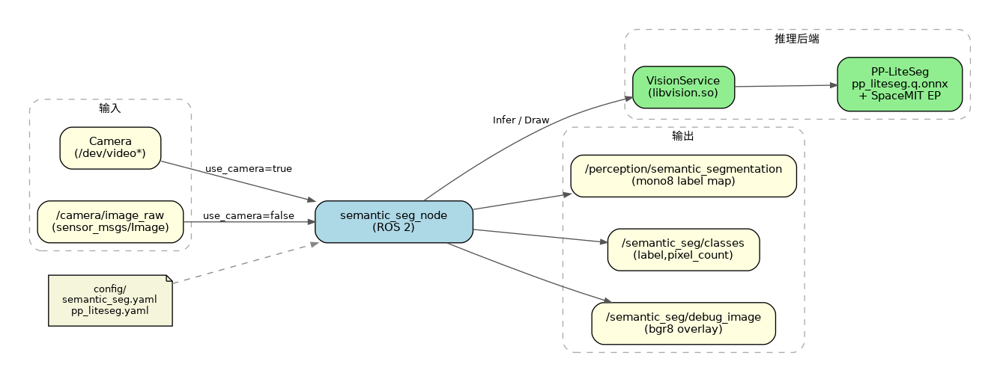

# 机器感知 · 语义分割

## 1. 模块概述

本模块提供基于 PP-LiteSeg 的语义分割能力，对图像中每个像素分配语义类别，适用于场景理解、可行驶区域分析、环境语义建模等场景。

### 功能特性

- **算法**：PP-LiteSeg（Cityscapes，19 类）
- **推理后端**：SpaceMIT EP（ONNX Runtime）
- **输出格式**：
  - `sensor_msgs/Image`（`mono8` 类别标签图）
  - `std_msgs/Float32MultiArray`（前景类别像素统计）
  - `sensor_msgs/Image`（`bgr8` 调试叠加图）
- **不支持**：实例级 ID、目标跟踪

### 软件框图



### 目录结构

```
semantic_seg/
├── src/
│   ├── semantic_seg_node.cpp    # 主节点实现
│   ├── image_utils.cpp          # 图像消息转换
│   └── segmentation_utils.cpp   # 掩码合成与像素统计
├── config/
│   ├── semantic_seg.yaml        # 节点参数
│   └── pp_liteseg.yaml          # 模型配置
├── launch/
│   └── semantic_seg.launch.py   # 启动文件
├── include/semantic_seg/
├── tests/
└── package.xml
```

## 2. 环境准备

### 前置条件

**运行环境**
- 操作系统：Ubuntu 20.04 或 22.04
- ROS 版本：ROS 2 Humble

**依赖资源**
- `output/staging`：提供视觉推理库（`libvision.so` 与 `vision_service.h`）
- PP-LiteSeg 模型：`~/.cache/models/vision/pp_liteseg/pp_liteseg.q.onnx`
- ROS 2 依赖包：rclcpp、sensor_msgs、std_msgs、ament_index_cpp

**硬件要求**
- 支持 USB 摄像头或外部图像话题输入
- 设备节点可通过 `ls /dev/video*` 查看

**环境初始化**
- 参照《02 快速入门》中的 ROS 2 环境配置

### 构建编译

**获取代码**
- 参照《02 快速入门 · 2.3 配置编译》获取完整代码

**编译步骤**
```bash
cd spacemit_robot
source build/envsetup.sh
cd components/model_zoo/vision
mm
bash scripts/download_all_models.sh
bash scripts/download_assets.sh
cd ../../../
# 推荐用 SDK 方式把包安装到 output/staging
cd middleware/ros2/perception/semantic_seg && mm --with-deps
# 或：
# colcon build --packages-select semantic_seg
# source install/setup.bash
```

**编译产物**
- 可执行文件：`install/lib/semantic_seg/semantic_seg_node`
  （若使用 SDK staging，则为 `output/staging/lib/semantic_seg/semantic_seg_node`）

## 3. 快速上手

本节提供完整的操作步骤，帮助您快速跑通语义分割功能。

### 3.1 使用摄像头实时分割

**准备工作**
1. 确保摄像头已连接
2. 确认模型已下载到 `~/.cache/models/vision/pp_liteseg/pp_liteseg.q.onnx`
3. 检查摄像头设备号：
   ```bash
   ls /dev/video*
   ```

**重要提示**：默认配置 `config/semantic_seg.yaml` 中 `camera_id` 为 `1`。若摄像头不是对应设备，请修改该参数。

**步骤 1：启动语义分割节点**
```bash
source install/setup.bash   # 或 source output/staging/setup.bash
ros2 launch semantic_seg semantic_seg.launch.py
```

**终端输出：**


**步骤 2：查看类别像素统计**

打开新终端：
```bash
ros2 topic echo /semantic_seg/classes
```

每条消息为 `[label, pixel_count]` 成对重复，仅包含前景类（label ≠ 0）。

**终端输出：**


**步骤 3：查看掩码与调试图**
```bash
# 语义标签图（mono8；像素值为类别 ID，0 为背景）
ros2 topic echo /perception/semantic_segmentation --once --qos-reliability best_effort

# 调试叠加图频率
ros2 topic hz /semantic_seg/debug_image
```

### 3.2 订阅外部图像话题

```bash
ros2 run semantic_seg semantic_seg_node --ros-args \
  -p use_camera:=false \
  -p image_topic:=/camera/image_raw
```

然后由其他节点向 `/camera/image_raw` 发布图像。

## 4. 应用开发

### 接口说明

**订阅话题**
- `/camera/image_raw` (`sensor_msgs/Image`)：当 `use_camera:=false` 时订阅；`use_camera:=true` 时由节点打开摄像头并发布该话题

**发布话题**
- `/perception/semantic_segmentation` (`sensor_msgs/Image`, `mono8`)：像素值为类别 ID，0 为背景
- `/semantic_seg/classes` (`std_msgs/Float32MultiArray`)：成对字段 `[label, pixel_count]`
- `/semantic_seg/debug_image` (`sensor_msgs/Image`, `bgr8`)：`VisionService::Draw` 可视化结果

### 语义类别（Cityscapes 19 类参考）

默认模型基于 Cityscapes 风格类别（具体以模型训练定义为准），常见包括：
- 道路、人行道、建筑、墙壁、栅栏、杆
- 交通灯、交通标志、植被、地形、天空
- 人、骑行者、汽车、卡车、公交车、火车、摩托车、自行车

### 使用方式

**参数配置（`config/semantic_seg.yaml`）**

| 参数 | 默认值 | 说明 |
| --- | --- | --- |
| `config_path` | 空（自动指向 `pp_liteseg.yaml`） | 模型 yaml 路径 |
| `lazy_load` | `true` | 是否延迟加载模型 |
| `image_topic` | `/camera/image_raw` | 图像话题 |
| `mask_topic` | `/perception/semantic_segmentation` | 标签图输出话题 |
| `classes_topic` | `/semantic_seg/classes` | 类别像素统计话题 |
| `debug_image_topic` | `/semantic_seg/debug_image` | 调试图话题 |
| `use_camera` | `true` | 是否直连摄像头 |
| `camera_id` | `1` | 摄像头编号 |
| `camera_fps` | `30.0` | 摄像头采集帧率，必须 `> 0` |

**命令行传参示例**
```bash
ros2 launch semantic_seg semantic_seg.launch.py \
  use_camera:=false \
  image_topic:=/camera/image_raw
```

### 注意事项

1. **标签范围**：有效前景 label 为 `1..255`；不合法掩码会被跳过
2. **重叠处理**：多份有效掩码重叠时，以后来者覆盖先到者
3. **mask/debug 话题 QoS**：使用 `SensorDataQoS`（best_effort），订阅时请匹配 reliability
4. **计算量**：分割相对检测更重，可关注板端帧率与线程数配置（见 `pp_liteseg.yaml`）

### 参考资料

- 节点配置：`install/share/semantic_seg/config/semantic_seg.yaml`
- 模型配置：`install/share/semantic_seg/config/pp_liteseg.yaml`
- 启动文件：`install/share/semantic_seg/launch/semantic_seg.launch.py`
- 包内 README：`middleware/ros2/perception/semantic_seg/README.md`

## 5. 调试指南

### 日志调试

```bash
ros2 launch semantic_seg semantic_seg.launch.py
# 正常应看到类似：
# SpaceMIT EP initialized: .../pp_liteseg.q.onnx
```

### 常用调试命令

```bash
# 确认节点与话题
ros2 node list | grep semantic_seg
ros2 topic list | grep -E 'semantic_seg|semantic_segmentation'

# 查看输出频率
ros2 topic hz /semantic_seg/classes
ros2 topic hz /perception/semantic_segmentation

# 查看参数
ros2 param list /semantic_seg_node
```

### 性能优化建议

- 确认使用量化模型 `pp_liteseg.q.onnx`
- 合理配置 `default_params.num_threads`
- 避免在同一板端同时启动过多重推理节点

## 6. 常见问题

| 问题现象 | 可能原因 | 解决方法 |
| --- | --- | --- |
| 节点启动失败，找不到模型 | `pp_liteseg.yaml` 中 `model_path` 不正确或模型未下载 | 检查 `~/.cache/models/vision/pp_liteseg/pp_liteseg.q.onnx`，必要时重新执行模型下载脚本 |
| 有话题但结果全背景 | 输入图异常或推理失败 | 检查输入话题与节点日志中的 `infer failed` 警告 |
| `echo` 不到 mask/debug | QoS 不匹配 | 增加 `--qos-reliability best_effort` |
| `camera_fps` 启动即退出 | 参数非法 | `camera_fps` 必须有限且 `> 0` |
| 外接话题无输入 | 仍在摄像头模式 | 设置 `use_camera:=false` 并指定正确的 `image_topic` |
| 分割结果不理想 | 场景与 Cityscapes 域差异大 | 更换适配场景的模型或补充训练数据 |

## 附录

### 应用场景

- **场景理解**：区分天空、建筑、植被、道路等区域
- **导航辅助**：识别可行驶/可行走区域语义
- **环境建模**：为规划与定位提供语义先验

### 与实例分割的区别

| 对比项 | 语义分割（本模块） | 实例分割（5.1.6） |
| --- | --- | --- |
| 模型 | PP-LiteSeg | YOLOv8-Seg |
| 输出含义 | 每个像素一个语义类别 | 每个目标一个实例 ID |
| 掩码格式 | `mono8` | `mono16` |
| 元数据 | 各类别像素计数 | 实例框 + score + label |
