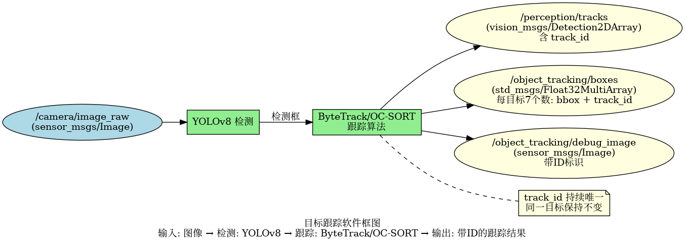
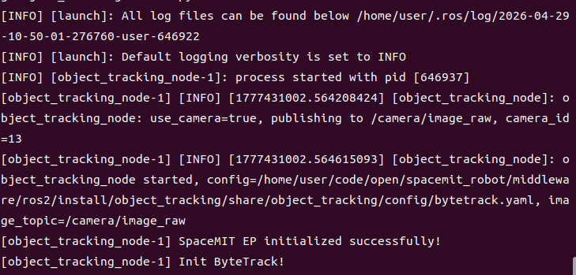
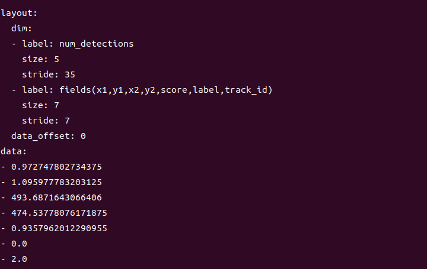

# 机器感知 · 目标跟踪

## 1. 模块概述

本模块提供基于 YOLOv8 检测 + ByteTrack/OC-SORT 跟踪算法的目标跟踪能力，可以对视频序列中的目标进行持续跟踪，为每个目标分配唯一 ID，适用于人流统计、轨迹分析、行为监控等场景。

### 功能特性

- **检测算法**：YOLOv8n
- **跟踪算法**：ByteTrack（默认）或 OC-SORT（可配置）
- **输入分辨率**：640×640
- **支持类别**：COCO 80 类
- **推理后端**：SpaceMIT EP（ONNX Runtime）
- **输出格式**：vision_msgs/Detection2DArray（含 track_id）、Float32MultiArray

### 软件框图



### 目录结构

```
object_tracking/
├── src/
│   └── object_tracking_node.cpp       # 主节点实现
├── config/
│   ├── object_tracking.yaml           # 节点配置
│   ├── bytetrack.yaml                 # ByteTrack 配置
│   └── ocsort.yaml                    # OC-SORT 配置
├── launch/
│   └── object_tracking.launch.py      # 启动文件
├── scripts/
│   ├── publish_video.py               # 视频发布工具
│   └── simple_image_viewer.py         # 图像查看工具
└── package.xml
```

## 2. 环境准备

### 前置条件

**运行环境**
- 操作系统：Ubuntu 20.04 或 22.04
- ROS 版本：ROS 2 Humble

**依赖资源**
- `output/staging`：提供检测/追踪所需运行库
- YOLOv8 模型文件：`~/.cache/models/vision/yolov8/yolov8n.q.onnx`
- ROS 2 依赖包：rclcpp、sensor_msgs、std_msgs、perception_common、vision_msgs
- Python 依赖（用于测试工具）：`pip install opencv-python-headless`

**硬件要求**
- 支持 USB 摄像头或网络摄像头

**环境初始化**
- 参照《02 快速入门》中的 ROS 2 环境配置

### 构建编译

**获取代码**
- 参照《02 快速入门 · 2.3 配置编译》获取完整代码

**编译步骤**
```bash
cd spacemit_robot
source build/envsetup.sh
cd components/model_zoo/vision
mm 
bash scripts/download_all_models.sh
bash scripts/download_assets.sh
cd ../../../
colcon build --packages-select object_tracking
source install/setup.bash
```

**编译产物**
- 可执行文件：`install/lib/object_tracking/object_tracking_node`

## 3. 快速上手

本节提供完整的操作步骤，帮助您快速跑通目标跟踪功能。

### 3.1 使用摄像头实时跟踪

**准备工作**
1. 确保摄像头已连接到设备
2. 确认模型文件已下载
3. 检查摄像头设备号：`ls /dev/video*`

**重要提示**：如果您的摄像头不是 `/dev/video0`，需要修改配置文件 `config/object_tracking.yaml` 中的 `camera_id` 参数。

**步骤 1：启动目标跟踪节点**
```bash
source install/setup.bash
ros2 launch object_tracking object_tracking.launch.py
```

**终端输出：**



**步骤 2：查看跟踪结果**

打开新终端，查看跟踪框数据（注意 track_id 字段）：
```bash
# 终端 2：查看跟踪框数据
ros2 topic echo /object_tracking/boxes
```

**终端输出：**



### 3.2 切换到 OC-SORT 跟踪器

ByteTrack 和 OC-SORT 各有优势，可以根据场景选择。

**步骤 1：修改配置文件**

编辑 `config/object_tracking.yaml`，设置：
```yaml
tracker_type: "ocsort"
```

**步骤 2：重新编译**

**重要提示**：切换跟踪算法后，必须重新编译 object_tracking 包才能生效。

```bash
cd middleware/ros2
colcon build --packages-select object_tracking
source install/setup.bash
```

**步骤 3：启动跟踪节点**
```bash
ros2 launch object_tracking object_tracking.launch.py
```

**终端输出：**

## 4. 应用开发

### 接口说明

**订阅话题**
- `/camera/image_raw` (sensor_msgs/Image) - 输入图像

**发布话题**
- `/perception/tracks` (vision_msgs/Detection2DArray) - 标准检测消息，含 track_id
- `/object_tracking/boxes` (std_msgs/Float32MultiArray) - 每目标 7 个数：x1, y1, x2, y2, score, label, **track_id**
- `/object_tracking/debug_image` (sensor_msgs/Image) - 带追踪框的可视化图像

### 跟踪算法对比

| 特性 | ByteTrack | OC-SORT |
| --- | --- | --- |
| 速度 | 快 | 中等 |
| 遮挡处理 | 一般 | 好 |
| 快速移动 | 好 | 一般 |
| ID 切换 | 较少 | 很少 |
| 重识别 | 不支持 | 支持 |
| 适用场景 | 快速移动、少遮挡 | 遮挡较多、需要重识别 |

### 使用方式

**参数配置**
- `tracker_type`：`"bytetrack"` 或 `"ocsort"`，选择跟踪算法
- `config_path`：留空则按 `tracker_type` 自动加载对应配置文件
- `score_threshold`：检测置信度阈值
- `use_camera`：true 时直连摄像头，false 时订阅外部图像话题

**命令行传参示例**
```bash
# 使用 OC-SORT，置信度阈值 0.3
ros2 launch object_tracking object_tracking.launch.py tracker_type:=ocsort score_threshold:=0.3
```

### 注意事项

1. **track_id 是持续的唯一标识**：同一目标在视频序列中保持不变
2. **跟踪效果受检测质量影响**：建议调整 score_threshold 以平衡召回率和精度
3. **ByteTrack 适合快速移动场景**，OC-SORT 适合遮挡较多场景
4. **视频测试更能体现跟踪效果**：建议使用视频文件测试

### 参考资料

- 配置文件：`install/share/object_tracking/config/`
- 启动文件：`install/share/object_tracking/launch/object_tracking.launch.py`
- 测试工具：`install/lib/object_tracking/publish_video`、`install/lib/object_tracking/simple_image_viewer`

## 5. 调试指南

### 日志调试

**查看节点日志**
```bash
# 启动节点后，日志会自动输出到终端
ros2 launch object_tracking object_tracking.launch.py
```

**提示**：如需调整日志级别，可以修改 launch 文件中的日志配置

### 常用调试命令

**检查话题状态**
```bash
# 查看所有相关话题
ros2 topic list | grep object_tracking

# 查看话题发布频率
ros2 topic hz /object_tracking/boxes

# 查看节点参数
ros2 param list /object_tracking_node
```

**动态调整参数**
```bash
# 动态修改置信度阈值
ros2 param set /object_tracking_node score_threshold 0.3
```

### 跟踪效果评估

**评估指标**：
- **MOTA**（Multiple Object Tracking Accuracy）：综合跟踪准确度
- **IDF1**：ID 保持准确度
- **ID Switch**：ID 切换次数（越少越好）

**评估方法**：
- 观察 track_id 是否稳定（同一目标 ID 不应频繁变化）
- 检查 ID 切换（ID switch）次数
- 统计跟踪丢失（lost tracks）情况

### 性能分析

**检查 CPU 占用**
```bash
top -p $(pgrep -f object_tracking_node)
```

**检查推理延迟**
- 在节点日志中查找 inference time 相关输出

## 6. 常见问题

| 问题现象 | 可能原因 | 解决方法 |
| --- | --- | --- |
| 节点启动失败，提示找不到模型文件 | 模型路径配置错误 | 检查 `~/.cache/models/vision/yolov8/yolov8n.q.onnx` 是否存在 |
| track_id 频繁变化 | 检测不稳定或跟踪参数不当 | 1. 提高检测置信度阈值<br>2. 调整跟踪器参数（如 track_thresh）<br>3. 尝试切换跟踪算法 |
| 目标丢失后重新出现 ID 改变 | 跟踪器未能重识别 | 1. 使用 OC-SORT（支持重识别）<br>2. 调整 track_buffer 参数 |
| 多个目标 ID 相同 | 跟踪器混淆 | 1. 提高检测精度<br>2. 调整 match_thresh 参数 |
| 无跟踪结果输出 | 输入图像无目标或检测失败 | 1. 检查 `/camera/image_raw` 是否有数据<br>2. 降低 score_threshold |
| 跟踪延迟高 | 图像分辨率过高或硬件性能不足 | 1. 降低输入分辨率<br>2. 调整 num_threads 参数 |

## 附录

### 应用场景

- **人流统计**：统计特定区域的人流量，分析人员进出
- **轨迹分析**：记录目标运动轨迹，分析行为模式
- **安防监控**：跟踪可疑目标，记录活动轨迹
- **交通监控**：跟踪车辆，统计交通流量
- **体育分析**：跟踪运动员，分析比赛数据
- **零售分析**：跟踪顾客，分析购物行为
