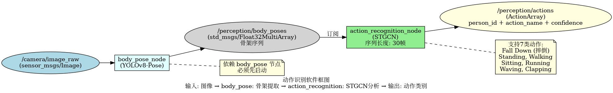
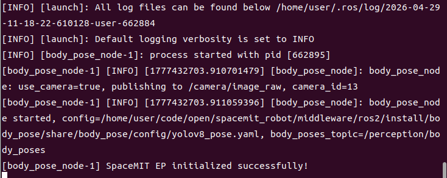
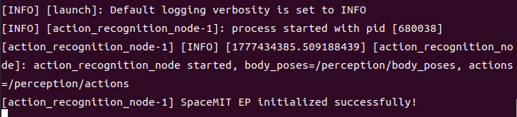
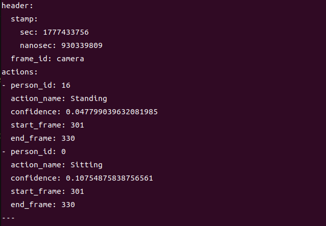

# 机器感知 · 动作识别

## 1. 模块概述

本模块提供基于 STGCN（时空图卷积网络）的动作识别能力，订阅人体骨架序列数据，识别 7 类动作（包括摔倒检测），适用于跌倒报警、行为分析、安全监控等场景。

### 功能特性

- **算法**：STGCN（Spatial Temporal Graph Convolutional Networks）
- **输入**：人体骨架序列（17 个关键点，COCO 格式）
- **序列长度**：30 帧（可配置）
- **支持动作类别**：7 类（含 Fall Down 摔倒动作）
- **推理后端**：SpaceMIT EP（ONNX Runtime）
- **输出格式**：自定义 ActionArray 消息

### 软件框图



### 目录结构

```
action_recognition/
├── src/
│   └── action_recognition_node.cpp    # 主节点实现
├── config/
│   ├── action_recognition.yaml        # 节点配置
│   └── stgcn.yaml                     # STGCN 模型配置
├── launch/
│   └── action_recognition.launch.py   # 启动文件
├── msg/
│   ├── Action.msg                     # 单个动作消息
│   └── ActionArray.msg                # 动作数组消息
└── package.xml
```

## 2. 环境准备

### 前置条件

**运行环境**
- 操作系统：Ubuntu 20.04 或 22.04
- ROS 版本：ROS 2 Humble

**依赖资源**
- **body_pose 节点**：必须先运行，提供 `/perception/body_poses` 话题
- `output/staging`：提供视觉推理库（`libvision.so` 与 `vision_service.h`）
- STGCN 模型文件：需在 `config/stgcn.yaml` 中配置 model_path
- ROS 2 依赖包：rclcpp、sensor_msgs、std_msgs、perception_common

**硬件要求**
- 依赖 body_pose 节点的摄像头配置

**环境初始化**
- 参照《02 快速入门》中的 ROS 2 环境配置

### 构建编译

**获取代码**
- 参照《02 快速入门 · 2.3 配置编译》获取完整代码

**编译步骤**
```bash
cd spacemit_robot
source build/envsetup.sh
cd components/model_zoo/vision
mm 
bash scripts/download_all_models.sh
bash scripts/download_assets.sh
cd ../../../
colcon build --packages-select action_recognition
source install/setup.bash
```

**编译产物**
- 可执行文件：`install/lib/action_recognition/action_recognition_node`

## 3. 快速上手

本节提供完整的操作步骤，帮助您快速跑通动作识别功能。

### 3.1 完整动作识别流程

动作识别需要先运行 body_pose 节点获取骨架数据。

**准备工作**
1. 确保摄像头已连接
2. 确认 body_pose 和 action_recognition 模型文件已准备

**重要提示**：本模块摄像头输入来自 `body_pose`；若使用摄像头模式，请先在 `body_pose` 的 `config/body_pose.yaml` 中将 `camera_id` 改为实际摄像头编号。

**步骤 1：启动人体姿态节点**
```bash
# 终端 1
source install/setup.bash
ros2 launch body_pose body_pose.launch.py
```

**终端输出：**



**步骤 2：启动动作识别节点**

打开新终端：
```bash
# 终端 2
source install/setup.bash
ros2 launch action_recognition action_recognition.launch.py
```

**终端输出：**



**步骤 3：查看动作识别结果**

打开新终端：
```bash
# 终端 3：查看动作识别结果
ros2 topic echo /perception/actions
```

**重要提示**：
- 动作识别需要累积 **30 帧骨架数据**才能开始推理
- 启动后前 1-2 秒会看到 `actions: []`（空数组），这是正常现象
- 等待约 1-2 秒后，当累积满 30 帧且到达推理间隔时，才会输出识别结果
- 推理间隔默认为每 10 帧推理一次，可在配置文件中调整 `infer_interval` 参数

**终端输出：**




## 4. 应用开发

### 接口说明

**订阅话题**
- `/perception/body_poses` (std_msgs/Float32MultiArray) - 来自 body_pose 节点的骨架数据

**发布话题**
- `/perception/actions` (action_recognition/msg/ActionArray) - 动作识别结果

**ActionArray 消息结构**：
```
std_msgs/Header header
Action[] actions
```

**Action 消息结构**：
```
int32 person_id          # 人员 ID
string action_name       # 动作名称（如 "Fall Down"）
float32 confidence       # 置信度
int32 start_frame        # 动作起始帧
int32 end_frame          # 动作结束帧
```

### 使用方式

**参数配置**
- `sequence_length`：序列长度，默认 30 帧
- `inference_interval`：推理间隔，默认每 15 帧推理一次
- `model_path`：STGCN 模型路径

**命令行传参示例**
```bash
# 调整序列长度为 20 帧
ros2 launch action_recognition action_recognition.launch.py sequence_length:=20
```

### 注意事项

1. **必须先启动 body_pose 节点**，否则无骨架输入
2. **识别延迟 = 序列长度 / 帧率**（如 30 帧 / 30fps = 1 秒）
3. **动作类别取决于 STGCN 模型训练数据**
4. **序列长度影响识别精度和延迟**：序列越长，精度越高但延迟越大

### 支持的动作类别

STGCN 模型支持以下 7 类动作：
- **Standing**：站立
- **Walking**：行走
- **Sitting**：坐着
- **Lying Down**：躺下
- **Stand up**：站起
- **Sit down**：坐下
- **Fall Down**：摔倒（重点检测）

### 参考资料

- 配置文件：`install/share/action_recognition/config/action_recognition.yaml`
- 模型配置：`install/share/action_recognition/config/stgcn.yaml`
- 启动文件：`install/share/action_recognition/launch/action_recognition.launch.py`
- 消息定义：`install/share/action_recognition/msg/`

## 5. 调试指南

### 日志调试

**查看节点日志**
```bash
# 启动节点后，日志会自动输出到终端
ros2 launch action_recognition action_recognition.launch.py
```

**提示**：如需调整日志级别，可以修改 launch 文件中的日志配置

### 常用调试命令

**检查话题状态**
```bash
# 查看所有相关话题
ros2 topic list | grep action

# 查看话题发布频率
ros2 topic hz /perception/actions

# 查看节点参数
ros2 param list /action_recognition_node
```

**检查依赖节点**
```bash
# 确认 body_pose 节点是否运行
ros2 node list | grep body_pose

# 确认骨架数据是否发布
ros2 topic hz /perception/body_poses
```

### 日志解读

**正常日志**：
- `body_poses: N poses, frame=..., buffers=...` - 收到骨架数据，显示当前缓存的帧数
- `STGCN: person_id=... action=...` - 推理成功时会打印

**异常情况**：
- 从未出现 `body_poses` 日志：未收到骨架数据，检查 body_pose 节点
- 出现 `body_poses` 但无 `STGCN`：未攒满序列或推理失败

### 性能分析

**检查 CPU 占用**
```bash
top -p $(pgrep -f action_recognition_node)
```

**检查推理延迟**
- 在节点日志中查找 inference time 相关输出

## 6. 常见问题

| 问题现象 | 可能原因 | 解决方法 |
| --- | --- | --- |
| 节点启动失败，提示找不到模型文件 | STGCN 模型路径配置错误 | 检查 `config/stgcn.yaml` 中的 model_path |
| 无动作识别输出（一直显示 `actions: []`） | 1. body_poses 无数据<br>2. 未攒满 30 帧序列<br>3. 未到推理间隔 | 1. 确认 body_pose 节点正常运行<br>2. 确认场景中有人<br>3. 等待至少 30 帧（约 1 秒）<br>4. 确认帧数达到推理间隔倍数（默认每 10 帧） |
| 日志无 body_poses 输出 | 未收到骨架数据 | 1. 检查 body_pose 是否运行<br>2. 确认话题名称是否为 `/perception/body_poses` |
| 动作识别错误 | 模型训练数据不足或动作不标准 | 1. 使用标准动作<br>2. 确保人体完整可见<br>3. 重新训练模型 |
| 识别延迟高 | 序列长度过长 | 减少 sequence_length 参数（但可能影响精度） |
| 摔倒检测不准确 | 姿态估计不准或模型精度问题 | 1. 改善光照和拍摄角度<br>2. 提高 body_pose 的置信度阈值<br>3. 使用更大的 STGCN 模型 |

## 附录

### 应用场景

- **跌倒检测**：实时检测老人或病人跌倒，及时报警
- **行为分析**：分析人员行为模式，用于安防监控
- **健身指导**：识别运动动作，提供健身指导
- **康复训练**：监测康复训练动作是否标准
- **人机交互**：通过动作控制机器人或设备
- **体育分析**：分析运动员动作，提供训练建议

### 摔倒检测说明

摔倒检测是本模块的重点功能，可用于老人看护、安全监控等场景。

**检测原理**：
- 通过分析人体骨架序列的时空特征
- 识别摔倒动作的特征模式（如快速下降、姿态突变等）

**使用建议**：
1. 确保摄像头视野覆盖可能摔倒的区域
2. 保持良好的光照条件
3. 避免遮挡，确保人体完整可见
4. 可以调整置信度阈值以平衡误报和漏报
