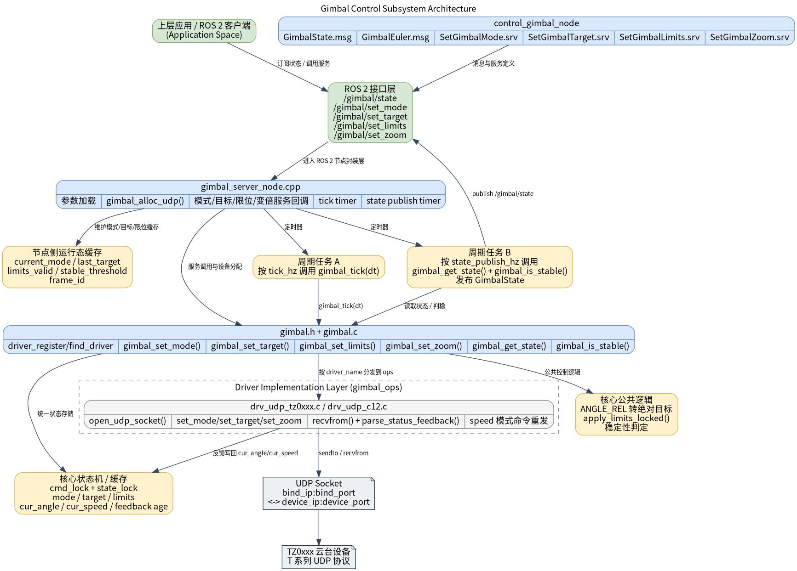

# 运动控制 · 云台控制

## 1. 模块概述

- 主要功能：`control_gimbal_node` 是面向 ROS 2 的云台控制节点，负责把上层应用的姿态控制、变倍控制和限位配置请求转换为底层云台驱动调用，并周期性发布云台状态。当前实现位于 `middleware/ros2/control/gimbal/`，底层依赖 `components/control/gimbal/` 提供的统一 C API，默认通过 `drv_udp_tz0xxx` UDP 驱动与云台设备通信。
- 规格或特性：对外接口为 ROS 2 话题 `/gimbal/state` 和服务 `/gimbal/set_mode`、`/gimbal/set_target`、`/gimbal/set_limits`、`/gimbal/set_zoom`；节点名固定为 `gimbal_server_node`；ROS 2 消息和服务定义由 `control_gimbal_node` 包直接提供；支持 `MODE_OFF`、`MODE_ANGLE_ABS`、`MODE_ANGLE_REL`、`MODE_SPEED`、`MODE_FOLLOW`、`MODE_FPV`、`MODE_LOCK`、`MODE_CALIBRATE` 八种模式；默认驱动为 `drv_udp_tz0xxx`，同时支持 `drv_udp_c12`；默认网络参数为本地 `0.0.0.0:4900`、设备端 `192.168.44.160:4900`；默认运行参数包括 `tick_hz=50.0`、`state_publish_hz=20.0`、`resend_period_s=0.02`、`stable_threshold_deg=1.5`。构建时优先链接系统中已安装的 `libgimbal.so`，若未安装则回退为编译仓库内 `components/control/gimbal` 源码。
- 软件框图：



- 相关目录结构：

| 路径 | 职责 |
| --- | --- |
| `middleware/ros2/control/gimbal/src/gimbal_server_node.cpp` | ROS 2 云台节点主实现，负责参数加载、服务回调、状态发布和底层驱动 tick |
| `middleware/ros2/control/gimbal/CMakeLists.txt` | `control_gimbal_node` 包构建文件，生成 ROS 2 消息/服务并生成可执行文件 `gimbal_server_node` |
| `middleware/ros2/control/gimbal/package.xml` | ROS 2 包元数据和依赖声明 |
| `middleware/ros2/control/gimbal/msg/GimbalEuler.msg` | 云台欧拉角消息定义 |
| `middleware/ros2/control/gimbal/msg/GimbalState.msg` | 云台状态消息定义 |
| `middleware/ros2/control/gimbal/srv/SetGimbalMode.srv` | 云台模式切换服务定义 |
| `middleware/ros2/control/gimbal/srv/SetGimbalTarget.srv` | 云台目标姿态或角速度设置服务定义 |
| `middleware/ros2/control/gimbal/srv/SetGimbalLimits.srv` | 云台软限位与最大角速度服务定义 |
| `middleware/ros2/control/gimbal/srv/SetGimbalZoom.srv` | 云台变倍服务定义 |
| `components/control/gimbal/include/gimbal.h` | 底层云台统一 C API 头文件 |
| `components/control/gimbal/src/drivers/drv_udp_tz0xxx.c` | 默认 TZ0xxx UDP 云台驱动实现 |
| `components/control/gimbal/src/drivers/drv_udp_c12.c` | C12 UDP 云台驱动实现 |
| `components/control/gimbal/test/test_gimbal_udp.c` | 底层 UDP 联调示例程序 |

## 2. 环境准备

### 前置条件

- 运行环境：推荐板端环境 `k3-com260` 配套系统镜像；板端需已安装 ROS 2 humble，运行前可正常执行 `source /opt/ros/humble/setup.bash`。
- 硬件与连接：默认示例使用天进 `TZ0xxx` 云台，设备地址为 `192.168.44.160:4900`；C12 云台示例使用设备地址 `192.168.144.108:5000`。确保设备已上电，并通过网线连接到开发板或同一网段交换机。
- 工具与权限：运行用户需要具备网络访问权限；排查问题时建议准备 `ping`、`ss`、`tcpdump` 等工具。若需要抓包，可使用 `sudo tcpdump -ni any udp port 4900` 或 `sudo tcpdump -ni any udp port 5000`。

### 构建编译

- **获取代码**：详见 [2.3-配置编译](../../02-%E5%BF%AB%E9%80%9F%E5%85%A5%E9%97%A8/2.3-%E9%85%8D%E7%BD%AE%E7%BC%96%E8%AF%91.md#21-代码获取) 章节，使用 `repo` 工具克隆完整 SDK。以下编译命令在 SDK 根目录执行，推荐使用 `build.sh package` 统一安装到 `output/staging`。

```bash
source build/envsetup.sh
./build/build.sh package components/control/gimbal
./build/build.sh package middleware/ros2/control/gimbal
```

预期产物包括：`output/staging/lib/control_gimbal_node/gimbal_server_node`、`output/staging/share/control_gimbal_node/package.sh`、`output/staging/share/control_gimbal_node/cmake/control_gimbal_nodeConfig.cmake`。若当前目标不是默认 staging 路径，请以实际 `output/<target>/staging` 为准。

- 常见差异说明：`control_gimbal_node` 没有提供 launch 文件，默认通过 `ros2 run` 直接启动；当前消息和服务类型属于 `control_gimbal_node` 包，接口定义由本包直接安装；如果系统中已经安装了 `libgimbal.so` 和 `gimbal.h`，节点会优先链接系统库；如果系统中没有安装底层库，`CMakeLists.txt` 会自动回退为编译仓库里的 `components/control/gimbal` 源码，并包含 `drv_udp_tz0xxx` 和 `drv_udp_c12` 两个驱动。若已执行 `source build/envsetup.sh`，也可以分别进入 `components/control/gimbal` 和 `middleware/ros2/control/gimbal` 目录执行 `mm` 做单包构建；不同环境下 `mm` 的安装前缀可能受当前目标方案、`PREFIX` 或 `STAGING_PREFIX` 影响，产物路径请以构建日志和实际 `output/<target>/staging` 目录为准。

## 3. 示例使用（从 0 跑通）

本节为读者**按步骤复现**的主线：

### 3.1 【示例一：启动默认 TZ0xxx 云台节点并观察状态】

**前置**：目标板与云台设备网络可达；设备 IP、端口与本机网段配置正确；当前用户可执行 ROS 2 命令并访问 UDP 端口。

**步骤 1**：确认云台设备在线。

```bash
ping -c 3 192.168.44.160
```

预期现象：能收到来自云台设备的 ICMP 响应；若无法连通，请先检查云台供电、网线、交换机和本机 IP 配置。

**步骤 2**：加载运行环境并启动云台控制节点。

```bash
source /opt/ros/humble/setup.bash
source output/staging/setup.bash

ros2 run control_gimbal_node gimbal_server_node \
  --ros-args \
  -p bind_ip:=0.0.0.0 \
  -p bind_port:=4900 \
  -p device_ip:=192.168.44.160 \
  -p device_port:=4900
```

预期现象：终端打印节点启动成功日志，类似 `gimbal_server_node ready: driver=drv_udp_tz0xxx local=0.0.0.0:4900 remote=192.168.44.160:4900`；若启动失败，终端通常会输出 `gimbal_alloc_udp failed`、`gimbal_set_limits failed` 或参数异常信息。

**步骤 3**：在另一个终端查看话题、服务和状态输出。

```bash
source /opt/ros/humble/setup.bash
source output/staging/setup.bash

ros2 topic list | grep gimbal
ros2 service list | grep gimbal
ros2 topic echo /gimbal/state
```

预期现象：
- 能看到 `/gimbal/state`、`/gimbal/set_mode`、`/gimbal/set_target`、`/gimbal/set_limits`、`/gimbal/set_zoom` 等接口。
- `/gimbal/state` 会持续输出状态消息。
- 若设备已经正常反馈，消息中的 `has_feedback` 应为 `true`，`status_code` 应为 `0`。

### 3.2 【示例二：通过 ROS 2 服务控制云台】

**前置**：`gimbal_server_node` 已正常运行。

**步骤 1**：切换为绝对角模式。

```bash
source /opt/ros/humble/setup.bash
source output/staging/setup.bash

ros2 service call /gimbal/set_mode control_gimbal_node/srv/SetGimbalMode "{mode: 1}"
```

预期现象：服务返回 `success: true`、`status_code: 0`，云台进入绝对角控制模式。

**步骤 2**：发送绝对角目标。

```bash
ros2 service call /gimbal/set_target control_gimbal_node/srv/SetGimbalTarget \
  "{target: {pitch: 10.0, yaw: 0.0, roll: 0.0}}"
```

预期现象：云台向目标姿态运动；`/gimbal/state` 中的 `has_target` 变为 `true`，`/gimbal/state.target` 更新为最近一次目标值。

**步骤 3**：设置软限位和最大角速度。

```bash
ros2 service call /gimbal/set_limits control_gimbal_node/srv/SetGimbalLimits "{
  min_angle: {pitch: -30.0, yaw: -90.0, roll: -10.0},
  max_angle: {pitch: 30.0, yaw: 90.0, roll: 10.0},
  max_speed: {pitch: 20.0, yaw: 20.0, roll: 20.0}
}"
```

预期现象：服务返回 `success: true`，节点内部会缓存新的限位配置，并继续下发给底层库。

**步骤 4**：控制可见光变倍。

```bash
ros2 service call /gimbal/set_zoom control_gimbal_node/srv/SetGimbalZoom \
  "{direction: 1, speed_level: 2}"
```

预期现象：若设备支持，镜头开始放大。停止变倍时，可执行：

```bash
ros2 service call /gimbal/set_zoom control_gimbal_node/srv/SetGimbalZoom \
  "{direction: 0, speed_level: 0}"
```

**步骤 5**：切换到速度模式并发送角速度指令。

```bash
ros2 service call /gimbal/set_mode control_gimbal_node/srv/SetGimbalMode "{mode: 3}"

ros2 service call /gimbal/set_target control_gimbal_node/srv/SetGimbalTarget \
  "{target: {pitch: 0.0, yaw: 12.0, roll: 0.0}}"
```

预期现象：云台按设定角速度运动；`/gimbal/state.mode` 变为 `3`，`/gimbal/state.speed` 会随反馈变化。

停止速度控制时，建议显式发送零速目标：

```bash
ros2 service call /gimbal/set_target control_gimbal_node/srv/SetGimbalTarget \
  "{target: {pitch: 0.0, yaw: 0.0, roll: 0.0}}"
```

### 3.3 【示例三：启动 C12 云台节点】

**前置**：C12 云台已上电，设备与目标板处于同一网络。C12 示例默认使用设备地址 `192.168.144.108:5000`，本地建议绑定 `5000` 端口。

**步骤 1**：配置主机网口并确认设备在线。网口名请按实际连接替换。

```bash
ifconfig eth0 192.168.144.100 netmask 255.255.255.0 up
route add -net 192.168.144.0 netmask 255.255.255.0 dev eth0
ping -c 3 192.168.144.108
```

**步骤 2**：启动 C12 驱动节点。

```bash
source /opt/ros/humble/setup.bash
source output/staging/setup.bash

ros2 run control_gimbal_node gimbal_server_node \
  --ros-args \
  -p driver_name:=drv_udp_c12 \
  -p bind_ip:=0.0.0.0 \
  -p bind_port:=5000 \
  -p device_ip:=192.168.144.108 \
  -p device_port:=5000
```

预期现象：终端 ready 日志包含 `driver=drv_udp_c12 local=0.0.0.0:5000 remote=192.168.144.108:5000`。

**步骤 3**：在一个终端持续查看状态。

```bash
ros2 topic echo /gimbal/state
```

**步骤 4**：在另一个终端发送小角度控制命令。

```bash
source /opt/ros/humble/setup.bash
source output/staging/setup.bash

ros2 service call /gimbal/set_mode control_gimbal_node/srv/SetGimbalMode "{mode: 1}"
ros2 service call /gimbal/set_target control_gimbal_node/srv/SetGimbalTarget \
  "{target: {pitch: -10.0, yaw: 10.0, roll: 0.0}}"
```

预期现象：`/gimbal/state` 持续发布，收到反馈后 `has_feedback: true`、`status_code: 0`；服务调用返回 `success: true`；实体云台的 yaw/pitch 动作与命令方向一致。

C12 当前能力说明：
- C12 控制下发以 yaw/pitch 为主，roll 轴当前主要用于反馈解析。
- `/gimbal/set_zoom` 在 C12 上映射为 DZM 数码变焦步进命令；`ZOOM_STOP` 不发送连续停止帧。
- `speed_level` 对 C12 数码变焦暂不生效。

## 4. 应用开发

- **对外 API 或接口形态**：上层应用主要通过 ROS 2 话题 `/gimbal/state` 和服务 `/gimbal/set_mode`、`/gimbal/set_target`、`/gimbal/set_limits`、`/gimbal/set_zoom` 与节点交互。消息类型为 `control_gimbal_node/msg/GimbalState`，服务类型分别为 `control_gimbal_node/srv/SetGimbalMode`、`control_gimbal_node/srv/SetGimbalTarget`、`control_gimbal_node/srv/SetGimbalLimits`、`control_gimbal_node/srv/SetGimbalZoom`。所有服务的响应结构一致，均包含 `success`、`status_code` 和 `message`。
- **调用方式与注意点**（线程、权限、资源释放等）：
  - 节点启动时常用参数包括 `driver_name`、`bind_ip`、`bind_port`、`device_ip`、`device_port`、`resend_period_s`、`tick_hz`、`state_publish_hz`、`stable_threshold_deg`、`frame_id`、`use_limits`、`min_angle_deg`、`max_angle_deg`、`max_speed_deg_s`。其中 `driver_name` 默认值为 `drv_udp_tz0xxx`，可选 `drv_udp_tz0xxx` 或 `drv_udp_c12`；`min_angle_deg`、`max_angle_deg`、`max_speed_deg_s` 支持长度为 `1` 或 `3` 的数组；若长度既不是 `1` 也不是 `3`，节点启动时会报参数长度错误。
  - 默认参数如下：`bind_ip=0.0.0.0`、`bind_port=4900`、`device_ip=192.168.44.160`、`device_port=4900`、`resend_period_s=0.02`、`tick_hz=50.0`、`state_publish_hz=20.0`、`stable_threshold_deg=1.5`、`frame_id=base_link`、`use_limits=false`、`min_angle_deg=[-120,-179,-180]`、`max_angle_deg=[90,179,180]`、`max_speed_deg_s=[50,50,50]`。
  - `control_gimbal_node/msg/GimbalState` 主要字段包括 `header`、`mode`、`has_feedback`、`has_target`、`stable`、`status_code`、`angle`、`speed` 和 `target`。默认单位采用角度制；在 `MODE_SPEED` 下，`target` 和 `speed` 表示角速度，单位为度每秒。
  - `/gimbal/set_mode` 支持 `0=MODE_OFF`、`1=MODE_ANGLE_ABS`、`2=MODE_ANGLE_REL`、`3=MODE_SPEED`、`4=MODE_FOLLOW`、`5=MODE_FPV`、`6=MODE_LOCK`、`7=MODE_CALIBRATE`；`/gimbal/set_zoom` 支持 `0=ZOOM_STOP`、`1=ZOOM_IN`、`2=ZOOM_OUT`。
  - 节点内部依赖定时器周期调用 `gimbal_tick()`；如果只复用底层库而不走该节点，上层需要自行保证周期驱动。`MODE_SPEED` 下发送的是角速度，不会自动停下；停止时应再次发送零速目标，或切换到其他模式。`MODE_ANGLE_REL` 下，节点会在服务调用成功后缓存“相对位移作用后的目标值”；如果当时无法读取当前反馈，缓存的 `target` 会退化为请求值本身。限位真正由底层 `gimbal` 组件负责生效，ROS 2 节点会在本地保存一份限位配置，用于后续状态和目标缓存处理。
- **参考 demo 或示例路径**：`middleware/ros2/control/gimbal/src/gimbal_server_node.cpp`、`components/control/gimbal/test/test_gimbal_udp.c`、`components/control/gimbal/include/gimbal.h`。

## 5. 调试指南

- 先确认网络和节点状态：

```bash
ros2 node list | grep gimbal
ros2 topic hz /gimbal/state
ros2 topic echo /gimbal/state
ros2 service list | grep gimbal
ss -anu | grep 4900
ping 192.168.44.160
```

- C12 调试时，端口和设备地址通常改为 `5000` 与 `192.168.144.108`：

```bash
ss -anu | grep 5000
ping 192.168.144.108
```

- 若需要确认 UDP 报文是否发出或收到，可进一步抓包：

```bash
sudo tcpdump -ni any udp port 4900
sudo tcpdump -ni any udp port 5000
```

- 建议先使用底层组件示例程序验证驱动，再验证 ROS 2 封装。示例：

```bash
cd components/control/gimbal
mkdir -p build
cd build
cmake ..
make -j

./test_gimbal_udp --driver drv_udp_tz0xxx --ip 192.168.44.160 --port 4900 --bind-port 4900
./test_gimbal_udp --driver drv_udp_c12 --ip 192.168.144.108 --port 5000 --bind-port 5000
```

- 常见 `status_code` 含义：`0=GIMBAL_OK`、`-1=GIMBAL_ERR_ALLOC`、`-2=GIMBAL_ERR_CONNECT`、`-3=GIMBAL_ERR_TIMEOUT`、`-4=GIMBAL_ERR_CONFIG`、`-5=GIMBAL_ERR_PARAM`、`-6=GIMBAL_ERR_NOSYS`。
- 与硬件或驱动同事联调时，建议提供：节点启动命令和全部 ROS 参数、`gimbal_server_node ready` 启动日志、`/gimbal/state` 连续输出、`ros2 service call` 返回结果、本机 IP 与云台设备 IP、`ping`/`ss`/`tcpdump` 输出、云台型号和固件版本。

## 6. 常见问题

### 6.1 找不到 `control_gimbal_node`

报错示例：

```text
Could not find a package configuration file provided by "control_gimbal_node"
```

处理方法：确认已构建 `middleware/ros2/control/gimbal`，并在运行前执行：

```bash
source /opt/ros/humble/setup.bash
source output/staging/setup.bash
```

### 6.2 缺少 `package.sh`

报错示例：

```text
Failed to find the following files:
.../share/control_gimbal_node/package.sh
```

处理方法：不要只在 `middleware/ros2/control/gimbal` 目录里单独裸跑 `colcon build`；推荐使用 SDK 根目录下的 `./build/build.sh package middleware/ros2/control/gimbal`，确保安装前缀统一为 `output/staging`。

### 6.3 驱动找不到

报错示例：

```text
[GIMBAL] Driver not found: drv_udp_tz0xxx
[GIMBAL] No driver found: drv_udp_c12
```

处理方法：重新编译 `control_gimbal_node`；若系统已安装 `libgimbal.so`，检查该库是否确实包含正在使用的驱动名。当前源码回退构建会包含 `drv_udp_tz0xxx` 和 `drv_udp_c12`。

### 6.4 节点启动了，但没有反馈

可能原因包括：`device_ip` 或 `device_port` 配置错误、本机绑定 IP/端口不对、云台设备未上电或网络不通、底层协议不匹配。建议先确认网络连通，再抓包确认 UDP 报文是否往返。

```bash
ping 192.168.44.160
sudo tcpdump -ni any udp port 4900
```

C12 设备请改用：

```bash
ping 192.168.144.108
sudo tcpdump -ni any udp port 5000
```

### 6.5 C12 控制命令返回成功，但状态一直没有反馈

可能原因包括：C12 设备地址不是 `192.168.144.108:5000`、本机没有配置到 `192.168.144.0/24` 网段、ROS 节点或底层测试程序没有绑定本地 `5000` 端口、设备没有接受姿态主动输出使能命令、UDP 5000 被防火墙拦截。

建议先用底层示例排查：

```bash
./test_gimbal_udp --driver drv_udp_c12 --ip 192.168.144.108 --port 5000 --bind-port 5000
```

如果底层示例也一直输出 `waiting feedback...`，优先排查网络和设备配置；如果底层示例有 `[RX-STATE]`，但 ROS 2 中 `has_feedback` 仍为 `false`，再检查 ROS 节点启动参数是否仍在使用默认的 `drv_udp_tz0xxx` 或 `4900` 端口。

### 6.6 C12 变焦或 roll 轴控制不符合预期

C12 驱动当前将缩放接口映射为 DZM 数码变焦步进命令，不是连续光学变焦控制。`ZOOM_IN` 和 `ZOOM_OUT` 会分别发送一步数码变焦命令，`ZOOM_STOP` 直接返回成功但不发送帧。

C12 当前主要支持 yaw/pitch 控制下发，roll 轴主要用于反馈解析。如果需要验证动作，建议先使用 pitch/yaw 小角度命令，例如：

```bash
ros2 service call /gimbal/set_mode control_gimbal_node/srv/SetGimbalMode "{mode: 1}"
ros2 service call /gimbal/set_target control_gimbal_node/srv/SetGimbalTarget \
  "{target: {pitch: -10.0, yaw: 10.0, roll: 0.0}}"
```
