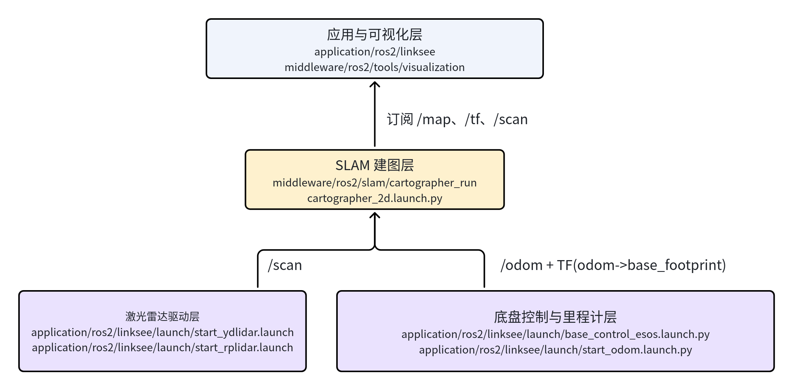
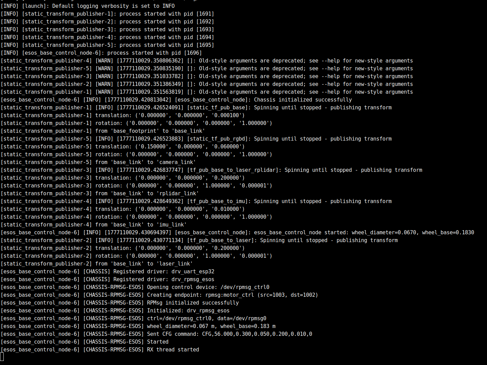
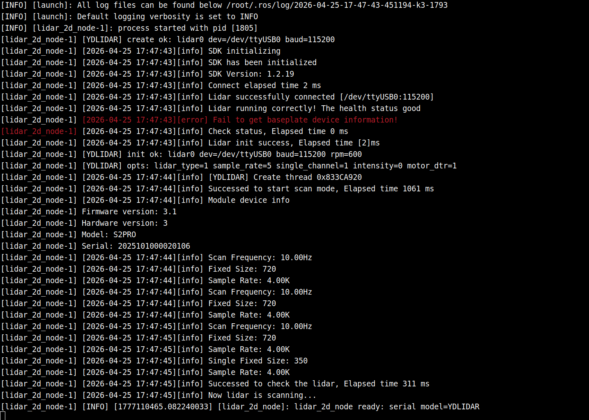
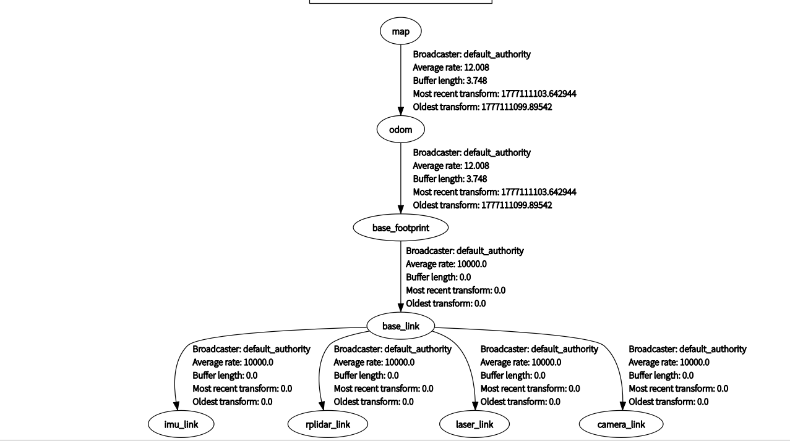
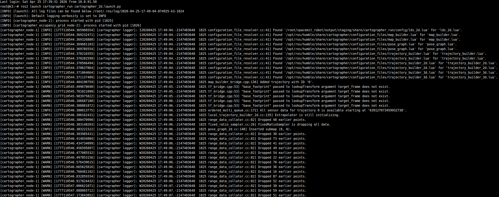
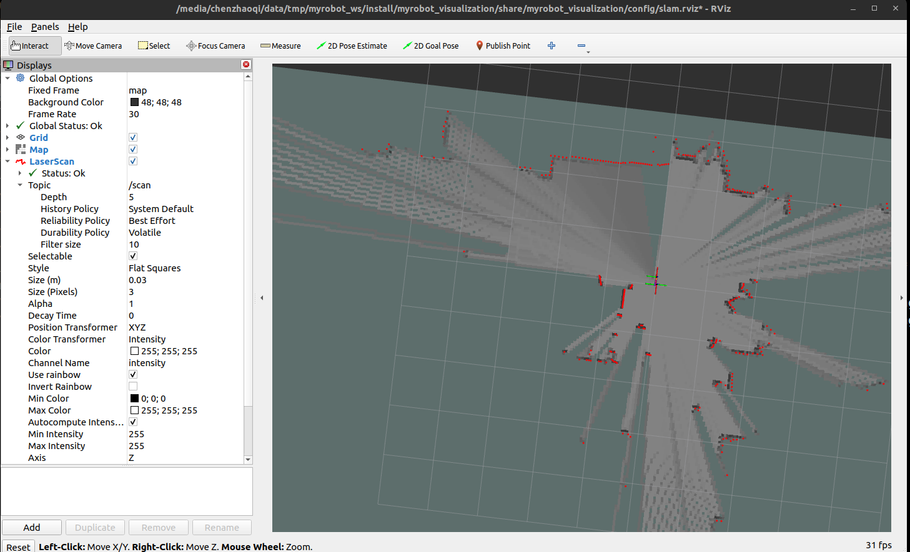
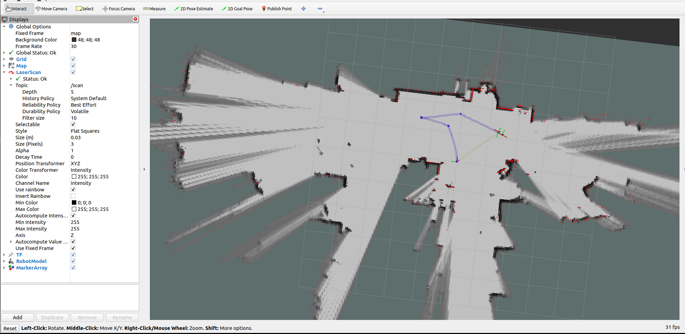
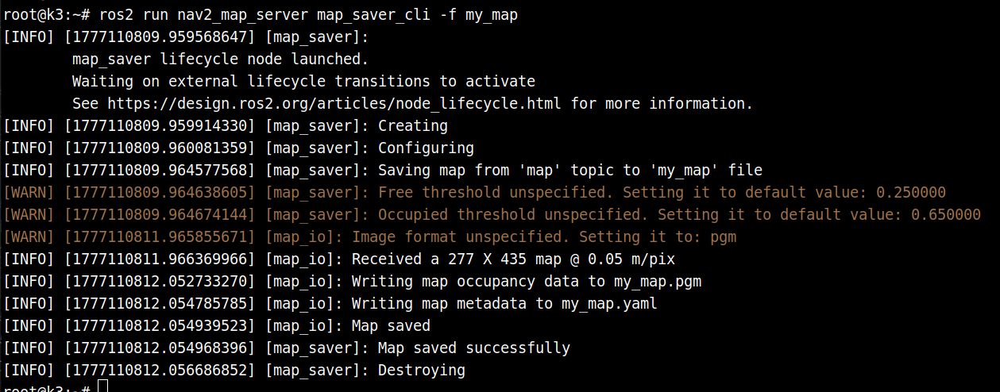

# 定位导航 · cartographer

## 1. 模块概述

- **主要功能**：`cartographer` 模块基于 Google Cartographer 与 ROS 2 `cartographer_ros` 组件封装，提供面向 `linksee` 移动机器人方案的 **2D 激光 SLAM 建图与定位基础能力**。在当前项目中，它位于 `middleware/ros2/slam/cartographer_run`，主要负责接收激光雷达 `/scan`、里程计 `/odom` 及相关 TF，实时生成 `/map` 栅格地图与子图信息，作为整机建图与后续导航的基础模块。
- **规格或特性**：
	- 算法形态：2D 激光 SLAM；
	- 运行方式：ROS 2 Launch 启动；
	- 输入话题：`/scan`、`/odom`；
	- 输出话题：`/map`、`/submap_list`；
	- 默认地图分辨率：`0.05 m/cell`；
	- 默认地图发布周期：`1.0 s`；
	- 默认配置文件：`config/lds_2d.lua`；
	- 支持参数化切换仿真时间：`use_sim_time`。
- **软件框图**：



- **相关目录结构**：

| 路径 | 职责 |
| --- | --- |
| `middleware/ros2/slam/cartographer_run/launch/cartographer_2d.launch.py` | `cartographer` 2D 建图启动入口 |
| `middleware/ros2/slam/cartographer_run/config/lds_2d.lua` | cartographer 2D 建图参数配置 |
| `middleware/ros2/slam/cartographer_run/README_en.md` | 模块英文说明、参数与话题说明 |
| `application/ros2/linksee/launch/base_control_esos.launch.py` | `linksee` 底盘控制与里程计发布 |
| `application/ros2/linksee/launch/start_ydlidar.launch.py` | `linksee` 方案激光雷达启动入口 |
| `middleware/ros2/tools/visualization/launch/display_slam.launch.py` | rviz 建图可视化启动入口 |

## 2. 环境准备

### 2.1 前置条件

SDK 源码获取和基础编译环境配置统一参考 [Linksee参考方案](../../03-参考方案/3.2-移动机器人Linksee.md)。完成 SDK 初始化后，回到本文继续执行

- **运行环境**：
	- K3 Com260 + Bianbu26 LXQT；
	- ROS 版本：ROS 2 Humble；
- **依赖与外部资源**：
	- 系统需安装 `cartographer_ros` 及相关 ROS 2 依赖；

- **环境变量与初始化**：

```bash
source ~/spacemit_robot/output/staging/setup.bash
```

- **硬件与连接**：
	- 板型：`k3-com260` 对应 `linksee` 机器人方案；
	- 传感器：已接入 2D 激光雷达，能够稳定发布 `/scan`；
	- 底盘：能够提供 `/odom` 或由 `linksee` 底盘控制链路发布里程计；
	- 推荐上电顺序：底盘、电机驱动、雷达、主控板依次确认供电正常；
	- 调试时建议保持底盘离地或预留安全空间，避免建图过程中误运动。
- **工具与权限**：
	- 若通过串口接底盘或雷达，需具备串口设备访问权限；
	- 常见设备节点包括 `/dev/ttyACM0`、`/dev/ttyUSB0`；
	- 必要时将用户加入 `dialout` 组，重新登录生效；
	- 保存地图时需具备当前目录写权限。

### 2.2 构建编译

- **本模块编译**：

```bash
cd ~/spacemit_robot/
source build/envsetup.sh
lunch # 选择k3-com260-linksee
m
```

- **产物说明**：
	- SDK 方式的安装产物通常位于 `/path/to/spacemit_robot/output/staging/`；
	- ROS 2 单独构建产物位于 `install/cartographer_run/`；
	- 该模块本身为 Launch/配置封装包，主要产物为启动文件、配置文件和 Python 安装结果。
- **常见差异说明**：
	- `cartographer_run` 仅封装启动逻辑，实际运行依赖系统中已安装的 `cartographer_ros`；
	- 若整机运行在 `linksee` 方案中，通常不单独验证此模块，而是结合底盘、雷达与 RViz 一起联调；
	- 若只做算法包验证，至少要保证 `/scan`、`/odom` 和 TF 链路完整。

## 3. 示例使用

本节给出结合当前项目的推荐复现路径。若使用 `linksee` 实机，建议按“底盘 → 雷达 → 建图 → 可视化/保存地图”的顺序逐步验证。

**前置**：默认已完成整机环境搭建，机器人底盘和 2D 激光雷达已正确接线，上电正常。

**步骤 1：加载运行环境**

在板端终端执行：

```bash
source ~/spacemit_robot/output/staging/setup.bash
```

**预期现象**：终端无报错返回，`ros2 pkg list | grep cartographer_run` 可找到对应包。

**步骤 2：启动底盘控制**

```bash
ros2 launch linksee base_control_esos.launch.py
```

**预期现象**：底盘控制节点正常启动，终端无串口打开失败等错误。

终端输出：



**注意：**底盘里程计会受轮子打滑等因素影响，因此默认不会开启底盘提供的里程计

**步骤 3：启动激光雷达**

若当前 `linksee` 实机使用 YDLIDAR，可在新终端中执行：

```bash
ros2 launch linksee start_ydlidar.launch.py
```

**预期现象**：可看到雷达驱动启动日志，`/scan` 话题持续发布，激光数据刷新正常。

终端输出：



**步骤 4：启动 Cartographer 建图**

再开新终端执行：

```bash
ros2 launch cartographer_run cartographer_2d.launch.py
```

**预期现象**：`cartographer_node` 与 `cartographer_occupancy_grid_node` 正常拉起；终端无依赖缺失报错；运行后应逐步出现地图构建相关日志，并开始发布 `/map`、`/submap_list`。

**预期的tf树**



**终端输出：**



**步骤 5：PC 端启动 RViz 可视化**

在 PC 主机执行：

```bash
source ~/visual_ws/install/setup.bash
ros2 launch visualization display_slam.launch.py
```

**预期现象**：RViz 打开后可看到机器人坐标系、激光点云/扫描线和实时栅格地图；推动机器人移动后，地图逐步扩展。



**步骤6**：启动键盘控制

```
ros2 run teleop_twist_keyboard teleop_twist_keyboard
```

四处移动，地图随之扩展



**步骤 7：保存地图**

在新终端执行：

```bash
source /opt/ros/humble/setup.bash
ros2 run nav2_map_server map_saver_cli -f my_map
```

**预期现象**：当前目录生成 `my_map.yaml` 与 `my_map.pgm` 等地图文件，终端显示保存成功信息。

终端输出



保存地图存在偶发性失败的情况，多运行几次命令即可


## 4. 应用开发

- **对外 API 或接口形态**：
	`cartographer_run` 主要以 ROS 2 Launch 与 Topic 形式对外提供能力，而非 C/C++ 头文件 API。当前核心接口包括：
	- 启动入口：`ros2 launch cartographer_run cartographer_2d.launch.py`
	- 关键启动参数：`use_sim_time`、`resolution`、`publish_period_sec`、`configuration_directory`、`configuration_basename`
	- 订阅话题：`/scan`、`/odom`
	- 发布话题：`/map`、`/submap_list`
	- 依赖 TF：`odom -> base_footprint`。
- **调用方式与注意点**：
	- 该模块不直接负责雷达驱动与底盘里程计采集，调用前应先保证基础数据链路打通；
	- 建图质量高度依赖里程计精度、雷达安装位姿与 TF 正确性；
	- 默认配置文件为 `lds_2d.lua`，若更换雷达型号、安装高度或底盘参数，建议同步调参；
	- `publish_tf`、`odom_topic` 等底盘参数需要与整机其他节点保持一致，避免出现双重 TF 发布或坐标系冲突；
	- 运行中若需保存地图，通常配合 `nav2_map_server` 使用。
- **参考 demo 或示例路径**：
	- `middleware/ros2/slam/cartographer_run/launch/cartographer_2d.launch.py`
	- `middleware/ros2/slam/cartographer_run/config/lds_2d.lua`
	- `3.2-移动机器人linksee.md` 中的 `linksee` 建图示例
	- `middleware/ros2/tools/visualization/launch/display_slam.launch.py`。

## 5. 调试指南

- **基础链路排查顺序**：优先确认 `/scan`、`/odom`、TF，再看 `/map`。建议按以下顺序排查：
	1. `ros2 topic list` 检查话题是否存在；
	2. `ros2 topic echo /scan`、`ros2 topic echo /odom` 检查数据是否连续刷新；
	3. 在 RViz 中查看 TF 树是否连通，重点确认 `odom -> base_footprint`；
	4. 再启动 `cartographer_run` 检查 `/map` 是否输出。
- **关注启动日志**：
	- `cartographer_node` 启动失败时，首先检查 `cartographer_ros` 是否已安装；
	- 若报配置文件错误，确认 `configuration_directory` 与 `configuration_basename` 指向有效路径；
	- 若地图持续漂移，优先排查里程计质量和 `lds_2d.lua` 参数。
- **可视化调试**：
	- 使用 `ros2 launch visualization display_slam.launch.py` 观察地图、激光与 TF；
	- 若地图不更新但雷达有数据，通常是 TF 或里程计链路异常；
	- 若地图局部撕裂、回环不稳定，通常是机械打滑、轮参不准或雷达安装不牢。
- **与硬件/底层同事联调时建议收集的信息**：
	- 雷达型号、串口号、波特率、安装朝向；
	- 底盘轮径、轮距、减速比、电机方向配置；
	- `/scan`、`/odom`、TF 的录屏或日志；
	- `cartographer_2d.launch.py` 启动参数；
	- `lds_2d.lua` 是否做过定制修改。

## 6. 常见问题

| 现象 | 可能原因 | 处理 |
| --- | --- | --- |
| 执行 `ros2 launch cartographer_run cartographer_2d.launch.py` 失败，提示找不到 `cartographer_ros` | 系统未安装 `cartographer_ros` 相关包 | 安装 `ros-humble-cartographer*` 后重新加载环境 |
| 建图节点启动成功，但 `/map` 没有输出 | `/scan`、`/odom` 或 TF 不完整 | 先检查 `/scan`、`/odom` 是否正常发布，并确认 `odom -> base_footprint` TF 连通 |
| 地图明显漂移、扭曲 | 轮参不准、雷达安装偏移或配置不匹配 | 重新标定底盘参数，核对雷达安装位姿，并按需调整 `config/lds_2d.lua` |
| RViz 中能看到激光，但地图不更新 | 建图节点未正常工作，或输入坐标系不一致 | 检查 `cartographer_node` 日志，确认输入话题名和 TF 坐标系一致 |
| 保存地图失败 | 未加载正确 ROS 2 环境，或当前目录无写权限 | 先 `source /opt/ros/humble/setup.bash`，切换到可写目录后重新执行 `map_saver_cli` |
| 实机运动时地图边缘抖动严重 | 底盘打滑、速度过快、地面不平或雷达支架振动 | 降低运行速度，检查底盘机械稳定性，必要时优化安装与减震 |
