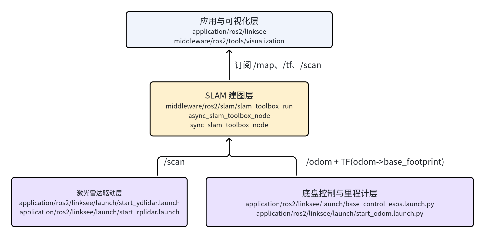
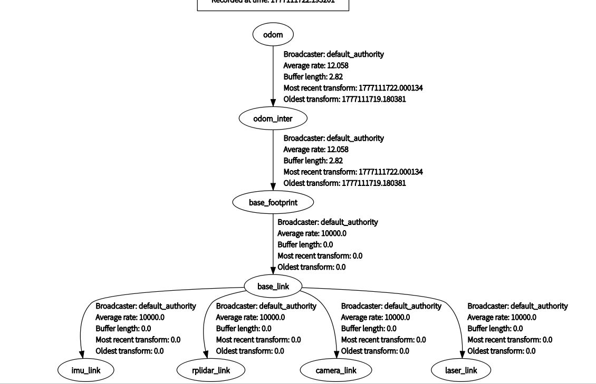
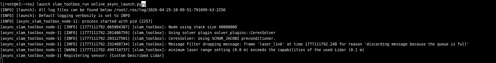
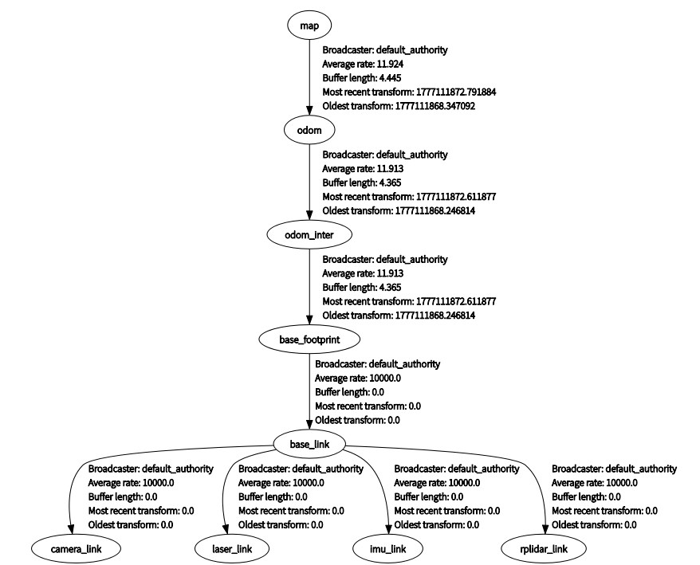
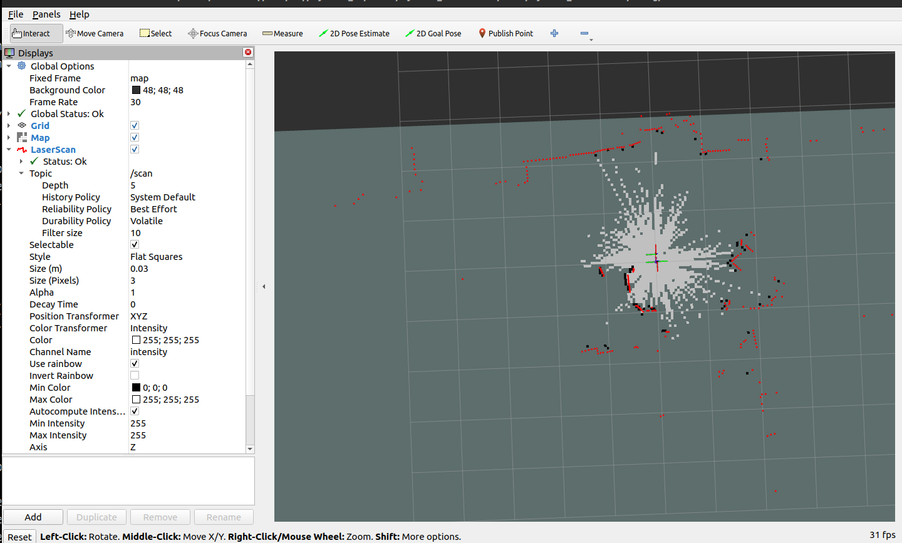
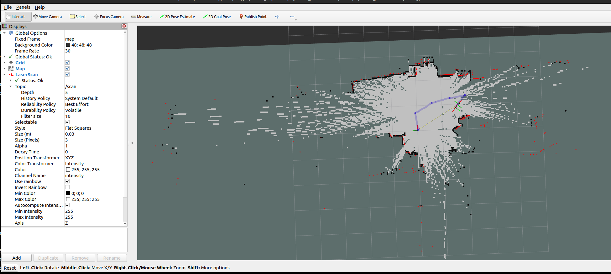

# 定位导航 · slam_toolbox

## 1. 模块概述

- **主要功能**：`slam_toolbox` 模块基于 ROS 2 `slam_toolbox` 组件封装，提供面向当前项目的 **2D 激光实时建图能力**。在本项目中，它位于 `middleware/ros2/slam/slam_toolbox_run`，可在已有激光雷达与里程计/TF 基础链路上快速启动在线建图，用于替代或补充 `cartographer` 方案。
- **规格或特性**：
	- 算法形态：2D 激光 SLAM；
	- 运行模式：异步在线建图、同步在线建图；
	- 推荐模式：异步模式 `online_async_launch.py`；
	- 输入话题：`/scan`；
	- 依赖 TF：`odom -> base_footprint`；
	- 输出话题：`/map`、`/map_metadata`；
	- 配置文件：`mapper_params_online_async.yaml`、`mapper_params_online_sync.yaml`。
- **软件框图**：当前工程中，`slam_toolbox` 在 `linksee` 方案中的位置如下：



- **相关目录结构**：

| 路径 | 职责 |
| --- | --- |
| `middleware/ros2/slam/slam_toolbox_run/launch/online_async_launch.py` | 异步在线建图启动入口 |
| `middleware/ros2/slam/slam_toolbox_run/launch/online_sync.launch.py` | 同步在线建图启动入口 |
| `middleware/ros2/slam/slam_toolbox_run/config/mapper_params_online_async.yaml` | 异步模式参数配置 |
| `middleware/ros2/slam/slam_toolbox_run/config/mapper_params_online_sync.yaml` | 同步模式参数配置 |
| `middleware/ros2/slam/slam_toolbox_run/README.md` | 模块中文说明 |
| `middleware/ros2/tools/visualization/launch/display_slam.launch.py` | 建图可视化入口 |

## 2. 环境准备

### 2.1 前置条件

- **代码获取**

  SDK 源码获取和基础编译环境配置统一参考 [Linksee参考方案](../../03-参考方案/3.2-移动机器人Linksee.md)。完成 SDK 初始化后，回到本文继续执行

- **运行环境**：
	- 推荐系统：K3 Com260 + Bianbu26 LXQT；
	- ROS 版本：ROS 2 Humble；

- **环境变量与初始化**：

```bash
source ~/spacemit_robot/output/staging/setup.bash
```

- **硬件与连接**：
	- 传感器：2D 激光雷达；
	- 调试时建议先确认雷达安装牢固、视野无遮挡。
- **工具与权限**：
	- 若雷达通过串口接入，需具备 `/dev/ttyUSB*` 或 `/dev/ttyACM*` 访问权限；
	- 建图调试推荐配合 RViz 使用；
	- 若需保存地图文件，当前目录需具备写权限。

### 2.2 构建编译

- **本模块编译**：

```bash
cd ~/spacemit_robot
source build/envsetup.sh
lunch # 选择k3-com260-linksee
m
```

- **产物说明**：
	- SDK 构建产物默认位于 `output/staging/`；
	- 单独工作区构建产物位于 `install/slam_toolbox_run/`；
	- 模块本身主要提供 Launch 与 YAML 配置。
- **常见差异说明**：
	- `slam_toolbox_run` 只是启动封装，系统中还需已安装 `slam_toolbox`；
	- 异步模式性能更优，适合大多数实机场景；
	- 同步模式适合对时间一致性要求更高的场景，但实时性可能略低。

## 3. 示例使用

**所有终端都需要：**

```
source ~/spacemit_robot/output/staging/setup.bash
```

**预期现象**：无报错，可识别 `slam_toolbox_run` 包。

**步骤 1：启动底盘与基础坐标链路**

可先启动 `linksee` 底盘控制节点：

```bash
ros2 launch linksee base_control_esos.launch.py
```

终端输出：


**步骤 2：启动激光雷达**

```bash
ros2 launch linksee start_ydlidar.launch.py
```

**预期现象**：`/scan` 持续发布，雷达日志无异常。

终端输出：


**步骤3：启动里程计**

```bash
ros2 launch linksee start_odom.launch.py
```

终端输出：


预期 tf 树




**步骤 4：启动异步建图**

```bash
ros2 launch slam_toolbox_run online_async_launch.py
```

**预期现象**：`async_slam_toolbox_node` 正常拉起，并开始发布 `/map` 与 `/map_metadata`。

终端输出



预期 tf 树



**步骤 5：PC 端可视化**

```bash
source ~/visual_ws/install/setup.bash
ros2 launch visualization display_slam.launch.py
```

**预期现象**：RViz 中可看到激光与实时构建的 2D 地图。



**步骤6**：启动键盘控制

```
ros2 run teleop_twist_keyboard teleop_twist_keyboard
```

四处移动，地图随之扩展




## 4. 应用开发

- **对外 API 或接口形态**：
	- 启动入口：`ros2 launch slam_toolbox_run online_async_launch.py`、`ros2 launch slam_toolbox_run online_sync.launch.py`；
	- 主要输入：`/scan`；
	- 主要输出：`/map`、`/map_metadata`；
	- 依赖 TF：`odom -> base_footprint`；
	- 配置入口：`config/mapper_params_online_async.yaml`、`config/mapper_params_online_sync.yaml`。
- **调用方式与注意点**：
	- 优先保证雷达与 TF 正常，再启动 `slam_toolbox`；
	- 若与其他建图模块联调，同一时刻建议只启用一种建图方案，避免 `/map`、TF 或资源竞争；
	- 异步/同步模式不要同时运行；
	- 参数调优建议集中在 `config/*.yaml` 中进行，避免在运行时频繁改动基础坐标系。
- **参考 demo 或示例路径**：
	- `middleware/ros2/slam/slam_toolbox_run/launch/online_async_launch.py`
	- `middleware/ros2/slam/slam_toolbox_run/launch/online_sync.launch.py`
	- `middleware/ros2/slam/slam_toolbox_run/config/mapper_params_online_async.yaml`
	- `middleware/ros2/tools/visualization/launch/display_slam.launch.py`。

## 5. 调试指南

- **优先检查输入链路**：
	- 确认 `/scan` 正常刷新；
	- 确认 `odom -> base_footprint` TF 可用；
	- 若地图不生成，先不要急于修改参数，先排查输入完整性。
- **模式选择建议**：
	- 实机推荐先跑异步模式；
	- 若出现时间同步相关问题，再评估同步模式；
	- 两种模式现象差异明显时，可用于辅助定位是数据频率问题还是参数问题。
- **可视化联调建议**：
	- 使用 RViz 同时观察 `LaserScan`、`TF`、`Map`；
	- 若能看到激光但无地图，多半是 TF 或节点未正常工作；
	- 若地图畸变明显，多数与底盘运动估计误差、雷达安装偏移或地面打滑有关。
- **与底层同事联调时建议收集**：
	- 雷达型号、安装角度、串口参数；
	- 底盘里程计来源与 TF 发布者；
	- 当前使用异步还是同步模式；
	- 对应 YAML 参数文件及修改记录。

## 6. 常见问题

| 现象 | 可能原因 | 处理 |
| --- | --- | --- |
| 启动 `slam_toolbox_run` 失败，提示找不到 `slam_toolbox` | 系统未安装 `slam_toolbox` 包 | 安装对应 ROS 2 包后重新加载环境 |
| 地图无法生成 | `/scan` 未正常发布或 TF 不完整 | 检查雷达驱动、`/scan` 话题与 `odom -> base_footprint` TF |
| 地图更新卡顿 | 设备算力不足、同步模式开销较大或雷达频率不稳 | 优先切换异步模式，降低系统负载并检查传感器频率 |
| 地图形状扭曲 | 里程计误差大、底盘打滑或雷达安装不稳 | 重新标定底盘参数，检查机械安装和地面条件 |
| RViz 中无地图显示 | `/map` 未发布或 RViz 配置不正确 | 先检查 `slam_toolbox` 日志，再确认 RViz Fixed Frame 与显示项配置 |

