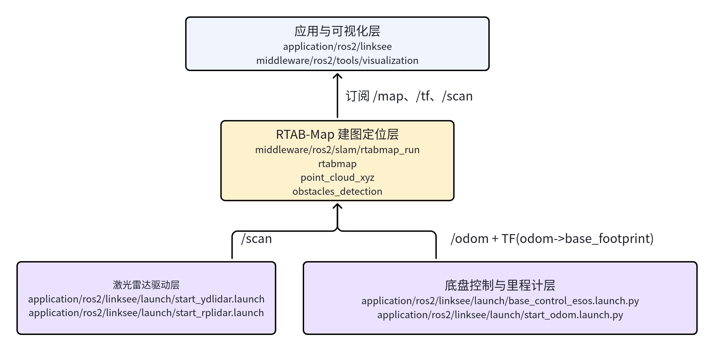
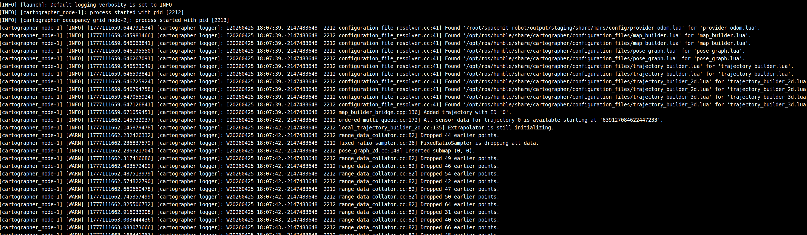
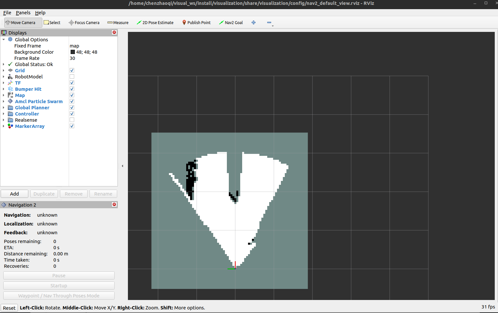

# 定位导航 · rtabmap

## 1. 模块概述

- **主要功能**：`rtabmap` 模块基于 ROS 2 `rtabmap_ros` 组件封装，提供面向当前项目的 **RGB-D 建图/定位能力**，并额外提供一个基于 3D 激光点云的建图启动入口。在本项目中，它位于 `middleware/ros2/slam/rtabmap_run`，适合用于带深度相机的移动机器人进行室内建图、回环检测和后续导航联动。
- **规格或特性**：
	- 算法形态：RGB-D SLAM、定位模式、3D 点云建图；
	- RGB-D 输入：彩色图、深度图、相机内参；
	- 默认 2D 栅格输出：`/map`；
	- 扩展输出：`/camera/cloud`、`/camera/obstacles`、`/camera/ground`；
	- 运行参数：`use_sim_time`、`localization`；
	- 导航联动：可配合 `middleware/ros2/planning/nav2/launch/nav2_rtabmap_rgbd.launch.py` 使用。
- **软件框图**：当前工程中，`rtabmap` 在整体方案中的位置如下：



- **相关目录结构**：

| 路径 | 职责 |
| --- | --- |
| `middleware/ros2/slam/rtabmap_run/launch/rgbd_slam.launch.py` | RGB-D 建图/定位启动入口 |
| `middleware/ros2/slam/rtabmap_run/launch/3d_lidar_slam.launch.py` | 3D 激光点云建图入口 |
| `middleware/ros2/slam/rtabmap_run/README.md` | 模块中文说明 |
| `middleware/ros2/planning/nav2/launch/nav2_rtabmap_rgbd.launch.py` | 基于 RTAB-Map 的导航启动入口 |
| `middleware/ros2/tools/visualization/launch/display_rgbd.launch.py` | RGB-D/导航相关可视化入口 |

## 2. 环境准备

### 2.1 前置条件

- 获取代码

  SDK 源码获取和基础编译环境配置统一参考 [Linksee参考方案](../../03-参考方案/3.2-移动机器人Linksee.md)。完成 SDK 初始化后，回到本文继续执行

- **运行环境**：

	- K3 Com260 + Bianbu26 LXQT；
	- ROS 版本：ROS 2 Humble；

- **依赖与外部资源**：
	- 系统需安装 `rtabmap_ros` 相关包；

	```
	sudo apt install 'ros-humble-rtabmap*' ros-humble-aruco-markers-msgs
	```

	- RGB-D 模式需准备深度相机，并发布以下话题：
	  - `/camera/color/image_raw`
	  - `/camera/color/camera_info`
	  - `/camera/depth/image_rect_raw`
	  - `/camera/depth/camera_info`

- **环境变量与初始化**：

```bash
source ~/spacemit_robot/output/staging/setup.bash
```

- **硬件与连接**：
	- 建议使用 RealSense D415/D435 系列相机；
	- 若用于 `linksee` 方案，需额外保证底盘侧 `/odom` 和 TF 链路正常；
	- RGB-D 相机应固定牢靠，保证彩色与深度图对齐关系正确；
	- 3D LiDAR 使用时，需确认点云坐标系与机器人本体坐标系一致。

### 2.2 构建编译

- **SDK 全量编译：**

```bash
cd ~/spacemit_robot
source build/envsetup.sh
lunch # 选择k3-com260-linksee
m
```

- **产物说明**：
	- SDK 产物位于 `~/spacemit_robot/output/staging/`；
	- 模块主要提供 Launch 封装。
- **常见差异说明**：
	- RGB-D 模式更适合室内近距离建图与导航联动；
	- 3D LiDAR 模式更适合点云建图验证，但当前默认启动内容较精简；
	- 导航联动通常需要额外启动 `nav2_rtabmap_rgbd.launch.py`。

## 3. 示例使用

**前置**：默认 RGB-D 相机驱动、里程计与 TF 已准备就绪。

所有终端都需要导入：`source ~/spacemit_robot/output/staging/setup.bash`

**步骤 1：启动底盘与里程计链路**

如在 `linksee` 实机上验证，可先启动底盘控制和里程计：

```bash
ros2 launch linksee base_control_esos.launch.py
```

终端输出：


启动激光雷达和里程计

```
ros2 launch linksee start_ydlidar.launch.py
ros2 launch linksee start_odom.launch.py
```

终端输出



**预期现象**：`/odom` 与基础 TF 正常。

**步骤2：启动深度相机**

```
ros2 launch realsense2_camera rs_launch.py camera_namespace:=/
```

终端输出：


**步骤 3：启动 RGB-D 建图**

```bash
ros2 launch rtabmap_run rgbd_slam.launch.py
```

**预期现象**：`rtabmap`、`point_cloud_xyz`、`obstacles_detection` 等节点正常启动；开始发布 `/map`、`/camera/cloud`、`/camera/obstacles`、`/camera/ground`。

终端输出


**步骤 4：PC 端可视化**

```bash
source ~/visual_ws/install/setup.bash
ros2 launch visualization display_rgbd.launch.py
```

**预期现象**：RViz 中可看到 RGB-D 相关可视化结果、点云与地图更新。



**步骤5：启动键盘控制**

```
ros2 run teleop_twist_keyboard teleop_twist_keyboard
```

使用键盘控制移动，扩大建图范围

**预期效果**


## 4. 应用开发

- **对外 API 或接口形态**：
	- 启动入口：`ros2 launch rtabmap_run rgbd_slam.launch.py`、`ros2 launch rtabmap_run 3d_lidar_slam.launch.py`；
	- 导航入口：`ros2 launch nav2 nav2_rtabmap_rgbd.launch.py`；
	- RGB-D 输入话题：`/camera/color/image_raw`、`/camera/color/camera_info`、`/camera/depth/image_rect_raw`、`/camera/depth/camera_info`；
	- 3D 点云输入话题：`/points`；
	- 输出话题：`/map`、`/camera/cloud`、`/camera/obstacles`、`/camera/ground`；
	- 运行参数：`use_sim_time`、`localization`。
- **调用方式与注意点**：
	- RGB-D 模式对相机内参与时间同步较敏感，先确认图像链路稳定；
	- 定位模式依赖已有数据库，若数据库不存在则无法正常重定位；
	- 与导航联动时，应明确地图/定位数据来源，避免多套 SLAM 或定位模块同时输出冲突信息；
	- 3D LiDAR 启动入口当前默认只启用核心 `rtabmap` 节点，若需更完整链路，应进一步扩展 launch。
- **参考 demo 或示例路径**：
	- `middleware/ros2/slam/rtabmap_run/launch/rgbd_slam.launch.py`
	- `middleware/ros2/slam/rtabmap_run/launch/3d_lidar_slam.launch.py`
	- `middleware/ros2/planning/nav2/launch/nav2_rtabmap_rgbd.launch.py`
	- `middleware/ros2/tools/visualization/launch/display_rgbd.launch.py`。

## 5. 调试指南

- **优先检查传感器输入**：
	- RGB 图像、深度图、相机参数必须同时完整；
	- 深度图无数据时，点云链路通常也不会正常；
	- 3D LiDAR 模式下，需重点确认 `/points` 点云坐标系与频率。
- **里程计与 TF 排查**：
	- `rtabmap` 对 `odom -> base_footprint` 精度较敏感；
	- 建图漂移时，优先排查底盘里程计和相机安装外参。
- **定位模式排查**：
	- 确认 `~/.ros/rtabmap.db` 是否存在；
	- 若数据库损坏或为空，建议重新建图；
	- 若能启动但无法稳定定位，需检查当前环境与建图库场景差异是否过大。
- **可视化建议**：
	- 使用 `display_rgbd.launch.py` 或 `display_navigation.launch.py` 检查点云、地图和导航状态；
	- 若只有图像无地图，通常是 `rtabmap` 主节点未正常工作或输入不完整；
	- 若地图有但障碍物/地面分割异常，需重点检查深度图质量与相机安装高度。
- **联调建议收集的信息**：
	- 相机型号、分辨率、帧率、话题名；
	- 深度图是否对齐、相机外参是否固定；
	- 当前运行模式是建图、定位还是 3D LiDAR；
	- 数据库文件、启动参数与导航参数文件路径。

## 6. 常见问题

| 现象 | 可能原因 | 处理 |
| --- | --- | --- |
| `rgbd_slam.launch.py` 启动失败 | 系统未安装 `rtabmap_ros` 或相机话题不完整 | 安装 RTAB-Map 依赖，并检查 RGB、Depth、CameraInfo 话题 |
| 建图漂移严重 | 里程计误差大、相机外参不准或场景纹理不足 | 检查 `/odom`、TF、相机安装姿态，必要时重新标定 |
| 没有点云输出 | 深度图未发布、话题名不匹配或深度数据异常 | 检查 `/camera/depth/image_rect_raw` 与相关 remap 配置 |
| 定位模式无法启动 | 缺少 `~/.ros/rtabmap.db` 或数据库不可用 | 确认数据库存在且可读，必要时重新建图生成 |
| 导航启动后定位不稳定 | RTAB-Map 输出与导航参数不匹配，或多模块同时发布定位信息 | 检查 `nav2_rtabmap_rgbd.launch.py` 参数，避免同时启用其他定位/SLAM 模块 |
| 3D LiDAR 模式效果不佳 | 点云质量不足、坐标系不正确或默认 launch 链路较简化 | 先确认 `/points` 数据质量，再按实际需求补充 ICP/可视化节点 |
